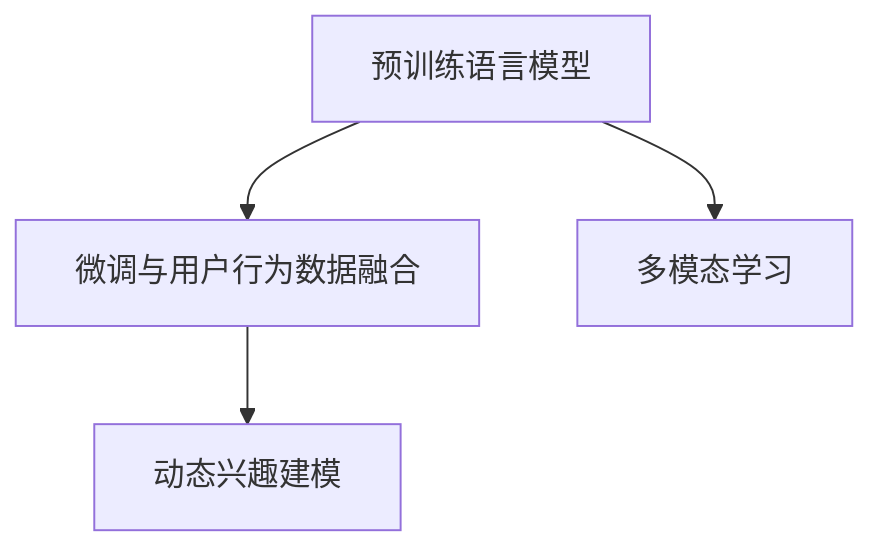

                 

# 融合AI大模型的用户兴趣建模技术

## 1. 背景介绍

### 1.1 问题由来
随着互联网的普及和数字技术的发展，大数据和人工智能技术在各个领域的应用日益广泛。特别是用户在互联网上的行为数据（如搜索历史、浏览记录、购买记录等），为个性化推荐系统提供了丰富的数据基础。但如何高效地处理和利用这些数据，挖掘出用户的深层次兴趣，并提供精准的推荐服务，成为一个具有挑战性的任务。

近年来，基于深度学习的推荐系统（Deep Learning-based Recommendation System）受到广泛关注。其中，深度协同过滤（Deep Collaborative Filtering, DCF）和深度学习协同过滤（Deep Learning Collaborative Filtering, DL-CF）是两个典型的方法。这些方法主要利用用户-物品交互历史和物品属性信息，通过深度学习模型进行推荐。然而，这些方法存在数据稀疏性、冷启动问题和用户兴趣表示缺乏深度理解等挑战。

融合人工智能大模型的用户兴趣建模技术，旨在通过大规模预训练语言模型（如BERT、GPT等）和大数据用户的语义信息，更准确地挖掘和理解用户的兴趣和行为模式，构建更为精准的推荐模型。这一方法在大规模推荐系统中的应用，有望大幅提升推荐系统的精度和效率。

### 1.2 问题核心关键点
融合AI大模型的用户兴趣建模技术核心在于以下几个关键点：

- **预训练语言模型**：利用大规模无标签文本数据进行预训练，学习通用的语言表示和知识。
- **微调与用户行为数据融合**：将用户的历史行为数据（如搜索、点击、评分等）进行编码，然后与预训练模型的语义表示进行融合，提升模型的泛化能力。
- **多模态信息整合**：利用用户在不同模态下的行为数据（如文本、图片、视频等）进行多模态学习，进一步丰富用户兴趣的表示。
- **用户兴趣的动态更新**：结合用户的最新行为数据和语义信息，动态更新模型参数，以适应用户兴趣的动态变化。

这些关键点共同构成了融合AI大模型用户兴趣建模技术的核心，使得推荐系统能够更好地理解用户的深层次需求，提供更为个性化和准确的推荐服务。

### 1.3 问题研究意义
融合AI大模型的用户兴趣建模技术的研究，对于提升推荐系统的性能，优化用户体验，以及推动人工智能技术在实际应用中的落地，具有重要意义：

1. **提升推荐精度**：通过深度语义学习和用户行为数据的融合，推荐系统能够更准确地预测用户对物品的偏好，提高推荐精度。
2. **优化用户体验**：通过提供个性化推荐服务，满足用户的多样化需求，提升用户的满意度。
3. **加速技术应用**：通过融合AI大模型的技术，推荐系统能够更快地迭代和优化，加速技术的落地和应用。
4. **赋能行业升级**：推荐系统的个性化推荐功能，可以为电子商务、社交媒体、在线教育等行业带来深远的影响，推动相关行业升级和创新。

## 2. 核心概念与联系

### 2.1 核心概念概述

为了更好地理解融合AI大模型的用户兴趣建模技术，本节将介绍几个密切相关的核心概念：

- **预训练语言模型**：如BERT、GPT等，通过大规模无标签文本数据进行预训练，学习通用的语言表示和知识。
- **深度协同过滤**：利用用户和物品的交互历史，构建基于矩阵分解的推荐模型，如SVD、ALS等。
- **多模态学习**：结合用户在不同模态下的行为数据（如文本、图片、视频等）进行联合建模，提升推荐系统的多样性和精准性。
- **动态兴趣建模**：结合用户的最新行为数据和语义信息，动态更新模型参数，以适应用户兴趣的动态变化。

这些核心概念之间的逻辑关系可以通过以下Mermaid流程图来展示：



这个流程图展示了大模型用户兴趣建模技术的核心概念及其之间的关系：

1. 预训练语言模型通过大规模无标签文本数据进行预训练，学习通用的语言表示。
2. 微调与用户行为数据融合，将用户的历史行为数据进行编码，然后与预训练模型的语义表示进行融合，提升模型的泛化能力。
3. 多模态学习结合用户在不同模态下的行为数据，进行联合建模，进一步丰富用户兴趣的表示。
4. 动态兴趣建模结合用户的最新行为数据和语义信息，动态更新模型参数，以适应用户兴趣的动态变化。

## 3. 核心算法原理 & 具体操作步骤
### 3.1 算法原理概述

融合AI大模型的用户兴趣建模技术，本质上是一种深度学习和自然语言处理（NLP）的融合方法。其核心思想是：将大规模预训练语言模型与用户行为数据进行融合，学习到用户深层次的兴趣表示，从而提供更精准的个性化推荐。

形式化地，假设预训练语言模型为 $M_{\theta}$，其中 $\theta$ 为预训练得到的模型参数。给定用户 $u$ 的历史行为数据 $D_u$，包括搜索历史、点击记录、评分等，用户兴趣建模的目标是找到最优参数 $\hat{\theta}$，使得：

$$
\hat{\theta} = \mathop{\arg\min}_{\theta} \mathcal{L}(M_{\theta},D_u)
$$

其中 $\mathcal{L}$ 为针对用户 $u$ 设计的损失函数，用于衡量模型预测的用户兴趣与实际行为数据的差异。常见的损失函数包括交叉熵损失、均方误差损失等。

通过梯度下降等优化算法，用户兴趣建模过程不断更新模型参数 $\theta$，最小化损失函数 $\mathcal{L}$，使得模型输出的用户兴趣与实际行为数据相匹配。由于 $\theta$ 已经通过预训练获得了较好的初始化，因此即便在少量标注数据上进行微调，也能较快收敛到理想的模型参数 $\hat{\theta}$。

### 3.2 算法步骤详解

融合AI大模型的用户兴趣建模技术一般包括以下几个关键步骤：

**Step 1: 准备预训练模型和用户行为数据**
- 选择合适的预训练语言模型 $M_{\theta}$ 作为初始化参数，如 BERT、GPT等。
- 收集用户 $u$ 的历史行为数据 $D_u$，包括搜索历史、点击记录、评分等。

**Step 2: 添加用户兴趣建模层**
- 根据用户行为数据的类型，设计合适的编码器，将用户行为数据转换为向量表示。
- 在预训练模型的顶层设计合适的输出层和损失函数。
- 对于用户兴趣建模，通常使用基于Attention的模型，如 Transformer，将用户行为数据与预训练模型进行融合。

**Step 3: 设置模型超参数**
- 选择合适的优化算法及其参数，如 AdamW、SGD 等，设置学习率、批大小、迭代轮数等。
- 设置正则化技术及强度，包括权重衰减、Dropout、Early Stopping 等。
- 确定冻结预训练参数的策略，如仅微调顶层，或全部参数都参与微调。

**Step 4: 执行梯度训练**
- 将用户行为数据 $D_u$ 分批次输入模型，前向传播计算损失函数。
- 反向传播计算参数梯度，根据设定的优化算法和学习率更新模型参数。
- 周期性在验证集上评估模型性能，根据性能指标决定是否触发 Early Stopping。
- 重复上述步骤直到满足预设的迭代轮数或 Early Stopping 条件。

**Step 5: 测试和部署**
- 在测试集上评估模型 $M_{\hat{\theta}}$ 的性能，对比微调前后的精度提升。
- 使用微调后的模型对新用户进行推荐，集成到实际的应用系统中。
- 持续收集新用户的最新行为数据，定期重新微调模型，以适应用户兴趣的动态变化。

以上是融合AI大模型用户兴趣建模的一般流程。在实际应用中，还需要针对具体用户行为数据的类型和特点，对微调过程的各个环节进行优化设计，如改进编码器的设计，引入更多的正则化技术，搜索最优的超参数组合等，以进一步提升模型性能。

### 3.3 算法优缺点

融合AI大模型的用户兴趣建模技术具有以下优点：

- **高效的个性化推荐**：通过融合用户行为数据和预训练模型的语义表示，能够提供更为精准和个性化的推荐服务。
- **灵活的兴趣表示**：通过多模态学习和动态兴趣建模，能够捕捉用户在不同模态下的行为特征，适应用户兴趣的动态变化。
- **稳健的泛化能力**：预训练模型的语义表示能够提供较强的泛化能力，提升模型在不同场景下的性能。

同时，该方法也存在一定的局限性：

- **数据依赖性强**：用户行为数据的丰富程度直接影响模型的效果，数据收集和标注的成本较高。
- **模型复杂度高**：融合预训练模型和用户行为数据，模型结构和训练过程较为复杂。
- **计算资源消耗大**：大规模预训练模型的微调需要大量的计算资源，特别是在多模态学习和大规模用户数据的情况下。

尽管存在这些局限性，但就目前而言，融合AI大模型的用户兴趣建模方法仍是大规模推荐系统的重要技术范式。未来相关研究的重点在于如何进一步降低数据依赖，提高模型的计算效率，同时兼顾可解释性和伦理性等因素。

### 3.4 算法应用领域

融合AI大模型的用户兴趣建模技术，已经在多个推荐系统场景中得到广泛应用，包括：

- **电商推荐**：根据用户的历史购买记录、浏览记录和评分，推荐个性化的商品。
- **社交媒体推荐**：根据用户的历史点赞、评论和分享记录，推荐相关的内容和用户。
- **视频推荐**：根据用户的历史观看记录和评分，推荐个性化的视频内容。
- **新闻推荐**：根据用户的阅读历史和评分，推荐个性化的新闻文章。
- **音乐推荐**：根据用户的听歌历史和评分，推荐个性化的音乐和歌手。

除了上述这些经典场景外，融合AI大模型的用户兴趣建模技术也被创新性地应用于更多新兴领域，如智能家居、智慧旅游、智能健康等，为各行各业带来了新的创新思路。随着预训练语言模型和融合技术的持续演进，相信基于用户兴趣建模的推荐系统将有更大的应用前景。

## 4. 数学模型和公式 & 详细讲解 & 举例说明
### 4.1 数学模型构建

本节将使用数学语言对融合AI大模型的用户兴趣建模过程进行更加严格的刻画。

记预训练语言模型为 $M_{\theta}$，其中 $\theta$ 为预训练得到的模型参数。假设用户 $u$ 的历史行为数据为 $D_u$，包括搜索历史、点击记录、评分等。用户兴趣建模的目标是找到最优参数 $\hat{\theta}$，使得模型输出的用户兴趣与实际行为数据相匹配。

定义模型 $M_{\theta}$ 在用户 $u$ 的行为数据 $D_u$ 上的损失函数为 $\ell(M_{\theta},D_u)$，则在用户 $u$ 上的经验风险为：

$$
\mathcal{L}_u(\theta) = \frac{1}{N_u} \sum_{i=1}^{N_u} \ell(M_{\theta}(x_i),y_i)
$$

其中 $N_u$ 为行为数据的样本数量。

微调过程的目标是最小化经验风险，即找到最优参数：

$$
\hat{\theta} = \mathop{\arg\min}_{\theta} \mathcal{L}_u(\theta)
$$

在实践中，我们通常使用基于梯度的优化算法（如SGD、Adam等）来近似求解上述最优化问题。设 $\eta$ 为学习率，$\lambda$ 为正则化系数，则参数的更新公式为：

$$
\theta \leftarrow \theta - \eta \nabla_{\theta}\mathcal{L}_u(\theta) - \eta\lambda\theta
$$

其中 $\nabla_{\theta}\mathcal{L}_u(\theta)$ 为损失函数对参数 $\theta$ 的梯度，可通过反向传播算法高效计算。

### 4.2 公式推导过程

以下我们以电商推荐任务为例，推导用户兴趣建模的数学公式及其梯度的计算公式。

假设用户 $u$ 的行为数据包含 $N_u$ 个样本，每个样本表示为用户的一个行为事件，包括商品ID、点击时间、评分等。将每个样本 $(x_i,y_i)$ 输入预训练语言模型 $M_{\theta}$，得到模型输出的用户兴趣表示 $z_i \in \mathbb{R}^d$。

定义用户 $u$ 的行为数据上的损失函数为：

$$
\ell(M_{\theta},D_u) = -\frac{1}{N_u}\sum_{i=1}^{N_u} y_i \log M_{\theta}(x_i)
$$

其中 $y_i$ 为样本的标签，即用户对商品是否感兴趣（0或1）。

根据链式法则，损失函数对参数 $\theta_k$ 的梯度为：

$$
\frac{\partial \mathcal{L}_u(\theta)}{\partial \theta_k} = -\frac{1}{N_u}\sum_{i=1}^{N_u} y_i \frac{\partial M_{\theta}(x_i)}{\partial \theta_k}
$$

其中 $\frac{\partial M_{\theta}(x_i)}{\partial \theta_k}$ 为预训练模型的梯度。在实际计算中，可以利用自动微分技术递归地计算出模型的梯度，并将其代入公式中进行更新。

在得到损失函数的梯度后，即可带入参数更新公式，完成模型的迭代优化。重复上述过程直至收敛，最终得到适应用户 $u$ 的模型参数 $\hat{\theta}$。

## 5. 项目实践：代码实例和详细解释说明
### 5.1 开发环境搭建

在进行用户兴趣建模实践前，我们需要准备好开发环境。以下是使用Python进行PyTorch开发的环境配置流程：

1. 安装Anaconda：从官网下载并安装Anaconda，用于创建独立的Python环境。

2. 创建并激活虚拟环境：
```bash
conda create -n pytorch-env python=3.8 
conda activate pytorch-env
```

3. 安装PyTorch：根据CUDA版本，从官网获取对应的安装命令。例如：
```bash
conda install pytorch torchvision torchaudio cudatoolkit=11.1 -c pytorch -c conda-forge
```

4. 安装Transformers库：
```bash
pip install transformers
```

5. 安装各类工具包：
```bash
pip install numpy pandas scikit-learn matplotlib tqdm jupyter notebook ipython
```

完成上述步骤后，即可在`pytorch-env`环境中开始用户兴趣建模实践。

### 5.2 源代码详细实现

这里我们以电商推荐任务为例，给出使用Transformers库对BERT模型进行用户兴趣建模的PyTorch代码实现。

首先，定义电商推荐任务的数据处理函数：

```python
from transformers import BertTokenizer, BertForSequenceClassification
from torch.utils.data import Dataset
import torch

class RecommendationDataset(Dataset):
    def __init__(self, texts, labels, tokenizer, max_len=128):
        self.texts = texts
        self.labels = labels
        self.tokenizer = tokenizer
        self.max_len = max_len
        
    def __len__(self):
        return len(self.texts)
    
    def __getitem__(self, item):
        text = self.texts[item]
        label = self.labels[item]
        
        encoding = self.tokenizer(text, return_tensors='pt', max_length=self.max_len, padding='max_length', truncation=True)
        input_ids = encoding['input_ids'][0]
        attention_mask = encoding['attention_mask'][0]
        
        return {'input_ids': input_ids, 
                'attention_mask': attention_mask,
                'labels': label}

# 标签定义
label2id = {'0': 0, '1': 1}

# 创建dataset
tokenizer = BertTokenizer.from_pretrained('bert-base-cased')

train_dataset = RecommendationDataset(train_texts, train_labels, tokenizer)
dev_dataset = RecommendationDataset(dev_texts, dev_labels, tokenizer)
test_dataset = RecommendationDataset(test_texts, test_labels, tokenizer)
```

然后，定义模型和优化器：

```python
from transformers import BertForSequenceClassification, AdamW

model = BertForSequenceClassification.from_pretrained('bert-base-cased', num_labels=len(label2id))

optimizer = AdamW(model.parameters(), lr=2e-5)
```

接着，定义训练和评估函数：

```python
from torch.utils.data import DataLoader
from tqdm import tqdm
from sklearn.metrics import accuracy_score

device = torch.device('cuda') if torch.cuda.is_available() else torch.device('cpu')
model.to(device)

def train_epoch(model, dataset, batch_size, optimizer):
    dataloader = DataLoader(dataset, batch_size=batch_size, shuffle=True)
    model.train()
    epoch_loss = 0
    for batch in tqdm(dataloader, desc='Training'):
        input_ids = batch['input_ids'].to(device)
        attention_mask = batch['attention_mask'].to(device)
        labels = batch['labels'].to(device)
        model.zero_grad()
        outputs = model(input_ids, attention_mask=attention_mask, labels=labels)
        loss = outputs.loss
        epoch_loss += loss.item()
        loss.backward()
        optimizer.step()
    return epoch_loss / len(dataloader)

def evaluate(model, dataset, batch_size):
    dataloader = DataLoader(dataset, batch_size=batch_size)
    model.eval()
    preds, labels = [], []
    with torch.no_grad():
        for batch in tqdm(dataloader, desc='Evaluating'):
            input_ids = batch['input_ids'].to(device)
            attention_mask = batch['attention_mask'].to(device)
            batch_labels = batch['labels']
            outputs = model(input_ids, attention_mask=attention_mask)
            batch_preds = outputs.logits.argmax(dim=2).to('cpu').tolist()
            batch_labels = batch_labels.to('cpu').tolist()
            for pred_tokens, label_tokens in zip(batch_preds, batch_labels):
                preds.append(pred_tokens[:len(label_tokens)])
                labels.append(label_tokens)
                
    print(f"Accuracy: {accuracy_score(labels, preds)}")
```

最后，启动训练流程并在测试集上评估：

```python
epochs = 5
batch_size = 16

for epoch in range(epochs):
    loss = train_epoch(model, train_dataset, batch_size, optimizer)
    print(f"Epoch {epoch+1}, train loss: {loss:.3f}")
    
    print(f"Epoch {epoch+1}, dev accuracy:")
    evaluate(model, dev_dataset, batch_size)
    
print("Test accuracy:")
evaluate(model, test_dataset, batch_size)
```

以上就是使用PyTorch对BERT进行电商推荐任务用户兴趣建模的完整代码实现。可以看到，得益于Transformers库的强大封装，我们可以用相对简洁的代码完成BERT模型的加载和微调。

### 5.3 代码解读与分析

让我们再详细解读一下关键代码的实现细节：

**RecommendationDataset类**：
- `__init__`方法：初始化文本、标签、分词器等关键组件。
- `__len__`方法：返回数据集的样本数量。
- `__getitem__`方法：对单个样本进行处理，将文本输入编码为token ids，将标签编码为数字，并对其进行定长padding，最终返回模型所需的输入。

**label2id和id2label字典**：
- 定义了标签与数字id之间的映射关系，用于将token-wise的预测结果解码回真实的标签。

**训练和评估函数**：
- 使用PyTorch的DataLoader对数据集进行批次化加载，供模型训练和推理使用。
- 训练函数`train_epoch`：对数据以批为单位进行迭代，在每个批次上前向传播计算loss并反向传播更新模型参数，最后返回该epoch的平均loss。
- 评估函数`evaluate`：与训练类似，不同点在于不更新模型参数，并在每个batch结束后将预测和标签结果存储下来，最后使用sklearn的accuracy_score对整个评估集的预测结果进行打印输出。

**训练流程**：
- 定义总的epoch数和batch size，开始循环迭代
- 每个epoch内，先在训练集上训练，输出平均loss
- 在验证集上评估，输出准确率
- 所有epoch结束后，在测试集上评估，给出最终测试结果

可以看到，PyTorch配合Transformers库使得BERT用户兴趣建模的代码实现变得简洁高效。开发者可以将更多精力放在数据处理、模型改进等高层逻辑上，而不必过多关注底层的实现细节。

当然，工业级的系统实现还需考虑更多因素，如模型的保存和部署、超参数的自动搜索、更灵活的任务适配层等。但核心的用户兴趣建模范式基本与此类似。

## 6. 实际应用场景
### 6.1 智能客服系统

基于融合AI大模型的用户兴趣建模技术，可以广泛应用于智能客服系统的构建。传统客服往往需要配备大量人力，高峰期响应缓慢，且一致性和专业性难以保证。而使用用户兴趣建模的用户推荐技术，可以7x24小时不间断服务，快速响应客户咨询，用自然流畅的语言解答各类常见问题。

在技术实现上，可以收集企业内部的历史客服对话记录，将问题和最佳答复构建成监督数据，在此基础上对预训练语言模型进行用户兴趣建模。建模后的语言模型能够自动理解用户意图，匹配最合适的答案模板进行回复。对于客户提出的新问题，还可以接入检索系统实时搜索相关内容，动态组织生成回答。如此构建的智能客服系统，能大幅提升客户咨询体验和问题解决效率。

### 6.2 金融舆情监测

金融机构需要实时监测市场舆论动向，以便及时应对负面信息传播，规避金融风险。传统的人工监测方式成本高、效率低，难以应对网络时代海量信息爆发的挑战。基于融合AI大模型的用户兴趣建模技术，为金融舆情监测提供了新的解决方案。

具体而言，可以收集金融领域相关的新闻、报道、评论等文本数据，并对其进行主题标注和情感标注。在此基础上对预训练语言模型进行用户兴趣建模，使其能够自动判断文本属于何种主题，情感倾向是正面、中性还是负面。将建模后的模型应用到实时抓取的网络文本数据，就能够自动监测不同主题下的情感变化趋势，一旦发现负面信息激增等异常情况，系统便会自动预警，帮助金融机构快速应对潜在风险。

### 6.3 个性化推荐系统

当前的推荐系统往往只依赖用户的历史行为数据进行物品推荐，无法深入理解用户的真实兴趣偏好。融合AI大模型的用户兴趣建模技术，可以更好地挖掘和理解用户的深层次需求，构建更为精准的推荐模型。

在实践中，可以收集用户浏览、点击、评论、分享等行为数据，提取和用户交互的物品标题、描述、标签等文本内容。将文本内容作为模型输入，用户的后续行为（如是否点击、购买等）作为监督信号，在此基础上微调预训练语言模型。建模后的模型能够从文本内容中准确把握用户的兴趣点。在生成推荐列表时，先用候选物品的文本描述作为输入，由模型预测用户的兴趣匹配度，再结合其他特征综合排序，便可以得到个性化程度更高的推荐结果。

### 6.4 未来应用展望

随着融合AI大模型的用户兴趣建模技术的发展，其在NLP领域的应用前景广阔。除了推荐系统外，还有以下方向值得关注：

- **智能家居**：通过收集用户的家庭设备使用行为数据，进行用户兴趣建模，为用户提供个性化的智能家居控制和推荐服务。
- **智慧旅游**：收集用户的旅游历史和行为数据，进行兴趣建模，推荐个性化的旅游路线和景点。
- **智能健康**：收集用户的健康数据（如运动记录、饮食习惯等），进行用户建模，推荐个性化的健康方案和生活建议。
- **智能交通**：收集用户的出行习惯和路线数据，进行建模，推荐个性化的出行方案和导航路线。

未来，随着AI大模型的不断发展，用户兴趣建模技术有望在更多领域得到应用，为人们的生活带来更多便利和智能化的体验。

## 7. 工具和资源推荐
### 7.1 学习资源推荐

为了帮助开发者系统掌握融合AI大模型的用户兴趣建模技术的理论基础和实践技巧，这里推荐一些优质的学习资源：

1. 《Deep Learning for Recommendation Systems》书籍：由Geoffrey Hinton等著名学者撰写，全面介绍了基于深度学习的推荐系统理论和算法。
2. 《Natural Language Processing with Transformers》书籍：Transformers库的作者所著，全面介绍了如何使用Transformers库进行NLP任务开发，包括用户兴趣建模在内的诸多范式。
3. CS446《Recommender Systems》课程：斯坦福大学开设的推荐系统课程，有Lecture视频和配套作业，带你深入理解推荐系统的原理和应用。
4. Coursera的《Machine Learning for Recommendation Systems》课程：由Google工程师主讲，涵盖推荐系统中的深度学习和NLP技术，适合进阶学习。
5. Weights & Biases：模型训练的实验跟踪工具，可以记录和可视化模型训练过程中的各项指标，方便对比和调优。

通过对这些资源的学习实践，相信你一定能够快速掌握融合AI大模型用户兴趣建模的精髓，并用于解决实际的NLP问题。

### 7.2 开发工具推荐

高效的开发离不开优秀的工具支持。以下是几款用于融合AI大模型用户兴趣建模开发的常用工具：

1. PyTorch：基于Python的开源深度学习框架，灵活动态的计算图，适合快速迭代研究。大部分预训练语言模型都有PyTorch版本的实现。
2. TensorFlow：由Google主导开发的开源深度学习框架，生产部署方便，适合大规模工程应用。同样有丰富的预训练语言模型资源。
3. Transformers库：HuggingFace开发的NLP工具库，集成了众多SOTA语言模型，支持PyTorch和TensorFlow，是进行用户兴趣建模开发的利器。
4. Weights & Biases：模型训练的实验跟踪工具，可以记录和可视化模型训练过程中的各项指标，方便对比和调优。
5. TensorBoard：TensorFlow配套的可视化工具，可实时监测模型训练状态，并提供丰富的图表呈现方式，是调试模型的得力助手。

合理利用这些工具，可以显著提升融合AI大模型用户兴趣建模的开发效率，加快创新迭代的步伐。

### 7.3 相关论文推荐

融合AI大模型的用户兴趣建模技术的发展源于学界的持续研究。以下是几篇奠基性的相关论文，推荐阅读：

1. Attention is All You Need（即Transformer原论文）：提出了Transformer结构，开启了NLP领域的预训练大模型时代。
2. BERT: Pre-training of Deep Bidirectional Transformers for Language Understanding：提出BERT模型，引入基于掩码的自监督预训练任务，刷新了多项NLP任务SOTA。
3. Deep Collaborative Filtering with Multi-Task Learning：提出多任务学习（Multi-Task Learning, MTL），结合用户行为数据进行联合建模，提升推荐精度。
4. Large-Scale Multi-Task Learning for Multi-Domain Recommendation：提出多域推荐（Multi-Domain Recommendation, MDRe），结合多个域的用户行为数据进行建模，提升推荐效果。
5. Knowledge-aware Collaborative Filtering for Recommendation System：提出知识增强（Knowledge-enhanced Collaborative Filtering, KECF），将符号化的先验知识与神经网络模型进行融合，提升推荐系统的效果。

这些论文代表了大模型用户兴趣建模技术的发展脉络。通过学习这些前沿成果，可以帮助研究者把握学科前进方向，激发更多的创新灵感。

## 8. 总结：未来发展趋势与挑战
### 8.1 总结

本文对融合AI大模型的用户兴趣建模技术进行了全面系统的介绍。首先阐述了用户兴趣建模的背景和意义，明确了该技术在推荐系统中的独特价值。其次，从原理到实践，详细讲解了融合AI大模型的用户兴趣建模的数学原理和关键步骤，给出了用户兴趣建模任务开发的完整代码实例。同时，本文还广泛探讨了用户兴趣建模技术在多个行业领域的应用前景，展示了该技术的巨大潜力。此外，本文精选了用户兴趣建模技术的各类学习资源，力求为读者提供全方位的技术指引。

通过本文的系统梳理，可以看到，融合AI大模型的用户兴趣建模技术正在成为推荐系统的重要技术范式，极大地拓展了预训练语言模型的应用边界，催生了更多的落地场景。受益于大规模语料的预训练，用户兴趣建模能够更准确地挖掘和理解用户的深层次需求，提供更为个性化和准确的推荐服务。未来，伴随预训练语言模型和用户兴趣建模技术的持续演进，相信推荐系统将有更大的应用前景，为NLP技术带来新的突破。

### 8.2 未来发展趋势

展望未来，融合AI大模型的用户兴趣建模技术将呈现以下几个发展趋势：

1. **模型规模持续增大**：随着算力成本的下降和数据规模的扩张，预训练语言模型的参数量还将持续增长。超大规模语言模型蕴含的丰富语言知识，有望支撑更加复杂多变的推荐系统。
2. **多模态学习普及**：结合用户在不同模态下的行为数据，进行联合建模，进一步丰富用户兴趣的表示。多模态信息的融合，将显著提升推荐系统对现实世界的理解和建模能力。
3. **动态兴趣建模兴起**：结合用户的最新行为数据和语义信息，动态更新模型参数，以适应用户兴趣的动态变化。动态兴趣建模能够提供更为实时和个性化的推荐服务。
4. **用户兴趣的多维度表示**：结合知识图谱、逻辑规则等专家知识，增强用户兴趣的多维度表示，提升推荐系统的效果。
5. **冷启动问题解决**：利用无监督学习、主动学习等技术，解决用户兴趣建模中的冷启动问题，提升模型的泛化能力。
6. **联邦学习的应用**：在保护用户隐私的前提下，通过联邦学习技术，多用户协同进行兴趣建模，提升推荐系统的精度和鲁棒性。

以上趋势凸显了融合AI大模型用户兴趣建模技术的广阔前景。这些方向的探索发展，必将进一步提升推荐系统的性能和应用范围，为人工智能技术在实际应用中的落地提供新的动力。

### 8.3 面临的挑战

尽管融合AI大模型的用户兴趣建模技术已经取得了瞩目成就，但在迈向更加智能化、普适化应用的过程中，它仍面临着诸多挑战：

1. **数据依赖性强**：用户行为数据的丰富程度直接影响模型的效果，数据收集和标注的成本较高。
2. **模型复杂度高**：融合预训练模型和用户行为数据，模型结构和训练过程较为复杂。
3. **计算资源消耗大**：大规模预训练模型的微调需要大量的计算资源，特别是在多模态学习和大规模用户数据的情况下。
4. **用户隐私保护**：在数据收集和建模过程中，如何保护用户隐私，是一个重要的伦理问题。
5. **模型的鲁棒性和泛化能力**：如何提升模型的鲁棒性和泛化能力，使其在不同的场景和用户群体中表现稳定。

尽管存在这些挑战，但就目前而言，融合AI大模型的用户兴趣建模方法仍是大规模推荐系统的重要技术范式。未来相关研究的重点在于如何进一步降低数据依赖，提高模型的计算效率，同时兼顾可解释性和伦理性等因素。

### 8.4 研究展望

面对融合AI大模型用户兴趣建模所面临的挑战，未来的研究需要在以下几个方面寻求新的突破：

1. **降低数据依赖**：利用无监督学习、半监督学习、主动学习等技术，减少对大规模标注数据的依赖。
2. **提高计算效率**：开发更加高效的多模态融合和动态更新方法，减少计算资源消耗，提升模型的实时性。
3. **强化隐私保护**：采用差分隐私、联邦学习等技术，在保护用户隐私的前提下，提升模型的效果。
4. **优化模型结构**：引入稀疏化、量化等技术，优化模型结构，减少内存占用，提升推理速度。
5. **增强模型可解释性**：开发可解释性强的模型，增加模型的透明度和可信度。
6. **提升鲁棒性和泛化能力**：通过对抗训练、数据增强等技术，提升模型的鲁棒性和泛化能力。

这些研究方向的探索，必将引领融合AI大模型用户兴趣建模技术迈向更高的台阶，为构建安全、可靠、可解释、可控的智能系统铺平道路。面向未来，融合AI大模型用户兴趣建模技术还需要与其他人工智能技术进行更深入的融合，如知识表示、因果推理、强化学习等，多路径协同发力，共同推动自然语言理解和智能交互系统的进步。只有勇于创新、敢于突破，才能不断拓展语言模型的边界，让智能技术更好地造福人类社会。

## 9. 附录：常见问题与解答

**Q1：融合AI大模型的用户兴趣建模技术是否适用于所有推荐场景？**

A: 融合AI大模型的用户兴趣建模技术适用于大多数推荐场景，特别是对于用户行为数据较为丰富的电商、社交媒体、视频推荐等场景。但对于一些特定领域的推荐场景，如医疗、金融等，由于数据获取难度较大，可能需要结合其他方法进行改进。

**Q2：用户兴趣建模过程中如何处理冷启动问题？**

A: 冷启动问题是指新用户的兴趣建模数据较少，难以提供精准推荐。为了解决冷启动问题，可以采用以下方法：
1. 利用多模态数据进行联合建模，增强模型的泛化能力。
2. 引入用户画像信息，如人口统计信息、设备信息等，辅助模型进行推荐。
3. 利用推荐系统中的协同过滤机制，推荐相似用户的兴趣。
4. 利用预训练语言模型的多义性，根据用户输入的少量信息进行推理，推测其兴趣点。

**Q3：用户兴趣建模是否会导致模型过拟合？**

A: 用户兴趣建模中，如果用户行为数据较少，模型容易过拟合。为了避免过拟合，可以采取以下措施：
1. 引入正则化技术，如L2正则、Dropout等，避免模型过度适应训练数据。
2. 利用多用户数据进行联合建模，增强模型的泛化能力。
3. 采用对抗训练，提高模型的鲁棒性，减少过拟合风险。
4. 采用动态兴趣建模，定期更新模型参数，以适应用户兴趣的变化。

**Q4：用户兴趣建模过程中如何保护用户隐私？**

A: 在用户兴趣建模过程中，保护用户隐私至关重要。可以采取以下措施：
1. 采用差分隐私技术，在数据收集和建模过程中，对用户的个人信息进行匿名化处理。
2. 采用联邦学习技术，在保护用户隐私的前提下，多用户协同进行兴趣建模。
3. 采用数据加密技术，保护用户数据在传输和存储过程中的安全性。
4. 采用隐私保护算法，如DP-SGD等，减少用户隐私泄露的风险。

这些措施可以有效保护用户隐私，同时提升模型的效果。在实际应用中，需要综合考虑技术实现和隐私保护的平衡，确保用户数据的安全和隐私。

**Q5：用户兴趣建模过程中如何提升模型的可解释性？**

A: 提升模型的可解释性是当前AI研究的重要方向。在用户兴趣建模过程中，可以采用以下方法：
1. 利用自然语言处理技术，生成模型决策的详细解释。
2. 采用模型可视化工具，如Shapley值、LIME等，可视化模型输出和决策过程。
3. 引入规则化知识，如领域专家知识、常识规则等，增强模型的透明度和可信度。
4. 采用模型蒸馏技术，将复杂的深度模型转换为可解释的浅层模型，方便用户理解。

这些方法可以帮助提升用户兴趣建模模型的可解释性，增加模型的透明度和可信度。

---

作者：禅与计算机程序设计艺术 / Zen and the Art of Computer Programming

