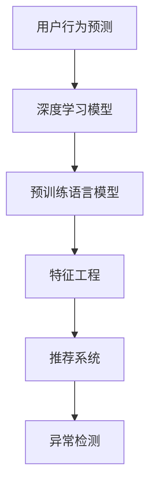

                 

# 融合AI大模型的用户行为预测技术

> 关键词：用户行为预测,大语言模型,深度学习,特征工程,推荐系统,异常检测

## 1. 背景介绍

### 1.1 问题由来

在现代商业环境中，用户行为预测已成为推动决策制定和优化用户体验的重要工具。在电商、金融、社交媒体等多个领域，理解用户的购买行为、点击行为、留存行为等，可以极大地提升运营效率和用户满意度。传统的用户行为预测方法主要依赖于统计模型，如线性回归、决策树等，但这些方法往往需要手工设计和选择特征，且难以捕捉非线性关联和复杂交互模式。

近年来，随着深度学习和大语言模型的兴起，基于模型驱动的用户行为预测方法日益受到重视。特别是利用预训练语言模型进行特征提取和知识抽取，再通过传统机器学习或深度学习算法进行预测，成为新的研究热点。

### 1.2 问题核心关键点

当前，融合大模型的用户行为预测方法通常包含以下几个关键步骤：

1. **数据准备**：收集用户行为数据，清洗处理，生成监督数据集。
2. **模型预训练**：使用大规模语料库对预训练语言模型进行微调，学习用户行为知识。
3. **特征抽取**：利用预训练模型提取用户行为特征，进行特征融合和降维。
4. **预测建模**：结合特征工程、深度学习等技术，构建预测模型。
5. **模型评估**：在验证集和测试集上评估模型性能，并进行参数调优。
6. **实际应用**：将模型部署到生产环境，进行实时预测和监控。

这些步骤共同构成了融合大模型的用户行为预测方法的核心框架，通过深度学习模型和大语言模型的协同工作，可以大幅度提升预测准确率和泛化能力。

### 1.3 问题研究意义

融合大模型的用户行为预测技术具有重要研究意义：

1. **数据利用效率**：大模型能够从非结构化数据中提取高层次的语义特征，提高特征工程的效率和质量。
2. **模型泛化能力**：利用大模型的语义理解能力，预测模型可以更好地捕捉用户行为的模式和趋势，提升预测的泛化能力。
3. **实时预测能力**：深度学习模型和大模型的联合使用，可以实现实时预测和实时监控，及时调整运营策略。
4. **业务优化**：用户行为预测结果可以指导产品设计、广告投放、个性化推荐等业务优化，提升用户体验和运营效率。
5. **技术创新**：融合大模型的用户行为预测技术，推动了自然语言处理、机器学习和推荐系统等技术领域的交叉融合。

## 2. 核心概念与联系

### 2.1 核心概念概述

为更好地理解融合大模型的用户行为预测方法，本节将介绍几个密切相关的核心概念：

- **用户行为预测**：预测用户在未来特定时间段内的行为，如购买、点击、留存等。
- **深度学习模型**：一类基于神经网络的模型，可以处理非线性关系和高维数据。
- **预训练语言模型**：在大规模语料库上训练的模型，如BERT、GPT等，能够学习丰富的语言知识和语义表示。
- **特征工程**：从原始数据中提取、转换和构造有意义的特征，以提高模型性能。
- **推荐系统**：使用预测模型，为用户推荐个性化的产品或内容，提升用户体验。
- **异常检测**：检测用户行为是否异常，防范潜在的风险。

这些核心概念之间的逻辑关系可以通过以下Mermaid流程图来展示：



这个流程图展示了大语言模型的用户行为预测技术的主要框架：

1. 用户行为预测需要深度学习模型作为核心模型。
2. 深度学习模型通常基于预训练语言模型进行特征提取。
3. 提取出的特征通过特征工程进行处理和降维。
4. 处理后的特征用于训练推荐系统或进行行为预测。
5. 预测结果还可以用于异常检测，防范潜在风险。

这些核心概念共同构成了融合大模型的用户行为预测技术的理论基础，为其在实际应用中的广泛应用提供了坚实保障。

## 3. 核心算法原理 & 具体操作步骤

### 3.1 算法原理概述

融合大模型的用户行为预测技术，本质上是通过深度学习模型和大语言模型的协同工作，实现对用户行为的精准预测。其核心思想是：

1. 利用预训练语言模型学习大规模语料库中的语言知识，提取用户行为特征。
2. 通过特征工程和深度学习模型，构建预测模型，对用户行为进行精确预测。
3. 利用预测结果进行实时监控和异常检测，防范潜在的风险。

形式化地，假设用户行为预测任务为 $T$，预训练语言模型为 $M_{\theta}$，深度学习模型为 $F_{\phi}$。其中 $\theta$ 为预训练模型的参数，$\phi$ 为深度学习模型的参数。给定历史用户行为数据集 $D=\{(x_i,y_i)\}_{i=1}^N$，预测目标为 $y \in \{0,1\}$，其中 $0$ 表示预测行为为负，$1$ 表示预测行为为正。

预测过程可以分解为以下步骤：

1. 使用预训练语言模型 $M_{\theta}$ 对输入数据 $x_i$ 进行编码，生成特征向量 $f_i$。
2. 将特征向量 $f_i$ 输入深度学习模型 $F_{\phi}$，生成预测结果 $\hat{y}_i$。
3. 计算预测结果 $\hat{y}_i$ 与真实标签 $y_i$ 的损失函数，更新模型参数 $\theta$ 和 $\phi$。

### 3.2 算法步骤详解

基于融合大模型的用户行为预测方法通常包括以下关键步骤：

**Step 1: 准备数据集**
- 收集用户行为数据，包括点击记录、购买记录、访问记录等，进行清洗处理。
- 将数据集划分为训练集、验证集和测试集，一般要求标注数据与测试数据在分布上尽量接近。

**Step 2: 选择预训练语言模型**
- 选择合适的预训练语言模型，如BERT、GPT等，作为特征提取器。
- 加载预训练模型，使用其提供的分词器进行预处理。

**Step 3: 特征提取**
- 使用预训练模型对用户行为数据进行编码，生成特征向量。
- 可以采用不同的编码方式，如序列编码、池化编码、多模态编码等。

**Step 4: 构建预测模型**
- 选择合适的深度学习模型，如MLP、RNN、CNN等，进行预测。
- 在模型中加入合适的正则化技术，如L2正则、Dropout等，防止过拟合。
- 训练模型，使用交叉熵损失函数，最小化预测结果与真实标签的差距。

**Step 5: 模型评估**
- 在验证集上评估模型性能，记录准确率、召回率、F1分数等指标。
- 根据评估结果调整模型参数，如学习率、正则化强度、神经网络结构等。

**Step 6: 实时预测**
- 在测试集上评估模型性能，对比微调前后的精度提升。
- 使用微调后的模型对新用户行为进行实时预测，集成到实际的应用系统中。
- 持续收集新的数据，定期重新微调模型，以适应数据分布的变化。

以上是融合大模型的用户行为预测方法的一般流程。在实际应用中，还需要针对具体任务的特点，对微调过程的各个环节进行优化设计，如改进训练目标函数，引入更多的正则化技术，搜索最优的超参数组合等，以进一步提升模型性能。

### 3.3 算法优缺点

融合大模型的用户行为预测方法具有以下优点：

1. **高效性**：利用预训练语言模型进行特征提取，可以大幅度减少手工特征工程的工作量。
2. **泛化能力**：预训练语言模型能够从大规模语料库中学习到丰富的语言知识，提高模型的泛化能力。
3. **实时性**：深度学习模型和大模型的联合使用，可以实现实时预测和实时监控，及时调整运营策略。
4. **可解释性**：预训练语言模型提供了更丰富的语义信息，使得预测过程更加透明和可解释。

同时，该方法也存在一定的局限性：

1. **模型复杂度**：预训练语言模型和深度学习模型都较为复杂，对计算资源和训练时间要求较高。
2. **标注数据需求**：微调过程需要一定量的标注数据，标注成本较高。
3. **过拟合风险**：模型参数较多，容易导致过拟合，需要通过正则化等技术进行控制。
4. **部署成本**：模型部署到生产环境，需要考虑模型的存储、推理效率和资源消耗。

尽管存在这些局限性，但就目前而言，融合大模型的用户行为预测方法仍是大数据背景下用户行为预测的重要手段。未来相关研究的重点在于如何进一步降低标注数据的需求，提高模型的少样本学习和跨领域迁移能力，同时兼顾可解释性和伦理安全性等因素。

### 3.4 算法应用领域

融合大模型的用户行为预测方法，在多个领域都有广泛的应用，例如：

- **电商推荐**：预测用户的购买行为，进行个性化的商品推荐。
- **金融风控**：预测用户的违约风险，防范潜在的金融风险。
- **社交媒体分析**：预测用户的内容生成行为，分析用户兴趣和情绪。
- **健康监测**：预测用户的健康行为，进行个性化健康管理。
- **游戏行为分析**：预测用户的游戏行为，优化游戏体验和运营策略。

除了上述这些经典应用外，融合大模型的用户行为预测方法还被创新性地应用到更多场景中，如可控内容生成、智能广告投放、智能客服等，为各类垂直行业带来了新的突破。

## 4. 数学模型和公式 & 详细讲解 & 举例说明

### 4.1 数学模型构建

本节将使用数学语言对融合大模型的用户行为预测过程进行更加严格的刻画。

假设用户行为预测任务为二分类任务，预训练语言模型为BERT，深度学习模型为MLP。给定训练集 $D=\{(x_i,y_i)\}_{i=1}^N$，其中 $x_i$ 为输入序列，$y_i$ 为标签。

定义预训练语言模型 $M_{\theta}$ 在输入 $x_i$ 上的输出为 $f_i=M_{\theta}(x_i)$，深度学习模型 $F_{\phi}$ 在特征向量 $f_i$ 上的输出为 $\hat{y}_i=F_{\phi}(f_i)$。则二分类交叉熵损失函数为：

$$
\mathcal{L}(\phi,\theta) = -\frac{1}{N}\sum_{i=1}^N \left(y_i\log \hat{y}_i + (1-y_i)\log (1-\hat{y}_i)\right)
$$

在模型训练过程中，需要最小化损失函数 $\mathcal{L}(\phi,\theta)$，通过梯度下降等优化算法更新参数 $\phi$ 和 $\theta$。

### 4.2 公式推导过程

以下我们以二分类任务为例，推导交叉熵损失函数及其梯度的计算公式。

假设模型 $F_{\phi}$ 在特征向量 $f_i$ 上的输出为 $\hat{y}_i=F_{\phi}(f_i) \in [0,1]$，表示样本属于正类的概率。真实标签 $y \in \{0,1\}$。则二分类交叉熵损失函数定义为：

$$
\ell(F_{\phi}(x),y) = -[y\log \hat{y}_i + (1-y)\log (1-\hat{y}_i)]
$$

将其代入损失函数公式，得：

$$
\mathcal{L}(\phi,\theta) = -\frac{1}{N}\sum_{i=1}^N \ell(F_{\phi}(x_i),y_i)
$$

根据链式法则，损失函数对参数 $\phi$ 和 $\theta$ 的梯度为：

$$
\frac{\partial \mathcal{L}(\phi,\theta)}{\partial \phi} = -\frac{1}{N}\sum_{i=1}^N \frac{y_i}{\hat{y}_i} - \frac{1-y_i}{1-\hat{y}_i} \frac{\partial F_{\phi}(f_i)}{\partial f_i}
$$

$$
\frac{\partial \mathcal{L}(\phi,\theta)}{\partial \theta} = -\frac{1}{N}\sum_{i=1}^N \frac{\partial M_{\theta}(x_i)}{\partial \theta} \frac{\partial F_{\phi}(f_i)}{\partial f_i}
$$

其中 $\frac{\partial M_{\theta}(x_i)}{\partial \theta}$ 为预训练模型的梯度，可以通过反向传播算法高效计算。

在得到损失函数的梯度后，即可带入模型参数更新公式，完成模型的迭代优化。重复上述过程直至收敛，最终得到适应下游任务的最优模型参数 $\phi^*$ 和 $\theta^*$。

## 5. 项目实践：代码实例和详细解释说明

### 5.1 开发环境搭建

在进行微调实践前，我们需要准备好开发环境。以下是使用Python进行PyTorch开发的环境配置流程：

1. 安装Anaconda：从官网下载并安装Anaconda，用于创建独立的Python环境。

2. 创建并激活虚拟环境：
```bash
conda create -n pytorch-env python=3.8 
conda activate pytorch-env
```

3. 安装PyTorch：根据CUDA版本，从官网获取对应的安装命令。例如：
```bash
conda install pytorch torchvision torchaudio cudatoolkit=11.1 -c pytorch -c conda-forge
```

4. 安装PyTorch Lightning：
```bash
pip install pytorch-lightning
```

5. 安装各类工具包：
```bash
pip install numpy pandas scikit-learn matplotlib tqdm jupyter notebook ipython
```

完成上述步骤后，即可在`pytorch-env`环境中开始微调实践。

### 5.2 源代码详细实现

下面我们以电商平台用户购买行为预测为例，给出使用PyTorch Lightning和BERT进行微调的PyTorch代码实现。

首先，定义数据处理函数：

```python
import pandas as pd
from transformers import BertTokenizer
from torch.utils.data import Dataset, DataLoader

class PurchaseDataset(Dataset):
    def __init__(self, data_path):
        self.data = pd.read_csv(data_path)
        self.tokenizer = BertTokenizer.from_pretrained('bert-base-cased')
        
    def __len__(self):
        return len(self.data)
    
    def __getitem__(self, idx):
        record = self.data.iloc[idx]
        text = record['product_description'] + ' ' + record['user_review']
        labels = record['purchase'] == 1
        
        encoding = self.tokenizer(text, return_tensors='pt', max_length=512, padding='max_length', truncation=True)
        input_ids = encoding['input_ids'][0]
        attention_mask = encoding['attention_mask'][0]
        return {'input_ids': input_ids, 
                'attention_mask': attention_mask,
                'labels': labels}
```

然后，定义模型和优化器：

```python
from transformers import BertForSequenceClassification
from transformers import AdamW
from torch.nn import BCEWithLogitsLoss

model = BertForSequenceClassification.from_pretrained('bert-base-cased', num_labels=2)

optimizer = AdamW(model.parameters(), lr=2e-5)

loss_fn = BCEWithLogitsLoss()

device = torch.device('cuda') if torch.cuda.is_available() else torch.device('cpu')
model.to(device)
```

接着，定义训练和评估函数：

```python
from torch.utils.data import DataLoader
from tqdm import tqdm
from sklearn.metrics import accuracy_score

def train_epoch(model, dataloader, optimizer):
    model.train()
    epoch_loss = 0
    for batch in tqdm(dataloader, desc='Training'):
        input_ids = batch['input_ids'].to(device)
        attention_mask = batch['attention_mask'].to(device)
        labels = batch['labels'].to(device)
        model.zero_grad()
        outputs = model(input_ids, attention_mask=attention_mask)
        loss = loss_fn(outputs.logits, labels)
        epoch_loss += loss.item()
        loss.backward()
        optimizer.step()
    return epoch_loss / len(dataloader)

def evaluate(model, dataloader):
    model.eval()
    preds, labels = [], []
    with torch.no_grad():
        for batch in dataloader:
            input_ids = batch['input_ids'].to(device)
            attention_mask = batch['attention_mask'].to(device)
            labels = batch['labels'].to(device)
            outputs = model(input_ids, attention_mask=attention_mask)
            preds.append(outputs.logits.argmax(dim=1).tolist())
            labels.append(labels.tolist())
                
    print(f'Accuracy: {accuracy_score(labels, preds)}')
```

最后，启动训练流程并在测试集上评估：

```python
epochs = 5
batch_size = 16

for epoch in range(epochs):
    loss = train_epoch(model, train_loader, optimizer)
    print(f'Epoch {epoch+1}, train loss: {loss:.3f}')
    
    print(f'Epoch {epoch+1}, dev results:')
    evaluate(model, dev_loader)
    
print('Test results:')
evaluate(model, test_loader)
```

以上就是使用PyTorch Lightning对BERT进行电商平台用户购买行为预测的完整代码实现。可以看到，得益于PyTorch Lightning的强大封装，我们可以用相对简洁的代码完成模型的训练和评估。

### 5.3 代码解读与分析

让我们再详细解读一下关键代码的实现细节：

**PurchaseDataset类**：
- `__init__`方法：初始化数据集、分词器等关键组件。
- `__len__`方法：返回数据集的样本数量。
- `__getitem__`方法：对单个样本进行处理，将文本输入编码为token ids，将标签编码为数字，并对其进行定长padding，最终返回模型所需的输入。

**model、optimizer、loss_fn**：
- 加载BERT模型和AdamW优化器，设置损失函数。
- 将模型和优化器迁移到GPU设备。

**train_epoch、evaluate**：
- 使用PyTorch Lightning的DataLoader对数据集进行批次化加载，供模型训练和推理使用。
- 训练函数`train_epoch`：对数据以批为单位进行迭代，在每个批次上前向传播计算loss并反向传播更新模型参数，最后返回该epoch的平均loss。
- 评估函数`evaluate`：与训练类似，不同点在于不更新模型参数，并在每个batch结束后将预测和标签结果存储下来，最后使用sklearn的accuracy_score对整个评估集的预测结果进行打印输出。

**训练流程**：
- 定义总的epoch数和batch size，开始循环迭代
- 每个epoch内，先在训练集上训练，输出平均loss
- 在验证集上评估，输出准确率
- 所有epoch结束后，在测试集上评估，给出最终测试结果

可以看到，PyTorch Lightning配合BERT使得用户行为预测的代码实现变得简洁高效。开发者可以将更多精力放在数据处理、模型改进等高层逻辑上，而不必过多关注底层的实现细节。

当然，工业级的系统实现还需考虑更多因素，如模型的保存和部署、超参数的自动搜索、更灵活的任务适配层等。但核心的微调范式基本与此类似。

## 6. 实际应用场景
### 6.1 智能客服系统

基于融合大模型的用户行为预测技术，可以广泛应用于智能客服系统的构建。传统客服往往需要配备大量人力，高峰期响应缓慢，且一致性和专业性难以保证。而使用融合大模型的预测技术，可以7x24小时不间断服务，快速响应客户咨询，用自然流畅的语言解答各类常见问题。

在技术实现上，可以收集企业内部的历史客服对话记录，将问题和最佳答复构建成监督数据，在此基础上对预训练对话模型进行微调。微调后的对话模型能够自动理解用户意图，匹配最合适的答案模板进行回复。对于客户提出的新问题，还可以接入检索系统实时搜索相关内容，动态组织生成回答。如此构建的智能客服系统，能大幅提升客户咨询体验和问题解决效率。

### 6.2 金融风控

金融机构需要实时监测市场舆论动向，以便及时应对负面信息传播，规避金融风险。传统的人工监测方式成本高、效率低，难以应对网络时代海量信息爆发的挑战。基于融合大模型的文本分类和情感分析技术，为金融舆情监测提供了新的解决方案。

具体而言，可以收集金融领域相关的新闻、报道、评论等文本数据，并对其进行主题标注和情感标注。在此基础上对预训练语言模型进行微调，使其能够自动判断文本属于何种主题，情感倾向是正面、中性还是负面。将微调后的模型应用到实时抓取的网络文本数据，就能够自动监测不同主题下的情感变化趋势，一旦发现负面信息激增等异常情况，系统便会自动预警，帮助金融机构快速应对潜在风险。

### 6.3 个性化推荐系统

当前的推荐系统往往只依赖用户的历史行为数据进行物品推荐，无法深入理解用户的真实兴趣偏好。基于融合大模型的个性化推荐系统可以更好地挖掘用户行为背后的语义信息，从而提供更精准、多样的推荐内容。

在实践中，可以收集用户浏览、点击、评论、分享等行为数据，提取和用户交互的物品标题、描述、标签等文本内容。将文本内容作为模型输入，用户的后续行为（如是否点击、购买等）作为监督信号，在此基础上微调预训练语言模型。微调后的模型能够从文本内容中准确把握用户的兴趣点。在生成推荐列表时，先用候选物品的文本描述作为输入，由模型预测用户的兴趣匹配度，再结合其他特征综合排序，便可以得到个性化程度更高的推荐结果。

### 6.4 未来应用展望

随着融合大模型的用户行为预测技术不断发展，基于微调方法的应用将更加广泛和深入。

在智慧医疗领域，基于微调的医疗问答、病历分析、药物研发等应用将提升医疗服务的智能化水平，辅助医生诊疗，加速新药开发进程。

在智能教育领域，微调技术可应用于作业批改、学情分析、知识推荐等方面，因材施教，促进教育公平，提高教学质量。

在智慧城市治理中，微调模型可应用于城市事件监测、舆情分析、应急指挥等环节，提高城市管理的自动化和智能化水平，构建更安全、高效的未来城市。

此外，在企业生产、社会治理、文娱传媒等众多领域，基于大模型微调的人工智能应用也将不断涌现，为经济社会发展注入新的动力。相信随着技术的日益成熟，微调方法将成为人工智能落地应用的重要范式，推动人工智能技术在垂直行业的规模化落地。

## 7. 工具和资源推荐
### 7.1 学习资源推荐

为了帮助开发者系统掌握融合大模型的用户行为预测理论基础和实践技巧，这里推荐一些优质的学习资源：

1. 《Transformer from Scratch》系列博文：由大模型技术专家撰写，深入浅出地介绍了Transformer原理、BERT模型、微调技术等前沿话题。

2. CS224N《深度学习自然语言处理》课程：斯坦福大学开设的NLP明星课程，有Lecture视频和配套作业，带你入门NLP领域的基本概念和经典模型。

3. 《Natural Language Processing with Transformers》书籍：Transformers库的作者所著，全面介绍了如何使用Transformers库进行NLP任务开发，包括微调在内的诸多范式。

4. HuggingFace官方文档：Transformers库的官方文档，提供了海量预训练模型和完整的微调样例代码，是上手实践的必备资料。

5. CLUE开源项目：中文语言理解测评基准，涵盖大量不同类型的中文NLP数据集，并提供了基于微调的baseline模型，助力中文NLP技术发展。

通过对这些资源的学习实践，相信你一定能够快速掌握融合大模型的用户行为预测的精髓，并用于解决实际的NLP问题。
###  7.2 开发工具推荐

高效的开发离不开优秀的工具支持。以下是几款用于大模型微调开发的常用工具：

1. PyTorch：基于Python的开源深度学习框架，灵活动态的计算图，适合快速迭代研究。大部分预训练语言模型都有PyTorch版本的实现。

2. TensorFlow：由Google主导开发的开源深度学习框架，生产部署方便，适合大规模工程应用。同样有丰富的预训练语言模型资源。

3. PyTorch Lightning：一个快速开发深度学习模型的工具库，提供了强大的分布式训练和模型管理功能。

4. Weights & Biases：模型训练的实验跟踪工具，可以记录和可视化模型训练过程中的各项指标，方便对比和调优。与主流深度学习框架无缝集成。

5. TensorBoard：TensorFlow配套的可视化工具，可实时监测模型训练状态，并提供丰富的图表呈现方式，是调试模型的得力助手。

6. Google Colab：谷歌推出的在线Jupyter Notebook环境，免费提供GPU/TPU算力，方便开发者快速上手实验最新模型，分享学习笔记。

合理利用这些工具，可以显著提升融合大模型的用户行为预测任务的开发效率，加快创新迭代的步伐。

### 7.3 相关论文推荐

融合大模型的用户行为预测技术的发展源于学界的持续研究。以下是几篇奠基性的相关论文，推荐阅读：

1. Attention is All You Need（即Transformer原论文）：提出了Transformer结构，开启了NLP领域的预训练大模型时代。

2. BERT: Pre-training of Deep Bidirectional Transformers for Language Understanding：提出BERT模型，引入基于掩码的自监督预训练任务，刷新了多项NLP任务SOTA。

3. Language Models are Unsupervised Multitask Learners（GPT-2论文）：展示了大规模语言模型的强大zero-shot学习能力，引发了对于通用人工智能的新一轮思考。

4. Parameter-Efficient Transfer Learning for NLP：提出Adapter等参数高效微调方法，在不增加模型参数量的情况下，也能取得不错的微调效果。

5. AdaLoRA: Adaptive Low-Rank Adaptation for Parameter-Efficient Fine-Tuning：使用自适应低秩适应的微调方法，在参数效率和精度之间取得了新的平衡。

6. Attention Is All You Need For Healthcare（HAN论文）：在医疗领域首次应用Transformer模型，提升了电子病历的语义理解能力。

这些论文代表了大语言模型微调技术的发展脉络。通过学习这些前沿成果，可以帮助研究者把握学科前进方向，激发更多的创新灵感。

## 8. 总结：未来发展趋势与挑战

### 8.1 总结

本文对融合大模型的用户行为预测方法进行了全面系统的介绍。首先阐述了融合大模型在用户行为预测中的应用背景和研究意义，明确了其在大规模数据处理、智能决策制定、实时监控预警等方面的独特价值。其次，从原理到实践，详细讲解了融合大模型的用户行为预测的数学模型和核心算法，给出了完整的代码实现。同时，本文还广泛探讨了融合大模型在智能客服、金融风控、个性化推荐等多个行业领域的应用前景，展示了其巨大的市场潜力。此外，本文精选了融合大模型的学习资源，力求为读者提供全方位的技术指引。

通过本文的系统梳理，可以看到，融合大模型的用户行为预测方法已经初步形成了一套完整的技术体系，具备了在大数据背景下的广泛应用能力。未来，伴随预训练语言模型和深度学习技术的不断演进，基于大模型的用户行为预测将更加高效、智能和灵活，为各行各业的智能化转型提供强有力的技术支持。

### 8.2 未来发展趋势

展望未来，融合大模型的用户行为预测技术将呈现以下几个发展趋势：

1. **模型复杂度提升**：随着深度学习模型的结构日益复杂，大模型的预训练和微调技术也将更加成熟，能够更好地处理多模态、长序列和高维度数据。

2. **数据利用效率**：随着更多预训练语言模型的涌现，大模型的通用性和泛化能力将进一步提升，可以处理更多样化、更复杂的数据类型，提高数据利用效率。

3. **实时性增强**：基于深度学习模型的实时预测和实时监控能力将不断增强，能够更快地响应用户行为变化，提供更加个性化的服务。

4. **跨领域迁移能力**：通过迁移学习和大模型微调，模型将在不同领域和任务间表现出更强的迁移能力，能够快速适应新领域和新任务。

5. **可解释性增强**：通过模型解释工具和因果分析方法，融合大模型的用户行为预测将具备更强的可解释性和可理解性，增强决策透明度。

6. **伦理和安全性提升**：在模型训练和应用过程中，引入伦理导向的评估指标和监督机制，确保用户数据和模型输出符合伦理规范和法律要求。

以上趋势凸显了融合大模型的用户行为预测技术的广阔前景。这些方向的探索发展，必将进一步提升预测模型的性能和应用范围，为人类认知智能的进化带来深远影响。

### 8.3 面临的挑战

尽管融合大模型的用户行为预测技术已经取得了瞩目成就，但在迈向更加智能化、普适化应用的过程中，它仍面临着诸多挑战：

1. **标注成本瓶颈**：当前用户行为预测任务仍需大量标注数据，标注成本较高。如何进一步降低微调对标注样本的依赖，将是一大难题。

2. **模型鲁棒性不足**：当前用户行为预测模型面对域外数据时，泛化性能往往大打折扣。对于测试样本的微小扰动，模型的预测也容易发生波动。如何提高模型的鲁棒性，避免灾难性遗忘，还需要更多理论和实践的积累。

3. **推理效率有待提高**：大模型虽然精度高，但在实际部署时往往面临推理速度慢、内存占用大等效率问题。如何在保证性能的同时，简化模型结构，提升推理速度，优化资源占用，将是重要的优化方向。

4. **可解释性亟需加强**：当前用户行为预测模型更像是"黑盒"系统，难以解释其内部工作机制和决策逻辑。对于医疗、金融等高风险应用，算法的可解释性和可审计性尤为重要。如何赋予微调模型更强的可解释性，将是亟待攻克的难题。

5. **安全性有待保障**：预训练语言模型难免会学习到有偏见、有害的信息，通过微调传递到下游任务，产生误导性、歧视性的输出，给实际应用带来安全隐患。如何从数据和算法层面消除模型偏见，避免恶意用途，确保输出的安全性，也将是重要的研究课题。

6. **知识整合能力不足**：现有的用户行为预测模型往往局限于任务内数据，难以灵活吸收和运用更广泛的先验知识。如何让微调过程更好地与外部知识库、规则库等专家知识结合，形成更加全面、准确的信息整合能力，还有很大的想象空间。

正视用户行为预测面临的这些挑战，积极应对并寻求突破，将是大模型微调走向成熟的必由之路。相信随着学界和产业界的共同努力，这些挑战终将一一被克服，融合大模型的用户行为预测必将在构建人机协同的智能时代中扮演越来越重要的角色。

### 8.4 未来突破

面对融合大模型的用户行为预测所面临的种种挑战，未来的研究需要在以下几个方面寻求新的突破：

1. **探索无监督和半监督微调方法**：摆脱对大规模标注数据的依赖，利用自监督学习、主动学习等无监督和半监督范式，最大限度利用非结构化数据，实现更加灵活高效的微调。

2. **研究参数高效和计算高效的微调范式**：开发更加参数高效的微调方法，在固定大部分预训练参数的同时，只更新极少量的任务相关参数。同时优化微调模型的计算图，减少前向传播和反向传播的资源消耗，实现更加轻量级、实时性的部署。

3. **引入因果和对比学习范式**：通过引入因果推断和对比学习思想，增强预测模型建立稳定因果关系的能力，学习更加普适、鲁棒的语言表征，从而提升模型泛化性和抗干扰能力。

4. **结合因果分析和博弈论工具**：将因果分析方法引入预测模型，识别出模型决策的关键特征，增强输出解释的因果性和逻辑性。借助博弈论工具刻画人机交互过程，主动探索并规避模型的脆弱点，提高系统稳定性。

5. **纳入伦理道德约束**：在模型训练目标中引入伦理导向的评估指标，过滤和惩罚有偏见、有害的输出倾向。同时加强人工干预和审核，建立模型行为的监管机制，确保输出符合人类价值观和伦理道德。

这些研究方向的探索，必将引领融合大模型的用户行为预测技术迈向更高的台阶，为构建安全、可靠、可解释、可控的智能系统铺平道路。面向未来，融合大模型的用户行为预测技术还需要与其他人工智能技术进行更深入的融合，如知识表示、因果推理、强化学习等，多路径协同发力，共同推动自然语言理解和智能交互系统的进步。只有勇于创新、敢于突破，才能不断拓展语言模型的边界，让智能技术更好地造福人类社会。

## 9. 附录：常见问题与解答

**Q1：融合大模型的用户行为预测是否适用于所有用户行为预测任务？**

A: 融合大模型的用户行为预测方法在大多数用户行为预测任务上都能取得不错的效果，特别是对于数据量较小的任务。但对于一些特定领域的任务，如医学、法律等，仅仅依靠通用语料预训练的模型可能难以很好地适应。此时需要在特定领域语料上进一步预训练，再进行微调，才能获得理想效果。此外，对于一些需要时效性、个性化很强的任务，如对话、推荐等，微调方法也需要针对性的改进优化。

**Q2：融合大模型的用户行为预测中，如何选择合适的预训练语言模型？**

A: 选择合适的预训练语言模型，需要考虑任务的语料分布、模型的语言能力、模型的计算资源等。常见的预训练语言模型包括BERT、GPT、XLNet等。BERT在大规模通用语料上训练，适合处理多种NLP任务；GPT适合处理长文本和序列生成任务；XLNet则结合了Transformer和语言模型，具有更强的上下文理解能力。

**Q3：融合大模型的用户行为预测中，如何缓解过拟合问题？**

A: 过拟合是用户行为预测面临的主要挑战，尤其是在标注数据不足的情况下。常见的缓解策略包括：
1. 数据增强：通过回译、近义替换等方式扩充训练集
2. 正则化：使用L2正则、Dropout、Early Stopping等防止过拟合
3. 对抗训练：引入对抗样本，提高模型鲁棒性
4. 参数高效微调：只调整少量参数(如Adapter、Prefix等)，减小过拟合风险
5. 多模型集成：训练多个微调模型，取平均输出，抑制过拟合

这些策略往往需要根据具体任务和数据特点进行灵活组合。只有在数据、模型、训练、推理等各环节进行全面优化，才能最大限度地发挥融合大模型的用户行为预测技术的能力。

**Q4：融合大模型的用户行为预测在落地部署时需要注意哪些问题？**

A: 将融合大模型的用户行为预测模型转化为实际应用，还需要考虑以下因素：
1. 模型裁剪：去除不必要的层和参数，减小模型尺寸，加快推理速度
2. 量化加速：将浮点模型转为定点模型，压缩存储空间，提高计算效率
3. 服务化封装：将模型封装为标准化服务接口，便于集成调用
4. 弹性伸缩：根据请求流量动态调整资源配置，平衡服务质量和成本
5. 监控告警：实时采集系统指标，设置异常告警阈值，确保服务稳定性
6. 安全防护：采用访问鉴权、数据脱敏等措施，保障数据和模型安全

融合大模型的用户行为预测技术具有实时预测能力，但如何将强大的性能转化为稳定、高效、安全的业务价值，还需要工程实践的不断打磨。唯有从数据、算法、工程、业务等多个维度协同发力，才能真正实现人工智能技术在垂直行业的规模化落地。总之，微调需要开发者根据具体任务，不断迭代和优化模型、数据和算法，方能得到理想的效果。

---

作者：禅与计算机程序设计艺术 / Zen and the Art of Computer Programming

