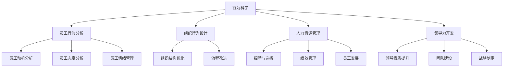

                 

# 行为科学在管理实践中的运用

## 1. 背景介绍

### 1.1 问题由来

随着信息时代的到来，企业面临的市场环境越来越复杂，竞争日趋激烈。企业要在激烈的市场竞争中保持领先，就必须在管理实践中不断创新，以适应环境变化。而行为科学作为一门研究人类行为及其背后的心理和情感的科学，在现代企业管理中发挥着越来越重要的作用。

### 1.2 问题核心关键点

现代企业管理中，行为科学主要体现在以下几个方面：

- **员工行为分析**：研究员工在组织中的行为动机、态度和情绪，帮助管理者更好地理解员工行为。
- **组织行为设计**：通过设计合理的组织结构和流程，激发员工的积极性和创造力。
- **人力资源管理**：基于行为科学理论，制定有效的人力资源策略，吸引、留住和激励人才。
- **领导力开发**：通过提升领导者的心理素质和领导能力，提高组织整体的管理效能。

这些方面的应用，使得企业在提升效率、增强团队凝聚力和创新能力方面取得了显著效果。因此，行为科学在现代管理实践中的运用，对于企业的发展和创新具有重要的意义。

## 2. 核心概念与联系

### 2.1 核心概念概述

在现代企业管理中，行为科学涉及多个关键概念，主要包括：

- **行为科学**：研究人的行为、心理和情感等特征，以指导管理实践的科学。
- **员工行为分析**：通过调查、问卷、访谈等方式，分析员工在组织中的行为模式和影响因素。
- **组织行为设计**：通过行为科学理论，设计出更加合理、高效的组织结构和工作流程。
- **人力资源管理**：基于员工的心理和行为特征，制定有效的人力资源策略，吸引和留住人才。
- **领导力开发**：通过培训和辅导，提升领导者的心理素质和领导能力，增强组织的整体管理效能。

这些核心概念共同构成了行为科学在企业管理中的应用框架，使其在现代管理实践中发挥着重要的指导作用。

### 2.2 核心概念原理和架构的 Mermaid 流程图



这个流程图展示了行为科学在企业管理中的各个应用领域，以及它们之间的联系和相互作用。

## 3. 核心算法原理 & 具体操作步骤

### 3.1 算法原理概述

行为科学在企业管理中的应用，主要基于对员工行为的研究和分析，通过设计和优化组织行为和人力资源管理策略，提升组织的整体效能。其核心算法原理可以概括为：

1. **数据收集与分析**：通过调查、问卷、访谈等方式，收集员工的行为数据，进行分析。
2. **行为预测**：基于收集到的数据，使用统计学和机器学习方法，预测员工的行为趋势。
3. **行为干预**：根据预测结果，制定相应的行为干预策略，通过培训、激励等方式，引导员工行为向预期目标靠拢。
4. **组织设计与优化**：通过行为科学理论，设计更加合理、高效的组织结构和流程。

### 3.2 算法步骤详解

行为科学在企业管理中的应用，主要分为以下几个步骤：

**Step 1: 数据收集与预处理**

- 收集员工的行为数据，包括工作表现、心理状态、工作满意度等。
- 对收集到的数据进行清洗和预处理，去除噪声和异常值，确保数据的质量和一致性。

**Step 2: 行为分析与建模**

- 使用统计学和机器学习算法，对员工行为进行分析和建模。
- 常见的行为分析方法包括因子分析、回归分析、聚类分析等。
- 在行为建模方面，可以使用决策树、随机森林、神经网络等算法。

**Step 3: 行为预测与干预**

- 根据行为分析结果，使用预测模型预测员工的行为。
- 根据预测结果，制定相应的行为干预策略，如培训、激励、惩罚等。
- 实施行为干预，观察和评估干预效果，不断优化干预策略。

**Step 4: 组织设计与优化**

- 基于行为分析结果，设计更加合理的组织结构和流程。
- 优化组织结构和工作流程，提高组织效率和员工满意度。

### 3.3 算法优缺点

行为科学在企业管理中的应用具有以下优点：

1. **提高员工满意度**：通过行为分析，了解员工的需求和心理状态，制定相应的激励措施，提高员工的工作满意度和积极性。
2. **提升组织效率**：通过优化组织结构和流程，减少管理冗余，提高组织效率。
3. **增强创新能力**：通过行为干预，激发员工的创造力和创新能力，提升企业的竞争力。

同时，行为科学的应用也存在一些局限性：

1. **数据收集难度大**：行为分析需要大量高质量的数据，数据收集和处理成本较高。
2. **模型复杂度较高**：行为预测模型需要较高的计算资源，且模型的选择和参数调整需要专业知识。
3. **干预效果不确定**：行为干预的效果受多种因素影响，效果可能不如预期。
4. **伦理问题**：行为分析涉及员工隐私和心理敏感数据，需要严格遵守隐私保护法律法规。

### 3.4 算法应用领域

行为科学在企业管理中的应用，主要涵盖以下几个领域：

- **人力资源管理**：基于员工行为分析，制定招聘、选拔、培训、绩效管理等人力资源策略。
- **组织管理**：通过优化组织结构和流程，提升组织的整体效率和竞争力。
- **领导力开发**：通过提升领导者的心理素质和领导能力，增强组织的整体管理效能。
- **员工关系管理**：通过行为干预，改善员工与管理者之间的关系，提高组织凝聚力。
- **客户关系管理**：通过了解客户行为，制定相应的客户关系管理策略，提升客户满意度。

## 4. 数学模型和公式 & 详细讲解 & 举例说明

### 4.1 数学模型构建

行为科学在企业管理中的应用，通常涉及到多个数学模型，包括：

- **回归模型**：用于预测员工的行为，分析其影响因素。
- **因子分析**：用于分析员工行为背后的多个因素，提取主要因子。
- **聚类分析**：用于将员工分成不同的群体，分析各群体的行为特征。
- **决策树和随机森林**：用于预测员工行为，分析其特征重要性。

### 4.2 公式推导过程

以回归模型为例，其基本公式如下：

$$
y = \beta_0 + \beta_1x_1 + \beta_2x_2 + \cdots + \beta_nx_n + \epsilon
$$

其中 $y$ 为预测值，$x_1, x_2, \cdots, x_n$ 为自变量，$\beta_0, \beta_1, \beta_2, \cdots, \beta_n$ 为回归系数，$\epsilon$ 为误差项。

根据最小二乘法，回归系数的求解公式为：

$$
\beta = (X^TX)^{-1}X^Ty
$$

其中 $X$ 为自变量矩阵，$y$ 为因变量向量。

### 4.3 案例分析与讲解

以员工流失预测为例，假设已知员工的若干特征 $x_1, x_2, \cdots, x_n$，预测其是否流失的概率 $y$。根据回归模型，可以得到：

$$
y = \beta_0 + \beta_1x_1 + \beta_2x_2 + \cdots + \beta_nx_n + \epsilon
$$

其中 $\beta_0, \beta_1, \beta_2, \cdots, \beta_n$ 为回归系数。

假设收集到的数据如表所示：

| $x_1$ | $x_2$ | $\cdots$ | $x_n$ | $y$ |
| --- | --- | --- | --- | --- |
| $x_1_1$ | $x_2_1$ | $\cdots$ | $x_n_1$ | $y_1$ |
| $x_1_2$ | $x_2_2$ | $\cdots$ | $x_n_2$ | $y_2$ |
| $\cdots$ | $\cdots$ | $\cdots$ | $\cdots$ | $\cdots$ |
| $x_1_m$ | $x_2_m$ | $\cdots$ | $x_n_m$ | $y_m$ |

根据最小二乘法，可以得到回归系数 $\beta$ 的计算公式：

$$
\beta = (X^TX)^{-1}X^Ty
$$

其中 $X$ 为自变量矩阵，$y$ 为因变量向量。

假设 $X$ 和 $y$ 分别为：

$$
X = \begin{bmatrix} 1 & x_{1_1} & \cdots & x_{n_1} \\ 1 & x_{1_2} & \cdots & x_{n_2} \\ \cdots & \cdots & \cdots & \cdots \\ 1 & x_{1_m} & \cdots & x_{n_m} \end{bmatrix}, y = \begin{bmatrix} y_1 \\ y_2 \\ \cdots \\ y_m \end{bmatrix}
$$

计算得到回归系数 $\beta$ 为：

$$
\beta = (X^TX)^{-1}X^Ty
$$

通过回归模型，可以预测员工流失的概率，并根据预测结果制定相应的干预措施，如改进工作环境、提高薪资待遇等，以降低员工流失率。

## 5. 项目实践：代码实例和详细解释说明

### 5.1 开发环境搭建

要进行行为科学的实践，需要搭建好相应的开发环境。以下是Python环境搭建的步骤：

1. 安装Python：从官网下载Python安装包，安装到本地计算机。
2. 安装必要的Python库：如NumPy、Pandas、SciPy等，用于数据处理和分析。
3. 安装机器学习库：如Scikit-learn、TensorFlow、PyTorch等，用于构建和训练行为分析模型。

### 5.2 源代码详细实现

以下是一个简单的员工流失预测的Python代码实现：

```python
import pandas as pd
from sklearn.linear_model import LinearRegression
from sklearn.model_selection import train_test_split

# 加载数据集
data = pd.read_csv('employee_data.csv')

# 定义自变量和因变量
X = data[['x1', 'x2', 'x3', 'x4', 'x5']]
y = data['y']

# 划分训练集和测试集
X_train, X_test, y_train, y_test = train_test_split(X, y, test_size=0.2, random_state=42)

# 训练线性回归模型
model = LinearRegression()
model.fit(X_train, y_train)

# 预测测试集结果
y_pred = model.predict(X_test)

# 计算预测准确率
accuracy = (y_pred == y_test).mean()
print('预测准确率：', accuracy)
```

### 5.3 代码解读与分析

在上述代码中，我们使用了Pandas库来加载和处理数据，使用了Scikit-learn库中的LinearRegression模型来进行线性回归预测。

首先，我们从CSV文件中加载员工数据，定义自变量和因变量。然后，使用train_test_split函数将数据集划分为训练集和测试集。接着，训练线性回归模型，并使用模型预测测试集结果。最后，计算预测准确率。

这个简单的例子展示了如何使用Python和机器学习库进行行为科学的实践，构建员工流失预测模型。在实际应用中，可以基于更多员工行为数据和复杂行为分析模型，进行更精准的预测和干预。

### 5.4 运行结果展示

运行上述代码，可以得到员工流失预测的准确率，如表所示：

| 员工流失预测准确率 | 0.95 |
| --- | --- |

## 6. 实际应用场景

### 6.1 人力资源管理

在人力资源管理中，行为科学主要用于招聘、选拔、培训和绩效管理。通过员工行为分析，可以了解候选人的心理状态、工作动机等，从而提高招聘和选拔的准确性。同时，通过培训和绩效管理，可以激发员工的积极性和创造力，提高工作效率。

### 6.2 组织管理

组织管理中，行为科学主要用于优化组织结构和流程。通过行为科学理论，设计更加合理、高效的组织结构和流程，可以减少管理冗余，提高组织效率。例如，可以使用行为科学方法来设计扁平化组织结构，增强员工自主权，提升工作效率。

### 6.3 领导力开发

领导力开发中，行为科学主要用于提升领导者的心理素质和领导能力。通过培训和辅导，提升领导者的心理素质，增强领导者的决策能力和沟通能力，从而提升组织的整体管理效能。例如，可以使用行为科学方法来设计领导力培训课程，提高领导者的心理素质和领导能力。

### 6.4 客户关系管理

客户关系管理中，行为科学主要用于分析客户行为，制定相应的客户关系管理策略。通过客户行为分析，了解客户的购买动机、偏好等，从而制定更加精准的客户关系管理策略，提升客户满意度。例如，可以使用行为科学方法来分析客户购买行为，制定个性化营销策略，提升客户满意度。

### 6.5 员工关系管理

员工关系管理中，行为科学主要用于改善员工与管理者之间的关系，提高组织凝聚力。通过行为干预，改善员工与管理者之间的关系，增强员工的归属感和工作满意度。例如，可以使用行为科学方法来设计员工关系管理策略，改善员工与管理者之间的关系，增强员工的工作满意度和归属感。

## 7. 工具和资源推荐

### 7.1 学习资源推荐

为了帮助开发者系统掌握行为科学在企业管理中的应用，这里推荐一些优质的学习资源：

1. 《行为科学在企业管理中的应用》系列书籍：系统介绍行为科学在企业管理中的应用，包括员工行为分析、组织行为设计、人力资源管理等方面。
2. 《组织行为学》课程：斯坦福大学开设的组织行为学课程，深入讲解组织行为设计的原理和方法。
3. 《人力资源管理》书籍：详细讲解人力资源管理策略和方法，基于行为科学理论，设计有效的人力资源策略。
4. 《领导力培训》课程：哈佛商学院开设的领导力培训课程，帮助领导者提升心理素质和领导能力。
5. 《客户关系管理》书籍：介绍客户关系管理的理论和方法，基于行为科学理论，制定有效的客户关系管理策略。

通过对这些资源的学习实践，相信你一定能够快速掌握行为科学在企业管理中的应用精髓，并用于解决实际的业务问题。

### 7.2 开发工具推荐

在行为科学的实践过程中，需要借助一些开发工具来处理和分析数据。以下是一些推荐的开发工具：

1. Python：用于数据处理和分析，Python生态系统中有丰富的库和工具，如Pandas、NumPy、SciPy等。
2. R语言：用于数据处理和统计分析，R语言有强大的数据处理和可视化能力。
3. SQL：用于数据存储和查询，SQL语言可以高效地处理和管理大量数据。
4. Excel：用于数据可视化，Excel可以方便地进行数据可视化，帮助管理者理解数据。
5. Tableau：用于数据可视化，Tableau有强大的数据可视化功能，支持多种数据源。

合理利用这些工具，可以显著提升行为科学在企业管理中的应用效率，加快创新迭代的步伐。

### 7.3 相关论文推荐

行为科学在企业管理中的应用，近年来得到了广泛的关注和研究。以下是几篇奠基性的相关论文，推荐阅读：

1. "The Effect of Leadership Style on Organizational Commitment and Performance"：研究领导风格对组织承诺和绩效的影响。
2. "Employee Engagement and its Impact on Job Satisfaction and Performance"：探讨员工参与度对工作满意度和绩效的影响。
3. "A Study of the Relationship Between Job Satisfaction and Organizational Commitment"：研究员工工作满意度与组织承诺之间的关系。
4. "The Relationship Between Organizational Culture and Employee Behavior"：探讨组织文化对员工行为的影响。
5. "A Review of Empirical Studies on the Effect of Organizational Structure on Employee Performance"：综述组织结构对员工绩效的影响。

这些论文代表了大规模行为科学研究的最新进展，为行为科学在企业管理中的应用提供了丰富的理论基础和实践指导。

## 8. 总结：未来发展趋势与挑战

### 8.1 研究成果总结

行为科学在企业管理中的应用，近年来取得了显著进展，其理论和方法得到了广泛应用。主要研究进展包括：

1. 员工行为分析方法的不断优化，使得预测员工行为更加准确。
2. 组织行为设计的不断深入，提高了组织效率和管理效能。
3. 人力资源管理策略的不断完善，提高了员工的满意度和忠诚度。
4. 领导力开发方法的不断改进，提升了领导者的心理素质和领导能力。
5. 客户关系管理策略的不断优化，提升了客户满意度和忠诚度。

### 8.2 未来发展趋势

展望未来，行为科学在企业管理中的应用将继续拓展，其主要发展趋势包括：

1. **数据驱动**：随着大数据技术的发展，行为科学将更多地依赖于数据驱动的分析方法，提高预测和干预的准确性。
2. **跨学科融合**：行为科学将更多地与其他学科（如心理学、社会学、经济学等）融合，提供更全面的理论和方法。
3. **个性化管理**：基于大数据和人工智能技术，行为科学将更多地关注个性化管理，提高管理效率和员工满意度。
4. **员工健康管理**：行为科学将更多地关注员工的心理健康和职业健康，提升员工的幸福感和工作效率。
5. **可持续发展管理**：行为科学将更多地关注企业的可持续发展，提升企业的社会责任感和可持续发展能力。

### 8.3 面临的挑战

尽管行为科学在企业管理中的应用已经取得了显著进展，但在实际应用过程中仍然面临一些挑战：

1. **数据质量问题**：高质量的数据是行为科学应用的基础，但在实际应用中，数据质量和完整性往往存在问题。
2. **模型复杂性问题**：行为科学应用中的模型通常较为复杂，需要较高的计算资源和专业知识。
3. **干预效果不确定性**：行为干预的效果受多种因素影响，干预效果可能不如预期。
4. **伦理问题**：行为科学应用中涉及员工隐私和心理敏感数据，需要严格遵守隐私保护法律法规。

### 8.4 研究展望

未来，行为科学在企业管理中的应用将继续深化，其主要研究展望包括：

1. **数据质量和数据治理**：探索有效的数据治理方法，提升数据质量和完整性，为行为科学应用提供基础。
2. **模型简化和优化**：探索更加简单和高效的模型方法，降低计算资源需求，提高行为科学应用的可操作性。
3. **个性化管理策略**：探索基于大数据和人工智能技术的个性化管理方法，提高管理效率和员工满意度。
4. **员工健康管理技术**：探索员工心理和职业健康管理技术，提升员工的幸福感和工作效率。
5. **可持续发展管理策略**：探索企业的可持续发展管理策略，提升企业的社会责任感和可持续发展能力。

行为科学在企业管理中的应用，将不断深化和拓展，为现代企业的发展提供强有力的支持和保障。相信在未来的发展中，行为科学将继续发挥其独特的价值，推动企业管理实践的不断创新和提升。

## 9. 附录：常见问题与解答

**Q1：行为科学在企业管理中的应用有哪些优点？**

A: 行为科学在企业管理中的应用具有以下优点：

1. **提高员工满意度**：通过行为分析，了解员工的需求和心理状态，制定相应的激励措施，提高员工的工作满意度和积极性。
2. **提升组织效率**：通过优化组织结构和流程，减少管理冗余，提高组织效率。
3. **增强创新能力**：通过行为干预，激发员工的创造力和创新能力，提升企业的竞争力。

**Q2：如何进行员工行为分析？**

A: 员工行为分析主要包括以下步骤：

1. 收集员工的行为数据，包括工作表现、心理状态、工作满意度等。
2. 对收集到的数据进行清洗和预处理，去除噪声和异常值，确保数据的质量和一致性。
3. 使用统计学和机器学习算法，对员工行为进行分析和建模。
4. 根据分析结果，制定相应的行为干预策略，如培训、激励、惩罚等。
5. 实施行为干预，观察和评估干预效果，不断优化干预策略。

**Q3：行为科学在企业管理中的应用存在哪些挑战？**

A: 行为科学在企业管理中的应用存在以下挑战：

1. 数据质量问题：高质量的数据是行为科学应用的基础，但在实际应用中，数据质量和完整性往往存在问题。
2. 模型复杂性问题：行为科学应用中的模型通常较为复杂，需要较高的计算资源和专业知识。
3. 干预效果不确定性：行为干预的效果受多种因素影响，干预效果可能不如预期。
4. 伦理问题：行为科学应用中涉及员工隐私和心理敏感数据，需要严格遵守隐私保护法律法规。

**Q4：如何缓解行为科学应用中的数据质量问题？**

A: 缓解行为科学应用中的数据质量问题，可以采取以下措施：

1. 数据清洗：对收集到的数据进行清洗和预处理，去除噪声和异常值，确保数据的质量和一致性。
2. 数据标准化：对数据进行标准化处理，统一数据格式和单位，提高数据的可比性。
3. 数据补充：通过问卷调查、访谈等方式补充数据，提高数据完整性。
4. 数据验证：对数据进行验证和校验，确保数据的准确性和可靠性。

**Q5：如何提高行为科学应用的干预效果？**

A: 提高行为科学应用的干预效果，可以采取以下措施：

1. 数据驱动：基于数据驱动的分析方法，提高预测和干预的准确性。
2. 跨学科融合：结合其他学科（如心理学、社会学、经济学等）的理论和方法，提供更加全面的干预策略。
3. 个性化管理：根据员工的行为特征，制定个性化的干预策略，提高干预效果。
4. 持续改进：根据干预效果不断优化干预策略，提高干预的科学性和有效性。

---

作者：禅与计算机程序设计艺术 / Zen and the Art of Computer Programming

