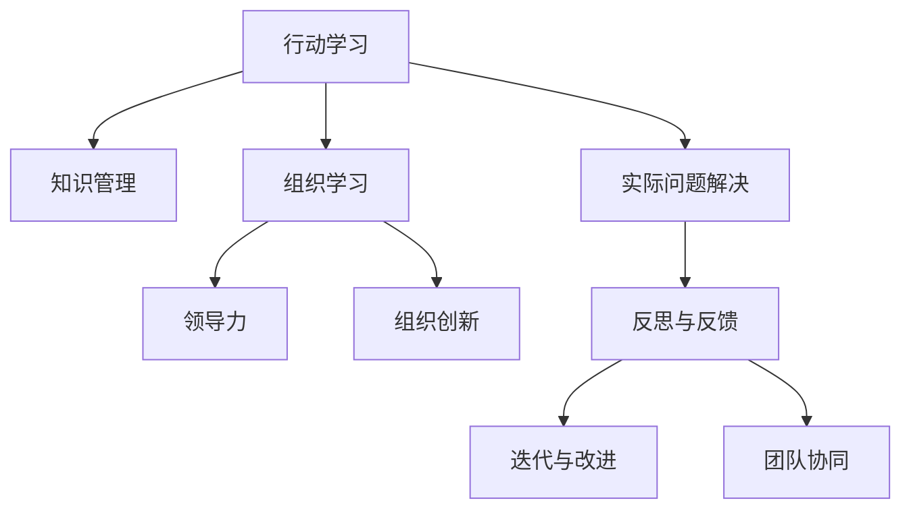

                 

# 行动中学习：管理者的成长之道

> 关键词：行动学习，组织发展，领导力，知识管理，组织创新

## 1. 背景介绍

### 1.1 问题由来

在快速变化的市场环境中，企业要想持续成长和保持竞争力，不仅需要创新产品和卓越的客户服务，还需要强大的管理能力。然而，许多管理者往往在实践中遇到各种挑战，如决策制定的科学性不足、团队管理的技术欠缺、组织创新的困难等。这些问题需要通过系统性的学习和实践来解决，而行动学习（Action Learning）提供了有效的方法论。

### 1.2 问题核心关键点

行动学习强调在实际工作中不断反思、实践、学习和改进，通过行动中学习，管理者可以提升自身的领导力、创新能力和组织管理水平。核心关键点包括：

- **实践导向**：行动学习注重实际问题解决，通过在真实情境中的学习，促进知识的迁移和应用。
- **反思与反馈**：行动学习强调对行动的持续反思和反馈，通过团队讨论和自我评估，提升学习效果。
- **迭代与改进**：行动学习采用迭代改进的方法，逐步优化解决方案，最终达到预期目标。
- **团队协同**：行动学习依赖团队合作，通过知识共享和多样性思维，产生创新解决方案。

这些关键点共同构成了行动学习的核心理念，其核心是管理者在实际工作中不断学习、实践和改进，以达到组织发展和个人成长的双重目标。

## 2. 核心概念与联系

### 2.1 核心概念概述

为更好地理解行动学习，本节将介绍几个密切相关的核心概念：

- **行动学习**：指在实际工作中通过反思和改进，不断学习和成长的一种方法。行动学习强调实践、反思和团队协作，通过解决实际问题来促进个人和组织的发展。
- **知识管理**：指通过收集、整理、共享和利用知识，以提高组织效能和创新能力的过程。知识管理与行动学习紧密相连，是行动学习的重要组成部分。
- **组织学习**：指组织在运营过程中通过学习和适应不断变化的环境，不断提升自身能力的过程。组织学习强调系统性和持续性，是行动学习的高级形式。
- **领导力**：指领导者通过影响、激励和引导团队，实现组织目标的能力。行动学习有助于提升领导者的战略思维和决策能力。
- **组织创新**：指通过创新思维和行动，促进组织变革和发展的过程。行动学习通过解决实际问题，推动组织创新和进步。

这些核心概念之间的逻辑关系可以通过以下Mermaid流程图来展示：



这个流程图展示了他的核心概念及其之间的关系：

1. 行动学习强调通过实际问题解决来学习，并在团队协作中提升。
2. 知识管理和组织学习是行动学习的重要组成部分，促进知识共享和组织变革。
3. 领导力提升是行动学习的关键，通过解决实际问题来增强决策和影响能力。
4. 组织创新是行动学习的目标，通过实践和改进推动组织进步。

这些概念共同构成了行动学习的学习和应用框架，使其在组织和个人发展中发挥重要作用。

## 3. 核心算法原理 & 具体操作步骤
### 3.1 算法原理概述

行动学习是一种以实践为导向的学习方法，其核心原理是通过解决实际问题来学习。行动学习的核心算法原理包括：

1. **行动计划制定**：在明确目标和问题后，制定详细的行动计划，包括目标设定、资源分配、时间安排等。
2. **实施行动**：在实际工作中执行行动计划，收集数据和反馈信息。
3. **反思与评估**：在行动过程中，持续反思和评估，识别问题、总结经验。
4. **调整与改进**：根据反思和评估结果，调整行动计划，进行迭代改进。

行动学习的关键在于将理论知识与实际工作结合，通过不断实践、反思和改进，实现知识的迁移和应用。

### 3.2 算法步骤详解

行动学习的具体操作步骤如下：

**Step 1: 确定学习目标**
- 明确学习的具体目标和预期成果。
- 确定需要解决的具体问题和挑战。

**Step 2: 组建学习小组**
- 选择具有不同背景和技能的成员组成学习小组，确保多样性。
- 确定小组中的领导者和协调员，确保团队高效运作。

**Step 3: 制定行动计划**
- 分析问题背景和关键点，制定详细的行动计划。
- 确定资源需求、时间安排和评估标准。

**Step 4: 实施行动**
- 执行行动计划，实际解决问题。
- 记录行动过程和数据，收集反馈信息。

**Step 5: 反思与评估**
- 定期召开反思会议，对行动过程和结果进行评估。
- 识别成功经验和问题点，总结学习成果。

**Step 6: 调整与改进**
- 根据反思和评估结果，调整行动计划。
- 制定新的行动计划，进行迭代改进。

通过以上步骤，管理者可以在实际工作中不断学习和成长，实现个人和组织的持续发展。

### 3.3 算法优缺点

行动学习的主要优点包括：

1. **实践导向**：行动学习通过解决实际问题来学习，理论与实践相结合，提升学习效果。
2. **反思与反馈**：持续的反思和反馈机制，帮助管理者识别问题和改进方法。
3. **团队协同**：团队合作和知识共享，促进多样性思维和创新。
4. **个性化学习**：针对具体问题和情境，制定个性化学习方案，满足不同需求。

行动学习的缺点包括：

1. **时间和资源投入较大**：需要较长时间和资源投入，才能取得显著效果。
2. **过程复杂**：需要协调团队、制定计划、实施行动等，管理复杂。
3. **效果难以量化**：结果往往难以量化，评估难度较大。
4. **依赖团队能力**：对团队成员的素质和合作能力要求较高。

尽管存在这些缺点，行动学习在提升管理者的领导力和组织创新能力方面具有显著优势，值得在实践中推广和应用。

### 3.4 算法应用领域

行动学习广泛应用于企业、政府和非营利组织等多个领域，具体应用包括：

- **项目管理**：在项目执行过程中，通过行动学习提升团队协作和问题解决能力。
- **战略规划**：通过行动学习，制定和调整战略规划，确保目标达成。
- **组织变革**：在组织变革过程中，通过行动学习促进知识共享和创新。
- **领导力发展**：在领导力培训中，通过行动学习提升决策能力和团队管理能力。
- **知识管理**：在知识管理项目中，通过行动学习促进知识共享和应用。

以上领域只是行动学习应用的一部分，未来随着管理实践的不断演进，行动学习的应用范围将更加广泛。

## 4. 数学模型和公式 & 详细讲解 & 举例说明
### 4.1 数学模型构建

行动学习没有具体的数学模型，但其学习过程可以通过学习曲线、行动计划表、反思日志等工具进行量化和可视化。

### 4.2 公式推导过程

行动学习的公式推导过程主要涉及行动计划和反思评估的数学表达。以项目管理的行动学习为例，可以构建以下数学模型：

设项目管理任务为 $T$，总目标为 $T_{total}$，当前已完成目标为 $T_{completed}$，当前时间点为 $t$，预期完成时间点为 $t_{expected}$。则行动学习的评估指标可以定义为：

$$
E(T) = \frac{T_{completed}}{T_{total}} \times 100\% + \frac{t_{expected} - t}{t_{expected}} \times 100\%
$$

其中，$E(T)$ 表示项目管理的综合评估指标，$T_{completed}$ 表示当前已完成目标的比例，$T_{total}$ 表示总目标，$t_{expected}$ 表示预期完成时间点，$t$ 表示当前时间点。

### 4.3 案例分析与讲解

以某企业的市场营销项目为例，说明行动学习在项目管理和战略规划中的应用：

1. **确定目标和问题**：项目目标是提升销售额，主要问题是市场认知度低、渠道不足等。
2. **组建学习小组**：由市场部、销售部、技术部等部门组成的跨职能团队。
3. **制定行动计划**：分析市场现状，制定多渠道推广、社交媒体营销等行动计划。
4. **实施行动**：执行行动计划，收集渠道反馈和销售数据。
5. **反思与评估**：定期召开反思会议，总结行动过程和效果。
6. **调整与改进**：根据反思结果，调整营销策略，优化渠道布局。

通过行动学习，团队成员不断学习和改进，最终实现销售额显著提升，项目成功落地。

## 5. 项目实践：代码实例和详细解释说明
### 5.1 开发环境搭建

进行行动学习项目实践前，需要准备好开发环境。以下是使用Python进行Jupyter Notebook开发的环境配置流程：

1. 安装Anaconda：从官网下载并安装Anaconda，用于创建独立的Python环境。

2. 创建并激活虚拟环境：
```bash
conda create -n action_learning python=3.8 
conda activate action_learning
```

3. 安装必要的Python库：
```bash
conda install numpy pandas matplotlib scikit-learn jupyter notebook ipython
```

4. 配置Jupyter Notebook：
```bash
jupyter notebook --allow-root --notebook-dir /home/user/_notebooks
```

5. 启动Jupyter Notebook：
```bash
jupyter notebook
```

### 5.2 源代码详细实现

以下是一个简化的行动学习项目管理代码实现，主要通过Jupyter Notebook进行展示：

```python
import pandas as pd
import numpy as np
import matplotlib.pyplot as plt

# 定义项目数据
project = {
    'Total': [100, 200, 300],
    'Completed': [50, 150, 250],
    'Expected_Time': [3, 4, 5]
}

# 创建DataFrame
df = pd.DataFrame(project)

# 计算综合评估指标
def eval_index(total, completed, expected_time):
    completed_ratio = completed / total
    time_ratio = (expected_time - 3) / expected_time
    return (completed_ratio * 100 + time_ratio * 100)

# 计算综合评估指标
eval_index(df['Total'], df['Completed'], df['Expected_Time'])

# 绘制学习曲线
plt.plot(df['Total'], eval_index(df['Total'], df['Completed'], df['Expected_Time']))
plt.xlabel('Total')
plt.ylabel('E(T)')
plt.title('Learning Curve')
plt.show()
```

### 5.3 代码解读与分析

在上述代码中，我们使用Pandas库创建了一个包含项目总目标、已完成目标和预期完成时间的数据框。然后，定义了一个计算综合评估指标的函数 `eval_index`，用于评估项目管理的效果。最后，使用Matplotlib库绘制了学习曲线，直观展示了项目管理过程中的评估指标变化。

## 6. 实际应用场景
### 6.1 项目管理

行动学习在项目管理中具有重要作用，通过实际问题解决，提升团队协作和问题解决能力。

在项目管理中，行动学习的应用场景包括：

- **项目目标设定**：通过行动学习，明确项目目标和预期成果，确保团队在目标一致性上达成共识。
- **资源分配**：在资源有限的情况下，通过行动学习，优化资源分配，确保项目高效执行。
- **风险管理**：在项目实施过程中，通过行动学习，识别和应对风险，保障项目顺利进行。
- **团队沟通**：在项目团队中，通过行动学习，促进知识共享和协作，提升团队凝聚力。

行动学习通过实际问题解决，不断提升团队的能力和项目的成功率。

### 6.2 组织变革

组织变革是企业发展的重要环节，行动学习在组织变革中的应用场景包括：

- **战略制定**：通过行动学习，制定和调整组织战略，确保目标与实际情况相符。
- **文化建设**：在组织变革过程中，通过行动学习，提升员工对新文化的理解和接受度。
- **变革实施**：在组织变革实施过程中，通过行动学习，逐步推进变革，确保变革成功。
- **绩效评估**：在变革完成后，通过行动学习，评估变革效果，进行经验总结和改进。

行动学习通过不断实践和反思，推动组织变革的顺利进行，实现组织与个人共同成长。

### 6.3 领导力发展

领导力是企业管理中最重要的能力之一，行动学习在领导力发展中的应用场景包括：

- **决策能力提升**：通过行动学习，提升领导者的决策能力和问题解决能力。
- **团队管理**：在领导力培训中，通过行动学习，提升团队管理和协作能力。
- **战略思维**：通过行动学习，培养领导者的战略思维和系统性思考能力。
- **自我反思**：在领导力提升过程中，通过行动学习，不断反思和改进自身行为。

行动学习通过实际问题的解决，提升领导者的综合能力和影响力，实现组织和个人的共同发展。

### 6.4 知识管理

知识管理是组织创新和发展的关键，行动学习在知识管理中的应用场景包括：

- **知识共享**：在知识管理项目中，通过行动学习，促进团队知识共享和协作。
- **知识整合**：在知识管理过程中，通过行动学习，整合和应用外部知识资源。
- **知识创新**：在知识管理过程中，通过行动学习，创新和改进知识管理方法。
- **知识应用**：在知识管理完成后，通过行动学习，评估知识应用效果，进行改进和优化。

行动学习通过实际问题的解决，推动知识管理项目的顺利进行，实现知识的有效应用和组织创新。

## 7. 工具和资源推荐
### 7.1 学习资源推荐

为了帮助管理者掌握行动学习的理论和实践方法，这里推荐一些优质的学习资源：

1. **《行动学习：实践指南》**：详细介绍了行动学习的理论基础和实践方法，提供了丰富的案例和工具。
2. **《组织学习与知识管理》**：讲解了组织学习与知识管理的基本概念和策略，提供了实用的工具和方法。
3. **《领导力与组织变革》**：探讨了领导力在组织变革中的作用，提供了系统性的理论和方法。
4. **《行动学习：从理论到实践》**：通过理论和案例相结合的方式，深入浅出地介绍了行动学习的原理和应用。
5. **《组织学习与创新》**：介绍了组织学习和创新的基本概念和方法，提供了实用的工具和资源。

通过对这些资源的学习实践，管理者可以更好地掌握行动学习的精髓，并将其应用于实际工作。

### 7.2 开发工具推荐

高效的行动学习开发离不开优秀的工具支持。以下是几款用于行动学习开发的常用工具：

1. **Jupyter Notebook**：适用于数据处理和分析，提供了强大的代码执行和可视化功能。
2. **Microsoft Excel**：适用于数据管理和分析，提供了丰富的数据处理和可视化功能。
3. **Google Docs**：适用于团队协作和知识共享，提供了实时的文档编辑和评论功能。
4. **Trello**：适用于项目管理，提供了灵活的项目任务管理和团队协作功能。
5. **Slack**：适用于团队沟通和信息共享，提供了实时的消息传递和协作功能。

合理利用这些工具，可以显著提升行动学习的开发效率，加快创新迭代的步伐。

### 7.3 相关论文推荐

行动学习的理论研究始于20世纪70年代，以下是几篇奠基性的相关论文，推荐阅读：

1. **《行动学习：理论与实践》**：介绍行动学习的理论基础和实践方法，提供了丰富的案例和工具。
2. **《组织学习与知识管理：理论与实践》**：讲解了组织学习与知识管理的基本概念和策略，提供了实用的工具和方法。
3. **《行动学习：从理论到实践》**：通过理论和案例相结合的方式，深入浅出地介绍了行动学习的原理和应用。
4. **《组织学习与创新：理论与实践》**：介绍了组织学习和创新的基本概念和方法，提供了实用的工具和资源。

这些论文代表了行动学习的研究方向和发展趋势，通过学习这些前沿成果，可以帮助管理者更好地掌握行动学习的精髓，并将其应用于实际工作。

## 8. 总结：未来发展趋势与挑战
### 8.1 总结

本文对行动学习的方法论进行了全面系统的介绍。首先阐述了行动学习的背景和意义，明确了行动学习在提升组织能力和个人成长方面的独特价值。其次，从原理到实践，详细讲解了行动学习的核心算法和具体操作步骤，给出了行动学习任务开发的完整代码实例。同时，本文还广泛探讨了行动学习在项目管理、组织变革、领导力发展、知识管理等多个领域的应用前景，展示了行动学习范式的巨大潜力。此外，本文精选了行动学习的各类学习资源，力求为管理者提供全方位的技术指引。

通过本文的系统梳理，可以看到，行动学习作为一种实践导向的学习方法，在提升组织和个人能力方面具有显著优势。其在项目管理、组织变革、领导力发展、知识管理等领域的应用，已经展现出广阔的发展前景。未来，伴随行动学习的深入研究，必将进一步推动组织和个人的发展，带来更多的创新和突破。

### 8.2 未来发展趋势

展望未来，行动学习将呈现以下几个发展趋势：

1. **技术融合**：行动学习将与人工智能、大数据等技术进行更深度的融合，提升学习效果和效率。
2. **多层次应用**：行动学习将应用于更广泛的领域，如教育、医疗、金融等，推动各行业的创新和变革。
3. **个性化学习**：行动学习将根据个体需求，制定个性化的学习方案，满足不同层次和背景的学习者。
4. **全球化推广**：行动学习将向全球推广，成为国际通用的管理方法论。
5. **长期持续学习**：行动学习将作为一种长期持续的学习方式，推动组织和个人终身发展。

这些趋势凸显了行动学习的广泛应用前景，预示着行动学习在未来将发挥更加重要的作用。

### 8.3 面临的挑战

尽管行动学习具有诸多优点，但在实施过程中仍面临一些挑战：

1. **资源投入大**：行动学习需要较长时间和资源投入，管理层和团队需要投入大量时间和精力。
2. **过程复杂**：行动学习涉及多个步骤和环节，管理复杂，需要协调团队和管理层。
3. **效果评估难**：行动学习的结果往往难以量化，评估难度较大。
4. **团队素质要求高**：对团队成员的素质和合作能力要求较高，需要具备较强的综合能力和合作精神。
5. **外部环境影响**：行动学习的效果受到外部环境因素的影响，如市场变化、政策调整等。

这些挑战需要管理者在实践中不断探索和优化，才能充分发挥行动学习的优势，实现组织和个人的共同发展。

### 8.4 研究展望

面对行动学习面临的挑战，未来的研究需要在以下几个方面寻求新的突破：

1. **简化流程**：探索更加简洁高效的行动学习流程，减少时间和资源投入。
2. **技术支持**：开发更加智能化和自动化的工具，支持行动学习的实施和评估。
3. **效果量化**：研究如何量化行动学习的效果，提供更加科学和客观的评估方法。
4. **团队建设**：提升团队素质和合作能力，确保行动学习顺利实施。
5. **外部环境应对**：探索如何应对外部环境变化，增强行动学习的灵活性和适应性。

这些研究方向的探索，将推动行动学习向更加科学和高效的方向发展，为组织和个人的发展提供更强大的支持。

## 9. 附录：常见问题与解答
### Q1：行动学习是否适用于所有组织和个人？

A: 行动学习适用于各种类型的组织和个人，特别是在需要提升管理能力和创新能力的情境下。然而，行动学习的实施需要考虑到组织的文化和战略背景，以及个人的背景和素质，需要在实践中不断优化和调整。

### Q2：行动学习与传统培训方法有何不同？

A: 行动学习与传统培训方法的主要区别在于实践导向和反思反馈。行动学习通过实际问题解决来学习，注重实践中的反思和改进，提升学习效果。而传统培训方法则更侧重于理论知识的灌输和培训，缺乏实践和反思的机会。

### Q3：如何进行有效的行动学习团队组建？

A: 有效的行动学习团队组建需要考虑以下几个因素：
1. 成员多样性：选择具有不同背景和技能的成员，确保团队的多样性。
2. 明确角色和职责：明确团队中的领导者和协调员，确保团队高效运作。
3. 共同目标和愿景：确保团队成员对行动学习的目标和愿景有共识。

### Q4：如何评估行动学习的效果？

A: 评估行动学习的效果可以通过以下指标：
1. 学习目标达成情况：是否达到了预设的学习目标和预期成果。
2. 行动计划执行情况：是否按照计划执行，及时调整和改进。
3. 反思与反馈效果：反思会议和反馈机制是否有效，团队成员是否持续反思和改进。
4. 绩效提升情况：是否通过行动学习，提升了组织和个人的能力和绩效。

通过以上指标的评估，可以全面衡量行动学习的效果和改进空间。

### Q5：行动学习对个人和组织的发展有何益处？

A: 行动学习对个人和组织的发展有以下益处：
1. 提升领导力：通过解决实际问题，提升领导者的决策能力和团队管理能力。
2. 促进知识共享：在行动学习过程中，促进团队知识共享和协作，增强组织的学习能力。
3. 推动组织创新：通过解决实际问题，推动组织创新和变革，提升组织的核心竞争力。
4. 促进个人成长：通过反思和改进，提升个人的综合能力和素质，实现个人发展。

总之，行动学习通过实际问题的解决，不断提升组织和个人的综合能力，实现共同成长和进步。

---

作者：禅与计算机程序设计艺术 / Zen and the Art of Computer Programming

