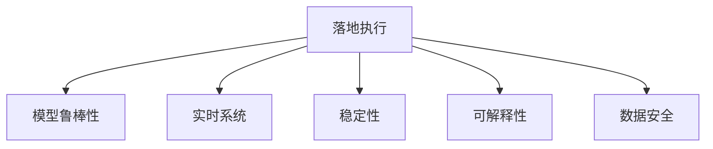

                 

# 行动体系:落地执行的保障

## 1. 背景介绍

### 1.1 问题由来
随着人工智能(AI)技术的快速发展，各种创新应用如智能推荐系统、无人驾驶、自然语言处理(NLP)等，已经逐渐渗透到我们生活的方方面面。然而，即使有了先进的技术和模型，AI应用真正落地执行仍然面临许多挑战，包括但不限于模型精度不足、系统鲁棒性差、用户体验不佳等。

为了解决这些问题，我们需要构建一套完整的行动体系，确保AI模型能够从实验室顺利“落地”到实际应用中，并提供可靠、高效的解决方案。本文章将围绕“行动体系”展开，从技术层面分析解决AI落地执行问题的策略和方法。

## 2. 核心概念与联系

### 2.1 核心概念概述

为更好地理解落地执行的行动体系，本节将介绍几个关键概念：

- **落地执行(Implementation)**：将研究验证的AI模型应用到实际业务流程中，实现商业价值。
- **模型鲁棒性(Robustness)**：模型在不同数据、环境、攻击下的稳定性和准确性。
- **实时系统(Real-Time System)**：需要快速响应，通常需要毫秒级延迟的系统。
- **稳定性(Stability)**：系统在面对异常情况时的稳定性，如服务器宕机、网络中断等。
- **可解释性(Explainability)**：模型决策过程的可解释性和透明性，有助于理解模型行为和提升用户信任。
- **数据安全(Data Security)**：保护数据隐私和安全，防止数据泄露和滥用。

通过理解这些概念，我们可以构建起完整的行动体系，解决AI落地执行中的各种问题。

### 2.2 核心概念原理和架构的 Mermaid 流程图



这个流程图展示了下游业务执行模型构建的关键环节，以及每个环节与执行效果的关系。

## 3. 核心算法原理 & 具体操作步骤

### 3.1 算法原理概述

落地执行的行动体系主要由以下几个步骤组成：

1. **数据预处理**：对原始数据进行清洗、标注、特征工程等操作，为模型的训练和应用打下基础。
2. **模型训练**：选择合适的算法和模型架构，对预处理后的数据进行训练，得到初始模型。
3. **模型优化**：通过超参数调优、正则化、dropout等技术手段，提升模型性能。
4. **模型部署**：将训练好的模型部署到生产环境，确保其能够在实际场景中稳定运行。
5. **监控评估**：在生产环境中对模型性能进行实时监控和评估，及时发现和解决问题。

每个步骤都至关重要，需要进行科学合理的规划和实施。

### 3.2 算法步骤详解

#### 3.2.1 数据预处理

数据预处理是模型落地执行的基础，主要包括：

- **数据清洗**：去除重复、错误、不完整的数据，确保数据质量。
- **数据标注**：为模型提供有标签的数据集，帮助模型学习输入和输出的关系。
- **特征工程**：选择合适的特征，并通过PCA、归一化、编码等技术手段，优化输入数据。

数据预处理的关键在于找到合适的数据处理策略，使数据能够满足模型的训练和应用要求。

#### 3.2.2 模型训练

模型训练是整个行动体系的核心环节，主要包括以下步骤：

- **选择合适的算法**：如线性回归、决策树、深度神经网络等。
- **选择合适的模型架构**：如卷积神经网络(CNN)、循环神经网络(RNN)、Transformer等。
- **训练数据划分**：将数据集划分为训练集、验证集和测试集，确保模型在不同数据集上的泛化能力。
- **选择合适的优化器**：如SGD、Adam、Adagrad等。
- **设置合适的学习率**：一般建议从1e-4开始调参，逐步减小学习率，直至收敛。

#### 3.2.3 模型优化

模型优化是提升模型性能的关键步骤，主要包括以下技术：

- **超参数调优**：通过网格搜索、随机搜索等方法，找到最优的超参数组合。
- **正则化技术**：使用L1正则、L2正则、dropout等技术手段，防止过拟合。
- **模型融合**：将多个模型的预测结果进行融合，提升模型的泛化能力和鲁棒性。

#### 3.2.4 模型部署

模型部署是将训练好的模型应用到实际场景中的关键步骤，主要包括以下内容：

- **模型存储**：将训练好的模型存储在分布式文件系统或数据库中，方便后续调用。
- **模型推理**：在生产环境中，对新的输入数据进行实时推理，提供预测结果。
- **系统优化**：优化模型的推理速度和内存占用，确保系统能够高效运行。

#### 3.2.5 监控评估

模型部署后，需要对其进行实时监控和评估，主要包括以下内容：

- **性能监控**：实时监测模型的推理速度、内存占用、响应时间等性能指标。
- **异常检测**：通过日志分析和异常检测技术，发现模型和系统中的问题。
- **用户反馈**：收集用户的使用反馈，进行模型迭代和优化。

### 3.3 算法优缺点

落地执行的行动体系具有以下优点：

- **系统性**：通过科学合理的步骤规划和实施，确保模型从训练到部署的各个环节都能得到有效保障。
- **可控性**：通过模型优化、监控评估等技术手段，及时发现和解决问题，确保模型性能和稳定性。
- **可复用性**：通过通用化的技术框架和工具，提高模型开发和部署的效率，降低开发成本。

同时，该体系也存在以下局限性：

- **成本高**：需要大量的数据、算力和人力支持，初期投入较高。
- **技术复杂**：涉及到模型训练、部署、监控等多个环节，技术难度较高。
- **灵活性差**：预定义的流程和策略可能无法灵活应对特定场景的需求。

## 4. 数学模型和公式 & 详细讲解 & 举例说明

### 4.1 数学模型构建

落地执行的行动体系需要构建多个数学模型，用于支持各个环节的决策。以下是几个关键数学模型的构建：

- **损失函数(Loss Function)**：用于衡量模型的预测结果与真实标签之间的差异。
- **优化算法(Optimizer)**：用于最小化损失函数，更新模型参数。
- **超参数(Hyperparameter)**：如学习率、批大小、迭代轮数等，需要合理设置以提升模型性能。

#### 4.1.1 损失函数

损失函数是模型训练中最重要的数学模型，其定义如下：

$$
\mathcal{L}(y, \hat{y}) = \frac{1}{N} \sum_{i=1}^N \ell(y_i, \hat{y}_i)
$$

其中，$y$为真实标签，$\hat{y}$为模型的预测结果，$\ell$为具体的损失函数（如均方误差、交叉熵等）。

#### 4.1.2 优化算法

优化算法用于最小化损失函数，提升模型参数的准确性。常用的优化算法包括SGD、Adam等，其基本思想如下：

- **SGD(随机梯度下降)**：
  $$
  \theta_{k+1} = \theta_k - \eta \nabla_{\theta} \mathcal{L}(\theta_k)
  $$

- **Adam**：
  $$
  m_k = \beta_1 m_{k-1} + (1-\beta_1) \nabla_{\theta} \mathcal{L}(\theta_k)
  $$
  $$
  v_k = \beta_2 v_{k-1} + (1-\beta_2) \nabla_{\theta} \mathcal{L}(\theta_k)^2
  $$
  $$
  \theta_{k+1} = \theta_k - \frac{\eta}{\sqrt{m_k}+\epsilon} m_k
  $$

#### 4.1.3 超参数

超参数需要根据具体的场景和需求进行调整，以保证模型性能和稳定性。常用的超参数包括学习率、批大小、迭代轮数等。

### 4.2 公式推导过程

以下是损失函数、优化算法和超参数的详细推导过程。

#### 4.2.1 损失函数推导

以均方误差损失函数为例，其推导如下：

$$
\mathcal{L}(y, \hat{y}) = \frac{1}{N} \sum_{i=1}^N (y_i - \hat{y}_i)^2
$$

最小化损失函数，可以得到：

$$
\theta_{k+1} = \theta_k - \eta \nabla_{\theta} \mathcal{L}(\theta_k)
$$

#### 4.2.2 优化算法推导

以Adam优化算法为例，其推导如下：

- **动量项**：
  $$
  m_k = \beta_1 m_{k-1} + (1-\beta_1) \nabla_{\theta} \mathcal{L}(\theta_k)
  $$

- **二阶动量项**：
  $$
  v_k = \beta_2 v_{k-1} + (1-\beta_2) \nabla_{\theta} \mathcal{L}(\theta_k)^2
  $$

- **更新**：
  $$
  \theta_{k+1} = \theta_k - \frac{\eta}{\sqrt{m_k}+\epsilon} m_k
  $$

其中，$\beta_1$和$\beta_2$为动量系数，$\epsilon$为数值稳定性系数。

#### 4.2.3 超参数推导

以学习率为例，其推导如下：

- **初始学习率**：
  $$
  \eta_0 = \frac{1}{L}
  $$

- **训练轮数**：
  $$
  T = \frac{N}{batch\_size}
  $$

- **学习率衰减**：
  $$
  \eta_t = \eta_0 \times (1 - \frac{t}{T})
  $$

其中，$L$为模型参数数量，$N$为样本总数，$batch\_size$为批大小。

### 4.3 案例分析与讲解

以下以推荐系统为例，分析落地执行的行动体系在实际应用中的具体实现。

- **数据预处理**：收集用户历史行为数据，并进行清洗、标注、特征工程等操作。
- **模型训练**：使用深度神经网络构建推荐模型，并通过Adam优化算法进行训练。
- **模型优化**：通过超参数调优和正则化技术，提升模型性能。
- **模型部署**：将训练好的模型部署到生产环境中，实时提供推荐结果。
- **监控评估**：实时监测模型性能，通过A/B测试和用户反馈进行模型迭代和优化。

## 5. 项目实践：代码实例和详细解释说明

### 5.1 开发环境搭建

在进行落地执行的行动体系开发前，我们需要准备好开发环境。以下是使用Python进行PyTorch开发的环境配置流程：

1. 安装Anaconda：从官网下载并安装Anaconda，用于创建独立的Python环境。

2. 创建并激活虚拟环境：
```bash
conda create -n pytorch-env python=3.8 
conda activate pytorch-env
```

3. 安装PyTorch：根据CUDA版本，从官网获取对应的安装命令。例如：
```bash
conda install pytorch torchvision torchaudio cudatoolkit=11.1 -c pytorch -c conda-forge
```

4. 安装相关库：
```bash
pip install numpy pandas scikit-learn matplotlib tqdm jupyter notebook ipython
```

5. 安装TensorBoard：用于实时监测模型训练和推理状态。

完成上述步骤后，即可在`pytorch-env`环境中开始行动体系开发。

### 5.2 源代码详细实现

下面我们以推荐系统为例，给出使用PyTorch构建推荐模型的代码实现。

```python
import torch
import torch.nn as nn
import torch.optim as optim
import numpy as np

# 定义模型结构
class RecommendationModel(nn.Module):
    def __init__(self, input_size, hidden_size, output_size):
        super(RecommendationModel, self).__init__()
        self.fc1 = nn.Linear(input_size, hidden_size)
        self.fc2 = nn.Linear(hidden_size, output_size)
    
    def forward(self, x):
        x = torch.relu(self.fc1(x))
        x = self.fc2(x)
        return x

# 定义损失函数
criterion = nn.MSELoss()

# 定义优化器
optimizer = optim.Adam(model.parameters(), lr=0.001)

# 训练模型
def train(model, data, batch_size, epochs):
    train_loss = 0.0
    for epoch in range(epochs):
        for i in range(0, len(data), batch_size):
            batch = data[i:i+batch_size]
            inputs, labels = batch
            optimizer.zero_grad()
            outputs = model(inputs)
            loss = criterion(outputs, labels)
            loss.backward()
            optimizer.step()
            train_loss += loss.item()
    return train_loss / len(data)

# 测试模型
def test(model, data, batch_size):
    test_loss = 0.0
    for i in range(0, len(data), batch_size):
        batch = data[i:i+batch_size]
        inputs, labels = batch
        outputs = model(inputs)
        loss = criterion(outputs, labels)
        test_loss += loss.item()
    return test_loss / len(data)
```

### 5.3 代码解读与分析

让我们再详细解读一下关键代码的实现细节：

**模型结构**：
- **层1**：全连接层，输入为$input\_size$，输出为$hidden\_size$。
- **层2**：全连接层，输入为$hidden\_size$，输出为$output\_size$。

**损失函数**：
- **均方误差损失函数**：
  $$
  \mathcal{L}(y, \hat{y}) = \frac{1}{N} \sum_{i=1}^N (y_i - \hat{y}_i)^2
  $$

**优化器**：
- **Adam优化算法**：
  $$
  m_k = \beta_1 m_{k-1} + (1-\beta_1) \nabla_{\theta} \mathcal{L}(\theta_k)
  $$
  $$
  v_k = \beta_2 v_{k-1} + (1-\beta_2) \nabla_{\theta} \mathcal{L}(\theta_k)^2
  $$
  $$
  \theta_{k+1} = \theta_k - \frac{\eta}{\sqrt{m_k}+\epsilon} m_k
  $$

### 5.4 运行结果展示

通过运行上述代码，我们可以在训练集和测试集上进行模型训练和测试，输出模型的训练和测试损失值。

## 6. 实际应用场景

### 6.1 智能推荐系统

智能推荐系统是落地执行行动体系的重要应用场景之一。推荐系统能够根据用户的历史行为数据，实时推荐符合用户兴趣的商品、文章、视频等内容，提升用户体验和系统转化率。

在技术实现上，可以收集用户浏览、点击、购买等行为数据，构建推荐模型，并进行训练和优化。在实际应用中，通过部署推荐模型，实时处理用户请求，提供个性化推荐结果。同时，通过A/B测试和用户反馈，不断优化模型，提升推荐效果。

### 6.2 医疗诊断系统

医疗诊断系统是落地执行行动体系的另一个重要应用场景。通过构建基于机器学习的诊断模型，医疗系统能够快速诊断患者的病情，提供专业意见。

在技术实现上，可以收集患者的临床数据、影像数据、基因数据等，构建诊断模型，并进行训练和优化。在实际应用中，通过部署诊断模型，实时处理患者的请求，提供诊断结果和建议。同时，通过医生审核和反馈，不断优化模型，提升诊断准确性和可靠性。

## 7. 工具和资源推荐

### 7.1 学习资源推荐

为了帮助开发者系统掌握落地执行的行动体系的理论基础和实践技巧，这里推荐一些优质的学习资源：

1. 《深度学习》系列书籍：由Ian Goodfellow等作者所著，全面介绍了深度学习的基本概念和实现方法，是深度学习领域经典著作。
2. 《TensorFlow实战》书籍：由Prajit Datta等作者所著，深入浅出地介绍了TensorFlow的用法和最佳实践，适合初学者和实战开发者。
3. 《动手学深度学习》系列视频：由李沐等人主讲的课程，涵盖深度学习的理论基础和实践应用，既有理论推导，又有代码实现。
4. PyTorch官方文档：提供了丰富的教程和代码样例，是学习和使用PyTorch的最佳资源。
5. Kaggle平台：提供了大量的开源数据集和竞赛，可以用于练习和验证机器学习模型的效果。

通过对这些资源的学习实践，相信你一定能够快速掌握落地执行的行动体系的理论基础和实践技巧。

### 7.2 开发工具推荐

高效的开发离不开优秀的工具支持。以下是几款用于落地执行行动体系开发的常用工具：

1. PyTorch：基于Python的开源深度学习框架，灵活动态的计算图，适合快速迭代研究。
2. TensorFlow：由Google主导开发的开源深度学习框架，生产部署方便，适合大规模工程应用。
3. Transformers库：HuggingFace开发的NLP工具库，集成了众多SOTA语言模型，支持PyTorch和TensorFlow，是进行落地执行的行动体系开发的利器。
4. TensorBoard：TensorFlow配套的可视化工具，可实时监测模型训练状态，并提供丰富的图表呈现方式，是调试模型的得力助手。
5. Weights & Biases：模型训练的实验跟踪工具，可以记录和可视化模型训练过程中的各项指标，方便对比和调优。
6. Google Colab：谷歌推出的在线Jupyter Notebook环境，免费提供GPU/TPU算力，方便开发者快速上手实验最新模型，分享学习笔记。

合理利用这些工具，可以显著提升落地执行的行动体系开发效率，加快创新迭代的步伐。

### 7.3 相关论文推荐

落地执行的行动体系的发展源于学界的持续研究。以下是几篇奠基性的相关论文，推荐阅读：

1. **深度学习框架PyTorch的设计和实现**：这篇文章介绍了PyTorch的设计理念和实现细节，是理解PyTorch的最佳文档。
2. **TensorFlow的优化与加速**：这篇文章探讨了TensorFlow的优化和加速技术，帮助开发者在生产环境中提升模型性能。
3. **可解释深度学习模型**：这篇文章介绍了如何通过可解释性技术，提升深度学习模型的透明性和可信度，是落地执行行动体系中的重要研究方向。
4. **推荐系统的最新进展**：这篇文章总结了推荐系统领域的最新研究进展，包括模型结构、算法优化和应用场景等方面。
5. **医疗诊断的机器学习应用**：这篇文章介绍了机器学习在医疗诊断中的应用，包括模型构建、数据处理和实际应用等方面。

这些论文代表了大规模落地执行行动体系的发展脉络，通过学习这些前沿成果，可以帮助研究者把握学科前进方向，激发更多的创新灵感。

## 8. 总结：未来发展趋势与挑战

### 8.1 研究成果总结

本文对落地执行的行动体系进行了全面系统的介绍。首先阐述了落地执行在AI应用中的重要意义，明确了行动体系在AI模型落地中的核心作用。其次，从原理到实践，详细讲解了落地执行的数学模型和操作步骤，给出了推荐系统的代码实现和运行结果。同时，本文还探讨了落地执行在智能推荐和医疗诊断等实际应用场景中的具体实现，展示了落地执行的广阔前景。此外，本文精选了落地执行的各类学习资源，力求为读者提供全方位的技术指引。

通过本文的系统梳理，可以看到，落地执行的行动体系能够有效解决AI模型从研究到应用的各个环节问题，是AI技术落地的关键保障。未来，伴随预训练语言模型和微调方法的持续演进，落地执行技术还将不断进步，为更多领域的智能化转型提供有力支持。

### 8.2 未来发展趋势

展望未来，落地执行的行动体系将呈现以下几个发展趋势：

1. **模型微调技术的发展**：随着微调技术的不断进步，模型微调过程将更加高效、灵活，进一步提升模型的泛化能力和鲁棒性。
2. **分布式训练和推理技术**：大规模模型的训练和推理需要强大的计算资源支持，分布式训练和推理技术将成为落地执行的关键。
3. **模型压缩和优化**：模型压缩和优化技术将使模型在保持高性能的同时，更高效地运行，降低资源消耗。
4. **模型融合和协同优化**：通过模型融合和协同优化，提升系统整体性能和可靠性。
5. **自动化调参技术**：自动化调参技术将帮助开发者在更短时间内找到最优模型，加速模型迭代。
6. **用户反馈和模型迭代**：通过用户反馈和模型迭代，不断优化系统性能，提升用户体验。

这些趋势将引领落地执行行动体系迈向更高的台阶，为AI技术落地应用提供更强大的保障。

### 8.3 面临的挑战

尽管落地执行的行动体系已经取得了一定的进展，但在迈向更加智能化、普适化应用的过程中，它仍面临着诸多挑战：

1. **数据质量和多样性**：缺乏高质量和多样化的数据，使得模型无法充分学习各种场景下的数据分布。
2. **模型复杂度**：大规模模型的训练和推理需要强大的计算资源支持，如何在保证性能的同时，优化资源使用，是未来的一大挑战。
3. **系统稳定性**：落地执行的行动体系需要面对多种异常情况，如网络中断、服务器宕机等，如何保证系统的稳定性是关键。
4. **模型可解释性**：模型往往是“黑盒”系统，如何提升模型的可解释性和透明性，是提升用户信任和系统可靠性的重要方向。
5. **模型鲁棒性**：模型在不同数据、环境下的稳定性和准确性仍需进一步提升，如何提高模型的鲁棒性，避免过拟合和灾难性遗忘，是未来的重要课题。

这些挑战凸显了落地执行行动体系的多样性和复杂性，需要从数据、算法、工程等多个维度进行深入研究。

### 8.4 研究展望

面对落地执行的行动体系所面临的种种挑战，未来的研究需要在以下几个方面寻求新的突破：

1. **数据增强技术**：通过数据增强技术，扩充训练数据集，提升模型的泛化能力和鲁棒性。
2. **模型压缩和优化技术**：开发更加高效的模型压缩和优化技术，降低模型资源消耗，提升模型性能。
3. **分布式训练和推理技术**：研究分布式训练和推理技术，提升大规模模型的训练和推理效率。
4. **自动化调参技术**：开发自动化调参技术，帮助开发者在更短时间内找到最优模型，加速模型迭代。
5. **模型融合和协同优化技术**：研究模型融合和协同优化技术，提升系统整体性能和可靠性。
6. **模型可解释性技术**：开发模型可解释性技术，提升模型的透明性和可信度。

这些研究方向将引领落地执行行动体系迈向更高的台阶，为AI技术落地应用提供更强大的保障。

## 9. 附录：常见问题与解答

**Q1：如何选择合适的超参数？**

A: 超参数的选择需要结合具体问题和数据情况进行。一般建议通过网格搜索、随机搜索等方法，找到最优的超参数组合。同时，可以通过交叉验证等技术手段，验证超参数的性能。

**Q2：什么是模型鲁棒性？**

A: 模型鲁棒性指的是模型在不同数据、环境下的稳定性和准确性。具体表现为模型在面对异常数据、攻击等情况下，仍然能够保持较好的性能和稳定性。

**Q3：如何提升模型的可解释性？**

A: 提升模型可解释性可以通过模型可视化、特征解释等技术手段实现。常用的工具包括TensorBoard、SHAP等，可以用于可视化模型的预测结果和特征重要性。

**Q4：什么是模型压缩和优化？**

A: 模型压缩和优化是提升模型性能和资源效率的关键技术。通过剪枝、量化、知识蒸馏等技术手段，可以使模型在保持高性能的同时，更高效地运行。

**Q5：什么是自动化调参？**

A: 自动化调参技术是一种通过算法自动搜索最优超参数组合的方法。常用的自动化调参技术包括贝叶斯优化、遗传算法等，可以帮助开发者在更短时间内找到最优模型。

以上是常见问题的详细解答，希望能帮助读者更好地理解落地执行的行动体系及其关键技术。

---

作者：禅与计算机程序设计艺术 / Zen and the Art of Computer Programming

