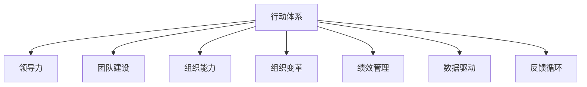

                 

# 行动体系：决定管理者的天花板

> 关键词：行动体系, 管理者的天花板, 领导力, 组织能力, 团队建设, 组织变革, 绩效管理, 数据驱动, 反馈循环

## 1. 背景介绍

### 1.1 问题由来

在现代企业中，管理者不仅需要面对复杂的业务环境，还需应对多变的市场需求。面对瞬息万变的商业环境，许多管理者感到力不从心，无法充分发挥自身潜力，导致工作效率低下、团队士气低落、业绩难以提升。这些现象的根本原因在于，缺乏一套行之有效的行动体系来指导管理者的决策和行动。

行动体系（Action System）是一套系统的理论和方法，旨在帮助管理者构建一套全面的管理体系，提升个人领导力、团队协作能力和组织绩效。通过行之有效的行动体系，管理者可以高效应对各种挑战，全面提升团队的整体表现，从而实现业务目标和自身职业发展的双重提升。

### 1.2 问题核心关键点

- 行动体系的核心在于将管理者的决策过程结构化，使其在面对复杂问题时能快速做出高质量的决策。
- 行动体系强调数据驱动的决策，通过收集和分析相关数据，形成科学的判断依据。
- 行动体系重视反馈机制，通过及时的反馈和调整，不断优化决策过程和团队表现。
- 行动体系强调跨部门协作，通过跨部门的有效沟通和协作，推动组织目标的实现。

## 2. 核心概念与联系

### 2.1 核心概念概述

为更好地理解行动体系，我们需要明确几个核心概念：

- **行动体系**：由一系列原则、方法、工具和流程组成，帮助管理者在复杂环境中高效决策、优化团队表现和实现组织目标。
- **领导力**：指管理者引导、激励和影响他人的能力，是构建高效行动体系的基础。
- **团队建设**：指通过有效沟通、协作和激励，形成高效运作的团队，是行动体系中重要的执行单元。
- **组织能力**：指组织在信息、知识、人员和技术等方面的综合能力，是行动体系取得成效的保障。
- **组织变革**：指通过改进组织结构、流程和文化，适应外部环境和内部需求的变化，是行动体系实现目标的必经之路。
- **绩效管理**：指通过设定目标、监控进展和评估结果，持续提升组织和个人表现，是行动体系的重要手段。
- **数据驱动**：指通过收集、分析和利用数据，驱动决策和行动，是行动体系的关键手段。
- **反馈循环**：指通过及时获取反馈信息，调整和优化行动体系，是确保行动体系持续有效的机制。

这些核心概念之间的逻辑关系可以通过以下Mermaid流程图来展示：



这个流程图展示了行动体系的各个组成部分及其之间的联系。

## 3. 核心算法原理 & 具体操作步骤

### 3.1 算法原理概述

行动体系的理论基础可以追溯到系统工程和组织行为学。其核心原理在于：

1. **系统思维**：将复杂的系统问题分解为若干可管理的子系统，通过协调各个子系统来实现整体目标。
2. **反馈控制**：通过持续的反馈和调整，使行动体系能够适应环境变化，实现动态优化。
3. **激励机制**：通过有效的激励和奖励机制，激发团队成员的积极性和创造性。
4. **信息共享**：通过建立透明的信息共享机制，提升团队协作效率和决策质量。
5. **持续改进**：通过不断的学习和改进，不断提升组织和个人能力。

### 3.2 算法步骤详解

构建行动体系的步骤大致如下：

1. **目标设定**：明确组织的长期和短期目标，确保目标具有明确性和可测量性。
2. **流程设计**：设计组织内各项业务的流程，确保流程高效、透明和可控。
3. **团队构建**：根据业务需要，组建和培养高效团队，明确团队成员的角色和职责。
4. **沟通机制**：建立有效的沟通机制，确保信息在组织内部和外部的顺畅流通。
5. **绩效管理**：设定科学的绩效指标，定期评估团队和个人的表现，并及时给予反馈。
6. **数据驱动**：通过收集、分析和利用数据，支持决策和行动。
7. **反馈循环**：定期获取反馈信息，及时调整行动体系，确保其持续有效。

### 3.3 算法优缺点

行动体系的优点：

1. **系统化管理**：通过系统化的方法，将复杂问题分解为可管理的小问题，便于管理者把握全局和局部。
2. **动态优化**：通过反馈循环机制，使行动体系能够动态适应环境变化，实现持续优化。
3. **数据驱动**：通过数据驱动的决策，提升决策的科学性和准确性。
4. **透明协作**：通过透明的信息共享机制，提升团队协作效率。
5. **激励机制**：通过有效的激励和奖励机制，激发团队成员的积极性和创造性。

行动体系的缺点：

1. **复杂度高**：构建和维护行动体系需要较高的专业知识和经验，对管理者的要求较高。
2. **实施难度大**：涉及组织内多个部门和层级的调整，实施过程中容易遇到阻力和挑战。
3. **数据依赖性**：对数据的收集和分析能力要求较高，数据不足或质量差会影响行动体系的效果。
4. **文化变革**：行动体系需要与组织的文化和价值观相契合，否则难以真正落地。
5. **维护成本高**：行动体系的持续维护和优化需要持续的资源投入和专业支持。

### 3.4 算法应用领域

行动体系在多个领域中得到了广泛的应用，例如：

1. **制造业**：通过行动体系提升生产效率和产品质量，优化供应链管理。
2. **金融业**：通过行动体系提升风险管理能力，优化投资决策。
3. **医疗行业**：通过行动体系提升医疗服务质量，优化患者体验。
4. **教育行业**：通过行动体系提升教学质量，优化学生管理。
5. **政府部门**：通过行动体系提升公共服务效率，优化政策制定和执行。
6. **非营利组织**：通过行动体系提升服务能力，优化资源配置。

## 4. 数学模型和公式 & 详细讲解 & 举例说明

### 4.1 数学模型构建

构建行动体系时，通常需要建立一些数学模型来支持决策和评估。以下是几个常见的数学模型：

1. **目标函数模型**：用于设定和评估目标的数学模型，如线性规划、整数规划等。
2. **绩效评估模型**：用于评估团队和个人绩效的数学模型，如KPI模型、OKR模型等。
3. **风险评估模型**：用于评估业务风险的数学模型，如蒙特卡洛模拟、VAR模型等。
4. **反馈调整模型**：用于优化反馈循环的数学模型，如自适应控制算法等。

### 4.2 公式推导过程

以目标函数模型为例，目标函数模型的一般形式为：

$$
\min_{x} f(x)
$$

其中 $f(x)$ 为目标函数，$x$ 为决策变量。目标函数模型需要满足以下条件：

1. 目标函数为凸函数，确保存在唯一的最优解。
2. 约束条件为线性等式和不等式，确保问题的可解性。
3. 目标函数的系数和约束条件的系数均为已知数，确保问题的可计算性。

目标函数模型的求解过程通常使用线性规划或整数规划算法，其数学推导过程如下：

1. 将目标函数 $f(x)$ 和约束条件 $g(x) \leq 0$ 转化为标准形式。
2. 使用单纯形法、内点法等算法求解线性规划问题。
3. 对于整数规划问题，使用分支定界法、割平面法等算法求解。
4. 对求解结果进行检验，确保满足约束条件。

### 4.3 案例分析与讲解

假设某制造企业希望通过行动体系提升生产效率和产品质量，其目标函数模型为：

$$
\min_{x} C
$$

其中 $C$ 为生产成本，包括原材料成本、人工成本和设备成本。约束条件为：

$$
\begin{cases}
x_i \geq 0, & \forall i \\
\sum_{i=1}^n x_i = M, & \text{生产量约束} \\
\sum_{i=1}^n x_i \cdot a_i \leq B, & \text{设备负荷约束} \\
\sum_{i=1}^n x_i \cdot b_i \leq W, & \text{人力负荷约束}
\end{cases}
$$

其中 $x_i$ 为第 $i$ 种产品的生产量，$M$ 为最大生产量，$B$ 为最大设备负荷，$W$ 为最大人力负荷，$a_i$ 和 $b_i$ 分别为第 $i$ 种产品的单位成本和单位价值。

通过求解该目标函数模型，可以确定各产品的最优生产量，从而实现生产效率和产品质量的提升。

## 5. 项目实践：代码实例和详细解释说明

### 5.1 开发环境搭建

构建行动体系通常需要使用多种工具和软件，以下是一些推荐的工具：

1. **Python**：作为行动体系构建的主要编程语言，Python具有丰富的数据分析和建模库。
2. **Excel**：用于数据收集和初步分析，方便构建和展示目标函数模型。
3. **Tableau**：用于数据可视化，方便进行绩效评估和反馈调整。
4. **JIRA**：用于项目管理，确保行动体系的实施进度和质量。
5. **Confluence**：用于知识管理，记录和共享行动体系的建设文档和反馈信息。

### 5.2 源代码详细实现

以下是一个使用Python实现目标函数模型求解的示例代码：

```python
from scipy.optimize import linprog

# 定义目标函数系数和约束条件系数
c = [1, 1, 1]  # 生产成本系数
A = [[1, 1, 1], [1, 0, 0], [0, 1, 0]]  # 设备负荷系数矩阵
b = [100, 20, 10]  # 设备负荷约束
A_eq = [[1, 1, 1], [1, 1, 1]]  # 生产量约束系数矩阵
b_eq = [150, 50]  # 生产量约束

# 构建目标函数模型
model = linprog(c, A_ub=A, b_ub=b, A_eq=A_eq, b_eq=b_eq)

# 输出最优解
print("最优生产量：", model.x)
print("最优生产成本：", model.fun)
```

### 5.3 代码解读与分析

上述代码使用了SciPy库中的linprog函数，用于求解线性规划问题。代码中的变量 $c$、$A$、$b$、$A_{\text{eq}}$ 和 $b_{\text{eq}}$ 分别代表了目标函数系数、约束条件系数、设备负荷约束、生产量约束和生产量约束的取值。通过求解该模型，可以得到最优的生产量分配，从而实现生产效率和产品质量的提升。

## 6. 实际应用场景

### 6.1 智能制造

在智能制造领域，行动体系可以帮助制造企业通过优化生产流程和资源配置，提升生产效率和产品质量。具体而言，可以采用以下措施：

1. **流程优化**：通过分析生产流程中的瓶颈和浪费环节，优化流程设计，提升生产效率。
2. **设备管理**：通过实时监控设备运行状态和维护周期，合理分配设备资源，延长设备寿命。
3. **人员培训**：通过培训和考核机制，提升员工技能，减少人为错误。
4. **质量控制**：通过建立质量管理体系，定期进行质量检验，确保产品质量。
5. **数据驱动**：通过收集和分析生产数据，优化生产调度，提升生产效率。

### 6.2 金融投资

在金融投资领域，行动体系可以帮助金融机构通过优化投资组合和风险管理，提升投资回报率和风险控制能力。具体而言，可以采用以下措施：

1. **资产配置**：通过构建投资组合模型，优化资产配置，提升投资回报率。
2. **风险管理**：通过建立风险评估模型，识别和管理投资风险，确保投资安全。
3. **绩效评估**：通过设定绩效指标，评估投资表现，优化投资策略。
4. **数据驱动**：通过收集和分析市场数据，优化投资决策，提升投资收益。
5. **反馈调整**：通过定期获取市场反馈，调整投资策略，确保投资策略的持续有效性。

### 6.3 公共服务

在公共服务领域，行动体系可以帮助政府部门通过优化流程和服务质量，提升公共服务效率和公众满意度。具体而言，可以采用以下措施：

1. **流程优化**：通过分析服务流程中的瓶颈和问题，优化流程设计，提升服务效率。
2. **数据驱动**：通过收集和分析服务数据，优化服务调度，提升服务质量。
3. **绩效评估**：通过设定绩效指标，评估服务表现，优化服务策略。
4. **反馈调整**：通过定期获取公众反馈，调整服务策略，确保服务策略的持续有效性。
5. **跨部门协作**：通过建立跨部门协作机制，提升服务协同效率，优化服务资源配置。

## 7. 工具和资源推荐

### 7.1 学习资源推荐

为了帮助开发者系统掌握行动体系的理论基础和实践技巧，这里推荐一些优质的学习资源：

1. **《系统工程导论》**：该书系统介绍了系统工程的基本原理和方法，是行动体系的理论基础。
2. **《组织行为学》**：该书介绍了组织行为学的基础理论和方法，是行动体系的理论基础。
3. **《行动体系构建指南》**：该书详细介绍了构建行动体系的步骤和方法，适合实战应用。
4. **《管理信息系统》**：该书介绍了管理信息系统的基本原理和方法，是行动体系的重要工具。
5. **《数据驱动的决策》**：该书介绍了数据驱动决策的方法和应用，是行动体系的关键手段。

通过对这些资源的学习实践，相信你一定能够快速掌握行动体系的精髓，并用于解决实际的组织问题。

### 7.2 开发工具推荐

高效的开发离不开优秀的工具支持。以下是几款用于行动体系构建开发的常用工具：

1. **Python**：作为行动体系构建的主要编程语言，Python具有丰富的数据分析和建模库。
2. **Excel**：用于数据收集和初步分析，方便构建和展示目标函数模型。
3. **Tableau**：用于数据可视化，方便进行绩效评估和反馈调整。
4. **JIRA**：用于项目管理，确保行动体系的实施进度和质量。
5. **Confluence**：用于知识管理，记录和共享行动体系的建设文档和反馈信息。

合理利用这些工具，可以显著提升行动体系的开发效率，加快创新迭代的步伐。

### 7.3 相关论文推荐

行动体系的发展源于学界的持续研究。以下是几篇奠基性的相关论文，推荐阅读：

1. **《系统工程方法论》**：该书系统介绍了系统工程的基本原理和方法，是行动体系的理论基础。
2. **《组织行为学导论》**：该书介绍了组织行为学的基础理论和方法，是行动体系的理论基础。
3. **《行动体系构建方法》**：该论文详细介绍了构建行动体系的步骤和方法，是行动体系的实践指南。
4. **《数据驱动的决策方法》**：该论文介绍了数据驱动决策的方法和应用，是行动体系的关键手段。
5. **《反馈控制系统的设计》**：该论文介绍了反馈控制系统的设计方法，是行动体系的优化手段。

这些论文代表了大行动体系的发展脉络。通过学习这些前沿成果，可以帮助研究者把握学科前进方向，激发更多的创新灵感。

## 8. 总结：未来发展趋势与挑战

### 8.1 总结

本文对行动体系进行了全面系统的介绍。首先阐述了行动体系的研究背景和意义，明确了行动体系在提升管理者决策能力和团队表现方面的独特价值。其次，从原理到实践，详细讲解了行动体系的理论基础和实施步骤，给出了行动体系构建的完整代码实例。同时，本文还探讨了行动体系在多个领域的应用前景，展示了行动体系的巨大潜力。最后，本文精选了行动体系的各类学习资源，力求为读者提供全方位的技术指引。

通过本文的系统梳理，可以看到，行动体系是一套全面、系统、动态的管理体系，有助于管理者高效决策、优化团队表现和实现组织目标。行动体系的构建不仅需要深厚的理论知识，还需要科学的方法和工具，更需要实践的不断打磨和优化。唯有从数据、算法、工程、业务等多个维度协同发力，才能真正实现行动体系的价值。

### 8.2 未来发展趋势

展望未来，行动体系的发展将呈现以下几个趋势：

1. **智能化**：随着人工智能技术的发展，行动体系将更加智能化，能够通过大数据和机器学习技术，提升决策和执行的精准性。
2. **个性化**：行动体系将更加注重个性化管理，根据不同管理者和团队的特点，提供定制化的解决方案。
3. **集成化**：行动体系将与其他管理工具和方法集成，形成一体化的管理系统，提升管理效率。
4. **可视化**：行动体系将更加注重可视化，通过图形界面和数据仪表盘，提升管理者的决策能力和执行效率。
5. **云化**：行动体系将更加云化，通过云端服务和云计算技术，实现数据共享和协同办公。

### 8.3 面临的挑战

尽管行动体系已经取得了一定的成果，但在实践中仍面临诸多挑战：

1. **实施难度大**：构建和维护行动体系需要较高的专业知识和经验，对管理者的要求较高。
2. **文化变革难**：行动体系需要与组织的文化和价值观相契合，否则难以真正落地。
3. **数据依赖高**：对数据的收集和分析能力要求较高，数据不足或质量差会影响行动体系的效果。
4. **执行成本高**：行动体系的实施需要持续的资源投入和专业支持。
5. **反馈机制慢**：获取及时的反馈信息是行动体系持续优化的关键，但在实际应用中往往难以实现。

### 8.4 研究展望

面对行动体系面临的挑战，未来的研究需要在以下几个方面寻求新的突破：

1. **智能化模型**：开发更加智能化的行动体系模型，通过大数据和机器学习技术，提升决策和执行的精准性。
2. **个性化设计**：研究行动体系个性化设计方法，根据不同管理者和团队的特点，提供定制化的解决方案。
3. **集成化管理**：研究行动体系与其他管理工具和方法的集成方法，形成一体化的管理系统。
4. **可视化工具**：开发更加可视化、易用的行动体系工具，提升管理者的决策能力和执行效率。
5. **云化部署**：研究行动体系云化部署方法，通过云端服务和云计算技术，实现数据共享和协同办公。

这些研究方向的探索，必将引领行动体系技术迈向更高的台阶，为构建高效、智能、个性化的管理组织提供坚实基础。面向未来，行动体系还需要与其他人工智能技术进行更深入的融合，共同推动管理智能化的进程。只有勇于创新、敢于突破，才能不断拓展行动体系的边界，让管理技术更好地服务于组织和员工。

## 9. 附录：常见问题与解答

**Q1：行动体系是否适用于所有组织？**

A: 行动体系适用于大多数组织，但需要根据组织的特点和需求进行定制化设计和实施。对于复杂性较高的组织，如大型跨国企业或政府机构，可能需要更高级别的行动体系来支持其复杂的业务和组织结构。

**Q2：行动体系的实施需要多少资源？**

A: 行动体系的实施需要投入大量的人力、物力和财力资源。通常需要专业的行动体系顾问、数据科学家、IT技术人员等进行配合。同时，还需要建立完善的数据收集和分析体系，以及跨部门的协作机制。

**Q3：行动体系是否需要持续改进？**

A: 行动体系需要持续改进，以适应不断变化的外部环境和内部需求。定期进行绩效评估和反馈调整，及时优化行动体系，确保其持续有效性。

**Q4：行动体系在实施过程中如何规避风险？**

A: 行动体系在实施过程中需要识别和规避各种风险，如技术风险、数据风险、文化风险等。建立风险管理体系，定期进行风险评估和控制，确保行动体系的安全性和稳定性。

**Q5：行动体系在落地过程中有哪些常见问题？**

A: 行动体系在落地过程中可能会遇到以下问题：

1. 数据收集和分析不足：数据不足或质量差会影响行动体系的效果。
2. 文化冲突：行动体系需要与组织的文化和价值观相契合，否则难以真正落地。
3. 技术复杂度高：行动体系的构建和维护需要较高的专业知识和经验，对管理者的要求较高。
4. 实施难度大：涉及组织内多个部门和层级的调整，实施过程中容易遇到阻力和挑战。

这些问题的解决需要结合具体情况，进行科学的管理和决策。

---

作者：禅与计算机程序设计艺术 / Zen and the Art of Computer Programming

