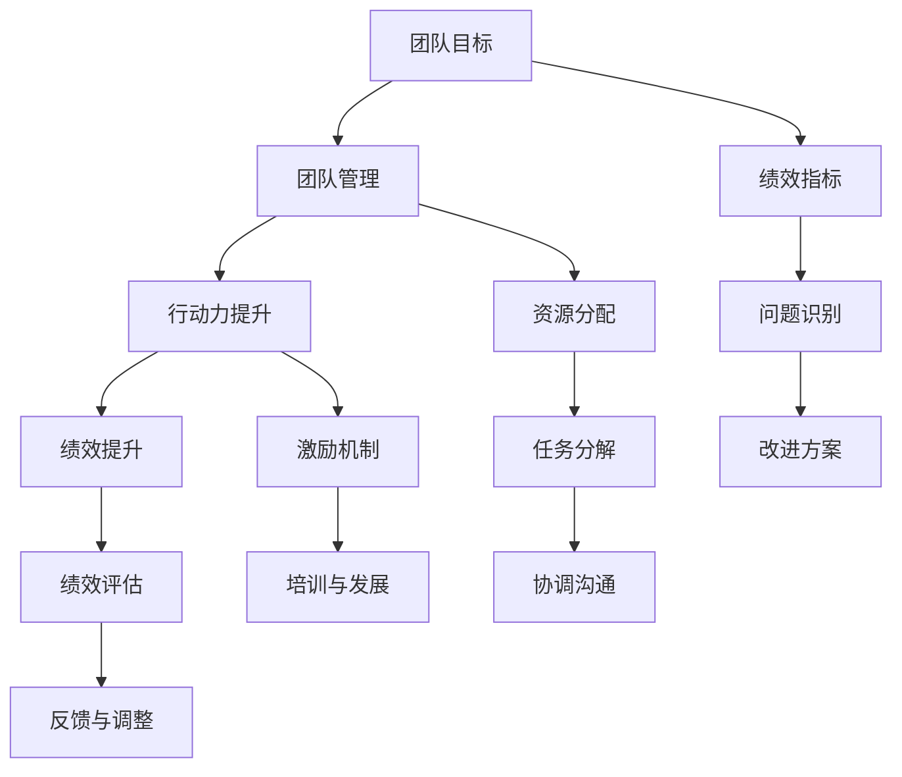

                 

# 行动力与团队performance

> 关键词：行动力，团队管理，绩效提升，目标设定，协作文化，团队激励

## 1. 背景介绍

在当代社会，科技发展迅速，企业竞争激烈，团队协作与绩效管理已成为企业成功的重要因素。如何提升团队行动力，实现高效管理，提高团队绩效，是摆在每一个企业面前的重要课题。本文将从多个角度探讨团队行动力与绩效提升的有效方法，帮助企业构建高效团队，实现长远发展。

## 2. 核心概念与联系

### 2.1 核心概念概述

在探讨团队绩效提升的过程中，我们首先要明确一些核心概念：

- **行动力**：指团队成员主动执行任务、达成目标的能力和意愿。行动力高的团队能够迅速响应变化、高效完成任务。

- **团队绩效**：指团队在特定任务或项目中取得的成绩和效益。包括任务完成度、质量、客户满意度等多个维度。

- **团队管理**：指企业通过制定规章制度、分配资源、协调沟通等手段，实现团队目标的过程。

- **绩效提升**：指通过科学的方法和工具，识别团队存在的问题，制定改进方案，提高团队绩效。

这些概念之间存在密切联系，团队管理是实现绩效提升的手段，而团队行动力是绩效提升的基础。

### 2.2 核心概念原理和架构的 Mermaid 流程图



此图展示了团队绩效提升的逻辑流程：

1. 首先明确团队目标（A），并设置绩效指标（E）。
2. 通过团队管理（B），分配资源（H）、分解任务（I）和协调沟通（J）。
3. 提升团队行动力（C），引入激励机制（K）和培训与发展（L）。
4. 最终实现绩效提升（D），通过绩效评估（M）、反馈与调整（N）不断优化。

## 3. 核心算法原理 & 具体操作步骤

### 3.1 算法原理概述

团队绩效提升的核心在于提升团队行动力，即通过科学的管理方法和激励机制，激发团队成员的主动性和积极性。该过程可以分解为以下步骤：

1. **目标设定**：明确团队目标，并设定具体的绩效指标。
2. **任务分解**：将大任务分解为小任务，分配给不同团队成员。
3. **资源分配**：合理分配资源，确保任务顺利进行。
4. **协调沟通**：建立有效的沟通机制，确保信息畅通。
5. **行动力提升**：通过激励机制和培训发展，提升团队行动力。
6. **绩效评估**：定期评估团队绩效，提供反馈，并根据反馈调整策略。

### 3.2 算法步骤详解

以下是提升团队绩效的具体操作步骤：

**Step 1: 目标设定**

1. **明确目标**：与团队成员讨论，明确团队需要达成的主要目标。确保目标具体、可量化，具备挑战性和可实现性。
2. **设定指标**：设定关键绩效指标(KPIs)，如任务完成度、质量、客户满意度等。这些指标应与团队目标紧密相关。

**Step 2: 任务分解**

1. **任务分析**：将大任务分解为多个小任务，每个任务有明确的目标和负责人。
2. **资源需求**：评估每个小任务所需的资源，包括时间、人力、物力等。
3. **分配任务**：根据团队成员的能力和兴趣，合理分配任务。确保每个成员都能发挥所长。

**Step 3: 资源分配**

1. **预算管理**：根据任务需求，合理分配预算，确保资源充足。
2. **设备调配**：调配必要的设备和技术支持，确保任务顺利进行。

**Step 4: 协调沟通**

1. **信息共享**：建立共享信息平台，确保团队成员随时了解任务进展和团队动态。
2. **定期会议**：定期召开会议，汇报工作进展，讨论遇到的问题和解决方案。
3. **反馈机制**：建立反馈机制，及时收集团队成员的意见和建议，并及时作出调整。

**Step 5: 行动力提升**

1. **激励机制**：设立激励机制，如绩效奖金、晋升机会等，激励团队成员积极工作。
2. **培训与发展**：提供必要的培训和发展机会，提升团队成员的技能和知识水平。
3. **文化建设**：营造积极向上的团队文化，增强团队凝聚力。

**Step 6: 绩效评估**

1. **数据收集**：定期收集关键绩效数据，如任务完成情况、质量评估、客户满意度等。
2. **绩效评估**：根据设定的绩效指标，评估团队整体和成员个人的绩效表现。
3. **反馈与调整**：根据评估结果，提供反馈，调整策略，优化管理流程。

### 3.3 算法优缺点

团队绩效提升的算法有以下优点：

1. **系统化管理**：通过明确的目标设定、任务分解、资源分配和协调沟通，确保团队高效运作。
2. **激励效果好**：通过激励机制和培训发展，激发团队成员的主动性和积极性。
3. **持续改进**：通过绩效评估和反馈机制，不断优化管理流程，提高团队绩效。

同时，该算法也存在以下缺点：

1. **复杂度高**：需要制定详细的计划和流程，涉及多个环节，管理复杂。
2. **依赖资源**：需要充足的预算和资源支持，才能有效实施。
3. **文化建设难**：营造积极向上的团队文化需要时间和努力，且难以短时间内见效。

### 3.4 算法应用领域

团队绩效提升的算法在多个领域都有广泛应用，如IT项目开发、生产制造、市场营销等。通过科学的管理和激励，帮助企业提升团队绩效，实现高效运营。

## 4. 数学模型和公式 & 详细讲解 & 举例说明

### 4.1 数学模型构建

我们可以用以下数学模型来表示团队绩效提升的过程：

设团队目标为 $T$，团队成员为 $M_i$，任务为 $T_i$，资源为 $R_i$，绩效指标为 $KPI_j$。则模型可以表示为：

$$
P = \sum_{j=1}^{n} KPI_j \times weight_j
$$

其中 $P$ 表示团队绩效，$KPI_j$ 为第 $j$ 个关键绩效指标，$weight_j$ 为指标权重。

### 4.2 公式推导过程

假设我们有两个任务 $T_1$ 和 $T_2$，两个成员 $M_1$ 和 $M_2$，以及三个资源 $R_1$、$R_2$ 和 $R_3$。每个任务和资源都有对应的绩效指标 $KPI_1$、$KPI_2$、$KPI_3$ 和 $KPI_4$。则团队绩效 $P$ 的计算过程如下：

1. **任务分解**：将 $T_1$ 分解为 $T_{11}$ 和 $T_{12}$，$T_2$ 分解为 $T_{21}$ 和 $T_{22}$。
2. **资源分配**：将 $R_1$ 分配给 $T_{11}$ 和 $T_{21}$，$R_2$ 分配给 $T_{12}$ 和 $T_{22}$，$R_3$ 作为公共资源。
3. **绩效评估**：评估每个任务和资源的绩效，计算每个指标 $KPI_j$ 的实际值。
4. **加权求和**：根据各指标的权重，计算团队绩效 $P$。

### 4.3 案例分析与讲解

以一个IT项目开发团队为例，团队目标为在3个月内开发出一个功能完善的Web应用。设绩效指标包括任务完成度、代码质量、客户满意度等。通过明确目标和任务分解，将开发任务分解为多个子任务，分配给不同团队成员。通过资源分配和协调沟通，确保每个子任务所需资源充足，团队成员信息畅通。通过激励机制和培训发展，提升团队行动力，确保高质量完成各项任务。最终，通过绩效评估和反馈机制，优化团队管理流程，提升团队绩效。

## 5. 项目实践：代码实例和详细解释说明

### 5.1 开发环境搭建

在进行团队绩效提升的实践之前，我们需要准备好开发环境。以下是使用Python进行项目管理实践的环境配置流程：

1. 安装Anaconda：从官网下载并安装Anaconda，用于创建独立的Python环境。

2. 创建并激活虚拟环境：
```bash
conda create -n py_env python=3.8 
conda activate py_env
```

3. 安装PyTorch：根据CUDA版本，从官网获取对应的安装命令。例如：
```bash
conda install pytorch torchvision torchaudio cudatoolkit=11.1 -c pytorch -c conda-forge
```

4. 安装Pandas和Matplotlib等常用库：
```bash
pip install pandas matplotlib scikit-learn jupyter notebook ipython
```

完成上述步骤后，即可在`py_env`环境中开始项目管理实践。

### 5.2 源代码详细实现

下面以一个简单的项目管理实践为例，给出使用Python进行团队绩效评估的代码实现。

```python
import pandas as pd
from sklearn.metrics import mean_squared_error, mean_absolute_error

# 假设我们有如下数据
# 任务名称  |  负责人  |  完成度  |  质量  |  客户满意度
tasks = {
    '任务1': {'负责人': '小张', '完成度': 0.9, '质量': 4.5, '客户满意度': 5.0},
    '任务2': {'负责人': '小李', '完成度': 0.8, '质量': 4.2, '客户满意度': 4.5},
    '任务3': {'负责人': '小王', '完成度': 0.7, '质量': 4.1, '客户满意度': 3.8},
    '任务4': {'负责人': '小赵', '完成度': 0.6, '质量': 3.8, '客户满意度': 3.5}
}

# 计算团队绩效
def calculate_team_performance(tasks, weight):
    total_performance = 0
    for task, info in tasks.items():
        performance = (info['完成度'] * weight['完成度'] +
                       info['质量'] * weight['质量'] +
                       info['客户满意度'] * weight['客户满意度'])
        total_performance += performance
    return total_performance

# 假设绩效指标权重如下
weight = {'完成度': 0.4, '质量': 0.3, '客户满意度': 0.3}

# 计算团队绩效
team_performance = calculate_team_performance(tasks, weight)

# 输出团队绩效
print(f"团队绩效为：{team_performance:.2f}")
```

### 5.3 代码解读与分析

让我们再详细解读一下关键代码的实现细节：

**tasks字典**：
- 定义了多个任务的信息，包括任务名称、负责人、完成度、质量、客户满意度等。

**calculate_team_performance函数**：
- 计算每个任务的绩效，并根据指标权重加权求和，得到团队绩效。

**weight字典**：
- 定义了绩效指标的权重，用于计算加权绩效。

**main函数**：
- 调用calculate_team_performance函数，计算团队绩效，并输出结果。

通过这段代码，我们可以看到如何使用Python进行团队绩效的计算和评估。当然，在实际应用中，团队规模可能更大，任务更复杂，需要更加系统和复杂的管理工具。但核心的绩效计算过程与上述代码类似。

## 6. 实际应用场景

### 6.1 IT项目开发

在IT项目开发中，团队绩效提升尤为重要。传统的项目管理方式依赖大量人工统计和手动监控，效率低下。通过使用科学的管理工具和方法，可以显著提升项目管理效率和团队绩效。

例如，一个Web应用开发团队，可以利用项目管理软件记录任务分配、进度跟踪、质量评估等数据。通过科学地设定绩效指标和权重，利用上述代码计算团队绩效。根据计算结果，及时调整管理策略，优化资源分配，提升团队行动力，确保项目按时高质量完成。

### 6.2 生产制造

生产制造企业面临的生产任务多、生产周期长、质量要求高等特点，使得团队绩效提升尤为重要。通过科学的项目管理和绩效评估，可以有效提升生产效率和产品质量。

例如，汽车制造企业可以采用精益生产方法，将生产任务分解为多个小任务，明确每个任务的完成标准和责任人。通过合理的资源分配和协调沟通，确保每个任务按时完成，并利用上述代码计算团队绩效。根据绩效结果，及时调整生产流程，提升团队行动力，确保产品质量和生产效率。

### 6.3 市场营销

市场营销团队需要快速响应市场变化，高效执行各项营销活动。通过科学的项目管理和绩效评估，可以提升团队行动力，提高营销效果。

例如，一个品牌推广团队可以设定销售额、市场份额、客户增长等绩效指标，利用项目管理软件记录各项任务和活动。通过合理的任务分解和资源分配，确保各项任务按时完成。利用上述代码计算团队绩效，根据结果及时调整策略，提升团队行动力，确保市场推广效果。

### 6.4 未来应用展望

随着科技的进步，团队绩效提升的方法也在不断演进。未来，以下趋势将深刻影响团队管理：

1. **AI辅助管理**：利用AI技术进行任务分配、进度跟踪和绩效评估，提升管理效率和准确性。
2. **自适应管理**：根据团队绩效动态调整管理策略，实现个性化管理。
3. **跨领域应用**：将团队绩效提升方法应用于更多领域，如金融、医疗、教育等。
4. **全球化管理**：利用互联网技术实现全球化协作和绩效管理。
5. **数据驱动管理**：通过大数据分析，实时监控和评估团队绩效，提供数据支持。

## 7. 工具和资源推荐

### 7.1 学习资源推荐

为了帮助开发者掌握团队绩效提升的理论和实践，这里推荐一些优质的学习资源：

1. **《精益生产与项目管理》书籍**：介绍精益生产方法和管理工具，帮助你提升项目管理效率。
2. **《敏捷项目管理》课程**：涵盖敏捷项目管理的基本概念和实践方法，适合各层次的项目经理。
3. **Scrum官方文档**：Scrum框架的官方文档，提供详细的项目管理流程和最佳实践。
4. **PMI（项目管理协会）网站**：提供大量项目管理相关的资源和培训课程，适合系统学习。
5. **Coursera《项目管理》课程**：斯坦福大学开设的项目管理课程，涵盖项目管理的基础知识和高级技巧。

通过对这些资源的学习实践，相信你一定能够掌握团队绩效提升的精髓，并用于解决实际的团队管理问题。

### 7.2 开发工具推荐

高效的开发离不开优秀的工具支持。以下是几款用于团队绩效提升开发的常用工具：

1. **JIRA**：项目管理工具，支持任务分配、进度跟踪和绩效评估，适用于各类项目。
2. **Trello**：项目管理工具，通过看板方式展示任务进展，适合小型团队。
3. **Confluence**：知识管理工具，支持团队文档共享和项目管理，适用于大型企业。
4. **GitLab**：开源项目管理工具，支持代码版本控制和项目协作，适合软件开发团队。
5. **Slack**：团队沟通工具，支持实时消息、频道管理等，提升团队协作效率。

合理利用这些工具，可以显著提升团队绩效提升的开发效率，加快创新迭代的步伐。

### 7.3 相关论文推荐

团队绩效提升的研究涉及多个领域，以下是几篇奠基性的相关论文，推荐阅读：

1. **《敏捷软件开发：原则、模式与实践》**：软件工程领域的经典著作，介绍敏捷开发的基本原则和方法。
2. **《精益思想：管理变革指南》**：精益生产方法的经典书籍，介绍精益生产的基本思想和实践步骤。
3. **《大规模协作：如何激励1300万个学生》**：教育领域的经典著作，介绍如何通过协作提升学习效果。
4. **《项目管理：制定计划、执行项目、掌控进度》**：项目管理领域的经典著作，涵盖项目管理的各个方面。
5. **《数据分析与统计：使用Python进行数据探索》**：数据科学领域的经典教材，介绍数据探索和分析的基本方法。

这些论文代表了大规模协作和项目管理的研究脉络。通过学习这些前沿成果，可以帮助研究者把握学科前进方向，激发更多的创新灵感。

## 8. 总结：未来发展趋势与挑战

### 8.1 研究成果总结

本文从多个角度探讨了团队行动力与绩效提升的有效方法。通过明确目标、任务分解、资源分配、协调沟通、行动力提升和绩效评估，帮助企业构建高效团队，实现长远发展。

### 8.2 未来发展趋势

展望未来，团队绩效提升技术将呈现以下几个发展趋势：

1. **AI辅助管理**：利用AI技术进行任务分配、进度跟踪和绩效评估，提升管理效率和准确性。
2. **自适应管理**：根据团队绩效动态调整管理策略，实现个性化管理。
3. **跨领域应用**：将团队绩效提升方法应用于更多领域，如金融、医疗、教育等。
4. **全球化管理**：利用互联网技术实现全球化协作和绩效管理。
5. **数据驱动管理**：通过大数据分析，实时监控和评估团队绩效，提供数据支持。

### 8.3 面临的挑战

尽管团队绩效提升技术已经取得了显著进展，但在迈向更加智能化、普适化应用的过程中，仍面临诸多挑战：

1. **管理复杂度高**：科学管理需要制定详细的计划和流程，涉及多个环节，管理复杂。
2. **资源需求高**：科学管理需要充足的预算和资源支持，才能有效实施。
3. **文化建设难**：营造积极向上的团队文化需要时间和努力，且难以短时间内见效。

### 8.4 研究展望

面对团队绩效提升所面临的种种挑战，未来的研究需要在以下几个方面寻求新的突破：

1. **AI辅助管理**：探索如何利用AI技术简化管理流程，提高管理效率。
2. **自适应管理**：研究自适应管理策略，根据团队状态动态调整管理策略。
3. **跨领域应用**：将团队绩效提升方法应用于更多领域，提升各领域的协作效率。
4. **全球化管理**：探索全球化协作和绩效管理的新方法，应对复杂多变的全球环境。
5. **数据驱动管理**：利用大数据和AI技术，实时监控和评估团队绩效，提供科学决策支持。

这些研究方向的探索，必将引领团队绩效提升技术迈向更高的台阶，为构建高效、智能化的团队提供有力支持。面向未来，团队绩效提升技术还需要与其他人工智能技术进行更深入的融合，如知识表示、因果推理、强化学习等，共同推动团队协作系统的进步。只有勇于创新、敢于突破，才能不断拓展团队绩效提升的边界，让智能技术更好地服务于团队协作和社会发展。

## 9. 附录：常见问题与解答

**Q1：如何平衡团队成员的工作负荷？**

A: 平衡团队成员的工作负荷是团队绩效提升的重要一环。可以通过以下方法实现：

1. **任务分配公平**：根据团队成员的能力和兴趣，合理分配任务，确保每个人都能发挥所长。
2. **任务难度均衡**：将任务分为易、中、难三个层次，确保团队成员都有机会挑战自己。
3. **时间管理合理**：合理安排任务时间，避免过度加班和积压任务。

**Q2：如何提升团队成员的参与感和积极性？**

A: 提升团队成员的参与感和积极性是团队绩效提升的关键。可以通过以下方法实现：

1. **明确目标和意义**：向团队成员解释任务目标和其重要性，激发其内驱力。
2. **给予自主权**：给予团队成员自主决策和解决问题的权利，增加其责任感。
3. **及时反馈**：及时给予团队成员反馈和认可，增强其成就感和归属感。

**Q3：如何进行有效的绩效评估？**

A: 有效的绩效评估是团队绩效提升的基础。可以通过以下方法实现：

1. **设定明确的绩效指标**：设定具体、可量化的绩效指标，如任务完成度、质量、客户满意度等。
2. **定期评估和反馈**：定期进行绩效评估，及时提供反馈和改进建议。
3. **多维度评估**：结合任务完成情况、质量、客户满意度等多个维度进行评估，全面了解团队绩效。

**Q4：如何应对团队成员的绩效波动？**

A: 团队成员的绩效波动是常见问题，需要通过以下方法应对：

1. **原因分析**：及时分析绩效波动的原因，如任务难度、资源不足等，及时解决。
2. **调整策略**：根据分析结果，调整管理策略，优化资源分配，提升任务合理性。
3. **心理辅导**：关注团队成员的心理状态，提供必要的支持和辅导，增强其信心和动力。

**Q5：如何建立积极的团队文化？**

A: 建立积极向上的团队文化是提升团队绩效的重要保障。可以通过以下方法实现：

1. **共同愿景**：确立共同的团队愿景和价值观，增强团队凝聚力。
2. **团队活动**：定期组织团队活动，增强团队成员的互信和协作。
3. **公开透明**：建立透明的沟通机制，增强团队成员的信任和归属感。

通过回答这些问题，希望能帮助你更好地理解团队绩效提升的方法和技巧，提升团队行动力，实现高效管理。

---

作者：禅与计算机程序设计艺术 / Zen and the Art of Computer Programming

