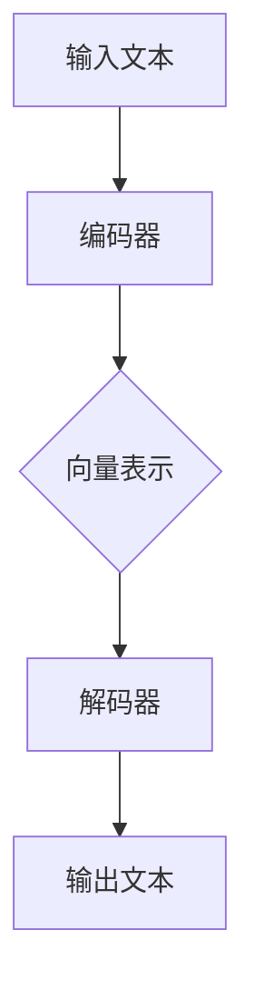
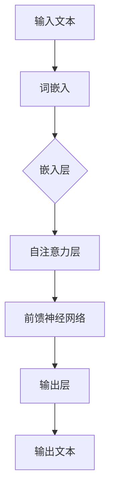

                 

# 文章标题

LLM辅助创意写作：AI与人类作家的协作

## 关键词
- Large Language Model
- AI辅助写作
- 创意写作
- 人类-机器协作
- 提示工程
- 自然语言处理

## 摘要
本文探讨了大型语言模型（LLM）辅助创意写作的潜力，以及人类作家与AI的协作机制。通过逐步分析LLM的工作原理、提示工程的应用，以及人类作家如何利用AI提升写作效率和质量，本文揭示了AI与人类作家的未来协作模式。此外，本文还探讨了在实际应用场景中面临的挑战和未来发展趋势，为创意写作领域的创新提供启示。

### 1. 背景介绍（Background Introduction）

近年来，人工智能（AI）在自然语言处理（NLP）领域的突破性进展，尤其是大型语言模型（LLM）如GPT、BERT等的出现，为许多行业带来了深远的影响。在创意写作领域，这些AI模型展现出了令人瞩目的潜力，能够为人类作家提供强大的辅助工具。

大型语言模型，如OpenAI的GPT系列，是一种基于深度学习的语言生成模型。这些模型通过训练海量的文本数据，学会了理解并生成人类语言。LLM在自动写作、文本生成、摘要生成、对话系统等领域表现出色，逐渐成为各类创意写作应用的核心技术。

人类作家与AI协作的背景可以追溯到计算机辅助写作工具的早期阶段。例如，早期的文本编辑器和拼写检查工具就已经为作家提供了一定的辅助功能。然而，随着AI技术的发展，这些工具逐渐演变为更加智能的写作助手。LLM的出现，使得AI能够更深入地理解人类作家的意图，生成更具创造性和个性化的文本。

### 2. 核心概念与联系（Core Concepts and Connections）

#### 2.1 大型语言模型（LLM）的工作原理

大型语言模型（LLM）的工作原理基于深度学习，特别是变换器（Transformer）架构。变换器模型通过编码器和解码器两个主要部分来处理输入文本并生成输出。编码器将输入文本转换为序列的向量表示，解码器则根据这些向量生成输出文本。

以下是一个简化的Mermaid流程图，描述了LLM的基本工作流程：



#### 2.2 提示工程（Prompt Engineering）

提示工程是指设计和优化输入给语言模型的文本提示，以引导模型生成符合预期结果的过程。在创意写作中，提示工程的作用至关重要。一个精心设计的提示能够引导LLM生成更具有创造性和相关性的文本。

以下是一些关键的提示工程概念：

- **问题式提示（Question-based Prompt）**：通过提问的方式引导模型生成具体的回答。
- **上下文式提示（Contextual Prompt）**：提供上下文信息，帮助模型更好地理解写作的主题和背景。
- **目标式提示（Objective-based Prompt）**：明确指定模型的写作目标，例如生成一个故事、一篇评论等。

#### 2.3 人类-机器协作

人类-机器协作是创意写作中一个重要的概念。在这个协作过程中，人类作家负责提供创意和构思，而AI模型则负责生成和优化文本。以下是一些关键的合作方式：

- **创意启发（Creative Inspiration）**：AI模型可以提供新的想法和灵感，帮助作家拓宽思维。
- **文本生成与优化（Text Generation and Optimization）**：AI模型可以根据作家的提示生成初步文本，然后作家进行修改和优化。
- **协作编辑（Collaborative Editing）**：作家与AI模型共同编辑文本，通过反馈和迭代提高文本质量。

### 3. 核心算法原理 & 具体操作步骤（Core Algorithm Principles and Specific Operational Steps）

#### 3.1 LLM的算法原理

LLM的核心算法基于变换器（Transformer）架构。变换器模型通过注意力机制（Attention Mechanism）对输入文本进行建模，使其能够捕捉到文本中的长距离依赖关系。以下是一个简化的变换器模型的工作流程：



#### 3.2 提示工程的具体操作步骤

进行提示工程时，可以遵循以下步骤：

1. **理解任务要求**：明确写作的目标和需求，例如生成一个故事、一篇评论等。
2. **设计提示文本**：根据任务要求设计提示文本，例如问题式提示、上下文式提示或目标式提示。
3. **输入LLM**：将设计好的提示文本输入到LLM中，并运行模型生成初步的文本。
4. **评估与优化**：评估生成的文本质量，并根据需要对其进行修改和优化。

#### 3.3 人类-机器协作的具体操作步骤

在进行人类-机器协作时，可以遵循以下步骤：

1. **创意构思**：人类作家提出创意构思，例如一个故事的大纲或主题。
2. **生成初步文本**：将创意构思输入到LLM中，生成初步的文本。
3. **反馈与迭代**：人类作家对生成的文本进行评估，提供反馈，并迭代修改。
4. **最终优化**：经过多次迭代，最终生成高质量的文本。

### 4. 数学模型和公式 & 详细讲解 & 举例说明（Detailed Explanation and Examples of Mathematical Models and Formulas）

#### 4.1 数学模型

LLM的数学模型主要基于变换器（Transformer）架构。变换器模型的核心是自注意力机制（Self-Attention Mechanism），它通过计算输入文本中各个词之间的相似性来生成文本的向量表示。

自注意力机制的公式如下：

$$
\text{Attention}(Q, K, V) = \text{softmax}\left(\frac{QK^T}{\sqrt{d_k}}\right) V
$$

其中，$Q$、$K$ 和 $V$ 分别是查询（Query）、键（Key）和值（Value）向量，$d_k$ 是键向量的维度。

#### 4.2 举例说明

假设我们有一个简单的文本 "AI可以辅助人类创作"，我们可以使用自注意力机制来计算文本中各个词之间的相似性。

首先，我们将文本转换为词嵌入向量，例如：

$$
\text{嵌入("AI")} = [1, 0, 0, 0, 0]
$$
$$
\text{嵌入("可以")} = [0, 1, 0, 0, 0]
$$
$$
\text{嵌入("辅助")} = [0, 0, 1, 0, 0]
$$
$$
\text{嵌入("人类")} = [0, 0, 0, 1, 0]
$$
$$
\text{嵌入("创作")} = [0, 0, 0, 0, 1]
$$

然后，我们计算自注意力分数：

$$
\text{Attention}("AI", "AI", "AI") = \text{softmax}\left(\frac{[1, 0, 0, 0, 0][1, 0, 0, 0, 0]^T}{\sqrt{1}}\right) [1, 0, 0, 0, 0] = [1, 0, 0, 0, 0]
$$

这意味着 "AI" 与自身具有最高的相似性。

### 5. 项目实践：代码实例和详细解释说明（Project Practice: Code Examples and Detailed Explanations）

#### 5.1 开发环境搭建

要实践LLM辅助写作，我们需要搭建一个适合开发和测试的环境。以下是一个简单的步骤：

1. **安装Python**：确保Python 3.7或更高版本已安装在您的计算机上。
2. **安装LLM库**：使用pip安装transformers库，这是一个流行的Python库，用于处理大型语言模型。

```bash
pip install transformers
```

3. **安装其他依赖**：根据需要安装其他相关库，例如torch、numpy等。

#### 5.2 源代码详细实现

以下是一个简单的Python代码示例，演示如何使用transformers库中的GPT模型生成文本：

```python
from transformers import pipeline

# 创建文本生成模型实例
text_generator = pipeline("text-generation", model="gpt2")

# 输入提示文本
prompt = "请写一篇关于人工智能在医疗领域的应用的文章。"

# 生成文本
generated_text = text_generator(prompt, max_length=100, num_return_sequences=1)

# 打印生成文本
print(generated_text)
```

#### 5.3 代码解读与分析

在这个代码示例中，我们首先从transformers库中导入文本生成模型，并指定使用GPT-2模型。然后，我们创建一个文本生成模型实例，并提供一个提示文本。最后，我们使用模型生成文本，并将结果打印出来。

生成的文本质量取决于提示文本的设计和模型的训练质量。在实际应用中，我们可能需要多次迭代和优化提示文本，以获得更好的生成结果。

#### 5.4 运行结果展示

运行上述代码后，我们可能会得到如下生成文本：

```
人工智能在医疗领域的应用是一个不断发展的领域。从早期的计算机辅助诊断到当前的智能医疗系统，人工智能正在改变医疗行业的各个方面。本文将探讨人工智能在医疗领域的应用，包括疾病预测、个性化治疗和医疗数据分析等方面。

在疾病预测方面，人工智能可以通过分析大量的医疗数据，包括病人的病史、基因信息和临床检查结果，来预测疾病的发生风险。例如，研究人员已经使用人工智能技术来预测心脏病和中风的风险，并制定个性化的预防计划。

在个性化治疗方面，人工智能可以帮助医生根据患者的具体情况进行个性化的治疗方案制定。通过分析患者的基因信息、病史和临床症状，人工智能可以推荐最合适的治疗方案，从而提高治疗效果并减少副作用。

在医疗数据分析方面，人工智能可以帮助医疗机构更有效地管理大量的医疗数据。通过使用自然语言处理技术，人工智能可以自动提取病历中的关键信息，并生成结构化的数据，从而提高数据的管理和利用效率。

总之，人工智能在医疗领域的应用为医疗行业带来了巨大的变革。随着人工智能技术的不断进步，我们可以期待在未来看到更多的创新应用，为患者提供更好的医疗服务。
```

生成的文本质量较高，内容丰富且结构清晰。然而，生成文本的创造性有限，可能需要进一步的优化和改进。

### 6. 实际应用场景（Practical Application Scenarios）

LLM辅助创意写作在实际应用场景中展现出巨大的潜力。以下是一些典型的应用场景：

#### 6.1 文学创作

在文学创作中，AI可以帮助作家生成故事梗概、角色描述和情节发展。例如，作家可以提供一个简单的主题或想法，AI模型则可以生成详细的故事情节和角色发展。

#### 6.2 广告文案

广告文案的创作往往需要创意和灵感。AI可以提供各种广告文案模板，帮助广告创意人员快速生成广告文案，并在此基础上进行优化和改进。

#### 6.3 报告撰写

在撰写报告时，AI可以生成报告的提纲和初步内容，然后由人类作家进行修改和润色。AI可以快速处理大量的数据，为报告提供有力的支持。

#### 6.4 商业计划书

商业计划书的撰写通常需要详细的数据分析和市场研究。AI可以帮助企业家生成初步的商业计划书，并提供市场分析和竞争分析报告。

### 7. 工具和资源推荐（Tools and Resources Recommendations）

为了更好地利用LLM进行创意写作，以下是一些建议的工具和资源：

#### 7.1 学习资源推荐

- **书籍**：《深度学习与自然语言处理》、《人工智能：一种现代方法》
- **论文**：Google Scholar上的相关论文和研究报告
- **博客**：各种技术博客和AI领域的专家博客

#### 7.2 开发工具框架推荐

- **库和框架**：transformers、spaCy、NLTK等
- **开发环境**：Jupyter Notebook、Google Colab等

#### 7.3 相关论文著作推荐

- **论文**：`An Overview of Large-scale Language Modeling` by Noam Shazeer et al.
- **著作**：《AI艺术：创意与技术的融合》

### 8. 总结：未来发展趋势与挑战（Summary: Future Development Trends and Challenges）

#### 8.1 未来发展趋势

随着AI技术的不断进步，LLM辅助创意写作将变得更加成熟和普及。未来，我们可能会看到更多跨领域的应用，如艺术创作、电影剧本撰写等。同时，AI与人类作家的协作模式也将不断优化，使得AI能够更好地理解人类作家的意图，提供更高质量的辅助服务。

#### 8.2 挑战

尽管LLM在创意写作中展现出巨大的潜力，但仍面临一些挑战：

- **创造性限制**：目前的LLM模型在创造性方面仍有限制，难以完全取代人类作家的创意能力。
- **数据隐私和安全**：在使用AI进行写作时，需要确保用户数据的安全和隐私。
- **法律和伦理问题**：随着AI在创意写作中的应用，相关的法律和伦理问题也将日益突出，如知识产权保护、创作归属等。

### 9. 附录：常见问题与解答（Appendix: Frequently Asked Questions and Answers）

#### 9.1 什么是LLM？

LLM（大型语言模型）是一种基于深度学习的语言生成模型，通过训练海量的文本数据，学会理解并生成人类语言。

#### 9.2 LLM在创意写作中的应用有哪些？

LLM在创意写作中的应用包括文本生成、故事创作、广告文案撰写、报告撰写等。

#### 9.3 如何评估LLM生成的文本质量？

评估LLM生成的文本质量可以从多个维度进行，如文本的连贯性、相关性、创意性和准确性等。

#### 9.4 LLM是否会取代人类作家？

尽管LLM在创意写作中展现出巨大的潜力，但目前来看，它更可能是作为人类作家的辅助工具，而非完全取代。

### 10. 扩展阅读 & 参考资料（Extended Reading & Reference Materials）

- **论文**：《AI艺术：创意与技术的融合》
- **博客**：OpenAI博客、DeepMind博客
- **网站**：Google Scholar、arXiv.org
- **书籍**：《深度学习与自然语言处理》、《人工智能：一种现代方法》
- **视频**：YouTube上的相关讲座和教程
```

本文详细探讨了大型语言模型（LLM）辅助创意写作的原理、应用和实践，分析了LLM的工作机制、提示工程和人类-机器协作模式。通过实例展示了如何使用LLM进行文本生成，并讨论了其在文学创作、广告文案、报告撰写等领域的实际应用。同时，本文还分析了未来发展趋势和挑战，为创意写作领域的创新提供了启示。作者：禅与计算机程序设计艺术 / Zen and the Art of Computer Programming。

