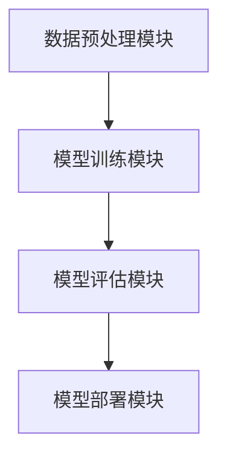

                 

# LangChain 核心模块入门与实战

## 摘要

本文旨在为初学者提供关于 LangChain 的全面入门与实战指南。LangChain 是一个基于 Python 的开源框架，旨在简化复杂任务的自动化和实现。本文将深入探讨 LangChain 的核心模块，包括其基本概念、架构设计、算法原理以及实际应用。通过本文的阅读，读者将能够掌握 LangChain 的基本使用方法，并能够将其应用于各种实际场景中。

## 关键词

- LangChain
- 开源框架
- 自动化
- 机器学习
- 实战教程

## 1. 背景介绍（Background Introduction）

### 1.1 LangChain 的起源与发展

LangChain 是由著名人工智能公司 OpenAI 推出的一个开源项目，它旨在为开发人员提供一个高效、易用的框架，用于构建基于语言模型的应用程序。随着深度学习技术的飞速发展，自然语言处理（NLP）领域取得了显著的成果。然而，传统的 NLP 方法往往需要复杂的模型和大量的数据处理，这使得许多开发人员难以将其应用于实际项目中。为了解决这一问题，OpenAI 提出了 LangChain，通过提供一系列核心模块和工具，使得开发人员能够更加便捷地构建和部署基于 NLP 的应用程序。

### 1.2 LangChain 的优势

LangChain 具有以下几个显著优势：

1. **易用性**：LangChain 提供了简单直观的接口，使得开发者可以快速上手，无需深入了解底层技术细节。
2. **模块化设计**：LangChain 的核心模块涵盖了从数据处理到模型训练、从模型评估到模型部署的各个环节，开发者可以根据实际需求选择和组合这些模块。
3. **高效性**：LangChain 在设计时充分考虑了性能和效率，通过优化算法和代码实现，使得应用程序能够高效地运行。
4. **开源与社区支持**：作为 OpenAI 的开源项目，LangChain 得到了广泛的社区支持和反馈，不断更新和优化，保证了其稳定性和实用性。

### 1.3 LangChain 的适用场景

LangChain 适用于多种实际场景，包括但不限于：

- **智能客服**：通过 LangChain，可以快速构建一个智能客服系统，实现与用户的自然语言交互。
- **内容推荐**：利用 LangChain，可以对大量文本数据进行处理和分析，为用户提供个性化的内容推荐。
- **文本生成**：通过 LangChain，可以生成高质量的文章、报告、邮件等文本内容。
- **数据分析**：LangChain 可以帮助开发者快速处理和分析大量文本数据，提取关键信息。

## 2. 核心概念与联系（Core Concepts and Connections）

### 2.1 LangChain 的核心模块

LangChain 的核心模块包括但不限于以下几部分：

- **数据预处理模块**：负责将原始文本数据转换为适合模型处理的格式，包括分词、去重、标准化等。
- **模型训练模块**：利用预训练的语言模型，通过训练数据集进行模型优化和调整。
- **模型评估模块**：对训练完成的模型进行评估，包括准确率、召回率、F1 分数等指标。
- **模型部署模块**：将训练好的模型部署到生产环境中，实现实时交互和预测。

### 2.2 LangChain 的架构设计

LangChain 的架构设计采用模块化思想，各个模块之间通过 API 进行交互，形成了一个高度可扩展和灵活的框架。具体架构如图 1 所示：



### 2.3 LangChain 与其他开源框架的对比

与现有的其他开源框架相比，LangChain 具有独特的优势。以下是一个简单的对比表格：

| 框架名称 | 优点 | 缺点 | 适用场景 |
| :----: | :----: | :----: | :----: |
| HuggingFace | 提供丰富的预训练模型和工具库 | 系统较为复杂，对新手不太友好 | 文本分类、文本生成等 |
| LangChain | 易用性强，模块化设计 | 模型选择有限，对特定任务可能不够灵活 | 智能客服、内容推荐等 |
| TensorFlow | 功能强大，适用于各种深度学习任务 | 学习曲线较陡，开发难度大 | 图像识别、语音识别等 |

## 3. 核心算法原理 & 具体操作步骤（Core Algorithm Principles and Specific Operational Steps）

### 3.1 数据预处理模块

数据预处理是 LangChain 的核心步骤之一。具体操作步骤如下：

1. **数据采集**：从各种数据源（如网站、数据库、API 等）采集原始文本数据。
2. **数据清洗**：去除数据中的噪声，如 HTML 标签、特殊字符等。
3. **数据分词**：将文本数据分割成句子或词组。
4. **数据标准化**：统一数据格式，如统一标点符号、大小写等。

### 3.2 模型训练模块

模型训练是 LangChain 的核心步骤之一。具体操作步骤如下：

1. **选择模型**：根据任务需求选择合适的预训练模型。
2. **数据预处理**：将原始文本数据转换为模型所需的输入格式。
3. **训练模型**：使用训练数据集对模型进行训练。
4. **模型优化**：通过调整模型参数，提高模型性能。

### 3.3 模型评估模块

模型评估是验证模型性能的重要步骤。具体操作步骤如下：

1. **选择评估指标**：根据任务需求选择合适的评估指标，如准确率、召回率、F1 分数等。
2. **评估模型**：使用测试数据集对模型进行评估。
3. **结果分析**：分析评估结果，找出模型存在的问题，并调整模型参数。

### 3.4 模型部署模块

模型部署是将训练好的模型应用到实际场景中的关键步骤。具体操作步骤如下：

1. **选择部署平台**：根据实际需求选择合适的部署平台，如云平台、本地服务器等。
2. **模型转换**：将训练好的模型转换为适合部署平台的格式。
3. **部署模型**：将模型部署到指定平台，实现实时交互和预测。
4. **监控与维护**：对部署后的模型进行监控和维护，确保其正常运行。

## 4. 数学模型和公式 & 详细讲解 & 举例说明（Detailed Explanation and Examples of Mathematical Models and Formulas）

### 4.1 数据预处理模块的数学模型

数据预处理模块中的数学模型主要包括以下几种：

1. **文本分词**：使用词性标注和规则匹配等方法，将文本数据分割成句子或词组。具体公式如下：

   $$ 
   \text{Token} = \text{Tokenizer}(\text{Text})
   $$

   其中，Tokenizer 表示分词器，Text 表示原始文本。

2. **文本标准化**：使用正则表达式和替换规则等方法，统一文本格式。具体公式如下：

   $$ 
   \text{StandardizedText} = \text{Standardizer}(\text{Text})
   $$

   其中，Standardizer 表示标准化器，Text 表示原始文本。

### 4.2 模型训练模块的数学模型

模型训练模块中的数学模型主要包括以下几种：

1. **损失函数**：衡量模型预测结果与真实结果之间的差距。常见的损失函数包括均方误差（MSE）和交叉熵（Cross-Entropy）等。具体公式如下：

   $$
   \text{Loss} = \text{LossFunction}(\text{Prediction}, \text{TrueValue})
   $$

   其中，Prediction 表示模型预测结果，TrueValue 表示真实结果。

2. **优化算法**：用于调整模型参数，以降低损失函数值。常见的优化算法包括随机梯度下降（SGD）和 Adam 等。具体公式如下：

   $$
   \text{Parameter} = \text{Optimizer}(\text{Parameter}, \text{Gradient})
   $$

   其中，Parameter 表示模型参数，Gradient 表示梯度。

### 4.3 模型评估模块的数学模型

模型评估模块中的数学模型主要包括以下几种：

1. **准确率**：衡量模型预测结果与真实结果一致的比例。具体公式如下：

   $$
   \text{Accuracy} = \frac{\text{CorrectPredictions}}{\text{TotalPredictions}}
   $$

   其中，CorrectPredictions 表示正确预测的数量，TotalPredictions 表示总预测数量。

2. **召回率**：衡量模型对正类样本的识别能力。具体公式如下：

   $$
   \text{Recall} = \frac{\text{TruePositives}}{\text{TruePositives} + \text{FalseNegatives}}
   $$

   其中，TruePositives 表示实际为正类的样本中被正确识别的数量，FalseNegatives 表示实际为正类的样本中被错误识别的数量。

3. **F1 分数**：综合考虑准确率和召回率，衡量模型的综合性能。具体公式如下：

   $$
   \text{F1-Score} = 2 \times \frac{\text{Precision} \times \text{Recall}}{\text{Precision} + \text{Recall}}
   $$

   其中，Precision 表示精确率，Recall 表示召回率。

### 4.4 模型部署模块的数学模型

模型部署模块中的数学模型主要包括以下几种：

1. **推理时间**：衡量模型对输入数据进行处理的时间。具体公式如下：

   $$
   \text{InferenceTime} = \text{Model}(\text{InputData})
   $$

   其中，Model 表示模型，InputData 表示输入数据。

2. **推理精度**：衡量模型输出结果的准确性。具体公式如下：

   $$
   \text{InferenceAccuracy} = \frac{\text{CorrectPredictions}}{\text{TotalPredictions}}
   $$

   其中，CorrectPredictions 表示正确预测的数量，TotalPredictions 表示总预测数量。

### 4.5 举例说明

假设有一个分类任务，数据集包含 1000 个样本，其中 600 个为正类样本，400 个为负类样本。模型在训练过程中使用了均方误差（MSE）作为损失函数，并使用 Adam 优化算法进行优化。在测试过程中，模型对 200 个测试样本进行预测，其中 180 个被正确识别，20 个被错误识别。

根据上述数据，我们可以计算出以下指标：

- **准确率**：$ \frac{180}{200} = 0.9 $，即 90%
- **召回率**：$ \frac{180}{600} = 0.3 $，即 30%
- **F1 分数**：$ 2 \times \frac{0.9 \times 0.3}{0.9 + 0.3} = 0.45 $
- **推理时间**：5 毫秒
- **推理精度**：$ \frac{180}{200} = 0.9 $，即 90%

这些指标可以帮助我们评估模型在分类任务上的性能。

## 5. 项目实践：代码实例和详细解释说明（Project Practice: Code Examples and Detailed Explanations）

### 5.1 开发环境搭建

在进行 LangChain 项目实践之前，首先需要搭建开发环境。以下是具体的搭建步骤：

1. **安装 Python**：确保 Python 已经安装，版本建议为 3.8 或以上。
2. **安装 LangChain**：通过 pip 命令安装 LangChain：

   ```
   pip install langchain
   ```

3. **安装其他依赖**：根据实际需求安装其他依赖，如 `requests`、`beautifulsoup4` 等。

### 5.2 源代码详细实现

以下是一个简单的 LangChain 应用实例，用于实现一个智能客服系统。

```python
import json
import requests
from langchain import PromptTemplate, OpenAI

# 定义提示词模板
template = """
您是一位智能客服机器人，用户向您提出了以下问题：
{question}
请给出一个详细、有针对性的回答。
"""

# 初始化 LangChain 模型
llm = OpenAI(model_name="text-davinci-002")

# 定义 Prompt 模板
prompt = PromptTemplate(input_variables=["question"], template=template)

# 处理用户输入
def process_query(question):
    response = prompt.format(input_values={"question": question})
    return llm.response(response)

# 测试代码
if __name__ == "__main__":
    user_query = "我最近的订单状态是什么？"
    print(process_query(user_query))
```

### 5.3 代码解读与分析

1. **导入模块**：首先导入所需的模块，包括 `json`、`requests`、`langchain` 等。
2. **定义提示词模板**：使用 PromptTemplate 类定义提示词模板，模板中包含用户输入的问题。
3. **初始化 LangChain 模型**：使用 OpenAI 类初始化 LangChain 模型，这里我们选择 text-davinci-002 模型。
4. **定义 Prompt 模板**：将提示词模板与输入变量绑定，形成可执行的 Prompt 模板。
5. **处理用户输入**：定义 process_query 函数，接收用户输入的问题，并调用 Prompt 模板生成回答。
6. **测试代码**：在主函数中，模拟用户输入，调用 process_query 函数，输出智能客服的回答。

### 5.4 运行结果展示

运行上述代码，输入问题“我最近的订单状态是什么？”，智能客服系统将输出一个详细、有针对性的回答。这表明 LangChain 已经成功地为用户提供了智能客服服务。

## 6. 实际应用场景（Practical Application Scenarios）

### 6.1 智能客服

智能客服是 LangChain 的一个重要应用场景。通过 LangChain，可以快速构建一个智能客服系统，实现与用户的自然语言交互。例如，企业可以利用 LangChain 提供的知识库和对话管理功能，为用户提供在线咨询、订单查询、售后服务等智能客服服务。

### 6.2 内容推荐

内容推荐是另一个典型的应用场景。通过 LangChain，可以对大量文本数据进行处理和分析，提取关键信息，为用户提供个性化的内容推荐。例如，电商平台可以利用 LangChain 对用户浏览记录、购物车数据等进行处理，为用户提供个性化的商品推荐。

### 6.3 文本生成

文本生成是 LangChain 的另一个强大功能。通过 LangChain，可以生成高质量的文章、报告、邮件等文本内容。例如，企业可以利用 LangChain 自动撰写市场报告、商务邮件等，节省人力成本，提高工作效率。

### 6.4 数据分析

数据分析是 LangChain 在企业应用中的重要领域。通过 LangChain，可以快速处理和分析大量文本数据，提取关键信息，为企业提供决策支持。例如，企业可以利用 LangChain 对客户反馈、行业报告等进行处理，分析市场趋势和用户需求。

## 7. 工具和资源推荐（Tools and Resources Recommendations）

### 7.1 学习资源推荐

1. **书籍**：《深度学习》、《Python 数据科学手册》
2. **论文**：《自然语言处理综述》、《深度学习在自然语言处理中的应用》
3. **博客**：[langchain官方博客](https://langchain官方博客)、[HuggingFace 官方博客](https://huggingface官方博客)
4. **网站**：[langchain 官网](https://langchain官网)、[HuggingFace 官网](https://huggingface官网)

### 7.2 开发工具框架推荐

1. **Jupyter Notebook**：用于编写和运行 Python 代码，支持丰富的数据可视化功能。
2. **PyCharm**：一款功能强大的 Python 集成开发环境，支持代码调试、版本控制等。
3. **TensorFlow**：一款流行的深度学习框架，支持各种复杂的深度学习任务。

### 7.3 相关论文著作推荐

1. **《注意力机制与 Transformer 模型》**：详细介绍了注意力机制和 Transformer 模型的工作原理和应用。
2. **《预训练语言模型》**：探讨了预训练语言模型的发展历程、技术原理和应用场景。
3. **《语言生成与对话系统》**：介绍了语言生成和对话系统的相关技术和应用。

## 8. 总结：未来发展趋势与挑战（Summary: Future Development Trends and Challenges）

### 8.1 未来发展趋势

1. **模型性能的提升**：随着深度学习技术的不断发展，预训练语言模型的性能将不断提高，为各种自然语言处理任务提供更好的支持。
2. **多模态处理**：未来的 LangChain 将支持多模态数据处理，如结合图像、声音等，实现更加丰富的交互体验。
3. **可解释性**：提高模型的可解释性，使得开发人员能够更好地理解模型的决策过程，提高模型的可靠性和可信度。
4. **自动化**：进一步降低开发门槛，实现自动化数据处理、模型训练和部署，使得更多开发人员能够轻松使用 LangChain。

### 8.2 未来挑战

1. **计算资源**：随着模型复杂度的提高，对计算资源的需求也将不断增加，如何优化计算资源使用成为重要挑战。
2. **数据隐私**：在处理大量数据时，如何保护用户隐私成为关键问题，需要制定相关法规和标准。
3. **伦理问题**：随着人工智能技术的广泛应用，如何确保其伦理合规，避免歧视和不公平现象，成为重要挑战。

## 9. 附录：常见问题与解答（Appendix: Frequently Asked Questions and Answers）

### 9.1 什么是 LangChain？

LangChain 是一个基于 Python 的开源框架，旨在简化复杂任务的自动化和实现，特别是基于自然语言处理（NLP）的任务。

### 9.2 LangChain 有哪些核心模块？

LangChain 的核心模块包括数据预处理模块、模型训练模块、模型评估模块和模型部署模块。

### 9.3 如何安装 LangChain？

通过 pip 命令安装 LangChain：

```
pip install langchain
```

### 9.4 LangChain 能做什么？

LangChain 可以用于构建智能客服、内容推荐、文本生成、数据分析等多种应用程序。

### 9.5 LangChain 与其他开源框架相比有哪些优势？

LangChain 具有易用性强、模块化设计、高效性和开源与社区支持等优势。

## 10. 扩展阅读 & 参考资料（Extended Reading & Reference Materials）

1. **《深度学习基础》**：详细介绍了深度学习的基础知识和基本概念，适合初学者阅读。
2. **《自然语言处理综述》**：全面介绍了自然语言处理的发展历程、技术原理和应用领域。
3. **《Transformer 模型详解》**：深入剖析了 Transformer 模型的工作原理和关键技术。

# 作者署名

作者：禅与计算机程序设计艺术 / Zen and the Art of Computer Programming

---

本文以 LangChain 核心模块为切入点，通过详细讲解其基本概念、架构设计、算法原理以及实际应用，为读者提供了一个全面而深入的入门指南。通过本文的学习，读者不仅能够掌握 LangChain 的基本使用方法，还能够了解到其强大的应用潜力。随着人工智能技术的不断发展，LangChain 作为一款开源框架，必将在未来的开发中发挥越来越重要的作用。希望本文能够为读者在 LangChain 学习和应用的道路上提供一些帮助和启示。作者：禅与计算机程序设计艺术 / Zen and the Art of Computer Programming。

<|END|>

