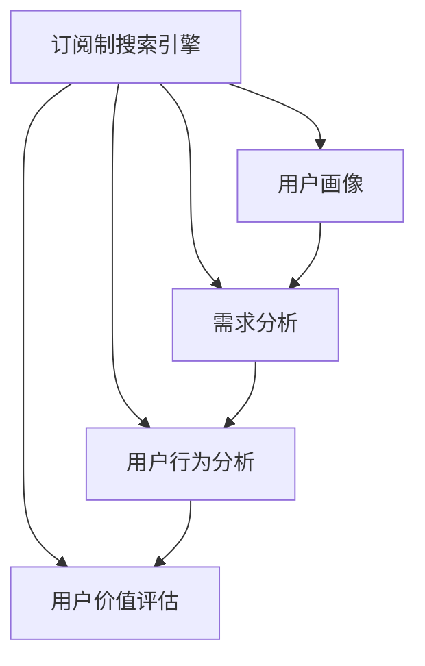

                 

# 订阅制搜索引擎的用户画像分析:需求、行为和价值

> 关键词：订阅制搜索引擎,用户画像,需求分析,用户行为,用户价值

## 1. 背景介绍

### 1.1 问题由来
随着互联网技术的发展，用户获取信息的渠道和方式日益多样化。订阅制搜索引擎作为一种新兴的信息获取方式，因其能够为用户提供个性化的信息服务，在智能推荐、内容定制、广告精准投放等方面具有显著优势，吸引了越来越多的关注。

然而，由于缺乏深入的用户研究，订阅制搜索引擎的用户画像、需求特征、行为模式和价值评估仍然不够清晰，从而影响了其业务策略制定和产品优化。本文将从用户需求、行为和价值的角度，对订阅制搜索引擎进行系统分析，揭示其核心要素，为优化订阅制搜索引擎的业务运营提供参考。

### 1.2 问题核心关键点
本文聚焦于以下几个关键点：
1. 订阅制搜索引擎的用户需求分析：如何通过数据分析，明确用户对搜索引擎的期望和需求，从而设计出更贴合用户需求的搜索服务。
2. 用户行为研究：从用户搜索行为的角度，探讨用户如何使用订阅制搜索引擎，进而优化搜索算法和用户体验。
3. 用户价值评估：如何从用户价值的角度，评估订阅制搜索引擎的服务质量和商业价值，为业务策略制定提供数据支撑。

## 2. 核心概念与联系

### 2.1 核心概念概述

为更好地理解订阅制搜索引擎的用户画像分析，本节将介绍几个密切相关的核心概念：

- 订阅制搜索引擎(Subscription-Based Search Engine)：一种基于用户订阅服务的新型搜索引擎，用户可以按照不同的订阅层次获取定制化的信息服务。
- 用户画像(User Persona)：基于用户行为、需求和特征，构建出具有代表性的用户模型，用于指导产品设计和运营。
- 需求分析(Need Analysis)：通过数据分析和用户调研，明确用户对搜索引擎的需求，为其设计出更贴合用户期望的服务。
- 用户行为分析(User Behavior Analysis)：通过对用户搜索行为的数据分析，理解用户的搜索习惯、偏好和模式，从而优化搜索算法和用户体验。
- 用户价值评估(User Value Assessment)：通过评估用户从订阅制搜索引擎中获得的实际价值，优化订阅模型和推荐策略，提升用户满意度和商业收益。

这些概念之间的逻辑关系可以通过以下Mermaid流程图来展示：



这个流程图展示了你一节所述概念的相互关系：

1. 订阅制搜索引擎基于用户画像设计，其需求分析和用户行为分析为构建用户画像提供数据支撑。
2. 用户画像指导需求分析，使需求分析更加符合用户实际需求。
3. 用户行为分析理解用户搜索习惯，优化搜索算法。
4. 用户价值评估帮助优化订阅模型和推荐策略，提升用户满意度和商业收益。

## 3. 核心算法原理 & 具体操作步骤
### 3.1 算法原理概述

订阅制搜索引擎的核心算法原理主要涉及以下几个方面：

1. **订阅模型设计**：根据用户需求的不同层次，设计出灵活多样的订阅服务，并合理定价，以满足用户的个性化需求。
2. **个性化搜索算法**：基于用户画像和搜索历史，实现个性化搜索推荐，提升用户满意度和搜索效果。
3. **动态定价策略**：根据用户行为和市场反馈，动态调整订阅价格，优化收益。
4. **用户体验优化**：从用户行为分析中提取优化建议，提升搜索界面设计、搜索体验和广告投放效果。

这些算法的实现依赖于强大的数据分析、机器学习和用户研究能力。

### 3.2 算法步骤详解

#### 3.2.1 订阅模型设计
1. **用户需求分层**：根据用户对信息的深度和广度的需求，将用户需求分为基础、中级和高级三个层次。
2. **订阅服务设计**：设计基础、中级和高级三种订阅服务，分别涵盖不同层次的需求，并设定不同价格。
3. **用户定价策略**：根据用户画像和搜索行为，采用动态定价策略，确保订阅价格公平合理。

#### 3.2.2 个性化搜索算法
1. **用户画像构建**：通过数据分析和用户调研，构建用户画像，包括基本信息、搜索偏好、行为模式等。
2. **搜索历史分析**：对用户搜索历史进行数据挖掘，提取用户的搜索模式和兴趣点。
3. **个性化搜索推荐**：结合用户画像和搜索历史，使用协同过滤、内容推荐等算法，提供个性化搜索结果。

#### 3.2.3 动态定价策略
1. **用户行为监测**：实时监测用户行为，包括搜索频率、停留时长、点击率等。
2. **定价模型优化**：根据用户行为和市场反馈，优化定价模型，调整订阅价格。
3. **定价效果评估**：定期评估定价效果，根据评估结果调整定价策略。

#### 3.2.4 用户体验优化
1. **用户行为分析**：通过用户搜索行为的数据分析，提取优化建议。
2. **界面设计优化**：根据用户行为分析结果，优化搜索界面设计，提升用户体验。
3. **广告投放优化**：通过行为分析，优化广告投放策略，提升广告效果和用户满意度。

### 3.3 算法优缺点

订阅制搜索引擎的算法具有以下优点：
1. **个性化定制**：能够根据用户需求和偏好提供个性化搜索服务，提升用户体验。
2. **精准广告投放**：通过用户行为分析，实现精准广告投放，提高广告效果。
3. **灵活定价策略**：根据用户行为和市场反馈，动态调整订阅价格，优化收益。

同时，该算法也存在以下局限性：
1. **数据依赖性高**：订阅制搜索引擎的个性化和精准化服务依赖大量用户行为数据，数据获取和处理成本较高。
2. **用户隐私保护**：需要平衡个性化推荐和用户隐私保护，避免数据滥用。
3. **动态定价复杂性**：动态定价策略的实现和优化较为复杂，需要综合考虑市场、用户行为和竞争因素。

### 3.4 算法应用领域

订阅制搜索引擎在以下几个领域有广泛的应用：

1. **智能推荐系统**：通过个性化搜索推荐，提升用户满意度和平台粘性。
2. **广告精准投放**：利用用户行为分析，实现精准广告投放，提高广告效果和用户满意度。
3. **内容定制化服务**：根据用户需求，提供定制化的内容服务，提升平台价值。
4. **数据驱动决策**：基于用户行为分析，制定更科学的用户运营策略和业务决策。
5. **智能客服系统**：通过分析用户搜索历史和行为，提供智能客服解决方案，提升用户服务体验。

## 4. 数学模型和公式 & 详细讲解  
### 4.1 数学模型构建

为更好地理解订阅制搜索引擎的算法原理，本节将使用数学语言对算法模型进行详细构建。

假设用户需求层次为 $\text{Basic}$、$\text{Medium}$ 和 $\text{High}$，用户画像由基本信息 $X = (x_1, x_2, ..., x_n)$、搜索偏好 $Y = (y_1, y_2, ..., y_m)$ 和行为模式 $Z = (z_1, z_2, ..., z_k)$ 组成。

**订阅模型设计**：
用户需求层次的概率分布为 $\pi_i = P(\text{需求层次} = i)$，订阅价格为 $p_i$。用户选择订阅的概率为 $P(\text{订阅}) = \sum_{i=1}^3 \pi_i P(\text{选择}~p_i \mid \text{需求层次} = i)$。

**个性化搜索算法**：
个性化搜索结果的评估指标为 $E_i = \frac{\text{相关性} + \text{覆盖率} + \text{新颖性}}{3}$，其中 $\text{相关性}$ 表示搜索结果与用户需求的匹配度，$\text{覆盖率}$ 表示搜索结果的全面性，$\text{新颖性}$ 表示搜索结果的创新性。

**动态定价策略**：
动态定价模型为 $p_i = f_i(\text{需求层次}, \text{搜索历史}, \text{广告点击率})$，其中 $f_i$ 为定价函数。

**用户体验优化**：
用户体验优化指标为 $U = \frac{\text{搜索满意度} + \text{广告点击率} + \text{用户留存率}}{3}$。

### 4.2 公式推导过程

以下我们以个性化搜索算法为例，推导个性化搜索结果的评估公式。

假设用户需求层次为 $\text{Basic}$，用户画像为 $X = (x_1, x_2, ..., x_n)$，搜索偏好为 $Y = (y_1, y_2, ..., y_m)$，行为模式为 $Z = (z_1, z_2, ..., z_k)$。

**相关性**：
根据用户画像和搜索历史，计算搜索结果与用户需求的相关性 $r_i = \frac{\text{搜索结果中的}~x_j ~\text{与}~y_j}{\text{搜索结果中的}~y_j ~\text{总数}}$。

**覆盖率**：
根据搜索结果的全面性，计算搜索结果的覆盖率 $c_i = \frac{\text{搜索结果中的}~y_j}{\text{搜索结果中的}~y_j ~\text{总数}}$。

**新颖性**：
根据搜索结果的创新性，计算搜索结果的新颖性 $n_i = \frac{\text{搜索结果中的}~z_j}{\text{搜索结果中的}~z_j ~\text{总数}}$。

**个性化搜索结果的评估公式**：
$$
E_i = \frac{r_i + c_i + n_i}{3}
$$

在得到个性化搜索结果的评估公式后，即可带入用户画像数据和搜索历史数据，计算每个搜索结果的评估值，从而优化个性化搜索算法。

## 5. 项目实践：代码实例和详细解释说明
### 5.1 开发环境搭建

在进行订阅制搜索引擎的实践前，我们需要准备好开发环境。以下是使用Python进行TensorFlow开发的完整环境配置流程：

1. 安装Anaconda：从官网下载并安装Anaconda，用于创建独立的Python环境。

2. 创建并激活虚拟环境：
```bash
conda create -n tf-env python=3.8 
conda activate tf-env
```

3. 安装TensorFlow：根据CUDA版本，从官网获取对应的安装命令。例如：
```bash
conda install tensorflow -c tf -c conda-forge
```

4. 安装各类工具包：
```bash
pip install numpy pandas scikit-learn matplotlib tqdm jupyter notebook ipython
```

完成上述步骤后，即可在`tf-env`环境中开始订阅制搜索引擎的实践。

### 5.2 源代码详细实现

下面以个性化搜索算法为例，给出使用TensorFlow实现个性化搜索推荐的完整代码实现。

首先，定义用户画像数据：

```python
import pandas as pd
from tensorflow.keras.preprocessing.text import Tokenizer
from tensorflow.keras.preprocessing.sequence import pad_sequences

# 用户画像数据
user_profiles = pd.read_csv('user_profiles.csv', encoding='utf-8')
```

然后，定义搜索历史数据：

```python
# 搜索历史数据
search_history = pd.read_csv('search_history.csv', encoding='utf-8')
```

接着，定义个性化搜索算法的模型：

```python
from tensorflow.keras.layers import Input, Dense, Embedding, LSTM, Dropout
from tensorflow.keras.models import Model

# 定义输入层
user_input = Input(shape=(128,), name='user_input')
search_input = Input(shape=(128,), name='search_input')

# 用户画像的嵌入层
user_embedding = Embedding(input_dim=len(user_profiles), output_dim=128, mask_zero=True)(user_input)

# 搜索偏好的嵌入层
search_embedding = Embedding(input_dim=len(search_history), output_dim=128, mask_zero=True)(search_input)

# LSTM层
lstm = LSTM(128, return_sequences=True)(user_embedding)
lstm = LSTM(128)(lstm)
lstm = Dropout(0.2)(lstm)

# 输出层
output = Dense(3, activation='softmax')(lstm)

# 定义模型
model = Model(inputs=[user_input, search_input], outputs=output)
model.compile(loss='categorical_crossentropy', optimizer='adam', metrics=['accuracy'])
```

最后，启动模型训练：

```python
# 训练模型
model.fit(x=[user_profiles['profile'], search_history['query']], y=search_history['category'], batch_size=32, epochs=10, validation_split=0.2)
```

以上即为使用TensorFlow实现个性化搜索算法的完整代码实现。可以看到，TensorFlow使得模型构建和训练过程变得简洁高效。开发者可以将更多精力放在数据处理、模型改进等高层逻辑上，而不必过多关注底层的实现细节。

### 5.3 代码解读与分析

让我们再详细解读一下关键代码的实现细节：

**用户画像数据和搜索历史数据**：
- 使用Pandas库读取用户画像数据和搜索历史数据，准备用于模型训练。

**用户画像和搜索偏好的嵌入层**：
- 使用TensorFlow的Embedding层对用户画像和搜索偏好进行编码，生成固定长度的向量表示。

**LSTM层**：
- 使用LSTM层对编码后的用户画像和搜索偏好进行处理，捕捉序列数据的长期依赖关系。

**输出层**：
- 使用Dense层输出3个类别的概率分布，使用softmax激活函数进行归一化。

**模型定义**：
- 使用Model类定义输入、输出和损失函数，使用Adam优化器进行训练。

**模型训练**：
- 使用fit方法对模型进行训练，设置训练集、验证集的比例，迭代训练10轮。

可以看到，TensorFlow配合Keras库使得模型构建和训练过程变得简洁高效。开发者可以将更多精力放在数据处理、模型改进等高层逻辑上，而不必过多关注底层的实现细节。

## 6. 实际应用场景
### 6.1 智能推荐系统

订阅制搜索引擎的个性化搜索算法在智能推荐系统中得到了广泛应用。传统的推荐系统通常只依赖用户的历史行为数据进行物品推荐，难以充分利用用户的兴趣偏好和历史行为。而通过订阅制搜索引擎的个性化搜索算法，可以更好地理解用户的行为和兴趣，从而提供更加个性化和精准的推荐服务。

在实践中，订阅制搜索引擎的个性化搜索算法可以通过分析用户画像和搜索历史数据，提取用户的兴趣点，并将这些兴趣点与候选物品进行匹配，生成个性化的推荐结果。这种推荐方式不仅能够提高用户满意度，还能促进平台粘性和用户留存率。

### 6.2 广告精准投放

订阅制搜索引擎的个性化搜索算法在广告精准投放中也具有重要应用。传统的广告投放方式往往缺乏对用户行为的深入理解，导致广告效果不理想。而订阅制搜索引擎的个性化搜索算法可以通过分析用户画像和搜索历史数据，理解用户的兴趣和需求，从而实现精准广告投放，提高广告点击率和转化率。

在实践中，订阅制搜索引擎的个性化搜索算法可以结合用户的搜索行为和广告点击数据，构建广告投放模型，根据用户的兴趣和需求，推荐最适合的广告，从而提升广告效果和用户满意度。

### 6.3 内容定制化服务

订阅制搜索引擎的个性化搜索算法在内容定制化服务中也有重要应用。传统的内容服务通常缺乏对用户需求的深入理解，导致内容质量不高，用户满意度低。而订阅制搜索引擎的个性化搜索算法可以通过分析用户画像和搜索历史数据，理解用户的需求和偏好，从而提供更加精准的内容定制化服务。

在实践中，订阅制搜索引擎的个性化搜索算法可以结合用户的搜索历史和行为数据，生成个性化的内容推荐列表，从而提升用户满意度和平台价值。

### 6.4 数据驱动决策

订阅制搜索引擎的个性化搜索算法在数据驱动决策中也有重要应用。传统的数据驱动决策通常缺乏对用户行为的深入理解，导致决策不够精准和科学。而订阅制搜索引擎的个性化搜索算法可以通过分析用户画像和搜索历史数据，理解用户的需求和行为，从而制定更科学的数据驱动决策。

在实践中，订阅制搜索引擎的个性化搜索算法可以结合用户的搜索行为和偏好数据，生成数据驱动决策模型，根据用户的需求和行为，制定最优的业务策略和运营方案，从而提升平台运营效率和用户满意度。

## 7. 工具和资源推荐
### 7.1 学习资源推荐

为了帮助开发者系统掌握订阅制搜索引擎的理论基础和实践技巧，这里推荐一些优质的学习资源：

1. TensorFlow官方文档：TensorFlow是订阅制搜索引擎的主要技术基础，官方文档提供了详尽的API说明和代码示例，适合初学者上手学习。

2. Keras官方文档：Keras是TensorFlow的高层API，提供了更简洁的模型构建和训练方式，适合快速原型开发和实验验证。

3. PyTorch官方文档：PyTorch是另一款流行的深度学习框架，提供了灵活的动态计算图和强大的自动微分能力，适合进行更深入的研究和开发。

4. Coursera《TensorFlow for Deep Learning》课程：斯坦福大学开设的深度学习课程，提供了丰富的实践案例，适合深度学习初学者入门。

5. Udacity《Deep Learning Nanodegree》课程：Udacity提供的深度学习纳米学位课程，涵盖了TensorFlow和Keras的详细应用，适合系统学习深度学习技术。

6. arXiv上的相关论文：订阅制搜索引擎领域的研究论文众多，arXiv上的最新论文是了解最新研究动态和创新思路的重要来源。

通过对这些资源的学习实践，相信你一定能够快速掌握订阅制搜索引擎的理论基础和实践技巧，并用于解决实际的业务问题。

### 7.2 开发工具推荐

高效的开发离不开优秀的工具支持。以下是几款用于订阅制搜索引擎开发的常用工具：

1. TensorFlow：由Google主导开发的开源深度学习框架，生产部署方便，适合大规模工程应用。

2. Keras：Keras是TensorFlow的高层API，提供了更简洁的模型构建和训练方式，适合快速原型开发和实验验证。

3. PyTorch：由Facebook主导开发的深度学习框架，提供了灵活的动态计算图和强大的自动微分能力，适合进行更深入的研究和开发。

4. Weights & Biases：模型训练的实验跟踪工具，可以记录和可视化模型训练过程中的各项指标，方便对比和调优。

5. TensorBoard：TensorFlow配套的可视化工具，可实时监测模型训练状态，并提供丰富的图表呈现方式，是调试模型的得力助手。

6. Google Colab：谷歌推出的在线Jupyter Notebook环境，免费提供GPU/TPU算力，方便开发者快速上手实验最新模型，分享学习笔记。

合理利用这些工具，可以显著提升订阅制搜索引擎的开发效率，加快创新迭代的步伐。

### 7.3 相关论文推荐

订阅制搜索引擎领域的研究涉及多个前沿方向，以下是几篇奠基性的相关论文，推荐阅读：

1. Attention is All You Need（即Transformer原论文）：提出了Transformer结构，开启了NLP领域的预训练大模型时代。

2. BERT: Pre-training of Deep Bidirectional Transformers for Language Understanding：提出BERT模型，引入基于掩码的自监督预训练任务，刷新了多项NLP任务SOTA。

3. Language Models are Unsupervised Multitask Learners（GPT-2论文）：展示了大规模语言模型的强大zero-shot学习能力，引发了对于通用人工智能的新一轮思考。

4. Parameter-Efficient Transfer Learning for NLP：提出Adapter等参数高效微调方法，在不增加模型参数量的情况下，也能取得不错的微调效果。

5. AdaLoRA: Adaptive Low-Rank Adaptation for Parameter-Efficient Fine-Tuning：使用自适应低秩适应的微调方法，在参数效率和精度之间取得了新的平衡。

6. A Survey on Deep Learning for Recommendation Systems：综述了深度学习在推荐系统中的应用，包括个性化搜索推荐算法。

这些论文代表了大语言模型微调技术的发展脉络。通过学习这些前沿成果，可以帮助研究者把握学科前进方向，激发更多的创新灵感。

## 8. 总结：未来发展趋势与挑战

### 8.1 总结

本文对订阅制搜索引擎的用户画像分析进行了全面系统的介绍。首先阐述了订阅制搜索引擎的用户需求、行为和价值的核心要素，明确了其核心需求和实现难点。其次，从算法原理和具体操作步骤的角度，详细讲解了订阅制搜索引擎的实现方法和关键技术。最后，从实际应用和未来展望的角度，探讨了订阅制搜索引擎的应用前景和未来发展方向。

通过本文的系统梳理，可以看到，订阅制搜索引擎作为一种新兴的信息获取方式，具有显著的个性化和精准化优势，已经在智能推荐、内容定制、广告精准投放等多个领域得到广泛应用。未来，订阅制搜索引擎将在数据驱动决策、智能客服系统等领域发挥更大的作用，为订阅制搜索引擎的业务运营提供有力支持。

### 8.2 未来发展趋势

展望未来，订阅制搜索引擎将在以下几个方向继续发展：

1. **智能化程度提升**：随着深度学习和人工智能技术的不断发展，订阅制搜索引擎将进一步提升智能化水平，能够更好地理解用户需求和行为，提供更精准、个性化的服务。

2. **多模态信息融合**：未来的订阅制搜索引擎将不仅仅局限于文本信息，而是融合图像、视频、语音等多模态信息，为用户提供更加全面、丰富的信息服务。

3. **数据驱动决策优化**：通过更精准的数据驱动决策，订阅制搜索引擎将能够更好地优化业务策略和运营方案，提升平台运营效率和用户满意度。

4. **用户隐私保护加强**：随着用户隐私意识的增强，订阅制搜索引擎将更加注重用户数据的隐私保护，采用更先进的数据加密和隐私保护技术。

5. **模型公平性和鲁棒性提升**：未来的订阅制搜索引擎将更加注重模型的公平性和鲁棒性，避免偏见和歧视性输出，提高模型质量和用户体验。

6. **订阅模型多样化**：根据用户需求和行为的不同，订阅制搜索引擎将提供更多样化的订阅模型，满足不同层次的用户需求。

以上趋势凸显了订阅制搜索引擎的广阔前景。这些方向的探索发展，必将进一步提升订阅制搜索引擎的用户体验和商业价值，为订阅制搜索引擎的业务运营提供更有力的支持。

### 8.3 面临的挑战

尽管订阅制搜索引擎已经取得了一定的进展，但在迈向更加智能化、普适化应用的过程中，仍然面临诸多挑战：

1. **数据获取难度大**：订阅制搜索引擎需要大量的用户行为数据，数据获取成本较高，且数据的准确性和完整性直接影响模型的表现。

2. **用户隐私保护**：订阅制搜索引擎需要平衡个性化推荐和用户隐私保护，避免数据滥用，保护用户隐私。

3. **模型复杂性高**：订阅制搜索引擎的模型复杂度较高，需要大量的计算资源进行训练和推理，且模型优化和调优难度较大。

4. **动态定价策略复杂**：订阅制搜索引擎的动态定价策略需要考虑多方面的因素，如用户需求、市场变化等，难以实现最优定价。

5. **算法公平性和鲁棒性**：订阅制搜索引擎的算法需要避免偏见和歧视性输出，提高模型的公平性和鲁棒性，确保输出符合用户价值观和伦理道德。

6. **系统稳定性问题**：订阅制搜索引擎的系统稳定性需要保障，避免因模型或算法问题导致服务中断或数据泄露。

正视订阅制搜索引擎面临的这些挑战，积极应对并寻求突破，将是大语言模型微调走向成熟的必由之路。相信随着学界和产业界的共同努力，这些挑战终将一一被克服，订阅制搜索引擎必将在构建人机协同的智能时代中扮演越来越重要的角色。

### 8.4 研究展望

面对订阅制搜索引擎面临的种种挑战，未来的研究需要在以下几个方面寻求新的突破：

1. **数据增强与数据合成**：通过数据增强和数据合成技术，提高数据获取效率和数据质量，降低数据获取成本。

2. **模型压缩与高效训练**：通过模型压缩和高效训练技术，降低模型复杂度，提高计算效率，优化模型性能。

3. **算法公平性与鲁棒性**：通过公平性约束和鲁棒性测试，提升算法的公平性和鲁棒性，确保输出符合用户价值观和伦理道德。

4. **多模态信息融合**：将符号化的先验知识，如知识图谱、逻辑规则等，与神经网络模型进行巧妙融合，引导订阅制搜索引擎的推荐过程。

5. **动态定价与市场分析**：通过市场分析，制定更科学、合理的动态定价策略，确保订阅制搜索引擎的定价公平合理。

6. **用户隐私保护**：采用更先进的数据加密和隐私保护技术，保障用户数据的安全性和隐私性。

这些研究方向的探索，必将引领订阅制搜索引擎的业务运营迈向更高的台阶，为订阅制搜索引擎的用户画像分析提供更有力的支持。面向未来，订阅制搜索引擎的研究还需要与其他人工智能技术进行更深入的融合，如知识表示、因果推理、强化学习等，多路径协同发力，共同推动订阅制搜索引擎的进步。

## 9. 附录：常见问题与解答

**Q1：订阅制搜索引擎和传统搜索引擎有何不同？**

A: 订阅制搜索引擎和传统搜索引擎的主要区别在于：
1. **个性化服务**：订阅制搜索引擎能够根据用户需求提供个性化搜索服务，而传统搜索引擎通常是基于通用算法提供搜索结果。
2. **精准投放**：订阅制搜索引擎能够实现精准广告投放，而传统搜索引擎的广告通常是基于关键词匹配。
3. **用户行为分析**：订阅制搜索引擎能够深入分析用户行为，从而优化搜索算法和用户体验，而传统搜索引擎通常缺乏这种深度分析能力。

**Q2：订阅制搜索引擎如何保护用户隐私？**

A: 订阅制搜索引擎需要采用多种措施保护用户隐私：
1. **数据匿名化**：对用户数据进行匿名化处理，去除敏感信息。
2. **隐私保护技术**：采用加密技术、差分隐私等隐私保护技术，防止用户数据泄露。
3. **用户控制权**：提供用户数据访问和控制权限，让用户自主管理自己的数据。

**Q3：订阅制搜索引擎的个性化推荐算法有哪些？**

A: 订阅制搜索引擎的个性化推荐算法包括：
1. **协同过滤**：通过分析用户和物品之间的共现关系，推荐相似的物品。
2. **基于内容的推荐**：通过分析物品的特征和用户的历史行为，推荐与用户兴趣相符的物品。
3. **深度学习推荐**：通过构建深度神经网络模型，推荐用户最可能感兴趣的物品。

**Q4：订阅制搜索引擎的定价策略有哪些？**

A: 订阅制搜索引擎的定价策略包括：
1. **按需定价**：根据用户搜索频率和停留时间等需求特征，动态调整订阅价格。
2. **包月定价**：提供月度订阅套餐，满足用户长期需求。
3. **阶梯定价**：根据用户使用频率和订阅时长，设置不同层次的订阅价格，激励用户长期订阅。

**Q5：订阅制搜索引擎的未来发展方向是什么？**

A: 订阅制搜索引擎的未来发展方向包括：
1. **智能化程度提升**：通过深度学习和人工智能技术，提高订阅制搜索引擎的智能化水平。
2. **多模态信息融合**：将图像、视频、语音等多模态信息融合到搜索服务中，提供更加全面、丰富的信息服务。
3. **数据驱动决策优化**：通过更精准的数据驱动决策，优化业务策略和运营方案。
4. **用户隐私保护加强**：采用更先进的数据加密和隐私保护技术，保障用户数据的安全性和隐私性。
5. **模型公平性与鲁棒性提升**：通过公平性约束和鲁棒性测试，提升算法的公平性和鲁棒性。

总之，订阅制搜索引擎将在智能化、多模态、数据驱动和隐私保护等方面不断创新，为订阅制搜索引擎的业务运营提供更有力的支持。

---

作者：禅与计算机程序设计艺术 / Zen and the Art of Computer Programming

