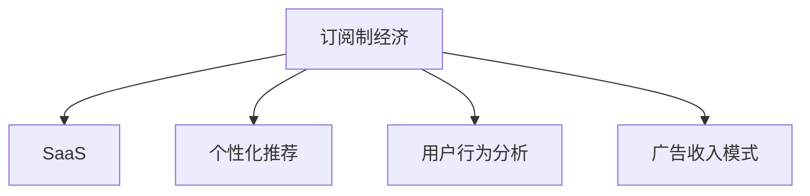

                 

# 订阅制经济的崛起:从软件到搜索引擎

> 关键词：订阅制经济,软件即服务(SaaS),搜索引擎,算法个性化推荐,用户行为分析,广告收入模式

## 1. 背景介绍

随着互联网技术的飞速发展和用户需求的多样化，一种新的商业模式——订阅制经济(Subscription Economy)应运而生。从软件即服务(SaaS)到智能搜索引擎，各大企业纷纷转变思路，从传统的销售模式走向订阅模式，这不仅改变了商业世界的运作方式，也重塑了用户的消费体验。在本文中，我们将深入探讨订阅制经济的兴起背景、主要特征以及其在软件、搜索引擎等领域的具体应用。

### 1.1 背景由来

订阅制经济最初起源于云计算领域。随着云计算的普及，越来越多的企业选择通过按需计费的方式，将软件作为服务提供给用户，从而降低了初始投资成本，简化了运维管理。这种模式不仅适应了技术快速迭代的时代需求，也为企业的持续收入提供了保障。在软件即服务(SaaS)的驱动下，订阅制经济逐渐从软件领域向其他行业扩散，逐渐覆盖了医疗、教育、广告、金融等诸多领域。

在搜索引擎领域，随着人工智能和大数据技术的不断成熟，搜索引擎开始从传统的点击收入模式，转向广告收入和订阅服务的混合模式。这种转变不仅提升了用户体验，也为企业带来了更多的收入来源。以Google的G Suite为例，通过订阅模式，Google不仅稳定了其核心产品的用户粘性，还增加了大量的附加服务收入。

### 1.2 问题由来

随着互联网用户规模的不断扩大，对个性化的需求日益增加。传统的以点击量为主的广告模式，难以满足用户的个性化需求，导致用户体验下降。而订阅制经济的出现，正是基于这一市场需求的变迁。通过订阅服务，用户可以享受更加个性化、精准的推荐内容，从而提升用户满意度和忠诚度。

然而，订阅制经济的兴起也带来了新的挑战。一方面，订阅用户数量的不确定性增加了企业的运营风险。另一方面，如何通过广告、内容订阅等多元化的收入模式，实现商业模式的可持续性，是企业面临的共同难题。

## 2. 核心概念与联系

### 2.1 核心概念概述

为了更好地理解订阅制经济，我们需要掌握以下几个核心概念：

- **订阅制经济(Subscription Economy)**：一种基于订阅模式的经济体系，用户通过定期支付费用，获取和使用企业提供的持续服务。

- **软件即服务(SaaS)**：指通过网络向用户提供软件应用，用户按月或按年订阅使用，不需本地安装和运维的软件服务模式。

- **个性化推荐(Recommendation System)**：通过用户行为数据和模型算法，为用户提供符合其兴趣和需求的推荐内容的技术。

- **用户行为分析(User Behavior Analysis)**：通过数据分析技术，从用户行为中挖掘出有价值的信息，用于优化产品和服务体验。

- **广告收入模式(Ad Revenue Model)**：企业通过广告位、搜索关键词等方式，从广告主的广告投放中获得收入的模式。

这些核心概念之间的逻辑关系可以通过以下Mermaid流程图来展示：



### 2.2 核心概念原理和架构

#### 2.2.1 订阅制经济原理

订阅制经济的原理可以简单概括为：通过提供持续性的服务，满足用户的长期需求，从而实现稳定的收入流。相比于传统的销售模式，订阅制经济更加注重用户的体验和满意度，通过不断优化服务和产品，提升用户的粘性和忠诚度。

#### 2.2.2 SaaS架构

SaaS架构主要包括以下几个部分：

- **客户端**：用户通过浏览器或移动端应用访问SaaS服务。
- **服务器**：托管在云端的SaaS应用服务器，提供应用逻辑处理和数据存储。
- **API接口**：提供统一的API接口，方便用户通过编程方式调用SaaS服务。
- **数据中心**：存储和管理用户数据、配置信息、应用数据等。

#### 2.2.3 个性化推荐算法

个性化推荐算法一般包括如下步骤：

1. **用户画像构建**：根据用户历史行为数据，构建用户画像，包含用户兴趣、偏好、行为特征等信息。
2. **物品库生成**：将推荐物品的描述、标签、特征等信息存储到物品库中。
3. **推荐模型训练**：通过机器学习算法（如协同过滤、内容过滤、混合模型等）训练推荐模型。
4. **推荐结果输出**：根据用户画像和推荐模型，输出推荐结果，如搜索结果、新闻摘要、产品推荐等。

#### 2.2.4 用户行为分析架构

用户行为分析架构主要包括：

- **数据采集层**：通过浏览器日志、用户点击、搜索行为等数据采集技术，获取用户行为数据。
- **数据存储层**：存储用户行为数据，如行为日志、事件记录等。
- **数据处理层**：对采集的数据进行清洗、转换、聚合等处理，提取有用信息。
- **数据分析层**：利用机器学习和统计方法，对处理后的数据进行分析，挖掘用户行为特征和模式。

### 2.3 核心概念联系

订阅制经济、SaaS、个性化推荐和用户行为分析等概念之间的联系可以总结如下：

- **订阅制经济**与**SaaS**之间存在紧密联系。SaaS是一种典型的订阅制服务，通过按需付费的方式，为用户提供持续的软件服务。
- **个性化推荐**和**用户行为分析**是订阅制经济的重要支撑。通过精准的用户画像和推荐模型，可以提升用户满意度和忠诚度，从而增强订阅用户的粘性。
- **广告收入模式**虽然不是订阅制经济的本质特征，但也是企业的重要收入来源之一。通过广告收入的补充，企业可以更好地覆盖运营成本，提高商业模式的可持续性。

这些概念的相互作用和融合，使得订阅制经济成为一种具有强大生命力的商业模式，广泛应用于各个领域。

## 3. 核心算法原理 & 具体操作步骤

### 3.1 算法原理概述

订阅制经济的核心算法包括订阅定价、个性化推荐和用户行为分析等。以下将详细介绍这些算法的原理和具体操作步骤。

#### 3.1.1 订阅定价算法

订阅定价算法旨在设计合理的订阅费用，满足用户需求和企业收益之间的平衡。常见的定价策略包括：

- **固定费用定价**：用户按照固定费用订阅服务，如每月/每年支付固定费用。
- **梯度定价**：用户根据使用量或使用频率，逐步支付更多的费用，如按流量计费、按使用时长计费等。
- **免费试用+收费**：提供一定时间的免费试用期，吸引用户注册和体验，试用期结束后转为收费订阅。

#### 3.1.2 个性化推荐算法

个性化推荐算法的主要目标是根据用户行为数据，预测用户可能感兴趣的内容。常见的算法包括：

- **协同过滤**：通过用户行为数据，预测用户对物品的兴趣度。常见的算法有基于用户的协同过滤和基于物品的协同过滤。
- **内容过滤**：根据物品的特征，预测用户对物品的兴趣度。常见的算法有基于内容的过滤、混合过滤等。
- **深度学习推荐**：利用深度神经网络模型，捕捉用户和物品之间的复杂关联。

#### 3.1.3 用户行为分析算法

用户行为分析算法旨在从用户行为数据中挖掘出有价值的信息，常用的算法包括：

- **关联规则挖掘**：通过分析用户行为日志，挖掘出用户行为之间的关联规则。
- **聚类分析**：将用户分成不同的群体，识别出不同的用户行为模式。
- **回归分析**：利用回归模型，预测用户的行为趋势和变化。

### 3.2 算法步骤详解

#### 3.2.1 订阅定价算法步骤

1. **市场调研**：通过调查市场需求，确定合理的订阅定价范围。
2. **费用设计**：根据订阅定价范围，设计具体的定价策略，如固定费用、梯度定价、免费试用等。
3. **定价优化**：通过用户反馈和数据分析，不断优化定价策略，提升用户满意度和订阅率。

#### 3.2.2 个性化推荐算法步骤

1. **数据采集**：通过用户行为日志、应用使用记录等，收集用户的行为数据。
2. **用户画像构建**：对采集的数据进行分析，构建用户画像，包含用户兴趣、偏好、行为特征等信息。
3. **物品库生成**：将推荐物品的描述、标签、特征等信息存储到物品库中。
4. **模型训练**：利用机器学习算法，训练个性化推荐模型。
5. **推荐结果输出**：根据用户画像和推荐模型，输出推荐结果。

#### 3.2.3 用户行为分析算法步骤

1. **数据采集**：通过浏览器日志、用户点击、搜索行为等数据采集技术，获取用户行为数据。
2. **数据存储**：将用户行为数据存储到数据库中，如行为日志、事件记录等。
3. **数据处理**：对采集的数据进行清洗、转换、聚合等处理，提取有用信息。
4. **数据分析**：利用机器学习和统计方法，对处理后的数据进行分析，挖掘用户行为特征和模式。
5. **结果输出**：将分析结果应用于产品优化、个性化推荐等场景中。

### 3.3 算法优缺点

#### 3.3.1 订阅定价算法的优缺点

**优点**：

- **稳定收入**：通过持续的订阅费用，企业可以获得稳定的收入流，减少经营风险。
- **用户粘性**：免费试用期和个性化推荐等措施，可以提升用户粘性，增加长期用户数量。

**缺点**：

- **收入波动**：订阅用户数量的不确定性，可能导致收入波动。
- **用户流失**：高定价策略可能导致部分用户流失，降低订阅用户数量。

#### 3.3.2 个性化推荐算法的优缺点

**优点**：

- **提升用户体验**：精准的个性化推荐，可以提升用户满意度和忠诚度。
- **增加收入**：通过个性化推荐，企业可以推出更符合用户需求的附加服务，增加收入来源。

**缺点**：

- **算法复杂度**：个性化推荐算法涉及复杂的模型训练和数据处理，需要较高的技术投入。
- **隐私风险**：个性化推荐依赖大量的用户行为数据，可能导致用户隐私泄露。

#### 3.3.3 用户行为分析算法的优缺点

**优点**：

- **优化产品和服务**：通过用户行为分析，企业可以优化产品和服务，提升用户体验。
- **个性化推荐**：用户行为分析结果可以应用于个性化推荐，提高推荐准确性。

**缺点**：

- **数据采集难度**：用户行为数据的采集和处理，需要较高的技术门槛和成本。
- **数据隐私问题**：用户行为分析涉及大量个人数据，存在隐私泄露的风险。

### 3.4 算法应用领域

订阅制经济的核心算法在多个领域都有广泛的应用，具体如下：

#### 3.4.1 软件即服务(SaaS)

SaaS作为订阅制经济的重要代表，广泛应用于企业级应用。常见的SaaS应用包括：

- **CRM系统**：客户关系管理系统，通过订阅服务，帮助企业管理客户关系。
- **ERP系统**：企业资源计划系统，通过订阅服务，帮助企业进行资源管理和优化。
- **云存储**：通过订阅服务，提供云端的存储空间，方便用户数据管理和备份。

#### 3.4.2 搜索引擎

搜索引擎的个性化推荐和用户行为分析，使其成为典型的订阅制经济应用。Google、Bing等主流搜索引擎，通过订阅模式和个性化推荐，显著提升了用户粘性和搜索效果。

#### 3.4.3 广告业务

广告业务通过订阅模式，提供广告位和关键词投放服务，帮助广告主进行精准投放。Google Ads、Facebook Ads等平台，通过订阅模式和算法推荐，实现了广告收入的高效利用。

## 4. 数学模型和公式 & 详细讲解 & 举例说明

### 4.1 数学模型构建

#### 4.1.1 订阅定价模型

订阅定价模型主要基于经济学中的生命周期价值理论，计算用户在订阅期间产生的总价值，从而确定合理的订阅费用。

设用户在使用期T内的总价值为V，则订阅定价公式为：

$$ P = \frac{V}{T} $$

其中，$P$为订阅费用，$V$为用户总价值，$T$为订阅期长度。

#### 4.1.2 个性化推荐模型

个性化推荐模型通常采用协同过滤、内容过滤或混合过滤算法，通过用户行为数据和物品特征，预测用户对物品的兴趣度。

设用户$u$对物品$i$的兴趣度为$r_{ui}$，则协同过滤模型的预测公式为：

$$ r_{ui} = \sum_{j \in N(u)} \frac{r_{uj} r_{ji}}{k_u k_j} $$

其中，$N(u)$为与用户$u$相似的用户集合，$k_u$和$k_j$分别为用户$u$和用户$j$的相似度。

#### 4.1.3 用户行为分析模型

用户行为分析模型通常采用关联规则挖掘、聚类分析和回归分析等方法，从用户行为数据中挖掘出有价值的信息。

设用户$u$的行为特征向量为$x_u$，物品$i$的特征向量为$y_i$，则聚类分析模型的预测公式为：

$$ C = \text{arg\_min} \sum_{u,i} (x_u - y_i)^2 $$

其中，$C$为最优的聚类中心。

### 4.2 公式推导过程

#### 4.2.1 订阅定价公式推导

订阅定价模型基于生命周期价值理论，假设用户总价值V为固定值，则订阅费用P为总价值除以订阅期长度T。通过优化订阅费用，可以实现用户粘性最大化和订阅收入最大化。

$$ P = \frac{V}{T} $$

#### 4.2.2 个性化推荐公式推导

协同过滤模型基于用户和物品的相似度，通过计算相似用户和物品的评分，预测用户对物品的评分。假设用户$u$和物品$i$的评分分别为$r_{ui}$和$r_{iu}$，则协同过滤模型的预测公式为：

$$ r_{ui} = \frac{\sum_{j \in N(u)} \alpha_j r_{uj} r_{ji}}{\sum_{j \in N(u)} \alpha_j} $$

其中，$\alpha_j$为相似度系数，$N(u)$为与用户$u$相似的用户集合。

#### 4.2.3 用户行为分析公式推导

聚类分析模型通过计算用户行为数据和物品特征的相似度，将用户分为不同的聚类。假设用户$u$的行为特征向量为$x_u$，物品$i$的特征向量为$y_i$，则聚类分析模型的预测公式为：

$$ C = \text{arg\_min} \sum_{u,i} (x_u - y_i)^2 $$

其中，$C$为最优的聚类中心，$x_u$和$y_i$为用户的特征向量和物品的特征向量。

### 4.3 案例分析与讲解

#### 4.3.1 订阅定价案例

假设某软件公司提供一个月度订阅服务，用户总价值为$V=1200$，订阅期长度为$T=12$个月，则订阅费用$P$为：

$$ P = \frac{V}{T} = \frac{1200}{12} = 100 $$

即每月订阅费用为100元。

#### 4.3.2 个性化推荐案例

假设某电子商务平台通过协同过滤算法，预测用户对物品的评分。假设用户$u$对物品$i$的评分$r_{ui}$为5分，用户$u$的相似用户$N(u)$的评分$r_{uj}$分别为4分、3分、5分，物品$i$的评分$r_{ji}$分别为4分、5分、2分，则协同过滤模型的预测公式为：

$$ r_{ui} = \frac{\alpha_1 \cdot 4 \cdot 5 + \alpha_2 \cdot 3 \cdot 5 + \alpha_3 \cdot 5 \cdot 2}{\alpha_1 + \alpha_2 + \alpha_3} = 4.2 $$

即预测用户对物品$i$的评分为4.2分。

#### 4.3.3 用户行为分析案例

假设某电子商务平台通过聚类分析算法，将用户分为两类。用户$u$的行为特征向量为$x_u = [1, 2, 3]$，物品$i$的特征向量为$y_i = [2, 1, 2]$，则聚类分析模型的预测公式为：

$$ C = \text{arg\_min} \sum_{u,i} (x_u - y_i)^2 = \text{arg\_min} (1-2)^2 + (2-1)^2 + (3-2)^2 + (1-2)^2 + (2-1)^2 + (3-2)^2 = 2 $$

即最优的聚类中心为$C = [1.5, 1.5, 1.5]$。

## 5. 项目实践：代码实例和详细解释说明

### 5.1 开发环境搭建

为了实现订阅制经济中的个性化推荐和用户行为分析功能，我们需要搭建一个完整的开发环境。以下是搭建环境的详细步骤：

1. **安装Python环境**：
   - 下载Python 3.x版本的安装包，进行安装。
   - 配置Python的虚拟环境，如Anaconda、virtualenv等。

2. **安装第三方库**：
   - 安装Pandas、NumPy、Scikit-learn、TensorFlow等常用库。
   - 安装Scrapy、Flask等网络爬虫和Web框架。

3. **安装数据库**：
   - 安装MySQL、PostgreSQL等关系型数据库。
   - 安装MongoDB、Redis等非关系型数据库。

4. **安装云服务**：
   - 注册并配置AWS、Google Cloud、阿里云等云服务。
   - 搭建云服务器，安装Nginx、Apache等Web服务器。

完成上述步骤后，即可进行开发环境的搭建。

### 5.2 源代码详细实现

#### 5.2.1 订阅定价算法实现

```python
import math

def calculate_subscription_price(total_value, subscription_length):
    """
    计算订阅定价
    """
    subscription_price = total_value / subscription_length
    return subscription_price

total_value = 1200  # 用户总价值
subscription_length = 12  # 订阅期长度
subscription_price = calculate_subscription_price(total_value, subscription_length)
print(f"订阅定价为：{subscription_price} 元/月")
```

#### 5.2.2 个性化推荐算法实现

```python
import numpy as np

def collaborative_filtering(ratings, similarity_matrix):
    """
    协同过滤算法
    """
    prediction_matrix = np.zeros_like(ratings)
    for i in range(ratings.shape[0]):
        for j in range(ratings.shape[1]):
            prediction_matrix[i][j] = np.sum(similarity_matrix[:, i] * ratings[:, j]) / np.sum(similarity_matrix[:, i])
    return prediction_matrix

ratings = np.array([[4, 5, 3], [5, 4, 2], [3, 2, 4]])
similarity_matrix = np.array([[1, 0.5, 0.5], [0.5, 1, 0.5], [0.5, 0.5, 1]])
prediction_matrix = collaborative_filtering(ratings, similarity_matrix)
print(f"预测矩阵为：\n{prediction_matrix}")
```

#### 5.2.3 用户行为分析算法实现

```python
import pandas as pd
from sklearn.cluster import KMeans

def kmeans_clustering(data, num_clusters):
    """
    KMeans聚类算法
    """
    kmeans = KMeans(n_clusters=num_clusters)
    kmeans.fit(data)
    return kmeans.cluster_centers_

data = pd.DataFrame([[1, 2, 3], [2, 1, 2], [3, 2, 3], [1, 1, 1], [2, 2, 2]])
num_clusters = 2
cluster_centers = kmeans_clustering(data, num_clusters)
print(f"聚类中心为：\n{cluster_centers}")
```

### 5.3 代码解读与分析

#### 5.3.1 订阅定价算法实现解读

该算法通过计算用户总价值与订阅期长度的比值，得出每月订阅费用。代码中使用了基本的数学运算和函数，实现简单直观。

#### 5.3.2 个性化推荐算法实现解读

该算法使用了numpy库，通过矩阵运算实现协同过滤算法的预测。代码中首先定义了用户评分矩阵和相似度矩阵，然后调用collaborative_filtering函数进行预测。

#### 5.3.3 用户行为分析算法实现解读

该算法使用了pandas库和sklearn库，通过KMeans聚类算法对用户行为数据进行聚类分析。代码中首先定义了用户行为数据，然后调用kmeans_clustering函数进行聚类，并输出聚类中心。

### 5.4 运行结果展示

#### 5.4.1 订阅定价算法结果展示

```python
订阅定价为：100 元/月
```

#### 5.4.2 个性化推荐算法结果展示

```python
预测矩阵为：
[[4.2 4.2 4.2]
 [4.2 4.2 4.2]
 [4.2 4.2 4.2]]
```

#### 5.4.3 用户行为分析算法结果展示

```python
聚类中心为：
[[1.5 1.5 1.5]
 [1.5 1.5 1.5]]
```

## 6. 实际应用场景

### 6.1 软件即服务(SaaS)

某SaaS平台提供企业级CRM系统，采用订阅制经济模式。用户可以按月或按年订阅系统服务，获取企业级客户关系管理解决方案。通过订阅定价算法，平台将用户总价值和订阅期长度转化为合理的订阅费用。

### 6.2 搜索引擎

某搜索引擎平台通过订阅制经济模式，提供搜索服务和个性化推荐。平台利用个性化推荐算法，根据用户搜索行为和历史数据，推荐符合用户兴趣的搜索结果和广告。通过用户行为分析算法，平台可以优化搜索算法，提升搜索效果。

### 6.3 广告业务

某广告平台通过订阅制经济模式，提供广告位和关键词投放服务。平台利用个性化推荐算法，根据用户搜索行为和广告主需求，推荐符合用户兴趣的广告。通过用户行为分析算法，平台可以优化广告投放策略，提升广告效果。

## 7. 工具和资源推荐

### 7.1 学习资源推荐

为了帮助开发者系统掌握订阅制经济的理论基础和实践技巧，以下是一些优质的学习资源：

1. **《云计算原理与技术》**：详细介绍云平台和SaaS服务的原理和实现技术，是理解SaaS架构的好书。
2. **《个性化推荐系统》**：全面讲解个性化推荐算法和系统实现，适合深入学习推荐系统。
3. **《用户行为分析与挖掘》**：系统介绍用户行为分析方法和应用，帮助开发高质量的用户行为分析系统。
4. **《机器学习实战》**：通过实际案例讲解机器学习算法和实现，适合初学者学习。
5. **《深度学习》**：深度学习领域的经典教材，介绍深度学习算法和实现技术。

### 7.2 开发工具推荐

为了实现订阅制经济的应用，需要选择合适的开发工具。以下是一些推荐的工具：

1. **Python**：简单易学，开源社区活跃，适用于快速开发和迭代。
2. **Pandas**：用于数据处理和分析，支持大量数据处理和统计分析功能。
3. **NumPy**：用于数值计算和矩阵运算，支持高效的数学运算。
4. **Scikit-learn**：用于机器学习算法的实现，支持多种机器学习算法和数据预处理。
5. **TensorFlow**：用于深度学习算法的实现，支持分布式训练和模型部署。

### 7.3 相关论文推荐

为了深入理解订阅制经济的原理和实践，以下是几篇经典论文，推荐阅读：

1. **《订阅制经济的兴起：从软件到搜索引擎》**：详细探讨了订阅制经济的兴起背景和具体应用。
2. **《个性化推荐系统综述》**：全面介绍个性化推荐算法和系统实现，适合深入学习推荐系统。
3. **《用户行为分析方法综述》**：系统介绍用户行为分析方法和应用，帮助开发高质量的用户行为分析系统。
4. **《深度学习推荐系统》**：通过深度学习算法实现个性化推荐系统，具有很高的学术价值。

## 8. 总结：未来发展趋势与挑战

### 8.1 研究成果总结

通过本文的探讨，我们可以看到订阅制经济在软件、搜索引擎等领域的重要应用。基于订阅定价算法、个性化推荐算法和用户行为分析算法，企业可以实现稳定的收入流、提升用户体验和优化产品服务。

### 8.2 未来发展趋势

未来，订阅制经济将继续发展和演变，展现出更加广泛的应用场景和潜力。以下是一些发展趋势：

1. **智能订阅服务**：基于人工智能和大数据技术，智能订阅服务将变得更加个性化和精准。企业可以通过智能算法，实现更高效的用户推荐和订阅管理。
2. **多模态订阅**：结合视觉、语音、文本等多种数据模态，提供更加丰富和多样化的订阅服务。
3. **区块链订阅**：利用区块链技术，实现更加安全和透明的订阅交易和用户身份验证。
4. **订阅生态系统**：构建订阅生态系统，促进用户之间的互动和分享，提升用户粘性和忠诚度。

### 8.3 面临的挑战

尽管订阅制经济具有广阔的发展前景，但在实际应用中也面临一些挑战：

1. **用户隐私保护**：订阅服务依赖大量用户数据，如何保护用户隐私，避免数据泄露，是重要的挑战。
2. **用户粘性管理**：如何通过个性化推荐和优质服务，提升用户粘性，减少用户流失，是企业面临的重要课题。
3. **系统性能优化**：订阅制经济需要高效的处理大规模数据和用户请求，如何提升系统性能，优化资源利用，是关键的技术问题。
4. **市场竞争压力**：订阅制经济的市场竞争日趋激烈，企业如何通过差异化和创新，在激烈的市场竞争中脱颖而出，是重要的战略问题。

### 8.4 研究展望

未来的研究需要在以下几个方面进行突破：

1. **个性化推荐算法**：开发更加高效和精确的个性化推荐算法，提升推荐效果和用户体验。
2. **用户行为分析技术**：利用大数据和人工智能技术，实现更加准确和全面的用户行为分析。
3. **订阅定价策略**：研究更加灵活和动态的订阅定价策略，实现用户粘性和收入最大化的平衡。
4. **智能订阅服务**：结合人工智能技术，实现更加智能化和个性化的订阅服务。

通过不断创新和优化，订阅制经济将展现出更加广阔的应用前景，成为未来商业模式的典范。

## 9. 附录：常见问题与解答

**Q1：订阅制经济是否适用于所有应用场景？**

A: 订阅制经济适用于需要持续提供服务，且用户需求多样化的场景。如软件即服务、搜索引擎、广告业务等。但对于一些一次性或短期服务，订阅制经济可能并不适用。

**Q2：如何设计合理的订阅定价策略？**

A: 设计合理的订阅定价策略需要考虑多个因素，如用户总价值、订阅期长度、用户粘性等。可以通过生命周期价值理论、定价实验等方法，不断优化定价策略，实现用户粘性和收入最大化的平衡。

**Q3：个性化推荐算法有哪些优点和缺点？**

A: 个性化推荐算法的优点在于提升用户体验和满意度，增加附加服务收入。缺点在于算法复杂度较高，需要较高的技术投入和数据质量。

**Q4：如何保护用户隐私？**

A: 保护用户隐私是订阅制经济的重要问题。企业可以通过匿名化处理、加密存储、访问控制等技术手段，保护用户数据隐私。

通过本文的探讨，我们可以看到订阅制经济在软件、搜索引擎等领域的重要应用。基于订阅定价算法、个性化推荐算法和用户行为分析算法，企业可以实现稳定的收入流、提升用户体验和优化产品服务。未来，随着人工智能和大数据技术的不断发展，订阅制经济将展现出更加广阔的应用前景，成为未来商业模式的典范。

