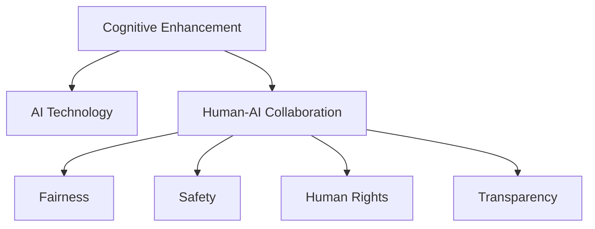

                 

# 认知增强与伦理：技术发展的道德约束

> 关键词：认知增强, 伦理, 技术发展, 道德约束, 人工智能, 人机协同, 公平性, 透明度, 数据隐私

## 1. 背景介绍

### 1.1 问题由来

随着人工智能（AI）技术的飞速发展，认知增强（Cognitive Enhancement）技术正在逐步进入人们的视野。认知增强通常指的是使用技术手段提升人类认知能力，包括记忆、注意力、推理、学习等方面。在医疗、教育、工作等各个领域，认知增强技术都有广泛的应用前景。然而，认知增强技术的广泛应用也引发了诸多伦理问题，尤其是技术应用中的人权、公平性、安全性等道德约束问题。

### 1.2 问题核心关键点

认知增强技术的伦理问题主要集中在以下几个方面：

- **公平性**：认知增强技术可能会加剧社会不平等，使得有能力获取和利用这些技术的人得到更大的提升，而普通大众无法享受相同的好处。
- **安全性**：认知增强技术可能存在未知的风险和副作用，如认知负荷过重、心理问题等。
- **人权**：认知增强技术是否会对个体的自主性和人格造成影响，是否侵犯了个人隐私？
- **透明度**：认知增强技术的具体工作原理和效果评估是否透明，能否被公众理解？

这些问题使得认知增强技术的发展面临诸多挑战，需要多方共同探讨，找到合理、公正的解决方案。

## 2. 核心概念与联系

### 2.1 核心概念概述

为更好地理解认知增强技术的伦理约束，本节将介绍几个核心概念及其联系：

- **认知增强（Cognitive Enhancement）**：使用技术手段提升人类认知能力的实践。包括但不限于记忆增强、注意力提升、学习优化、情感调节等。

- **人工智能（AI）**：模拟人类智能行为的机器系统，能够进行学习、推理、感知、语言理解等复杂任务。

- **人机协同（Human-AI Collaboration）**：将人工智能技术与人类智能结合，共同完成任务的过程。

- **公平性（Fairness）**：确保技术应用对所有人公平，不因种族、性别、经济状况等因素产生歧视。

- **安全性（Safety）**：确保技术应用不会对个体和群体造成不利影响，包括生理和心理安全。

- **人权（Human Rights）**：确保技术应用尊重和保护个体的自主权和隐私权。

- **透明度（Transparency）**：确保技术工作原理、数据来源、效果评估等信息的公开透明，增强公众信任。

这些核心概念之间的逻辑关系可以通过以下Mermaid流程图来展示：



这个流程图展示了认知增强技术的核心概念及其与人工智能技术的联系：

1. 认知增强技术基于人工智能技术实现。
2. 通过人机协同，实现任务提升。
3. 公平性、安全性、人权、透明度是技术应用中必须考虑的伦理问题。

## 3. 核心算法原理 & 具体操作步骤

### 3.1 算法原理概述

认知增强技术的算法原理通常基于人工智能模型，通过提升特定认知能力，实现任务效率的提高。其中，深度学习模型、增强学习模型等技术被广泛应用于认知增强中。以下以记忆增强为例，介绍认知增强的算法原理。

假设目标是在学习任务中提升记忆能力，可以考虑使用深度学习模型。通过在输入中加入记忆增强模块，模型能够对记忆过程进行模拟和优化。具体而言，可以采用以下步骤：

1. 收集大量学习数据和记忆相关数据，如时间序列数据、上下文信息等。
2. 使用深度学习模型对数据进行训练，构建记忆增强模型。
3. 在实际学习任务中，将记忆增强模型作为预处理步骤，提升记忆效果。

### 3.2 算法步骤详解

认知增强的算法步骤通常包括数据收集、模型训练、模型应用等环节。以记忆增强为例，详细步骤如下：

**Step 1: 数据准备**
- 收集与记忆相关的学习数据，如时间序列数据、上下文信息等。
- 清洗和预处理数据，确保数据的质量和一致性。

**Step 2: 模型构建**
- 选择合适的深度学习模型，如RNN、LSTM、GRU等。
- 设计记忆增强模块，如记忆门控、状态更新等。
- 编写代码实现模型，使用Python、TensorFlow等工具。

**Step 3: 模型训练**
- 划分训练集、验证集、测试集。
- 设置模型参数，如学习率、批大小、迭代轮数等。
- 使用优化算法（如Adam、SGD等）进行模型训练。
- 周期性在验证集上评估模型性能，避免过拟合。

**Step 4: 模型应用**
- 将训练好的模型应用到实际学习任务中，进行记忆增强。
- 记录模型效果，进行效果分析。
- 根据反馈调整模型参数，持续优化模型性能。

### 3.3 算法优缺点

认知增强技术的算法有以下优点：

1. **提升认知效率**：通过深度学习等技术，能够显著提升特定认知能力，如记忆、注意力等。
2. **应用广泛**：认知增强技术可以应用于医疗、教育、工作等多个领域，提升生产力和生活质量。
3. **算法成熟**：深度学习、增强学习等技术已经相对成熟，能够高效实现认知增强。

同时，认知增强技术也存在一些缺点：

1. **技术依赖**：依赖于高性能计算设备和算法，对资源需求较高。
2. **伦理风险**：技术应用可能引发公平性、安全性、人权等问题，需要慎重考虑。
3. **效果局限**：认知增强技术虽然能够提升特定认知能力，但可能无法解决复杂的认知问题。

### 3.4 算法应用领域

认知增强技术已经在多个领域得到应用，包括但不限于：

- **医疗领域**：通过认知增强技术提升医生的诊断和治疗能力，帮助患者更快恢复健康。
- **教育领域**：使用记忆增强技术辅助学生记忆和理解知识，提高学习效率。
- **工作领域**：通过注意力提升技术帮助职场人士提高工作效率，减少错误。
- **日常生活中的应用**：如智能助手、智能家居等，提升生活质量。

## 4. 数学模型和公式 & 详细讲解 & 举例说明

### 4.1 数学模型构建

以记忆增强为例，我们可以使用RNN（循环神经网络）构建数学模型。假设输入为时间序列数据 $(x_t)$，输出为记忆增强后的状态 $(h_t)$，模型可以表示为：

$$
h_t = f(h_{t-1}, x_t; \theta)
$$

其中 $h_t$ 为当前状态，$h_{t-1}$ 为上一状态，$x_t$ 为当前输入，$\theta$ 为模型参数。

### 4.2 公式推导过程

根据上述模型，我们可以推导出记忆增强模型的具体形式。假设模型采用LSTM（长短期记忆网络），则记忆增强过程可以表示为：

$$
h_t = \tanh(W_{hh}h_{t-1} + W_{xh}x_t + b_h)
$$

其中 $W_{hh}$ 和 $W_{xh}$ 为权重矩阵，$b_h$ 为偏置向量。

记忆增强模块还包括记忆门控和状态更新等操作，具体公式如下：

$$
i_t = \sigma(W_{hi}h_{t-1} + W_{xi}x_t + b_i)
$$

$$
f_t = \sigma(W_{hf}h_{t-1} + W_{xf}x_t + b_f)
$$

$$
o_t = \sigma(W_{ho}h_{t-1} + W_{xo}x_t + b_o)
$$

$$
g_t = tanh(W_{gg}h_{t-1} + W_{gx}x_t + b_g)
$$

$$
c_t = f_t \odot c_{t-1} + i_t \odot g_t
$$

$$
h_t = o_t \odot tanh(c_t)
$$

其中 $\sigma$ 为sigmoid函数，$\odot$ 表示元素级乘法。

### 4.3 案例分析与讲解

假设我们有一个简单的学习任务，需要记忆一个数字序列。使用上述记忆增强模型，可以按以下步骤进行：

1. 将数字序列 $[1, 2, 3, 4, 5]$ 作为输入。
2. 使用记忆增强模型进行状态更新，得到记忆状态 $h_0$。
3. 将数字序列依次输入模型，逐步更新记忆状态，得到 $h_1, h_2, h_3, h_4$。
4. 输出记忆状态 $h_4$，作为记忆结果。

## 5. 项目实践：代码实例和详细解释说明

### 5.1 开发环境搭建

在进行认知增强项目的开发前，我们需要准备好开发环境。以下是使用Python进行TensorFlow开发的环境配置流程：

1. 安装Anaconda：从官网下载并安装Anaconda，用于创建独立的Python环境。

2. 创建并激活虚拟环境：
```bash
conda create -n cognitive-enhancement python=3.8 
conda activate cognitive-enhancement
```

3. 安装TensorFlow：根据CUDA版本，从官网获取对应的安装命令。例如：
```bash
conda install tensorflow tensorflow-gpu=cuda11.1 cudatoolkit=11.1 -c conda-forge
```

4. 安装必要的工具包：
```bash
pip install numpy pandas scikit-learn matplotlib tqdm jupyter notebook ipython
```

完成上述步骤后，即可在`cognitive-enhancement`环境中开始项目实践。

### 5.2 源代码详细实现

这里我们以记忆增强为例，使用TensorFlow实现一个简单的记忆增强模型。

```python
import tensorflow as tf
import numpy as np

# 定义模型参数
W_xh = tf.Variable(tf.random.normal([1, 1]))
W_hh = tf.Variable(tf.random.normal([1, 1]))
b_h = tf.Variable(tf.random.normal([1]))
W_hi = tf.Variable(tf.random.normal([1, 1]))
W_xi = tf.Variable(tf.random.normal([1, 1]))
b_i = tf.Variable(tf.random.normal([1]))
W_hf = tf.Variable(tf.random.normal([1, 1]))
W_xf = tf.Variable(tf.random.normal([1, 1]))
b_f = tf.Variable(tf.random.normal([1]))
W_ho = tf.Variable(tf.random.normal([1, 1]))
W_xo = tf.Variable(tf.random.normal([1, 1]))
b_o = tf.Variable(tf.random.normal([1]))
W_gg = tf.Variable(tf.random.normal([1, 1]))
W_gx = tf.Variable(tf.random.normal([1, 1]))
b_g = tf.Variable(tf.random.normal([1]))
W hh = tf.Variable(tf.random.normal([1, 1]))
W xx = tf.Variable(tf.random.normal([1, 1]))
b = tf.Variable(tf.random.normal([1]))

# 定义输入输出占位符
x = tf.placeholder(tf.float32, [None, 1])
y = tf.placeholder(tf.float32, [None, 1])

# 定义记忆增强模型
def memory_enhancer(x):
    h_prev = tf.zeros([1, 1])
    for i in range(len(x)):
        h = tf.tanh(tf.matmul(h_prev, W_hh) + tf.matmul(x[i], W_xh) + b_h)
        i = tf.sigmoid(tf.matmul(h_prev, W_hi) + tf.matmul(x[i], W_xi) + b_i)
        f = tf.sigmoid(tf.matmul(h_prev, W_hf) + tf.matmul(x[i], W_xf) + b_f)
        o = tf.sigmoid(tf.matmul(h_prev, W_ho) + tf.matmul(x[i], W_xo) + b_o)
        g = tf.tanh(tf.matmul(h_prev, W_gg) + tf.matmul(x[i], W_gx) + b_g)
        c = f * h_prev + i * g
        h = o * tf.tanh(c)
        h_prev = h
    return h

# 定义损失函数和优化器
loss = tf.reduce_mean(tf.square(y - memory_enhancer(x)))
optimizer = tf.train.AdamOptimizer(learning_rate=0.01)
train_op = optimizer.minimize(loss)

# 训练模型
with tf.Session() as sess:
    sess.run(tf.global_variables_initializer())
    for i in range(10000):
        x_val = np.array([[1], [2], [3], [4], [5]])
        y_val = np.array([[1], [2], [3], [4], [5]])
        sess.run(train_op, feed_dict={x: x_val, y: y_val})
    h_final = sess.run(memory_enhancer(np.array([[1], [2], [3], [4], [5]])))
    print("Final memory: ", h_final)
```

### 5.3 代码解读与分析

让我们再详细解读一下关键代码的实现细节：

**定义模型参数**：
- 使用TensorFlow的`tf.Variable`定义模型参数，包括权重矩阵和偏置向量。

**定义输入输出占位符**：
- 使用`tf.placeholder`定义输入输出占位符，方便后续数据输入。

**定义记忆增强模型**：
- 使用循环结构，逐步更新记忆状态。

**定义损失函数和优化器**：
- 使用均方误差作为损失函数，Adam优化器进行模型训练。

**训练模型**：
- 在会话中使用`tf.Session`进行模型训练，通过循环迭代更新模型参数。

## 6. 实际应用场景

### 6.1 医疗领域

认知增强技术在医疗领域的应用，可以显著提升医生的诊断和治疗能力。例如，通过记忆增强技术，医生可以更快地回忆起复杂的病例信息，提高诊断准确率。同时，增强学习等技术也可以用于个性化治疗方案的生成，根据病人的历史数据和当前状态，动态调整治疗策略，提升治疗效果。

### 6.2 教育领域

在教育领域，认知增强技术可以帮助学生提升学习效率。通过记忆增强技术，学生可以更有效地记忆和理解知识，提高学习成果。同时，注意力提升技术可以帮助学生集中注意力，提高课堂参与度。

### 6.3 工作领域

在工作领域，认知增强技术可以帮助员工提升工作效率。例如，注意力提升技术可以帮助员工更好地处理复杂任务，减少错误。记忆增强技术可以帮助员工更快地回忆起重要信息，提高工作效率。

### 6.4 未来应用展望

随着认知增强技术的不断发展，其在各个领域的应用前景将更加广阔。未来，认知增强技术将与物联网、大数据、云计算等技术深度融合，形成更加智能、高效、安全的系统，为人类生产生活带来更大便利。

## 7. 工具和资源推荐

### 7.1 学习资源推荐

为了帮助开发者系统掌握认知增强技术，以下是一些优质的学习资源：

1. 《深度学习》系列书籍：深入浅出地介绍了深度学习的基本原理和应用。
2. 《认知增强技术》课程：介绍认知增强技术的基本概念和前沿研究。
3. 《人机协同智能》课程：结合人工智能和人类智能，探讨人机协同的应用。
4. 《人工智能伦理》书籍：探讨人工智能技术在伦理方面的问题，帮助开发者建立正确的价值观。

通过对这些资源的学习实践，相信你一定能够全面掌握认知增强技术的理论基础和实践技巧，并用于解决实际的认知增强问题。

### 7.2 开发工具推荐

高效的工具支持是认知增强项目开发的关键。以下是几款用于认知增强项目开发的常用工具：

1. TensorFlow：基于Python的开源深度学习框架，灵活的计算图，适合快速迭代研究。

2. PyTorch：基于Python的开源深度学习框架，动态计算图，灵活高效。

3. Jupyter Notebook：交互式开发环境，方便代码调试和分享学习笔记。

4. Weights & Biases：模型训练的实验跟踪工具，可以记录和可视化模型训练过程中的各项指标。

5. TensorBoard：TensorFlow配套的可视化工具，实时监测模型训练状态，提供丰富的图表呈现方式。

合理利用这些工具，可以显著提升认知增强项目的开发效率，加快创新迭代的步伐。

### 7.3 相关论文推荐

认知增强技术的发展源于学界的持续研究。以下是几篇奠基性的相关论文，推荐阅读：

1. Cognitive Enhancement through Deep Learning：探讨了使用深度学习提升认知能力的可行性。
2. Memory Augmented Neural Networks：介绍了一种基于记忆增强的神经网络模型，实现了记忆和推理的协同。
3. Enhancing Memory and Learning through Cognitive Engineering：讨论了认知工程在提升认知能力中的应用。
4. Fairness in Cognitive Enhancement：探讨了认知增强技术在公平性方面的挑战和解决方案。
5. Ethics in Cognitive Enhancement：分析了认知增强技术在伦理方面的问题，提出了解决方案。

这些论文代表了大语言模型微调技术的发展脉络。通过学习这些前沿成果，可以帮助研究者把握学科前进方向，激发更多的创新灵感。

## 8. 总结：未来发展趋势与挑战

### 8.1 总结

本文对认知增强技术及其伦理问题进行了全面系统的介绍。首先阐述了认知增强技术的研究背景和意义，明确了认知增强在提升人类认知能力方面的独特价值。其次，从原理到实践，详细讲解了认知增强技术的数学模型和算法步骤，给出了具体的代码实现。同时，本文还广泛探讨了认知增强技术在医疗、教育、工作等多个领域的应用前景，展示了认知增强技术的广泛潜力。最后，本文精选了认知增强技术的各类学习资源，力求为读者提供全方位的技术指引。

通过本文的系统梳理，可以看到，认知增强技术正在成为人工智能技术的重要分支，逐步在各个领域展现其应用价值。未来，伴随技术的发展和应用的推广，认知增强技术必将带来更加深远的影响。

### 8.2 未来发展趋势

展望未来，认知增强技术将呈现以下几个发展趋势：

1. **算法多样化**：未来将涌现更多认知增强算法，涵盖记忆增强、注意力提升、情感调节等方面。

2. **应用广泛化**：认知增强技术将在更多领域得到应用，如医疗、教育、智能家居等，提升人类生活质量。

3. **人机协同深化**：认知增强技术将与人工智能技术深度融合，实现更加高效、智能的人机协同系统。

4. **伦理意识增强**：认知增强技术在发展过程中将更加注重伦理问题，确保技术应用符合人类价值观和社会公德。

5. **跨学科融合**：认知增强技术将与心理学、神经科学等学科深度融合，推动认知科学的发展。

6. **国际合作加强**：认知增强技术需要全球合作，共享研究成果，推动技术标准化和国际化。

以上趋势凸显了认知增强技术的前景和挑战。未来的研究需要更多跨学科的合作，共同推动认知增强技术的发展。

### 8.3 面临的挑战

尽管认知增强技术已经取得了一定的进展，但在迈向更加智能化、普适化应用的过程中，它仍面临诸多挑战：

1. **技术依赖**：认知增强技术依赖于高性能计算设备和算法，对资源需求较高。
2. **伦理问题**：认知增强技术可能引发公平性、安全性、人权等问题，需要慎重考虑。
3. **效果局限**：认知增强技术虽然能够提升特定认知能力，但可能无法解决复杂的认知问题。
4. **隐私保护**：认知增强技术需要大量的个人数据，如何在保护隐私的同时，实现高效训练和应用，是一个重要问题。

5. **技术普及**：认知增强技术需要被广泛推广和应用，如何降低应用门槛，提高公众接受度，还需要进一步努力。

6. **安全性**：认知增强技术可能存在未知的风险和副作用，如认知负荷过重、心理问题等。

正视认知增强技术面临的这些挑战，积极应对并寻求突破，将是认知增强技术发展的关键。相信随着学界和产业界的共同努力，这些挑战终将一一被克服，认知增强技术必将在构建人机协同的智能时代中扮演越来越重要的角色。

### 8.4 研究展望

面对认知增强技术所面临的种种挑战，未来的研究需要在以下几个方面寻求新的突破：

1. **探索无监督和半监督认知增强方法**：摆脱对大规模标注数据的依赖，利用自监督学习、主动学习等无监督和半监督范式，最大限度利用非结构化数据，实现更加灵活高效的认知增强。

2. **开发更多参数高效的认知增强方法**：开发更加参数高效的认知增强方法，在固定大部分预训练参数的情况下，只更新极少量的认知相关参数，减少计算资源消耗。

3. **引入更多先验知识**：将符号化的先验知识，如知识图谱、逻辑规则等，与神经网络模型进行巧妙融合，引导认知增强过程学习更准确、合理的认知模型。

4. **结合因果分析和博弈论工具**：将因果分析方法引入认知增强模型，识别出模型决策的关键特征，增强输出解释的因果性和逻辑性。借助博弈论工具刻画人机交互过程，主动探索并规避模型的脆弱点，提高系统稳定性。

5. **纳入伦理道德约束**：在模型训练目标中引入伦理导向的评估指标，过滤和惩罚有偏见、有害的输出倾向。同时加强人工干预和审核，建立模型行为的监管机制，确保输出符合人类价值观和伦理道德。

这些研究方向的研究成果，将为认知增强技术的发展提供新的理论和方法，推动认知增强技术走向更加成熟和广泛的应用。

## 9. 附录：常见问题与解答

**Q1: 认知增强技术有哪些应用场景？**

A: 认知增强技术可以应用于医疗、教育、工作等多个领域。例如，在医疗领域，可以提升医生的诊断和治疗能力；在教育领域，可以帮助学生提升学习效率；在工作领域，可以提高员工的工作效率。

**Q2: 认知增强技术可能会引发哪些伦理问题？**

A: 认知增强技术可能会引发公平性、安全性、人权等问题。例如，技术应用可能加剧社会不平等，引发认知负荷过重、心理问题等。

**Q3: 如何确保认知增强技术的公平性？**

A: 确保认知增强技术的公平性需要多方面的努力。例如，在使用技术时，需要考虑不同人群的需求和接受程度，避免对特定群体产生偏见。

**Q4: 认知增强技术的未来发展趋势是什么？**

A: 认知增强技术的未来发展趋势包括算法多样化、应用广泛化、人机协同深化、伦理意识增强、跨学科融合、国际合作加强等。

**Q5: 如何保护认知增强技术的隐私？**

A: 保护认知增强技术的隐私需要多方面的努力。例如，在使用技术时，需要确保数据的匿名性和安全性，避免泄露个人信息。

通过本文的系统梳理，可以看到，认知增强技术正在成为人工智能技术的重要分支，逐步在各个领域展现其应用价值。未来，伴随技术的发展和应用的推广，认知增强技术必将带来更加深远的影响。

