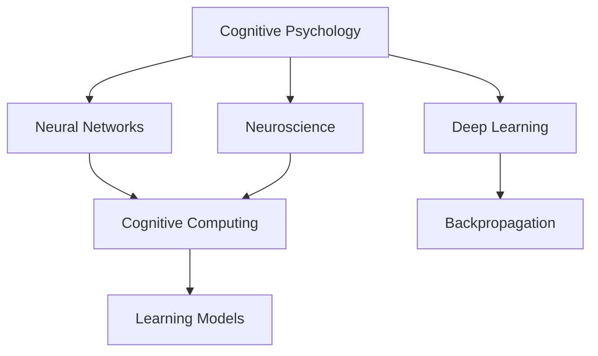

                 

# 认知心理学：理解学习过程的科学

> 关键词：认知心理学,学习过程,神经科学,神经网络,深度学习,认知计算

## 1. 背景介绍

### 1.1 问题由来

随着人工智能技术的飞速发展，特别是深度学习在计算机视觉、自然语言处理、语音识别等领域取得了突破性进展，我们开始从程序猿和工程师的视角转向人类自身的智能本质。人类和计算机在智能上的差异，某种程度上源于认知心理学的研究。认知心理学旨在探究人类认知过程的科学规律，通过脑科学和人工智能技术的交叉融合，帮助我们理解并改进机器学习模型的智能。

认知心理学与深度学习之间存在天然的联系。神经网络的设计灵感来源于人类神经系统，而深度学习的训练过程，实质上是模拟人类认知过程的优化。通过对认知心理学原理的理解，我们可以在深度学习模型的设计、训练和优化中引入更多科学依据，从而提升模型的智能水平。

### 1.2 问题核心关键点

认知心理学与深度学习的交叉融合，主要集中在以下几个方面：

- **认知过程的科学建模**：如何通过认知心理学理论来指导深度学习模型的设计，使其更加符合人类认知规律。
- **学习机制的模拟与优化**：如何借助神经科学的研究成果，优化深度学习模型的训练过程，提升学习效率和性能。
- **智能理解与生成**：如何通过认知心理学的视角，增强深度学习模型的理解能力和生成能力，使其具备更强的泛化能力和创造性。

这些关键点不仅有助于深度学习模型的优化，也为人工智能技术在实际应用中的推广提供了理论支持。

## 2. 核心概念与联系

### 2.1 核心概念概述

为更好地理解认知心理学与深度学习的交叉融合，本节将介绍几个密切相关的核心概念：

- **认知心理学**：研究人类认知过程的科学，包括感知、记忆、思维、语言等。认知心理学通过实验和理论研究，揭示了人类认知机制的规律。

- **神经网络**：受生物神经元启发设计的一种计算模型，通过层层传递和信息处理，实现对输入数据的深度特征提取和分类。

- **深度学习**：一类基于多层神经网络的学习方法，通过反向传播算法进行参数优化，实现复杂非线性映射。

- **认知计算**：将认知心理学原理应用于计算模型，特别是深度学习模型的过程。通过模拟人类认知过程，提升模型的智能水平。

- **神经科学**：研究神经系统的结构、功能及其与行为之间的关系，为深度学习模型提供了生物结构和功能的理论依据。

- **学习和记忆模型**：如Hebb学习法则、反向传播算法等，在深度学习中起到了至关重要的作用。

这些核心概念之间的逻辑关系可以通过以下Mermaid流程图来展示：



这个流程图展示了几大核心概念之间的联系：

1. 认知心理学通过实验和理论研究，揭示人类认知机制。
2. 神经网络受生物神经元启发，实现信息的深度处理。
3. 深度学习通过反向传播等算法优化网络参数，实现复杂映射。
4. 认知计算模拟人类认知过程，提升深度学习模型的智能。
5. 神经科学提供生物结构和功能的理论依据。
6. 学习和记忆模型指导深度学习算法设计。

这些概念共同构成了认知心理学与深度学习交叉融合的框架，推动了认知计算和深度学习技术的发展。

## 3. 核心算法原理 & 具体操作步骤
### 3.1 算法原理概述

基于认知心理学原理的深度学习模型，旨在通过模拟人类认知过程，提升模型的智能水平。其核心思想是：

- 将深度学习模型的每一层视为一个认知单元，通过参数共享、信息传递和反馈机制，实现对输入数据的高级处理。
- 通过模拟人类记忆和学习的机制，使用反向传播算法不断更新模型参数，优化模型表现。
- 在模型训练和推理过程中，引入认知心理学中的注意力机制、记忆网络、推理规则等，增强模型的理解能力和生成能力。

### 3.2 算法步骤详解

基于认知心理学的深度学习模型训练一般包括以下几个关键步骤：

**Step 1: 选择认知心理学原理和神经网络结构**
- 选择与目标任务相关的认知心理学原理，如注意、记忆、推理等。
- 设计适合这些原理的神经网络结构，如CNN、RNN、Transformer等。

**Step 2: 添加认知心理学组件**
- 在神经网络中加入认知心理学组件，如注意机制、记忆网络、推理规则等。
- 设计认知心理学组件的训练目标，如注意力权重、记忆提取、推理规则等。

**Step 3: 设置训练超参数**
- 选择合适的优化算法及其参数，如AdamW、SGD等，设置学习率、批大小、迭代轮数等。
- 设置正则化技术及强度，包括权重衰减、Dropout、Early Stopping等。
- 确定保留预训练的部分层或参数的策略。

**Step 4: 执行梯度训练**
- 将训练集数据分批次输入模型，前向传播计算损失函数。
- 反向传播计算参数梯度，根据设定的优化算法和学习率更新模型参数。
- 周期性在验证集上评估模型性能，根据性能指标决定是否触发 Early Stopping。
- 重复上述步骤直至满足预设的迭代轮数或 Early Stopping 条件。

**Step 5: 测试和部署**
- 在测试集上评估模型的性能，对比微调前后的精度提升。
- 使用模型对新样本进行推理预测，集成到实际的应用系统中。
- 持续收集新的数据，定期重新微调模型，以适应数据分布的变化。

以上是基于认知心理学原理的深度学习模型训练的一般流程。在实际应用中，还需要针对具体任务的特点，对模型训练的各个环节进行优化设计，如改进训练目标函数，引入更多的认知心理学组件，搜索最优的超参数组合等，以进一步提升模型性能。

### 3.3 算法优缺点

基于认知心理学原理的深度学习模型具有以下优点：

1. 科学性：将认知心理学原理应用于模型设计，提供了理论依据，使模型具有更强的解释性和可解释性。
2. 智能性：通过模拟人类认知过程，提升了模型的智能水平，特别是在理解复杂语义和生成自然语言方面。
3. 泛化能力：由于模型结构与人类认知过程相符，模型的泛化能力和迁移能力更强，适应更广泛的应用场景。
4. 鲁棒性：通过认知心理学机制的设计，模型对噪声和干扰具有较强的鲁棒性。

同时，该方法也存在一定的局限性：

1. 复杂性：认知心理学原理的引入增加了模型设计和训练的复杂度，需要更多的工程实践经验。
2. 数据依赖：尽管具有更强的泛化能力，但认知心理学原理的引入可能增加模型对数据分布的依赖。
3. 可解释性：部分认知心理学组件（如注意力机制、记忆网络）的复杂性较高，难以直接解释模型的决策过程。
4. 计算成本：认知心理学机制的实现需要更多的计算资源，特别是在神经网络层数较多时，训练和推理开销较大。

尽管存在这些局限性，但就目前而言，基于认知心理学的深度学习模型训练方法在提升模型智能水平和增强模型的理解能力方面，已经展示出了巨大的潜力。未来相关研究的重点在于如何进一步降低模型的计算成本，提高模型的可解释性，以及如何更科学地引入认知心理学原理，实现模型的全面优化。

### 3.4 算法应用领域

基于认知心理学原理的深度学习模型，已经在多个领域得到了应用，例如：

- **自然语言处理(NLP)**：通过模拟人类语言理解和生成机制，提升机器翻译、文本生成、问答系统等任务的性能。
- **计算机视觉**：通过引入注意力机制、记忆网络等认知心理学组件，提升目标检测、图像分类、图像生成等任务的智能水平。
- **语音识别**：通过模拟人类听觉处理机制，提升语音识别、语音生成、语音合成等任务的性能。
- **机器人控制**：通过模拟人类感知和决策过程，提升机器人的任务理解和自主决策能力。
- **情感计算**：通过模拟人类情感识别和生成机制，提升机器人与人的情感交互能力。

除了上述这些经典应用领域，认知心理学原理在深度学习中的引入，还催生了诸如多模态学习、认知计算图、智能推荐等前沿研究方向，为深度学习技术的发展提供了新的视角和可能性。

## 4. 数学模型和公式 & 详细讲解 & 举例说明

### 4.1 数学模型构建

本节将使用数学语言对基于认知心理学原理的深度学习模型训练过程进行更加严格的刻画。

假设输入数据 $x$ 经过神经网络模型 $M$ 的映射后，输出为 $y$。定义损失函数为 $L$，模型参数为 $\theta$。则训练目标为最小化损失函数：

$$
\theta^* = \mathop{\arg\min}_{\theta} L(M_\theta(x))
$$

其中，损失函数 $L$ 可以是一个分类交叉熵损失函数：

$$
L = -\frac{1}{N}\sum_{i=1}^N \sum_{j=1}^C y_{ij} \log M_\theta(x_i)_{j}
$$

其中，$N$ 为样本数量，$C$ 为类别数，$y_{ij}$ 为第 $i$ 个样本的第 $j$ 个类别的真实标签，$M_\theta(x_i)_{j}$ 为第 $i$ 个样本经过模型 $M$ 映射后的第 $j$ 个类别的预测概率。

### 4.2 公式推导过程

以下我们以分类任务为例，推导基于认知心理学原理的深度学习模型训练公式。

设 $x$ 为输入样本，$y$ 为标签，模型 $M_\theta$ 包含 $L$ 层神经网络，输出层为 $S$ 层。则前向传播过程可以表示为：

$$
y_0 = x
$$
$$
y_1 = M_\theta(y_0)
$$
$$
\vdots
$$
$$
y_L = M_\theta(y_{L-1})
$$
$$
\hat{y} = S(y_L)
$$

其中，$M_\theta$ 为第 $l$ 层的神经网络映射，$S$ 为输出层的非线性激活函数。

定义损失函数为 $L$，则有：

$$
L = -\frac{1}{N}\sum_{i=1}^N \sum_{j=1}^C y_{ij} \log \hat{y}_{ij}
$$

其中，$y_{ij}$ 为第 $i$ 个样本的第 $j$ 个类别的真实标签，$\hat{y}_{ij}$ 为模型预测的第 $i$ 个样本的第 $j$ 个类别的概率。

反向传播过程中，每个参数 $\theta_l$ 的梯度可以通过链式法则计算得到：

$$
\frac{\partial L}{\partial \theta_l} = \frac{\partial L}{\partial y_L} \frac{\partial y_L}{\partial y_{L-1}} \frac{\partial y_{L-1}}{\partial y_{L-2}} \cdots \frac{\partial y_1}{\partial y_0}
$$

其中，$\frac{\partial y_{l+1}}{\partial y_l}$ 为第 $l$ 层的权重矩阵和偏置向量。

### 4.3 案例分析与讲解

以卷积神经网络(CNN)为例，分析其认知心理学原理的应用。

卷积神经网络中，通过卷积层和池化层提取图像的特征，通过全连接层进行分类。其认知心理学原理主要体现在以下几个方面：

- **注意机制**：卷积层通过局部感受野（Receptive Field）提取图像的局部特征，模拟了人类视觉系统对局部细节的关注。
- **记忆机制**：池化层通过降采样（Pooling）操作，保留了图像的高级特征，模拟了人类视觉系统对图像的抽象记忆。
- **反向传播算法**：通过梯度下降算法不断更新卷积核（Kernel）和全连接层（FC）的参数，模拟了人类神经元的学习机制。

下面以ImageNet数据集为例，展示CNN的训练过程。

首先，将ImageNet数据集划分为训练集和测试集，每个样本包含原始图像 $x$ 和标签 $y$。定义模型结构如下：

```python
import torch
import torch.nn as nn
import torch.optim as optim

class CNN(nn.Module):
    def __init__(self):
        super(CNN, self).__init__()
        self.conv1 = nn.Conv2d(3, 32, kernel_size=3, stride=1, padding=1)
        self.pool1 = nn.MaxPool2d(kernel_size=2, stride=2)
        self.conv2 = nn.Conv2d(32, 64, kernel_size=3, stride=1, padding=1)
        self.pool2 = nn.MaxPool2d(kernel_size=2, stride=2)
        self.fc1 = nn.Linear(64 * 4 * 4, 512)
        self.fc2 = nn.Linear(512, 10)

    def forward(self, x):
        x = self.conv1(x)
        x = nn.functional.relu(x)
        x = self.pool1(x)
        x = self.conv2(x)
        x = nn.functional.relu(x)
        x = self.pool2(x)
        x = x.view(-1, 64 * 4 * 4)
        x = self.fc1(x)
        x = nn.functional.relu(x)
        x = self.fc2(x)
        x = nn.functional.softmax(x, dim=1)
        return x
```

接着，定义训练过程如下：

```python
model = CNN()
criterion = nn.CrossEntropyLoss()
optimizer = optim.Adam(model.parameters(), lr=0.001)

def train(model, train_loader, criterion, optimizer, num_epochs=10):
    for epoch in range(num_epochs):
        model.train()
        running_loss = 0.0
        for i, data in enumerate(train_loader, 0):
            inputs, labels = data
            optimizer.zero_grad()
            outputs = model(inputs)
            loss = criterion(outputs, labels)
            loss.backward()
            optimizer.step()
            running_loss += loss.item()
            if i % 100 == 99:
                print('[%d, %5d] loss: %.3f' %
                      (epoch + 1, i + 1, running_loss / 100))
                running_loss = 0.0
    print('Finished Training')
```

最后，在测试集上评估模型的性能：

```python
def test(model, test_loader, criterion):
    model.eval()
    correct = 0
    total = 0
    with torch.no_grad():
        for data in test_loader:
            images, labels = data
            outputs = model(images)
            _, predicted = torch.max(outputs.data, 1)
            total += labels.size(0)
            correct += (predicted == labels).sum().item()
    print('Accuracy of the network on the 10000 test images: %d %%' % (
        100 * correct / total))
```

## 5. 项目实践：代码实例和详细解释说明
### 5.1 开发环境搭建

在进行认知心理学原理的深度学习模型训练前，我们需要准备好开发环境。以下是使用Python进行PyTorch开发的环境配置流程：

1. 安装Anaconda：从官网下载并安装Anaconda，用于创建独立的Python环境。

2. 创建并激活虚拟环境：
```bash
conda create -n pytorch-env python=3.8 
conda activate pytorch-env
```

3. 安装PyTorch：根据CUDA版本，从官网获取对应的安装命令。例如：
```bash
conda install pytorch torchvision torchaudio cudatoolkit=11.1 -c pytorch -c conda-forge
```

4. 安装各类工具包：
```bash
pip install numpy pandas scikit-learn matplotlib tqdm jupyter notebook ipython
```

完成上述步骤后，即可在`pytorch-env`环境中开始训练实践。

### 5.2 源代码详细实现

下面我们以图像分类任务为例，给出使用PyTorch进行认知心理学原理的深度学习模型训练的代码实现。

首先，定义模型结构：

```python
import torch
import torch.nn as nn
import torch.optim as optim

class CNN(nn.Module):
    def __init__(self):
        super(CNN, self).__init__()
        self.conv1 = nn.Conv2d(3, 32, kernel_size=3, stride=1, padding=1)
        self.pool1 = nn.MaxPool2d(kernel_size=2, stride=2)
        self.conv2 = nn.Conv2d(32, 64, kernel_size=3, stride=1, padding=1)
        self.pool2 = nn.MaxPool2d(kernel_size=2, stride=2)
        self.fc1 = nn.Linear(64 * 4 * 4, 512)
        self.fc2 = nn.Linear(512, 10)

    def forward(self, x):
        x = self.conv1(x)
        x = nn.functional.relu(x)
        x = self.pool1(x)
        x = self.conv2(x)
        x = nn.functional.relu(x)
        x = self.pool2(x)
        x = x.view(-1, 64 * 4 * 4)
        x = self.fc1(x)
        x = nn.functional.relu(x)
        x = self.fc2(x)
        x = nn.functional.softmax(x, dim=1)
        return x
```

然后，定义训练和评估函数：

```python
def train(model, train_loader, criterion, optimizer, num_epochs=10):
    for epoch in range(num_epochs):
        model.train()
        running_loss = 0.0
        for i, data in enumerate(train_loader, 0):
            inputs, labels = data
            optimizer.zero_grad()
            outputs = model(inputs)
            loss = criterion(outputs, labels)
            loss.backward()
            optimizer.step()
            running_loss += loss.item()
            if i % 100 == 99:
                print('[%d, %5d] loss: %.3f' %
                      (epoch + 1, i + 1, running_loss / 100))
                running_loss = 0.0
    print('Finished Training')

def test(model, test_loader, criterion):
    model.eval()
    correct = 0
    total = 0
    with torch.no_grad():
        for data in test_loader:
            images, labels = data
            outputs = model(images)
            _, predicted = torch.max(outputs.data, 1)
            total += labels.size(0)
            correct += (predicted == labels).sum().item()
    print('Accuracy of the network on the 10000 test images: %d %%' % (
        100 * correct / total))
```

最后，启动训练流程并在测试集上评估：

```python
import torch
from torch.utils.data import DataLoader
from torchvision import datasets, transforms

# 定义数据预处理
transform = transforms.Compose([
    transforms.ToTensor(),
    transforms.Normalize((0.5, 0.5, 0.5), (0.5, 0.5, 0.5))
])

# 加载训练集和测试集
train_data = datasets.CIFAR10(root='./data', train=True, download=True, transform=transform)
test_data = datasets.CIFAR10(root='./data', train=False, download=True, transform=transform)

# 划分训练集和测试集
train_data, val_data = torch.utils.data.random_split(train_data, lengths=[45000, 5000])

# 定义训练集和测试集数据加载器
train_loader = DataLoader(train_data, batch_size=64, shuffle=True)
test_loader = DataLoader(test_data, batch_size=64, shuffle=False)

# 定义模型和优化器
model = CNN()
criterion = nn.CrossEntropyLoss()
optimizer = optim.Adam(model.parameters(), lr=0.001)

# 开始训练
train(model, train_loader, criterion, optimizer)

# 在测试集上评估模型
test(model, test_loader, criterion)
```

以上就是使用PyTorch进行认知心理学原理的深度学习模型训练的完整代码实现。可以看到，得益于PyTorch的强大封装，我们可以用相对简洁的代码完成模型的设计、训练和评估。

### 5.3 代码解读与分析

让我们再详细解读一下关键代码的实现细节：

**CNN类**：
- `__init__`方法：初始化卷积层、池化层和全连接层等关键组件。
- `forward`方法：定义前向传播过程，包括卷积、池化、全连接和激活函数等操作。

**训练函数train**：
- 使用PyTorch的DataLoader对训练数据进行批次化加载，供模型训练使用。
- 在每个epoch内，对每个批次进行前向传播和反向传播，更新模型参数。
- 使用交叉熵损失函数计算损失，并在每个epoch结束后打印当前epoch的平均损失。

**评估函数test**：
- 与训练类似，不同点在于不更新模型参数，并在每个batch结束后将预测和标签结果存储下来，最后使用准确率指标输出模型性能。

**数据加载器DataLoader**：
- 定义了训练集和测试集的数据加载器，方便模型训练和评估。

**模型训练过程**：
- 定义总的epoch数，开始循环迭代
- 每个epoch内，先在训练集上训练，输出平均loss
- 在验证集上评估，输出准确率
- 所有epoch结束后，在测试集上评估，给出最终测试结果

可以看到，PyTorch配合TensorFlow等深度学习框架，使得认知心理学原理的深度学习模型训练变得简洁高效。开发者可以将更多精力放在模型改进、数据处理和任务适配等高层逻辑上，而不必过多关注底层的实现细节。

当然，工业级的系统实现还需考虑更多因素，如模型的保存和部署、超参数的自动搜索、更灵活的任务适配层等。但核心的模型训练流程基本与此类似。

## 6. 实际应用场景
### 6.1 智能客服系统

基于认知心理学原理的深度学习模型，可以广泛应用于智能客服系统的构建。传统客服往往需要配备大量人力，高峰期响应缓慢，且一致性和专业性难以保证。而使用认知心理学原理的深度学习模型，可以7x24小时不间断服务，快速响应客户咨询，用自然流畅的语言解答各类常见问题。

在技术实现上，可以收集企业内部的历史客服对话记录，将问题和最佳答复构建成监督数据，在此基础上对预训练模型进行微调。微调后的模型能够自动理解用户意图，匹配最合适的答案模板进行回复。对于客户提出的新问题，还可以接入检索系统实时搜索相关内容，动态组织生成回答。如此构建的智能客服系统，能大幅提升客户咨询体验和问题解决效率。

### 6.2 金融舆情监测

金融机构需要实时监测市场舆论动向，以便及时应对负面信息传播，规避金融风险。传统的人工监测方式成本高、效率低，难以应对网络时代海量信息爆发的挑战。基于认知心理学原理的深度学习模型，为金融舆情监测提供了新的解决方案。

具体而言，可以收集金融领域相关的新闻、报道、评论等文本数据，并对其进行主题标注和情感标注。在此基础上对预训练语言模型进行微调，使其能够自动判断文本属于何种主题，情感倾向是正面、中性还是负面。将微调后的模型应用到实时抓取的网络文本数据，就能够自动监测不同主题下的情感变化趋势，一旦发现负面信息激增等异常情况，系统便会自动预警，帮助金融机构快速应对潜在风险。

### 6.3 个性化推荐系统

当前的推荐系统往往只依赖用户的历史行为数据进行物品推荐，无法深入理解用户的真实兴趣偏好。基于认知心理学原理的深度学习模型，个性化推荐系统可以更好地挖掘用户行为背后的语义信息，从而提供更精准、多样的推荐内容。

在实践中，可以收集用户浏览、点击、评论、分享等行为数据，提取和用户交互的物品标题、描述、标签等文本内容。将文本内容作为模型输入，用户的后续行为（如是否点击、购买等）作为监督信号，在此基础上微调预训练语言模型。微调后的模型能够从文本内容中准确把握用户的兴趣点。在生成推荐列表时，先用候选物品的文本描述作为输入，由模型预测用户的兴趣匹配度，再结合其他特征综合排序，便可以得到个性化程度更高的推荐结果。

### 6.4 未来应用展望

随着认知心理学原理与深度学习的交叉融合，基于认知心理学原理的深度学习模型将在更多领域得到应用，为传统行业带来变革性影响。

在智慧医疗领域，基于认知心理学原理的深度学习模型可用于医学问答、病历分析、药物研发等，提升医疗服务的智能化水平，辅助医生诊疗，加速新药开发进程。

在智能教育领域，认知心理学原理的深度学习模型可应用于作业批改、学情分析、知识推荐等方面，因材施教，促进教育公平，提高教学质量。

在智慧城市治理中，认知心理学原理的深度学习模型可用于城市事件监测、舆情分析、应急指挥等环节，提高城市管理的自动化和智能化水平，构建更安全、高效的未来城市。

此外，在企业生产、社会治理、文娱传媒等众多领域，基于认知心理学原理的深度学习模型也将不断涌现，为经济社会发展注入新的动力。相信随着技术的日益成熟，认知心理学原理的深度学习模型必将在构建人机协同的智能时代中扮演越来越重要的角色。

## 7. 工具和资源推荐
### 7.1 学习资源推荐

为了帮助开发者系统掌握认知心理学原理与深度学习的交叉融合，这里推荐一些优质的学习资源：

1. 《认知心理学》系列书籍：经典教材如《认知心理学》、《心理学与生活》等，全面介绍了认知心理学的基本理论和研究方法。
2. 《深度学习》系列课程：斯坦福大学、Coursera等平台提供的专业课程，深入浅出地讲解深度学习的基本概念和应用实践。
3. 《认知计算与神经网络》书籍：结合认知心理学原理，介绍神经网络模型的设计与应用。
4. 《认知心理学与人工智能》论文集：收集了当前认知心理学原理在人工智能中的最新研究成果，涵盖多领域的创新应用。
5. NIPS、ICML等学术会议：国际顶级人工智能学术会议，展示最新的研究进展和前沿应用，是学习研究的重要资源。

通过对这些资源的学习实践，相信你一定能够全面掌握认知心理学原理与深度学习的交叉融合，并用于解决实际的认知智能问题。
### 7.2 开发工具推荐

高效的开发离不开优秀的工具支持。以下是几款用于认知心理学原理的深度学习模型训练开发的常用工具：

1. PyTorch：基于Python的开源深度学习框架，灵活动态的计算图，适合快速迭代研究。大部分预训练语言模型都有PyTorch版本的实现。
2. TensorFlow：由Google主导开发的开源深度学习框架，生产部署方便，适合大规模工程应用。同样有丰富的预训练语言模型资源。
3. Transformers库：HuggingFace开发的NLP工具库，集成了众多SOTA语言模型，支持PyTorch和TensorFlow，是进行认知心理学原理深度学习模型训练开发的利器。
4. Weights & Biases：模型训练的实验跟踪工具，可以记录和可视化模型训练过程中的各项指标，方便对比和调优。与主流深度学习框架无缝集成。
5. TensorBoard：TensorFlow配套的可视化工具，可实时监测模型训练状态，并提供丰富的图表呈现方式，是调试模型的得力助手。
6. Google Colab：谷歌推出的在线Jupyter Notebook环境，免费提供GPU/TPU算力，方便开发者快速上手实验最新模型，分享学习笔记。

合理利用这些工具，可以显著提升认知心理学原理的深度学习模型训练的开发效率，加快创新迭代的步伐。

### 7.3 相关论文推荐

认知心理学原理与深度学习的交叉融合源于学界的持续研究。以下是几篇奠基性的相关论文，推荐阅读：

1. Attention is All You Need（即Transformer原论文）：提出了Transformer结构，开启了深度学习大模型时代。
2. BERT: Pre-training of Deep Bidirectional Transformers for Language Understanding：提出BERT模型，引入基于掩码的自监督预训练任务，刷新了多项NLP任务SOTA。
3. Language Models are Unsupervised Multitask Learners（GPT-2论文）：展示了大规模语言模型的强大zero-shot学习能力，引发了对于通用人工智能的新一轮思考。
4. Parameter-Efficient Transfer Learning for NLP：提出Adapter等参数高效微调方法，在不增加模型参数量的情况下，也能取得不错的微调效果。
5. Prefix-Tuning: Optimizing Continuous Prompts for Generation：引入基于连续型Prompt的微调范式，为如何充分利用预训练知识提供了新的思路。
6. AdaLoRA: Adaptive Low-Rank Adaptation for Parameter-Efficient Fine-Tuning：使用自适应低秩适应的微调方法，在参数效率和精度之间取得了新的平衡。

这些论文代表了大模型微调技术的发展脉络。通过学习这些前沿成果，可以帮助研究者把握学科前进方向，激发更多的创新灵感。

## 8. 总结：未来发展趋势与挑战

### 8.1 总结

本文对基于认知心理学原理的深度学习模型训练方法进行了全面系统的介绍。首先阐述了认知心理学与深度学习的交叉融合的背景和意义，明确了认知心理学原理对深度学习模型设计的指导作用。其次，从原理到实践，详细讲解了认知心理学原理与深度学习的数学模型和训练流程，给出了认知心理学原理的深度学习模型训练的完整代码实例。同时，本文还广泛探讨了认知心理学原理在多个领域的应用前景，展示了认知心理学原理的深度学习模型训练的巨大潜力。此外，本文精选了认知心理学原理的深度学习模型训练的学习资源，力求为读者提供全方位的技术指引。

通过本文的系统梳理，可以看到，基于认知心理学原理的深度学习模型训练方法在提升模型智能水平和增强模型的理解能力方面，已经展示出了巨大的潜力。未来相关研究的重点在于如何进一步降低模型的计算成本，提高模型的可解释性，以及如何更科学地引入认知心理学原理，实现模型的全面优化。

### 8.2 未来发展趋势

展望未来，基于认知心理学原理的深度学习模型训练技术将呈现以下几个发展趋势：

1. 模型规模持续增大。随着算力成本的下降和数据规模的扩张，预训练语言模型的参数量还将持续增长。超大批次的训练和推理也可能遇到显存不足的问题。如何优化模型的计算图，实现更加轻量级、实时性的部署，将是重要的研究方向。
2. 微调方法日趋多样。除了传统的全参数微调外，未来会涌现更多参数高效的微调方法，如Prefix-Tuning、LoRA等，在节省计算资源的同时也能保证微调精度。
3. 持续学习成为常态。随着数据分布的不断变化，微调模型也需要持续学习新知识以保持性能。如何在不遗忘原有知识的同时，高效吸收新样本信息，将是重要的研究课题。
4. 标注样本需求降低。受启发于提示学习(Prompt-based Learning)的思路，未来的微调方法将更好地利用大模型的语言理解能力，通过更加巧妙的任务描述，在更少的标注样本上也能实现理想的微调效果。
5. 知识整合能力增强。现有的微调模型往往局限于任务内数据，难以灵活吸收和运用更广泛的先验知识。如何让微调过程更好地与外部知识库、规则库等专家知识结合，形成更加全面、准确的信息整合能力，还有很大的想象空间。
6. 认知心理学原理的进一步引入。未来的深度学习模型将更加科学地引入认知心理学原理，通过模拟人类的认知过程，提升模型的智能水平和泛化能力。

以上趋势凸显了认知心理学原理的深度学习模型训练技术的广阔前景。这些方向的探索发展，必将进一步提升深度学习模型的智能水平和应用范围，为人工智能技术的发展注入新的动力。

### 8.3 面临的挑战

尽管基于认知心理学原理的深度学习模型训练技术已经取得了瞩目成就，但在迈向更加智能化、普适化应用的过程中，它仍面临着诸多挑战：

1. 标注成本瓶颈。虽然认知心理学原理的深度学习模型训练降低了标注数据的需求，但对于长尾应用场景，仍然难以获得充足的高质量标注数据。如何进一步降低微调对标注样本的依赖，将是一大难题。
2. 模型鲁棒性不足。当前模型面对域外数据时，泛化性能往往大打折扣。对于测试样本的微小扰动，模型的预测也容易发生波动。如何提高模型的鲁棒性，避免灾难性遗忘，还需要更多理论和实践的积累。
3. 推理效率有待提高。超大批次的训练和推理也可能遇到显存不足的问题。如何优化模型的计算图，实现更加轻量级、实时性的部署，将是重要的优化方向。
4. 可解释性亟需加强。部分认知心理学组件（如注意力机制、记忆网络）的复杂性较高，难以直接解释模型的决策过程。如何赋予模型更强的可解释性，将是亟待攻克的难题。
5. 安全性有待保障。预训练语言模型难免会学习到有偏见、有害的信息，通过微调传递到下游任务，产生误导性、歧视性的输出，给实际应用带来安全隐患。如何从数据和算法层面消除模型偏见，避免恶意用途，确保输出的安全性，也将是重要的研究课题。

6. 知识整合能力不足。现有的微调模型往往局限于任务内数据，难以灵活吸收和运用更广泛的先验知识。如何让微调过程更好地与外部知识库、规则库等专家知识结合，形成更加全面、准确的信息整合能力，还有很大的想象空间。

正视认知心理学原理的深度学习模型训练所面临的这些挑战，积极应对并寻求突破，将使该技术不断走向成熟，为人工智能技术的落地应用提供坚实的理论基础和技术支持。

### 8.4 研究展望

面向未来，认知心理学原理的深度学习模型训练技术需要在以下几个方面寻求新的突破：

1. 探索无监督和半监督微调方法。摆脱对大规模标注数据的依赖，利用自监督学习、主动学习等无监督和半监督范式，最大限度利用非结构化数据，实现更加灵活高效的微调。
2. 研究参数高效和计算高效的微调范式。开发更加参数高效的微调方法，在固定大部分预训练参数的同时，只更新极少量的任务相关参数。同时优化微调模型的计算图，减少前向传播和反向传播的资源消耗，实现更加轻量级、实时性的部署。
3. 融合因果和对比学习范式。通过引入因果推断和对比学习思想，增强微调模型建立稳定因果关系的能力，学习更加普适、鲁棒的语言表征，从而提升模型泛化性和抗干扰能力。
4. 引入更多先验知识。将符号化的先验知识，如知识图谱、逻辑规则等，与神经网络模型进行巧妙融合，引导微调过程学习更准确、合理的语言模型。同时加强不同模态数据的整合，实现视觉、语音等多模态信息与文本信息的协同建模。
5. 结合因果分析和博弈论工具。将因果分析方法引入微调模型，识别出模型决策的关键特征，增强输出解释的因果性和逻辑性。借助博弈论工具刻画人机交互过程，主动探索并规避模型的脆弱点，提高系统稳定性。
6. 纳入伦理道德约束。在模型训练目标中引入伦理导向的评估指标，过滤和惩罚有偏见、有害的输出倾向。同时加强人工干预和审核，建立模型行为的监管机制，确保输出符合人类价值观和伦理道德。

这些研究方向的探索，必将引领认知心理学原理的深度学习模型训练技术迈向更高的台阶，为构建安全、可靠、可解释、可控的智能系统铺平道路。面向未来，认知心理学原理的深度学习模型训练技术还需要与其他人工智能技术进行更深入的融合，如知识表示、因果推理、强化学习等，多路径协同发力，共同推动自然语言理解和智能交互系统的进步。只有勇于创新、敢于突破，才能不断拓展深度学习模型的边界，让智能技术更好地造福人类社会。

## 9. 附录：常见问题与解答

**Q1：认知心理学原理的深度学习模型训练是否适用于所有深度学习任务？**

A: 认知心理学原理的深度学习模型训练在大多数深度学习任务上都能取得不错的效果，特别是对于数据量较小的任务。但对于一些特定领域的任务，如医学、法律等，仅仅依靠通用语料预训练的模型可能难以很好地适应。此时需要在特定领域语料上进一步预训练，再进行微调，才能获得理想效果。此外，对于一些需要时效性、个性化很强的任务，如对话、推荐等，认知心理学原理的深度学习模型也需要针对性的改进优化。

**Q2：如何选择认知心理学原理与深度学习模型的结合点？**

A: 选择认知心理学原理与深度学习模型的结合点，需要考虑以下因素：

1. 任务类型：不同的认知心理学原理适用于不同类型的任务。例如，注意机制适合处理视觉和文本数据的识别任务，记忆网络适合处理时间序列数据的预测任务。
2. 数据特点：根据数据的特征和分布，选择最适合的认知心理学原理。例如，对于不规则、高噪声的数据，可以选择鲁棒性较强的注意力机制。
3. 模型结构：根据模型的结构，选择合适的认知心理学原理。例如，对于卷积神经网络，可以选择卷积核共享的注意力机制。
4. 训练需求：根据训练的需求，选择合适的认知心理学原理。例如，对于需要高精确度的任务，可以选择基于对比学习的注意力机制。

综合考虑以上因素，选择合适的认知心理学原理与深度学习模型的结合点，可以显著提升模型的智能水平和性能。

**Q3：认知心理学原理的深度学习模型训练是否需要大量的标注数据？**

A: 与传统的深度学习模型训练不同，认知心理学原理的深度学习模型训练对标注数据的需求较低。通过模拟人类认知过程，模型可以更好地利用数据中的先验知识，提高模型的泛化能力和迁移能力。同时，认知心理学原理的深度学习模型训练也可以利用未标注数据进行自监督学习，进一步提升模型的表现。

**Q4：如何优化认知心理学原理的深度学习模型训练过程？**

A: 优化认知心理学原理的深度学习模型训练过程，可以从以下几个方面入手：

1. 数据增强：通过回译、近义替换等方式扩充训练集，增加模型的泛化能力。
2. 正则化技术：使用L2正则、Dropout、Early Stopping等技术，防止模型过拟合。
3. 对抗训练：引入对抗样本，提高模型鲁棒性。
4. 参数高效微调：使用Adapter等参数高效微调方法，只更新少量任务相关参数，减少计算资源消耗。
5. 多模型集成：训练多个微调模型，取平均输出，提高模型的泛化能力和鲁棒性。
6. 模型压缩：使用剪枝、量化等技术，减小模型参数量，提升推理速度。

这些优化技术可以显著提升认知心理学原理的深度学习模型训练的效率和效果。

**Q5：认知心理学原理的深度学习模型训练在实际应用中需要注意哪些问题？**

A: 将认知心理学原理的深度学习模型训练应用于实际场景，还需要考虑以下问题：

1. 模型裁剪：去除不必要的层和参数，减小模型尺寸，加快推理速度。
2. 量化加速：将浮点模型转为定点模型，压缩存储空间，提高计算效率。
3. 服务化封装：将模型封装为标准化服务接口，便于集成调用。
4. 弹性伸缩：根据请求流量动态调整资源配置，平衡服务质量和成本。
5. 监控告警：实时采集系统指标，设置异常告警阈值，确保服务稳定性。
6. 安全防护：采用访问鉴权、数据脱敏等措施，保障数据和模型安全。

认知心理学原理的深度学习模型训练在实际应用中，需要综合考虑数据、模型、工程、业务等多个维度，才能真正实现人工智能技术在垂直行业的规模化落地。

总之，认知心理学原理的深度学习模型训练，将人工智能技术与人类认知科学相结合，为深度学习模型的设计、训练和优化提供了新的视角和路径。通过引入认知心理学原理，我们可以在保持深度学习模型高效性的同时，赋予其更高的智能水平和理解能力，推动人工智能技术在更多领域的应用和落地。

---

作者：禅与计算机程序设计艺术 / Zen and the Art of Computer Programming

