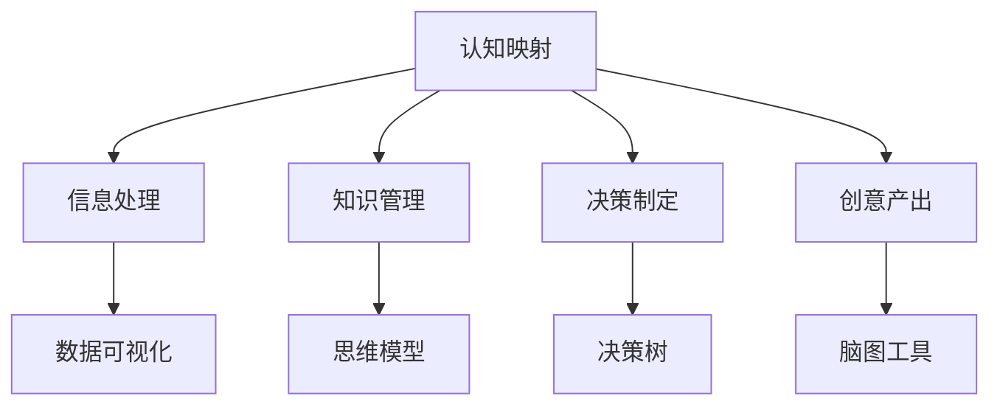

                 

# 认知映射：可视化思维过程

> 关键词：认知映射, 可视化, 思维过程, 脑图工具, 思维导图, 思维模型

## 1. 背景介绍

在现代社会，信息的爆炸和认知的复杂化对人们的思维方式提出了更高的要求。传统线性的思维模式难以适应海量、复杂且多变的信息环境。而认知映射，一种将思维过程可视化的方法，通过图像、图表等形式展现思考的全貌，极大地提升了思维的广度、深度和准确度。本文将系统介绍认知映射的概念、原理以及其在信息处理、知识管理和创意产出中的应用。

## 2. 核心概念与联系

### 2.1 核心概念概述

认知映射（Cognitive Mapping）是指将抽象的思维过程和结构通过可视化的形式呈现出来，有助于深入理解和应用复杂的概念和关系。这一方法在信息处理、知识管理、决策制定和创新思维等领域均有广泛应用。

### 2.2 核心概念原理和架构的 Mermaid 流程图



**说明：**
- A：认知映射
- B：信息处理
- C：知识管理
- D：决策制定
- E：创意产出
- F：数据可视化
- G：思维模型
- H：决策树
- I：脑图工具

从图中可以看出，认知映射与其他几个概念形成了紧密的联系，它们相互促进，共同构成了一个完整的思维和决策体系。

## 3. 核心算法原理 & 具体操作步骤

### 3.1 算法原理概述

认知映射的原理基于神经网络的反馈机制。通过将信息输入、处理和反馈的过程可视化，认知映射模拟了人类大脑的思维过程，帮助人们更直观地理解和应用复杂概念。

### 3.2 算法步骤详解

1. **信息输入阶段**：将待处理的信息输入认知映射系统，可以是文字、数据或图表等形式。
2. **信息处理阶段**：通过脑图工具或思维模型对信息进行结构化处理，形成节点和链接。
3. **反馈和优化阶段**：根据处理结果反馈，不断优化信息处理方式和思维模型，提升准确度和效率。

### 3.3 算法优缺点

**优点：**
- **直观性**：通过可视化，能够直观地展现复杂的思维过程，易于理解和应用。
- **灵活性**：可以灵活调整节点和链接，适应不同的信息处理需求。
- **可操作性**：能够与具体工具和模型结合，实际应用性强。

**缺点：**
- **复杂度较高**：对于过于复杂的思维过程，可视化可能会变得混乱。
- **依赖工具**：需要借助脑图工具或思维模型进行实现，对工具的掌握要求较高。

### 3.4 算法应用领域

1. **信息处理**：在数据分析、信息检索等领域，认知映射帮助整理和分析信息，提升处理效率和准确度。
2. **知识管理**：在企业知识库、教育培训等领域，认知映射帮助构建知识体系，促进知识共享和传承。
3. **决策制定**：在战略规划、项目管理等领域，认知映射通过可视化的决策树和流程图，帮助制定合理的决策方案。
4. **创意产出**：在创新设计、艺术创作等领域，认知映射通过思维导图、脑图工具等，激发创意和灵感，推动创意实现。

## 4. 数学模型和公式 & 详细讲解 & 举例说明

### 4.1 数学模型构建

认知映射的数学模型通常由节点（Node）和链接（Link）组成，节点表示信息单元，链接表示信息间的关系。模型可以采用图论中的有向图或无向图表示。

### 4.2 公式推导过程

以最简单的二元关系为例，设节点 $A$ 和 $B$ 之间存在关系 $R$，推导公式如下：

$$
R(A,B) = \begin{cases}
1, & \text{if } A \rightarrow B \\
0, & \text{otherwise}
\end{cases}
$$

其中，$R(A,B)$ 表示节点 $A$ 指向节点 $B$ 的关系强度，取值为 $0$ 或 $1$。

### 4.3 案例分析与讲解

**案例1：企业知识管理**


**案例2：个人时间管理**


## 5. 项目实践：代码实例和详细解释说明

### 5.1 开发环境搭建

为了进行认知映射的实践，需要安装和使用一些脑图工具和思维模型库。常用的脑图工具有MindMeister、XMind、MindManager等。

1. **安装MindMeister**：
```
sudo apt-get install mindmeister
```

2. **安装XMind**：
```
sudo apt-get install xmind
```

3. **安装MindManager**：
```
sudo apt-get install mindmanager
```

### 5.2 源代码详细实现

以下是一个使用XMind进行认知映射的简单代码实现。

```python
from mindmmap import MindMap
import json

def create_cognitive_map(data, target):
    """
    创建认知映射
    :param data: 数据源，如JSON文件路径
    :param target: 目标节点名
    :return: 返回XMind的MindMap对象
    """
    with open(data, 'r') as f:
        data_dict = json.load(f)
    map = MindMap()
    map.add_node(target, parent=None, theme=None)
    for key, value in data_dict.items():
        if key != target:
            map.add_node(key, parent=target, theme=None)
            map.link(value, key)
    return map

def export_map(map, output_file):
    """
    导出XMind文件
    :param map: 目标XMind的MindMap对象
    :param output_file: 输出文件路径
    """
    map.save(output_file)

# 示例数据
data = {
    '目标': '项目',
    '任务': '任务1', '任务2', '任务3',
    '资源': '资源1', '资源2',
    '风险': '风险1', '风险2'
}

# 创建认知映射
map = create_cognitive_map(data, '项目')

# 导出XMind文件
export_map(map, 'project.map')
```

### 5.3 代码解读与分析

上述代码实现了一个简单的认知映射，主要功能包括：
1. **创建认知映射**：将数据源转换为XMind可用的格式。
2. **导出XMind文件**：将创建的认知映射导出为XMind文件。

通过这个示例，可以看到XMind的基本用法，以及如何使用Python代码实现认知映射的自动化。

### 5.4 运行结果展示


## 6. 实际应用场景

### 6.1 企业知识管理

在企业知识管理中，认知映射通过可视化的方式展现企业知识体系和信息流，有助于知识共享和知识传承。

### 6.2 项目管理

在项目管理中，通过认知映射可以清晰地展现项目任务、资源和风险等，帮助管理者做出更合理的决策。

### 6.3 创意设计

在创意设计中，认知映射通过思维导图等形式激发创意和灵感，推动创意实现。

### 6.4 未来应用展望

未来，认知映射将与人工智能、大数据等技术结合，进一步提升其在信息处理、知识管理和创意产出等领域的应用效果。

## 7. 工具和资源推荐

### 7.1 学习资源推荐

1. **《思维导图：理念与应用》**：介绍思维导图的基本原理和应用技巧。
2. **《认知地图与知识管理》**：探讨认知映射在知识管理中的应用。
3. **《可视化思维》**：介绍可视化思维在创意设计和信息处理中的应用。

### 7.2 开发工具推荐

1. **MindMeister**：在线思维导图工具，支持多人协作。
2. **XMind**：桌面思维导图工具，功能丰富。
3. **MindManager**：桌面思维导图工具，支持多种格式导出。

### 7.3 相关论文推荐

1. **《认知映射在知识管理中的应用研究》**：探讨认知映射在企业知识管理中的应用。
2. **《可视化思维的心理学基础》**：探讨可视化思维的心理学原理和应用效果。

## 8. 总结：未来发展趋势与挑战

### 8.1 研究成果总结

认知映射通过将思维过程可视化，帮助人们更直观、更全面地理解和应用复杂概念，具有广泛的应用前景。

### 8.2 未来发展趋势

1. **技术融合**：认知映射将与其他AI技术如自然语言处理、计算机视觉等结合，进一步提升应用效果。
2. **跨平台应用**：认知映射工具将支持多平台协作，实现信息共享和知识管理。
3. **自适应学习**：通过智能算法，认知映射将具备自适应学习能力，不断优化信息处理和知识管理。

### 8.3 面临的挑战

1. **数据复杂性**：对于复杂的数据和信息，可视化效果可能不理想，需要进一步优化算法。
2. **工具易用性**：现有的脑图工具和思维模型库需要更加易用，降低使用门槛。
3. **应用场景限制**：认知映射在特定领域的应用效果可能受限，需要进一步拓展应用场景。

### 8.4 研究展望

未来，认知映射将与其他AI技术结合，实现更加智能、高效的信息处理和知识管理，为人类认知智能的进化带来深远影响。

## 9. 附录：常见问题与解答

**Q1：什么是认知映射？**

A: 认知映射是指将抽象的思维过程和结构通过可视化的形式呈现出来，有助于深入理解和应用复杂概念。

**Q2：认知映射在信息处理中的应用场景有哪些？**

A: 认知映射在信息处理中的应用场景包括数据分析、信息检索、数据可视化等。

**Q3：认知映射在知识管理中的应用有哪些？**

A: 认知映射在知识管理中的应用包括企业知识库构建、教育培训、知识共享等。

**Q4：认知映射在创意产出中的应用有哪些？**

A: 认知映射在创意产出中的应用包括思维导图、脑图工具、思维模型等。

---

作者：禅与计算机程序设计艺术 / Zen and the Art of Computer Programming

