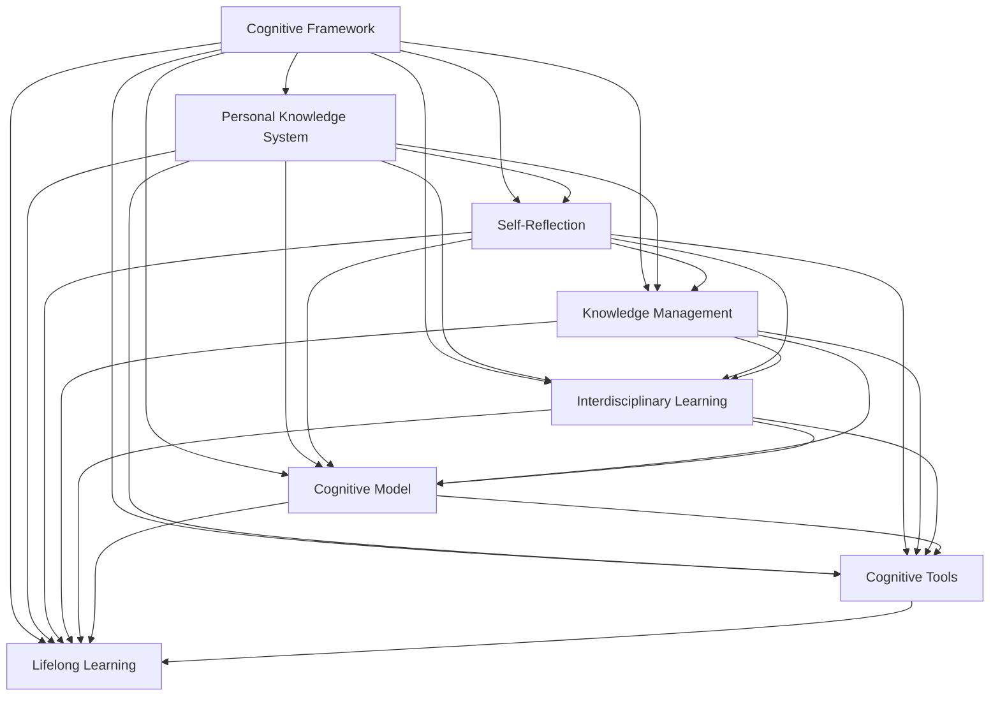

                 

# 认知框架：如何构建个人知识体系

> 关键词：认知框架, 个人知识体系构建, 自我反思, 知识管理, 跨学科学习, 认知模型, 认知工具, 持续学习

## 1. 背景介绍

在快速变化的时代，个人知识体系的构建已成为提升竞争力的关键。面对知识爆炸和信息碎片化，如何构建一个系统化、高效化的认知框架，对新知识进行吸收、整合、应用，成为了每个职业人士都必须面对的挑战。本文旨在深入探讨个人知识体系的构建方法，通过系统化、结构化的认知框架，帮助读者构建和维护一个强大、灵活、实用的知识体系，以应对未来复杂多变的职业环境。

## 2. 核心概念与联系

### 2.1 核心概念概述

1. **认知框架(Cognitive Framework)**：指基于大脑认知机制构建的知识体系框架，用于系统化地组织和关联知识，支持知识的快速检索和应用。
2. **个人知识体系(Personal Knowledge System)**：指个体通过学习、实践、反思等活动构建的知识结构，用于提升个人能力和竞争力。
3. **自我反思(Self-Reflection)**：指个体对自身知识结构、学习过程、思维模式的审视和反思，以发现问题和改进学习策略。
4. **知识管理(Knowledge Management)**：指对知识收集、存储、检索、分享等过程进行管理和优化，以提高知识的利用效率。
5. **跨学科学习(Interdisciplinary Learning)**：指跨越不同学科领域进行学习的策略，以拓展知识视野和提升创新能力。
6. **认知模型(Cognitive Model)**：指描述人类认知过程的数学或符号模型，用于分析和模拟认知行为。
7. **认知工具(Cognitive Tools)**：指辅助个体进行知识管理、学习、反思等认知过程的工具和平台。
8. **持续学习(Lifelong Learning)**：指个体在整个职业生涯中不断学习和更新知识的过程，以保持竞争力和适应新变化。

### 2.2 核心概念原理和架构的 Mermaid 流程图



这个流程图展示了各个核心概念之间的逻辑联系：

1. 认知框架是构建个人知识体系的基础。
2. 自我反思、知识管理、跨学科学习、认知模型、认知工具、持续学习都是构建和维护个人知识体系的关键环节。
3. 各环节之间相互促进，形成一个动态、自适应的认知系统。

## 3. 核心算法原理 & 具体操作步骤

### 3.1 算法原理概述

个人知识体系构建的核心算法包括信息检索、知识组织、反馈机制、动态调整等。这些算法基于认知心理学原理，模拟人类认知过程，帮助个体构建高效的知识体系。

### 3.2 算法步骤详解

1. **信息检索(Information Retrieval)**：使用关键词、分类、索引等技术，从海量信息中快速检索到相关知识。
2. **知识组织(Knowledge Organization)**：采用树状结构、图谱、标签等方法，对检索到的知识进行组织和分类。
3. **反馈机制(Feedback Mechanism)**：通过自我反思、同事反馈、系统评价等方式，及时发现知识体系中的问题和不足。
4. **动态调整(Dynamic Adjustment)**：根据反馈结果，动态调整知识结构，优化知识利用效率。

### 3.3 算法优缺点

**优点**：
- 系统化组织知识，提高检索效率。
- 动态调整机制，适应知识需求变化。
- 跨学科学习，拓展知识视野。

**缺点**：
- 需要时间和精力投入，构建初期较为复杂。
- 对技术要求较高，可能存在信息过载或遗漏的风险。

### 3.4 算法应用领域

个人知识体系构建方法不仅适用于学术研究，还广泛应用于职业发展、个人品牌建设、生活规划等领域。

## 4. 数学模型和公式 & 详细讲解 & 举例说明

### 4.1 数学模型构建

假设个体拥有 $N$ 个知识点 $K_i$，其中 $K_i$ 由 $M$ 个相关知识点组成，记为 $K_i = (K_{i1}, K_{i2}, ..., K_{iM})$。知识体系构建的目标是构建一个最优的知识结构 $S$，使得知识之间的连接关系 $R(K_i, K_j)$ 最大化，同时知识应用效率 $E(K_i)$ 最大化。

### 4.2 公式推导过程

1. **知识连接关系**：
   $$
   R(K_i, K_j) = \sum_{k=1}^{M} w_{ikj}
   $$
   其中 $w_{ikj}$ 表示知识点 $K_i$ 和 $K_j$ 之间的连接权重，可通过共现频率、相似度等指标计算。

2. **知识应用效率**：
   $$
   E(K_i) = f_i \times C_i
   $$
   其中 $f_i$ 表示知识点 $K_i$ 的频率，$C_i$ 表示知识点 $K_i$ 的应用复杂度。

### 4.3 案例分析与讲解

假设我们要构建一个关于人工智能的知识体系。我们可以将知识体系划分为多个模块，如机器学习、深度学习、自然语言处理等。每个模块内部和模块之间都有特定的连接关系。例如，机器学习模块和深度学习模块之间有很强的连接关系，因为深度学习是机器学习的一种技术手段。

## 5. 项目实践：代码实例和详细解释说明

### 5.1 开发环境搭建

为了构建个人知识体系，可以使用如下工具：

- **Jupyter Notebook**：一个免费的交互式编程环境，支持Python等编程语言。
- **Git**：一个版本控制系统，方便管理和协同开发。
- **Google Drive**：一个云存储服务，用于存储和共享文档。

### 5.2 源代码详细实现

以下是一个简化的知识体系构建的Python代码实现，用于组织和检索知识点：

```python
import pandas as pd

class KnowledgeSystem:
    def __init__(self):
        self.knowledge_dict = {}
    
    def add_knowledge(self, name, description):
        self.knowledge_dict[name] = description
    
    def get_knowledge(self, name):
        return self.knowledge_dict[name]
    
    def search_knowledge(self, keyword):
        results = []
        for name, description in self.knowledge_dict.items():
            if keyword in name or keyword in description:
                results.append((name, description))
        return results

# 示例使用
ks = KnowledgeSystem()
ks.add_knowledge('机器学习', '机器学习是人工智能的核心技术，包括监督学习、无监督学习和强化学习。')
ks.add_knowledge('深度学习', '深度学习是机器学习的一种技术，通过多层神经网络实现复杂模式的识别。')
ks.add_knowledge('自然语言处理', '自然语言处理是人工智能的重要分支，涉及语言模型、文本分析等技术。')

print(ks.search_knowledge('机器学习'))
```

### 5.3 代码解读与分析

这段代码实现了一个简单的知识系统，用于存储和检索知识点。`add_knowledge`方法用于添加知识点，`get_knowledge`方法用于获取知识点，`search_knowledge`方法用于根据关键词搜索知识点。

## 6. 实际应用场景

### 6.1 职业发展

在职业发展中，构建个人知识体系可以帮助你：
- 系统化学习行业知识，提升专业能力。
- 及时发现知识和技能缺口，进行针对性提升。
- 跨领域应用知识，拓展职业路径。

### 6.2 生活规划

在生活规划中，构建个人知识体系可以帮助你：
- 管理个人时间和精力，提高生活质量。
- 拓展兴趣爱好，提升个人素质。
- 平衡工作与生活，实现自我实现。

### 6.3 未来应用展望

未来，随着人工智能和大数据技术的发展，个人知识体系构建将更加智能化、个性化。例如：

- **智能推荐系统**：通过分析个人知识体系和使用习惯，智能推荐相关学习资源和应用场景。
- **情感分析**：分析个人知识体系中的情感倾向，提供个性化学习建议和心理支持。
- **跨平台集成**：将个人知识体系与各种学习平台、应用进行集成，实现无缝切换和应用。

## 7. 工具和资源推荐

### 7.1 学习资源推荐

- **Coursera**：提供各类在线课程，涵盖多个学科领域，支持灵活学习。
- **edX**：提供高质量的在线课程和微学位，与顶尖大学合作，系统学习知识。
- **Udacity**：提供项目导向的在线课程，培养实际工作能力。
- **Khan Academy**：提供免费的在线课程，涵盖数学、科学、人文等多个领域。

### 7.2 开发工具推荐

- **Jupyter Notebook**：一个免费的交互式编程环境，支持Python等编程语言。
- **Git**：一个版本控制系统，方便管理和协同开发。
- **Google Drive**：一个云存储服务，用于存储和共享文档。
- **Trello**：一个项目管理工具，支持任务分配、进度跟踪。
- **Evernote**：一个笔记应用，用于记录和组织知识。

### 7.3 相关论文推荐

- **《认知心理学》**：探索人类认知过程，提供认知框架和模型。
- **《知识管理的艺术》**：介绍知识管理的理论和方法，提升知识利用效率。
- **《深度学习》**：介绍深度学习的基本原理和应用，拓展认知视野。
- **《跨学科学习》**：探讨跨学科学习的方法和策略，提升创新能力。

## 8. 总结：未来发展趋势与挑战

### 8.1 研究成果总结

个人知识体系的构建方法已经取得显著进展，主要体现在以下几个方面：
- 信息检索技术的发展，使得知识获取更加高效。
- 知识组织方法的多样化，支持更灵活的知识结构。
- 反馈机制的优化，提升知识体系的动态调整能力。

### 8.2 未来发展趋势

未来，个人知识体系构建将呈现以下几个发展趋势：
- **智能化**：结合人工智能技术，实现智能推荐、情感分析等功能。
- **个性化**：根据个人兴趣、习惯、情感等特征，提供个性化的学习路径和应用场景。
- **跨平台**：与各种学习平台、应用集成，实现无缝切换和应用。
- **社会化**：将个人知识体系与社交网络结合，实现知识共享和合作。

### 8.3 面临的挑战

尽管个人知识体系构建取得了显著进展，但仍面临以下挑战：
- **技术门槛**：需要掌握多种工具和技术，对技术要求较高。
- **信息过载**：海量信息的获取和组织可能导致信息过载，难以有效利用。
- **持续学习**：保持持续学习习惯，更新知识体系需要长期投入。
- **应用场景**：如何将知识体系应用到实际生活和工作中，需要进一步探索和实践。

### 8.4 研究展望

未来的研究应集中在以下几个方面：
- **智能算法**：结合机器学习和人工智能技术，提升知识体系构建的效率和质量。
- **跨学科融合**：探索跨学科学习方法，提升知识体系的综合性和创新性。
- **社会化学习**：将知识体系构建与社交网络结合，促进知识共享和合作。
- **用户体验**：优化知识体系构建的交互体验，提升用户的使用便捷性和满意度。

## 9. 附录：常见问题与解答

**Q1：如何选择合适的学习资源？**

A: 选择学习资源时，应根据个人兴趣、职业需求和学习目标进行综合考虑。优先选择高质量、系统化的课程，如Coursera、edX、Udacity等平台提供的课程。

**Q2：如何管理个人时间，保持学习动力？**

A: 使用时间管理工具，如Trello、Todoist等，制定学习计划，分解学习任务，逐步完成。同时，设定学习目标和里程碑，保持持续的学习动力。

**Q3：如何构建跨学科知识体系？**

A: 从核心领域入手，建立基础的知识框架。然后通过跨学科学习，拓展相关领域的知识。例如，学习计算机科学的同时，可以探索其与数学、哲学、心理学等领域的交叉点。

**Q4：如何应对信息过载？**

A: 使用信息检索技术，如关键词搜索、分类索引等，快速定位相关信息。同时，保持定期清理和整理知识体系，避免信息过载。

**Q5：如何将知识体系应用于实际生活和工作？**

A: 将知识体系与实际工作场景结合，寻找应用机会。例如，将知识体系应用于项目管理、产品设计、客户服务等场景，提升工作效率和质量。

---

作者：禅与计算机程序设计艺术 / Zen and the Art of Computer Programming

