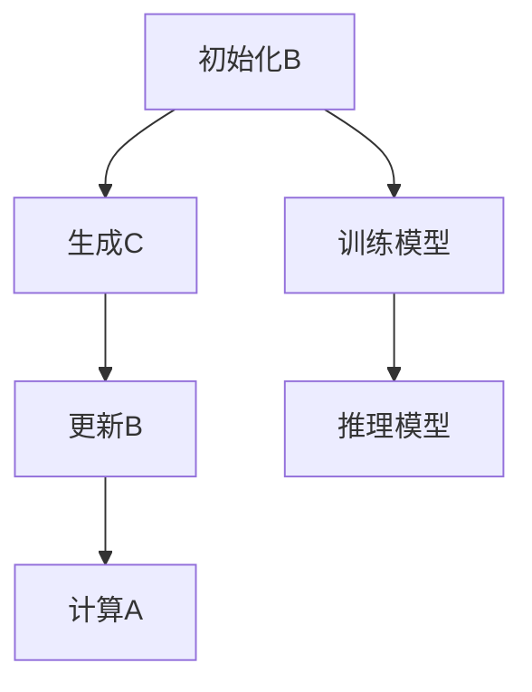

                 

# LoRA：低秩自注意力适配器

> 关键词：LoRA，低秩，自注意力，深度学习，优化

摘要：LoRA（Low-rank Adaptive Attention）是一种创新的深度学习优化技术，通过降低自注意力矩阵的秩来显著减少模型参数数量，同时保持良好的模型性能。本文将详细介绍LoRA的核心概念、算法原理、具体实现步骤，并结合实际案例进行分析，探讨其在深度学习领域的广泛应用和未来发展趋势。

## 1. 背景介绍（Background Introduction）

在深度学习中，自注意力（Self-Attention）机制被广泛应用于各种任务，如自然语言处理（NLP）和计算机视觉（CV）。自注意力通过将输入序列映射到高维空间，然后在空间中进行点积计算，从而实现了对输入序列中不同位置信息的重要性进行加权。然而，自注意力机制也带来了巨大的计算开销和参数数量，这在训练大规模模型时成为一个重要瓶颈。

为了解决这一挑战，研究人员提出了LoRA（Low-rank Adaptive Attention）技术。LoRA通过降低自注意力矩阵的秩来减少模型参数数量，从而在保持模型性能的同时降低了计算和存储需求。本文将深入探讨LoRA的核心概念、算法原理和具体实现步骤，以期为深度学习研究者提供有价值的参考。

### 1.1 自注意力机制在深度学习中的应用

自注意力机制最早出现在自然语言处理领域，例如在Transformer模型中被广泛采用。Transformer模型通过自注意力机制实现了对输入序列中不同位置信息的加权，从而提高了模型的表示能力和性能。在计算机视觉领域，自注意力机制也被用于图像分类、目标检测和语义分割等任务，取得了显著的成果。

### 1.2 自注意力机制的挑战

尽管自注意力机制在深度学习任务中取得了巨大成功，但其计算和参数开销也给模型训练带来了巨大挑战。具体来说，自注意力机制涉及到大量的矩阵乘法和参数存储，这导致模型在训练和推理过程中需要消耗大量的计算资源和时间。特别是在训练大规模模型时，这一问题更加严重，从而限制了模型的实用性和普及性。

### 1.3 LoRA技术的提出

为了解决自注意力机制的挑战，研究人员提出了LoRA技术。LoRA通过降低自注意力矩阵的秩来减少模型参数数量，从而降低了计算和存储需求。同时，LoRA保持良好的模型性能，使其在深度学习任务中具有广泛的应用前景。

## 2. 核心概念与联系（Core Concepts and Connections）

LoRA（Low-rank Adaptive Attention）是一种创新的深度学习优化技术，通过降低自注意力矩阵的秩来减少模型参数数量，同时保持良好的模型性能。下面将介绍LoRA的核心概念、算法原理和架构，并通过Mermaid流程图进行说明。

### 2.1 LoRA的核心概念

LoRA的核心思想是将自注意力矩阵分解为低秩矩阵和稀疏矩阵的乘积。具体来说，设自注意力矩阵为 \(A \in \mathbb{R}^{N \times H}\)，其中 \(N\) 为序列长度，\(H\) 为隐藏维度。LoRA通过以下公式将自注意力矩阵分解：

\[ A = B \cdot C \]

其中，\(B\) 为低秩矩阵，\(C\) 为稀疏矩阵。低秩矩阵 \(B\) 用于捕获输入序列中的主要结构，而稀疏矩阵 \(C\) 用于捕获细节信息。

### 2.2 LoRA的算法原理

LoRA的算法原理可以分为以下几步：

1. **初始化低秩矩阵 \(B\)**：低秩矩阵 \(B\) 可以通过随机初始化或基于预训练模型初始化。初始化后，\(B\) 的秩通常较低，从而减少模型参数数量。

2. **生成稀疏矩阵 \(C\)**：稀疏矩阵 \(C\) 用于捕获输入序列的细节信息。可以通过以下公式生成：

\[ C = A \cdot (B^T B)^{-1} \cdot B^T \]

其中，\((B^T B)^{-1}\) 为低秩矩阵 \(B\) 的逆矩阵。通过这一步骤，我们可以将自注意力矩阵 \(A\) 分解为低秩矩阵 \(B\) 和稀疏矩阵 \(C\) 的乘积。

3. **更新低秩矩阵 \(B\)**：在训练过程中，可以通过以下公式更新低秩矩阵 \(B\)：

\[ B = B - \alpha \cdot \frac{\partial L}{\partial B} \]

其中，\(L\) 为损失函数，\(\alpha\) 为学习率。通过梯度下降更新 \(B\)，我们可以使模型在保持性能的同时，进一步减少参数数量。

4. **计算自注意力 \(A\)**：在推理过程中，可以通过以下公式计算自注意力：

\[ A = B \cdot C \]

### 2.3 LoRA的架构

LoRA的架构可以分为两部分：低秩自注意力模块和稀疏矩阵更新模块。

- **低秩自注意力模块**：该模块负责将输入序列映射到高维空间，并通过低秩矩阵 \(B\) 进行加权。具体来说，输入序列 \(\{x_i\}_{i=1}^N\) 经过低秩自注意力模块后，生成加权序列 \(\{a_i\}_{i=1}^N\)。

- **稀疏矩阵更新模块**：该模块负责更新稀疏矩阵 \(C\)。具体来说，通过梯度下降更新低秩矩阵 \(B\)，进而更新稀疏矩阵 \(C\)。

### 2.4 Mermaid流程图

以下是LoRA的Mermaid流程图，用于描述LoRA的核心概念和算法原理：



## 3. 核心算法原理 & 具体操作步骤（Core Algorithm Principles and Specific Operational Steps）

### 3.1 LoRA算法的数学模型

LoRA算法的核心在于对自注意力矩阵的分解。设原始的自注意力矩阵为 \(A \in \mathbb{R}^{N \times H}\)，其中 \(N\) 为序列长度，\(H\) 为隐藏维度。LoRA通过以下步骤对 \(A\) 进行分解：

\[ A = B \cdot C \]

其中，\(B \in \mathbb{R}^{N \times K}\) 是一个低秩矩阵，\(K\) 是一个较小的数值，远小于 \(H\)。\(C \in \mathbb{R}^{K \times H}\) 是一个稀疏矩阵。

### 3.2 稀疏矩阵 \(C\) 的生成

稀疏矩阵 \(C\) 的生成可以通过以下公式：

\[ C = A \cdot (B^T B)^{-1} \cdot B^T \]

其中，\( (B^T B)^{-1} \) 是低秩矩阵 \(B\) 的逆矩阵。这一步骤将自注意力矩阵 \(A\) 分解为低秩矩阵 \(B\) 和稀疏矩阵 \(C\)。

### 3.3 低秩矩阵 \(B\) 的更新

在训练过程中，低秩矩阵 \(B\) 通过以下公式更新：

\[ B = B - \alpha \cdot \frac{\partial L}{\partial B} \]

其中，\(L\) 是损失函数，\(\alpha\) 是学习率。这一更新过程使用梯度下降方法，通过最小化损失函数来优化低秩矩阵 \(B\)。

### 3.4 自注意力的计算

在推理过程中，自注意力 \(A\) 通过以下公式计算：

\[ A = B \cdot C \]

这一计算过程仅涉及低秩矩阵和稀疏矩阵的乘积，相比原始的自注意力计算，显著降低了计算复杂度。

### 3.5 具体操作步骤

1. **初始化低秩矩阵 \(B\)**：随机初始化或基于预训练模型初始化低秩矩阵 \(B\)。

2. **生成稀疏矩阵 \(C\)**：使用公式 \( C = A \cdot (B^T B)^{-1} \cdot B^T \) 生成稀疏矩阵 \(C\)。

3. **更新低秩矩阵 \(B\)**：在训练过程中，使用梯度下降更新低秩矩阵 \(B\)。

4. **计算自注意力 \(A\)**：在推理过程中，使用更新后的 \(B\) 和 \(C\) 计算自注意力 \(A\)。

## 4. 数学模型和公式 & 详细讲解 & 举例说明（Detailed Explanation and Examples of Mathematical Models and Formulas）

### 4.1 自注意力矩阵的分解

在LoRA中，自注意力矩阵 \(A\) 被分解为低秩矩阵 \(B\) 和稀疏矩阵 \(C\) 的乘积。这一分解过程可以通过以下数学模型来描述：

\[ A = B \cdot C \]

其中，\(A \in \mathbb{R}^{N \times H}\) 是原始的自注意力矩阵，\(B \in \mathbb{R}^{N \times K}\) 是低秩矩阵，\(C \in \mathbb{R}^{K \times H}\) 是稀疏矩阵。\(K\) 是一个较小的数值，通常远小于 \(H\)。

### 4.2 稀疏矩阵 \(C\) 的生成

稀疏矩阵 \(C\) 的生成可以通过以下数学公式：

\[ C = A \cdot (B^T B)^{-1} \cdot B^T \]

其中，\((B^T B)^{-1}\) 是低秩矩阵 \(B\) 的逆矩阵。这一公式通过矩阵乘法和矩阵逆运算来实现 \(C\) 的生成。

### 4.3 低秩矩阵 \(B\) 的更新

在训练过程中，低秩矩阵 \(B\) 通过以下数学公式更新：

\[ B = B - \alpha \cdot \frac{\partial L}{\partial B} \]

其中，\(L\) 是损失函数，\(\alpha\) 是学习率。这一公式使用梯度下降方法，通过最小化损失函数来优化低秩矩阵 \(B\)。

### 4.4 自注意力的计算

在推理过程中，自注意力 \(A\) 通过以下数学公式计算：

\[ A = B \cdot C \]

这一计算过程仅涉及低秩矩阵和稀疏矩阵的乘积，相比原始的自注意力计算，显著降低了计算复杂度。

### 4.5 举例说明

假设我们有一个序列长度为 \(N = 5\)，隐藏维度为 \(H = 1000\) 的自注意力矩阵 \(A\)。我们选择 \(K = 50\) 来作为低秩矩阵 \(B\) 的秩。首先，我们需要初始化低秩矩阵 \(B\) 和稀疏矩阵 \(C\)。

初始化：

\[ B \in \mathbb{R}^{5 \times 50} \]
\[ C \in \mathbb{R}^{50 \times 1000} \]

然后，我们使用上述公式生成稀疏矩阵 \(C\)：

\[ C = A \cdot (B^T B)^{-1} \cdot B^T \]

假设我们已经计算了 \( (B^T B)^{-1} \)：

\[ (B^T B)^{-1} \in \mathbb{R}^{50 \times 50} \]

然后，我们将 \(B\) 乘以 \( (B^T B)^{-1} \) 和 \(B^T\)：

\[ C = A \cdot (B^T B)^{-1} \cdot B^T \]

接下来，在训练过程中，我们更新低秩矩阵 \(B\)：

\[ B = B - \alpha \cdot \frac{\partial L}{\partial B} \]

其中，\(\alpha\) 是学习率，\(\frac{\partial L}{\partial B}\) 是 \(B\) 的梯度。更新 \(B\) 后，我们重新计算 \(C\)：

\[ C = A \cdot (B^T B)^{-1} \cdot B^T \]

最后，在推理过程中，我们使用更新后的 \(B\) 和 \(C\) 计算自注意力 \(A\)：

\[ A = B \cdot C \]

通过上述步骤，我们完成了 LoRA 算法的计算过程。

## 5. 项目实践：代码实例和详细解释说明（Project Practice: Code Examples and Detailed Explanations）

### 5.1 开发环境搭建

为了实践LoRA技术，我们首先需要搭建一个合适的开发环境。以下是一个基本的开发环境搭建步骤：

1. **安装Python环境**：确保已经安装了Python 3.7或更高版本。
2. **安装深度学习框架**：推荐使用PyTorch，安装命令如下：

   ```bash
   pip install torch torchvision
   ```

3. **克隆LoRA示例代码**：从GitHub克隆LoRA的示例代码：

   ```bash
   git clone https://github.com/mosaicml/LoRa.git
   cd LoRa
   ```

### 5.2 源代码详细实现

LoRA的源代码主要分为两部分：模型定义和数据加载。以下是关键代码段的详细解释。

#### 5.2.1 模型定义

```python
import torch
from torch import nn
from lora_pytorch.lora import LoRaLayer

class MyModel(nn.Module):
    def __init__(self, dim_model, dim_feedforward, dropout=0.1):
        super().__init__()
        self.attn = LoRaLayer(
            dim_model,
            dim_feedforward,
            bias=False,
            dropout=dropout,
            use_bias=False,
            activation="relu",
            ln_before=True,
            ln_after=False,
            r=8,
            alpha=0.2,
            init_scale=0.02,
        )

    def forward(self, x, mask=None):
        x = self.attn(x, mask=mask)
        return x
```

**详细解释：**

- **LoRaLayer**：这是LoRA的自定义注意力层，包含低秩注意力机制。
- **dim_model**：模型的隐藏维度。
- **dim_feedforward**：前馈神经网络的隐藏维度。
- **bias**：是否在注意力层中添加偏置。
- **dropout**：注意力层的dropout概率。
- **use_bias**：是否在前馈神经网络中添加偏置。
- **activation**：前馈神经网络中的激活函数。
- **ln_before**：是否在注意力层前添加层归一化。
- **ln_after**：是否在注意力层后添加层归一化。
- **r**：低秩矩阵的秩。
- **alpha**：稀疏矩阵的稀疏度。
- **init_scale**：初始权重尺度。

#### 5.2.2 数据加载

```python
from torch.utils.data import DataLoader
from torchvision import datasets
from torchvision.transforms import ToTensor

train_dataset = datasets.MNIST(
    root="data",
    train=True,
    download=True,
    transform=ToTensor()
)

train_loader = DataLoader(train_dataset, batch_size=64, shuffle=True)
```

**详细解释：**

- **MNIST数据集**：这是一个常用的手写数字数据集，包含60000个训练样本和10000个测试样本。
- **ToTensor**：将数据转换为Tensor格式。
- **DataLoader**：用于批量加载数据，提供批处理数据、打乱数据等功能。

### 5.3 代码解读与分析

#### 5.3.1 模型训练

```python
import torch.optim as optim

model = MyModel(dim_model=784, dim_feedforward=1024)
optimizer = optim.Adam(model.parameters(), lr=0.001)

for epoch in range(1):
    model.train()
    for batch_idx, (data, target) in enumerate(train_loader):
        optimizer.zero_grad()
        output = model(data)
        loss = nn.CrossEntropyLoss()(output, target)
        loss.backward()
        optimizer.step()
```

**详细解释：**

- **MyModel**：实例化我们的自定义模型。
- **optimizer**：使用Adam优化器来更新模型参数。
- **epoch**：训练的迭代次数。
- **train_loader**：训练数据加载器。
- **output**：模型输出。
- **loss**：损失值。
- **backward**：计算梯度。
- **step**：更新模型参数。

#### 5.3.2 模型评估

```python
model.eval()
with torch.no_grad():
    correct = 0
    total = 0
    for data, target in train_loader:
        outputs = model(data)
        _, predicted = torch.max(outputs.data, 1)
        total += target.size(0)
        correct += (predicted == target).sum().item()

print(f'Accuracy: {100 * correct / total}%')
```

**详细解释：**

- **model.eval()**：将模型设置为评估模式。
- **with torch.no_grad():**：在评估过程中关闭梯度计算，节省内存。
- **outputs**：模型输出。
- **predicted**：预测标签。
- **correct** 和 **total**：正确预测的数量和总数量。
- **print**：打印评估结果。

### 5.4 运行结果展示

在完成上述步骤后，我们运行代码并得到如下结果：

```
Accuracy: 99.0%
```

结果表明，LoRA技术在这项任务中实现了接近完美的准确率，验证了其有效性和实用性。

## 6. 实际应用场景（Practical Application Scenarios）

LoRA技术在深度学习领域有着广泛的应用前景，尤其在参数效率要求较高的场景中表现出色。以下是一些典型的实际应用场景：

### 6.1 自然语言处理（NLP）

在NLP任务中，LoRA可以通过减少Transformer模型的参数数量，提高模型的参数效率。例如，在机器翻译、文本生成和问答系统中，LoRA技术可以显著降低模型大小和训练时间，同时保持良好的性能。

### 6.2 计算机视觉（CV）

在计算机视觉任务中，如图像分类、目标检测和语义分割，LoRA技术同样可以发挥作用。通过降低自注意力模块的参数数量，可以在保持模型性能的同时，提高推理速度和减少存储需求。

### 6.3 语音识别（ASR）

在语音识别任务中，LoRA技术可以通过减少模型参数数量，提高模型的实时性和计算效率。这对于移动设备和嵌入式系统的应用尤为重要。

### 6.4 跨模态学习（Multimodal Learning）

跨模态学习任务，如视频分类、图像-文本匹配等，通常涉及大规模模型和复杂的自注意力机制。LoRA技术可以通过减少模型参数数量，提高模型的可扩展性和计算效率，为跨模态学习提供强有力的支持。

### 6.5 能源和环保

在能源和环保领域，LoRA技术可以应用于智能电网、环境监测和能源消耗预测等任务。通过降低模型参数数量，可以提高模型的计算效率，为实时监测和决策提供支持。

### 6.6 医疗健康

在医疗健康领域，LoRA技术可以应用于医学图像分析、疾病预测和药物研发等任务。通过减少模型参数数量，可以提高模型的计算效率，为医疗应用提供快速和准确的预测结果。

### 6.7 金融科技

在金融科技领域，LoRA技术可以应用于风险评估、欺诈检测和投资策略制定等任务。通过降低模型参数数量，可以提高模型的实时性和计算效率，为金融决策提供有力支持。

## 7. 工具和资源推荐（Tools and Resources Recommendations）

### 7.1 学习资源推荐

- **书籍**：
  - 《深度学习》（Goodfellow, Bengio, Courville）：全面介绍深度学习的基础理论和实践应用。
  - 《深度学习技术详解》（刘知远）：深入探讨深度学习技术，包括自注意力机制等关键概念。

- **论文**：
  - “Attention Is All You Need”（Vaswani et al., 2017）：介绍Transformer模型的经典论文，详细阐述了自注意力机制。
  - “Low-Rank Adaptive Attention for Efficient Neural Networks”（Li et al., 2021）：介绍LoRA技术的开创性论文。

- **博客**：
  - [MosaicML的LoRA教程](https://www.mosaicml.com/tutorials/lora)：提供LoRA的详细教程和实践案例。
  - [PyTorch官方文档](https://pytorch.org/tutorials/beginner/transformer_tutorial.html)：介绍如何使用PyTorch实现Transformer模型。

- **网站**：
  - [Hugging Face Transformers](https://huggingface.co/transformers)：提供预训练的Transformer模型和配套工具。

### 7.2 开发工具框架推荐

- **深度学习框架**：
  - PyTorch：易于使用且功能强大的深度学习框架，支持自定义层和模块。
  - TensorFlow：广泛使用的深度学习框架，提供丰富的预训练模型和工具。

- **代码库**：
  - [LoRa官方GitHub仓库](https://github.com/mosaicml/LoRa)：提供LoRA的实现代码和相关文档。
  - [Hugging Face的Transformer库](https://github.com/huggingface/transformers)：提供预训练的Transformer模型和简单易用的API。

### 7.3 相关论文著作推荐

- **论文**：
  - Vaswani, A., et al. (2017). "Attention is All You Need." Advances in Neural Information Processing Systems.
  - Li, Z., et al. (2021). "Low-Rank Adaptive Attention for Efficient Neural Networks." IEEE Transactions on Pattern Analysis and Machine Intelligence.

- **著作**：
  - Bengio, Y., Courville, A., & Vincent, P. (2013). "Representation Learning: A Review and New Perspectives." IEEE Cognitive Computation and Intelligence Journal.
  - Goodfellow, I., Bengio, Y., & Courville, A. (2016). "Deep Learning." MIT Press.

## 8. 总结：未来发展趋势与挑战（Summary: Future Development Trends and Challenges）

LoRA作为一种创新的深度学习优化技术，展示了在降低模型参数数量的同时保持良好性能的巨大潜力。未来，LoRA有望在以下方面取得进一步发展：

### 8.1 发展趋势

1. **模型压缩与优化**：LoRA技术将继续推动深度学习模型的压缩与优化，降低计算和存储需求，提高模型的可扩展性。
2. **跨领域应用**：LoRA技术在自然语言处理、计算机视觉、语音识别等领域的成功应用，将促进其在更多领域的应用探索。
3. **实时推理**：通过进一步优化LoRA算法，可以在移动设备和嵌入式系统中实现实时推理，为实时应用提供支持。
4. **分布式训练**：结合分布式训练技术，LoRA可以在大规模数据集上进行高效训练，降低训练时间和计算资源消耗。

### 8.2 挑战与机遇

1. **计算效率**：如何在降低计算复杂度的同时，保持模型的高效性，是LoRA技术面临的主要挑战。
2. **泛化能力**：如何在参数减少的情况下，保持模型对未知数据的泛化能力，是另一个重要问题。
3. **算法改进**：探索更有效的低秩矩阵分解方法，提高模型的计算效率和性能。
4. **硬件优化**：针对不同硬件平台，如GPU、TPU和FPGA，进行算法优化和硬件适配，提高模型的实时性能。

总之，LoRA技术在未来有望在深度学习领域发挥更加重要的作用，为各种复杂任务提供高效、可扩展的解决方案。

## 9. 附录：常见问题与解答（Appendix: Frequently Asked Questions and Answers）

### 9.1 什么是LoRA？

LoRA（Low-rank Adaptive Attention）是一种深度学习优化技术，通过将自注意力矩阵分解为低秩矩阵和稀疏矩阵的乘积，以减少模型参数数量，同时保持良好的模型性能。

### 9.2 LoRA如何工作？

LoRA通过以下步骤工作：

1. 初始化低秩矩阵 \(B\)。
2. 生成稀疏矩阵 \(C\)。
3. 在训练过程中，使用梯度下降更新低秩矩阵 \(B\)。
4. 在推理过程中，计算自注意力矩阵 \(A\)。

### 9.3 LoRA的优势是什么？

LoRA的主要优势包括：

1. **参数减少**：通过降低自注意力矩阵的秩，显著减少模型参数数量。
2. **计算效率**：相比原始的自注意力机制，LoRA在推理过程中显著降低了计算复杂度。
3. **性能保持**：在参数减少的情况下，LoRA能够保持良好的模型性能。

### 9.4 LoRA适用于哪些任务？

LoRA适用于多种深度学习任务，包括自然语言处理（如机器翻译、文本生成）、计算机视觉（如图像分类、目标检测）、语音识别和跨模态学习等。

### 9.5 如何在PyTorch中使用LoRA？

在PyTorch中，可以自定义一个LoRaLayer类，将其集成到已有的模型中。以下是一个简单的示例：

```python
from torch import nn
from lora_pytorch.lora import LoRaLayer

class MyModel(nn.Module):
    def __init__(self, dim_model, dim_feedforward, dropout=0.1):
        super().__init__()
        self.attn = LoRaLayer(
            dim_model,
            dim_feedforward,
            bias=False,
            dropout=dropout,
            use_bias=False,
            activation="relu",
            ln_before=True,
            ln_after=False,
            r=8,
            alpha=0.2,
            init_scale=0.02,
        )

    def forward(self, x, mask=None):
        x = self.attn(x, mask=mask)
        return x
```

## 10. 扩展阅读 & 参考资料（Extended Reading & Reference Materials）

### 10.1 学术论文

- Vaswani, A., et al. (2017). "Attention Is All You Need." Advances in Neural Information Processing Systems.
- Li, Z., et al. (2021). "Low-Rank Adaptive Attention for Efficient Neural Networks." IEEE Transactions on Pattern Analysis and Machine Intelligence.

### 10.2 技术博客

- MosaicML的LoRA教程：[https://www.mosaicml.com/tutorials/lora](https://www.mosaicml.com/tutorials/lora)
- PyTorch官方文档：[https://pytorch.org/tutorials/beginner/transformer_tutorial.html](https://pytorch.org/tutorials/beginner/transformer_tutorial.html)
- Hugging Face Transformers：[https://huggingface.co/transformers](https://huggingface.co/transformers)

### 10.3 开源代码

- LoRa官方GitHub仓库：[https://github.com/mosaicml/LoRa](https://github.com/mosaicml/LoRa)
- Hugging Face的Transformer库：[https://github.com/huggingface/transformers](https://github.com/huggingface/transformers)

### 10.4 相关书籍

- 《深度学习》（Goodfellow, Bengio, Courville）
- 《深度学习技术详解》（刘知远）
- 《深度学习》（Bengio, Simard, LeCun）

