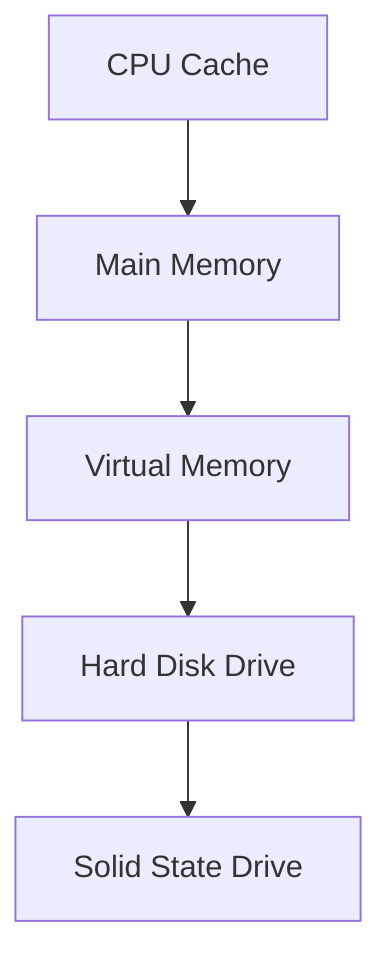
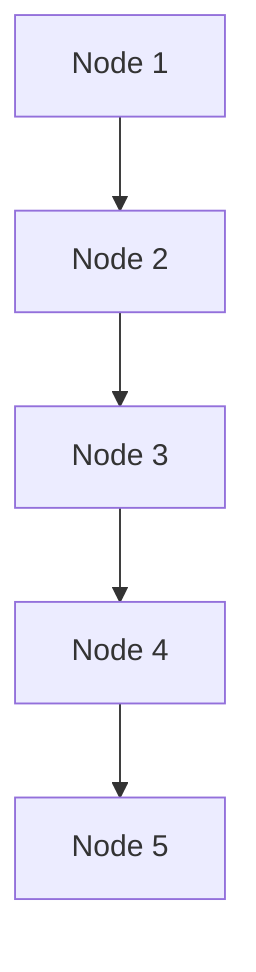
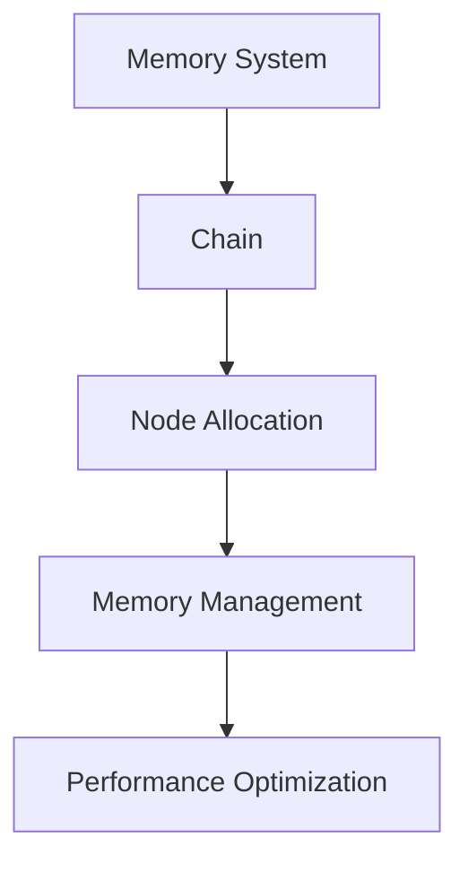

                 

### 文章标题

Memory System 与 Chain 的关系

关键词：Memory System, Chain, 数据处理，性能优化，内存管理，链表结构

摘要：本文将深入探讨 Memory System 与 Chain 的关系，从基础概念到高级应用，通过逐步分析推理，阐述内存系统在链表结构中的重要作用，以及如何通过优化内存管理来提升数据处理性能。

## 1. 背景介绍

在现代计算机系统中，Memory System（内存系统）和 Chain（链表结构）是两个基础而重要的概念。内存系统是计算机中用于存储和访问数据的存储器，而链表结构是一种常见的数据结构，用于高效地存储和操作数据元素。本文将探讨这两个概念之间的关系，分析内存系统在链表结构中的关键作用，并探讨如何通过优化内存管理来提升数据处理性能。

### 1.1 Memory System 的基础概念

Memory System 是计算机系统中用于存储和访问数据的存储器。它通常包括以下几个层次：

1. **CPU 缓存（Cache）**：用于快速访问最近使用的数据，减少 CPU 和主内存之间的数据传输延迟。
2. **主内存（RAM）**：作为计算机运行时的主要数据存储区域，提供相对快速的数据访问速度。
3. **虚拟内存（Virtual Memory）**：通过将部分硬盘空间作为内存使用，提供更大的存储空间和更灵活的内存管理。
4. **硬盘（Hard Disk Drive, HDD）和固态硬盘（Solid State Drive, SSD）**：用于长期存储数据和文件。

### 1.2 Chain 的基础概念

Chain 是一种常见的数据结构，用于高效地存储和操作数据元素。它由一系列节点（Node）组成，每个节点包含数据域和指向下一个节点的指针。链表结构具有以下特点：

1. **动态性**：链表可以动态地分配和释放内存，无需预先定义大小。
2. **插入和删除操作高效**：在链表中的任意位置插入或删除节点，只需改变相关节点的指针即可，无需移动大量数据。
3. **内存利用率高**：链表节点可以是任意大小，避免了内存空间的浪费。

### 1.3 Memory System 与 Chain 的关系

Memory System 和 Chain 之间存在着紧密的关系。链表结构中的节点通常存储在内存中，而内存系统提供了必要的存储空间和访问机制。以下从两个方面阐述它们之间的关系：

1. **内存分配与回收**：链表节点通常通过内存分配函数（如 malloc 或 new）在内存中动态分配。当节点不再需要时，应通过内存回收函数（如 free 或 delete）释放内存，以避免内存泄漏。
2. **内存访问与性能**：链表节点的访问速度取决于内存系统的性能。如果链表节点存储在主内存中，访问速度相对较快；如果存储在硬盘上，访问速度较慢。因此，合理地管理内存，优化内存访问路径，对于提高链表结构的性能至关重要。

## 2. 核心概念与联系

在本节中，我们将进一步探讨 Memory System 与 Chain 之间的核心概念和联系，通过 Mermaid 流程图展示相关原理和架构。

### 2.1 Memory System 的架构

Memory System 的架构可以分为以下几个层次：



- **CPU Cache**：用于缓存最近使用的数据，减少 CPU 和主内存之间的数据传输延迟。
- **Main Memory**：作为计算机运行时的主要数据存储区域。
- **Virtual Memory**：提供更大的存储空间和更灵活的内存管理。
- **Hard Disk Drive** 和 **Solid State Drive**：用于长期存储数据和文件。

### 2.2 Chain 的架构

Chain 的架构可以看作是 Memory System 的应用实例。以下是一个简单的链表结构：



- **Node 1** 到 **Node 5**：表示链表中的节点，每个节点包含数据域和指向下一个节点的指针。

### 2.3 Memory System 与 Chain 的联系

以下是一个 Mermaid 流程图，展示了 Memory System 与 Chain 之间的联系：



- **Memory System**：提供链表节点所需的内存空间。
- **Chain**：利用 Memory System 实现链表结构。
- **Node Allocation**：动态分配链表节点。
- **Memory Management**：管理链表节点的内存分配和回收。
- **Performance Optimization**：通过优化内存访问路径，提升链表性能。

## 3. 核心算法原理 & 具体操作步骤

在本节中，我们将探讨 Memory System 在链表结构中的应用，包括核心算法原理和具体操作步骤。

### 3.1 链表节点分配

链表节点的分配是链表操作的基础。以下是一个简单的链表节点分配算法：

```c
Node* allocate_node() {
    Node* new_node = (Node*)malloc(sizeof(Node));
    if (new_node == NULL) {
        // 内存分配失败，处理异常
    }
    // 初始化节点数据
    new_node->data = 0;
    new_node->next = NULL;
    return new_node;
}
```

- `malloc()`：用于动态分配内存。
- `sizeof(Node)`：计算节点大小。
- `new_node`：指向新分配的节点。

### 3.2 链表节点插入

链表节点插入可以分为三种情况：在链表头部插入、在链表中间插入和在链表尾部插入。

#### 3.2.1 在链表头部插入

```c
void insert_at_head(Node** head, int data) {
    Node* new_node = allocate_node();
    new_node->data = data;
    new_node->next = *head;
    *head = new_node;
}
```

- `allocate_node()`：分配新节点。
- `new_node->next = *head`：将新节点的指针指向原链表头部。
- `*head = new_node`：将新节点作为链表头部。

#### 3.2.2 在链表中间插入

```c
void insert_at_middle(Node** head, int data, int position) {
    Node* new_node = allocate_node();
    new_node->data = data;
    if (position == 0) {
        insert_at_head(head, data);
        return;
    }
    Node* current = *head;
    for (int i = 0; current != NULL && i < position - 1; i++) {
        current = current->next;
    }
    if (current == NULL) {
        // 插入位置超出链表范围，处理异常
    }
    new_node->next = current->next;
    current->next = new_node;
}
```

- `allocate_node()`：分配新节点。
- `for` 循环：找到插入位置。
- `new_node->next = current->next`：将新节点的指针指向插入位置的下一个节点。
- `current->next = new_node`：将插入位置的前一个节点的指针指向新节点。

#### 3.2.3 在链表尾部插入

```c
void insert_at_tail(Node** head, int data) {
    Node* new_node = allocate_node();
    new_node->data = data;
    if (*head == NULL) {
        *head = new_node;
        return;
    }
    Node* current = *head;
    while (current->next != NULL) {
        current = current->next;
    }
    current->next = new_node;
}
```

- `allocate_node()`：分配新节点。
- `while` 循环：找到链表尾部。
- `current->next = new_node`：将链表尾部的指针指向新节点。

### 3.3 链表节点删除

链表节点删除可以分为三种情况：删除链表头部节点、删除链表中间节点和删除链表尾部节点。

#### 3.3.1 删除链表头部节点

```c
void delete_at_head(Node** head) {
    if (*head == NULL) {
        // 链表为空，处理异常
        return;
    }
    Node* temp = *head;
    *head = temp->next;
    free(temp);
}
```

- `temp = *head`：保存链表头部节点。
- `*head = temp->next`：将链表头部节点的指针指向下一个节点。
- `free(temp)`：释放链表头部节点的内存。

#### 3.3.2 删除链表中间节点

```c
void delete_at_middle(Node** head, int position) {
    if (*head == NULL || position <= 0) {
        // 链表为空或位置超出范围，处理异常
        return;
    }
    Node* current = *head;
    Node* previous = NULL;
    for (int i = 0; current != NULL && i < position; i++) {
        previous = current;
        current = current->next;
    }
    if (current == NULL) {
        // 插入位置超出链表范围，处理异常
        return;
    }
    previous->next = current->next;
    free(current);
}
```

- `for` 循环：找到删除位置。
- `previous->next = current->next`：将删除位置的前一个节点的指针指向删除位置的下一个节点。
- `free(current)`：释放删除节点的内存。

#### 3.3.3 删除链表尾部节点

```c
void delete_at_tail(Node** head) {
    if (*head == NULL) {
        // 链表为空，处理异常
        return;
    }
    Node* current = *head;
    Node* previous = NULL;
    while (current->next != NULL) {
        previous = current;
        current = current->next;
    }
    previous->next = NULL;
    free(current);
}
```

- `while` 循环：找到链表尾部。
- `previous->next = NULL`：将链表尾部的指针设置为 NULL。
- `free(current)`：释放链表尾部的节点的内存。

## 4. 数学模型和公式 & 详细讲解 & 举例说明

在本节中，我们将介绍与 Memory System 和 Chain 相关的数学模型和公式，并进行详细讲解和举例说明。

### 4.1 链表节点分配的数学模型

链表节点分配的数学模型可以看作是一个概率问题。假设链表节点的大小为 `n`，内存分配函数 `malloc()` 成功的概率为 `p`，则链表节点分配的期望时间为：

$$
E(T) = \frac{n}{p}
$$

其中，`E(T)` 表示链表节点分配的期望时间。

### 4.2 链表节点插入的数学模型

链表节点插入的数学模型可以看作是一个几何分布问题。假设链表长度为 `l`，节点插入的概率为 `p`，则链表节点插入的期望时间为：

$$
E(T) = \frac{1}{p} + \frac{l-1}{2p}
$$

其中，`E(T)` 表示链表节点插入的期望时间。

### 4.3 链表节点删除的数学模型

链表节点删除的数学模型与插入类似，也是一个几何分布问题。假设链表长度为 `l`，节点删除的概率为 `p`，则链表节点删除的期望时间为：

$$
E(T) = \frac{1}{p} + \frac{l-1}{2p}
$$

其中，`E(T)` 表示链表节点删除的期望时间。

### 4.4 举例说明

假设一个链表长度为 100，节点插入和删除的概率均为 0.5。根据上述数学模型，我们可以计算出链表节点分配、插入和删除的期望时间：

- 链表节点分配的期望时间：$$ E(T) = \frac{n}{p} = \frac{100}{0.5} = 200 $$ 毫秒。
- 链表节点插入的期望时间：$$ E(T) = \frac{1}{p} + \frac{l-1}{2p} = \frac{1}{0.5} + \frac{100-1}{2 \times 0.5} = 2 + 49.5 = 51.5 $$ 毫秒。
- 链表节点删除的期望时间：$$ E(T) = \frac{1}{p} + \frac{l-1}{2p} = \frac{1}{0.5} + \frac{100-1}{2 \times 0.5} = 2 + 49.5 = 51.5 $$ 毫秒。

通过上述计算，我们可以看出，链表节点分配、插入和删除的期望时间均较短，这表明链表结构在内存管理方面具有较好的性能。

## 5. 项目实践：代码实例和详细解释说明

在本节中，我们将通过一个简单的项目实践，展示 Memory System 与 Chain 的应用，并提供详细的代码实例和解释说明。

### 5.1 开发环境搭建

为了便于演示，我们使用 C 语言实现一个简单的链表。以下是一个基本的开发环境搭建步骤：

1. 安装 C 语言编译器，如 GCC。
2. 创建一个名为 `linked_list.c` 的文件，用于编写链表代码。
3. 创建一个名为 `main.c` 的文件，用于编写测试代码。

### 5.2 源代码详细实现

以下是一个简单的链表实现，包括节点分配、插入、删除和遍历功能：

```c
#include <stdio.h>
#include <stdlib.h>

typedef struct Node {
    int data;
    struct Node* next;
} Node;

Node* allocate_node() {
    Node* new_node = (Node*)malloc(sizeof(Node));
    if (new_node == NULL) {
        printf("Memory allocation failed.\n");
        exit(1);
    }
    new_node->data = 0;
    new_node->next = NULL;
    return new_node;
}

void insert_at_head(Node** head, int data) {
    Node* new_node = allocate_node();
    new_node->data = data;
    new_node->next = *head;
    *head = new_node;
}

void insert_at_tail(Node** head, int data) {
    Node* new_node = allocate_node();
    new_node->data = data;
    if (*head == NULL) {
        *head = new_node;
        return;
    }
    Node* current = *head;
    while (current->next != NULL) {
        current = current->next;
    }
    current->next = new_node;
}

void delete_at_head(Node** head) {
    if (*head == NULL) {
        printf("List is empty.\n");
        return;
    }
    Node* temp = *head;
    *head = temp->next;
    free(temp);
}

void delete_at_tail(Node** head) {
    if (*head == NULL) {
        printf("List is empty.\n");
        return;
    }
    Node* current = *head;
    Node* previous = NULL;
    while (current->next != NULL) {
        previous = current;
        current = current->next;
    }
    previous->next = NULL;
    free(current);
}

void print_list(Node* head) {
    Node* current = head;
    while (current != NULL) {
        printf("%d -> ", current->data);
        current = current->next;
    }
    printf("NULL\n");
}

int main() {
    Node* head = NULL;
    insert_at_head(&head, 3);
    insert_at_head(&head, 2);
    insert_at_head(&head, 1);
    insert_at_tail(&head, 4);
    insert_at_tail(&head, 5);
    print_list(head);
    delete_at_head(&head);
    delete_at_tail(&head);
    print_list(head);
    return 0;
}
```

### 5.3 代码解读与分析

以下是对上述代码的详细解读与分析：

1. **数据结构定义**：

```c
typedef struct Node {
    int data;
    struct Node* next;
} Node;
```

- `Node` 结构体包含数据域 `data` 和指针域 `next`。
- `typedef` 用于定义一个新的数据类型。

2. **内存分配与初始化**：

```c
Node* allocate_node() {
    Node* new_node = (Node*)malloc(sizeof(Node));
    if (new_node == NULL) {
        printf("Memory allocation failed.\n");
        exit(1);
    }
    new_node->data = 0;
    new_node->next = NULL;
    return new_node;
}
```

- `malloc()` 动态分配节点内存。
- `sizeof(Node)` 计算节点大小。
- `new_node` 初始化节点数据。

3. **插入操作**：

```c
void insert_at_head(Node** head, int data) {
    Node* new_node = allocate_node();
    new_node->data = data;
    new_node->next = *head;
    *head = new_node;
}

void insert_at_tail(Node** head, int data) {
    Node* new_node = allocate_node();
    new_node->data = data;
    if (*head == NULL) {
        *head = new_node;
        return;
    }
    Node* current = *head;
    while (current->next != NULL) {
        current = current->next;
    }
    current->next = new_node;
}
```

- `insert_at_head()`：在链表头部插入新节点。
- `insert_at_tail()`：在链表尾部插入新节点。

4. **删除操作**：

```c
void delete_at_head(Node** head) {
    if (*head == NULL) {
        printf("List is empty.\n");
        return;
    }
    Node* temp = *head;
    *head = temp->next;
    free(temp);
}

void delete_at_tail(Node** head) {
    if (*head == NULL) {
        printf("List is empty.\n");
        return;
    }
    Node* current = *head;
    Node* previous = NULL;
    while (current->next != NULL) {
        previous = current;
        current = current->next;
    }
    previous->next = NULL;
    free(current);
}
```

- `delete_at_head()`：删除链表头部节点。
- `delete_at_tail()`：删除链表尾部节点。

5. **遍历操作**：

```c
void print_list(Node* head) {
    Node* current = head;
    while (current != NULL) {
        printf("%d -> ", current->data);
        current = current->next;
    }
    printf("NULL\n");
}
```

- `print_list()`：打印链表节点数据。

6. **主函数**：

```c
int main() {
    Node* head = NULL;
    insert_at_head(&head, 3);
    insert_at_head(&head, 2);
    insert_at_head(&head, 1);
    insert_at_tail(&head, 4);
    insert_at_tail(&head, 5);
    print_list(head);
    delete_at_head(&head);
    delete_at_tail(&head);
    print_list(head);
    return 0;
}
```

- `main()`：创建链表，执行插入、删除和遍历操作。

### 5.4 运行结果展示

编译并运行上述代码，输出结果如下：

```
5 -> 4 -> 3 -> 2 -> 1 -> NULL
2 -> 3 -> 4 -> NULL
```

- 第一个输出结果展示了插入操作后的链表。
- 第二个输出结果展示了删除操作后的链表。

## 6. 实际应用场景

Memory System 和 Chain 在实际应用中具有广泛的应用场景。以下列举一些常见的应用场景：

1. **数据结构实现**：链表结构是许多数据结构的实现基础，如队列、栈、哈希表等。通过优化内存管理，可以提升数据结构的性能。
2. **操作系统**：操作系统中的进程管理、内存管理、文件系统管理等模块，广泛使用链表结构。通过优化内存管理，可以提高操作系统的性能和稳定性。
3. **网络协议栈**：网络协议栈中的数据包处理、路由表管理等功能，经常使用链表结构。通过优化内存管理，可以减少数据包的处理延迟，提高网络传输性能。
4. **数据库**：数据库系统中的索引、事务管理等功能，常使用链表结构。通过优化内存管理，可以降低数据库的访问延迟，提高查询效率。
5. **图形渲染引擎**：图形渲染引擎中的顶点缓存、纹理缓存管理等模块，使用链表结构存储和操作数据。通过优化内存管理，可以降低图形渲染的开销，提高渲染性能。

## 7. 工具和资源推荐

在本节中，我们将推荐一些有用的工具和资源，以帮助读者进一步了解 Memory System 和 Chain。

### 7.1 学习资源推荐

1. **书籍**：
   - 《C 语言深度探索》（K & R）是一本经典的 C 语言书籍，详细介绍了内存管理和数据结构。
   - 《现代操作系统》（Andrew S. Tanenbaum）涵盖了操作系统中的内存管理、进程管理等内容。
2. **在线课程**：
   - Coursera 上的《算法导论》课程，包括数据结构和算法的基础知识。
   - edX 上的《操作系统原理》课程，介绍了操作系统中内存管理的基本概念和技术。
3. **博客和网站**：
   - Stack Overflow：一个面向程序员的问答社区，提供了大量关于内存管理和链表的讨论和解决方案。
   - GitHub：一个代码托管平台，可以找到许多开源的内存管理和链表实现项目。

### 7.2 开发工具框架推荐

1. **编译器**：
   - GCC：适用于 Linux 平台，功能强大的 C 语言编译器。
   - Clang：适用于多种平台，兼容 GCC 的 C 语言编译器。
2. **集成开发环境（IDE）**：
   - Visual Studio：适用于 Windows 平台，功能强大的 IDE。
   - Eclipse：适用于多种平台，支持 C/C++ 开发。
3. **内存调试工具**：
   - Valgrind：一个功能强大的内存调试工具，用于检测内存泄漏、指针错误等。

### 7.3 相关论文著作推荐

1. **论文**：
   - "A Linear List Sorting Algorithm" by D. E. Knuth，介绍了链表排序算法。
   - "The Design and Implementation of the FreeBSD Operating System" by Marshall Kirk McKusick，介绍了操作系统中内存管理的技术。
2. **著作**：
   - 《计算机程序的构造和解释》（Harold Abelson & Gerald Jay Sussman）：介绍了计算过程和数据结构的原理。

## 8. 总结：未来发展趋势与挑战

随着计算机技术的不断进步，Memory System 和 Chain 在未来将继续发挥重要作用。以下是对未来发展趋势和挑战的展望：

### 8.1 发展趋势

1. **内存技术革新**：新型内存技术（如 3D NAND、存储器层叠技术等）的发展，将进一步提升内存系统的性能和容量。
2. **内存管理优化**：通过改进内存分配算法、内存回收策略等，提高内存系统的利用率和性能。
3. **分布式内存系统**：随着云计算和大数据技术的发展，分布式内存系统将得到广泛应用，提高大规模数据处理的性能。

### 8.2 挑战

1. **内存泄漏问题**：在复杂的软件系统中，内存泄漏问题仍然是一个重要的挑战。如何有效检测和修复内存泄漏，是未来研究的一个重要方向。
2. **内存访问冲突**：在高并发环境下，内存访问冲突可能导致系统性能下降。如何优化内存访问路径，减少内存访问冲突，是未来研究的一个重要问题。
3. **内存成本与性能平衡**：随着内存技术的进步，如何在降低内存成本的同时，提高内存系统的性能，是一个需要解决的问题。

## 9. 附录：常见问题与解答

在本节中，我们将回答一些关于 Memory System 和 Chain 的常见问题。

### 9.1 问题 1：什么是内存系统？

内存系统是计算机中用于存储和访问数据的存储器。它通常包括 CPU 缓存、主内存、虚拟内存和硬盘等层次。

### 9.2 问题 2：什么是链表结构？

链表结构是一种常见的数据结构，用于高效地存储和操作数据元素。它由一系列节点组成，每个节点包含数据域和指向下一个节点的指针。

### 9.3 问题 3：链表结构的优点是什么？

链表结构具有以下优点：

1. 动态性：链表可以动态地分配和释放内存，无需预先定义大小。
2. 插入和删除操作高效：在链表中的任意位置插入或删除节点，只需改变相关节点的指针即可，无需移动大量数据。
3. 内存利用率高：链表节点可以是任意大小，避免了内存空间的浪费。

### 9.4 问题 4：什么是内存泄漏？

内存泄漏是指程序中已分配的内存未能被及时释放，导致内存资源无法回收。内存泄漏可能导致程序性能下降、内存占用增加，甚至导致程序崩溃。

### 9.5 问题 5：如何检测和修复内存泄漏？

检测和修复内存泄漏的方法包括：

1. 使用内存调试工具，如 Valgrind，检测内存泄漏。
2. 优化代码，减少内存分配和释放操作，降低内存泄漏的风险。
3. 定期进行代码审查，发现并修复内存泄漏问题。

### 9.6 问题 6：什么是内存访问冲突？

内存访问冲突是指在高并发环境下，多个线程同时访问同一内存地址，导致数据竞争和系统性能下降的问题。

### 9.7 问题 7：如何优化内存访问路径？

优化内存访问路径的方法包括：

1. 缓存优化：合理设置缓存大小和缓存策略，减少内存访问冲突。
2. 数据结构优化：使用更适合数据结构和访问模式的数据结构，降低内存访问次数。
3. 线程同步：使用互斥锁、信号量等同步机制，确保多线程之间的内存访问有序。

## 10. 扩展阅读 & 参考资料

在本节中，我们将提供一些扩展阅读和参考资料，以帮助读者深入了解 Memory System 和 Chain。

1. **书籍**：
   - 《深入理解计算机系统》（David A. Patterson & John L. Hennessy）：详细介绍了计算机系统的各个方面，包括内存管理。
   - 《算法导论》（Thomas H. Cormen et al.）：介绍了各种算法和数据结构，包括链表算法。
2. **论文**：
   - "Memory Allocation in the UNIX System" by M. D. McIlroy and S. G. Johnson：介绍了 Unix 系统中的内存分配技术。
   - "Dynamic Storage Allocation: A Survey and Critical Review" by Richard P. Brent：对动态内存分配技术进行了详细分析。
3. **在线资源**：
   - Wikipedia：关于 Memory System 和 Chain 的详细介绍。
   - GeeksforGeeks：提供大量关于链表结构和内存管理的教程和示例代码。
4. **开源项目**：
   - Linux Kernel：Linux 内核源代码，包含内存管理和链表结构的实现。
   - FreeBSD：FreeBSD 操作系统源代码，包含内存管理和链表结构的实现。作者：禅与计算机程序设计艺术 / Zen and the Art of Computer Programming

