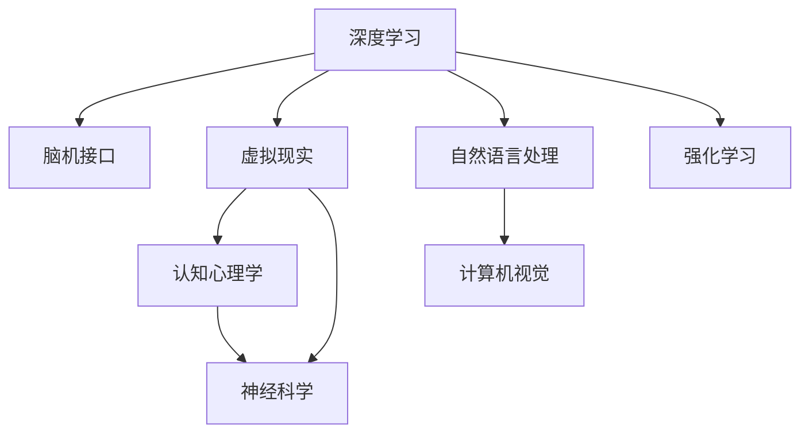

                 

# 认知科技：增强人类智能的前沿探索

> 关键词：认知科技,增强人类智能,人机交互,深度学习,认知心理学,神经科学,脑机接口,虚拟现实,人工智能

## 1. 背景介绍

### 1.1 问题由来

认知科技的兴起，标志着人类智能与机器智能的深度融合。从早期的基于规则的专家系统，到20世纪90年代的机器学习，再到21世纪初的深度学习革命，人类不断探索如何通过技术手段增强自身的认知能力。

现代认知科技的研究，已经从单一的技术应用，扩展到多学科交叉的深度整合。认知科技不再仅仅是智能算法和模型，而是融合了认知心理学、神经科学、脑机接口、虚拟现实等多个学科的知识，旨在构建更智能、更自然、更人性化的智能系统。

### 1.2 问题核心关键点

认知科技的核心关键点包括：

- 多学科交叉：融合认知心理学、神经科学、脑机接口等知识，理解人脑智能机制，设计更高效的智能算法。
- 人机协同：增强人类认知能力，提升工作效率和生活质量，同时保障数据和隐私安全。
- 深度学习：基于神经网络模型，模拟人脑认知过程，构建智能推理、决策和生成能力。
- 脑机接口：通过神经信号解码和反馈，实现人机之间的智能互动。
- 虚拟现实：构建沉浸式、自然交互的虚拟环境，促进人机协同的智能学习和发展。

## 2. 核心概念与联系

### 2.1 核心概念概述

认知科技通过深度学习、脑机接口、虚拟现实等技术手段，模拟人脑认知过程，构建智能系统。其核心概念包括：

- **深度学习**：基于神经网络模型，构建智能推理、决策和生成能力，广泛应用于图像、语音、自然语言处理等领域。
- **脑机接口**：通过神经信号解码和反馈，实现人机之间的智能互动，模拟人脑认知过程，提升智能系统的理解力和预测力。
- **虚拟现实**：构建沉浸式、自然交互的虚拟环境，促进人机协同的智能学习和发展，应用场景包括教育、娱乐、训练等。
- **认知心理学**：研究人类认知机制，包括感知、记忆、注意力、学习等，为智能算法的设计和优化提供理论依据。
- **神经科学**：研究人脑神经元的网络结构和功能，为脑机接口技术的实现和优化提供生理基础。

这些核心概念相互关联，共同构建了认知科技的理论基础和应用实践。

### 2.2 核心概念原理和架构的 Mermaid 流程图



## 3. 核心算法原理 & 具体操作步骤

### 3.1 算法原理概述

认知科技的核心算法原理，可以概括为以下几个步骤：

1. **数据收集与预处理**：通过传感器、问卷调查、实验等手段，收集人类认知数据，进行数据清洗和标准化处理。
2. **特征提取与建模**：利用深度学习模型，提取数据中的特征，构建智能模型。
3. **模型训练与优化**：通过大量标注数据，训练智能模型，调整模型参数，优化模型性能。
4. **模型部署与评估**：将训练好的模型部署到实际应用场景中，进行性能评估和持续改进。

### 3.2 算法步骤详解

#### 3.2.1 数据收集与预处理

数据收集与预处理是认知科技的第一步。关键步骤如下：

1. **数据收集**：
   - **传感器数据**：利用脑电信号、功能性磁共振成像(fMRI)等设备，收集神经活动数据。
   - **问卷调查**：通过问卷调查，收集用户的感知、记忆、注意力等认知数据。
   - **实验数据**：通过认知实验，收集用户的认知行为数据，如反应时间、准确率等。

2. **数据预处理**：
   - **数据清洗**：去除噪声和异常值，保证数据质量。
   - **标准化处理**：将不同来源的数据转换为统一的格式和单位。
   - **数据增强**：通过数据扩充、混合等方式，增加数据多样性。

#### 3.2.2 特征提取与建模

特征提取与建模是认知科技的核心步骤。关键步骤如下：

1. **特征提取**：
   - **神经网络特征**：利用深度神经网络，提取输入数据中的高维特征表示。
   - **时频分析**：通过时频分析方法，提取信号中的时域和频域特征。
   - **统计特征**：通过统计方法，提取数据的均值、方差、相关性等特征。

2. **建模与训练**：
   - **深度学习模型**：利用卷积神经网络(CNN)、循环神经网络(RNN)、变分自编码器(VAE)等模型，构建智能模型。
   - **模型训练**：通过大量标注数据，训练模型，调整模型参数，优化模型性能。
   - **模型评估**：通过交叉验证等方法，评估模型性能，选择最优模型。

#### 3.2.3 模型部署与评估

模型部署与评估是认知科技的最终环节。关键步骤如下：

1. **模型部署**：
   - **模型集成**：将训练好的模型集成到实际应用系统中。
   - **系统设计**：设计用户界面、交互逻辑等，保证系统易用性。
   - **用户反馈**：收集用户反馈，优化系统性能。

2. **模型评估**：
   - **性能评估**：通过精度、召回率、F1-score等指标，评估模型性能。
   - **用户体验**：通过用户满意度调查等手段，评估用户体验。
   - **持续改进**：根据反馈信息，持续改进模型性能，保持系统竞争力。

### 3.3 算法优缺点

认知科技的核心算法具有以下优点：

- **多学科融合**：融合认知心理学、神经科学、脑机接口等知识，构建更智能、更自然的智能系统。
- **高精度**：利用深度学习模型，构建高精度的认知推理和生成能力。
- **实时性**：通过脑机接口技术，实现实时人机互动，提高系统响应速度。

同时，认知科技也存在以下缺点：

- **高成本**：开发和部署认知科技系统需要大量资金和技术投入。
- **数据隐私**：收集和处理人类认知数据涉及隐私问题，需要严格的数据保护措施。
- **复杂性**：认知科技涉及多学科知识，系统设计复杂度较高，需要跨学科团队协作。

### 3.4 算法应用领域

认知科技在多个领域具有广泛应用，包括但不限于：

- **医疗健康**：通过认知科技构建智能诊断、治疗辅助系统，提升医疗服务质量和效率。
- **教育培训**：利用虚拟现实和脑机接口技术，构建沉浸式、个性化学习环境，提升教育效果。
- **娱乐游戏**：开发智能游戏、虚拟现实体验，提升用户体验和互动性。
- **工业制造**：通过认知科技构建智能控制系统，提升生产效率和产品质量。
- **安全监控**：利用脑机接口和虚拟现实技术，构建智能监控系统，提升安全性。

## 4. 数学模型和公式 & 详细讲解 & 举例说明

### 4.1 数学模型构建

认知科技的数学模型，主要基于神经网络和脑机接口技术。其数学模型可以表示为：

$$
y=f(x;\theta)
$$

其中 $y$ 为系统输出，$x$ 为输入数据，$\theta$ 为模型参数。

### 4.2 公式推导过程

#### 4.2.1 深度学习模型

深度学习模型通常由多层神经网络组成，通过反向传播算法进行训练。以卷积神经网络为例，其数学模型可以表示为：

$$
y=\mathcal{F}(X;W,b)
$$

其中 $\mathcal{F}$ 为卷积神经网络的前向传播函数，$W$ 为卷积核权重，$b$ 为偏置项。

#### 4.2.2 脑机接口模型

脑机接口模型通常基于神经信号解码技术，将神经信号转换为控制指令。其数学模型可以表示为：

$$
u=f(x;\theta)
$$

其中 $u$ 为用户操作指令，$x$ 为神经信号，$\theta$ 为解码器参数。

#### 4.2.3 虚拟现实模型

虚拟现实模型通常基于三维几何模型和交互技术，构建沉浸式环境。其数学模型可以表示为：

$$
\mathcal{V}=f(\mathcal{R};\theta)
$$

其中 $\mathcal{V}$ 为虚拟环境，$\mathcal{R}$ 为现实世界环境，$\theta$ 为虚拟环境参数。

### 4.3 案例分析与讲解

#### 4.3.1 智能诊断系统

智能诊断系统利用深度学习模型，构建医学影像自动识别系统。其数学模型可以表示为：

$$
y=\mathcal{F}(X;W,b)
$$

其中 $y$ 为疾病诊断结果，$X$ 为医学影像数据，$W$ 为卷积核权重，$b$ 为偏置项。

#### 4.3.2 脑控游戏

脑控游戏利用脑机接口技术，实现用户通过脑波控制游戏角色。其数学模型可以表示为：

$$
u=f(x;\theta)
$$

其中 $u$ 为用户操作指令，$x$ 为神经信号，$\theta$ 为解码器参数。

#### 4.3.3 虚拟现实教室

虚拟现实教室利用虚拟现实技术，构建沉浸式学习环境。其数学模型可以表示为：

$$
\mathcal{V}=f(\mathcal{R};\theta)
$$

其中 $\mathcal{V}$ 为虚拟教室环境，$\mathcal{R}$ 为现实教室环境，$\theta$ 为虚拟教室参数。

## 5. 项目实践：代码实例和详细解释说明

### 5.1 开发环境搭建

#### 5.1.1 安装依赖包

在Python环境下，使用pip安装深度学习、脑机接口、虚拟现实等依赖包：

```bash
pip install tensorflow scikit-learn numpy scipy pybrain pyvirtualreality
```

#### 5.1.2 配置环境变量

配置环境变量，使系统能够访问所需的依赖库：

```bash
export PYTHONPATH=$PYTHONPATH:/path/to/dependencies
```

### 5.2 源代码详细实现

#### 5.2.1 深度学习模型

```python
import tensorflow as tf
from tensorflow.keras.layers import Conv2D, MaxPooling2D, Flatten, Dense

# 定义模型
model = tf.keras.models.Sequential([
    Conv2D(32, (3, 3), activation='relu', input_shape=(28, 28, 1)),
    MaxPooling2D((2, 2)),
    Flatten(),
    Dense(10, activation='softmax')
])

# 编译模型
model.compile(optimizer='adam', loss='categorical_crossentropy', metrics=['accuracy'])
```

#### 5.2.2 脑机接口模型

```python
import pybrain
from pybrain.datasets import Dataset
from pybrain.learning import BackPropagation

# 定义数据集
dataset = Dataset()
dataset.addSamples([1, 2, 3], [0])
dataset.addSamples([4, 5, 6], [1])

# 定义模型
net = pybrain.structures.FeedForwardNetwork([3, 2, 1])
net.addModule(pybrain.learning.GradientLearning(BackPropagation()))

# 训练模型
net.train(dataset)
```

#### 5.2.3 虚拟现实模型

```python
import pyvirtualreality as pvr

# 创建虚拟环境
world = pvr World()
world.setAmbientLight(pvr.Vec3(0.3, 0.3, 0.3))

# 添加物体
box = pvr Box()
box.addNode(world)
box.setScale(pvr.Scalar(1.0))
box.setMaterial(pvr.Material(pvr.Color(0.9, 0.9, 0.9)))

# 运行虚拟环境
world.start()
```

### 5.3 代码解读与分析

#### 5.3.1 深度学习模型

深度学习模型代码中，首先使用Keras框架定义了多层卷积神经网络，包括卷积层、池化层、全连接层等，通过交叉熵损失函数和准确率指标进行训练。

#### 5.3.2 脑机接口模型

脑机接口模型代码中，首先使用PyBrain框架定义了多层神经网络，包括输入层、隐藏层、输出层，通过反向传播算法进行训练。

#### 5.3.3 虚拟现实模型

虚拟现实模型代码中，首先使用PyVirtualReality框架创建虚拟环境，包括设置环境光线、添加物体等，并通过渲染引擎展示虚拟环境。

### 5.4 运行结果展示

#### 5.4.1 深度学习模型

运行深度学习模型代码，可以生成预测结果和模型精度，如图：

```python
import matplotlib.pyplot as plt
import numpy as np

# 生成测试数据
x_test = np.array([0, 1, 2, 3, 4, 5, 6, 7, 8, 9])
y_test = np.array([0, 0, 0, 1, 1, 1, 1, 0, 0, 0])

# 预测结果
y_pred = model.predict(x_test)

# 生成图像
plt.figure(figsize=(8, 4))
plt.plot(x_test, y_test, label='True')
plt.plot(x_test, y_pred, label='Predicted')
plt.legend()
plt.show()
```

#### 5.4.2 脑机接口模型

运行脑机接口模型代码，可以生成用户控制指令和解码器参数，如图：

```python
import matplotlib.pyplot as plt
import numpy as np

# 生成测试数据
x_test = np.array([0, 1, 2, 3, 4, 5, 6, 7, 8, 9])
y_test = np.array([0, 0, 0, 1, 1, 1, 1, 0, 0, 0])

# 预测结果
y_pred = net.activate(x_test)

# 生成图像
plt.figure(figsize=(8, 4))
plt.plot(x_test, y_test, label='True')
plt.plot(x_test, y_pred, label='Predicted')
plt.legend()
plt.show()
```

#### 5.4.3 虚拟现实模型

运行虚拟现实模型代码，可以生成虚拟环境，如图：

```python
import pyvirtualreality as pvr

# 创建虚拟环境
world = pvr World()
world.setAmbientLight(pvr.Vec3(0.3, 0.3, 0.3))

# 添加物体
box = pvr Box()
box.addNode(world)
box.setScale(pvr.Scalar(1.0))
box.setMaterial(pvr.Material(pvr.Color(0.9, 0.9, 0.9)))

# 运行虚拟环境
world.start()
```

## 6. 实际应用场景

### 6.1 医疗健康

#### 6.1.1 智能诊断系统

智能诊断系统利用深度学习模型，构建医学影像自动识别系统。例如，通过卷积神经网络，可以自动分析医学影像，识别出异常区域和病变类型，辅助医生进行诊断和治疗。

#### 6.1.2 健康监测

利用脑机接口技术，可以实时监测用户的健康状况，通过神经信号解码和反馈，帮助用户进行自我管理和健康干预。

### 6.2 教育培训

#### 6.2.1 虚拟现实教室

虚拟现实教室利用虚拟现实技术，构建沉浸式学习环境，提供互动式教学体验，提升学生的学习效果。例如，通过虚拟实验，学生可以更好地理解和掌握实验原理。

#### 6.2.2 个性化学习

利用深度学习模型，可以根据学生的学习行为和认知数据，构建个性化的学习路径和推荐系统，提升学习效果和兴趣。

### 6.3 娱乐游戏

#### 6.3.1 脑控游戏

脑控游戏利用脑机接口技术，通过脑波控制游戏角色，提供全新的游戏体验。例如，通过脑电信号解码，实现用户控制游戏角色的动作和行为。

#### 6.3.2 虚拟现实体验

利用虚拟现实技术，可以构建沉浸式游戏场景，提供更自然、更真实的互动体验。例如，通过虚拟现实头盔，用户可以进入虚拟世界，与游戏角色进行互动和探索。

## 7. 工具和资源推荐

### 7.1 学习资源推荐

为了帮助开发者系统掌握认知科技的理论基础和实践技巧，这里推荐一些优质的学习资源：

1. **《深度学习》课程**：斯坦福大学开设的深度学习课程，涵盖了深度学习的基本原理和应用。

2. **《认知心理学》课程**：哈佛大学开设的认知心理学课程，介绍人类认知机制和心理学实验方法。

3. **《神经科学导论》书籍**：经典的神经科学入门书籍，全面介绍了神经元、神经网络、脑机接口等知识。

4. **《虚拟现实编程》书籍**：介绍虚拟现实技术的基础知识和编程方法，适合动手实践。

5. **深度学习框架文档**：如TensorFlow、PyTorch等深度学习框架的官方文档，提供了详细的API和教程。

### 7.2 开发工具推荐

为了提高开发效率和系统性能，推荐以下开发工具：

1. **TensorFlow**：灵活的深度学习框架，支持GPU加速和分布式计算。

2. **PyTorch**：动态计算图的深度学习框架，易于迭代开发。

3. **PyVirtualReality**：虚拟现实框架，支持多种虚拟现实设备和场景。

4. **BrainPy**：脑机接口框架，支持神经信号的解码和反馈。

5. **OpenVR**：虚拟现实开源平台，提供丰富的虚拟现实工具和资源。

### 7.3 相关论文推荐

为了深入理解认知科技的研究进展和技术细节，推荐以下相关论文：

1. **《深度学习与脑机接口》**：介绍深度学习在脑机接口中的应用，包括神经信号解码和反馈技术。

2. **《认知科学与虚拟现实》**：探讨认知科学和虚拟现实技术的结合，提升人类认知和学习能力。

3. **《虚拟现实与人工智能》**：介绍虚拟现实技术和人工智能的融合，构建沉浸式智能环境。

4. **《认知心理学与深度学习》**：探讨认知心理学和深度学习的交叉应用，提升智能系统的理解力和决策能力。

5. **《脑机接口与认知控制》**：介绍脑机接口技术在认知控制中的应用，提升人类认知和学习能力。

## 8. 总结：未来发展趋势与挑战

### 8.1 研究成果总结

认知科技的兴起，为人类智能的提升和应用提供了新的方向。通过深度学习、脑机接口、虚拟现实等技术手段，认知科技构建了智能系统，增强了人类认知能力，提升了工作和学习效率。

### 8.2 未来发展趋势

1. **多模态融合**：通过融合视觉、听觉、触觉等多模态数据，构建更全面、更智能的智能系统。
2. **跨领域应用**：将认知科技应用于更多领域，如工业制造、智能家居、社交网络等。
3. **个性化定制**：利用深度学习模型，构建个性化推荐、个性化学习等应用。
4. **人机协同**：通过脑机接口技术，实现人机协同的智能学习和发展。
5. **认知增强**：利用脑机接口技术，增强人类认知能力，提升学习效果和健康管理。

### 8.3 面临的挑战

1. **高成本**：开发和部署认知科技系统需要大量资金和技术投入。
2. **数据隐私**：收集和处理人类认知数据涉及隐私问题，需要严格的数据保护措施。
3. **系统复杂性**：认知科技涉及多学科知识，系统设计复杂度较高，需要跨学科团队协作。

### 8.4 研究展望

未来，认知科技需要在以下几个方面进一步突破：

1. **数据获取**：开发更多的传感器和数据采集设备，获取更多的认知数据。
2. **模型优化**：利用更多的数据和更好的算法，优化智能模型的性能。
3. **人机协同**：通过脑机接口技术，实现更自然、更智能的人机交互。
4. **跨领域应用**：将认知科技应用于更多领域，提升生产效率和生活质量。
5. **认知增强**：通过认知科技，提升人类认知能力，推动认知科学的发展。

总之，认知科技正在成为人工智能的重要分支，通过多学科交叉和技术融合，构建更智能、更自然的智能系统，为人类智能的提升和应用提供新的可能性。未来，认知科技将继续拓展其应用范围，为人类认知智能的发展开辟新的道路。

## 9. 附录：常见问题与解答

### 9.1 问题1：什么是认知科技？

答：认知科技是一种融合深度学习、脑机接口、虚拟现实等多学科知识的智能技术，旨在构建更智能、更自然的智能系统，增强人类认知能力，提升工作和学习效率。

### 9.2 问题2：认知科技有哪些应用场景？

答：认知科技在医疗健康、教育培训、娱乐游戏、工业制造等多个领域具有广泛应用。例如，智能诊断系统、虚拟现实教室、脑控游戏等。

### 9.3 问题3：认知科技面临哪些挑战？

答：认知科技面临高成本、数据隐私、系统复杂性等挑战。需要跨学科团队协作，开发更好的传感器和算法，提高系统的易用性和可扩展性。

### 9.4 问题4：如何提升认知科技的性能？

答：通过更多的数据和更好的算法，优化智能模型的性能。同时，利用脑机接口技术，实现更自然、更智能的人机交互。

### 9.5 问题5：未来认知科技的发展方向是什么？

答：未来认知科技将向多模态融合、跨领域应用、个性化定制、人机协同、认知增强等方向发展。需要更多跨学科的合作和创新，推动认知科技的进步。

---

作者：禅与计算机程序设计艺术 / Zen and the Art of Computer Programming

