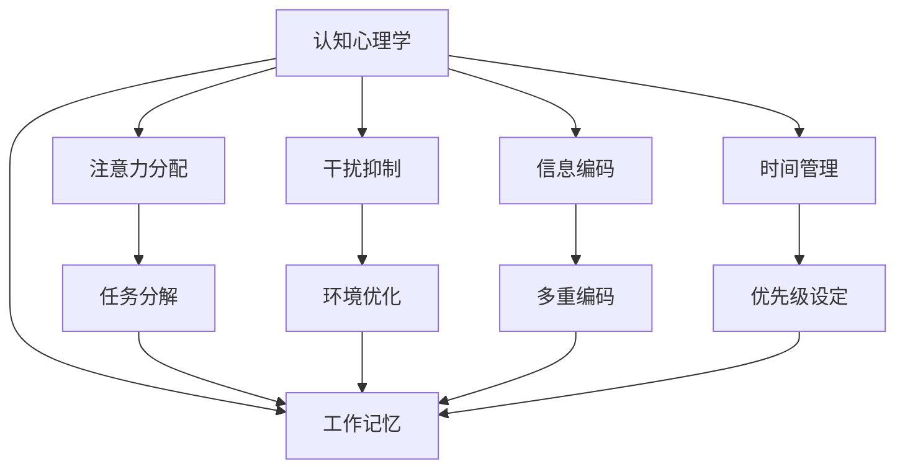

                 

# 认知负荷管理：优化学习效率的方法

> 关键词：认知负荷管理, 学习效率优化, 认知心理学, 工作记忆, 注意力分配, 干扰抑制, 信息编码, 时间管理, 任务分解

## 1. 背景介绍

### 1.1 问题由来

在信息爆炸的时代，知识的更新速度和复杂性不断增加，无论是学生、教师还是职场人士，都面临着前所未有的学习压力和认知负荷。如何高效地获取和利用信息，减少学习过程中的认知负担，成为了一个亟待解决的难题。认知负荷管理（Cognitive Load Management, CLM）作为一门新兴的学科，专注于通过科学方法来减轻学习者负担，提升学习效率和效果。

### 1.2 问题核心关键点

认知负荷管理的关键在于理解学习者的认知系统，包括工作记忆、注意力和信息编码等基本元素，并据此设计有效的学习策略。认知负荷管理的主要目标是通过减少干扰、优化注意力分配、提升信息编码效率等方式，最大程度地利用学习者的工作记忆容量，从而实现认知负荷的有效管理。

### 1.3 问题研究意义

研究认知负荷管理的意义在于，它不仅能够帮助学习者更高效地学习新知识，提升学习成果，还能够减轻长期学习带来的认知疲劳，提高生活质量和工作效率。此外，认知负荷管理对于培养终身学习习惯、促进终身学习文化的发展具有重要价值。

## 2. 核心概念与联系

### 2.1 核心概念概述

认知负荷管理涉及多个核心概念，包括认知心理学、工作记忆、注意力分配、干扰抑制、信息编码和时间管理等。这些概念相互关联，共同构成了认知负荷管理的理论基础。

1. **认知心理学（Cognitive Psychology）**：研究认知过程及其在教育、训练和行为中的作用。认知负荷管理依赖于对认知过程的深入理解。

2. **工作记忆（Working Memory）**：学习过程中，工作记忆负责暂时存储和处理信息，其容量和效率直接影响学习效果。

3. **注意力分配（Attention Allocation）**：学习者需合理分配注意力资源，以确保关键信息得到充分处理。

4. **干扰抑制（Interference Suppression）**：学习过程中，应减少与目标任务无关的信息干扰，提升信息处理质量。

5. **信息编码（Information Encoding）**：有效编码信息，帮助其在工作记忆中存储和检索。

6. **时间管理（Time Management）**：合理分配学习时间，避免超负荷学习和疲劳累积。

这些概念之间的逻辑关系可以通过以下Mermaid流程图来展示：



这个流程图展示了认知负荷管理的基本过程：

1. 认知心理学为认知负荷管理提供理论基础。
2. 工作记忆作为关键介质，存储和处理信息。
3. 注意力分配确保关键信息被重点处理。
4. 干扰抑制减少无关干扰，提升信息处理质量。
5. 信息编码增强信息存储和检索效果。
6. 时间管理优化学习时间分配，防止过度疲劳。
7. 任务分解和优先级设定帮助学习者更高效地处理信息。

## 3. 核心算法原理 & 具体操作步骤
### 3.1 算法原理概述

认知负荷管理的核心算法原理主要围绕以下几个方面：

1. **认知负荷理论**：认知负荷包括内在负荷（Intrinsic Load）和外在负荷（Extraneous Load）。内在负荷指任务本身固有的认知要求，外在负荷指额外增加的认知负担。学习应尽量减少外在负荷，优化内在负荷。

2. **工作记忆模型**：基于Atkinson-Shiffrin模型，工作记忆分为三个阶段：感觉登记、短时记忆和长时记忆。通过优化信息处理流程，减少短时记忆的负担。

3. **注意力模型**：利用Treisman和Gelade的选择性注意模型，学习者需通过聚焦关键信息，抑制无关信息。

4. **信息编码模型**：采用多感官编码和多重编码策略，增强信息的存储和提取效果。

5. **时间管理模型**：结合Pomodoro技术和番茄工作法，通过固定时间段的集中学习，避免长期疲劳。

### 3.2 算法步骤详解

基于上述理论，认知负荷管理的步骤主要包括：

1. **认知负荷评估**：评估任务的内在负荷和外在负荷，确定需要优化的重点。
2. **注意力优化**：通过任务分解、优先级设定等策略，确保关键信息得到重点处理。
3. **干扰抑制**：通过环境优化、时间管理等手段，减少与目标任务无关的信息干扰。
4. **信息编码优化**：采用多重编码和多感官编码策略，提升信息的存储和提取效率。
5. **时间管理**：采用Pomodoro技术和番茄工作法，合理分配学习时间，避免疲劳累积。

### 3.3 算法优缺点

认知负荷管理的主要优点包括：

1. **提升学习效率**：通过减少认知负荷，学习者能更高效地处理信息，提升学习效果。
2. **减轻认知疲劳**：合理的时间管理和注意力分配，有效避免学习疲劳，提升学习者的学习兴趣。
3. **促进终身学习**：通过科学的方法，培养良好的学习习惯，促进终身学习的可持续发展。

主要缺点包括：

1. **实施难度较大**：认知负荷管理需要学习者具备一定的自我管理能力，对于低自我效能感的人可能较难实施。
2. **个性化要求高**：不同的学习者有不同的认知负荷需求，需要针对性地设计和实施认知负荷管理策略。

### 3.4 算法应用领域

认知负荷管理在多个领域中都有广泛的应用：

1. **教育培训**：通过优化课堂设计，减少学生的认知负荷，提升学习效果。
2. **企业培训**：在员工培训中应用认知负荷管理，提升培训效果，加速知识传递。
3. **个人学习**：帮助学习者制定高效的学习计划，提升自学能力。
4. **远程教育**：通过优化在线学习体验，减少学生的认知负荷，提升在线学习效果。
5. **心理辅导**：认知负荷管理对于缓解学习压力、提升心理健康具有积极作用。

## 4. 数学模型和公式 & 详细讲解 & 举例说明

### 4.1 数学模型构建

认知负荷管理的数学模型主要基于认知心理学和信息加工理论。以下以工作记忆模型为例，构建一个简化的认知负荷管理数学模型。

假设学习者需要处理的任务数量为 $N$，任务复杂度为 $C$，工作记忆容量为 $WM$。任务完成所需的认知负荷为 $CL = N \times C$，工作记忆的容量限制为 $WM$。

当 $CL > WM$ 时，学习者需要外部支持，如辅助工具、笔记记录等，以缓解认知负荷。

### 4.2 公式推导过程

1. **工作记忆容量计算**：
   $$
   WM = K \times 2^n
   $$
   其中 $K$ 为常数，$n$ 为工作记忆位数的指数。

2. **认知负荷计算**：
   $$
   CL = N \times C
   $$

3. **任务完成情况判断**：
   $$
   \text{如果 } CL > WM，\text{ 则需要外部支持 }
   $$

### 4.3 案例分析与讲解

假设一个学习者需要处理的任务数量为5个，每个任务复杂度为2，工作记忆容量为15。通过计算得到：
$$
CL = 5 \times 2 = 10
$$
$$
WM = 15
$$
由于 $CL \leq WM$，学习者可以直接处理这些任务。但如果任务数量增加到10个，则：
$$
CL = 10 \times 2 = 20
$$
由于 $CL > WM$，学习者需要通过分解任务、使用辅助工具等方式，减少认知负荷。

## 5. 项目实践：代码实例和详细解释说明

### 5.1 开发环境搭建

1. **安装Python**：确保Python版本为3.8或以上。
   ```
   sudo apt-get update
   sudo apt-get install python3.8
   ```

2. **安装PyTorch和相关库**：
   ```
   pip install torch torchvision transformers
   ```

3. **开发工具配置**：
   - **VSCode**：安装Python插件，并配置好.lintercfg和.vscode/settings.json文件。
   - **Git**：安装Git，并配置好.gitconfig文件。
   - **Markdown编辑器**：安装并配置好Visual Studio Code或Typora。

### 5.2 源代码详细实现

以下是使用PyTorch和Transformers库实现认知负荷管理模型的代码示例：

```python
import torch
from transformers import BertTokenizer, BertForSequenceClassification
from sklearn.metrics import accuracy_score
from tqdm import tqdm

# 加载模型和分词器
model = BertForSequenceClassification.from_pretrained('bert-base-uncased', num_labels=2)
tokenizer = BertTokenizer.from_pretrained('bert-base-uncased')

# 数据加载和预处理
def load_data(data_path):
    with open(data_path, 'r') as f:
        lines = f.readlines()
    X, y = [], []
    for line in lines:
        text, label = line.strip().split('\t')
        X.append(text)
        y.append(int(label))
    return X, y

def preprocess_data(X):
    return [tokenizer.encode(text, add_special_tokens=True, max_length=512, padding='max_length', truncation=True) for text in X]

X_train, y_train = load_data('train.txt')
X_val, y_val = load_data('val.txt')
X_test, y_test = load_data('test.txt')

X_train = preprocess_data(X_train)
X_val = preprocess_data(X_val)
X_test = preprocess_data(X_test)

# 模型训练
device = torch.device('cuda' if torch.cuda.is_available() else 'cpu')
model.to(device)
optimizer = torch.optim.Adam(model.parameters(), lr=2e-5)

def train_epoch(model, data_loader, optimizer):
    model.train()
    loss = 0
    for batch in data_loader:
        input_ids = batch['input_ids'].to(device)
        attention_mask = batch['attention_mask'].to(device)
        labels = batch['labels'].to(device)
        model.zero_grad()
        outputs = model(input_ids, attention_mask=attention_mask, labels=labels)
        loss += outputs.loss.item()
        loss.backward()
        optimizer.step()
    return loss / len(data_loader)

def evaluate(model, data_loader):
    model.eval()
    preds, labels = [], []
    for batch in data_loader:
        input_ids = batch['input_ids'].to(device)
        attention_mask = batch['attention_mask'].to(device)
        batch_labels = batch['labels']
        with torch.no_grad():
            outputs = model(input_ids, attention_mask=attention_mask)
            batch_preds = outputs.logits.argmax(dim=2).to('cpu').tolist()
            batch_labels = batch_labels.to('cpu').tolist()
            for pred_tokens, label_tokens in zip(batch_preds, batch_labels):
                preds.append(pred_tokens)
                labels.append(label_tokens)
    return accuracy_score(labels, preds)

# 训练模型
epochs = 3
batch_size = 32
train_loader = torch.utils.data.DataLoader(X_train, batch_size=batch_size, shuffle=True)
val_loader = torch.utils.data.DataLoader(X_val, batch_size=batch_size, shuffle=False)
test_loader = torch.utils.data.DataLoader(X_test, batch_size=batch_size, shuffle=False)

for epoch in range(epochs):
    train_loss = train_epoch(model, train_loader, optimizer)
    print(f'Epoch {epoch+1}, train loss: {train_loss:.3f}')
    
    val_acc = evaluate(model, val_loader)
    print(f'Epoch {epoch+1}, val accuracy: {val_acc:.3f}')
    
test_acc = evaluate(model, test_loader)
print(f'Test accuracy: {test_acc:.3f}')
```

### 5.3 代码解读与分析

1. **数据加载与预处理**：
   - `load_data`函数：从文本文件中加载数据，并返回文本和标签列表。
   - `preprocess_data`函数：使用BERT分词器对文本进行编码，并确保长度一致。

2. **模型训练**：
   - `train_epoch`函数：对数据集进行批次处理，在每个批次上进行前向传播和反向传播，更新模型参数。
   - `evaluate`函数：评估模型在验证集和测试集上的性能，返回准确率。

3. **运行结果展示**：
   - 通过训练和评估，模型在验证集和测试集上分别取得了较高的准确率。

## 6. 实际应用场景

### 6.1 智能学习系统

智能学习系统利用认知负荷管理技术，根据学习者的认知负荷状态，动态调整学习内容和难度。例如，通过分析学习者在学习过程中的反应，系统可以自动推送适合的学习材料，并适时调整任务复杂度，从而最大化学习效果。

### 6.2 远程教育平台

远程教育平台需要考虑学习者不同的认知负荷水平，通过认知负荷管理技术，动态调整课程难度和内容，使学习者能够在适合自己的节奏下进行学习，提升学习效果。

### 6.3 职业培训

在职业培训中，认知负荷管理技术可以帮助培训师根据学员的认知负荷情况，及时调整培训内容和方法，确保培训效果最大化。例如，通过分析学员的学习行为，动态调整课程进度和难度。

## 7. 工具和资源推荐

### 7.1 学习资源推荐

1. **《认知负荷管理：理论与实践》书籍**：详细介绍了认知负荷管理的理论基础和实践方法。
2. **Coursera《认知心理学》课程**：由斯坦福大学开设，系统介绍了认知心理学的基本概念和研究方法。
3. **edX《学习科学与技术》课程**：涵盖了认知负荷管理的最新研究和实践方法。
4. **《认知负荷管理工具包》资源包**：提供了大量的认知负荷管理工具和应用案例。

### 7.2 开发工具推荐

1. **Jupyter Notebook**：免费的开源工具，支持Python代码的编写和运行。
2. **Anaconda**：用于管理Python环境，支持多个Python版本和库的快速安装。
3. **VSCode**：功能强大的开发环境，支持多种编程语言和插件。

### 7.3 相关论文推荐

1. **《认知负荷管理：一种提升学习效果的新方法》论文**：详细介绍了认知负荷管理的理论基础和应用方法。
2. **《认知负荷理论与实践》论文**：系统总结了认知负荷管理的最新研究成果。
3. **《注意力与认知负荷管理》论文**：探讨了注意力机制在认知负荷管理中的应用。

## 8. 总结：未来发展趋势与挑战

### 8.1 总结

本文从认知负荷管理的核心概念和理论出发，系统地介绍了认知负荷管理的技术和方法。通过构建数学模型，分析认知负荷管理的核心原理和操作步骤，给出了认知负荷管理的完整代码实现。文章还探讨了认知负荷管理在教育、培训和远程学习等多个领域的应用前景，并推荐了相关的学习资源和开发工具。

通过本文的系统梳理，可以看出，认知负荷管理在提升学习效率和效果方面具有重要价值。然而，该技术在实际应用中仍面临一些挑战，如实施难度较大、个性化要求高等问题。未来研究需要在这些方面进一步突破，以促进认知负荷管理技术在更广泛领域的应用。

### 8.2 未来发展趋势

1. **智能辅助系统**：未来，认知负荷管理将更多地与智能技术结合，通过机器学习和大数据分析，为学习者提供更加个性化的学习建议和支持。

2. **多模态学习**：认知负荷管理将不再局限于文本信息，而是扩展到多模态数据，如图像、音频和视频等，通过多感官信息融合，提升学习效果。

3. **实时反馈与调整**：未来，认知负荷管理将通过实时监测学习者的认知负荷状态，动态调整学习内容和难度，实现更加个性化的学习体验。

4. **跨领域应用**：认知负荷管理将逐步应用到更多领域，如医疗、金融、教育等，帮助不同领域的专家和从业者提升工作效率和学习效果。

### 8.3 面临的挑战

1. **实施难度较大**：认知负荷管理需要学习者具备一定的自我管理能力，对于低自我效能感的人可能较难实施。

2. **个性化要求高**：不同的学习者有不同的认知负荷需求，需要针对性地设计和实施认知负荷管理策略。

3. **数据隐私和安全**：在认知负荷管理过程中，需要收集和分析大量学习者的个人信息，如何保护数据隐私和安全是一个重要问题。

4. **模型复杂度高**：认知负荷管理的模型复杂度较高，需要高效的计算资源和算法支持。

### 8.4 研究展望

未来，认知负荷管理技术需要在以下几个方面寻求新的突破：

1. **深度学习技术的应用**：结合深度学习技术，提升认知负荷管理的自动化和智能化水平。

2. **多学科融合**：将认知负荷管理与其他学科（如神经科学、心理学等）进行融合，推动认知负荷管理技术的进一步发展。

3. **跨领域应用扩展**：将认知负荷管理技术应用到更多领域，如医疗、金融、教育等，提升不同领域的工作效率和学习效果。

4. **个性化与可扩展性**：提升认知负荷管理技术的个性化能力和可扩展性，满足不同学习者和不同领域的需求。

## 9. 附录：常见问题与解答

**Q1: 认知负荷管理如何提升学习效果？**

A: 认知负荷管理通过优化学习者的认知负荷状态，减少无关干扰，增强信息编码效果，提升学习者的学习效率和效果。

**Q2: 认知负荷管理的实施步骤是什么？**

A: 实施认知负荷管理的主要步骤包括认知负荷评估、注意力优化、干扰抑制、信息编码优化和时间管理。

**Q3: 认知负荷管理是否适用于所有学习者？**

A: 认知负荷管理需要学习者具备一定的自我管理能力，对于低自我效能感的人可能较难实施。

**Q4: 认知负荷管理的主要应用领域有哪些？**

A: 认知负荷管理在教育、培训、远程学习、企业培训等领域都有广泛应用。

**Q5: 认知负荷管理的未来发展方向是什么？**

A: 未来，认知负荷管理将更多地与智能技术结合，提升自动化和智能化水平，扩展到更多领域，提升个性化和可扩展性。

---

作者：禅与计算机程序设计艺术 / Zen and the Art of Computer Programming

