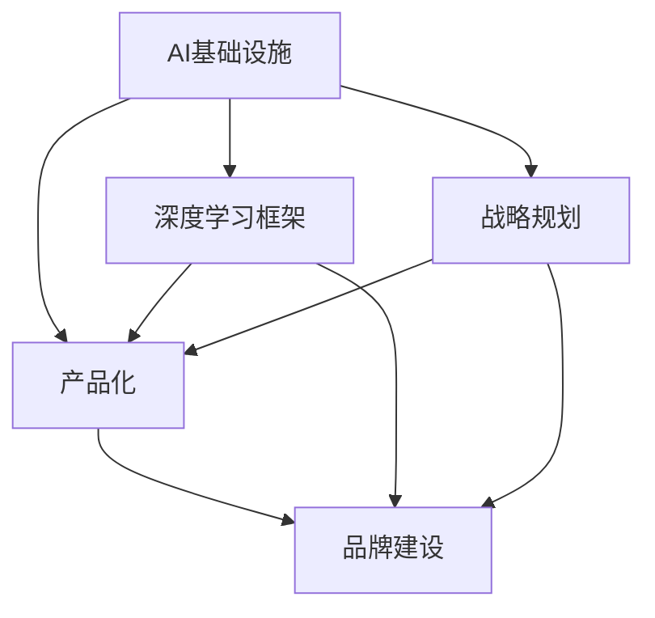
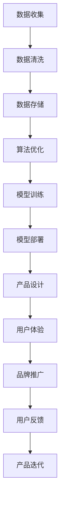

                 

# 讲好AI infra故事：贾扬清的策略，产品展示与品牌建设

> 关键词：AI基础设施，贾扬清，深度学习框架，产品化，品牌建设，战略规划

## 1. 背景介绍

### 1.1 问题由来

随着人工智能技术的迅猛发展，AI基础设施在各行各业的应用日益普及。从云计算到边缘计算，从大数据到机器学习，AI基础设施已经成为了推动科技创新和业务创新的关键因素。然而，构建高效的AI基础设施并非易事，需要深入理解其核心技术和策略，并在产品设计和品牌建设上做好规划。

贾扬清作为深度学习领域的佼佼者，曾在微软亚洲研究院、硅谷创业公司及BAT担任过核心角色，对AI基础设施有着深刻的理解和见解。他的实践经验为我们提供了宝贵的指导，帮助我们在AI基础设施的构建和推广中避免走弯路，从而实现快速、稳定、高效的AI产品化过程。

### 1.2 问题核心关键点

1. **AI基础设施的关键要素**：包括云计算、大数据、深度学习框架、模型训练与推理、智能分析与决策等。
2. **贾扬清的AI基础设施战略**：结合深度学习技术，通过产品化与品牌建设，构建高效、可靠、易用的AI基础设施。
3. **策略实施的难点**：包括技术复杂性、数据质量、算法优化、市场接受度、品牌影响力等。
4. **成功案例**：如Google的TensorFlow、Facebook的PyTorch等，展示其成功经验。

### 1.3 问题研究意义

掌握贾扬清的AI基础设施策略，不仅可以为技术研发提供指导，还能帮助企业快速实现AI产品的落地应用，提升市场竞争力和用户满意度。同时，通过科学的品牌建设，提升产品的品牌价值和市场认知度，从而实现可持续的发展。

## 2. 核心概念与联系

### 2.1 核心概念概述

为了更好地理解贾扬清的AI基础设施策略，我们将涉及以下几个关键概念：

1. **AI基础设施**：构建AI系统的底层基础设施，包括硬件、软件、数据和算法等。
2. **深度学习框架**：如TensorFlow、PyTorch、MXNet等，提供高效的深度学习算法实现。
3. **产品化**：将AI技术应用到实际产品中，提升用户体验和业务价值。
4. **品牌建设**：通过市场推广、品牌宣传和用户反馈，提升品牌认知度和影响力。
5. **战略规划**：制定AI基础设施构建的长期规划，确保技术领先和市场竞争力。

这些概念之间的联系和相互作用，构成了贾扬清AI基础设施战略的完整框架。下面通过Mermaid流程图来展示它们之间的逻辑关系：



### 2.2 核心概念原理和架构的 Mermaid 流程图

这里提供一个简单的Mermaid流程图来表示AI基础设施构建的基本流程：



这个流程图展示了从数据收集到产品迭代的整个流程，每个环节都紧密相关。数据收集是基础，数据清洗和存储是前提，算法优化和模型训练是核心，模型部署和产品设计是关键，用户体验和品牌推广是目标，用户反馈和产品迭代是保障。

## 3. 核心算法原理 & 具体操作步骤

### 3.1 算法原理概述

构建AI基础设施的核心在于选择合适的深度学习框架和算法，并进行高效的产品化与品牌建设。深度学习框架作为AI基础设施的核心组件，提供了强大的算法实现和高效的训练推理能力，是实现AI产品化的关键。

### 3.2 算法步骤详解

1. **选择合适的深度学习框架**：根据项目需求和资源条件，选择合适的深度学习框架。如Google的TensorFlow、Facebook的PyTorch等，每个框架都有其独特的优势和适用场景。
2. **数据准备与预处理**：收集和处理数据，确保数据质量和多样性，使用数据增强和清洗技术提升数据质量。
3. **模型设计与优化**：根据项目需求设计合适的模型架构，使用正则化、Dropout、Batch Normalization等技术进行模型优化。
4. **训练与推理**：使用分布式训练技术提升训练效率，使用优化算法和硬件加速提升推理速度。
5. **产品设计**：根据用户需求设计友好的产品界面，集成AI模型并提供易于使用的API。
6. **品牌推广**：通过市场推广、品牌宣传和用户反馈提升品牌认知度和影响力。

### 3.3 算法优缺点

**优点**：
1. **高效算法实现**：深度学习框架提供了高效的算法实现，能够快速实现复杂模型的训练和推理。
2. **灵活性高**：深度学习框架支持多种算法和模型架构，可以根据项目需求灵活调整。
3. **社区支持**：主流深度学习框架通常拥有庞大的社区支持，可以快速解决技术问题。

**缺点**：
1. **复杂度高**：深度学习模型的训练和优化过程复杂，需要丰富的经验和知识。
2. **数据依赖**：深度学习模型的性能高度依赖于数据质量，数据准备和清洗工作量大。
3. **资源消耗大**：深度学习模型通常需要大量的计算资源和存储空间，成本较高。

### 3.4 算法应用领域

深度学习框架和AI基础设施在多个领域得到了广泛应用，包括但不限于：

1. **自然语言处理(NLP)**：如情感分析、机器翻译、文本生成等。
2. **计算机视觉(CV)**：如图像识别、目标检测、图像生成等。
3. **语音识别与生成**：如语音识别、语音合成、情感语音生成等。
4. **推荐系统**：如电商平台推荐、广告投放优化等。
5. **医疗健康**：如疾病诊断、治疗方案优化等。
6. **金融服务**：如信用评估、风险管理、欺诈检测等。
7. **智能制造**：如质量检测、设备维护、供应链优化等。

这些应用领域展示了深度学习框架和AI基础设施的强大潜力和广泛适用性。

## 4. 数学模型和公式 & 详细讲解 & 举例说明

### 4.1 数学模型构建

这里我们以一个简单的二分类问题为例，展示如何在深度学习框架中进行模型构建和训练。

假设我们的目标是训练一个二分类模型，将输入的特征向量 $x$ 分类为类别 $y \in \{0, 1\}$。我们的目标是最小化交叉熵损失函数：

$$
\mathcal{L} = -\frac{1}{N}\sum_{i=1}^N [y_i \log \hat{y}_i + (1-y_i) \log (1-\hat{y}_i)]
$$

其中 $\hat{y}_i = \sigma(z(x_i))$ 是模型的输出，$\sigma(z(x_i)) = \frac{1}{1+\exp(-z(x_i))}$ 是Sigmoid函数，$z(x_i) = w^T \cdot x_i + b$ 是线性分类器的预测函数，$w$ 和 $b$ 是模型的权重和偏置。

### 4.2 公式推导过程

对于二分类问题，我们可以使用梯度下降算法来最小化交叉熵损失函数。设学习率为 $\eta$，则每次迭代的更新公式为：

$$
w^{t+1} = w^t - \eta \nabla_{w}\mathcal{L}
$$

其中 $\nabla_{w}\mathcal{L} = -\frac{1}{N}\sum_{i=1}^N (y_i - \hat{y}_i)(x_i) \cdot \sigma(z(x_i))(1-\sigma(z(x_i)))$。

### 4.3 案例分析与讲解

我们可以使用TensorFlow框架来实现上述模型的训练和推理。下面是一个简单的代码实现：

```python
import tensorflow as tf
from sklearn.datasets import make_classification
from sklearn.model_selection import train_test_split
import numpy as np

# 生成随机数据
X, y = make_classification(n_samples=1000, n_features=10, random_state=42)

# 划分训练集和测试集
X_train, X_test, y_train, y_test = train_test_split(X, y, test_size=0.2, random_state=42)

# 定义模型
model = tf.keras.Sequential([
    tf.keras.layers.Dense(1, activation='sigmoid', input_shape=(10,))
])

# 编译模型
model.compile(optimizer='adam', loss='binary_crossentropy', metrics=['accuracy'])

# 训练模型
model.fit(X_train, y_train, epochs=10, batch_size=32, validation_data=(X_test, y_test))

# 评估模型
model.evaluate(X_test, y_test)
```

在这个例子中，我们使用了TensorFlow的Keras API来构建和训练二分类模型。通过设置不同的超参数，如学习率、批大小、迭代轮数等，可以调整模型的性能。

## 5. 项目实践：代码实例和详细解释说明

### 5.1 开发环境搭建

在使用深度学习框架进行AI产品开发时，开发环境搭建是第一步。以下是一个简单的开发环境搭建流程：

1. 安装Python和必要的依赖库，如TensorFlow、Keras、NumPy等。
2. 安装深度学习框架和相关工具，如PyTorch、MXNet、TensorBoard等。
3. 配置GPU/TPU资源，以便进行高效的模型训练和推理。

### 5.2 源代码详细实现

这里以TensorFlow框架为例，展示一个简单的文本分类模型的实现。

```python
import tensorflow as tf
from tensorflow.keras.layers import Embedding, LSTM, Dense
from tensorflow.keras.models import Sequential

# 构建模型
model = Sequential([
    Embedding(input_dim=10000, output_dim=128, input_length=100),
    LSTM(64, dropout=0.2, recurrent_dropout=0.2),
    Dense(1, activation='sigmoid')
])

# 编译模型
model.compile(optimizer='adam', loss='binary_crossentropy', metrics=['accuracy'])

# 训练模型
model.fit(X_train, y_train, epochs=10, batch_size=32, validation_data=(X_test, y_test))

# 评估模型
model.evaluate(X_test, y_test)
```

在这个例子中，我们使用了LSTM层来处理文本数据，使用Embedding层将文本转换为向量表示，最后使用全连接层进行二分类预测。通过调整超参数和模型结构，可以进一步提升模型的性能。

### 5.3 代码解读与分析

代码中的关键步骤如下：

1. 定义模型结构：使用Sequential API来定义模型，包括Embedding、LSTM和Dense层。
2. 编译模型：设置优化器、损失函数和评估指标。
3. 训练模型：使用fit方法进行模型训练，设置训练轮数和批大小。
4. 评估模型：使用evaluate方法评估模型性能。

## 6. 实际应用场景

### 6.1 智能客服系统

智能客服系统是深度学习框架在实际应用中的典型场景。通过构建AI基础设施，我们可以实现自然语言理解和生成，快速响应客户咨询，提升客户服务体验。

### 6.2 金融舆情监测

金融舆情监测需要实时监测市场舆论动向，及时应对负面信息传播。通过构建AI基础设施，我们可以实现情感分析和主题分类，快速识别和预警金融风险。

### 6.3 个性化推荐系统

个性化推荐系统是深度学习框架在电商和广告领域的重要应用。通过构建AI基础设施，我们可以实现高效的推荐模型，提升用户体验和业务价值。

### 6.4 未来应用展望

随着深度学习框架和AI基础设施的不断进步，未来将有更多领域受益于AI技术。我们可以期待AI在医疗健康、智能制造、智能家居等领域发挥更大作用。

## 7. 工具和资源推荐

### 7.1 学习资源推荐

以下是一些推荐的深度学习框架和学习资源：

1. TensorFlow官方文档：提供全面、详细的框架介绍和教程。
2. PyTorch官方文档：提供丰富的深度学习算法和模型实现。
3. Keras官方文档：提供简单易用的API接口，适合初学者入门。
4. Coursera深度学习课程：由深度学习专家Andrew Ng主讲，涵盖深度学习基础和实践。
5. 《深度学习》（Ian Goodfellow等）：经典教材，详细介绍了深度学习理论和技术。

### 7.2 开发工具推荐

以下是一些推荐的深度学习开发工具：

1. Jupyter Notebook：交互式编程环境，支持Python和深度学习框架。
2. Anaconda：Python环境管理和依赖管理工具。
3. PyTorch Lightning：快速构建深度学习模型的框架。
4. TensorBoard：可视化工具，实时监测模型训练状态。
5. TensorFlow Extended (TFX)：数据管道和模型部署平台。

### 7.3 相关论文推荐

以下是一些深度学习框架和AI基础设施的经典论文：

1. Google的TensorFlow：《TensorFlow: A System for Large-Scale Machine Learning》（2015）
2. Facebook的PyTorch：《Fastai: A library for prudent engineering of state-of-the-art deep learning models》（2018）
3. MXNet：《Efficient Scalable Deep Learning for Production》（2019）
4. Keras：《Keras: Deep Learning for Humans》（2015）

## 8. 总结：未来发展趋势与挑战

### 8.1 研究成果总结

深度学习框架和AI基础设施的发展取得了显著的进展，构建高效、可靠、易用的AI基础设施成为可能。贾扬清的策略为我们提供了宝贵的经验和指导，帮助我们在AI基础设施的构建和推广中取得成功。

### 8.2 未来发展趋势

未来，深度学习框架和AI基础设施将进一步发展，呈现出以下趋势：

1. **技术演进**：深度学习框架将不断迭代，提供更高效的算法和模型实现。
2. **应用拓展**：AI基础设施将广泛应用于更多领域，提升各行业的智能化水平。
3. **模型融合**：AI基础设施将融合多种技术，如计算机视觉、语音识别等，实现全栈智能化。
4. **数据融合**：AI基础设施将融合多源数据，提升模型的泛化能力和鲁棒性。
5. **边缘计算**：AI基础设施将向边缘计算方向发展，提升实时性和响应速度。

### 8.3 面临的挑战

尽管深度学习框架和AI基础设施取得了显著进展，但仍面临以下挑战：

1. **数据质量**：数据准备和清洗工作量大，数据质量难以保证。
2. **算法优化**：模型训练和优化过程复杂，需要丰富的经验和知识。
3. **资源消耗**：深度学习模型需要大量的计算资源和存储空间，成本较高。
4. **模型解释**：深度学习模型的解释性不足，难以解释其内部工作机制和决策逻辑。
5. **伦理问题**：AI基础设施在应用过程中可能面临伦理和道德问题，需要谨慎处理。

### 8.4 研究展望

未来的研究将在以下几个方向寻求突破：

1. **数据增强**：通过数据增强技术提升数据质量和多样性。
2. **模型压缩**：通过模型压缩技术降低计算资源和存储空间消耗。
3. **跨模态学习**：融合多种模态数据，提升模型的泛化能力和鲁棒性。
4. **边缘计算**：提升边缘计算能力和实时性，满足边缘设备的需求。
5. **模型解释**：提升深度学习模型的解释性和可解释性。
6. **伦理研究**：研究AI基础设施在应用中的伦理和道德问题，确保技术安全可靠。

## 9. 附录：常见问题与解答

### 常见问题与解答

**Q1: 如何选择适合自己的深度学习框架？**

A: 选择深度学习框架需要考虑项目需求、资源条件和社区支持。TensorFlow适用于大规模分布式训练，PyTorch适用于快速原型开发和研究，Keras则适合初学者入门。

**Q2: 深度学习模型如何处理输入数据？**

A: 深度学习模型通常使用TensorFlow、PyTorch等框架的API来处理输入数据，包括数据预处理、特征提取、归一化等步骤。

**Q3: 深度学习模型如何优化？**

A: 深度学习模型的优化通常包括超参数调整、正则化、Dropout、Batch Normalization等技术。使用TensorBoard等可视化工具可以帮助优化模型。

**Q4: 如何评估深度学习模型的性能？**

A: 深度学习模型的评估通常使用准确率、精确率、召回率、F1-score等指标，结合混淆矩阵、ROC曲线等可视化工具进行综合评估。

**Q5: 如何部署深度学习模型？**

A: 深度学习模型的部署通常包括模型训练、推理引擎、API接口等环节。使用TensorFlow Extended (TFX)等工具可以简化模型部署过程。

通过以上系统性介绍和深入分析，我们可以更好地理解贾扬清的AI基础设施策略，并应用于实际项目中。通过持续学习和实践，我们可以不断提升深度学习框架和AI基础设施的开发水平，推动AI技术在各行各业的应用和发展。

