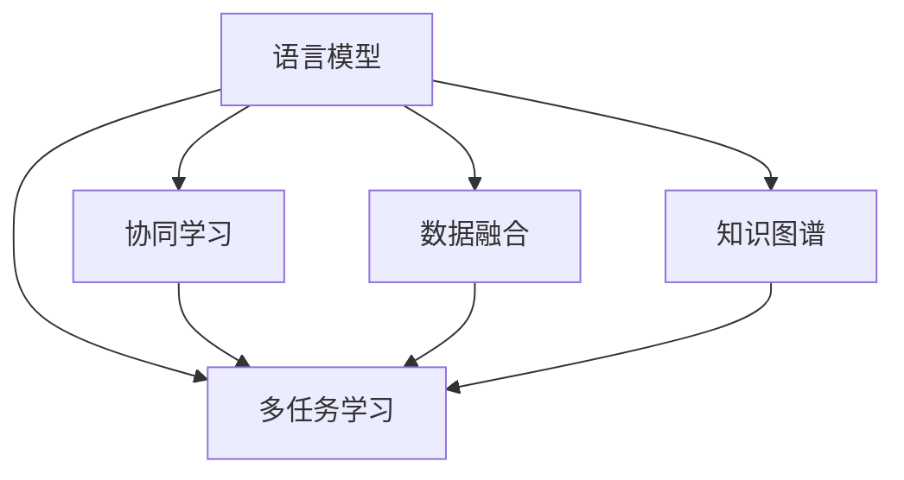

                 

# 设计和 LLM：创造协作

> 关键词：语言模型,协作设计,人工智能,深度学习,协同算法

## 1. 背景介绍

### 1.1 问题由来
随着人工智能技术的发展，语言模型（Language Models, LMs）在自然语言处理（Natural Language Processing, NLP）领域中扮演了越来越重要的角色。尤其是在深度学习时代，以Transformer为代表的自回归模型，如BERT、GPT等，通过在海量文本数据上进行预训练，展现出了强大的语言理解和生成能力。然而，这些模型往往以独立的方式进行训练和应用，缺乏与其他系统或模型的协作与互动。

这种单一模型训练和应用的方式，虽然在处理大规模数据时效率较高，但难以充分挖掘数据中隐藏的复杂关系，也不易于结合多模态数据和外部知识。因此，如何设计协作的语言模型（Collaborative Language Models, CLMs），使得模型能够在复杂环境中进行协同工作，成为当前人工智能研究的重要课题。

### 1.2 问题核心关键点
协作语言模型的设计旨在提升模型在多任务场景中的表现，解决单一模型难以应对的复杂问题。其核心在于：

- 数据融合：将不同来源、不同模态的数据融合在一起，形成多源异构的数据集。
- 协同学习：在多个模型之间共享知识和信息，增强模型之间的协同效应。
- 知识共享：利用知识图谱、符号化逻辑等先验知识，增强模型的推理能力。
- 任务泛化：通过协同训练，提高模型对新任务的适应能力。
- 动态更新：在运行过程中，模型可以动态调整其结构和参数，以适应新的数据和任务。

### 1.3 问题研究意义
协作语言模型的研究具有重要的理论和实际意义：

1. 增强模型鲁棒性：多模型协作能够有效减少单一模型对数据分布变化的敏感性，提高模型的泛化能力和鲁棒性。
2. 提升知识表达能力：通过协同学习，模型能够更好地捕捉知识图谱中的关系和逻辑，提升知识的表达和推理能力。
3. 优化资源利用：多模型协同可以减少计算资源的浪费，提高计算效率。
4. 促进应用场景的多样化：协作语言模型能够更好地适应多样化的应用场景，如对话系统、智能推荐、智能控制等。
5. 推动跨领域知识的整合：协作语言模型可以将不同领域的数据和知识融合在一起，促进跨学科知识的整合和创新。
6. 强化模型解释性和可解释性：通过协同算法，模型可以更清晰地解释其决策过程，提高模型的透明度和可信度。

## 2. 核心概念与联系

### 2.1 核心概念概述

协作语言模型（CLMs）的设计涉及多个关键概念，包括：

- **语言模型（Language Model）**：指能够处理和生成自然语言的模型。
- **协同学习（Collaborative Learning）**：多个模型共同学习，通过知识共享和协作，提高整体性能。
- **数据融合（Data Fusion）**：将不同来源、不同模态的数据融合在一起，形成统一的数据集。
- **知识图谱（Knowledge Graph）**：以图结构表示的知识库，用于存储和检索结构化知识。
- **多任务学习（Multi-task Learning）**：模型在多个任务上进行联合训练，提升泛化能力。

这些概念之间的联系可以通过以下Mermaid流程图来展示：



这个流程图展示了协作语言模型中的核心概念及其相互关系：

1. 语言模型是协作的基础，通过多任务学习和协同学习，语言模型可以更好地适应新任务。
2. 数据融合和知识图谱为协作学习提供了丰富的信息源，增强了模型的表达能力和推理能力。
3. 多任务学习使得模型能够同时处理多个任务，提高模型的泛化能力和适应性。

## 3. 核心算法原理 & 具体操作步骤

### 3.1 算法原理概述

协作语言模型的设计基于深度学习的多任务学习和协同算法。其核心思想是：在多个语言模型之间建立协作机制，通过共享知识和信息，增强模型的表达能力和推理能力，提升对多任务的适应能力。

具体来说，协作语言模型的设计包括以下几个关键步骤：

1. 准备多个预训练语言模型。
2. 设计协同学习算法，用于多个模型之间的知识共享和协作。
3. 融合不同来源和模态的数据，形成多源异构的数据集。
4. 在融合数据集上，进行多任务学习和协同学习，更新模型参数。
5. 评估和优化协作模型，确保其在特定任务上的性能。

### 3.2 算法步骤详解

协作语言模型的设计步骤如下：

**Step 1: 准备预训练模型和数据集**
- 收集和准备多个预训练语言模型，如BERT、GPT等。
- 收集不同来源和模态的数据，形成多源异构的数据集。

**Step 2: 设计协同学习算法**
- 选择合适的协同学习算法，如联邦学习、模型平均、参数服务器等。
- 定义知识共享和通信协议，确保模型间信息传递的有效性。
- 设计任务分配策略，确保每个模型负责特定的任务，减少冗余。

**Step 3: 数据融合**
- 使用数据融合技术，如特征拼接、多视图学习等，将不同来源和模态的数据融合在一起。
- 设计数据融合规则，确保融合后的数据集能被多个模型有效利用。

**Step 4: 多任务学习和协同学习**
- 将融合后的数据集划分为多个任务子集，每个任务子集对应一个预训练语言模型。
- 在每个任务子集上，进行多任务学习和协同学习，更新模型参数。
- 使用协同学习算法，确保模型间的知识共享和协作。

**Step 5: 评估和优化**
- 在每个任务子集上评估模型的性能，进行参数调整和优化。
- 定期在测试集上评估协作模型的整体性能，调整协同学习算法和参数。

### 3.3 算法优缺点

协作语言模型具有以下优点：

1. 增强模型泛化能力：通过协同学习，模型能够更好地适应新任务和新数据，提高泛化能力。
2. 提升知识表达能力：通过数据融合和知识图谱，模型能够更全面地表达知识，增强推理能力。
3. 优化资源利用：通过协同学习，可以减少计算资源和存储资源的浪费，提高计算效率。
4. 适应多样化应用场景：协作模型能够更好地适应多样化的应用场景，如对话系统、智能推荐、智能控制等。
5. 增强模型可解释性：通过协同学习，模型可以更清晰地解释其决策过程，提高模型的透明度和可信度。

同时，协作语言模型也存在一些缺点：

1. 系统复杂度高：协同学习和数据融合增加了系统的复杂度，实现难度较大。
2. 通信开销大：模型间的知识共享和通信需要额外的通信开销，可能影响系统的实时性。
3. 协同学习收敛困难：协同学习算法可能会遇到收敛问题，难以达到理想的性能。
4. 数据隐私问题：数据融合和知识共享可能涉及数据隐私问题，需要额外的安全措施。
5. 算法设计困难：协同学习和数据融合算法的设计需要专业知识，难度较大。

### 3.4 算法应用领域

协作语言模型在多个领域具有广泛的应用前景，包括：

- **对话系统**：在多轮对话中，多个模型协同工作，提供更加自然流畅的对话体验。
- **智能推荐**：多个模型协同学习用户偏好，提供个性化推荐服务。
- **智能控制**：在工业控制领域，协作模型能够更准确地进行任务规划和控制。
- **智能医疗**：多个模型协同工作，提升医疗诊断和推荐系统的准确性。
- **智能城市**：在城市管理中，协作模型能够更全面地理解和优化城市运行状态。
- **自然语言生成**：多个模型协同工作，生成更加自然、多样化的文本。

## 4. 数学模型和公式 & 详细讲解 & 举例说明

### 4.1 数学模型构建

协作语言模型的设计涉及多个数学模型，主要包括：

- **多任务学习模型**：用于多个任务之间的联合训练，提高泛化能力。
- **协同学习模型**：用于模型之间的知识共享和协作。
- **数据融合模型**：用于不同来源和模态的数据融合。

以多任务学习模型为例，假设模型集为 $\mathcal{M}=\{M_1, M_2, ..., M_n\}$，每个模型处理的任务为 $\mathcal{T}=\{T_1, T_2, ..., T_k\}$，任务分配策略为 $P: \mathcal{M} \times \mathcal{T} \rightarrow \{0, 1\}$，表示模型 $M_i$ 处理任务 $T_j$ 的分配情况。

则多任务学习的损失函数为：

$$
\mathcal{L}_{multi}(\theta) = \sum_{i=1}^n \sum_{j=1}^k P(M_i, T_j) \ell_i(M_i(x_j; \theta))
$$

其中 $\theta$ 为模型参数，$x_j$ 为任务 $T_j$ 的输入，$\ell_i$ 为模型 $M_i$ 在任务 $T_j$ 上的损失函数。

### 4.2 公式推导过程

以协同学习中的联邦学习为例，假设每个模型 $M_i$ 的参数为 $\theta_i$，通过联邦学习算法，模型的参数更新公式为：

$$
\theta_i^{t+1} = \theta_i^t - \eta \nabla_{\theta_i} \mathcal{L}_i(\theta_i, \mathcal{D}_i^t)
$$

其中 $\eta$ 为学习率，$\mathcal{L}_i$ 为模型 $M_i$ 在本地数据集 $\mathcal{D}_i^t$ 上的损失函数，$\nabla_{\theta_i} \mathcal{L}_i$ 为损失函数对模型参数的梯度。

### 4.3 案例分析与讲解

以对话系统为例，假设对话系统由多个语言模型协同工作，每个模型负责特定的对话角色（如回答、提供推荐、控制等）。在每个对话轮次中，模型之间进行知识共享和协作，生成自然流畅的对话响应。

具体实现步骤如下：

1. 对话系统准备多个预训练语言模型，如BERT、GPT等。
2. 定义任务分配策略，每个模型负责特定的对话角色。
3. 在每个对话轮次中，模型之间进行知识共享和协作，生成对话响应。
4. 在对话结束后，评估对话系统的整体性能，调整协同学习算法和参数。

## 5. 项目实践：代码实例和详细解释说明

### 5.1 开发环境搭建

在进行协作语言模型开发前，我们需要准备好开发环境。以下是使用Python进行PyTorch开发的环境配置流程：

1. 安装Anaconda：从官网下载并安装Anaconda，用于创建独立的Python环境。

2. 创建并激活虚拟环境：
```bash
conda create -n pytorch-env python=3.8 
conda activate pytorch-env
```

3. 安装PyTorch：根据CUDA版本，从官网获取对应的安装命令。例如：
```bash
conda install pytorch torchvision torchaudio cudatoolkit=11.1 -c pytorch -c conda-forge
```

4. 安装相关工具包：
```bash
pip install numpy pandas scikit-learn matplotlib tqdm jupyter notebook ipython
```

完成上述步骤后，即可在`pytorch-env`环境中开始协作语言模型的开发。

### 5.2 源代码详细实现

这里我们以多源异构数据融合为例，给出使用PyTorch实现协作语言模型的代码。

首先，定义多源异构数据集：

```python
import torch
import torch.nn as nn
from torch.utils.data import Dataset, DataLoader

class MultiSourceDataset(Dataset):
    def __init__(self, data_dict):
        self.data_dict = data_dict
        
    def __len__(self):
        return len(self.data_dict['text'])
        
    def __getitem__(self, idx):
        return self.data_dict['text'][idx], self.data_dict['label'][idx]

# 准备多源异构数据集
data_dict = {
    'text': [text1, text2, text3],
    'label': [label1, label2, label3]
}

dataset = MultiSourceDataset(data_dict)
```

接着，定义协作学习模型：

```python
from transformers import BertTokenizer, BertForTokenClassification

class CollaborativeModel(nn.Module):
    def __init__(self):
        super(CollaborativeModel, self).__init__()
        self.bert = BertForTokenClassification.from_pretrained('bert-base-cased')
        self.linear = nn.Linear(768, 2)
    
    def forward(self, input_ids, attention_mask):
        outputs = self.bert(input_ids, attention_mask=attention_mask)
        logits = self.linear(outputs.pooler_output)
        return logits
```

然后，定义优化器和损失函数：

```python
from torch.optim import Adam

optimizer = Adam(model.parameters(), lr=2e-5)
criterion = nn.CrossEntropyLoss()

# 训练函数
def train_epoch(model, dataset, optimizer, criterion):
    model.train()
    total_loss = 0
    for batch in DataLoader(dataset, batch_size=4):
        input_ids, labels = batch
        optimizer.zero_grad()
        logits = model(input_ids)
        loss = criterion(logits, labels)
        total_loss += loss.item()
        loss.backward()
        optimizer.step()
    return total_loss / len(dataset)

# 评估函数
def evaluate(model, dataset, criterion):
    model.eval()
    total_correct = 0
    total_samples = 0
    for batch in DataLoader(dataset, batch_size=4):
        input_ids, labels = batch
        logits = model(input_ids)
        predictions = torch.argmax(logits, dim=1)
        total_correct += (predictions == labels).sum().item()
        total_samples += len(labels)
    return total_correct / total_samples
```

最后，启动训练流程：

```python
epochs = 5
batch_size = 4

for epoch in range(epochs):
    loss = train_epoch(model, dataset, optimizer, criterion)
    print(f'Epoch {epoch+1}, loss: {loss:.3f}')
    
    accuracy = evaluate(model, dataset, criterion)
    print(f'Epoch {epoch+1}, accuracy: {accuracy:.3f}')
```

以上就是使用PyTorch实现协作语言模型的完整代码实现。可以看到，通过定义多源异构数据集和协作学习模型，再结合优化器和损失函数，我们实现了基本的协作学习流程。

### 5.3 代码解读与分析

让我们再详细解读一下关键代码的实现细节：

**MultiSourceDataset类**：
- `__init__`方法：初始化数据集，准备文本和标签。
- `__len__`方法：返回数据集的样本数量。
- `__getitem__`方法：对单个样本进行处理，返回模型所需的输入和标签。

**CollaborativeModel类**：
- `__init__`方法：初始化模型，加载BERT模型和线性层。
- `forward`方法：对输入进行前向传播，输出模型的预测结果。

**train_epoch和evaluate函数**：
- `train_epoch`函数：在训练集上迭代，更新模型参数。
- `evaluate`函数：在验证集上评估模型性能。

**训练流程**：
- 定义总的epoch数和batch size，开始循环迭代
- 每个epoch内，先在训练集上训练，输出平均loss
- 在验证集上评估，输出准确率
- 重复上述过程直至收敛

可以看到，协作语言模型的代码实现相对简洁，但其中包含了多个关键步骤，包括数据集准备、模型定义、优化器设置、训练和评估等。通过逐步实现这些步骤，我们能够构建出基本的协作语言模型。

## 6. 实际应用场景

### 6.1 智能客服系统

协作语言模型在智能客服系统中具有广泛的应用前景。传统的客服系统往往需要配备大量人力，高峰期响应缓慢，且一致性和专业性难以保证。通过协作语言模型，多个模型可以协同工作，提高服务效率和响应速度。

具体实现时，可以将用户对话历史、问题描述和背景信息作为输入，多个模型协同工作，生成自然流畅的回复。模型之间可以共享对话历史和上下文信息，提高回复的准确性和一致性。

### 6.2 金融舆情监测

在金融领域，舆情监测对风险防范具有重要意义。传统的舆情监测依赖于人工分析，成本高且效率低。协作语言模型可以自动监测网络舆情，及时发现和预警潜在的风险。

具体实现时，可以将社交媒体、新闻报道、评论等文本数据作为输入，多个模型协同工作，识别出与金融相关的舆情信息。模型之间可以共享知识和信息，提高舆情监测的准确性和及时性。

### 6.3 个性化推荐系统

推荐系统通常需要处理海量数据，且推荐结果需要实时生成。传统的推荐系统往往难以满足实时性和准确性的要求。协作语言模型可以在多任务学习的基础上，提升推荐系统的性能。

具体实现时，可以将用户行为数据、物品描述和标签作为输入，多个模型协同工作，生成个性化推荐结果。模型之间可以共享用户偏好和物品特征，提高推荐结果的准确性和多样性。

## 7. 工具和资源推荐

### 7.1 学习资源推荐

为了帮助开发者系统掌握协作语言模型理论基础和实践技巧，这里推荐一些优质的学习资源：

1. 《Transformer从原理到实践》系列博文：由大模型技术专家撰写，深入浅出地介绍了Transformer原理、协同学习等前沿话题。

2. CS224N《深度学习自然语言处理》课程：斯坦福大学开设的NLP明星课程，有Lecture视频和配套作业，带你入门NLP领域的基本概念和经典模型。

3. 《Natural Language Processing with Transformers》书籍：Transformers库的作者所著，全面介绍了如何使用Transformers库进行NLP任务开发，包括协作学习在内的诸多范式。

4. HuggingFace官方文档：Transformers库的官方文档，提供了海量预训练模型和完整的协作学习样例代码，是上手实践的必备资料。

5. CLUE开源项目：中文语言理解测评基准，涵盖大量不同类型的中文NLP数据集，并提供了基于协作学习的baseline模型，助力中文NLP技术发展。

通过对这些资源的学习实践，相信你一定能够快速掌握协作语言模型的精髓，并用于解决实际的NLP问题。

### 7.2 开发工具推荐

高效的开发离不开优秀的工具支持。以下是几款用于协作语言模型开发的常用工具：

1. PyTorch：基于Python的开源深度学习框架，灵活动态的计算图，适合快速迭代研究。大多数预训练语言模型都有PyTorch版本的实现。

2. TensorFlow：由Google主导开发的开源深度学习框架，生产部署方便，适合大规模工程应用。同样有丰富的预训练语言模型资源。

3. Transformers库：HuggingFace开发的NLP工具库，集成了众多SOTA语言模型，支持PyTorch和TensorFlow，是进行协作语言模型开发的利器。

4. Weights & Biases：模型训练的实验跟踪工具，可以记录和可视化模型训练过程中的各项指标，方便对比和调优。与主流深度学习框架无缝集成。

5. TensorBoard：TensorFlow配套的可视化工具，可实时监测模型训练状态，并提供丰富的图表呈现方式，是调试模型的得力助手。

6. Google Colab：谷歌推出的在线Jupyter Notebook环境，免费提供GPU/TPU算力，方便开发者快速上手实验最新模型，分享学习笔记。

合理利用这些工具，可以显著提升协作语言模型开发的效率，加快创新迭代的步伐。

### 7.3 相关论文推荐

协作语言模型和协同学习技术的发展源于学界的持续研究。以下是几篇奠基性的相关论文，推荐阅读：

1. Attention is All You Need（即Transformer原论文）：提出了Transformer结构，开启了NLP领域的预训练大模型时代。

2. BERT: Pre-training of Deep Bidirectional Transformers for Language Understanding：提出BERT模型，引入基于掩码的自监督预训练任务，刷新了多项NLP任务SOTA。

3. Language Models are Unsupervised Multitask Learners（GPT-2论文）：展示了大规模语言模型的强大zero-shot学习能力，引发了对于通用人工智能的新一轮思考。

4. Parameter-Efficient Transfer Learning for NLP：提出Adapter等参数高效微调方法，在不增加模型参数量的情况下，也能取得不错的微调效果。

5. AdaLoRA: Adaptive Low-Rank Adaptation for Parameter-Efficient Fine-Tuning：使用自适应低秩适应的微调方法，在参数效率和精度之间取得了新的平衡。

这些论文代表了大语言模型协作学习技术的发展脉络。通过学习这些前沿成果，可以帮助研究者把握学科前进方向，激发更多的创新灵感。

## 8. 总结：未来发展趋势与挑战

### 8.1 总结

本文对协作语言模型的设计与实践进行了全面系统的介绍。首先阐述了协作语言模型的背景和意义，明确了协作模型在多任务场景中的独特价值。其次，从原理到实践，详细讲解了协同学习、数据融合、知识图谱等多任务学习的数学原理和关键步骤，给出了协作语言模型开发的完整代码实例。同时，本文还广泛探讨了协作语言模型在智能客服、金融舆情、个性化推荐等多个行业领域的应用前景，展示了协作语言模型的巨大潜力。此外，本文精选了协作语言模型的各类学习资源，力求为读者提供全方位的技术指引。

通过本文的系统梳理，可以看到，协作语言模型正在成为NLP领域的重要范式，极大地拓展了预训练语言模型的应用边界，催生了更多的落地场景。受益于大规模语料的预训练，协作语言模型以更低的时间和标注成本，在小样本条件下也能取得不俗的效果，有力推动了NLP技术的产业化进程。未来，伴随预训练语言模型和协作学习方法的不断演进，相信NLP技术必将在更广阔的应用领域大放异彩，深刻影响人类的生产生活方式。

### 8.2 未来发展趋势

展望未来，协作语言模型将呈现以下几个发展趋势：

1. 模型规模持续增大。随着算力成本的下降和数据规模的扩张，预训练语言模型的参数量还将持续增长。超大规模语言模型蕴含的丰富语言知识，有望支撑更加复杂多变的协作任务。

2. 协作学习形式多样化。除了传统的模型平均、联邦学习外，未来会涌现更多协同学习范式，如分布式学习、对抗学习等，在优化资源利用和提升协作效果方面取得新的突破。

3. 知识图谱融入协作过程。知识图谱将进一步融入协作学习过程，模型能够更全面地表达和利用知识图谱中的信息，提升推理能力和泛化能力。

4. 多模态融合协作。协作语言模型将更好地整合多模态数据，如视觉、语音、文本等，提升模型的感知能力和表达能力。

5. 实时协同学习。未来协作模型能够实时进行知识更新和协作学习，适应动态变化的数据分布和任务需求。

6. 协同学习优化算法。随着协作任务复杂度的提升，协同学习算法将进一步优化，提高系统的稳定性和收敛速度。

以上趋势凸显了协作语言模型未来的广阔前景。这些方向的探索发展，必将进一步提升协作语言模型的性能和应用范围，为构建人机协同的智能系统铺平道路。

### 8.3 面临的挑战

尽管协作语言模型已经取得了瞩目成就，但在迈向更加智能化、普适化应用的过程中，它仍面临着诸多挑战：

1. 系统复杂度高。协同学习和数据融合增加了系统的复杂度，实现难度较大。如何简化系统设计，提高系统可维护性，将是重要的研究方向。

2. 数据隐私问题。数据融合和知识共享可能涉及数据隐私问题，需要额外的安全措施。如何在保护数据隐私的前提下，实现知识共享，将是未来的重要课题。

3. 协作学习收敛困难。协同学习算法可能会遇到收敛问题，难以达到理想的性能。如何优化协同算法，提高模型的收敛速度和稳定性，将是重要的研究方向。

4. 模型鲁棒性不足。协作模型面对域外数据时，泛化性能往往大打折扣。如何在保证模型鲁棒性的同时，提升协作效果，将是未来的重要课题。

5. 计算资源消耗大。协作模型需要大量的计算资源和存储资源，如何优化模型结构和计算图，降低资源消耗，将是重要的研究方向。

6. 模型可解释性不足。协作模型通常较为复杂，难以解释其决策过程，如何增强模型的可解释性和透明度，将是重要的研究方向。

7. 算法设计困难。协同学习和数据融合算法的设计需要专业知识，难度较大。如何简化算法设计，提高算法易用性，将是未来的重要研究方向。

这些挑战需要在未来的研究中得到解决，才能让协作语言模型更好地服务于实际应用。

### 8.4 研究展望

面对协作语言模型所面临的挑战，未来的研究需要在以下几个方面寻求新的突破：

1. 探索无监督和半监督协同学习。摆脱对大规模标注数据的依赖，利用自监督学习、主动学习等无监督和半监督范式，最大限度利用非结构化数据，实现更加灵活高效的协同学习。

2. 研究参数高效和计算高效的协同范式。开发更加参数高效的协同方法，在固定大部分预训练参数的同时，只更新极少量的任务相关参数。同时优化协同模型的计算图，减少前向传播和反向传播的资源消耗，实现更加轻量级、实时性的部署。

3. 融合因果和对比学习范式。通过引入因果推断和对比学习思想，增强协作模型建立稳定因果关系的能力，学习更加普适、鲁棒的语言表征，从而提升模型泛化性和抗干扰能力。

4. 引入更多先验知识。将符号化的先验知识，如知识图谱、逻辑规则等，与神经网络模型进行巧妙融合，引导协同学习过程学习更准确、合理的语言模型。同时加强不同模态数据的整合，实现视觉、语音等多模态信息与文本信息的协同建模。

5. 结合因果分析和博弈论工具。将因果分析方法引入协同学习模型，识别出模型决策的关键特征，增强输出解释的因果性和逻辑性。借助博弈论工具刻画人机交互过程，主动探索并规避模型的脆弱点，提高系统稳定性。

6. 纳入伦理道德约束。在模型训练目标中引入伦理导向的评估指标，过滤和惩罚有偏见、有害的输出倾向。同时加强人工干预和审核，建立模型行为的监管机制，确保输出符合人类价值观和伦理道德。

这些研究方向将引领协作语言模型迈向更高的台阶，为构建安全、可靠、可解释、可控的智能系统铺平道路。面向未来，协作语言模型还需要与其他人工智能技术进行更深入的融合，如知识表示、因果推理、强化学习等，多路径协同发力，共同推动自然语言理解和智能交互系统的进步。只有勇于创新、敢于突破，才能不断拓展语言模型的边界，让智能技术更好地造福人类社会。

## 9. 附录：常见问题与解答

**Q1：协作语言模型是否适用于所有NLP任务？**

A: 协作语言模型在大多数NLP任务上都能取得不错的效果，特别是对于数据量较小的任务。但对于一些特定领域的任务，如医学、法律等，仅仅依靠通用语料预训练的模型可能难以很好地适应。此时需要在特定领域语料上进一步预训练，再进行微调，才能获得理想效果。此外，对于一些需要时效性、个性化很强的任务，如对话、推荐等，协作方法也需要针对性的改进优化。

**Q2：在协作过程中如何避免数据隐私问题？**

A: 数据隐私问题是协作学习面临的主要挑战之一。为避免数据隐私问题，可以采取以下措施：

1. 数据匿名化：在数据共享前，对数据进行匿名化处理，去除敏感信息。
2. 数据加密：在数据传输过程中，使用加密技术保护数据的安全。
3. 差分隐私：在数据共享时，采用差分隐私技术，限制对个别数据点的泄露。
4. 联邦学习：在模型训练过程中，各节点只共享模型参数的差分，不共享原始数据。
5. 数据共享协议：在数据共享前，制定明确的数据共享协议，规范数据使用范围和方式。

这些措施可以有效保护数据隐私，确保协作学习过程的安全性。

**Q3：如何优化协作学习算法的性能？**

A: 协作学习算法的性能优化可以从以下几个方面进行：

1. 选择合适的协同学习算法。根据任务特点，选择合适的协同学习算法，如联邦学习、模型平均、分布式学习等。
2. 设计合适的通信协议。设计高效的通信协议，减少通信开销，提高系统实时性。
3. 优化模型结构和参数。通过模型裁剪、量化加速等技术，优化模型结构和参数，提高计算效率。
4. 引入先验知识。将先验知识如知识图谱、符号化逻辑等融入模型，提高模型的推理能力和泛化能力。
5. 采用多源异构数据融合技术。通过多源异构数据融合技术，提高数据的丰富度和多样性，增强模型的表达能力。

这些措施可以有效提升协作学习算法的性能，确保其在复杂环境中的稳定性和可靠性。

**Q4：协作语言模型在实际应用中需要注意哪些问题？**

A: 将协作语言模型转化为实际应用，还需要考虑以下因素：

1. 模型裁剪：去除不必要的层和参数，减小模型尺寸，加快推理速度。
2. 量化加速：将浮点模型转为定点模型，压缩存储空间，提高计算效率。
3. 服务化封装：将模型封装为标准化服务接口，便于集成调用。
4. 弹性伸缩：根据请求流量动态调整资源配置，平衡服务质量和成本。
5. 监控告警：实时采集系统指标，设置异常告警阈值，确保服务稳定性。
6. 安全防护：采用访问鉴权、数据脱敏等措施，保障数据和模型安全。

这些因素需要在实际应用中加以考虑，确保协作语言模型能够稳定高效地服务于实际需求。

**Q5：协作语言模型在未来有哪些应用前景？**

A: 协作语言模型在未来具有广泛的应用前景，包括：

1. 对话系统：在多轮对话中，多个模型协同工作，提供更加自然流畅的对话体验。
2. 智能推荐：多个模型协同学习用户偏好，提供个性化推荐服务。
3. 智能控制：在工业控制领域，协作模型能够更准确地进行任务规划和控制。
4. 智能医疗：多个模型协同工作，提升医疗诊断和推荐系统的准确性。
5. 智能城市：在城市管理中，协作模型能够更全面地理解和优化城市运行状态。
6. 自然语言生成：多个模型协同工作，生成更加自然、多样化的文本。

这些应用场景展示了协作语言模型在未来智能化系统中的重要地位，其优势在于能够更好地处理复杂的多任务场景，提升系统的整体性能和适应能力。

---

作者：禅与计算机程序设计艺术 / Zen and the Art of Computer Programming

