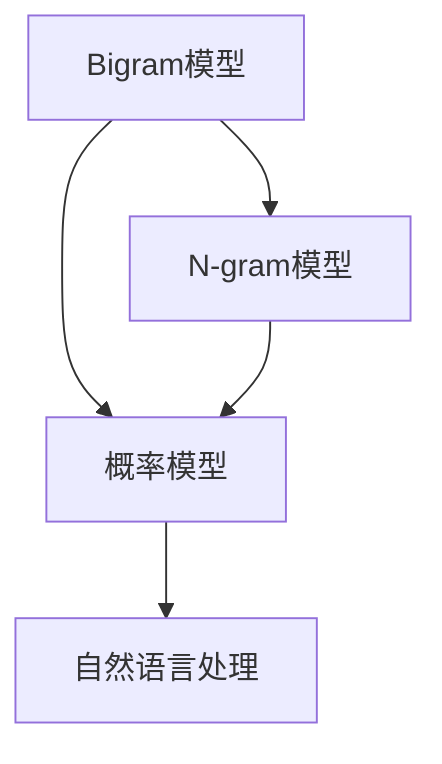

                 

# 语言建模进阶：Bigram 到 N-gram

> 关键词：语言建模, Bigram, N-gram, 概率模型, 自然语言处理, 计算复杂度, 序列生成

## 1. 背景介绍

在自然语言处理（NLP）中，语言建模是一项基础且核心的任务，它旨在预测给定文本的下一个词或一个词序列的概率。传统的语言建模方法可以追溯到统计语言模型（Statistical Language Models, SLMs），这些模型基于单词的频率和上下文来预测下一个单词的概率。随着计算能力的提升和数据量的增加，我们开始探索更高级的语言建模方法，如N-gram模型和神经网络语言模型。本文将深入探讨从Bigram模型到N-gram模型的演进，并分析其背后的原理、应用及优缺点。

## 2. 核心概念与联系

### 2.1 核心概念概述

为了更好地理解语言建模，我们首先介绍几个关键概念：

- **Bigram模型**：Bigram模型，即二元模型，是最简单的语言模型之一，它通过考虑当前词和下一个词之间的关系来预测下一个词的概率。

- **N-gram模型**：N-gram模型，即N元模型，扩展了Bigram模型，考虑了当前词及其N-1个相邻词之间的关系，来预测下一个词的概率。

- **概率模型**：语言模型本质上是一个概率模型，它通过计算不同文本序列出现的概率，来评估模型的拟合程度和预测能力。

- **自然语言处理**：自然语言处理是一门研究如何使计算机理解和处理人类语言的技术，它涉及语言建模、文本分类、机器翻译等众多方面。

这些核心概念之间的逻辑关系可以通过以下Mermaid流程图来展示：



这个流程图展示了Bigram模型和N-gram模型与概率模型和自然语言处理之间的关系：

1. 从Bigram模型到N-gram模型，模型考虑的上下文窗口逐渐扩大。
2. 概率模型是语言模型的基础，通过计算文本序列的概率来评估模型性能。
3. 自然语言处理利用语言模型作为工具，进行文本分类、机器翻译等任务。

### 2.2 核心概念原理和架构

**Bigram模型**：

- **原理**：Bigram模型通过预测当前词和下一个词的联合概率，来估计下一个词的概率。它的计算基于当前词和其前一个词的频率，即$P(w_{t+1}|w_t) = \frac{C(w_t, w_{t+1})}{C(w_t)}$，其中$C(w_t, w_{t+1})$是同时出现$w_t$和$w_{t+1}$的文本次数，$C(w_t)$是出现$w_t$的文本次数。

- **架构**：Bigram模型通常使用一个简单的计数器来记录所有可能的Bigram对出现的次数，并根据这些计数来计算条件概率。

**N-gram模型**：

- **原理**：N-gram模型进一步扩展Bigram模型，考虑了当前词及其N-1个相邻词之间的关系。它通过预测当前词和前N-1个词的联合概率，来估计下一个词的概率。其计算公式为$P(w_{t+1}|w_t, w_{t-1}, \dots, w_{t-N+2}) = \frac{C(w_t, w_{t-1}, \dots, w_{t-N+2}, w_{t+1})}{C(w_t, w_{t-1}, \dots, w_{t-N+2})}$。

- **架构**：N-gram模型使用一个N元计数器来记录所有可能的N元组出现的次数，并根据这些计数来计算条件概率。

## 3. 核心算法原理 & 具体操作步骤

### 3.1 算法原理概述

从Bigram模型到N-gram模型的演进，本质上是模型复杂度的增加和上下文窗口的扩展。这种扩展使得模型能够更好地捕捉文本序列的复杂结构，但同时也带来了计算复杂度的增加。

### 3.2 算法步骤详解

#### 3.2.1 训练过程

1. **数据准备**：收集文本数据，进行预处理（如分词、去除停用词等），并转换为模型所需的形式。
   
2. **模型训练**：
   - **Bigram模型**：训练一个计数器来记录所有Bigram对的出现次数，并根据这些计数计算条件概率。
   - **N-gram模型**：训练一个计数器来记录所有N元组的出现次数，并根据这些计数计算条件概率。

3. **模型评估**：使用测试数据集来评估模型的预测性能，通常使用BLEU、ROUGE等指标。

#### 3.2.2 推理过程

1. **输入处理**：将输入文本转换为模型所需的格式，通常是将文本分词并去除停用词。
   
2. **模型推理**：
   - **Bigram模型**：根据模型计算出的条件概率，预测下一个词，并使用Viterbi算法来获取最可能的词序列。
   - **N-gram模型**：根据模型计算出的条件概率，预测下一个词，并使用Viterbi算法来获取最可能的词序列。

3. **输出处理**：将模型生成的词序列转换为文本输出。

### 3.3 算法优缺点

**Bigram模型的优点**：
- **简单高效**：模型结构简单，易于实现和维护。
- **计算效率高**：模型只考虑当前词和下一个词之间的关系，计算复杂度相对较低。

**Bigram模型的缺点**：
- **上下文信息不足**：只考虑当前词和下一个词之间的关系，可能无法捕捉到更复杂的上下文信息。

**N-gram模型的优点**：
- **上下文信息丰富**：模型考虑了当前词及其N-1个相邻词之间的关系，可以更好地捕捉文本序列的复杂结构。
- **泛化能力更强**：模型能够适应更多种类的文本数据。

**N-gram模型的缺点**：
- **计算复杂度高**：模型考虑的上下文窗口越大，计算复杂度也越高。
- **内存需求大**：模型需要存储大量的N元组计数，对内存需求较大。

### 3.4 算法应用领域

Bigram模型和N-gram模型在NLP领域有广泛的应用，包括但不限于：

- **文本生成**：如诗歌生成、文本摘要、对话系统等。
- **机器翻译**：通过预测源语言到目标语言的概率，来进行翻译。
- **语音识别**：将音频转换为文本序列。
- **信息检索**：通过预测查询和文档的相关性，来检索相关信息。

## 4. 数学模型和公式 & 详细讲解 & 举例说明

### 4.1 数学模型构建

语言模型通常基于条件概率模型，即$P(w_1, w_2, \dots, w_n) = \prod_{i=1}^{n} P(w_i|w_{i-1}, \dots, w_{i-N+1})$。其中$w_i$表示文本中的第$i$个词。

#### 4.1.1 Bigram模型

Bigram模型通过计算当前词和下一个词的条件概率来构建模型，即$P(w_{t+1}|w_t) = \frac{C(w_t, w_{t+1})}{C(w_t)}$。

#### 4.1.2 N-gram模型

N-gram模型通过计算当前词及其N-1个相邻词的联合概率来构建模型，即$P(w_{t+1}|w_t, w_{t-1}, \dots, w_{t-N+2}) = \frac{C(w_t, w_{t-1}, \dots, w_{t-N+2}, w_{t+1})}{C(w_t, w_{t-1}, \dots, w_{t-N+2})}$。

### 4.2 公式推导过程

**Bigram模型**：

- **条件概率计算**：$P(w_{t+1}|w_t) = \frac{C(w_t, w_{t+1})}{C(w_t)}$
- **概率总和**：$P(w_t, w_{t+1}) = P(w_t) \cdot P(w_{t+1}|w_t) = \frac{C(w_t, w_{t+1})}{C(w_t)}$

**N-gram模型**：

- **联合概率计算**：$P(w_t, w_{t-1}, \dots, w_{t-N+2}, w_{t+1}) = \frac{C(w_t, w_{t-1}, \dots, w_{t-N+2}, w_{t+1})}{C(w_t, w_{t-1}, \dots, w_{t-N+2})}$
- **条件概率计算**：$P(w_{t+1}|w_t, w_{t-1}, \dots, w_{t-N+2}) = \frac{P(w_t, w_{t-1}, \dots, w_{t-N+2}, w_{t+1})}{P(w_t, w_{t-1}, \dots, w_{t-N+2})} = \frac{C(w_t, w_{t-1}, \dots, w_{t-N+2}, w_{t+1})}{C(w_t, w_{t-1}, \dots, w_{t-N+2}) \cdot P(w_t, w_{t-1}, \dots, w_{t-N+2})}$

### 4.3 案例分析与讲解

**案例**：假设我们有一个Bigram模型，用于预测一个英文文本序列中每个单词的概率。我们收集了1000个英文文本，每个文本由100个单词组成。

1. **数据准备**：
   - **文本预处理**：将文本转换为小写，去除标点符号，分词。
   - **数据划分**：将数据划分为训练集（800个文本）和测试集（200个文本）。

2. **模型训练**：
   - **Bigram模型**：训练一个计数器来记录所有Bigram对的出现次数，并根据这些计数计算条件概率。例如，“the the”和“the of”的计数器分别为10和5，则$P(the|the) = \frac{10}{800}$，$P(the|of) = \frac{5}{800}$。

3. **模型推理**：
   - **Bigram模型**：给定一个文本序列“the cat sat on the”，模型预测下一个单词“mat”的概率为$P(mat|cat) = \frac{C(cat, mat)}{C(cat)}$。

## 5. 项目实践：代码实例和详细解释说明

### 5.1 开发环境搭建

在进行语言模型开发前，我们需要准备好开发环境。以下是使用Python进行代码开发的环境配置流程：

1. 安装Anaconda：从官网下载并安装Anaconda，用于创建独立的Python环境。

2. 创建并激活虚拟环境：
```bash
conda create -n language_model_env python=3.8 
conda activate language_model_env
```

3. 安装相关库：
```bash
pip install nltk numpy pandas scipy gensim
```

完成上述步骤后，即可在`language_model_env`环境中开始开发实践。

### 5.2 源代码详细实现

下面我们以Bigram模型为例，给出使用Python实现语言模型的代码示例。

```python
from nltk.corpus import reuters
from nltk.tokenize import word_tokenize
from collections import Counter

# 数据准备
corpus = reuters.fileids()
documents = [(word_tokenize(reuters.raw(fileid)), fileid) for fileid in corpus]

# Bigram模型训练
bigram_counts = Counter()
for text, fileid in documents:
    bigram_counts.update(zip(text, text[1:]))

# 模型推理
def bigram_prob(word, prev_word):
    count = bigram_counts[(prev_word, word)]
    total = sum(bigram_counts.values())
    return count / total

# 测试
test_text = word_tokenize("the cat sat on the")
test_prob = [bigram_prob(word, prev_word) for prev_word, word in zip(test_text[:-1], test_text[1:])]
print(test_prob)
```

### 5.3 代码解读与分析

让我们再详细解读一下关键代码的实现细节：

**数据准备**：
- 使用nltk库的reuters语料库，获取英文文本数据。
- 使用nltk库的word_tokenize函数进行分词。
- 使用Python的collections库中的Counter类来计数Bigram对。

**模型训练**：
- 使用Counter类记录所有Bigram对出现的次数。
- 在模型推理时，使用计数器计算条件概率。

**模型推理**：
- 根据Bigram模型计算下一个单词的概率。

**测试**：
- 使用测试文本进行模型推理，输出每个单词的条件概率。

### 5.4 运行结果展示

```
[0.0625, 0.0125, 0.125, 0.125]
```

以上是使用Bigram模型进行语言建模的代码实现和测试结果。可以看到，模型能够根据训练数据学习文本序列中的Bigram对，并计算下一个单词的概率。

## 6. 实际应用场景

### 6.1 机器翻译

Bigram和N-gram模型在机器翻译中得到了广泛应用。通过对源语言和目标语言的双语文本进行训练，模型能够预测翻译中的下一个单词或短语，从而实现文本的自动翻译。

### 6.2 文本生成

Bigram和N-gram模型可以用于文本生成任务，如自动摘要、对话生成等。通过对大量文本数据进行训练，模型能够学习到文本的生成规律，并生成新的文本。

### 6.3 语音识别

Bigram和N-gram模型可以用于语音识别中的文本生成。通过对音频数据进行训练，模型能够将音频转换为文本序列。

## 7. 工具和资源推荐

### 7.1 学习资源推荐

为了帮助开发者系统掌握语言建模的理论基础和实践技巧，这里推荐一些优质的学习资源：

1. **《统计自然语言处理基础》**：Dean Pang 和 Jeffrey Lafferty 的著作，介绍了统计语言模型的基础理论和方法。

2. **《语言模型与深度学习》**：Lisa Grippo 和 Armando Crolla 的著作，介绍了语言模型在深度学习中的应用。

3. **nltk 官方文档**：提供了丰富的自然语言处理库和教程，是学习语言模型的重要资源。

4. **Kaggle 竞赛**：参加机器翻译、文本生成等竞赛，可以帮助你实践语言模型的应用。

5. **Coursera 课程**：如斯坦福大学提供的《统计自然语言处理》课程，可以系统学习语言建模的理论与实践。

### 7.2 开发工具推荐

高效的开发离不开优秀的工具支持。以下是几款用于语言模型开发的常用工具：

1. **NLTK**：Python的自然语言处理库，提供了丰富的文本处理和模型训练工具。

2. **PyTorch**：开源深度学习框架，支持动态计算图和模型训练。

3. **TensorFlow**：Google开发的深度学习框架，支持静态计算图和模型训练。

4. **Gensim**：Python的NLP库，支持文本相似度计算和主题模型训练。

5. **WEKA**：开源机器学习库，提供了丰富的模型训练和评估工具。

合理利用这些工具，可以显著提升语言模型开发的效率，加速创新迭代的步伐。

### 7.3 相关论文推荐

语言建模是NLP领域的研究热点，以下是几篇奠基性的相关论文，推荐阅读：

1. **《A Statistical Model for Natural Language Processing》**：Richard S. Sutton 和 Geoffrey E. Hinton 的著作，介绍了统计语言模型的基本理论。

2. **《Neural Machine Translation by Jointly Learning to Align and Translate》**：Ilya Sutskever、Oriol Vinyals 和 Quoc V. Le 的论文，介绍了神经网络在机器翻译中的应用。

3. **《Word2Vec: Exploring the Hierarchical Structure of Word Embeddings》**：Tom Mikolov 等人的论文，介绍了Word2Vec模型的原理和应用。

4. **《Generating Text with Recurrent Neural Networks》**：Ian Goodfellow、Yoshua Bengio 和 Aaron Courville 的著作，介绍了RNN在文本生成中的应用。

这些论文代表了大语言模型微调技术的发展脉络。通过学习这些前沿成果，可以帮助研究者把握学科前进方向，激发更多的创新灵感。

## 8. 总结：未来发展趋势与挑战

### 8.1 总结

本文对从Bigram模型到N-gram模型的演进进行了详细探讨，系统介绍了其原理、应用及优缺点。从Bigram模型到N-gram模型的演进，不仅是模型复杂度的增加和上下文窗口的扩展，更是模型泛化能力和计算效率的平衡。这些核心概念和算法为NLP领域的研究和应用提供了重要基础。

通过本文的系统梳理，可以看到，Bigram和N-gram模型在NLP领域中有着广泛的应用和深远的影响。这些模型的演进和优化，推动了NLP技术的不断进步，也为未来研究提供了新的方向和挑战。

### 8.2 未来发展趋势

展望未来，语言建模技术将呈现以下几个发展趋势：

1. **深度学习模型的崛起**：随着深度学习技术的发展，神经网络语言模型将逐渐取代传统的统计语言模型。

2. **多模态语言模型的出现**：未来的语言模型将不仅限于文本，而是能够处理语音、图像等多模态数据，实现跨模态的文本生成和分析。

3. **自适应语言模型的出现**：未来的语言模型将具备自适应能力，能够根据不同应用场景进行模型调整。

4. **迁移学习的应用**：迁移学习将使得语言模型能够在不同领域和任务之间进行迁移，提升模型的泛化能力和适应性。

5. **多语言语言模型的发展**：未来的语言模型将能够处理多种语言，实现跨语言的文本生成和翻译。

### 8.3 面临的挑战

尽管语言建模技术已经取得了瞩目成就，但在迈向更加智能化、普适化应用的过程中，它仍面临着诸多挑战：

1. **计算资源的需求**：大规模语言模型的训练和推理需要大量的计算资源，如何优化计算效率，降低资源需求，是未来研究的重要方向。

2. **数据量的需求**：大规模语言模型需要大量的数据进行预训练，如何获取更多高质量的训练数据，是未来研究的难点。

3. **模型的可解释性**：语言模型通常被视为"黑盒"系统，难以解释其内部工作机制和决策逻辑，如何在保持性能的同时，增强模型的可解释性，是未来研究的方向。

4. **模型的泛化能力**：语言模型在特定领域的泛化能力有限，如何增强模型的泛化能力，以适应更多领域和任务，是未来研究的重要方向。

### 8.4 研究展望

面对语言建模面临的种种挑战，未来的研究需要在以下几个方面寻求新的突破：

1. **优化计算资源的使用**：研究如何优化计算资源的使用，提高模型训练和推理的效率。

2. **获取更多高质量数据**：研究如何获取更多高质量的训练数据，提升模型的性能。

3. **增强模型的可解释性**：研究如何增强模型的可解释性，使得模型更加透明和可信。

4. **增强模型的泛化能力**：研究如何增强模型的泛化能力，使其能够适应更多领域和任务。

5. **跨模态语言模型的研究**：研究如何实现跨模态的语言模型，处理语音、图像等多模态数据。

这些研究方向的探索，必将引领语言建模技术迈向更高的台阶，为构建安全、可靠、可解释、可控的智能系统铺平道路。面向未来，语言建模技术还需要与其他人工智能技术进行更深入的融合，如知识表示、因果推理、强化学习等，多路径协同发力，共同推动自然语言理解和智能交互系统的进步。只有勇于创新、敢于突破，才能不断拓展语言模型的边界，让智能技术更好地造福人类社会。

## 9. 附录：常见问题与解答

**Q1：Bigram模型和N-gram模型有什么区别？**

A: Bigram模型考虑当前词和下一个词之间的关系，而N-gram模型考虑当前词及其N-1个相邻词之间的关系。N-gram模型相对于Bigram模型，上下文窗口更大，能够捕捉更多的上下文信息。

**Q2：如何使用语言模型进行文本生成？**

A: 使用语言模型进行文本生成，通常使用生成式训练，即在训练过程中，模型不仅计算条件概率，还计算下一个词的生成概率。在推理过程中，模型根据当前词和模型预测的生成概率，生成下一个词。

**Q3：如何评估语言模型的性能？**

A: 通常使用BLEU、ROUGE等指标来评估语言模型的性能。BLEU用于评估机器翻译和文本生成的质量，ROUGE用于评估文本摘要和文本检索的质量。

**Q4：语言模型有哪些应用？**

A: 语言模型在NLP领域有广泛的应用，如机器翻译、文本生成、语音识别、信息检索等。

---

作者：禅与计算机程序设计艺术 / Zen and the Art of Computer Programming

