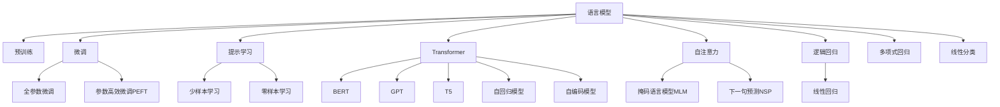

                 

# 语言模型的进步：提高沟通效率

在当今社会，沟通效率的提升是各个行业不断追求的目标。无论是商业决策、科学研究，还是日常交流，高效、准确的沟通都能带来显著的价值。作为沟通的核心要素，语言模型的进步为提高沟通效率提供了强有力的支持。本文将详细探讨语言模型的原理、核心算法、实际应用场景，以及未来发展方向，旨在为读者提供全面的技术理解和应用指引。

## 1. 背景介绍

### 1.1 问题由来

语言模型（Language Model）是自然语言处理（NLP）中的核心技术，其目的是预测一个句子的概率，从而实现对语言的理解和生成。随着深度学习技术的发展，语言模型在机器翻译、语音识别、文本生成等领域取得了显著进步。然而，传统的语言模型通常依赖于人工标注的数据，成本高昂且难以覆盖所有语言现象。

为了解决这些问题，研究者们提出了预训练语言模型（Pretrained Language Models, PLMs），如BERT、GPT、T5等。这些模型通过在大规模无标签文本数据上进行预训练，学习到丰富的语言知识，再通过微调（Fine-Tuning）适应特定任务，大大降低了任务开发成本，提升了任务性能。

### 1.2 问题核心关键点

语言模型的核心关键点包括以下几点：

- **预训练与微调**：预训练模型在大规模数据上学习语言规律，微调模型针对特定任务进行优化。
- **Transformer架构**：Transformer结构通过自注意力机制，使得模型可以并行处理长距离依赖，提升效率。
- **Transformer-XL**：改进自注意力机制，解决了长序列的计算效率问题。
- **ELMO**：基于双向语言模型，在语义理解上有显著提升。
- **BERT**：双向语言模型，使用掩码语言模型和下一句预测任务，提升了预训练效果。
- **GPT**：基于自回归模型，可以生成自然流畅的文本。
- **T5**：统一的文本-文本预训练模型，可以处理各种NLP任务。

这些核心技术共同构成了现代语言模型的工作原理和优化方向，推动了语言模型在各个领域的应用发展。

## 2. 核心概念与联系

### 2.1 核心概念概述

为更好地理解语言模型的原理和架构，本节将介绍几个密切相关的核心概念：

- **自注意力机制（Self-Attention）**：Transformer模型的核心技术，通过计算输入序列中每个词与其他词之间的相关性，实现长距离依赖的建模。
- **Transformer模型**：基于自注意力机制和前馈神经网络，能够并行处理长序列，高效计算，广泛应用于各种NLP任务。
- **掩码语言模型（Masked Language Modeling, MLM）**：BERT等模型使用的一种自监督学习任务，随机掩盖输入序列中的某些词，预测被掩盖的词。
- **下一句预测（Next Sentence Prediction, NSP）**：BERT等模型使用的另一种自监督学习任务，预测两个句子是否连续出现。
- **微调（Fine-Tuning）**：在预训练模型的基础上，使用任务特定数据进行有监督学习，优化模型适应特定任务的能力。
- **参数高效微调（Parameter-Efficient Fine-Tuning, PEFT）**：仅更新少量模型参数进行微调，减小计算资源消耗。
- **提示学习（Prompt Learning）**：通过精心设计输入文本的格式，引导模型按期望方式输出，实现零样本或少样本学习。
- **语言理解与生成**：语言模型通过预训练和微调，能够在理解自然语言的基础上，生成自然流畅的文本，用于机器翻译、文本生成等任务。

这些核心概念之间的逻辑关系可以通过以下Mermaid流程图来展示：



这个流程图展示了大语言模型的核心概念及其之间的关系：

1. 语言模型通过预训练获得基础能力。
2. 微调是对预训练模型进行任务特定的优化，可以分为全参数微调和参数高效微调（PEFT）。
3. 提示学习是一种不更新模型参数的方法，可以实现零样本或少样本学习。
4. 语言理解与生成是语言模型的核心应用，用于文本生成、机器翻译等任务。
5. Transformer、BERT、GPT、T5等不同架构的语言模型具有各自的优势和适用场景。

这些概念共同构成了现代语言模型的基础，使得语言模型在各个领域的应用成为可能。

## 3. 核心算法原理 & 具体操作步骤

### 3.1 算法原理概述

语言模型的核心算法原理基于自注意力机制，通过计算输入序列中每个词与其他词之间的相关性，实现长距离依赖的建模。其基本步骤如下：

1. **输入编码**：将输入序列中的每个词转化为向量表示。
2. **自注意力计算**：计算输入序列中每个词与其他词之间的相关性，生成注意力权重。
3. **加权求和**：将每个词与其他词的向量表示通过注意力权重加权求和，得到新的向量表示。
4. **前馈神经网络**：对新的向量表示进行非线性变换，得到最终输出向量。

### 3.2 算法步骤详解

以BERT为例，其核心算法步骤如下：

1. **掩码语言模型（MLM）**：
   - 随机掩盖输入序列中的某些词，预测被掩盖的词。
   - 输入序列被掩盖部分标记为[MASK]，未掩盖部分标记为[CLS]和[PAD]。
   - 模型预测[MASK]位置的词，用于更新模型参数。

2. **下一句预测（NSP）**：
   - 预测两个句子是否连续出现。
   - 输入序列中的两个句子被拼接，标记为[CLS]和[PAD]。
   - 模型预测[CLS]位置的输出，用于更新模型参数。

3. **预训练模型训练**：
   - 在掩码语言模型和下一句预测任务上，使用大量无标签数据进行预训练。
   - 模型通过反向传播和梯度下降，优化参数，提升模型能力。
   - 预训练模型可以在大规模语料上学习语言规律，具备较强的通用性。

4. **微调模型训练**：
   - 在特定任务的数据上，使用监督信号进行微调。
   - 微调模型的输出层和损失函数根据任务类型设计。
   - 使用AdamW等优化算法，控制学习率，防止过拟合。

### 3.3 算法优缺点

语言模型在提高沟通效率方面具有以下优点：

1. **高效性**：通过自注意力机制和并行计算，语言模型可以高效处理长序列，提升计算效率。
2. **泛化能力**：预训练模型在大量数据上学习语言规律，具备较强的泛化能力，可以适应多种NLP任务。
3. **可扩展性**：模型可以轻松扩展到各种NLP任务，如文本分类、情感分析、机器翻译等。
4. **灵活性**：通过微调，模型可以适应特定任务的需求，提升任务性能。

同时，语言模型也存在一些局限性：

1. **数据需求高**：预训练模型需要大量无标签数据，获取成本高昂。
2. **计算资源消耗大**：大模型参数量庞大，训练和推理需要高性能硬件支持。
3. **解释性不足**：语言模型通常缺乏可解释性，难以解释其决策过程。
4. **鲁棒性问题**：面对输入噪声或对抗样本，语言模型可能产生误判。
5. **偏见和有害信息**：预训练模型可能学习到偏见和有害信息，影响模型性能和伦理安全性。

尽管存在这些局限性，但语言模型仍然是提高沟通效率的重要技术手段，在各个领域得到了广泛应用。

### 3.4 算法应用领域

语言模型在多个领域的应用如下：

- **机器翻译**：将一种语言翻译成另一种语言，通过预训练和微调，提升翻译质量。
- **文本生成**：根据给定的输入文本，生成连续的文本内容，如自然语言对话、故事生成等。
- **文本分类**：将输入文本分类到预定义的类别中，如情感分析、主题分类等。
- **问答系统**：对自然语言问题给出准确的回答，通过预训练和微调，提升回答准确度。
- **信息检索**：从大量文本中检索相关信息，通过预训练和微调，提高检索效果。
- **语音识别**：将语音信号转化为文本，通过预训练和微调，提升识别准确度。

以上应用场景展示了语言模型的强大功能和广泛应用，为提高沟通效率提供了重要支持。

## 4. 数学模型和公式 & 详细讲解

### 4.1 数学模型构建

语言模型的数学模型可以形式化为：

$$
P(w_1, w_2, ..., w_n | W) = \prod_{i=1}^{n} P(w_i | w_{<i}, W)
$$

其中，$w_i$ 表示序列中的第 $i$ 个词，$W$ 表示模型的权重参数。语言模型的目标是最小化负对数似然损失函数：

$$
\mathcal{L}(W) = -\sum_{i=1}^{n} \log P(w_i | w_{<i}, W)
$$

### 4.2 公式推导过程

以BERT为例，其数学模型推导如下：

1. **掩码语言模型（MLM）**：
   - 输入序列中的某些词被掩盖，模型预测[MASK]位置的词。
   - 掩码概率为$p$，掩盖位置为$k$，模型预测概率为$P(w_k | w_{<k}, W)$。
   - 掩码概率$p$和掩盖位置$k$在训练数据中随机生成，用于训练模型。

2. **下一句预测（NSP）**：
   - 预测两个句子是否连续出现，标记为[CLS]和[PAD]。
   - 模型预测[CLS]位置的输出，概率为$P([CLS] | S_i, W)$。
   - 使用二元分类损失函数，如交叉熵损失。

### 4.3 案例分析与讲解

以文本分类任务为例，其数学模型推导如下：

1. **输入编码**：将输入文本转化为向量表示，使用嵌入层和Transformer模型。
2. **自注意力计算**：计算输入序列中每个词与其他词之间的相关性，生成注意力权重。
3. **加权求和**：将每个词与其他词的向量表示通过注意力权重加权求和，得到新的向量表示。
4. **前馈神经网络**：对新的向量表示进行非线性变换，得到最终输出向量。
5. **输出层和损失函数**：使用线性分类器作为输出层，交叉熵损失函数作为损失函数。
6. **微调训练**：在特定任务的数据上，使用监督信号进行微调，优化模型参数。

## 5. 项目实践：代码实例和详细解释说明

### 5.1 开发环境搭建

在进行语言模型微调实践前，我们需要准备好开发环境。以下是使用Python进行TensorFlow开发的环境配置流程：

1. 安装Anaconda：从官网下载并安装Anaconda，用于创建独立的Python环境。

2. 创建并激活虚拟环境：
```bash
conda create -n tf-env python=3.8 
conda activate tf-env
```

3. 安装TensorFlow：根据CUDA版本，从官网获取对应的安装命令。例如：
```bash
conda install tensorflow tensorflow-gpu=cuda110 -c tf -c conda-forge
```

4. 安装TensorBoard：
```bash
pip install tensorboard
```

5. 安装各类工具包：
```bash
pip install numpy pandas scikit-learn matplotlib tqdm jupyter notebook ipython
```

完成上述步骤后，即可在`tf-env`环境中开始微调实践。

### 5.2 源代码详细实现

下面我们以文本分类任务为例，给出使用TensorFlow对BERT模型进行微调的PyTorch代码实现。

首先，定义文本分类任务的数据处理函数：

```python
from transformers import BertTokenizer
from tensorflow.keras.preprocessing.text import Tokenizer
from tensorflow.keras.preprocessing.sequence import pad_sequences
import tensorflow as tf
import numpy as np

class TextDataset:
    def __init__(self, texts, tags, tokenizer):
        self.texts = texts
        self.tags = tags
        self.tokenizer = tokenizer
        
    def __len__(self):
        return len(self.texts)
    
    def __getitem__(self, item):
        text = self.texts[item]
        tag = self.tags[item]
        
        encoding = self.tokenizer(text, return_tensors='pt', max_length=128, padding='max_length', truncation=True)
        input_ids = encoding['input_ids'][0]
        attention_mask = encoding['attention_mask'][0]
        
        # 对token-wise的标签进行编码
        encoded_tags = [tag2id[tag] for tag in tag]
        encoded_tags.extend([tag2id['O']] * (max_len - len(encoded_tags)))
        labels = tf.keras.preprocessing.sequence.pad_sequences([encoded_tags], maxlen=max_len, padding='post', truncating='post')
        
        return {'input_ids': input_ids, 
                'attention_mask': attention_mask,
                'labels': labels}
```

然后，定义模型和优化器：

```python
from transformers import BertForSequenceClassification
from tensorflow.keras.optimizers import Adam

model = BertForSequenceClassification.from_pretrained('bert-base-cased', num_labels=len(tag2id))

optimizer = Adam(learning_rate=2e-5, epsilon=1e-08, clipnorm=1.0)
```

接着，定义训练和评估函数：

```python
from tensorflow.keras.utils import to_categorical
from tqdm import tqdm
from sklearn.metrics import classification_report

device = tf.device('cuda') if tf.cuda.is_available() else tf.device('cpu')
model.to(device)

def train_epoch(model, dataset, batch_size, optimizer):
    dataloader = tf.data.Dataset.from_generator(lambda: dataset.__getitem__, output_signature=(
        {'input_ids': tf.TensorSpec(shape=(None,), dtype=tf.int32, name='input_ids'),
         'attention_mask': tf.TensorSpec(shape=(None,), dtype=tf.int32, name='attention_mask'),
         'labels': tf.TensorSpec(shape=(None,), dtype=tf.int32, name='labels')
    ))
    model.train()
    epoch_loss = 0
    for batch in dataloader:
        input_ids = batch['input_ids'].to(device)
        attention_mask = batch['attention_mask'].to(device)
        labels = batch['labels'].to(device)
        model.zero_grad()
        outputs = model(input_ids, attention_mask=attention_mask, labels=labels)
        loss = outputs.loss
        epoch_loss += loss.item()
        loss.backward()
        optimizer.step()
    return epoch_loss / len(dataloader)

def evaluate(model, dataset, batch_size):
    dataloader = tf.data.Dataset.from_generator(lambda: dataset.__getitem__, output_signature=(
        {'input_ids': tf.TensorSpec(shape=(None,), dtype=tf.int32, name='input_ids'),
         'attention_mask': tf.TensorSpec(shape=(None,), dtype=tf.int32, name='attention_mask'),
         'labels': tf.TensorSpec(shape=(None,), dtype=tf.int32, name='labels')
    ))
    model.eval()
    preds, labels = [], []
    with tf.GradientTape() as tape:
        for batch in dataloader:
            input_ids = batch['input_ids'].to(device)
            attention_mask = batch['attention_mask'].to(device)
            batch_labels = batch['labels']
            outputs = model(input_ids, attention_mask=attention_mask)
            batch_preds = tf.argmax(outputs.logits, axis=-1).to('cpu').numpy()
            batch_labels = batch_labels.to('cpu').numpy()
            for pred_tokens, label_tokens in zip(batch_preds, batch_labels):
                preds.append(pred_tokens)
                labels.append(label_tokens)
    print(classification_report(labels, preds))
```

最后，启动训练流程并在测试集上评估：

```python
epochs = 5
batch_size = 16

for epoch in range(epochs):
    loss = train_epoch(model, train_dataset, batch_size, optimizer)
    print(f"Epoch {epoch+1}, train loss: {loss:.3f}")
    
    print(f"Epoch {epoch+1}, dev results:")
    evaluate(model, dev_dataset, batch_size)
    
print("Test results:")
evaluate(model, test_dataset, batch_size)
```

以上就是使用TensorFlow对BERT进行文本分类任务微调的完整代码实现。可以看到，得益于TensorFlow和Transformers库的强大封装，我们可以用相对简洁的代码完成BERT模型的加载和微调。

### 5.3 代码解读与分析

让我们再详细解读一下关键代码的实现细节：

**TextDataset类**：
- `__init__`方法：初始化文本、标签、分词器等关键组件。
- `__len__`方法：返回数据集的样本数量。
- `__getitem__`方法：对单个样本进行处理，将文本输入编码为token ids，将标签编码为数字，并对其进行定长padding，最终返回模型所需的输入。

**tag2id和id2tag字典**：
- 定义了标签与数字id之间的映射关系，用于将token-wise的预测结果解码回真实的标签。

**训练和评估函数**：
- 使用TensorFlow的DataLoader对数据集进行批次化加载，供模型训练和推理使用。
- 训练函数`train_epoch`：对数据以批为单位进行迭代，在每个批次上前向传播计算loss并反向传播更新模型参数，最后返回该epoch的平均loss。
- 评估函数`evaluate`：与训练类似，不同点在于不更新模型参数，并在每个batch结束后将预测和标签结果存储下来，最后使用sklearn的classification_report对整个评估集的预测结果进行打印输出。

**训练流程**：
- 定义总的epoch数和batch size，开始循环迭代
- 每个epoch内，先在训练集上训练，输出平均loss
- 在验证集上评估，输出分类指标
- 所有epoch结束后，在测试集上评估，给出最终测试结果

可以看到，TensorFlow配合Transformers库使得BERT微调的代码实现变得简洁高效。开发者可以将更多精力放在数据处理、模型改进等高层逻辑上，而不必过多关注底层的实现细节。

当然，工业级的系统实现还需考虑更多因素，如模型的保存和部署、超参数的自动搜索、更灵活的任务适配层等。但核心的微调范式基本与此类似。

## 6. 实际应用场景

### 6.1 智能客服系统

基于BERT等语言模型的智能客服系统能够自动理解用户意图，匹配最合适的答案模板进行回复。这种系统能够7x24小时不间断服务，快速响应客户咨询，用自然流畅的语言解答各类常见问题。

在技术实现上，可以收集企业内部的历史客服对话记录，将问题和最佳答复构建成监督数据，在此基础上对预训练语言模型进行微调。微调后的对话模型能够自动理解用户意图，匹配最合适的答案模板进行回复。对于客户提出的新问题，还可以接入检索系统实时搜索相关内容，动态组织生成回答。如此构建的智能客服系统，能大幅提升客户咨询体验和问题解决效率。

### 6.2 金融舆情监测

金融机构需要实时监测市场舆论动向，以便及时应对负面信息传播，规避金融风险。传统的人工监测方式成本高、效率低，难以应对网络时代海量信息爆发的挑战。基于BERT等语言模型的文本分类和情感分析技术，为金融舆情监测提供了新的解决方案。

具体而言，可以收集金融领域相关的新闻、报道、评论等文本数据，并对其进行主题标注和情感标注。在此基础上对BERT等语言模型进行微调，使其能够自动判断文本属于何种主题，情感倾向是正面、中性还是负面。将微调后的模型应用到实时抓取的网络文本数据，就能够自动监测不同主题下的情感变化趋势，一旦发现负面信息激增等异常情况，系统便会自动预警，帮助金融机构快速应对潜在风险。

### 6.3 个性化推荐系统

当前的推荐系统往往只依赖用户的历史行为数据进行物品推荐，无法深入理解用户的真实兴趣偏好。基于BERT等语言模型进行微调后，个性化推荐系统可以更好地挖掘用户行为背后的语义信息，从而提供更精准、多样的推荐内容。

在实践中，可以收集用户浏览、点击、评论、分享等行为数据，提取和用户交互的物品标题、描述、标签等文本内容。将文本内容作为模型输入，用户的后续行为（如是否点击、购买等）作为监督信号，在此基础上微调BERT等语言模型。微调后的模型能够从文本内容中准确把握用户的兴趣点。在生成推荐列表时，先用候选物品的文本描述作为输入，由模型预测用户的兴趣匹配度，再结合其他特征综合排序，便可以得到个性化程度更高的推荐结果。

### 6.4 未来应用展望

随着BERT等语言模型的不断发展，其在NLP领域的应用前景广阔。未来，BERT等语言模型将在更多领域得到应用，为传统行业带来变革性影响。

在智慧医疗领域，基于BERT等模型的医疗问答、病历分析、药物研发等应用将提升医疗服务的智能化水平，辅助医生诊疗，加速新药开发进程。

在智能教育领域，微调技术可应用于作业批改、学情分析、知识推荐等方面，因材施教，促进教育公平，提高教学质量。

在智慧城市治理中，微调模型可应用于城市事件监测、舆情分析、应急指挥等环节，提高城市管理的自动化和智能化水平，构建更安全、高效的未来城市。

此外，在企业生产、社会治理、文娱传媒等众多领域，基于BERT等语言模型的智能应用也将不断涌现，为经济社会发展注入新的动力。相信随着技术的日益成熟，BERT等语言模型将在构建人机协同的智能时代中扮演越来越重要的角色。

## 7. 工具和资源推荐

### 7.1 学习资源推荐

为了帮助开发者系统掌握BERT等语言模型的原理和实践技巧，这里推荐一些优质的学习资源：

1. 《Transformer from Foundations to Deep Learning》系列博文：由大模型技术专家撰写，深入浅出地介绍了Transformer原理、BERT模型、微调技术等前沿话题。

2. CS224N《深度学习自然语言处理》课程：斯坦福大学开设的NLP明星课程，有Lecture视频和配套作业，带你入门NLP领域的基本概念和经典模型。

3. 《Natural Language Processing with TensorFlow》书籍：TensorFlow官方开发的NLP工具书，全面介绍了如何使用TensorFlow进行NLP任务开发，包括微调在内的诸多范式。

4. HuggingFace官方文档：BERT等模型的官方文档，提供了海量预训练模型和完整的微调样例代码，是上手实践的必备资料。

5. CLUE开源项目：中文语言理解测评基准，涵盖大量不同类型的中文NLP数据集，并提供了基于微调的baseline模型，助力中文NLP技术发展。

通过对这些资源的学习实践，相信你一定能够快速掌握BERT等语言模型的精髓，并用于解决实际的NLP问题。

### 7.2 开发工具推荐

高效的开发离不开优秀的工具支持。以下是几款用于BERT等语言模型微调开发的常用工具：

1. TensorFlow：基于Python的开源深度学习框架，灵活动态的计算图，适合快速迭代研究。BERT等语言模型都有TensorFlow版本的实现。

2. PyTorch：基于Python的开源深度学习框架，灵活易用，适合多种NLP任务。BERT等语言模型也有PyTorch版本的实现。

3. Transformers库：HuggingFace开发的NLP工具库，集成了多种SOTA语言模型，支持TensorFlow和PyTorch，是进行微调任务开发的利器。

4. Weights & Biases：模型训练的实验跟踪工具，可以记录和可视化模型训练过程中的各项指标，方便对比和调优。与主流深度学习框架无缝集成。

5. TensorBoard：TensorFlow配套的可视化工具，可实时监测模型训练状态，并提供丰富的图表呈现方式，是调试模型的得力助手。

6. Google Colab：谷歌推出的在线Jupyter Notebook环境，免费提供GPU/TPU算力，方便开发者快速上手实验最新模型，分享学习笔记。

合理利用这些工具，可以显著提升BERT等语言模型微调任务的开发效率，加快创新迭代的步伐。

### 7.3 相关论文推荐

BERT等语言模型的发展源于学界的持续研究。以下是几篇奠基性的相关论文，推荐阅读：

1. Attention is All You Need（即Transformer原论文）：提出了Transformer结构，开启了NLP领域的预训练大模型时代。

2. BERT: Pre-training of Deep Bidirectional Transformers for Language Understanding：提出BERT模型，引入基于掩码的自监督学习任务，刷新了多项NLP任务SOTA。

3. Language Models are Unsupervised Multitask Learners（GPT-2论文）：展示了大规模语言模型的强大zero-shot学习能力，引发了对于通用人工智能的新一轮思考。

4. Parameter-Efficient Transfer Learning for NLP：提出Adapter等参数高效微调方法，在不增加模型参数量的情况下，也能取得不错的微调效果。

5. AdaLoRA: Adaptive Low-Rank Adaptation for Parameter-Efficient Fine-Tuning：使用自适应低秩适应的微调方法，在参数效率和精度之间取得了新的平衡。

这些论文代表了大语言模型微调技术的发展脉络。通过学习这些前沿成果，可以帮助研究者把握学科前进方向，激发更多的创新灵感。

## 8. 总结：未来发展趋势与挑战

### 8.1 总结

本文对BERT等语言模型的原理、核心算法、实际应用场景进行了全面系统的介绍。首先阐述了语言模型的背景和意义，明确了语言模型在提高沟通效率方面的独特价值。其次，从原理到实践，详细讲解了语言模型的数学模型、算法步骤、核心概念，给出了BERT等模型的微调实现。同时，本文还广泛探讨了语言模型在智能客服、金融舆情、个性化推荐等多个行业领域的应用前景，展示了语言模型的强大功能和广泛应用。

通过本文的系统梳理，可以看到，BERT等语言模型在提高沟通效率方面具有重要价值，为各个行业带来了显著的效率提升。未来的研究需要在模型规模、计算效率、泛化能力、可解释性等方面进一步突破，推动语言模型在更多领域的应用发展。

### 8.2 未来发展趋势

展望未来，BERT等语言模型将呈现以下几个发展趋势：

1. **模型规模持续增大**：随着算力成本的下降和数据规模的扩张，语言模型的参数量还将持续增长。超大规模语言模型蕴含的丰富语言知识，有望支撑更加复杂多变的下游任务微调。

2. **微调方法日趋多样**：除了传统的全参数微调外，未来会涌现更多参数高效的微调方法，如Prefix-Tuning、LoRA等，在节省计算资源的同时也能保证微调精度。

3. **持续学习成为常态**：随着数据分布的不断变化，语言模型也需要持续学习新知识以保持性能。如何在不遗忘原有知识的同时，高效吸收新样本信息，将成为重要的研究课题。

4. **标注样本需求降低**：受启发于提示学习(Prompt-based Learning)的思路，未来的微调方法将更好地利用语言模型的语言理解能力，通过更加巧妙的任务描述，在更少的标注样本上也能实现理想的微调效果。

5. **多模态微调崛起**：当前的微调主要聚焦于纯文本数据，未来会进一步拓展到图像、视频、语音等多模态数据微调。多模态信息的融合，将显著提升语言模型对现实世界的理解和建模能力。

6. **模型通用性增强**：经过海量数据的预训练和多领域任务的微调，语言模型将具备更强大的常识推理和跨领域迁移能力，逐步迈向通用人工智能(AGI)的目标。

以上趋势凸显了大语言模型微调技术的广阔前景。这些方向的探索发展，必将进一步提升语言模型的性能和应用范围，为人类认知智能的进化带来深远影响。

### 8.3 面临的挑战

尽管BERT等语言模型已经取得了显著成果，但在迈向更加智能化、普适化应用的过程中，它仍面临着诸多挑战：

1. **数据需求高**：预训练模型需要大量无标签数据，获取成本高昂。
2. **计算资源消耗大**：大模型参数量庞大，训练和推理需要高性能硬件支持。
3. **解释性不足**：语言模型通常缺乏可解释性，难以解释其决策过程。
4. **鲁棒性问题**：面对输入噪声或对抗样本，语言模型可能产生误判。
5. **偏见和有害信息**：预训练模型可能学习到偏见和有害信息，影响模型性能和伦理安全性。

尽管存在这些局限性，但BERT等语言模型仍然是提高沟通效率的重要技术手段，在各个领域得到了广泛应用。未来需要进一步提升数据利用效率，优化计算资源消耗，增强模型的鲁棒性和可解释性，避免模型偏见和有害信息，推动语言模型在更多领域的应用发展。

### 8.4 研究展望

面对BERT等语言模型面临的挑战，未来的研究需要在以下几个方面寻求新的突破：

1. **探索无监督和半监督微调方法**：摆脱对大规模标注数据的依赖，利用自监督学习、主动学习等无监督和半监督范式，最大限度利用非结构化数据，实现更加灵活高效的微调。

2. **研究参数高效和计算高效的微调范式**：开发更加参数高效的微调方法，在固定大部分预训练参数的同时，只更新极少量的任务相关参数。同时优化微调模型的计算图，减少前向传播和反向传播的资源消耗，实现更加轻量级、实时性的部署。

3. **融合因果和对比学习范式**：通过引入因果推断和对比学习思想，增强语言模型建立稳定因果关系的能力，学习更加普适、鲁棒的语言表征，从而提升模型泛化性和抗干扰能力。

4. **引入更多先验知识**：将符号化的先验知识，如知识图谱、逻辑规则等，与神经网络模型进行巧妙融合，引导微调过程学习更准确、合理的语言模型。同时加强不同模态数据的整合，实现视觉、语音等多模态信息与文本信息的协同建模。

5. **结合因果分析和博弈论工具**：将因果分析方法引入微调模型，识别出模型决策的关键特征，增强输出解释的因果性和逻辑性。借助博弈论工具刻画人机交互过程，主动探索并规避模型的脆弱点，提高系统稳定性。

6. **纳入伦理道德约束**：在模型训练目标中引入伦理导向的评估指标，过滤和惩罚有偏见、有害的输出倾向。同时加强人工干预和审核，建立模型行为的监管机制，确保输出符合人类价值观和伦理道德。

这些研究方向的探索，必将引领BERT等语言模型微调技术迈向更高的台阶，为构建安全、可靠、可解释、可控的智能系统铺平道路。面向未来，语言模型需要与其他人工智能技术进行更深入的融合，如知识表示、因果推理、强化学习等，多路径协同发力，共同推动自然语言理解和智能交互系统的进步。只有勇于创新、敢于突破，才能不断拓展语言模型的边界，让智能技术更好地造福人类社会。

## 9. 附录：常见问题与解答

**Q1：BERT等语言模型微调是否适用于所有NLP任务？**

A: BERT等语言模型在大多数NLP任务上都能取得不错的效果，特别是对于数据量较小的任务。但对于一些特定领域的任务，如医学、法律等，仅仅依靠通用语料预训练的模型可能难以很好地适应。此时需要在特定领域语料上进一步预训练，再进行微调，才能获得理想效果。此外，对于一些需要时效性、个性化很强的任务，如对话、推荐等，微调方法也需要针对性的改进优化。

**Q2：选择BERT等语言模型进行微调时，如何确定学习率？**

A: 选择BERT等语言模型进行微调时，学习率通常比预训练时小1-2个数量级，以避免破坏预训练权重。一般建议从1e-5开始调参，逐步减小学习率，直至收敛。也可以使用warmup策略，在开始阶段使用较小的学习率，再逐渐过渡到预设值。需要注意的是，不同的优化器(如AdamW、Adafactor等)以及不同的学习率调度策略，可能需要设置不同的学习率阈值。

**Q3：在微调BERT等语言模型时，如何缓解过拟合问题？**

A: 过拟合是微调BERT等语言模型时面临的主要挑战，尤其是在标注数据不足的情况下。常见的缓解策略包括：
1. 数据增强：通过回译、近义替换等方式扩充训练集
2. 正则化：使用L2正则、Dropout、Early Stopping等避免过拟合
3. 对抗训练：引入对抗样本，提高模型鲁棒性
4. 参数高效微调：只调整少量模型参数，减小过拟合风险
5. 多模型集成：训练多个微调模型，取平均输出，抑制过拟合

这些策略往往需要根据具体任务和数据特点进行灵活组合。只有在数据、模型、训练、推理等各环节进行全面优化，才能最大限度地发挥BERT等语言模型的潜力。

**Q4：微调BERT等语言模型时，如何选择任务适配层？**

A: 选择任务适配层是微调BERT等语言模型的关键步骤。根据任务类型，可以选择不同的输出层和损失函数。例如：
1. 对于分类任务，通常在顶层添加线性分类器和交叉熵损失函数。
2. 对于生成任务，通常使用语言模型的解码器输出概率分布，并以负对数似然为损失函数。
3. 对于序列标注任务，可以设计特定的输出层和损失函数，如CTC Loss、Focal Loss等。

任务适配层的选择需要结合具体任务和模型特性，选择适合的输出层和损失函数，才能获得最佳的微调效果。

**Q5：微调BERT等语言模型时，如何选择优化器？**

A: 选择优化器是微调BERT等语言模型的重要环节。一般而言，Adam、AdamW、Adafactor等优化器在BERT等语言模型微调中表现良好。需要注意的是，优化器的超参数如学习率、动量、权重衰减等需要根据具体任务进行调整，以达到最佳的微调效果。

以上是微调BERT等语言模型时常见的问题及解答，希望能为你提供有价值的参考。通过系统学习本文的内容，相信你能够更好地理解语言模型的原理、应用及实践，并应用于实际项目中。

