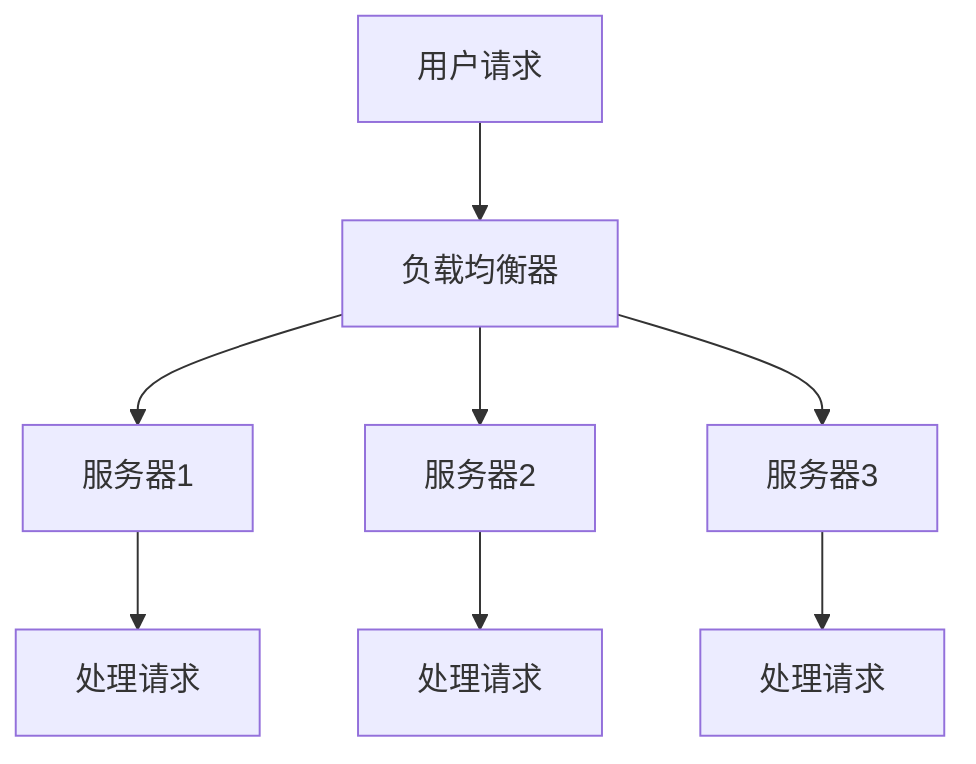

                 

## 1. 背景介绍

在现代互联网应用中，系统的可用性和性能成为衡量服务质量的重要指标。随着应用规模的扩大，系统的负载压力逐渐增加，单一服务器或数据中心的处理能力已难以满足日益增长的业务需求。为了提升系统的稳定性和效率，负载均衡技术应运而生。

### 1.1 问题由来

随着Web应用的广泛部署，越来越多的服务提供商面临着流量激增的问题。例如，电商平台的“双11”、社交网络的“春节”、视频网站的“春晚”等高峰期，都会带来异常巨大的访问量。单一服务器的处理能力难以应对高并发请求，导致系统性能下降甚至崩溃，影响了用户体验和业务运行。

### 1.2 问题核心关键点

负载均衡技术旨在通过合理分配请求负载，将用户请求均衡地分发到多个服务器或数据中心，以提升系统可用性和性能。它包括以下几个关键点：

- **多服务器/数据中心部署**：通过多台服务器或数据中心的协同工作，提升系统的处理能力和容错性。
- **请求分发策略**：选择合适的分发策略（如轮询、哈希、最少连接等），将用户请求均衡地分配到各个服务器。
- **负载监控与动态调整**：实时监控系统负载，根据实际流量动态调整服务器负载，优化资源利用率。
- **故障转移与恢复**：在出现服务器故障时，能够快速将请求转发到其他可用的服务器，确保服务不中断。

### 1.3 问题研究意义

负载均衡技术是构建高可用、高性能系统的核心手段之一，其研究意义如下：

- **提升系统稳定性**：通过多服务器/数据中心部署，减少单点故障，提升系统稳定性和可靠性。
- **优化资源利用**：通过动态调整服务器负载，避免资源浪费，提升资源利用率。
- **降低系统成本**：通过扩展服务器数量和部署策略，降低单台服务器的压力，从而降低硬件和维护成本。
- **改善用户体验**：通过均衡请求分发，减少响应时间，提升用户体验。

## 2. 核心概念与联系

### 2.1 核心概念概述

为更好地理解负载均衡技术，本节将介绍几个关键概念：

- **负载均衡器**：通过硬件设备或软件程序，将用户请求分发到多个服务器上，确保系统高可用性和性能。
- **分发策略**：根据一定规则将请求分发到各个服务器的方法，如轮询、哈希、加权轮询等。
- **静态与动态分发**：静态分发指固定分发策略，适用于负载相对稳定的情况；动态分发则根据系统负载和状态实时调整分发策略，适用于高动态变化的场景。
- **高可用性**：通过负载均衡和故障转移机制，确保系统在部分或全部服务器故障时仍能提供服务。
- **服务质量**：包括响应时间、吞吐量、错误率等，是衡量系统性能的重要指标。

### 2.2 核心概念原理和架构的 Mermaid 流程图



这个流程图展示了负载均衡技术的核心工作流程：用户请求首先经过负载均衡器，根据分发策略分配到不同的服务器进行处理。每个服务器独立处理请求，最终将响应返回给用户。

## 3. 核心算法原理 & 具体操作步骤

### 3.1 算法原理概述

负载均衡技术通过合理分配请求负载，提高系统的可用性和性能。常见的负载均衡算法包括轮询、哈希、加权轮询等，每种算法都有其适用的场景和优缺点。

### 3.2 算法步骤详解

#### 3.2.1 轮询算法（Round Robin）

轮询算法是最简单的负载均衡算法，按照请求到达的顺序依次将请求分配到各个服务器。具体步骤如下：

1. 记录每个服务器的当前请求数。
2. 当有新的请求到达时，选择请求数最少的那台服务器进行处理。
3. 更新服务器的请求数，继续进行下一步。

#### 3.2.2 哈希算法（Hash）

哈希算法通过将请求的某些特征（如IP地址、用户ID等）作为哈希函数的输入，计算出一个哈希值，然后将请求分配到对应的服务器。具体步骤如下：

1. 获取请求的特征信息。
2. 计算哈希值。
3. 根据哈希值将请求分配到对应的服务器。

#### 3.2.3 加权轮询算法（Weighted Round Robin）

加权轮询算法在轮询算法的基础上，为不同的服务器分配不同的权重，确保负载均衡的同时，优先处理请求量较大的服务器。具体步骤如下：

1. 记录每个服务器的当前请求数和权重。
2. 计算每个服务器的负载值。
3. 根据负载值选择请求数最少且权重最大的服务器进行处理。

### 3.3 算法优缺点

#### 3.3.1 轮询算法的优缺点

**优点**：
- 实现简单，易于理解和部署。
- 公平性好，请求量较少的服务器不会被频繁占用。

**缺点**：
- 假设所有服务器处理能力相同，不适用于负载不均衡的情况。
- 无法考虑服务器之间的差异性。

#### 3.3.2 哈希算法的优缺点

**优点**：
- 负载均衡效果好，适用于负载动态变化的场景。
- 能够根据请求特征进行更精细的分发。

**缺点**：
- 对哈希函数的选择和处理较为敏感，可能会出现碰撞和不均衡。
- 不适合服务器数量较多或哈希值范围较小的情况。

#### 3.3.3 加权轮询算法的优缺点

**优点**：
- 能够根据服务器的负载和权重进行更合理的请求分配。
- 适用于不同服务器处理能力不同的场景。

**缺点**：
- 实现较为复杂，需要额外维护服务器的请求数和权重。
- 需要实时更新负载信息，增加了系统复杂性。

### 3.4 算法应用领域

负载均衡技术广泛应用于各种高性能计算系统、Web应用、云计算平台等。以下是几个具体的应用场景：

- **Web服务器**：通过负载均衡器将用户请求均衡地分配到多个Web服务器，提升系统响应时间和吞吐量。
- **CDN（内容分发网络）**：通过负载均衡技术将静态资源（如图片、视频等）缓存到各个节点，提供更快速、稳定的内容访问。
- **大数据处理**：通过负载均衡技术将大数据处理任务分配到多个计算节点上，提升数据处理效率和系统可靠性。
- **分布式数据库**：通过负载均衡技术将数据请求均衡地分配到多个数据库节点上，提升数据查询速度和系统稳定性。

## 4. 数学模型和公式 & 详细讲解 & 举例说明

### 4.1 数学模型构建

假设一个负载均衡系统包含N台服务器，每台服务器的当前请求数为$R_i$，权重为$W_i$，总请求数为$R$。设请求到达时，选择请求数最少且权重最大的服务器进行处理。

### 4.2 公式推导过程

1. 计算每个服务器的负载值$L_i$：
   $$
   L_i = R_i + \frac{R - \sum_{j=1}^N R_j}{N} W_i
   $$

2. 选择负载值最小的服务器进行处理：
   $$
   i_{min} = \mathop{\arg\min}_{i} L_i
   $$

3. 将请求分配给选择的服务器，更新该服务器的请求数和负载值。

### 4.3 案例分析与讲解

假设系统包含两台服务器，初始请求数分别为$R_1 = 2$，$R_2 = 4$，权重分别为$W_1 = 0.6$，$W_2 = 0.4$。当新请求到达时，按照加权轮询算法进行分发：

1. 计算每台服务器的负载值：
   $$
   L_1 = 2 + \frac{5}{2} \times 0.6 = 4.5
   $$
   $$
   L_2 = 4 + \frac{5}{2} \times 0.4 = 6.5
   $$

2. 选择负载值最小的服务器进行处理，即$L_1$。

3. 将请求分配给$L_1$服务器，更新其请求数为$R_1 = 3$，负载值为$L_1 = 4.5$。

## 5. 项目实践：代码实例和详细解释说明

### 5.1 开发环境搭建

#### 5.1.1 搭建服务器环境

1. 安装操作系统：选择稳定、安全的操作系统，如CentOS、Ubuntu等。
2. 安装网络设备：使用网卡和交换机搭建网络环境，确保负载均衡器和服务器之间的通信。
3. 安装负载均衡器：可以使用硬件负载均衡器，如F5、Citrix等，或者软件负载均衡器，如Nginx、HAProxy等。

#### 5.1.2 搭建负载均衡环境

1. 配置负载均衡器：设置IP地址、端口号、负载均衡算法等参数。
2. 配置服务器环境：为每个服务器设置独立的IP地址、端口号、请求处理脚本等。
3. 测试连接：使用命令行或网络工具测试负载均衡器和服务器之间的连接是否正常。

### 5.2 源代码详细实现

#### 5.2.1 使用Nginx实现轮询算法

在Nginx配置文件中，设置轮询算法如下：

```nginx
upstream backend {
    server server1:8080;
    server server2:8080;
}

server {
    listen 80;
    server_name example.com;
    location / {
        proxy_pass http://backend;
        proxy_set_header Host $host;
        proxy_set_header X-Real-IP $remote_addr;
        proxy_set_header X-Forwarded-For $proxy_add_x_forwarded_for;
    }
}
```

#### 5.2.2 使用HAProxy实现哈希算法

在HAProxy配置文件中，设置哈希算法如下：

```haproxy
frontend http-in
    bind 192.168.1.1:80
    default_backend backend

backend backend
    server server1:8080 check inter 5s down 2 rise 2
    server server2:8080 check inter 5s down 2 rise 2
    mode httproundrobin
    hash http-get x-forwarded-for
```

### 5.3 代码解读与分析

#### 5.3.1 Nginx实现轮询算法

- `upstream`指令：定义后端服务器池。
- `server`指令：配置Nginx监听端口和请求处理逻辑。
- `proxy_pass`指令：将请求转发到后端服务器池。
- `proxy_set_header`指令：设置请求头，保留原始请求信息。

#### 5.3.2 HAProxy实现哈希算法

- `frontend`指令：定义前端监听端口和后端服务器池。
- `backend`指令：定义后端服务器列表和负载均衡算法。
- `hash`指令：根据请求头（如x-forwarded-for）进行哈希计算，将请求分配到对应的服务器。
- `mode`指令：定义负载均衡策略，此处为轮询。

### 5.4 运行结果展示

运行Nginx和HAProxy后，可以使用curl等工具测试负载均衡效果：

```bash
curl http://example.com
```

输出应为负载均衡器分发的请求，响应内容由后端服务器处理。

## 6. 实际应用场景

### 6.1 互联网应用

互联网应用是负载均衡技术的主要应用场景之一。大型网站如淘宝、京东、百度等，通过负载均衡器将用户请求均衡地分配到多个Web服务器上，确保系统稳定性和高可用性。

### 6.2 云计算平台

云计算平台通过负载均衡技术将用户请求均衡地分配到多个云服务器上，提升系统的可扩展性和容错性。

### 6.3 数据中心

数据中心通过负载均衡技术将用户请求均衡地分配到多个存储服务器上，提升数据访问速度和系统可靠性。

### 6.4 分布式数据库

分布式数据库通过负载均衡技术将数据请求均衡地分配到多个数据库节点上，提升数据查询速度和系统稳定性。

## 7. 工具和资源推荐

### 7.1 学习资源推荐

1. 《负载均衡技术实战》一书：深入浅出地介绍了负载均衡技术的原理和实践，包括Nginx、HAProxy、LVS等主流负载均衡器的详细使用。
2. 《高性能网络编程》一书：介绍了网络编程的高性能技巧，包括TCP/IP协议、多线程编程等，为理解负载均衡技术打下基础。
3. 《负载均衡原理与实践》课程：结合实际案例，详细讲解了负载均衡算法的原理和应用，适合初学者和进阶者。
4. 负载均衡技术在线课程：各大在线教育平台（如Coursera、Udemy等）提供的负载均衡技术课程，涵盖各种主流负载均衡器的配置和实践。

### 7.2 开发工具推荐

1. Nginx：轻量级的负载均衡器，适合Web应用和高性能计算环境。
2. HAProxy：功能强大的负载均衡器，支持多种负载均衡算法和健康检查机制。
3. LVS（Linux Virtual Server）：高性能的负载均衡器，适合大规模集群环境。
4. Apache HTTP Server：老牌的Web服务器，提供基本的负载均衡功能。

### 7.3 相关论文推荐

1. "Load Balancing Algorithms for Cloud Data Centers"：介绍云数据中心的负载均衡算法，涵盖轮询、哈希、加权轮询等主流算法。
2. "A Survey on Load Balancing in Cloud Computing"：综述云平台中的负载均衡技术，分析各种算法的优缺点。
3. "A Performance Study of Load Balancing Algorithms in Data Centers"：研究数据中心中的负载均衡算法，评估不同算法的性能和适用场景。

## 8. 总结：未来发展趋势与挑战

### 8.1 总结

本文系统介绍了负载均衡技术的原理和实践，展示了其在提高系统可用性和性能方面的重要作用。通过Nginx和HAProxy等主流工具的实际应用，详细讲解了轮询、哈希等负载均衡算法的具体实现步骤和运行结果。

### 8.2 未来发展趋势

未来，负载均衡技术将呈现以下几个发展趋势：

1. **智能化负载均衡**：引入机器学习和大数据技术，实时分析系统负载和请求特征，动态调整负载均衡策略，提升系统性能和可靠性。
2. **多云负载均衡**：支持跨云环境下的负载均衡，实现更灵活的资源调度和配置管理。
3. **容器负载均衡**：支持基于容器的微服务架构，实现服务的高可用性和弹性扩展。
4. **边缘计算负载均衡**：在边缘计算节点上部署负载均衡器，实现数据本地化处理和响应速度提升。
5. **混合负载均衡**：结合硬件和软件负载均衡技术，提供更高性能和灵活性。

### 8.3 面临的挑战

尽管负载均衡技术在实践中已经取得了显著效果，但仍然面临以下挑战：

1. **负载均衡器性能**：负载均衡器本身需要处理高并发请求，性能瓶颈不容忽视。
2. **多数据中心同步**：跨数据中心的负载均衡需要保证数据一致性和同步，实现较为复杂。
3. **复杂网络拓扑**：在复杂的网络拓扑结构中，负载均衡器需要精确地路由请求，配置较为复杂。
4. **安全性和隐私保护**：负载均衡过程中可能存在数据泄露和攻击风险，需要加强安全措施。

### 8.4 研究展望

未来的负载均衡研究需要在以下几个方面取得突破：

1. **边缘计算与负载均衡的结合**：将边缘计算和负载均衡技术融合，实现数据本地化处理和边缘计算节点的有效利用。
2. **人工智能与负载均衡的结合**：引入机器学习和大数据技术，优化负载均衡策略，提升系统性能和可靠性。
3. **多云负载均衡的优化**：研究多云环境下的负载均衡技术，实现跨云环境的资源调度和配置管理。
4. **容器化负载均衡的优化**：优化基于容器的负载均衡技术，提升微服务架构的性能和扩展性。
5. **智能化负载均衡的优化**：研究智能化负载均衡算法，动态调整负载均衡策略，提升系统性能和可靠性。

这些研究方向将进一步推动负载均衡技术的进步，提升系统可用性和性能，为构建高效、可靠、可扩展的现代互联网应用提供有力支持。

## 9. 附录：常见问题与解答

### Q1：负载均衡技术有哪些常见的算法？

**A1**：负载均衡技术常见的算法包括轮询、哈希、加权轮询等。轮询算法按照请求到达的顺序依次将请求分配到各个服务器；哈希算法根据请求的特征计算哈希值，将请求分配到对应的服务器；加权轮询算法在轮询算法的基础上，为不同的服务器分配不同的权重，优先处理请求量较大的服务器。

### Q2：负载均衡器应该如何选择？

**A2**：负载均衡器的选择应考虑系统的需求和特点。对于Web应用，可以选择Nginx、HAProxy等轻量级负载均衡器；对于大规模集群环境，可以选择LVS等高性能负载均衡器；对于多云环境，可以选择支持跨云的负载均衡器。

### Q3：负载均衡器如何设置健康检查？

**A3**：负载均衡器通常会设置健康检查机制，确保服务器的可用性和稳定性。具体设置方式根据不同的负载均衡器而定，一般设置Ping、TCP Connect、HTTP等健康检查方法。

### Q4：负载均衡器的性能瓶颈在哪里？

**A4**：负载均衡器的性能瓶颈主要在于处理高并发请求的能力。选择高性能的负载均衡器（如LVS）、优化配置（如设置合适的并发连接数）、使用负载均衡算法（如加权轮询）可以有效缓解性能瓶颈。

### Q5：负载均衡技术未来发展方向是什么？

**A5**：负载均衡技术的未来发展方向包括智能化负载均衡、多云负载均衡、容器负载均衡、边缘计算负载均衡等。这些方向将进一步推动负载均衡技术的进步，提升系统可用性和性能，为构建高效、可靠、可扩展的现代互联网应用提供有力支持。

