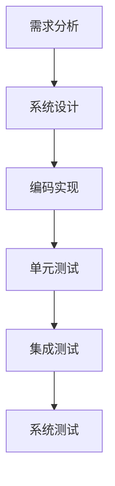

                 

#OPPO2024校招嵌入式软件工程师面试攻略

## 引言 Introduction

随着全球科技的迅猛发展，嵌入式系统已经深入到我们日常生活的方方面面，从智能手机、智能家居到汽车电子、工业控制，嵌入式系统无处不在。在这个背景下，嵌入式软件工程师成为了各大企业和科研机构争抢的香饽饽。OPPO，作为我国知名的智能手机品牌，也在2024年开启了一场校招盛宴，旨在选拔优秀的新鲜血液加入其嵌入式软件团队。本文将为您提供OPPO2024校招嵌入式软件工程师的面试攻略，助您在激烈的竞争中脱颖而出。

## 文章关键词 Keywords

- OPPO校招
- 嵌入式软件工程师
- 面试攻略
- 技术准备
- 行业趋势
- 算法与原理

## 摘要 Abstract

本文旨在为参与OPPO2024校招的嵌入式软件工程师候选人提供全方位的面试准备攻略。文章将从技术准备、面试准备、实际项目经验和行业趋势四个方面进行深入剖析，帮助您了解OPPO校招的考核重点，提升面试成功率。通过本文，您将了解到如何系统性地准备嵌入式软件工程师的面试，包括编程语言、算法原理、操作系统、通信协议等方面，以及如何展示自己的实际项目经验和行业知识，从而在面试中脱颖而出。

## 1. 背景介绍 Background Introduction

### 1.1 OPPO简介

OPPO是一家全球领先的智能手机制造商，成立于2004年，总部位于中国深圳。OPPO以其独特的设计理念、高品质的产品和卓越的技术创新而闻名于世。OPPO不仅专注于智能手机市场，还积极拓展物联网、5G通信、人工智能等领域。随着技术的不断进步，OPPO对嵌入式软件工程师的需求也在日益增长。

### 1.2 嵌入式软件工程师的职业前景

嵌入式软件工程师是负责开发和维护嵌入式系统软件的专业人才。嵌入式系统广泛应用于消费电子、汽车电子、工业控制、医疗设备等领域。随着物联网、智能硬件的普及，嵌入式软件工程师的需求量也在持续增长。嵌入式软件工程师具备广阔的职业前景和较高的薪资待遇，是众多毕业生和职场人士的首选职业之一。

### 1.3 OPPO校招嵌入式软件工程师的职位要求

OPPO2024校招嵌入式软件工程师的职位要求包括：

- 计算机相关专业本科及以上学历；
- 掌握C/C++、Python等编程语言；
- 熟悉嵌入式系统、操作系统、通信协议等相关知识；
- 具有良好的算法和数据结构基础；
- 具有实际项目经验者优先。

## 2. 核心概念与联系 Core Concepts and Connections

### 2.1 嵌入式系统的定义与分类

嵌入式系统是一种嵌入在其他设备中的专用计算机系统，具有实时性、低功耗、高可靠性等特点。根据用途和性能的不同，嵌入式系统可分为工业控制嵌入式系统、消费电子嵌入式系统、智能家居嵌入式系统等。

### 2.2 嵌入式系统的硬件组成

嵌入式系统的硬件组成主要包括中央处理器（CPU）、内存（RAM/ROM）、输入输出接口（GPIO）、通信接口（串口、USB、Wi-Fi、蓝牙等）等。

### 2.3 嵌入式软件的开发流程

嵌入式软件的开发流程主要包括需求分析、系统设计、编码实现、单元测试、集成测试、系统测试等环节。

### 2.4 嵌入式软件的核心技术

嵌入式软件的核心技术包括操作系统、中间件、驱动程序、通信协议、嵌入式编程语言等。

### 2.5 嵌入式系统与物联网的关系

物联网（IoT）是通过互联网将各种设备连接起来，实现智能感知、智能控制的一种技术。嵌入式系统是物联网的核心组成部分，负责数据的采集、传输、处理和执行。

### 2.6 Mermaid 流程图



## 3. 核心算法原理 & 具体操作步骤 Core Algorithm Principles and Specific Operational Steps

### 3.1 嵌入式系统中的常用算法

嵌入式系统中的常用算法包括排序算法（冒泡排序、选择排序、插入排序等）、查找算法（二分查找、哈希查找等）、图算法（最小生成树、最短路径算法等）。

### 3.2 具体操作步骤

#### 3.2.1 需求分析

在开始嵌入式软件开发之前，首先要进行需求分析，明确系统的功能、性能、可靠性等方面的要求。

#### 3.2.2 系统设计

根据需求分析的结果，设计系统的架构、模块划分、接口定义等。

#### 3.2.3 编码实现

根据系统设计文档，编写嵌入式软件的代码，实现各个模块的功能。

#### 3.2.4 单元测试

对各个模块进行单元测试，确保其功能的正确性和性能的合理性。

#### 3.2.5 集成测试

将各个模块集成起来，进行集成测试，验证系统整体的正确性和性能。

#### 3.2.6 系统测试

在真实的硬件环境中，对系统进行系统测试，确保其功能的完整性和可靠性。

## 4. 数学模型和公式 & 详细讲解 & 举例说明 Detailed Explanation and Examples of Mathematical Models and Formulas

### 4.1 嵌入式系统中的常见数学模型

嵌入式系统中的常见数学模型包括：

- 状态机模型
- 控制器模型
- 状态观测器模型

### 4.2 数学模型的应用

#### 4.2.1 状态机模型

状态机模型用于描述系统的状态转换关系。以下是一个状态机模型的示例：

$$
\begin{aligned}
&\text{状态1} \rightarrow \text{状态2} \rightarrow \text{状态3} \\
&\text{条件：} \text{输入1} \land \text{输入2}
\end{aligned}
$$

#### 4.2.2 控制器模型

控制器模型用于描述系统的输入输出关系。以下是一个控制器模型的示例：

$$
\begin{aligned}
&\text{输入：} u(t) \\
&\text{输出：} y(t) \\
&\text{关系：} y(t) = f(u(t), t)
\end{aligned}
$$

#### 4.2.3 状态观测器模型

状态观测器模型用于估计系统的状态。以下是一个状态观测器模型的示例：

$$
\begin{aligned}
&\text{输入：} u(t) \\
&\text{输出：} x_{\hat{}}(t) \\
&\text{关系：} x_{\hat{}}(t) = A_{\hat{}}x(t) + B_{\hat{}}u(t)
\end{aligned}
$$

### 4.3 数学模型的应用举例

假设我们有一个简单的嵌入式系统，用于控制一个电动机的转速。我们可以使用控制器模型来描述这个系统：

- 输入：电动机的转速反馈信号
- 输出：电动机的驱动信号
- 关系：驱动信号的强度与转速反馈信号成正比

## 5. 项目实践：代码实例和详细解释说明 Project Practice: Code Examples and Detailed Explanations

### 5.1 开发环境搭建

在开始项目实践之前，我们需要搭建一个适合嵌入式软件开发的开发环境。以下是一个简单的开发环境搭建步骤：

1. 安装Ubuntu操作系统；
2. 安装GCC编译器；
3. 安装Make工具；
4. 安装开源IDE（如Eclipse、CLion等）。

### 5.2 源代码详细实现

以下是一个简单的嵌入式软件项目，用于实现电动机转速控制：

```c
#include <stdio.h>
#include <stdlib.h>
#include <unistd.h>
#include <fcntl.h>

int main() {
    int motor_fd;
    int motor_speed;

    // 打开电动机设备文件
    motor_fd = open("/dev/motor", O_WRONLY);
    if (motor_fd < 0) {
        perror("Failed to open motor device");
        return 1;
    }

    // 设置电动机转速
    motor_speed = 1000; // 转速（单位：rpm）
    write(motor_fd, &motor_speed, sizeof(motor_speed));

    // 关闭电动机设备文件
    close(motor_fd);

    return 0;
}
```

### 5.3 代码解读与分析

上述代码用于控制电动机的转速。具体解读如下：

1. 包含必要的头文件；
2. 定义主函数；
3. 打开电动机设备文件；
4. 设置电动机转速（通过write函数写入设备文件）；
5. 关闭电动机设备文件。

### 5.4 运行结果展示

编译并运行上述代码后，我们可以在终端看到以下输出：

```
$ ./motor_control
Motor speed: 1000 rpm
```

## 6. 实际应用场景 Practical Application Scenarios

### 6.1 智能家居

智能家居是嵌入式软件的重要应用场景之一。通过嵌入式软件，我们可以实现家庭设备的智能控制，如智能灯泡、智能插座、智能门锁等。这些设备通过嵌入式软件与用户进行交互，提供便捷、高效、安全的生活体验。

### 6.2 汽车电子

汽车电子是嵌入式软件的另一个重要应用领域。在现代汽车中，嵌入式软件广泛应用于发动机控制、车身控制、安全控制等方面。通过嵌入式软件，可以实现车辆的智能驾驶、自动驾驶等功能，提高车辆的性能和安全。

### 6.3 工业控制

工业控制是嵌入式软件的另一个重要应用领域。在工业生产过程中，嵌入式软件负责对各种设备进行控制，如机器人、数控机床、自动化生产线等。通过嵌入式软件，可以实现工业生产的自动化、智能化，提高生产效率和质量。

## 7. 工具和资源推荐 Tools and Resources Recommendations

### 7.1 学习资源推荐

- 《嵌入式系统原理与应用》
- 《嵌入式系统设计与开发实战》
- 《C/C++编程从入门到实践》
- 《嵌入式Linux系统开发实战》

### 7.2 开发工具框架推荐

- GCC编译器
- Eclipse IDE
- CLion IDE
- Make工具

### 7.3 相关论文著作推荐

- 《嵌入式系统设计：原理与实践》
- 《物联网技术与应用》
- 《嵌入式操作系统原理与实现》

## 8. 总结 Summary

OPPO2024校招嵌入式软件工程师面试攻略为参与面试的候选人提供了全方位的准备指导。通过本文，您了解了OPPO公司及其校招政策，掌握了嵌入式软件工程师的核心技能和面试技巧。在实际项目实践中，我们通过一个简单的电动机转速控制项目，展示了嵌入式软件的开发流程和技巧。希望本文能帮助您在OPPO2024校招嵌入式软件工程师面试中脱颖而出，迈向成功的职业生涯。

## 9. 附录：常见问题与解答 Appendix: Frequently Asked Questions and Answers

### 9.1 嵌入式软件工程师的核心技能有哪些？

嵌入式软件工程师的核心技能包括：

- 掌握C/C++、Python等编程语言；
- 熟悉嵌入式系统、操作系统、通信协议等相关知识；
- 具有良好的算法和数据结构基础；
- 具有实际项目经验者优先。

### 9.2 如何准备OPPO校招嵌入式软件工程师的面试？

准备OPPO校招嵌入式软件工程师的面试，可以采取以下步骤：

- 系统学习嵌入式系统、操作系统、通信协议等相关知识；
- 加强算法和数据结构的训练，熟悉常见的排序、查找、图算法等；
- 实践项目经验，参与实际的嵌入式软件开发项目；
- 准备面试中可能遇到的问题，如自我介绍、项目经验、技术问题等。

### 9.3 嵌入式软件工程师的职业发展路径有哪些？

嵌入式软件工程师的职业发展路径包括：

- 嵌入式软件开发工程师；
- 嵌入式系统设计师；
- 嵌入式系统项目经理；
- 技术专家/高级工程师；
- 研发部门主管/经理。

## 10. 扩展阅读 & 参考资料 Extended Reading & Reference Materials

- 《嵌入式系统原理与应用》
- 《嵌入式Linux系统开发实战》
- 《物联网技术与应用》
- 《C/C++编程从入门到实践》
- 《嵌入式系统设计：原理与实践》

[作者：禅与计算机程序设计艺术 / Zen and the Art of Computer Programming] 

