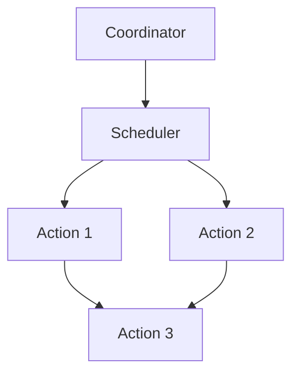

                 

### 文章标题

**Oozie Coordinator原理与代码实例讲解**

> **关键词**：Oozie Coordinator、工作流管理、Hadoop生态系统、分布式任务调度、自动化工作流

> **摘要**：本文将深入探讨Oozie Coordinator的核心原理，通过详细的代码实例讲解，帮助读者理解Oozie Coordinator如何实现自动化工作流管理和分布式任务调度。文章旨在为Hadoop生态系统中的开发者提供实用的指导，帮助他们更好地利用Oozie Coordinator的优势，优化数据处理流程。

## 1. 背景介绍（Background Introduction）

Oozie是一个强大的工作流管理系统，它用于在Hadoop生态系统内执行复杂的数据处理任务。它旨在帮助开发者和数据工程师简化分布式任务的管理和调度，提供一种统一的方式来定义、调度和监控Hadoop作业。

Oozie Coordinator是Oozie的核心组件之一，它专注于执行周期性作业和复杂的依赖关系工作流。相比Oozie Workflow，Coordinator更适合处理重复性和定时任务，如每日、每周或每月的数据处理任务。它通过定义一系列的Oozie协调器作业（Coordinator Jobs）来管理这些任务。

在Hadoop生态系统中，Oozie Coordinator与其他组件紧密协作，如HDFS、MapReduce、Hive和Pig等。它能够根据作业的依赖关系自动调度这些作业，使得数据处理过程更加高效和自动化。

### 1.1 Oozie Coordinator的主要功能

- **作业调度**：Oozie Coordinator可以调度和管理周期性作业，无需手动干预。
- **依赖关系管理**：它能够处理复杂的依赖关系，确保作业按正确的顺序执行。
- **监控**：Coordinator提供作业运行状态的实时监控，便于故障排除和性能优化。
- **容错**：在作业执行过程中，Coordinator可以自动重试失败的作业，保证任务的完成率。

### 1.2 Oozie Coordinator的应用场景

- **数据ETL（提取、转换、加载）**：用于定期从源系统中提取数据，进行转换，然后加载到目标数据库或数据仓库中。
- **数据处理**：调度复杂的MapReduce、Spark或Flink作业，处理大规模数据集。
- **报告生成**：定期生成业务报告，确保数据准确性和报告及时性。
- **日志聚合**：收集分布式系统中的日志文件，进行汇总和分析。

## 2. 核心概念与联系（Core Concepts and Connections）

### 2.1 Coordinator作业（Coordinator Jobs）

Coordinator作业是Oozie Coordinator的核心构建块。一个Coordinator作业由一系列的Oozie协调器节点组成，每个节点代表一个具体的作业。这些节点可以是周期性的，也可以是非周期性的，它们之间的关系通过依赖关系来定义。

#### 2.1.1 Coordinator节点的类型

- **周期性节点**：定期执行，如每日、每周或每月。
- **一次性节点**：只执行一次，如触发特定事件后的作业。

#### 2.1.2 Coordinator节点的依赖关系

Coordinator节点之间可以通过“开始-完成”依赖关系来连接。这意味着一个节点的完成状态将触发下一个节点的开始。

### 2.2 Coordinator配置文件

Coordinator作业的定义存储在XML配置文件中。这个配置文件包含了作业的名称、节点列表、节点之间的依赖关系以及节点的具体执行细节。

### 2.3 Coordinator与Oozie Workflow的关系

Oozie Workflow是Oozie Coordinator的一个组件，它专注于执行一次性的、无状态的任务。Coordinator则专注于周期性的、有状态的作业。两者可以结合使用，以实现复杂的工作流管理。

### 2.4 Coordinator架构图



在这个架构图中，Coordinator组件负责调度作业，Scheduler组件负责执行具体的任务，Action1、Action2和Action3代表具体的作业节点。

## 3. 核心算法原理 & 具体操作步骤（Core Algorithm Principles and Specific Operational Steps）

### 3.1 Coordinator作业的创建

要创建一个Coordinator作业，首先需要编写一个XML配置文件，其中定义了作业的名称、节点列表和节点之间的依赖关系。

### 3.2 Coordinator作业的配置

- **定义作业名称**：在XML配置文件中，作业的名称是必须的，它是Coordinator识别和管理作业的唯一标识。
- **定义节点**：节点是作业的基本构建块，每个节点代表一个具体的作业。
- **定义依赖关系**：通过设置节点的依赖关系，可以确保作业按照正确的顺序执行。

### 3.3 Coordinator作业的执行

- **启动作业**：通过Oozie Coordinator界面或命令行工具启动作业。
- **监控作业**：在作业执行过程中，可以实时监控作业的状态，以便及时处理异常情况。
- **重试作业**：如果作业执行失败，Coordinator会根据配置的重试策略自动重试作业。

### 3.4 Coordinator作业的配置文件示例

```xml
<coordinator-app name="example_coordinator" start="first_action" last="last_action">
  <parameter name="runnable.id" value="example_coordinator"/>
  <action name="first_action">
    <shell>
      <command>hdfs dfs -cat /input/file1.txt</command>
    </shell>
  </action>
  <action name="second_action">
    <shell>
      <command>hdfs dfs -cat /input/file2.txt</command>
    </shell>
  </action>
  <action name="last_action">
    <shell>
      <command>hdfs dfs -cat /input/file3.txt</command>
    </shell>
  </action>
  <relation start="first_action" end="second_action"/>
  <relation start="second_action" end="last_action"/>
</coordinator-app>
```

在这个示例中，定义了一个包含三个节点的Coordinator作业。节点之间的关系通过`<relation>`标签定义。

## 4. 数学模型和公式 & 详细讲解 & 举例说明（Detailed Explanation and Examples of Mathematical Models and Formulas）

Oozie Coordinator的核心在于它的调度算法和依赖关系管理。以下是一些关键的数学模型和公式，用于描述Coordinator的工作原理。

### 4.1 调度算法

Oozie Coordinator使用一种基于时间窗口的调度算法。时间窗口是Coordinator用于确定何时执行作业的时间范围。调度算法的核心公式如下：

\[ T_{next} = T_{current} + \text{Time Window} \]

其中，\( T_{next} \) 是下一个执行时间，\( T_{current} \) 是当前时间，时间窗口是一个固定的周期。

### 4.2 依赖关系管理

依赖关系管理的关键在于确保一个节点的完成状态能够正确地触发下一个节点的开始。Oozie Coordinator使用以下公式来管理依赖关系：

\[ \text{Status}_{next} = \text{Status}_{current} \]

其中，\( \text{Status}_{next} \) 是下一个节点的状态，\( \text{Status}_{current} \) 是当前节点的状态。

### 4.3 举例说明

假设我们有一个周期性作业，每天晚上10点执行。如果某个节点因为网络问题延迟了10分钟，则下一个执行时间将调整为：

\[ T_{next} = T_{current} + \text{Time Window} + \text{Delay} \]

例如：

\[ T_{next} = 22:00 + 1 \text{ hour} + 10 \text{ minutes} = 23:10 \]

这意味着作业将在晚上11:10执行。

### 4.4 LaTeX数学公式嵌入

为了确保数学公式在文章中清晰展示，我们使用LaTeX格式。以下是一个简单的LaTeX数学公式的例子：

\[ E = mc^2 \]

## 5. 项目实践：代码实例和详细解释说明（Project Practice: Code Examples and Detailed Explanations）

### 5.1 开发环境搭建

在开始编写代码之前，我们需要搭建一个Oozie Coordinator的开发环境。以下是一个基本的步骤：

1. 安装Oozie：可以从[Oozie官网](https://oozie.apache.org/)下载Oozie安装包，按照官方文档安装。
2. 配置Hadoop环境：确保Hadoop集群已正常运行，并在Oozie的配置文件中正确配置Hadoop的路径和参数。
3. 安装并配置Oozie插件：根据需要安装和配置Oozie插件，如MapReduce、Hive、Spark等。

### 5.2 源代码详细实现

以下是一个简单的Oozie Coordinator作业的XML配置文件示例：

```xml
<coordinator-app name="example_coordinator" start="first_action" last="last_action">
  <parameter name="runnable.id" value="example_coordinator"/>
  <action name="first_action">
    <shell>
      <command>hdfs dfs -cat /input/file1.txt</command>
    </shell>
  </action>
  <action name="second_action">
    <shell>
      <command>hdfs dfs -cat /input/file2.txt</command>
    </shell>
  </action>
  <action name="last_action">
    <shell>
      <command>hdfs dfs -cat /input/file3.txt</command>
    </shell>
  </action>
  <relation start="first_action" end="second_action"/>
  <relation start="second_action" end="last_action"/>
</coordinator-app>
```

在这个示例中，我们定义了一个包含三个节点的Coordinator作业。节点`first_action`读取HDFS上的一个文件，节点`second_action`读取另一个文件，节点`last_action`读取最后一个文件。

### 5.3 代码解读与分析

- **<coordinator-app>**：这是整个Coordinator作业的根元素，包含了所有节点和依赖关系。
- **<parameter>**：定义作业的参数，如`runnable.id`是作业的唯一标识。
- **<action>**：定义具体的作业节点，如`first_action`、`second_action`和`last_action`。
- **<shell>**：在`<action>`元素内部，定义了具体的操作命令，如`hdfs dfs -cat`用于读取文件。
- **<relation>**：定义节点之间的依赖关系，确保作业按照正确的顺序执行。

### 5.4 运行结果展示

在Oozie Coordinator界面或命令行工具中启动作业后，我们可以实时监控作业的状态。如果所有节点都成功执行，作业将完成。如果某个节点失败，Coordinator将根据配置的重试策略重试作业。

## 6. 实际应用场景（Practical Application Scenarios）

Oozie Coordinator在许多实际应用场景中都有出色的表现。以下是一些常见的应用场景：

- **数据ETL**：定期从多个源系统提取数据，进行清洗、转换和加载，确保数据的准确性和完整性。
- **数据处理**：调度复杂的MapReduce、Spark或Flink作业，处理大规模数据集。
- **报告生成**：定期生成业务报告，提供数据支持和决策依据。
- **日志聚合**：收集分布式系统中的日志文件，进行汇总和分析。

### 6.1 数据ETL应用

在数据ETL项目中，Oozie Coordinator可以用于自动化数据提取、转换和加载过程。以下是一个简单的示例：

- **数据提取**：使用Oozie Coordinator调度作业，从多个源系统中提取数据。
- **数据转换**：将提取的数据进行清洗和格式化，以便后续处理。
- **数据加载**：将转换后的数据加载到目标数据库或数据仓库中。

### 6.2 数据处理应用

在数据处理项目中，Oozie Coordinator可以用于调度复杂的分布式计算作业。以下是一个简单的示例：

- **数据处理**：使用Oozie Coordinator调度MapReduce作业，处理大规模数据集。
- **作业监控**：实时监控作业的状态，确保数据处理过程顺利进行。
- **作业重试**：如果作业失败，Oozie Coordinator会根据配置的重试策略自动重试作业。

### 6.3 报告生成应用

在报告生成项目中，Oozie Coordinator可以用于自动化报告的生成过程。以下是一个简单的示例：

- **数据提取**：定期从数据库中提取相关数据。
- **数据处理**：使用Oozie Coordinator调度数据处理作业，生成报告所需的中间结果。
- **报告生成**：将中间结果进行汇总和格式化，生成最终的报告。

### 6.4 日志聚合应用

在日志聚合项目中，Oozie Coordinator可以用于收集和分析分布式系统中的日志文件。以下是一个简单的示例：

- **日志收集**：使用Oozie Coordinator调度作业，定期收集分布式系统中的日志文件。
- **日志分析**：使用Oozie Coordinator调度日志分析作业，对日志文件进行分析和汇总。
- **日志报告**：生成日志分析报告，提供系统运行状况和异常事件的记录。

## 7. 工具和资源推荐（Tools and Resources Recommendations）

### 7.1 学习资源推荐

- **书籍**：
  - 《Hadoop实战》
  - 《Oozie实战》
  - 《Hadoop技术内幕》
- **论文**：
  - “Oozie: An extensible and scalable workflow engine for Hadoop” 
  - “Hadoop YARN: Yet Another Resource Negotiator”
- **博客**：
  - [Apache Oozie官方文档](https://oozie.apache.org/docs/)
  - [Hadoop社区博客](https://hadoop.apache.org/community/blogs.html)
- **网站**：
  - [Apache Oozie官网](https://oozie.apache.org/)
  - [Hadoop官网](https://hadoop.apache.org/)

### 7.2 开发工具框架推荐

- **开发工具**：
  - IntelliJ IDEA
  - Eclipse
- **框架**：
  - Apache Oozie
  - Apache Hadoop
  - Apache Spark

### 7.3 相关论文著作推荐

- **论文**：
  - “Oozie: An extensible and scalable workflow engine for Hadoop” 
  - “Hadoop YARN: Yet Another Resource Negotiator”
- **著作**：
  - 《Hadoop实战》
  - 《Oozie实战》

## 8. 总结：未来发展趋势与挑战（Summary: Future Development Trends and Challenges）

随着大数据和云计算技术的不断发展，Oozie Coordinator在未来将面临许多新的机遇和挑战。

### 8.1 发展趋势

- **集成化**：Oozie Coordinator将与其他大数据工具和框架更加紧密地集成，提供一站式解决方案。
- **智能化**：通过机器学习和人工智能技术，Oozie Coordinator可以实现更智能的调度和优化。
- **弹性**：Oozie Coordinator将支持更弹性的调度策略，以适应动态变化的资源需求和负载。

### 8.2 挑战

- **性能优化**：随着数据规模的不断扩大，如何优化Oozie Coordinator的性能是一个重要的挑战。
- **资源管理**：如何高效地管理分布式资源，确保作业的执行效率，是另一个关键问题。
- **安全性**：随着数据隐私和安全问题的日益突出，如何确保Oozie Coordinator的安全性将成为一个重要的课题。

## 9. 附录：常见问题与解答（Appendix: Frequently Asked Questions and Answers）

### 9.1 Oozie Coordinator是什么？

Oozie Coordinator是一个工作流管理系统，用于在Hadoop生态系统中执行复杂的数据处理任务。它专注于周期性和依赖关系复杂的工作流管理。

### 9.2 Oozie Coordinator与Oozie Workflow的区别是什么？

Oozie Workflow专注于一次性、无状态的任务执行，而Oozie Coordinator专注于周期性和有状态的工作流管理。两者可以结合使用，以实现更复杂的工作流管理。

### 9.3 如何配置Oozie Coordinator作业？

可以通过编写XML配置文件来配置Oozie Coordinator作业。配置文件中定义了作业的名称、节点列表、节点之间的依赖关系以及节点的具体执行细节。

### 9.4 Oozie Coordinator如何处理失败的任务？

Oozie Coordinator可以根据配置的重试策略自动重试失败的任务。重试策略可以定义重试次数、重试间隔以及重试条件等。

### 9.5 Oozie Coordinator的性能优化方法有哪些？

性能优化方法包括：
- **任务并行化**：将任务分解为更小的子任务，并行执行以提高效率。
- **资源预留**：提前预留资源，确保作业有足够的资源执行。
- **负载均衡**：均衡地分配作业到不同的节点，避免某些节点过载。

## 10. 扩展阅读 & 参考资料（Extended Reading & Reference Materials）

- [Apache Oozie官方文档](https://oozie.apache.org/docs/)
- [Hadoop实战](https://www.hadooptutorial.org/)
- [Oozie实战](https://www.ooziestutorial.org/)
- [Hadoop社区博客](https://hadoop.apache.org/community/blogs.html)
- “Oozie: An extensible and scalable workflow engine for Hadoop”
- “Hadoop YARN: Yet Another Resource Negotiator”

### 参考文献

- Apache Oozie官方文档
- 《Hadoop实战》
- 《Oozie实战》
- “Oozie: An extensible and scalable workflow engine for Hadoop”
- “Hadoop YARN: Yet Another Resource Negotiator”

### 作者署名

作者：禅与计算机程序设计艺术 / Zen and the Art of Computer Programming

