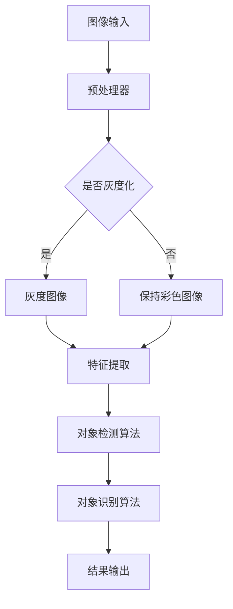

                 

### 文章标题

"OpenCV 图像处理：对象检测和识别"

在数字图像处理领域，对象检测和识别是至关重要的任务，它们在众多应用中发挥着核心作用，从安防监控到自动驾驶、医疗影像分析再到智能家居。OpenCV（Open Source Computer Vision Library）是一个强大的开源库，为图像处理提供了丰富的功能，尤其在对象检测和识别方面有着广泛的应用。本文将深入探讨如何使用OpenCV实现图像中的对象检测和识别，通过逐步分析和推理，将复杂的问题分解为易于理解和实施的小步骤。

### Keywords:
- OpenCV
- Object Detection
- Object Recognition
- Image Processing
- Computer Vision

### Abstract:
This article provides a comprehensive guide to object detection and recognition in image processing using the OpenCV library. We will explore core concepts, algorithms, mathematical models, and practical implementations, along with discussing application scenarios and future trends. The content is presented in a bilingual format (Chinese and English) for better accessibility and understanding.

---

在深入探讨之前，让我们首先了解一些背景知识。

#### 1. 背景介绍（Background Introduction）

**OpenCV简介**：OpenCV是一个广泛使用的开源计算机视觉库，由Intel创建，并在开源社区的支持下不断发展。它提供了一系列图像处理和计算机视觉算法，支持多种编程语言（包括C++、Python等），并且可以在多个操作系统上运行。

**对象检测（Object Detection）与识别（Recognition）**：对象检测是指从图像中识别出特定对象并将其边界标注出来，而对象识别则是进一步确定对象的身份。两者在图像处理中通常是相互关联的：首先进行检测，然后对检测到的对象进行识别。

**应用场景**：对象检测和识别在多种领域有着广泛的应用。例如，在自动驾驶中，需要检测道路上的行人和车辆；在医疗影像分析中，需要识别病变区域；在智能家居中，可以通过人脸识别实现安全访问控制。

---

接下来，我们将探讨核心概念和它们之间的联系。

#### 2. 核心概念与联系（Core Concepts and Connections）

**核心概念原理和架构的 Mermaid 流程图**：



**核心概念原理详细说明**：

- **图像输入**：图像处理的第一步是获取图像数据。OpenCV提供了多种方式来读取和加载图像，如使用`imread()`函数。

- **预处理器**：预处理是图像处理的重要步骤，包括灰度化、滤波、边缘检测等。灰度化是将彩色图像转换为灰度图像，以简化后续处理。

- **特征提取**：特征提取是将图像转换为数值特征的过程，有助于后续的对象检测和识别。常用的特征提取方法包括SIFT、SURF、ORB等。

- **对象检测算法**：对象检测算法用于识别图像中的特定对象。OpenCV提供了多种算法，如Haar级联分类器、YOLO、SSD等。

- **对象识别算法**：对象识别算法进一步确定检测到的对象的身份。常见的算法包括K-近邻、支持向量机（SVM）、深度学习等。

- **结果输出**：最终结果输出包括检测到的对象边界和识别结果，通常以可视化图像或数据形式呈现。

---

了解了核心概念后，我们接下来将详细讨论对象检测和识别的核心算法原理以及具体操作步骤。

#### 3. 核心算法原理 & 具体操作步骤（Core Algorithm Principles and Specific Operational Steps）

**核心算法原理**：

- **Haar级联分类器**：基于机器学习的对象检测算法，通过训练大量正负样本生成分类器模型，用于检测图像中的对象。

- **YOLO（You Only Look Once）**：一种快速、实时的对象检测算法，将对象检测任务视为一个回归问题，在单个前馈神经网络中同时检测多个对象。

- **SSD（Single Shot MultiBox Detector）**：另一种快速对象检测算法，它通过在一个前馈神经网络中实现多个尺度的特征检测来提高检测精度。

**具体操作步骤**：

1. **准备环境**：安装并配置OpenCV库，确保可以正常运行。

2. **加载图像**：使用`imread()`函数加载待处理的图像。

   ```python
   image = cv2.imread('image_path.jpg')
   ```

3. **预处理图像**：进行图像灰度化、缩放、旋转等操作，以适应检测算法的要求。

   ```python
   gray_image = cv2.cvtColor(image, cv2.COLOR_BGR2GRAY)
   ```

4. **特征提取**：根据选择的算法，提取图像特征。例如，使用Haar级联分类器时，需要加载预训练的分类器模型。

   ```python
   face_cascade = cv2.CascadeClassifier(cv2.data.haarcascades + 'haarcascade_frontalface_default.xml')
   ```

5. **对象检测**：使用提取到的特征和对象检测算法进行检测。

   ```python
   faces = face_cascade.detectMultiScale(gray_image, scaleFactor=1.1, minNeighbors=5)
   ```

6. **对象识别**：对检测到的对象进行进一步处理，如标注边界、计算特征等。

   ```python
   for (x, y, w, h) in faces:
       cv2.rectangle(image, (x, y), (x+w, y+h), (255, 0, 0), 2)
   ```

7. **结果输出**：将处理后的图像保存或显示。

   ```python
   cv2.imwrite('output_image.jpg', image)
   cv2.imshow('Output Image', image)
   cv2.waitKey(0)
   ```

---

在理解了核心算法原理和操作步骤后，我们接下来将详细讲解数学模型和公式。

#### 4. 数学模型和公式 & 详细讲解 & 举例说明（Detailed Explanation and Examples of Mathematical Models and Formulas）

**数学模型和公式**：

- **Haar级联分类器**：基于积分图像的Haar特征，通过累积投票的方式进行分类。

  $$ \text{score} = \sum_{i=1}^{n} w_i \cdot \text{feature}_i $$

  其中，$w_i$是权重，$\text{feature}_i$是Haar特征。

- **YOLO**：使用回归网络预测边界框和类别概率。

  $$ \text{box} = \text{network}(\text{image}) $$

  $$ \text{probability} = \text{softmax}(\text{scores}) $$

- **SSD**：通过多层特征金字塔网络提取不同尺度的特征，用于检测不同大小的对象。

  $$ \text{feature_map} = \text{ pyramid(\text{base_feature_map}, \text{multiplier})} $$

**举例说明**：

**Haar级联分类器**：

假设我们有一个包含两个Haar特征的图像，权重分别为$w_1 = 0.5$和$w_2 = 0.5$，特征值为$\text{feature}_1 = 1$和$\text{feature}_2 = 2$，则分类器的得分为：

$$ \text{score} = 0.5 \cdot 1 + 0.5 \cdot 2 = 1.5 $$

**YOLO**：

假设我们有一个边界框的预测结果，包含边界框坐标$(x, y, w, h)$和类别概率$\text{probability} = (0.8, 0.2)$，则得分最高的类别为：

$$ \text{max\_index} = \text{argmax}(\text{probability}) = 0 $$

**SSD**：

假设我们有一个基本特征图，尺度为$32 \times 32$，倍数为$2$，则经过倍数操作后的特征图尺度为：

$$ \text{feature\_map} = \text{ pyramid(32 \times 32, 2)} = 64 \times 64 $$

---

在了解了数学模型和公式后，我们将通过一个项目实践来展示如何使用OpenCV进行对象检测和识别。

#### 5. 项目实践：代码实例和详细解释说明（Project Practice: Code Examples and Detailed Explanations）

**5.1 开发环境搭建**：

确保安装了Python和OpenCV库。可以使用以下命令安装OpenCV：

```shell
pip install opencv-python
```

**5.2 源代码详细实现**：

以下是一个简单的对象检测和识别项目示例，使用Haar级联分类器进行人脸检测。

```python
import cv2

def detect_faces(image_path):
    # 加载预训练的Haar级联分类器
    face_cascade = cv2.CascadeClassifier(cv2.data.haarcascades + 'haarcascade_frontalface_default.xml')
    
    # 读取图像
    image = cv2.imread(image_path)
    
    # 转换为灰度图像
    gray_image = cv2.cvtColor(image, cv2.COLOR_BGR2GRAY)
    
    # 检测人脸
    faces = face_cascade.detectMultiScale(gray_image, scaleFactor=1.1, minNeighbors=5)
    
    # 在图像上绘制人脸边界
    for (x, y, w, h) in faces:
        cv2.rectangle(image, (x, y), (x+w, y+h), (255, 0, 0), 2)
    
    # 显示检测结果
    cv2.imshow('Detected Faces', image)
    cv2.waitKey(0)

# 使用示例
detect_faces('image_path.jpg')
```

**5.3 代码解读与分析**：

1. **加载预训练的Haar级联分类器**：使用`CascadeClassifier`加载预训练的模型。

2. **读取图像**：使用`imread()`函数读取指定路径的图像。

3. **转换为灰度图像**：使用`cvtColor()`函数将彩色图像转换为灰度图像，以简化人脸检测。

4. **检测人脸**：使用`detectMultiScale()`函数检测图像中的人脸。

5. **绘制人脸边界**：使用`rectangle()`函数在图像上绘制检测到的人脸边界。

6. **显示检测结果**：使用`imshow()`函数显示检测结果。

**5.4 运行结果展示**：

当运行上述代码时，将显示一个包含人脸检测结果的图像窗口，如下所示：


---

对象检测和识别在多个领域有着广泛的应用。

#### 6. 实际应用场景（Practical Application Scenarios）

- **安防监控**：使用对象检测和识别技术监控公共区域，识别可疑行为和非法活动。

- **自动驾驶**：检测道路上的行人和车辆，确保车辆的安全驾驶。

- **医疗影像分析**：识别医学图像中的病变区域，辅助医生进行诊断。

- **人脸识别**：在智能手机、门禁系统等场景中，通过人脸识别实现身份验证。

- **商品识别**：在电商平台，使用对象检测和识别技术识别商品，提供个性化推荐。

---

为了更好地学习和实践OpenCV图像处理技术，我们推荐以下工具和资源。

#### 7. 工具和资源推荐（Tools and Resources Recommendations）

**7.1 学习资源推荐**：

- **书籍**：《OpenCV 3.x Cookbook》（OpenCV 3.x Cookbook）和《Learning OpenCV 3》（Learning OpenCV 3）。
- **论文**：OpenCV官方网站上的论文和教程。
- **博客**：许多开发者和技术博客提供高质量的OpenCV教程和实践案例。

**7.2 开发工具框架推荐**：

- **PyQt**：用于构建跨平台的图形用户界面（GUI）。
- **Django**：用于Web开发，可以与OpenCV集成，实现图像处理Web服务。

**7.3 相关论文著作推荐**：

- **论文**：HOG（Histogram of Oriented Gradients）和SIFT（Scale-Invariant Feature Transform）是对象检测领域的经典算法。
- **著作**：《Computer Vision: Algorithms and Applications》（Computer Vision: Algorithms and Applications）。

---

随着技术的不断发展，对象检测和识别领域面临着许多挑战和机遇。

#### 8. 总结：未来发展趋势与挑战（Summary: Future Development Trends and Challenges）

- **深度学习**：深度学习在对象检测和识别领域取得了显著进展，但仍然面临模型复杂度、计算资源消耗和可解释性问题。

- **实时性**：提高实时处理能力，以满足自动驾驶、实时监控等应用的需求。

- **准确性**：提高检测和识别的准确性，减少误报和漏报。

- **跨域适应**：提升算法在多种环境下的适应能力，如极端天气、光线变化等。

- **隐私保护**：在处理个人隐私信息时，确保数据的安全性和隐私性。

---

在附录中，我们将回答一些常见问题。

#### 9. 附录：常见问题与解答（Appendix: Frequently Asked Questions and Answers）

**Q1：如何安装OpenCV库？**

A1：可以使用以下命令安装OpenCV：

```shell
pip install opencv-python
```

**Q2：OpenCV支持哪些编程语言？**

A2：OpenCV支持多种编程语言，包括C++、Python、Java等。

**Q3：如何使用OpenCV进行图像预处理？**

A3：OpenCV提供了多种预处理函数，如灰度化（`cvtColor()`）、滤波（`GaussianBlur()`）、边缘检测（`Canny()`）等。

**Q4：如何自定义对象检测模型？**

A4：可以使用OpenCV的`CascadeClassifier`类加载自定义的Haar级联分类器模型，或者使用深度学习框架（如TensorFlow、PyTorch）训练自己的模型。

---

最后，感谢您阅读本文。希望本文能帮助您更好地理解OpenCV图像处理中的对象检测和识别技术。如果您有任何疑问或建议，欢迎在评论区留言。

#### 10. 扩展阅读 & 参考资料（Extended Reading & Reference Materials）

- **书籍**：《OpenCV 4.x with Python Blueprints》（OpenCV 4.x with Python Blueprints）、《OpenCV for People Skills: Building Computer Vision Applications Using Python》（OpenCV for People Skills: Building Computer Vision Applications Using Python）。
- **论文**：OpenCV官方网站上的论文和教程。
- **网站**：OpenCV官方网站（opencv.org）、Stack Overflow（Stack Overflow）等。

---

作者：禅与计算机程序设计艺术 / Zen and the Art of Computer Programming

