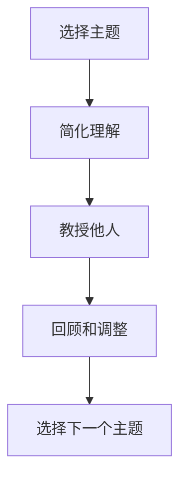

                 

## 1. 背景介绍

### 1.1 问题由来
在快速变化的技术环境中，持续学习和知识更新成为企业保持竞争力的关键。传统的教育模式难以适应快速知识迭代的要求，因此企业内部亟需一种高效、灵活的学习方式来促进团队成员的学习与成长。费曼学习法（Feynman Technique）正是一种以深入理解为目标的学习方法，通过自我解释和教授他人来加深知识理解，已被广泛应用于技术团队的学习和知识传递中。

### 1.2 问题核心关键点
费曼学习法的核心在于通过提问和解释来促进知识的掌握和应用。其核心原理可以概括为：
1. **选择主题**：选择一个感兴趣的知识点作为学习目标。
2. **简化理解**：将复杂的主题简化成易于理解的内容。
3. **教授他人**：通过向他人讲解或写作，加深自己的理解。
4. **回顾和调整**：如果发现讲解或理解过程中的漏洞，进行回顾和调整。

这种学习方法能够帮助团队成员在短时间内掌握关键技术，并且能够促进知识的内化和创新。

### 1.3 问题研究意义
费曼学习法的应用，可以显著提高团队的创新能力和技术深度，增强团队成员的知识储备和问题解决能力，促进团队的协同工作和知识共享。此外，费曼学习法还可以作为一种团队建设工具，提高团队的凝聚力和合作精神，推动企业文化的健康发展。

## 2. 核心概念与联系

### 2.1 核心概念概述

费曼学习法包含以下几个核心概念：

- **学习目标**：明确的学习目标，帮助学习者聚焦于关键知识。
- **简化理解**：通过将复杂概念简化为更易理解的形式，降低学习门槛。
- **知识传播**：通过教授他人，促进知识的巩固和深度理解。
- **自我检测**：通过回顾和修正，确保知识的正确性和完整性。

这些概念相互关联，共同构成了费曼学习法的核心框架。

### 2.2 核心概念原理和架构的 Mermaid 流程图

这个流程图展示了费曼学习法的核心步骤：从选择一个主题开始，通过简化理解、教授他人和自我检测来深化学习。

## 3. 核心算法原理 & 具体操作步骤
### 3.1 算法原理概述

费曼学习法虽然不是严格意义上的算法，但其核心思想可以归纳为以下几个步骤：

1. **目标设定**：明确学习的目标和重点。
2. **简化学习**：将复杂的概念分解成易理解的部分。
3. **知识传播**：将简化后的知识教授给他人或通过写作表达。
4. **回顾和修正**：通过教授他人或自我检测发现问题，修正理解。
5. **循环迭代**：重复上述步骤，直至掌握所有学习目标。

### 3.2 算法步骤详解

#### 步骤1：选择主题

选择一个感兴趣的、与工作相关的知识点作为学习目标。主题可以是技术难题、项目需求、新工具或技术框架等。

#### 步骤2：简化理解

将选择的主题进行简化和重构，确保其易于理解。可以通过以下方法进行简化：

- **图像和图表**：使用图表和示意图来可视化复杂概念。
- **类比和比喻**：通过类比和比喻将抽象概念具象化。
- **分段分解**：将复杂主题分解成多个小主题，逐步深入理解。

#### 步骤3：教授他人

将简化后的知识教授给他人或通过写作表达。教授他人可以采用以下方式：

- **口头讲解**：与同事进行口头讲解，可以模拟教学场景，增加学习的互动性和趣味性。
- **书面说明**：通过编写文档或博客，将知识整理成系统化的内容，便于查阅和分享。
- **视频演示**：录制视频讲解，方便非同步学习和随时回看。

#### 步骤4：回顾和修正

通过教授他人或自我检测，发现理解中的漏洞，进行回顾和修正。回顾和修正可以通过以下方式进行：

- **反馈和讨论**：收集他人的反馈，讨论知识理解中的问题和不足。
- **自我测试**：通过编程练习、测试题或项目实践来检验知识掌握情况。
- **资料补充**：查阅更多资料，补充和丰富知识内容。

#### 步骤5：循环迭代

重复上述步骤，直至掌握所有学习目标。每次学习后，记录下学习过程和成果，以便于回顾和参考。

### 3.3 算法优缺点

费曼学习法的优点：

- **高效理解**：通过简化和传播，能够快速深入理解复杂概念。
- **强化记忆**：通过教授他人和自我检测，加深知识的记忆和理解。
- **促进创新**：通过回顾和修正，发现新的思考方向和应用场景。

费曼学习法的缺点：

- **时间成本高**：每个主题的学习过程较长，需要投入大量时间和精力。
- **依赖他人**：教授他人需要寻找合适的听众或合作伙伴，可能影响效率。
- **知识局限**：仅适用于结构化和可传播的知识，难以涵盖所有领域。

### 3.4 算法应用领域

费曼学习法不仅适用于技术学习，还可应用于以下领域：

- **项目管理**：通过简化的项目计划和目标设定，促进团队协作和任务执行。
- **产品设计**：通过构建用户故事和需求文档，提升产品设计的用户导向性。
- **组织变革**：通过明确组织目标和角色定位，促进组织结构的优化和变革。

## 4. 数学模型和公式 & 详细讲解 & 举例说明
### 4.1 数学模型构建

费曼学习法不涉及复杂的数学模型，但其核心思想可以用简单的心理学和教育学原理来描述。

### 4.2 公式推导过程

虽然费曼学习法不涉及数学公式，但可以通过以下公式来形象化表达其核心步骤：

$$
\text{知识掌握} = \text{选择主题} \times \text{简化理解} \times \text{教授他人} \times \text{回顾和调整}
$$

这个公式表达了费曼学习法的核心步骤，即通过选择、简化、传播和修正来掌握知识。

### 4.3 案例分析与讲解

假设一个团队成员需要选择学习深度学习中的“卷积神经网络（CNN）”。

1. **选择主题**：深度学习中的卷积神经网络。
2. **简化理解**：使用图像和图表展示CNN的基本结构，解释每个层次的功能和作用。
3. **教授他人**：与同事讨论CNN的结构和应用场景，编写一篇简短的介绍文档。
4. **回顾和调整**：通过阅读其他文档和代码实现，发现并修正对CNN理解中的误区和不足。
5. **循环迭代**：不断重复上述步骤，直至对CNN有深入理解。

## 5. 项目实践：代码实例和详细解释说明
### 5.1 开发环境搭建

费曼学习法主要依赖于学习和沟通工具，因此无需特定的开发环境。

### 5.2 源代码详细实现

费曼学习法的实践主要依赖于沟通和协作工具，如Slack、Confluence、Zoom等。具体实现如下：

1. **创建学习任务**：在项目管理工具如Jira或Trello中创建学习任务，设定学习目标和时间节点。
2. **选择学习资源**：使用知识管理系统如Confluence，收集和整理相关的学习资料和文档。
3. **安排学习会议**：在团队协作工具如Slack中安排学习会议时间，准备讲解材料。
4. **实施学习过程**：通过视频会议或面对面讨论，进行知识传播和自我检测。
5. **记录学习成果**：使用笔记工具如Evernote或OneNote，记录学习过程和成果。

### 5.3 代码解读与分析

费曼学习法的实践不涉及编程代码，但可以使用编程工具进行辅助。例如，可以使用Python编写文档和代码示例，使用Jupyter Notebook进行互动演示。

### 5.4 运行结果展示

费曼学习法的运行结果包括：

- **文档和资料**：整理和分享的文档和资料，可以作为团队的知识库。
- **学习笔记**：记录的学习过程和成果，帮助团队成员回顾和参考。
- **讨论和反馈**：会议记录和反馈信息，反映团队的学习效果和问题。

## 6. 实际应用场景
### 6.1 智能团队建设

费曼学习法可以作为一种团队建设工具，促进团队成员之间的知识共享和协作。

1. **知识共享**：通过知识传播和回顾，促进团队成员之间的知识共享，减少信息孤岛。
2. **团队协同**：通过讨论和反馈，增强团队成员的协同能力和合作精神。
3. **文化建设**：通过持续的学习和分享，构建积极向上、持续进步的企业文化。

### 6.2 项目知识管理

费曼学习法可以应用于项目知识管理，提升项目的执行效率和质量。

1. **项目规划**：通过简化的项目计划和目标设定，明确项目方向和任务。
2. **需求分析**：通过用户故事和需求文档，提升产品设计的用户导向性。
3. **知识整合**：通过学习和分享，整合团队的知识和经验，形成项目知识库。

### 6.3 组织变革

费曼学习法可以应用于组织变革，促进组织结构的优化和变革。

1. **目标设定**：通过明确组织目标和角色定位，推动组织变革。
2. **角色分工**：通过团队学习和任务分配，明确每个成员的角色和职责。
3. **文化塑造**：通过持续的学习和分享，塑造积极向上、持续进步的组织文化。

## 7. 工具和资源推荐
### 7.1 学习资源推荐

费曼学习法主要依赖于工具和资源的支持，以下是推荐的工具和资源：

1. **项目管理工具**：如Jira、Trello等，用于创建学习任务和跟踪进度。
2. **知识管理系统**：如Confluence、Evernote等，用于收集和整理学习资料。
3. **协作工具**：如Slack、Zoom等，用于安排学习会议和知识传播。
4. **编程工具**：如Jupyter Notebook、Git等，用于编写文档和代码实现。

### 7.2 开发工具推荐

费曼学习法的实践主要依赖于沟通和协作工具，以下是推荐的工具：

1. **项目管理工具**：如Jira、Trello等，用于创建学习任务和跟踪进度。
2. **知识管理系统**：如Confluence、Evernote等，用于收集和整理学习资料。
3. **协作工具**：如Slack、Zoom等，用于安排学习会议和知识传播。
4. **编程工具**：如Jupyter Notebook、Git等，用于编写文档和代码实现。

### 7.3 相关论文推荐

以下是费曼学习法相关的经典论文，推荐阅读：

1. "How to Learn Anything: A Gentle Guide to Mastering the Art and Science of Learning" by Feynman。
2. "The Feynman Technique: The Simple Learning Method That Makes Geniuses Out of Geniuses" by Brooks Soldoti。
3. "The Feynman Technique: How to Learn Anything" by Eric Allen Wittman。

## 8. 总结：未来发展趋势与挑战
### 8.1 研究成果总结

费曼学习法作为一种高效的学习方法，已经在技术团队和组织变革中得到了广泛应用，并取得了显著成效。通过明确的学习目标、简化的知识理解和高效的传播与修正，费曼学习法帮助团队成员快速掌握关键技术，提升知识深度和创新能力。

### 8.2 未来发展趋势

费曼学习法的未来发展趋势包括：

1. **技术工具的整合**：将费曼学习法与其他学习工具和技术整合，形成更高效的学习生态。
2. **知识体系的构建**：通过系统化的学习，构建全面的知识体系，提升团队的知识储备和应用能力。
3. **跨领域的应用**：将费曼学习法应用于更多领域，如项目管理、产品设计、组织变革等。

### 8.3 面临的挑战

费曼学习法在应用过程中可能面临以下挑战：

1. **时间和成本**：费曼学习法的实施需要投入大量时间和精力，可能影响日常工作。
2. **团队文化**：需要团队成员具备开放和协作的精神，才能顺利实施费曼学习法。
3. **知识局限**：仅适用于结构化和可传播的知识，难以涵盖所有领域。

### 8.4 研究展望

未来的研究可以从以下几个方面展开：

1. **技术工具的优化**：开发更高效的学习工具和资源，减少费曼学习法的实施时间和成本。
2. **知识体系的构建**：通过系统化的学习，构建全面的知识体系，提升团队的知识储备和应用能力。
3. **跨领域的应用**：将费曼学习法应用于更多领域，如项目管理、产品设计、组织变革等。

## 9. 附录：常见问题与解答

**Q1: 费曼学习法是否适用于所有类型的学习？**

A: 费曼学习法适用于结构化和可传播的知识，对于某些非结构化或抽象的概念可能效果有限。但对于大多数技术学习，费曼学习法是一种非常有效的方法。

**Q2: 费曼学习法如何适用于团队学习？**

A: 费曼学习法可以通过团队协作工具如Slack、Confluence等，实现知识的传播和共享。团队成员可以轮流选择学习主题，通过会议和讨论进行知识传播和自我检测。

**Q3: 费曼学习法是否需要固定的时间和地点？**

A: 费曼学习法的实施不需要固定的时间和地点，可以根据团队成员的日程安排灵活安排学习会议和知识传播。

**Q4: 费曼学习法是否需要编写详细的文档？**

A: 费曼学习法可以通过编写文档来加深理解和知识传播，但并不强制要求。口头讲解和视频演示也是有效的方式。

---

作者：禅与计算机程序设计艺术 / Zen and the Art of Computer Programming

