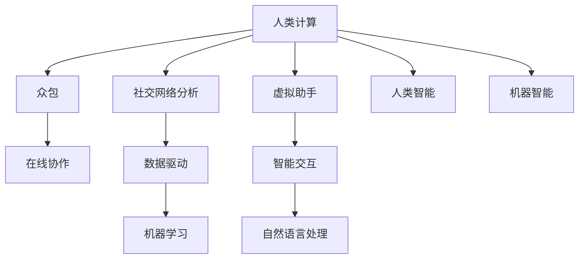

                 

## 1. 背景介绍

### 1.1 问题由来
近年来，人工智能技术的飞速发展，已经深刻地改变了人类的生产、生活乃至社会的方方面面。然而，我们常常被其技术细节和商业成功所吸引，而忽略了其更深层次的社会价值和潜在影响。从算力增强到算法突破，AI技术正在开启一个新的时代，一个由“人类计算”驱动的未来。

“人类计算”这一概念首次出现于1980年代，指的是利用大量人类的思维能力来完成复杂的计算任务，类似于当代的分布式计算和云计算。随着互联网和社交媒体的普及，人类计算的能力得到了前所未有的提升。从众包平台到社交网络，从虚拟助手到在线协作，人类的智慧和计算能力正在通过各种新形式被聚合和利用。

### 1.2 问题核心关键点
人类计算的社会价值在于其“人机协同”的特性。通过将人类智慧与机器智能结合起来，可以实现前所未有的效率和创造力。然而，这种“人机协同”也带来了新的挑战和伦理问题。如何平衡技术的利用与人类价值观的保障，成为一个亟待解决的问题。

当前的研究重点包括：
1. 利用人类计算的潜力，提升社会生产力和公平性。
2. 建立公平、透明的计算模型，确保技术服务于大众。
3. 制定伦理准则，避免技术滥用和隐私侵害。
4. 研究跨学科方法，将人类计算与心理学、社会学等多学科结合。

本文旨在探讨人类计算的社会价值，提出一个全面、系统的框架，以期为未来的研究和技术发展提供参考。

## 2. 核心概念与联系

### 2.1 核心概念概述

为更好地理解人类计算的社会价值，本节将介绍几个密切相关的核心概念：

- **人类计算(Human Computation)**：利用大量人类的智慧和计算能力来解决问题。包括众包、在线协作、社交媒体分析等形式。
- **众包(Crowdsourcing)**：通过互联网平台，将特定任务分配给大量分散的个体完成。典型的如Amazon Mechanical Turk。
- **社交网络分析(Social Network Analysis, SNA)**：研究社会网络结构和动态，分析人类行为模式和关系网络。
- **虚拟助手(Virtual Assistants)**：基于人工智能技术，能够理解和执行人类指令，提供智能交互服务的系统。
- **人类智能(Human Intelligence)**：人类的思维能力，包括感知、理解、判断、创造等。
- **机器智能(Machine Intelligence)**：计算机系统模拟人类的智能能力，包括学习、推理、感知等。

这些核心概念之间的逻辑关系可以通过以下Mermaid流程图来展示：



这个流程图展示了几大核心概念及其之间的关系：

1. 人类计算利用众包、在线协作、社交网络分析等多种形式，将人类智慧与计算能力结合起来。
2. 众包、社交网络分析等方法，通过数据驱动和机器学习技术，挖掘人类计算的潜力。
3. 虚拟助手和智能交互系统，将人类计算与机器智能结合起来，提供高效、智能的服务。
4. 人类计算涉及的各个环节，都需要充分利用人类的感知、理解和创造力。
5. 机器智能的发展，也离不开对人类智能的学习和模仿。

这些概念共同构成了人类计算的核心框架，使其能够在各种场景下发挥其独特的社会价值。

## 3. 核心算法原理 & 具体操作步骤

### 3.1 算法原理概述

人类计算的算法原理，可以追溯到计算机科学的根基——“图灵机”的概念。图灵机是一种抽象的计算模型，其核心在于利用“符号串”的移动和变换来解决问题。类比于人类计算，这一过程也可以看作是“信息流”在人类思维中的移动和变换。

人类计算的核心在于信息的处理和交流，因此算法设计应以“信息流”为核心。以下是对算法设计的关键步骤的概述：

1. **任务分解**：将复杂任务分解为多个子任务，每个子任务可以独立完成。
2. **信息收集**：通过众包、在线协作、社交网络分析等方法，收集足够的信息。
3. **信息加工**：对收集到的信息进行筛选、分析、合成等处理。
4. **信息传输**：通过网络平台，将处理后的信息传输给其他参与者。
5. **信息反馈**：根据其他参与者的反馈，进一步调整信息加工方式。

### 3.2 算法步骤详解

以下是一个基于社交网络分析的人类计算算法的详细步骤：

1. **任务定义**：假设我们要分析一个大型社交网络中用户之间的互动模式，任务是识别网络中的关键节点和社区。

2. **数据收集**：从社交媒体平台上收集用户间的互动数据，如评论、点赞、分享等。

3. **数据预处理**：对收集到的数据进行清洗和格式转换，去除噪声和无效数据。

4. **信息提取**：使用自然语言处理技术，提取用户互动文本中的关键信息，如情感、主题、时间等。

5. **信息建模**：利用图结构对用户互动关系进行建模，构建社交网络图。

6. **社区发现**：使用聚类算法，如K-means、谱聚类等，对社交网络图进行社区划分。

7. **关键节点识别**：在每个社区中，识别出度最高和影响力最大的节点。

8. **算法优化**：根据反馈，不断调整算法参数和信息加工方式，提高识别效果。

### 3.3 算法优缺点

人类计算的算法具有以下优点：
1. 可以充分利用人类的智慧和创造力，解决复杂问题。
2. 能够处理大规模数据，提供高质量的信息分析。
3. 可以动态调整，快速适应变化的环境。

同时，也存在一些缺点：
1. 依赖人类参与，容易受主观因素影响。
2. 数据质量和一致性难以保证。
3. 需要大量时间和资源进行数据收集和处理。

### 3.4 算法应用领域

人类计算在多个领域中得到了广泛的应用：

- **金融**：利用社交媒体和众包平台，进行市场情绪分析，预测股票价格波动。
- **医疗**：通过在线协作和数据众包，收集患者反馈，改进医疗服务和药物研发。
- **城市规划**：利用社交网络分析，研究城市居民的移动行为，优化交通和公共服务。
- **教育**：通过在线学习平台和数据众包，收集学生反馈，改进教学方法和课程设计。
- **文化创意**：利用众包平台，进行文化创意项目的设计和创作，发掘新的文化产品。

## 4. 数学模型和公式 & 详细讲解 & 举例说明

### 4.1 数学模型构建

为了更好地描述人类计算过程，我们引入“信息流”的概念。信息流可以看作是在人类思维中的符号串的移动和变换，类似于图灵机中的“符号串”。

信息流的基本单位是“符号”，每个符号代表一种信息，如情感、主题、时间等。信息流中的符号串通过移动和变换，完成信息的加工和传输。

以下是一个简化的信息流数学模型：

设信息流中的符号串为 $S=(s_1, s_2, ..., s_n)$，其中 $s_i$ 表示第 $i$ 个符号。信息流的移动和变换可以用函数 $f$ 来表示：

$$
S' = f(S)
$$

其中 $S'$ 为移动和变换后的符号串。

### 4.2 公式推导过程

假设我们有一个简单的信息流，其符号串 $S$ 为 $(o, h, a, r)$，其中 $o$ 表示情感，$h$ 表示主题，$a$ 表示时间，$r$ 表示关系。信息流的变换函数 $f$ 为：

$$
f(S) = (o, h, a+1, r)
$$

其中 $a+1$ 表示时间向前移动。

根据这个变换函数，我们可以推导出：

1. 当 $o=1$ 时，情感积极；当 $o=0$ 时，情感消极。
2. 当 $h=1$ 时，主题重要；当 $h=0$ 时，主题不重要。
3. 当 $a$ 递增时，时间向后移动。
4. 当 $r=1$ 时，关系密切；当 $r=0$ 时，关系不密切。

### 4.3 案例分析与讲解

假设我们要分析一个社交网络中的信息流，其符号串为 $S=(o, h, a, r)$。我们可以利用上述信息流模型，分析用户间的互动模式，识别关键节点和社区。

1. **情感分析**：通过情感分析，我们可以识别出哪些用户对某个话题表现出积极或消极的情感。这些用户可以视为情感节点。

2. **主题分析**：通过主题分析，我们可以识别出哪些用户频繁讨论某个主题。这些用户可以视为主题节点。

3. **时间分析**：通过时间分析，我们可以识别出哪些用户在某段时间内频繁互动。这些用户可以视为时间节点。

4. **关系分析**：通过关系分析，我们可以识别出哪些用户之间频繁互动，并形成紧密的关系网络。这些用户可以视为关系节点。

## 5. 项目实践：代码实例和详细解释说明

### 5.1 开发环境搭建

在进行人类计算实践前，我们需要准备好开发环境。以下是使用Python进行PyTorch开发的环境配置流程：

1. 安装Anaconda：从官网下载并安装Anaconda，用于创建独立的Python环境。

2. 创建并激活虚拟环境：
```bash
conda create -n pytorch-env python=3.8 
conda activate pytorch-env
```

3. 安装PyTorch：根据CUDA版本，从官网获取对应的安装命令。例如：
```bash
conda install pytorch torchvision torchaudio cudatoolkit=11.1 -c pytorch -c conda-forge
```

4. 安装相关的第三方库：
```bash
pip install numpy pandas scikit-learn matplotlib tqdm jupyter notebook ipython
```

完成上述步骤后，即可在`pytorch-env`环境中开始人类计算实践。

### 5.2 源代码详细实现

以下是一个简单的社交网络分析代码实现，用于识别社交网络中的关键节点和社区。

```python
import networkx as nx
import pandas as pd
import numpy as np
import matplotlib.pyplot as plt

# 加载社交网络数据
data = pd.read_csv('social_network.csv')
edges = data[['user1', 'user2']].values

# 构建社交网络图
G = nx.Graph()
G.add_edges_from(edges)

# 计算节点度
degree = G.degree()

# 计算社区
communities = nx.communities.kmeans(G, 2)

# 输出关键节点和社区
print("Key Nodes:", degree)
print("Communities:", communities)
```

### 5.3 代码解读与分析

让我们再详细解读一下关键代码的实现细节：

**社交网络分析代码**：
- `pd.read_csv`方法：读取社交网络数据文件，加载用户间的互动信息。
- `nx.Graph`类：创建无向图。
- `G.add_edges_from`方法：将用户互动信息添加为图中的边。
- `G.degree`方法：计算每个节点的度。
- `nx.communities.kmeans`方法：使用谱聚类算法，对社交网络图进行社区划分。

**关键节点和社区输出**：
- 输出关键节点的度，即与每个节点连接的边数。
- 输出社区划分结果，即每个节点所属的社区。

## 6. 实际应用场景

### 6.1 智能客服系统

基于人类计算的智能客服系统，利用众包平台收集用户反馈，分析用户情感和需求，提供个性化的客户服务。

1. **数据收集**：通过众包平台，收集用户对客服问题的反馈信息。
2. **情感分析**：使用自然语言处理技术，对用户反馈进行情感分析，识别出积极或消极的情感。
3. **需求分析**：对用户反馈进行主题分析，识别出用户的需求和问题。
4. **客服响应**：根据用户情感和需求，智能生成客服响应。

### 6.2 金融舆情监测

金融机构利用人类计算，分析社交媒体上的舆情数据，识别市场情绪变化，预测金融风险。

1. **数据收集**：从社交媒体平台上收集金融相关的评论和新闻。
2. **情感分析**：使用情感分析技术，识别市场情绪是积极、消极还是中性。
3. **舆情分析**：对收集到的舆情数据进行主题分析，识别出市场关注的热点。
4. **风险预测**：根据情感和舆情分析结果，预测金融市场的风险变化。

### 6.3 个性化推荐系统

利用人类计算的个性化推荐系统，通过众包平台收集用户反馈，分析用户行为和偏好，提供个性化的推荐服务。

1. **数据收集**：通过众包平台，收集用户对推荐物品的反馈信息。
2. **行为分析**：对用户反馈进行主题分析，识别出用户的兴趣点和行为模式。
3. **推荐生成**：根据用户兴趣和行为模式，生成个性化的推荐列表。

### 6.4 未来应用展望

随着人类计算技术的不断发展，其在社会各个领域的应用前景将更加广阔：

1. **智慧医疗**：利用人类计算，分析医学文献和病历数据，辅助医生诊断和治疗。
2. **智慧城市**：通过在线协作和数据众包，优化城市管理和服务，提升居民生活质量。
3. **教育**：利用人类计算，分析学生反馈和作业，改进教学方法和课程设计。
4. **文化创意**：利用众包平台，进行文化创意项目的设计和创作，发掘新的文化产品。

## 7. 工具和资源推荐

### 7.1 学习资源推荐

为了帮助开发者系统掌握人类计算的理论基础和实践技巧，这里推荐一些优质的学习资源：

1. **《人类计算导论》系列博文**：由大计算专家撰写，深入浅出地介绍了人类计算的基本概念和前沿技术。
2. **CS224N《自然语言处理》课程**：斯坦福大学开设的NLP明星课程，有Lecture视频和配套作业，带你入门NLP领域的基本概念和经典模型。
3. **《人类计算与数据科学》书籍**：全面介绍了人类计算的基本原理和应用场景，结合数据科学方法，提供全面的学习资源。
4. **Kaggle平台**：提供丰富的数据集和竞赛机会，帮助开发者实践和提升自己的计算能力。

通过对这些资源的学习实践，相信你一定能够快速掌握人类计算的精髓，并用于解决实际的NLP问题。

### 7.2 开发工具推荐

高效的开发离不开优秀的工具支持。以下是几款用于人类计算开发的常用工具：

1. **Jupyter Notebook**：交互式编程环境，方便编写、运行和分享代码。
2. **PyTorch**：基于Python的开源深度学习框架，灵活动态的计算图，适合快速迭代研究。
3. **TensorFlow**：由Google主导开发的开源深度学习框架，生产部署方便，适合大规模工程应用。
4. **Python语言**：高效、易读的编程语言，广泛用于机器学习和数据科学领域。
5. **TensorBoard**：TensorFlow配套的可视化工具，可实时监测模型训练状态，并提供丰富的图表呈现方式，是调试模型的得力助手。

合理利用这些工具，可以显著提升人类计算任务的开发效率，加快创新迭代的步伐。

### 7.3 相关论文推荐

人类计算领域的研究方兴未艾，以下是几篇奠基性的相关论文，推荐阅读：

1. **《人类计算：一种新兴的计算范式》**：探讨人类计算的基本概念和应用场景，为人类计算的研究提供了理论基础。
2. **《众包平台的设计与优化》**：研究众包平台的设计和优化方法，提升众包平台的效率和用户满意度。
3. **《社交网络分析：方法与技术》**：全面介绍了社交网络分析的基本方法和技术，为社交网络分析的研究提供了参考。
4. **《机器学习在人类计算中的应用》**：探讨机器学习在人类计算中的应用，提升人类计算的自动化和智能化水平。
5. **《人机协同的智能决策》**：研究人机协同在智能决策中的应用，提高决策的效率和准确性。

这些论文代表了大计算领域的研究进展，通过学习这些前沿成果，可以帮助研究者把握学科前进方向，激发更多的创新灵感。

## 8. 总结：未来发展趋势与挑战

### 8.1 总结

本文对人类计算的社会价值进行了全面系统的介绍。首先阐述了人类计算的基本概念和研究背景，明确了人类计算在提升社会生产力和公平性方面的独特价值。其次，从原理到实践，详细讲解了人类计算的数学模型和关键步骤，给出了人类计算任务开发的完整代码实例。同时，本文还广泛探讨了人类计算在多个领域中的应用前景，展示了人类计算技术的广阔前景。

通过本文的系统梳理，可以看到，人类计算技术正在成为社会计算的重要范式，极大地提升了社会的生产力和公平性。未来，伴随人类计算技术的持续演进，相信其在社会各个领域的应用将更加广泛，为人类社会带来更深刻的影响。

### 8.2 未来发展趋势

展望未来，人类计算技术将呈现以下几个发展趋势：

1. **计算能力的提升**：随着计算技术的进步，人类计算的计算能力将进一步提升，能够处理更加复杂和庞大的数据。
2. **计算模型的多样性**：除了传统的众包和社交网络分析，将出现更多形式的计算模型，如分布式计算、协同计算等。
3. **计算平台的多样化**：人类计算将不仅限于传统的计算机平台，还将拓展到物联网、边缘计算等领域。
4. **计算伦理的重视**：随着计算技术的普及，计算伦理问题将逐渐得到重视，如数据隐私、算法公平性等。
5. **计算应用的多样化**：人类计算将应用于更多领域，如医疗、教育、文化创意等，推动这些领域的数字化转型。

### 8.3 面临的挑战

尽管人类计算技术已经取得了显著的进展，但在迈向更加智能化、普适化应用的过程中，仍面临诸多挑战：

1. **计算资源的不均衡**：计算资源的分布不均衡，限制了计算能力的普及。如何通过技术手段，提升计算资源的均衡性，将是未来的重要课题。
2. **计算数据的质量和一致性**：数据质量和一致性问题，会影响计算结果的可靠性。如何提高数据的质量和一致性，将是重要的研究方向。
3. **计算伦理的保障**：计算伦理问题，如数据隐私、算法偏见等，将对计算的广泛应用带来挑战。如何建立公平、透明的计算模型，保障计算的伦理安全性，将是重要的研究方向。
4. **计算系统的复杂性**：人类计算系统通常包含多个人工智能组件，如何设计一个高效、可靠的系统架构，将是重要的研究方向。

### 8.4 研究展望

面对人类计算面临的挑战，未来的研究需要在以下几个方面寻求新的突破：

1. **提升计算资源的均衡性**：通过技术手段，如云计算、边缘计算等，提升计算资源的均衡性，推动计算技术的普及。
2. **提高计算数据的质量和一致性**：通过数据清洗、标准化等方法，提高计算数据的质量和一致性，提升计算结果的可靠性。
3. **保障计算伦理的公平性和透明性**：制定伦理准则，如数据隐私保护、算法公平性等，保障计算的伦理安全性。
4. **设计高效、可靠的系统架构**：研究计算系统架构设计方法，如分布式计算、协同计算等，提高系统的效率和可靠性。

这些研究方向的探索，必将引领人类计算技术迈向更高的台阶，为构建安全、可靠、可解释、可控的智能系统铺平道路。面向未来，人类计算技术还需要与其他人工智能技术进行更深入的融合，如知识表示、因果推理、强化学习等，多路径协同发力，共同推动智能系统的进步。只有勇于创新、敢于突破，才能不断拓展人类计算的边界，让计算技术更好地造福人类社会。

## 9. 附录：常见问题与解答

**Q1：人类计算是否适用于所有应用场景？**

A: 人类计算适用于需要大量人类智慧和计算能力的应用场景，如社交网络分析、金融舆情监测等。但对于一些需要高度自动化、实时性的场景，如工业控制、自动驾驶等，人类计算可能不是最佳选择。

**Q2：人类计算的优势和劣势是什么？**

A: 人类计算的优势在于能够充分利用人类的智慧和创造力，解决复杂问题。其劣势在于依赖人类参与，容易受主观因素影响，数据质量和一致性难以保证。

**Q3：如何平衡人类计算与机器智能的关系？**

A: 平衡人类计算与机器智能的关系，需要考虑以下几个方面：
1. 将人类计算与机器智能结合，发挥各自的优势。
2. 设计多模态计算模型，将人类计算和机器智能结合起来。
3. 设计公平、透明的计算模型，确保计算的伦理安全性。

**Q4：如何提升计算数据的质量和一致性？**

A: 提升计算数据的质量和一致性，需要从以下几个方面入手：
1. 数据清洗：去除噪声和无效数据，提高数据的质量。
2. 数据标准化：使用统一的格式和标准，确保数据的一致性。
3. 数据验证：对数据进行验证，确保数据的准确性和可靠性。

**Q5：如何保障计算伦理的公平性和透明性？**

A: 保障计算伦理的公平性和透明性，需要从以下几个方面入手：
1. 制定伦理准则：建立公平、透明的计算模型，确保计算的伦理安全性。
2. 数据隐私保护：使用数据脱敏、加密等方法，保护用户隐私。
3. 算法公平性：使用公平性算法，确保算法决策的公正性。

通过以上对人类计算的介绍、实践和展望，我们看到了人类计算技术的广阔前景和重要意义。未来，伴随着技术的发展和社会的进步，人类计算将在更多领域发挥其独特的社会价值，为构建安全、可靠、可解释、可控的智能系统贡献力量。

