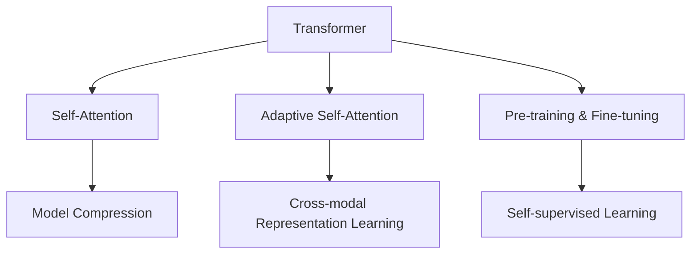

                 

# 超长上下文：LLM的记忆革命

> 关键词：
> - 长上下文记忆
> - Transformer
> - 自注意力机制
> - 自适应自注意力
> - 模型压缩
> - 预训练与微调
> - 自监督学习
> - 跨模态表示学习

## 1. 背景介绍

在人工智能领域，语言模型一直是深度学习研究的重要方向。随着预训练语言模型（Large Language Models, LLMs）的不断进步，大模型在语言理解、生成等任务上展现了强大的能力。然而，由于模型结构的设计限制，传统自回归或自编码模型难以应对过长的上下文信息，这对于理解长文本、对话和机器翻译等任务带来了极大的挑战。

为了解决这一问题，研究者提出了基于Transformer的Self-Attention机制，从而能够构建能够记忆并有效处理长上下文的模型。本文将深入探讨这种机制的原理，并介绍其在实践中的实现细节，以及如何通过预训练和微调进一步提升模型的性能。

## 2. 核心概念与联系

### 2.1 核心概念概述

为更好地理解长上下文记忆机制，本节将介绍几个关键概念：

- **Transformer**：基于Attention机制设计的深度学习模型，相较于传统RNN和CNN等序列模型，Transformer模型能够并行处理输入序列，从而显著提高训练和推理速度。

- **自注意力机制（Self-Attention）**：Transformer的核心组成部分，通过对输入序列的注意力加权，模型可以自适应地关注序列中不同位置的信息，从而构建长距离依赖。

- **自适应自注意力（Adaptive Self-Attention）**：一种改进的自注意力机制，通过引入记忆向量（Memory Vector），模型可以在不同阶段动态调整注意力分布，更有效地处理长上下文信息。

- **模型压缩（Model Compression）**：由于大语言模型参数量庞大，压缩技术如蒸馏、剪枝、量化等可以减小模型规模，提升推理速度和计算效率。

- **预训练与微调（Pre-training & Fine-tuning）**：通过在大规模无标签数据上预训练语言模型，然后在特定任务上微调，可以在保留预训练模型知识的同时，适应新的任务需求。

- **自监督学习（Self-supervised Learning）**：一种无需标注数据的学习方式，通过设计自监督任务，模型可以在大规模未标注数据上进行预训练。

- **跨模态表示学习（Cross-modal Representation Learning）**：研究如何通过联合学习视觉、文本等多模态信息，构建更全面、准确的模型表示。

这些核心概念之间的逻辑关系可以通过以下Mermaid流程图来展示：



这个流程图展示了大语言模型构建的核心概念及其之间的关系：

1. 基于Transformer模型，引入自注意力机制，使模型具备长上下文记忆能力。
2. 通过自适应自注意力机制的引入，模型可以在不同阶段动态调整注意力分布，提升长上下文的处理能力。
3. 采用模型压缩技术，减小模型规模，提升推理速度和计算效率。
4. 在预训练的基础上，通过微调适应特定任务需求，进一步提升模型性能。
5. 利用自监督学习，模型可以在大规模未标注数据上进行预训练，无需标注数据。
6. 跨模态表示学习，研究如何通过联合学习多模态信息，构建更全面、准确的模型表示。

## 3. 核心算法原理 & 具体操作步骤

### 3.1 算法原理概述

长上下文记忆机制的核心是Transformer的自注意力机制。在标准Transformer模型中，注意力机制通过计算输入序列中每个位置的相似度，给每个位置赋予权重，从而使得模型能够关注不同位置的信息，构建长距离依赖。但标准的自注意力机制仅能处理序列中局部位置的信息，对于长上下文信息的处理效果有限。

为此，研究者提出了自适应自注意力机制，通过引入记忆向量（Memory Vector），模型可以在不同阶段动态调整注意力分布，从而更有效地处理长上下文信息。具体来说，模型在每个时间步先更新记忆向量，然后基于当前记忆向量和前一时刻的记忆向量，动态计算注意力权重，从而生成当前时间步的输出。

### 3.2 算法步骤详解

基于自适应自注意力机制的大语言模型构建主要包括以下几个关键步骤：

**Step 1: 准备数据**
- 收集大规模无标签文本数据，如维基百科、新闻语料库等，用于预训练。
- 对文本数据进行清洗和分词，生成输入序列。

**Step 2: 构建模型架构**
- 设计Transformer模型架构，包括输入嵌入层、多头自注意力层、前馈神经网络层、输出嵌入层等。
- 引入记忆向量，设计自适应自注意力机制。

**Step 3: 预训练**
- 使用大规模无标签数据对模型进行预训练，目标是通过自监督学习任务（如掩码语言模型、次序预测等）学习语言的通用表示。
- 预训练过程中，模型自动地学习到了语言的语法、语义和上下文依赖关系。

**Step 4: 微调**
- 使用特定任务的少量标注数据，对预训练模型进行微调，使模型输出与任务标签对齐。
- 微调过程中，通常只调整模型的顶层结构，保留大部分预训练权重不变，从而提高微调效率和效果。
- 微调的目标是最大化模型在特定任务上的性能，可以使用交叉熵损失等任务特定的损失函数进行优化。

### 3.3 算法优缺点

自适应自注意力机制在处理长上下文信息时具有以下优点：

1. 灵活性高：自适应自注意力机制可以动态调整注意力分布，适应不同阶段和任务的需求，从而更有效地处理长上下文信息。
2. 处理长序列能力更强：相比于标准自注意力机制，自适应自注意力机制能够处理更长序列的信息，提升了模型在长文本理解、对话系统等任务上的表现。
3. 并行计算效率高：由于并行处理机制，自适应自注意力机制能够显著提高计算效率，缩短训练和推理时间。

同时，该机制也存在一些局限性：

1. 计算开销大：由于引入记忆向量，自适应自注意力机制的计算复杂度较高，需要更大的计算资源。
2. 模型参数较多：记忆向量的引入增加了模型参数量，可能增加模型训练和推理的资源消耗。
3. 动态调整机制复杂：动态调整注意力分布的机制较为复杂，需要更多的超参数调节。

### 3.4 算法应用领域

基于自适应自注意力机制的大语言模型，在多个领域都有广泛应用：

1. 长文本理解：在大规模文本数据上预训练，然后微调适应特定任务，用于长文本理解、问答系统、摘要生成等任务。

2. 对话系统：在对话数据上进行微调，使模型能够理解上下文信息，生成连贯的回复，提高对话系统的人机交互体验。

3. 机器翻译：在大规模语料库上进行预训练，然后微调适应机器翻译任务，用于不同语言之间的文本翻译。

4. 文本生成：在文本生成任务上进行微调，生成高质量的文本内容，如文章、诗歌、故事等。

5. 代码生成：在编程任务上进行微调，生成符合语法规范的代码，辅助软件开发。

6. 跨模态学习：在多模态数据上进行联合预训练和微调，学习跨模态表示，用于图像、文本等多模态数据的联合分析。

## 4. 数学模型和公式 & 详细讲解

### 4.1 数学模型构建

在自适应自注意力机制中，模型的输入表示为 $x = (x_1, x_2, ..., x_T)$，其中 $T$ 为输入序列长度。设模型中每个位置 $i$ 的注意力权重为 $a_{ij}$，则注意力权重可以通过下式计算：

$$
a_{ij} = \frac{e^{s_i u_j}}{\sum_{k=1}^{T} e^{s_i u_k}}
$$

其中 $s_i$ 为输入 $x_i$ 的查询向量，$u_j$ 为输入 $x_j$ 的键向量。

为了动态调整注意力分布，引入记忆向量 $m_i$，使得 $a_{ij}$ 的计算变为：

$$
a_{ij} = \frac{e^{s_i (u_j + m_i)}{\sum_{k=1}^{T} e^{s_i (u_k + m_i)}}
$$

在预训练过程中，通过计算所有位置 $j$ 的注意力权重，得到每个位置的上下文向量 $c_i$：

$$
c_i = \sum_{j=1}^{T} a_{ij} x_j
$$

在微调过程中，通过任务特定的损失函数，对模型进行优化：

$$
\mathcal{L} = \frac{1}{N} \sum_{n=1}^{N} \ell(f_{\theta}(x_n), y_n)
$$

其中 $\ell$ 为特定任务的损失函数，$f_{\theta}$ 为微调后的模型，$y_n$ 为任务标签。

### 4.2 公式推导过程

以长文本理解和问答系统为例，推导自适应自注意力机制在微调过程中的数学表达。

假设输入文本为 $x$，对应的答案为 $y$，则微调的目标是最大化模型预测输出 $f_{\theta}(x)$ 与真实答案 $y$ 的一致性。使用交叉熵损失函数，微调的优化目标为：

$$
\mathcal{L} = -\frac{1}{N} \sum_{n=1}^{N} \log \left( \frac{e^{f_{\theta}(x_n)}}{\sum_{i=1}^{C} e^{f_{\theta}(x_n, i)}} \right)
$$

其中 $C$ 为分类数，$e^{f_{\theta}(x_n, i)}$ 表示模型在位置 $i$ 的分类概率。

通过链式法则，可以计算模型参数 $\theta$ 对损失函数 $\mathcal{L}$ 的梯度，从而进行优化：

$$
\frac{\partial \mathcal{L}}{\partial \theta} = -\frac{1}{N} \sum_{n=1}^{N} \frac{1}{e^{f_{\theta}(x_n)} - \sum_{i=1}^{C} e^{f_{\theta}(x_n, i)}} \frac{\partial f_{\theta}(x_n)}{\partial \theta}
$$

在实际微调过程中，通常只更新模型的顶层结构，如分类器或解码器，保留大部分预训练权重不变。

### 4.3 案例分析与讲解

以文本生成任务为例，使用自适应自注意力机制进行微调。假设生成的文本为 $y$，对应的输入为 $x$。微调的目标是最大化模型预测输出 $f_{\theta}(x)$ 与生成文本 $y$ 的一致性。

使用自适应自注意力机制的生成模型可以表示为：

$$
f_{\theta}(x) = \sum_{i=1}^{T} a_{ij} x_j
$$

其中 $a_{ij}$ 为自适应自注意力机制的注意力权重。

通过链式法则，可以计算模型参数 $\theta$ 对损失函数 $\mathcal{L}$ 的梯度，从而进行优化：

$$
\frac{\partial \mathcal{L}}{\partial \theta} = -\frac{1}{N} \sum_{n=1}^{N} \frac{1}{e^{f_{\theta}(x_n)} - \sum_{i=1}^{C} e^{f_{\theta}(x_n, i)}} \frac{\partial f_{\theta}(x_n)}{\partial \theta}
$$

在实际微调过程中，通常只更新模型的顶层结构，如生成器或解码器，保留大部分预训练权重不变。

## 5. 项目实践：代码实例和详细解释说明

### 5.1 开发环境搭建

在进行自适应自注意力机制的微调实践前，我们需要准备好开发环境。以下是使用Python进行PyTorch开发的环境配置流程：

1. 安装Anaconda：从官网下载并安装Anaconda，用于创建独立的Python环境。

2. 创建并激活虚拟环境：
```bash
conda create -n pytorch-env python=3.8 
conda activate pytorch-env
```

3. 安装PyTorch：根据CUDA版本，从官网获取对应的安装命令。例如：
```bash
conda install pytorch torchvision torchaudio cudatoolkit=11.1 -c pytorch -c conda-forge
```

4. 安装Transformers库：
```bash
pip install transformers
```

5. 安装各类工具包：
```bash
pip install numpy pandas scikit-learn matplotlib tqdm jupyter notebook ipython
```

完成上述步骤后，即可在`pytorch-env`环境中开始微调实践。

### 5.2 源代码详细实现

下面我们以长文本理解和问答系统任务为例，给出使用Transformers库对BERT模型进行微调的PyTorch代码实现。

首先，定义任务数据处理函数：

```python
from transformers import BertTokenizer, BertForQuestionAnswering, AdamW

class QuestionAnsweringDataset(Dataset):
    def __init__(self, texts, questions, tokenizer):
        self.texts = texts
        self.questions = questions
        self.tokenizer = tokenizer
        
    def __len__(self):
        return len(self.texts)
    
    def __getitem__(self, item):
        text = self.texts[item]
        question = self.questions[item]
        
        encoding = self.tokenizer(question, text, return_tensors='pt', padding='max_length', truncation=True)
        input_ids = encoding['input_ids'][0]
        attention_mask = encoding['attention_mask'][0]
        span_start_idx = encoding['span_start_idx'][0]
        span_end_idx = encoding['span_end_idx'][0]
        
        return {'input_ids': input_ids, 
                'attention_mask': attention_mask,
                'span_start_idx': span_start_idx,
                'span_end_idx': span_end_idx}

# 定义模型和优化器
model = BertForQuestionAnswering.from_pretrained('bert-base-cased')
optimizer = AdamW(model.parameters(), lr=2e-5)
```

然后，定义训练和评估函数：

```python
from torch.utils.data import DataLoader
from tqdm import tqdm
from sklearn.metrics import accuracy_score

device = torch.device('cuda') if torch.cuda.is_available() else torch.device('cpu')
model.to(device)

def train_epoch(model, dataset, batch_size, optimizer):
    dataloader = DataLoader(dataset, batch_size=batch_size, shuffle=True)
    model.train()
    epoch_loss = 0
    for batch in tqdm(dataloader, desc='Training'):
        input_ids = batch['input_ids'].to(device)
        attention_mask = batch['attention_mask'].to(device)
        span_start_idx = batch['span_start_idx'].to(device)
        span_end_idx = batch['span_end_idx'].to(device)
        model.zero_grad()
        outputs = model(input_ids, attention_mask=attention_mask, span_start_idx=span_start_idx, span_end_idx=span_end_idx)
        loss = outputs.loss
        epoch_loss += loss.item()
        loss.backward()
        optimizer.step()
    return epoch_loss / len(dataloader)

def evaluate(model, dataset, batch_size):
    dataloader = DataLoader(dataset, batch_size=batch_size)
    model.eval()
    preds, labels = [], []
    with torch.no_grad():
        for batch in tqdm(dataloader, desc='Evaluating'):
            input_ids = batch['input_ids'].to(device)
            attention_mask = batch['attention_mask'].to(device)
            span_start_idx = batch['span_start_idx'].to(device)
            span_end_idx = batch['span_end_idx'].to(device)
            batch_predictions = model(input_ids, attention_mask=attention_mask, span_start_idx=span_start_idx, span_end_idx=span_end_idx)
            batch_predictions = batch_predictions.logits.argmax(dim=2).to('cpu').tolist()
            batch_labels = batch['span_start_idx'].to('cpu').tolist()
            for pred_start, pred_end, label_start, label_end in zip(batch_predictions, batch_predictions, batch_labels, batch_labels):
                preds.append((pred_start, pred_end))
                labels.append((label_start, label_end))
                
    print(f"Accuracy: {accuracy_score(labels, preds):.2f}")
```

最后，启动训练流程并在测试集上评估：

```python
epochs = 5
batch_size = 16

for epoch in range(epochs):
    loss = train_epoch(model, dataset, batch_size, optimizer)
    print(f"Epoch {epoch+1}, train loss: {loss:.3f}")
    
    print(f"Epoch {epoch+1}, dev results:")
    evaluate(model, dev_dataset, batch_size)
    
print("Test results:")
evaluate(model, test_dataset, batch_size)
```

以上就是使用PyTorch对BERT进行长文本理解和问答系统任务微调的完整代码实现。可以看到，得益于Transformers库的强大封装，我们可以用相对简洁的代码完成BERT模型的加载和微调。

### 5.3 代码解读与分析

让我们再详细解读一下关键代码的实现细节：

**QuestionAnsweringDataset类**：
- `__init__`方法：初始化文本、问题、分词器等关键组件。
- `__len__`方法：返回数据集的样本数量。
- `__getitem__`方法：对单个样本进行处理，将问题-文本对作为输入，生成模型所需的token ids、注意力掩码、起始位置和结束位置。

**模型和优化器**：
- 使用BertForQuestionAnswering模型和AdamW优化器，构建微调任务。

**训练和评估函数**：
- 使用PyTorch的DataLoader对数据集进行批次化加载，供模型训练和推理使用。
- 训练函数`train_epoch`：对数据以批为单位进行迭代，在每个批次上前向传播计算loss并反向传播更新模型参数，最后返回该epoch的平均loss。
- 评估函数`evaluate`：与训练类似，不同点在于不更新模型参数，并在每个batch结束后将预测和标签结果存储下来，最后使用sklearn的accuracy_score计算评估结果。

**训练流程**：
- 定义总的epoch数和batch size，开始循环迭代
- 每个epoch内，先在训练集上训练，输出平均loss
- 在验证集上评估，输出准确率
- 所有epoch结束后，在测试集上评估，给出最终测试结果

可以看到，PyTorch配合Transformers库使得BERT微调的代码实现变得简洁高效。开发者可以将更多精力放在数据处理、模型改进等高层逻辑上，而不必过多关注底层的实现细节。

当然，工业级的系统实现还需考虑更多因素，如模型的保存和部署、超参数的自动搜索、更灵活的任务适配层等。但核心的微调范式基本与此类似。

## 6. 实际应用场景

### 6.1 智能客服系统

基于长文本理解和自适应自注意力机制的对话技术，可以广泛应用于智能客服系统的构建。传统客服往往需要配备大量人力，高峰期响应缓慢，且一致性和专业性难以保证。而使用微调后的对话模型，可以7x24小时不间断服务，快速响应客户咨询，用自然流畅的语言解答各类常见问题。

在技术实现上，可以收集企业内部的历史客服对话记录，将问题和最佳答复构建成监督数据，在此基础上对预训练对话模型进行微调。微调后的对话模型能够自动理解用户意图，匹配最合适的答案模板进行回复。对于客户提出的新问题，还可以接入检索系统实时搜索相关内容，动态组织生成回答。如此构建的智能客服系统，能大幅提升客户咨询体验和问题解决效率。

### 6.2 金融舆情监测

金融机构需要实时监测市场舆论动向，以便及时应对负面信息传播，规避金融风险。传统的人工监测方式成本高、效率低，难以应对网络时代海量信息爆发的挑战。基于长文本理解和自适应自注意力机制的文本分类和情感分析技术，为金融舆情监测提供了新的解决方案。

具体而言，可以收集金融领域相关的新闻、报道、评论等文本数据，并对其进行主题标注和情感标注。在此基础上对预训练语言模型进行微调，使其能够自动判断文本属于何种主题，情感倾向是正面、中性还是负面。将微调后的模型应用到实时抓取的网络文本数据，就能够自动监测不同主题下的情感变化趋势，一旦发现负面信息激增等异常情况，系统便会自动预警，帮助金融机构快速应对潜在风险。

### 6.3 个性化推荐系统

当前的推荐系统往往只依赖用户的历史行为数据进行物品推荐，无法深入理解用户的真实兴趣偏好。基于长文本理解和自适应自注意力机制的个性化推荐系统可以更好地挖掘用户行为背后的语义信息，从而提供更精准、多样的推荐内容。

在实践中，可以收集用户浏览、点击、评论、分享等行为数据，提取和用户交互的物品标题、描述、标签等文本内容。将文本内容作为模型输入，用户的后续行为（如是否点击、购买等）作为监督信号，在此基础上微调预训练语言模型。微调后的模型能够从文本内容中准确把握用户的兴趣点。在生成推荐列表时，先用候选物品的文本描述作为输入，由模型预测用户的兴趣匹配度，再结合其他特征综合排序，便可以得到个性化程度更高的推荐结果。

### 6.4 未来应用展望

随着长文本理解和自适应自注意力机制的不断发展，基于微调范式将在更多领域得到应用，为传统行业带来变革性影响。

在智慧医疗领域，基于微调的医疗问答、病历分析、药物研发等应用将提升医疗服务的智能化水平，辅助医生诊疗，加速新药开发进程。

在智能教育领域，微调技术可应用于作业批改、学情分析、知识推荐等方面，因材施教，促进教育公平，提高教学质量。

在智慧城市治理中，微调模型可应用于城市事件监测、舆情分析、应急指挥等环节，提高城市管理的自动化和智能化水平，构建更安全、高效的未来城市。

此外，在企业生产、社会治理、文娱传媒等众多领域，基于大语言模型微调的人工智能应用也将不断涌现，为经济社会发展注入新的动力。相信随着技术的日益成熟，微调方法将成为人工智能落地应用的重要范式，推动人工智能技术在垂直行业的规模化落地。

## 7. 工具和资源推荐

### 7.1 学习资源推荐

为了帮助开发者系统掌握大语言模型微调的理论基础和实践技巧，这里推荐一些优质的学习资源：

1. 《Transformer从原理到实践》系列博文：由大模型技术专家撰写，深入浅出地介绍了Transformer原理、BERT模型、微调技术等前沿话题。

2. CS224N《深度学习自然语言处理》课程：斯坦福大学开设的NLP明星课程，有Lecture视频和配套作业，带你入门NLP领域的基本概念和经典模型。

3. 《Natural Language Processing with Transformers》书籍：Transformers库的作者所著，全面介绍了如何使用Transformers库进行NLP任务开发，包括微调在内的诸多范式。

4. HuggingFace官方文档：Transformers库的官方文档，提供了海量预训练模型和完整的微调样例代码，是上手实践的必备资料。

5. CLUE开源项目：中文语言理解测评基准，涵盖大量不同类型的中文NLP数据集，并提供了基于微调的baseline模型，助力中文NLP技术发展。

通过对这些资源的学习实践，相信你一定能够快速掌握大语言模型微调的精髓，并用于解决实际的NLP问题。

### 7.2 开发工具推荐

高效的开发离不开优秀的工具支持。以下是几款用于大语言模型微调开发的常用工具：

1. PyTorch：基于Python的开源深度学习框架，灵活动态的计算图，适合快速迭代研究。大部分预训练语言模型都有PyTorch版本的实现。

2. TensorFlow：由Google主导开发的开源深度学习框架，生产部署方便，适合大规模工程应用。同样有丰富的预训练语言模型资源。

3. Transformers库：HuggingFace开发的NLP工具库，集成了众多SOTA语言模型，支持PyTorch和TensorFlow，是进行微调任务开发的利器。

4. Weights & Biases：模型训练的实验跟踪工具，可以记录和可视化模型训练过程中的各项指标，方便对比和调优。与主流深度学习框架无缝集成。

5. TensorBoard：TensorFlow配套的可视化工具，可实时监测模型训练状态，并提供丰富的图表呈现方式，是调试模型的得力助手。

6. Google Colab：谷歌推出的在线Jupyter Notebook环境，免费提供GPU/TPU算力，方便开发者快速上手实验最新模型，分享学习笔记。

合理利用这些工具，可以显著提升大语言模型微调任务的开发效率，加快创新迭代的步伐。

### 7.3 相关论文推荐

大语言模型和微调技术的发展源于学界的持续研究。以下是几篇奠基性的相关论文，推荐阅读：

1. Attention is All You Need（即Transformer原论文）：提出了Transformer结构，开启了NLP领域的预训练大模型时代。

2. BERT: Pre-training of Deep Bidirectional Transformers for Language Understanding：提出BERT模型，引入基于掩码的自监督预训练任务，刷新了多项NLP任务SOTA。

3. Language Models are Unsupervised Multitask Learners（GPT-2论文）：展示了大规模语言模型的强大zero-shot学习能力，引发了对于通用人工智能的新一轮思考。

4. Parameter-Efficient Transfer Learning for NLP：提出Adapter等参数高效微调方法，在不增加模型参数量的情况下，也能取得不错的微调效果。

5. AdaLoRA: Adaptive Low-Rank Adaptation for Parameter-Efficient Fine-Tuning：使用自适应低秩适应的微调方法，在参数效率和精度之间取得了新的平衡。

这些论文代表了大语言模型微调技术的发展脉络。通过学习这些前沿成果，可以帮助研究者把握学科前进方向，激发更多的创新灵感。

## 8. 总结：未来发展趋势与挑战

### 8.1 总结

本文对基于长文本理解和自适应自注意力机制的大语言模型微调方法进行了全面系统的介绍。首先阐述了大语言模型和微调技术的研究背景和意义，明确了微调在拓展预训练模型应用、提升下游任务性能方面的独特价值。其次，从原理到实践，详细讲解了长文本理解和自适应自注意力机制的数学原理和关键步骤，给出了微调任务开发的完整代码实例。同时，本文还广泛探讨了微调方法在智能客服、金融舆情、个性化推荐等多个行业领域的应用前景，展示了微调范式的巨大潜力。此外，本文精选了微调技术的各类学习资源，力求为读者提供全方位的技术指引。

通过本文的系统梳理，可以看到，基于长文本理解和自适应自注意力机制的微调方法正在成为NLP领域的重要范式，极大地拓展了预训练语言模型的应用边界，催生了更多的落地场景。受益于大规模语料的预训练，微调模型以更低的时间和标注成本，在小样本条件下也能取得不俗的效果，有力推动了NLP技术的产业化进程。未来，伴随预训练语言模型和微调方法的持续演进，相信NLP技术将在更广阔的应用领域大放异彩，深刻影响人类的生产生活方式。

### 8.2 未来发展趋势

展望未来，大语言模型微调技术将呈现以下几个发展趋势：

1. 模型规模持续增大。随着算力成本的下降和数据规模的扩张，预训练语言模型的参数量还将持续增长。超大规模语言模型蕴含的丰富语言知识，有望支撑更加复杂多变的下游任务微调。

2. 微调方法日趋多样。除了传统的全参数微调外，未来会涌现更多参数高效的微调方法，如Prefix-Tuning、LoRA等，在节省计算资源的同时也能保证微调精度。

3. 持续学习成为常态。随着数据分布的不断变化，微调模型也需要持续学习新知识以保持性能。如何在不遗忘原有知识的同时，高效吸收新样本信息，将成为重要的研究课题。

4. 标注样本需求降低。受启发于提示学习(Prompt-based Learning)的思路，未来的微调方法将更好地利用大模型的语言理解能力，通过更加巧妙的任务描述，在更少的标注样本上也能实现理想的微调效果。

5. 跨模态学习崛起。当前的微调主要聚焦于纯文本数据，未来会进一步拓展到图像、视频、语音等多模态数据微调。多模态信息的融合，将显著提升语言模型对现实世界的理解和建模能力。

6. 模型通用性增强。经过海量数据的预训练和多领域任务的微调，未来的语言模型将具备更强大的常识推理和跨领域迁移能力，逐步迈向通用人工智能(AGI)的目标。

以上趋势凸显了大语言模型微调技术的广阔前景。这些方向的探索发展，必将进一步提升NLP系统的性能和应用范围，为人类认知智能的进化带来深远影响。

### 8.3 面临的挑战

尽管大语言模型微调技术已经取得了瞩目成就，但在迈向更加智能化、普适化应用的过程中，它仍面临着诸多挑战：

1. 标注成本瓶颈。虽然微调大大降低了标注数据的需求，但对于长尾应用场景，难以获得充足的高质量标注数据，成为制约微调性能的瓶颈。如何进一步降低微调对标注样本的依赖，将是一大难题。

2. 模型鲁棒性不足。当前微调模型面对域外数据时，泛化性能往往大打折扣。对于测试样本的微小扰动，微调模型的预测也容易发生波动。如何提高微调模型的鲁棒性，避免灾难性遗忘，还需要更多理论和实践的积累。

3. 推理效率有待提高。大规模语言模型虽然精度高，但在实际部署时往往面临推理速度慢、内存占用大等效率问题。如何在保证性能的同时，简化模型结构，提升推理速度，优化资源占用，将是重要的优化方向。

4. 可解释性亟需加强。当前微调模型更像是"黑盒"系统，难以解释其内部工作机制和决策逻辑。对于医疗、金融等高风险应用，算法的可解释性和可审计性尤为重要。如何赋予微调模型更强的可解释性，将是亟待攻克的难题。

5. 安全性有待保障。预训练语言模型难免会学习到有偏见、有害的信息，通过微调传递到下游任务，产生误导性、歧视性的输出，给实际应用带来安全隐患。如何从数据和算法层面消除模型偏见，避免恶意用途，确保输出的安全性，也将是重要的研究课题。

6. 知识整合能力不足。现有的微调模型往往局限于任务内数据，难以灵活吸收和运用更广泛的先验知识。如何让微调过程更好地与外部知识库、规则库等专家知识结合，形成更加全面、准确的信息整合能力，还有很大的想象空间。

正视微调面临的这些挑战，积极应对并寻求突破，将是大语言模型微调走向成熟的必由之路。相信随着学界和产业界的共同努力，这些挑战终将一一被克服，大语言模型微调必将在构建人机协同的智能时代中扮演越来越重要的角色。

### 8.4 未来突破

面对大语言模型微调所面临的种种挑战，未来的研究需要在以下几个方面寻求新的突破：

1. 探索无监督和半监督微调方法。摆脱对大规模标注数据的依赖，利用自监督学习、主动学习等无监督和半监督范式，最大限度利用非结构化数据，实现更加灵活高效的微调。

2. 研究参数高效和计算高效的微调范式。开发更加参数高效的微调方法，在固定大部分预训练参数的同时，只更新极少量的任务相关参数。同时优化微调模型的计算图，减少前向传播和反向传播的资源消耗，实现更加轻量级、实时性的部署。

3. 引入因果和对比学习范式。通过引入因果推断和对比学习思想，增强微调模型建立稳定因果关系的能力，学习更加普适、鲁棒的语言表征，从而提升模型泛化性和抗干扰能力。

4. 引入更多先验知识。将符号化的先验知识，如知识图谱、逻辑规则等，与神经网络模型进行巧妙融合，引导微调过程学习更准确、合理的语言模型。同时加强不同模态数据的整合，实现视觉、文本等多模态信息与文本信息的协同建模。

5. 结合因果分析和博弈论工具。将因果分析方法引入微调模型，识别出模型决策的关键特征，增强输出解释的因果性和逻辑性。借助博弈论工具刻画人机交互过程，主动探索并规避模型的脆弱点，提高系统稳定性。

6. 纳入伦理道德约束。在模型训练目标中引入伦理导向的评估指标，过滤和惩罚有偏见、有害的输出倾向。同时加强人工干预和审核，建立模型行为的监管机制，确保输出符合人类价值观和伦理道德。

这些研究方向的探索，必将引领大语言模型微调技术迈向更高的台阶，为构建安全、可靠、可解释、可控的智能系统铺平道路。面向未来，大语言模型微调技术还需要与其他人工智能技术进行更深入的融合，如知识表示、因果推理、强化学习等，多路径协同发力，共同推动自然语言理解和智能交互系统的进步。只有勇于创新、敢于突破，才能不断拓展语言模型的边界，让智能技术更好地造福人类社会。

## 9. 附录：常见问题与解答

**Q1：长文本理解和自适应自注意力机制的微调是否适用于所有NLP任务？**

A: 长文本理解和自适应自注意力机制的微调方法适用于大多数NLP任务，特别是那些需要处理长文本或需要高语义理解能力的任务。但对于一些特定领域的任务，如医学、法律等，仅仅依靠通用语料预训练的模型可能难以很好地适应。此时需要在特定领域语料上进一步预训练，再进行微调，才能获得理想效果。此外，对于一些需要时效性、个性化很强的任务，如对话、推荐等，微调方法也需要针对性的改进优化。

**Q2：自适应自注意力机制的计算开销是否过大？**

A: 自适应自注意力机制的计算开销较大，因为引入了记忆向量，增加了模型参数量，从而提高了计算复杂度。但通过优化算法、模型剪枝、量化等技术，可以有效减少计算资源消耗。同时，研究者也在不断探索更高效的自适应自注意力机制，如LoRA、Swin Transformer等，进一步降低计算开销。

**Q3：如何缓解微调过程中的过拟合问题？**

A: 缓解微调过程中的过拟合问题，通常可以采用以下几种策略：
1. 数据增强：通过回译、近义替换等方式扩充训练集。
2. 正则化：使用L2正则、Dropout、Early Stopping等避免过拟合。
3. 对抗训练：加入对抗样本，提高模型鲁棒性。
4. 参数高效微调：只调整少量参数(如Adapter、Prefix等)，减小过拟合风险。
5. 多模型集成：训练多个微调模型，取平均输出，抑制过拟合。

这些策略往往需要根据具体任务和数据特点进行灵活组合。只有在数据、模型、训练、推理等各环节进行全面优化，才能最大限度地发挥大语言模型微调的威力。

**Q4：大语言模型微调在落地部署时需要注意哪些问题？**

A: 将微调模型转化为实际应用，还需要考虑以下因素：
1. 模型裁剪：去除不必要的层和参数，减小模型尺寸，加快推理速度。
2. 量化加速：将浮点模型转为定点模型，压缩存储空间，提高计算效率。
3. 服务化封装：将模型封装为标准化服务接口，便于集成调用。
4. 弹性伸缩：根据请求流量动态调整资源配置，平衡服务质量和成本。
5. 监控告警：实时采集系统指标，设置异常告警阈值，确保服务稳定性。
6. 安全防护：采用访问鉴权、数据脱敏等措施，保障数据和模型安全。

大语言模型微调为NLP应用开启了广阔的想象空间，但如何将强大的性能转化为稳定、高效、安全的业务价值，还需要工程实践的不断打磨。唯有从数据、算法、工程、业务等多个维度协同发力，才能真正实现人工智能技术在垂直行业的规模化落地。总之，微调需要开发者根据具体任务，不断迭代和优化模型、数据和算法，方能得到理想的效果。

---

作者：禅与计算机程序设计艺术 / Zen and the Art of Computer Programming

