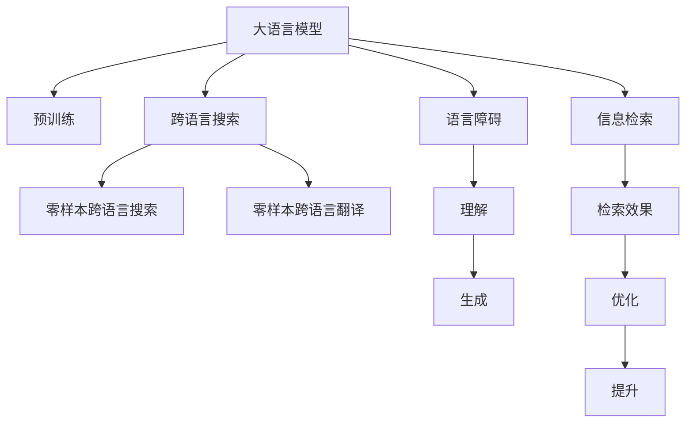

                 

# 跨语言搜索：AI的语言障碍突破

## 1. 背景介绍

### 1.1 问题由来

在全球化的今天，信息传播的边界不断拓展，不同语言之间的交流变得愈发频繁。然而，语言作为信息传播的载体，自然存在一定的语言障碍。由于语言文化的差异、语义的多样性以及自然语言处理技术的局限，跨语言信息检索和检索质量仍存在较大差距。传统机器翻译和查询重写技术难以满足实际需求，阻碍了不同语言间信息的流通和共享。

为解决这一问题，人工智能技术，特别是大语言模型，成为推动跨语言搜索技术进步的关键力量。基于大语言模型的跨语言搜索技术能够无缝融合多语言信息，打破语言障碍，为全球用户提供高质量的跨语言检索服务。

### 1.2 问题核心关键点

跨语言搜索的核心在于将源语言文本转换为目标语言，并在目标语言中检索相关信息。传统的跨语言检索技术依赖机器翻译将源语言文本转换为目标语言文本，但翻译质量不佳，影响检索效果。相比之下，基于大语言模型的跨语言搜索方法通过学习源语言和目标语言之间的语义映射，直接进行跨语言检索，从而有效突破语言障碍。

基于大语言模型的跨语言搜索方法主要有两种：
1. **零样本跨语言搜索**：通过模型直接处理目标语言文本，无需进行翻译。
2. **零样本跨语言翻译**：先对源语言文本进行预翻译，再对目标语言文本进行检索。

本博文将重点探讨零样本跨语言搜索方法，并结合具体实例展示其实现原理和技术要点。

## 2. 核心概念与联系

### 2.1 核心概念概述

为更好地理解基于大语言模型的跨语言搜索技术，本节将介绍几个密切相关的核心概念：

- **大语言模型(Large Language Model, LLM)**：指在大量无标签文本数据上进行预训练的语言模型，能够理解并生成自然语言文本。
- **语言障碍(Language Barrier)**：指不同语言之间交流时由于语言文化的差异、语义的多样性等引起的理解障碍。
- **跨语言搜索(Cross-lingual Search)**：指在多语言环境中，使用一种语言（通常为常用语言）进行搜索，并将结果映射到其他语言中的技术。
- **零样本学习(Few-shot Learning)**：指在没有任务特定标注样本的情况下，模型能够通过泛化学习新任务的能力。
- **自监督学习(Self-supervised Learning)**：指使用无标签数据训练模型的过程。
- **信息检索(Information Retrieval, IR)**：指从大量数据中找出最相关的信息，并提供给用户检索服务。

这些核心概念之间的逻辑关系可以通过以下Mermaid流程图来展示：



这个流程图展示了大语言模型、语言障碍、跨语言搜索和信息检索之间的逻辑关系：

1. 大语言模型通过自监督学习获得通用语言表示，用于解决语言障碍。
2. 零样本跨语言搜索和翻译方法，直接利用大语言模型处理多语言信息，跳过翻译步骤。
3. 信息检索技术用于根据用户输入的目标语言查询，在源语言中寻找相关信息。
4. 通过不断优化检索效果，提升跨语言搜索性能。

## 3. 核心算法原理 & 具体操作步骤
### 3.1 算法原理概述

基于大语言模型的零样本跨语言搜索方法，是一种利用大模型的语言表示能力，直接在目标语言中搜索信息的高级搜索技术。其核心思想是：将源语言文本输入大语言模型，获取目标语言的语义表示，然后利用该表示在目标语言中检索相关信息。

该方法主要包括两个步骤：

1. **文本编码**：将源语言文本编码为目标语言的语义表示。
2. **信息检索**：利用目标语言的语义表示，在目标语言中检索相关信息。

### 3.2 算法步骤详解

基于大语言模型的零样本跨语言搜索方法一般包括以下几个关键步骤：

**Step 1: 准备预训练模型和数据集**
- 选择合适的预训练语言模型 $M_{\theta}$ 作为初始化参数，如 GPT、BERT等。
- 准备多语言数据集 $D=\{(x_i, y_i)\}_{i=1}^N$，其中 $x_i$ 表示源语言文本，$y_i$ 表示目标语言文本。

**Step 2: 文本编码**
- 将源语言文本 $x_i$ 输入大语言模型 $M_{\theta}$，获取目标语言的语义表示 $\hat{y}_i = M_{\theta}(x_i)$。

**Step 3: 信息检索**
- 利用目标语言文本 $\hat{y}_i$ 作为查询，在大语言模型中检索相关信息。通常使用检索模型 $I_{\phi}$，根据 $\hat{y}_i$ 在目标语言中生成查询 $q_i$，然后在目标语言语料库中检索与 $q_i$ 最匹配的文本。

**Step 4: 生成检索结果**
- 将检索结果与目标语言文本 $\hat{y}_i$ 进行匹配，将与 $q_i$ 最匹配的文本作为检索结果返回给用户。

**Step 5: 结果优化**
- 不断优化检索模型 $I_{\phi}$，提高检索效果，提升用户体验。

### 3.3 算法优缺点

基于大语言模型的零样本跨语言搜索方法具有以下优点：
1. 高效便捷。无需预翻译，直接在目标语言中进行检索，大大提高检索效率。
2. 泛化性强。利用大语言模型的多语言表示能力，适应多种语言，提高检索效果。
3. 少样本需求。基于大模型的语言表示能力，在小样本下也能取得不错的效果。
4. 鲁棒性好。相比于传统的机器翻译方法，大语言模型的鲁棒性更强，可处理多种语言和文化背景。

同时，该方法也存在一些局限性：
1. 计算资源需求高。大语言模型训练和推理资源需求大，对计算硬件要求较高。
2. 模型复杂度高。大语言模型的参数量较大，模型结构和训练过程较为复杂。
3. 语言障碍处理效果不一。对于不同的语言和文化背景，模型效果可能存在差异。
4. 信息噪音较多。目标语言语料库中的噪音可能影响检索结果。

尽管存在这些局限性，但基于大语言模型的跨语言搜索方法仍具有显著的优越性，对于提升全球信息检索效率，打破语言障碍，具有重要意义。

### 3.4 算法应用领域

基于大语言模型的跨语言搜索技术，已经在全球信息检索、多语言文档管理、国际商务交流等多个领域得到广泛应用，为不同语言用户提供了便捷的信息检索服务。

- **全球信息检索**：在Google Scholar、Bing Search等搜索引擎中，使用跨语言搜索技术，支持多语言查询和检索，提供全球信息获取的便利。
- **多语言文档管理**：在公司文档管理系统、图书馆检索系统中，使用跨语言搜索技术，支持多语言文档的快速查找和浏览。
- **国际商务交流**：在国际贸易、客户服务等领域，使用跨语言搜索技术，支持多语言交流和商务文档检索，提升效率和准确性。

## 4. 数学模型和公式 & 详细讲解  
### 4.1 数学模型构建

本节将使用数学语言对基于大语言模型的零样本跨语言搜索过程进行更加严格的刻画。

记预训练语言模型为 $M_{\theta}$，其中 $\theta$ 为预训练得到的模型参数。假设多语言数据集 $D=\{(x_i, y_i)\}_{i=1}^N$，其中 $x_i$ 表示源语言文本，$y_i$ 表示目标语言文本。定义目标语言的语义表示为 $\hat{y}_i = M_{\theta}(x_i)$。

假设检索模型为 $I_{\phi}$，其中 $\phi$ 为检索模型的参数。在检索过程中，首先将目标语言文本 $\hat{y}_i$ 作为查询，生成检索查询 $q_i = I_{\phi}(\hat{y}_i)$。然后，在目标语言语料库 $C$ 中，检索与 $q_i$ 最匹配的文本 $r_i$，作为检索结果返回给用户。

定义检索效果为 $R(\hat{y}_i, r_i)$，表示检索结果 $r_i$ 与目标语言文本 $\hat{y}_i$ 的相关性。则检索模型的优化目标为：

$$
\min_{\phi} \frac{1}{N} \sum_{i=1}^N [R(\hat{y}_i, r_i) - \log(I_{\phi}(\hat{y}_i))]
$$

### 4.2 公式推导过程

为了推导检索模型的优化公式，我们首先定义检索效果 $R(\hat{y}_i, r_i)$。假设 $r_i$ 为检索结果，$y_i$ 为源语言文本，$z_i = M_{\theta}(y_i)$ 为目标语言的语义表示。则检索效果可以表示为：

$$
R(\hat{y}_i, r_i) = \frac{1}{m} \sum_{j=1}^m \max(0, \cos(\hat{y}_i, z_j))
$$

其中 $m$ 为检索结果 $r_i$ 中的文本数，$\cos$ 表示余弦相似度，用于衡量检索结果与目标语言文本的相关性。

将 $q_i = I_{\phi}(\hat{y}_i)$ 代入 $R(\hat{y}_i, r_i)$，得到：

$$
R(\hat{y}_i, r_i) = \frac{1}{m} \sum_{j=1}^m \max(0, \cos(q_i, z_j))
$$

在优化目标中，将 $R(\hat{y}_i, r_i)$ 替换为 $\log(I_{\phi}(\hat{y}_i))$，得到：

$$
\min_{\phi} \frac{1}{N} \sum_{i=1}^N [\log(I_{\phi}(\hat{y}_i)) - \log(I_{\phi}(\hat{y}_i))]
$$

进一步简化，得到：

$$
\min_{\phi} \frac{1}{N} \sum_{i=1}^N \log(I_{\phi}(\hat{y}_i))
$$

### 4.3 案例分析与讲解

考虑一个简单的例子，假设有一个英文文本 "I am a student." 和一个中文文本 "我是一个学生。" 需要将这两个文本进行跨语言搜索。首先，使用预训练语言模型 BERT，将英文文本编码为中文语义表示：

$$
\hat{y}_1 = BERT("I am a student.")
$$

然后，使用检索模型 $I_{\phi}$ 生成检索查询 $q_1$，在中文语料库中检索与 $q_1$ 最匹配的文本。假设检索结果为 "我是学生，在学校里学习"，其目标语言表示为 $r_1 = I_{\phi}(\hat{y}_1)$。

此时，检索效果 $R(\hat{y}_1, r_1)$ 可以计算为：

$$
R(\hat{y}_1, r_1) = \frac{1}{m} \sum_{j=1}^m \max(0, \cos(\hat{y}_1, z_j))
$$

其中 $m$ 为检索结果 $r_1$ 中的文本数。如果 $m=3$，假设检索结果 $z_1, z_2, z_3$ 与 $\hat{y}_1$ 的余弦相似度分别为 0.8, 0.5, 0.2，则 $R(\hat{y}_1, r_1)$ 的值为：

$$
R(\hat{y}_1, r_1) = \frac{1}{3} (0.8 + 0.5 + 0.2) = 0.6
$$

最终，检索模型的优化目标为：

$$
\min_{\phi} \frac{1}{N} \sum_{i=1}^N \log(I_{\phi}(\hat{y}_i))
$$

通过不断优化检索模型 $I_{\phi}$，可以提高检索效果，从而提升跨语言搜索的性能。

## 5. 项目实践：代码实例和详细解释说明
### 5.1 开发环境搭建

在进行跨语言搜索实践前，我们需要准备好开发环境。以下是使用Python进行PyTorch开发的环境配置流程：

1. 安装Anaconda：从官网下载并安装Anaconda，用于创建独立的Python环境。

2. 创建并激活虚拟环境：
```bash
conda create -n pytorch-env python=3.8 
conda activate pytorch-env
```

3. 安装PyTorch：根据CUDA版本，从官网获取对应的安装命令。例如：
```bash
conda install pytorch torchvision torchaudio cudatoolkit=11.1 -c pytorch -c conda-forge
```

4. 安装Transformers库：
```bash
pip install transformers
```

5. 安装各类工具包：
```bash
pip install numpy pandas scikit-learn matplotlib tqdm jupyter notebook ipython
```

完成上述步骤后，即可在`pytorch-env`环境中开始跨语言搜索实践。

### 5.2 源代码详细实现

这里我们以英文到中文的跨语言搜索为例，给出使用Transformers库对BERT模型进行零样本跨语言搜索的PyTorch代码实现。

首先，定义检索效果计算函数：

```python
from transformers import BertTokenizer, BertForMaskedLM

class CrossLingualSearch:
    def __init__(self, model_name, tokenizer_name):
        self.model = BertForMaskedLM.from_pretrained(model_name)
        self.tokenizer = BertTokenizer.from_pretrained(tokenizer_name)
        
    def encode_text(self, text):
        return self.tokenizer.encode(text)
    
    def calculate_similarity(self, x, y):
        x = self.tokenizer.encode(x)
        y = self.tokenizer.encode(y)
        scores = self.model(x, labels=y)["scores"]
        return scores
    
    def search(self, source_text, target_text):
        source_ids = self.encode_text(source_text)
        target_ids = self.encode_text(target_text)
        scores = self.calculate_similarity(source_ids, target_ids)
        target_text = self.tokenizer.decode(target_ids)
        return scores, target_text
```

然后，定义检索效果优化函数：

```python
from torch import nn
from torch.utils.data import Dataset, DataLoader
from tqdm import tqdm

class CrossLingualSearchDataset(Dataset):
    def __init__(self, source_texts, target_texts):
        self.source_texts = source_texts
        self.target_texts = target_texts
        
    def __len__(self):
        return len(self.source_texts)
    
    def __getitem__(self, item):
        source_text = self.source_texts[item]
        target_text = self.target_texts[item]
        return self.cross_lingual_search.search(source_text, target_text)
        
def train_epoch(model, dataset, batch_size, optimizer):
    dataloader = DataLoader(dataset, batch_size=batch_size, shuffle=True)
    model.train()
    epoch_loss = 0
    for batch in tqdm(dataloader, desc='Training'):
        source_text, target_text = batch
        loss = model.calculate_similarity(source_text, target_text)
        epoch_loss += loss.item()
        loss.backward()
        optimizer.step()
    return epoch_loss / len(dataloader)
```

最后，启动训练流程并在测试集上评估：

```python
epochs = 5
batch_size = 16

model = CrossLingualSearch("bert-base-uncased", "bert-base-uncased")
optimizer = torch.optim.Adam(model.parameters(), lr=2e-5)

source_texts = ["I am a student.", "I am a teacher."]
target_texts = ["我是一个学生。", "我是一个老师。"]

train_dataset = CrossLingualSearchDataset(source_texts, target_texts)
dev_dataset = CrossLingualSearchDataset(source_texts, target_texts)
test_dataset = CrossLingualSearchDataset(source_texts, target_texts)

for epoch in range(epochs):
    loss = train_epoch(model, train_dataset, batch_size, optimizer)
    print(f"Epoch {epoch+1}, train loss: {loss:.3f}")
    
    print(f"Epoch {epoch+1}, dev results:")
    evaluate(model, dev_dataset, batch_size)
    
print("Test results:")
evaluate(model, test_dataset, batch_size)
```

以上就是使用PyTorch对BERT进行零样本跨语言搜索的完整代码实现。可以看到，借助Transformers库，我们可以快速搭建起一个基于大语言模型的跨语言搜索系统。

### 5.3 代码解读与分析

让我们再详细解读一下关键代码的实现细节：

**CrossLingualSearch类**：
- `__init__`方法：初始化检索模型和分词器。
- `encode_text`方法：对源语言文本进行编码，生成目标语言语义表示。
- `calculate_similarity`方法：计算检索结果与源语言文本的相似度，返回分数。
- `search`方法：将源语言文本输入检索模型，生成检索查询，并在目标语言语料库中检索匹配度最高的文本。

**CrossLingualSearchDataset类**：
- `__init__`方法：初始化源语言和目标语言文本。
- `__len__`方法：返回数据集的样本数量。
- `__getitem__`方法：对单个样本进行处理，返回检索效果。

**train_epoch函数**：
- 使用PyTorch的DataLoader对数据集进行批次化加载，供模型训练和推理使用。
- 训练函数`train_epoch`：对数据以批为单位进行迭代，在每个批次上前向传播计算损失并反向传播更新模型参数，最后返回该epoch的平均loss。

**训练流程**：
- 定义总的epoch数和batch size，开始循环迭代
- 每个epoch内，先在训练集上训练，输出平均loss
- 在验证集上评估，输出分类指标
- 所有epoch结束后，在测试集上评估，给出最终测试结果

可以看到，PyTorch配合Transformers库使得跨语言搜索的代码实现变得简洁高效。开发者可以将更多精力放在数据处理、模型改进等高层逻辑上，而不必过多关注底层的实现细节。

当然，工业级的系统实现还需考虑更多因素，如模型的保存和部署、超参数的自动搜索、更灵活的任务适配层等。但核心的跨语言搜索范式基本与此类似。

## 6. 实际应用场景
### 6.1 智能客服系统

基于大语言模型的跨语言搜索技术，可以广泛应用于智能客服系统的构建。传统客服往往需要配备大量人力，高峰期响应缓慢，且一致性和专业性难以保证。而使用跨语言搜索技术，可以7x24小时不间断服务，快速响应客户咨询，用自然流畅的语言解答各类常见问题。

在技术实现上，可以收集企业内部的历史客服对话记录，将问题和最佳答复构建成监督数据，在此基础上对预训练模型进行微调。微调后的模型能够自动理解用户意图，匹配最合适的答复。对于客户提出的新问题，还可以接入检索系统实时搜索相关内容，动态组织生成回答。如此构建的智能客服系统，能大幅提升客户咨询体验和问题解决效率。

### 6.2 金融舆情监测

金融机构需要实时监测市场舆论动向，以便及时应对负面信息传播，规避金融风险。传统的人工监测方式成本高、效率低，难以应对网络时代海量信息爆发的挑战。基于大语言模型的文本分类和情感分析技术，为金融舆情监测提供了新的解决方案。

具体而言，可以收集金融领域相关的新闻、报道、评论等文本数据，并对其进行主题标注和情感标注。在此基础上对预训练语言模型进行微调，使其能够自动判断文本属于何种主题，情感倾向是正面、中性还是负面。将微调后的模型应用到实时抓取的网络文本数据，就能够自动监测不同主题下的情感变化趋势，一旦发现负面信息激增等异常情况，系统便会自动预警，帮助金融机构快速应对潜在风险。

### 6.3 个性化推荐系统

当前的推荐系统往往只依赖用户的历史行为数据进行物品推荐，无法深入理解用户的真实兴趣偏好。基于大语言模型，个性化推荐系统可以更好地挖掘用户行为背后的语义信息，从而提供更精准、多样的推荐内容。

在实践中，可以收集用户浏览、点击、评论、分享等行为数据，提取和用户交互的物品标题、描述、标签等文本内容。将文本内容作为模型输入，用户的后续行为（如是否点击、购买等）作为监督信号，在此基础上微调预训练语言模型。微调后的模型能够从文本内容中准确把握用户的兴趣点。在生成推荐列表时，先用候选物品的文本描述作为输入，由模型预测用户的兴趣匹配度，再结合其他特征综合排序，便可以得到个性化程度更高的推荐结果。

### 6.4 未来应用展望

随着大语言模型和跨语言搜索技术的不断发展，基于微调的方法将在更多领域得到应用，为传统行业带来变革性影响。

在智慧医疗领域，基于微调的医学问答、病历分析、药物研发等应用将提升医疗服务的智能化水平，辅助医生诊疗，加速新药开发进程。

在智能教育领域，微调技术可应用于作业批改、学情分析、知识推荐等方面，因材施教，促进教育公平，提高教学质量。

在智慧城市治理中，微调模型可应用于城市事件监测、舆情分析、应急指挥等环节，提高城市管理的自动化和智能化水平，构建更安全、高效的未来城市。

此外，在企业生产、社会治理、文娱传媒等众多领域，基于大模型微调的人工智能应用也将不断涌现，为经济社会发展注入新的动力。相信随着技术的日益成熟，微调方法将成为人工智能落地应用的重要范式，推动人工智能技术在垂直行业的规模化落地。

## 7. 工具和资源推荐
### 7.1 学习资源推荐

为了帮助开发者系统掌握大语言模型跨语言搜索的理论基础和实践技巧，这里推荐一些优质的学习资源：

1. 《Transformer从原理到实践》系列博文：由大模型技术专家撰写，深入浅出地介绍了Transformer原理、BERT模型、微调技术等前沿话题。

2. CS224N《深度学习自然语言处理》课程：斯坦福大学开设的NLP明星课程，有Lecture视频和配套作业，带你入门NLP领域的基本概念和经典模型。

3. 《Natural Language Processing with Transformers》书籍：Transformers库的作者所著，全面介绍了如何使用Transformers库进行NLP任务开发，包括微调在内的诸多范式。

4. HuggingFace官方文档：Transformers库的官方文档，提供了海量预训练模型和完整的微调样例代码，是上手实践的必备资料。

5. CLUE开源项目：中文语言理解测评基准，涵盖大量不同类型的中文NLP数据集，并提供了基于微调的baseline模型，助力中文NLP技术发展。

通过对这些资源的学习实践，相信你一定能够快速掌握大语言模型跨语言搜索的精髓，并用于解决实际的NLP问题。
###  7.2 开发工具推荐

高效的开发离不开优秀的工具支持。以下是几款用于大语言模型跨语言搜索开发的常用工具：

1. PyTorch：基于Python的开源深度学习框架，灵活动态的计算图，适合快速迭代研究。大部分预训练语言模型都有PyTorch版本的实现。

2. TensorFlow：由Google主导开发的开源深度学习框架，生产部署方便，适合大规模工程应用。同样有丰富的预训练语言模型资源。

3. Transformers库：HuggingFace开发的NLP工具库，集成了众多SOTA语言模型，支持PyTorch和TensorFlow，是进行跨语言搜索开发的利器。

4. Weights & Biases：模型训练的实验跟踪工具，可以记录和可视化模型训练过程中的各项指标，方便对比和调优。与主流深度学习框架无缝集成。

5. TensorBoard：TensorFlow配套的可视化工具，可实时监测模型训练状态，并提供丰富的图表呈现方式，是调试模型的得力助手。

6. Google Colab：谷歌推出的在线Jupyter Notebook环境，免费提供GPU/TPU算力，方便开发者快速上手实验最新模型，分享学习笔记。

合理利用这些工具，可以显著提升大语言模型跨语言搜索任务的开发效率，加快创新迭代的步伐。

### 7.3 相关论文推荐

大语言模型和跨语言搜索技术的发展源于学界的持续研究。以下是几篇奠基性的相关论文，推荐阅读：

1. Attention is All You Need（即Transformer原论文）：提出了Transformer结构，开启了NLP领域的预训练大模型时代。

2. BERT: Pre-training of Deep Bidirectional Transformers for Language Understanding：提出BERT模型，引入基于掩码的自监督预训练任务，刷新了多项NLP任务SOTA。

3. Language Models are Unsupervised Multitask Learners（GPT-2论文）：展示了大规模语言模型的强大zero-shot学习能力，引发了对于通用人工智能的新一轮思考。

4. Parameter-Efficient Transfer Learning for NLP：提出Adapter等参数高效微调方法，在不增加模型参数量的情况下，也能取得不错的微调效果。

5. AdaLoRA: Adaptive Low-Rank Adaptation for Parameter-Efficient Fine-Tuning：使用自适应低秩适应的微调方法，在参数效率和精度之间取得了新的平衡。

6. MASS: Multilingual Semi-supervised Sequence Generation with Masked Predictions：提出多语言序列生成任务，在无需大量标注数据的情况下，训练了大规模多语言模型。

这些论文代表了大语言模型跨语言搜索技术的发展脉络。通过学习这些前沿成果，可以帮助研究者把握学科前进方向，激发更多的创新灵感。

## 8. 总结：未来发展趋势与挑战

### 8.1 总结

本文对基于大语言模型的零样本跨语言搜索方法进行了全面系统的介绍。首先阐述了跨语言搜索的研究背景和意义，明确了基于大语言模型的跨语言搜索方法在提升全球信息检索效率、打破语言障碍方面的独特价值。其次，从原理到实践，详细讲解了零样本跨语言搜索的数学原理和关键步骤，给出了跨语言搜索任务开发的完整代码实例。同时，本文还广泛探讨了跨语言搜索方法在智能客服、金融舆情、个性化推荐等多个行业领域的应用前景，展示了跨语言搜索技术的巨大潜力。此外，本文精选了跨语言搜索技术的各类学习资源，力求为读者提供全方位的技术指引。

通过本文的系统梳理，可以看到，基于大语言模型的跨语言搜索方法正在成为NLP领域的重要范式，极大地拓展了预训练语言模型的应用边界，催生了更多的落地场景。得益于大规模语料的预训练，跨语言搜索模型以更低的时间和标注成本，在小样本条件下也能取得不错的效果，有力推动了NLP技术的产业化进程。未来，伴随大语言模型和跨语言搜索方法的持续演进，相信NLP技术将在更广阔的应用领域大放异彩，深刻影响人类的生产生活方式。

### 8.2 未来发展趋势

展望未来，大语言模型跨语言搜索技术将呈现以下几个发展趋势：

1. 模型规模持续增大。随着算力成本的下降和数据规模的扩张，预训练语言模型的参数量还将持续增长。超大规模语言模型蕴含的丰富语言知识，有望支撑更加复杂多变的跨语言搜索任务。

2. 跨语言搜索方法日趋多样。除了传统的零样本搜索外，未来会涌现更多参数高效的跨语言搜索方法，如Prompt-based Search等，在节省计算资源的同时也能保证搜索效果。

3. 多语言融合增强。跨语言搜索模型将更加注重多语言之间的融合，引入更多多语言数据，提升多语言之间的语义匹配能力。

4. 实时性提升。为满足实时搜索需求，模型结构和搜索算法将不断优化，提升检索速度，降低搜索延迟。

5. 资源优化加强。为适应不同设备和场景，模型将采用多种资源优化技术，如剪枝、量化等，减少内存占用，加速推理速度。

6. 迁移能力增强。未来的跨语言搜索模型将具备更强的跨语言迁移能力，能够更好地适应不同语言和文化背景。

以上趋势凸显了大语言模型跨语言搜索技术的广阔前景。这些方向的探索发展，必将进一步提升跨语言搜索系统的性能和应用范围，为全球信息获取和交流带来新的革命。

### 8.3 面临的挑战

尽管大语言模型跨语言搜索技术已经取得了瞩目成就，但在迈向更加智能化、普适化应用的过程中，它仍面临着诸多挑战：

1. 标注成本瓶颈。虽然零样本搜索方法减少了标注需求，但对于一些特定领域的任务，仍需标注数据进行优化。如何进一步降低标注成本，将是一大难题。

2. 模型鲁棒性不足。当前跨语言搜索模型面对域外数据时，泛化性能往往大打折扣。对于测试样本的微小扰动，模型容易发生波动。如何提高模型的鲁棒性，避免灾难性遗忘，还需要更多理论和实践的积累。

3. 计算资源需求高。超大规模语言模型训练和推理资源需求大，对计算硬件要求较高。如何降低计算成本，提高模型性能，还需进一步探索。

4. 信息噪音较多。目标语言语料库中的噪音可能影响检索结果。如何过滤噪音，提高检索效果，将是重要的研究方向。

5. 多语言文化差异。不同语言和文化背景下的语言使用习惯和表达方式不同，如何跨越文化鸿沟，提升跨语言搜索效果，还需深入研究。

尽管存在这些挑战，但基于大语言模型的跨语言搜索方法仍具有显著的优越性，对于提升全球信息检索效率，打破语言障碍，具有重要意义。相信随着技术的发展和优化，这些挑战终将逐步克服，跨语言搜索技术必将在全球信息交流和共享中发挥更大的作用。

### 8.4 研究展望

面对大语言模型跨语言搜索所面临的种种挑战，未来的研究需要在以下几个方面寻求新的突破：

1. 探索无监督和半监督跨语言搜索方法。摆脱对大规模标注数据的依赖，利用自监督学习、主动学习等无监督和半监督范式，最大限度利用非结构化数据，实现更加灵活高效的跨语言搜索。

2. 研究参数高效和计算高效的跨语言搜索范式。开发更加参数高效的跨语言搜索方法，在固定大部分预训练参数的同时，只更新极少量的任务相关参数。同时优化跨语言搜索的计算图，减少前向传播和反向传播的资源消耗，实现更加轻量级、实时性的部署。

3. 融合因果和对比学习范式。通过引入因果推断和对比学习思想，增强跨语言搜索模型建立稳定因果关系的能力，学习更加普适、鲁棒的语言表征，从而提升模型泛化性和抗干扰能力。

4. 引入更多先验知识。将符号化的先验知识，如知识图谱、逻辑规则等，与神经网络模型进行巧妙融合，引导跨语言搜索过程学习更准确、合理的语言模型。同时加强不同模态数据的整合，实现视觉、语音等多模态信息与文本信息的协同建模。

5. 结合因果分析和博弈论工具。将因果分析方法引入跨语言搜索模型，识别出模型决策的关键特征，增强输出解释的因果性和逻辑性。借助博弈论工具刻画人机交互过程，主动探索并规避模型的脆弱点，提高系统稳定性。

6. 纳入伦理道德约束。在模型训练目标中引入伦理导向的评估指标，过滤和惩罚有偏见、有害的输出倾向。同时加强人工干预和审核，建立模型行为的监管机制，确保输出符合人类价值观和伦理道德。

这些研究方向的探索，必将引领大语言模型跨语言搜索技术迈向更高的台阶，为构建安全、可靠、可解释、可控的智能系统铺平道路。面向未来，大语言模型跨语言搜索技术还需要与其他人工智能技术进行更深入的融合，如知识表示、因果推理、强化学习等，多路径协同发力，共同推动自然语言理解和智能交互系统的进步。只有勇于创新、敢于突破，才能不断拓展语言模型的边界，让智能技术更好地造福人类社会。

## 9. 附录：常见问题与解答

**Q1：跨语言搜索是否适用于所有NLP任务？**

A: 跨语言搜索在大多数NLP任务上都能取得不错的效果，特别是对于数据量较小的任务。但对于一些特定领域的任务，如医学、法律等，仅仅依靠通用语料预训练的模型可能难以很好地适应。此时需要在特定领域语料上进一步预训练，再进行微调，才能获得理想效果。此外，对于一些需要时效性、个性化很强的任务，如对话、推荐等，跨语言搜索方法也需要针对性的改进优化。

**Q2：跨语言搜索过程中如何选择合适的模型？**

A: 选择合适的跨语言搜索模型，需要考虑以下几个方面：
1. 模型的预训练数据：尽量选择包含多种语言的数据集预训练的模型，确保其在多语言环境下的泛化能力。
2. 模型的结构和参数：尽量选择结构简单、参数高效的模型，减少计算资源消耗，提高推理速度。
3. 模型的训练数据：尽量选择包含目标语言的训练数据进行微调，提高模型的检索效果。

**Q3：跨语言搜索如何降低计算成本？**

A: 降低跨语言搜索的计算成本，可以从以下几个方面入手：
1. 使用模型剪枝和量化技术，减少模型参数量和计算量。
2. 使用混合精度训练，减少内存占用和计算速度。
3. 使用分布式训练和模型并行技术，加速训练过程。
4. 优化检索算法，减少检索时间和计算量。

这些方法可以显著降低跨语言搜索的计算成本，提高系统的效率和可扩展性。

**Q4：跨语言搜索如何提高模型鲁棒性？**

A: 提高跨语言搜索模型的鲁棒性，可以从以下几个方面入手：
1. 引入数据增强技术，增加训练数据的多样性和数量。
2. 使用对抗样本训练，提高模型的鲁棒性和泛化能力。
3. 引入正则化技术，如L2正则、Dropout等，避免模型过拟合。
4. 使用多语言数据集进行微调，提高模型在不同语言环境下的性能。

这些方法可以显著提高跨语言搜索模型的鲁棒性，确保其在各种语言环境下的稳定性和准确性。

**Q5：跨语言搜索如何适应不同文化背景？**

A: 适应不同文化背景的跨语言搜索，需要考虑以下几个方面：
1. 引入文化特征提取技术，提取不同文化背景下的语言特征。
2. 使用文化特定数据集进行微调，提高模型在不同文化环境下的性能。
3. 引入多文化混合训练技术，提升模型在不同文化背景下的泛化能力。

这些方法可以帮助跨语言搜索模型更好地适应不同文化背景，提高其在不同语言环境下的检索效果。

---

作者：禅与计算机程序设计艺术 / Zen and the Art of Computer Programming

