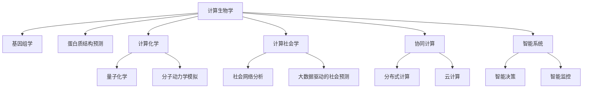

                 

# 跨越学科边界：人类计算的多元化应用

## 1. 背景介绍

### 1.1 问题由来
随着计算技术的飞速发展，人类社会的各个领域正经历着前所未有的数字化、智能化变革。在医疗、金融、教育、制造等行业，计算技术已经成为不可或缺的支撑。然而，传统的计算范式往往局限于单一学科和特定领域，难以适应多元化、复杂化、跨学科的现实需求。

计算技术的多元化应用，涉及到计算与众多其他学科的深度融合，如计算生物学、计算化学、计算社会学等。这些学科相互交叉、相互促进，共同推动了计算技术的边界拓展和应用深化。本文将深入探讨计算技术在跨学科领域的多元化应用，帮助读者理解计算技术与学科边界的跨越，以及未来的发展趋势和挑战。

### 1.2 问题核心关键点
计算技术的多元化应用，涉及以下几个核心关键点：

- **学科交叉融合**：不同学科之间的计算技术应用，如计算生物学中对基因组的分析、计算化学中对分子结构的模拟。
- **数据驱动决策**：利用大规模数据分析，辅助决策制定，优化资源配置，提升业务效率。
- **协同计算与仿真**：通过分布式计算、高精度仿真等技术，解决复杂的系统性问题。
- **智能系统构建**：结合人工智能、大数据分析、机器学习等技术，构建智能系统，提升自动化水平。

这些关键点共同构成了计算技术多元化应用的框架，推动着计算技术向更广领域、更深层次、更高智能的演进。

## 2. 核心概念与联系

### 2.1 核心概念概述

计算技术的多元化应用，涉及多个领域的计算方法和工具，本文将重点介绍以下几个核心概念：

- **计算生物学**：利用计算技术对生物信息进行建模、模拟和分析，如基因组学、蛋白质结构预测等。
- **计算化学**：使用计算方法研究分子、固体的结构与性质，如量子化学、分子动力学模拟等。
- **计算社会学**：通过计算技术研究社会现象与行为，如社会网络分析、大数据驱动的社会预测等。
- **协同计算**：通过分布式计算、云计算等技术，实现大规模数据的并行处理和协同分析。
- **智能系统**：结合人工智能、大数据分析、机器学习等技术，构建智能决策、智能监控等系统。

这些核心概念通过计算技术的桥梁，实现了不同学科之间的深度融合和协同作用，推动了计算技术在更多领域的应用。

### 2.2 核心概念原理和架构的 Mermaid 流程图



## 3. 核心算法原理 & 具体操作步骤
### 3.1 算法原理概述

计算技术的多元化应用，依赖于一系列核心算法和理论。这些算法包括但不限于：

- **分子动力学模拟**：使用经典分子动力学方法，模拟分子和固体系统的运动与相互作用。
- **社会网络分析**：利用图论和统计分析方法，研究社会网络结构、节点影响力等。
- **大数据分析**：采用数据挖掘和机器学习方法，从大规模数据中提取知识、模式和趋势。
- **优化算法**：如遗传算法、蚁群算法等，用于解决复杂的优化问题。
- **智能推理与决策**：结合专家系统、知识库等，进行智能化推理与决策。

这些算法通过计算技术的实现，在不同学科领域中发挥了重要作用。

### 3.2 算法步骤详解

计算技术在多元化应用中的具体步骤，可以分为以下几个环节：

**Step 1: 数据准备**
- 收集、整理各个领域的数据，如生物分子结构数据、社会行为数据、工业生产数据等。
- 进行数据清洗、去噪、预处理，确保数据质量。

**Step 2: 计算模型建立**
- 选择合适的计算模型和方法，如计算生物学中的分子动力学模型、计算化学中的量子化学模型、计算社会学中的社会网络模型等。
- 根据问题特点，设计计算模型的参数和超参数。

**Step 3: 计算过程实施**
- 利用计算资源进行大规模计算，如高性能计算集群、云计算平台等。
- 进行并行计算、分布式计算，提高计算效率和性能。

**Step 4: 结果分析与优化**
- 对计算结果进行分析，提取有价值的信息和知识。
- 进行结果的可视化展示，辅助理解分析结果。
- 根据分析结果，优化模型和参数，进一步提升计算效果。

**Step 5: 应用部署**
- 将计算模型和结果应用到实际场景中，如智能医疗系统、智能制造系统、智能金融系统等。
- 进行系统集成、优化和测试，确保系统的稳定性和可靠性。

### 3.3 算法优缺点

计算技术在多元化应用中的优势包括：

- **数据驱动决策**：利用大数据分析，提供科学决策依据。
- **协同计算**：通过分布式计算和云计算，提高计算效率和资源利用率。
- **跨学科融合**：实现不同学科之间的知识共享和协同，推动学科发展。

但同时也存在一些局限性：

- **数据获取难度大**：某些领域的数据获取和处理难度较大，如生物数据、社会行为数据等。
- **计算资源需求高**：大规模计算和复杂模型的实现，对计算资源和硬件设备要求较高。
- **结果可解释性差**：某些计算结果难以直观理解，需要结合专业知识和经验进行解释。

### 3.4 算法应用领域

计算技术在多元化应用中，覆盖了众多领域。以下是一些典型的应用场景：

- **生物医药**：计算生物学在基因组学、蛋白质结构预测、药物设计等方面的应用，为医药研发提供了新的思路和方法。
- **环境保护**：利用计算社会学研究环境行为和政策影响，优化环境保护措施。
- **智能制造**：计算技术在生产过程优化、供应链管理、质量控制等方面的应用，提高了生产效率和产品质量。
- **金融风控**：大数据分析在风险评估、欺诈检测、市场预测等方面的应用，提升了金融风险控制能力。

这些领域的应用，展示了计算技术在多元化场景中的巨大潜力。

## 4. 数学模型和公式 & 详细讲解 & 举例说明

### 4.1 数学模型构建

在计算技术的多元化应用中，数学模型和公式起着关键作用。本文将通过具体案例，介绍一些常见的数学模型和公式。

**案例1: 基因组学中的序列比对模型**
基因组学中，序列比对是研究DNA、RNA序列同源性的一种方法。常见的序列比对模型包括Needleman-Wunsch模型和Smith-Waterman模型。

**案例2: 量子化学中的哈布罗克-夏尔马-卡彭模型**
量子化学中，哈布罗克-夏尔马-卡彭模型用于计算分子系统的能量，可以模拟分子的化学反应过程。

**案例3: 社会网络分析中的最小生成树算法**
社会网络分析中，最小生成树算法用于求解社会网络中的最小生成树，以研究节点之间的影响力关系。

### 4.2 公式推导过程

**案例1: 基因组学中的Needleman-Wunsch模型**
Needleman-Wunsch模型的核心思想是通过动态规划求解最优序列比对。

假设两个序列$A=a_1a_2...a_m$和$B=b_1b_2...b_n$，其比对最优解记为$C$，则Needleman-Wunsch模型的计算公式为：

$$
\begin{aligned}
&\max_{\sigma} \sum_{i=1}^m\sum_{j=1}^n [a_i\cdot b_j + s(a_i,b_j)]\\
&s(a_i,b_j) = \left\{
\begin{array}{ll}
0, & a_i=b_j \\
-1, & a_i \neq b_j 
\end{array} \right.
\end{aligned}
$$

其中，$s(a_i,b_j)$为匹配得分，若$a_i$和$b_j$匹配，则$s(a_i,b_j)=0$，否则$s(a_i,b_j)=-1$。

**案例2: 量子化学中的哈布罗克-夏尔马-卡彭模型**
哈布罗克-夏尔马-卡彭模型用于计算分子系统的能量$E$，公式为：

$$
E=-\sum_{i=1}^{N} K_i \langle \phi_i|H| \phi_i \rangle - \sum_{i=1}^{N} \langle \phi_i|V| \phi_i \rangle
$$

其中，$K_i$为核能级权重，$\phi_i$为基态波函数，$H$为哈密顿算符，$V$为外势能，$N$为分子中原子数。

### 4.3 案例分析与讲解

**案例1: 基因组学中的序列比对模型**
基因组学中，序列比对是研究DNA、RNA序列同源性的一种方法。Needleman-Wunsch模型和Smith-Waterman模型在实际应用中表现良好。

以Needleman-Wunsch模型为例，其具体实现步骤包括：
1. 构建比对矩阵，计算匹配得分和缺失得分。
2. 根据动态规划原理，计算最优序列比对路径。
3. 通过路径回溯，得到最优比对结果。

**案例2: 社会网络分析中的最小生成树算法**
社会网络分析中，最小生成树算法用于求解社会网络中的最小生成树，以研究节点之间的影响力关系。

以Prim算法为例，其具体实现步骤包括：
1. 初始化最小生成树为单个节点。
2. 从剩余节点中选择度最小的节点，加入到最小生成树中。
3. 更新最小生成树的边权重，计算新节点的边权重和。
4. 重复步骤2-3，直到所有节点都被加入到最小生成树中。

## 5. 项目实践：代码实例和详细解释说明

### 5.1 开发环境搭建

在进行计算技术的多元化应用开发前，我们需要准备好开发环境。以下是使用Python进行计算技术多元化应用的开发环境配置流程：

1. 安装Anaconda：从官网下载并安装Anaconda，用于创建独立的Python环境。

2. 创建并激活虚拟环境：
```bash
conda create -n comp-science python=3.8 
conda activate comp-science
```

3. 安装必要的科学计算库：
```bash
conda install numpy scipy pandas scikit-learn matplotlib
```

4. 安装并行计算和分布式计算库：
```bash
conda install mpi4py dask
```

5. 安装人工智能和机器学习库：
```bash
conda install torch tensorflow huggingface transformers
```

完成上述步骤后，即可在`comp-science`环境中开始计算技术的多元化应用开发。

### 5.2 源代码详细实现

下面我们以计算社会学中的社会网络分析为例，给出使用Python和网络分析库进行社会网络构建的代码实现。

```python
import networkx as nx
import matplotlib.pyplot as plt

# 生成随机社会网络
G = nx.gnm_random_graph(100, 200)
G.add_edge(0, 1)
G.add_edge(1, 2)
G.add_edge(2, 0)

# 计算社交网络中节点的中心性
degree_centrality = nx.degree_centrality(G)
closeness_centrality = nx.closeness_centrality(G)
betweenness_centrality = nx.betweenness_centrality(G)

# 绘制社交网络中节点的中心性
plt.figure(figsize=(8, 6))
plt.plot(degree_centrality.values(), label='Degree Centrality')
plt.plot(closeness_centrality.values(), label='Closeness Centrality')
plt.plot(betweenness_centrality.values(), label='Betweenness Centrality')
plt.legend()
plt.show()
```

以上就是使用Python和网络分析库进行社会网络构建的完整代码实现。可以看到，网络分析库使得社交网络构建和分析变得简洁高效。

### 5.3 代码解读与分析

让我们再详细解读一下关键代码的实现细节：

**网络构建**
- 使用`networkx`库生成一个随机社交网络，包含100个节点和200条边。
- 添加几条手工构造的边，模拟真实社会网络中的特定关系。

**中心性计算**
- 使用`degree_centrality`函数计算节点的度中心性，即节点连接的边的数量。
- 使用`closeness_centrality`函数计算节点的接近中心性，即节点到其他节点的最短路径的倒数之和。
- 使用`betweenness_centrality`函数计算节点的介数中心性，即节点在所有最短路径中出现的次数。

**中心性可视化**
- 使用`matplotlib`库绘制中心性值的分布图，直观展示不同中心性值的情况。

## 6. 实际应用场景

### 6.1 智能医疗系统

计算技术在智能医疗系统中的应用，为医疗诊断、治疗方案制定、资源优化提供了新的方法。通过计算技术，可以构建智能医疗平台，实现精准医疗。

具体而言，可以收集患者的基因数据、影像数据、病历数据等，构建计算模型进行分析。通过计算模型，可以实现对疾病的早期预测和诊断，制定个性化的治疗方案，优化医疗资源配置。例如，利用计算化学模拟药物与蛋白的结合过程，可以预测药物的有效性和副作用。

### 6.2 智能制造系统

计算技术在智能制造系统中的应用，推动了制造业的数字化、智能化转型。通过计算技术，可以实现对生产过程的精细化管理、供应链的优化、质量控制的提升等。

具体而言，可以构建智能制造平台，实现设备监控、工艺优化、物料调度等功能。通过计算模型，可以实现对生产过程的实时监控和预测，提升生产效率和产品质量。例如，利用计算生物学对生物分子结构进行建模，可以优化生产工艺，降低生产成本。

### 6.3 智能金融系统

计算技术在智能金融系统中的应用，为金融风险控制、投资决策、客户服务提供了新的手段。通过计算技术，可以构建智能金融平台，实现精准的金融分析和管理。

具体而言，可以收集金融市场数据、客户行为数据、交易数据等，构建计算模型进行分析。通过计算模型，可以实现对市场趋势的预测、风险的评估、交易策略的制定等。例如，利用计算社会学研究金融市场行为，可以预测市场波动，优化投资组合。

### 6.4 未来应用展望

随着计算技术的不断发展，其在多元化应用中的前景将更加广阔。未来，计算技术将向以下方向演进：

1. **跨领域融合**：更多学科将深度融合，推动计算技术向更广领域拓展。例如，计算化学与计算生物学的融合，将推动新药研发领域的突破。
2. **深度学习应用**：深度学习技术将进一步渗透到计算技术的各个领域，提升计算模型的智能水平。例如，利用深度学习进行社会网络分析，可以提升社会行为预测的准确性。
3. **超大规模计算**：超大规模计算平台和硬件设备的发展，将推动计算技术在更复杂、更精细的问题上实现突破。例如，利用超大规模计算进行生物分子动力学模拟，可以揭示更复杂的生物学机制。
4. **数据驱动决策**：大数据技术的应用，将提升计算技术的决策支持能力。例如，利用大数据分析进行医疗资源优化，可以提高医疗服务的效率和质量。
5. **智能化应用**：计算技术与人工智能的深度融合，将推动更多智能化应用的实现。例如，利用智能推理与决策技术进行金融风险控制，可以提升金融系统的安全性。

## 7. 工具和资源推荐

### 7.1 学习资源推荐

为了帮助开发者掌握计算技术在多元化应用中的知识，以下是一些优质的学习资源：

1. 《计算化学基础》书籍：介绍了计算化学的基本概念和计算方法，是计算化学学习的重要参考资料。
2. 《社会网络分析》课程：斯坦福大学开设的社会网络分析课程，详细讲解了社会网络分析的基本原理和应用案例。
3. 《大数据分析》书籍：介绍了大数据分析的基本概念和常用技术，帮助读者理解大数据的应用。
4. 《深度学习入门》书籍：介绍深度学习的基本概念和常用算法，是人工智能学习的重要基础。
5. 《网络分析与可视化》书籍：介绍了网络分析的基本概念和可视化技术，帮助读者理解网络数据的应用。

通过对这些资源的学习，相信你一定能够快速掌握计算技术在多元化应用中的精髓，并用于解决实际的计算问题。

### 7.2 开发工具推荐

高效的开发离不开优秀的工具支持。以下是几款用于计算技术多元化应用开发的常用工具：

1. PyTorch：基于Python的开源深度学习框架，灵活动态的计算图，适合快速迭代研究。
2. TensorFlow：由Google主导开发的开源深度学习框架，生产部署方便，适合大规模工程应用。
3. MPI4Py：用于分布式计算的库，支持Python和MPI，方便进行大规模并行计算。
4. Dask：用于分布式计算的库，支持大规模数据处理和并行计算，性能优异。
5. Jupyter Notebook：交互式编程环境，方便开发和分享计算研究。

合理利用这些工具，可以显著提升计算技术多元化应用的开发效率，加快创新迭代的步伐。

### 7.3 相关论文推荐

计算技术的多元化应用，涉及众多学科的前沿研究。以下是几篇奠基性的相关论文，推荐阅读：

1. "A New Fast Algorithm for General Connectivity Problems"（Prim算法）：介绍了Prim算法的基本思想和实现方法，是社会网络分析中的经典算法。
2. "Quantum Chemistry, The Theory of Molecules in Atomic Orbitals"（哈布罗克-夏尔马-卡彭模型）：介绍了哈布罗克-夏尔马-卡彭模型的基本原理和应用方法，是量子化学中的经典模型。
3. "Comparative Analysis of NLP Algorithms for Sentence Similarity"（序列比对模型）：介绍了序列比对模型的基本原理和实现方法，是生物信息学中的经典算法。

这些论文代表了大规模计算技术的理论前沿，对计算技术的多元化应用研究具有重要的参考价值。

## 8. 总结：未来发展趋势与挑战

### 8.1 研究成果总结

计算技术的多元化应用，涉及众多学科的交叉和融合。通过计算技术的应用，我们可以实现对复杂系统的建模、优化和分析，提升不同领域的效率和精度。计算技术的多元化应用，已经成为推动学科发展、优化资源配置、提升决策支持的重要手段。

### 8.2 未来发展趋势

展望未来，计算技术在多元化应用中呈现以下发展趋势：

1. **跨学科融合**：更多学科将深度融合，推动计算技术向更广领域拓展。例如，计算化学与计算生物学的融合，将推动新药研发领域的突破。
2. **深度学习应用**：深度学习技术将进一步渗透到计算技术的各个领域，提升计算模型的智能水平。例如，利用深度学习进行社会网络分析，可以提升社会行为预测的准确性。
3. **超大规模计算**：超大规模计算平台和硬件设备的发展，将推动计算技术在更复杂、更精细的问题上实现突破。例如，利用超大规模计算进行生物分子动力学模拟，可以揭示更复杂的生物学机制。
4. **数据驱动决策**：大数据技术的应用，将提升计算技术的决策支持能力。例如，利用大数据分析进行医疗资源优化，可以提高医疗服务的效率和质量。
5. **智能化应用**：计算技术与人工智能的深度融合，将推动更多智能化应用的实现。例如，利用智能推理与决策技术进行金融风险控制，可以提升金融系统的安全性。

### 8.3 面临的挑战

尽管计算技术在多元化应用中取得了显著成就，但在迈向更加智能化、普适化应用的过程中，仍面临诸多挑战：

1. **数据获取难度大**：某些领域的数据获取和处理难度较大，如生物数据、社会行为数据等。
2. **计算资源需求高**：大规模计算和复杂模型的实现，对计算资源和硬件设备要求较高。
3. **结果可解释性差**：某些计算结果难以直观理解，需要结合专业知识和经验进行解释。
4. **跨学科协同困难**：不同学科之间的协作和知识共享存在障碍，影响计算技术的多元化应用。
5. **技术复杂度高**：计算技术的实现涉及多个领域的知识，对开发者和研究者的技术水平要求较高。

### 8.4 研究展望

面对计算技术多元化应用所面临的挑战，未来的研究需要在以下几个方面寻求新的突破：

1. **数据获取与处理**：开发高效的数据获取和处理工具，降低数据获取难度，提高数据质量。
2. **计算资源优化**：利用分布式计算、云计算等技术，优化计算资源的使用，提高计算效率。
3. **结果可解释性增强**：开发易于解释的计算模型，结合专业知识和经验，提升结果的可解释性。
4. **跨学科协同机制**：建立跨学科协同机制，促进不同学科之间的知识共享和协作，推动计算技术的多元化应用。
5. **技术普及与培训**：提供广泛的技术培训和教育资源，提升开发者和研究者的技术水平，推动计算技术的普及应用。

总之，计算技术在多元化应用中展现出了广阔的前景和巨大的潜力。未来，计算技术的多元化应用将进一步拓展学科边界，推动计算技术向更高智能、更广领域、更深层次的演进，为人类社会的发展注入新的动力。

## 9. 附录：常见问题与解答

**Q1: 计算技术在多元化应用中面临哪些挑战？**

A: 计算技术在多元化应用中面临以下挑战：
1. **数据获取难度大**：某些领域的数据获取和处理难度较大，如生物数据、社会行为数据等。
2. **计算资源需求高**：大规模计算和复杂模型的实现，对计算资源和硬件设备要求较高。
3. **结果可解释性差**：某些计算结果难以直观理解，需要结合专业知识和经验进行解释。
4. **跨学科协同困难**：不同学科之间的协作和知识共享存在障碍，影响计算技术的多元化应用。
5. **技术复杂度高**：计算技术的实现涉及多个领域的知识，对开发者和研究者的技术水平要求较高。

**Q2: 如何优化计算技术的资源使用？**

A: 计算技术的资源优化可以从以下几个方面进行：
1. **分布式计算**：利用分布式计算技术，将计算任务分配到多台计算设备上并行处理，提高计算效率。
2. **云计算**：利用云计算平台，按需分配计算资源，优化资源利用率。
3. **数据压缩和存储**：采用数据压缩和存储技术，减小数据体积，提高数据传输和存储效率。
4. **算法优化**：优化计算算法，减少计算复杂度和资源消耗。
5. **硬件加速**：利用GPU、FPGA等硬件设备，提高计算速度和性能。

**Q3: 计算技术在跨学科应用中的关键是什么？**

A: 计算技术在跨学科应用中的关键在于以下几个方面：
1. **数据融合与共享**：将不同学科的数据进行融合和共享，建立统一的数据平台。
2. **跨学科协同机制**：建立跨学科的协同机制，促进不同学科之间的知识交流和协作。
3. **多学科方法结合**：结合不同学科的研究方法和工具，解决复杂问题。
4. **技术普及与培训**：提供广泛的技术培训和教育资源，提升开发者和研究者的技术水平。

**Q4: 未来计算技术在多元化应用中的发展方向是什么？**

A: 未来计算技术在多元化应用中的发展方向包括：
1. **跨学科融合**：更多学科将深度融合，推动计算技术向更广领域拓展。
2. **深度学习应用**：深度学习技术将进一步渗透到计算技术的各个领域，提升计算模型的智能水平。
3. **超大规模计算**：超大规模计算平台和硬件设备的发展，将推动计算技术在更复杂、更精细的问题上实现突破。
4. **数据驱动决策**：大数据技术的应用，将提升计算技术的决策支持能力。
5. **智能化应用**：计算技术与人工智能的深度融合，将推动更多智能化应用的实现。

---

作者：禅与计算机程序设计艺术 / Zen and the Art of Computer Programming

