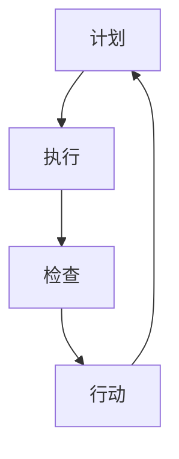

                 

# PDCA循环与管理持续改进的关系

## 背景介绍（Background Introduction）

PDCA循环（Plan-Do-Check-Act循环）是一种广泛用于管理持续改进的方法。它最早由美国质量管理专家休哈特（W. Edwards Deming）提出，并在此基础上得到了广泛的应用和推广。PDCA循环的基本思想是通过计划（Plan）、执行（Do）、检查（Check）和行动（Act）四个阶段，实现持续改进。这种方法不仅在制造业中得到了广泛的应用，在服务业、IT行业等多个领域也得到了成功的实践。

本文旨在探讨PDCA循环在管理持续改进中的应用，并分析其在不同行业中的具体实现方式。通过本文的阅读，读者可以深入了解PDCA循环的基本原理，掌握其在实际工作中的应用方法，并了解如何通过PDCA循环实现组织的持续改进。

## 核心概念与联系（Core Concepts and Connections）

### PDCA循环的概念

PDCA循环是一种基于循环迭代的方法，通过四个阶段的循环，实现问题的识别、分析、解决和验证。具体来说，PDCA循环包括以下四个阶段：

1. **计划（Plan）**：在这个阶段，需要明确改进的目标，制定具体的计划和方案。这个阶段的目标是确保改进方案的可操作性和可行性。

2. **执行（Do）**：在计划制定完毕后，需要按照计划执行，实施具体的改进措施。这个阶段的目标是确保计划的实施效果，发现问题并记录。

3. **检查（Check）**：在执行阶段完成后，需要对执行结果进行检查和评估。这个阶段的目标是验证改进方案的有效性，识别存在的问题。

4. **行动（Act）**：在检查阶段完成后，需要根据检查结果采取行动，对改进方案进行优化和调整。这个阶段的目标是确保改进方案的持续有效性和可重复性。

### 持续改进的概念

持续改进是指组织或个人通过不断的反思、学习和调整，不断提高产品和服务的质量和效率。持续改进的核心是“以客户为中心”，通过不断满足和超越客户的需求，实现组织的长期发展。

### PDCA循环与持续改进的关系

PDCA循环是持续改进的重要工具和方法。通过PDCA循环，组织可以系统地识别、分析和解决存在的问题，实现持续改进。具体来说，PDCA循环与持续改进的关系体现在以下几个方面：

1. **计划阶段**：计划阶段是持续改进的起点。通过明确改进目标、制定计划和方案，为后续的执行和检查打下基础。

2. **执行阶段**：执行阶段是持续改进的关键环节。通过实际操作，发现问题并记录，为后续的检查和行动提供依据。

3. **检查阶段**：检查阶段是持续改进的评估环节。通过检查和评估执行结果，识别存在的问题，为后续的行动提供方向。

4. **行动阶段**：行动阶段是持续改进的优化环节。通过优化和调整改进方案，实现持续改进，不断提高产品和服务的质量和效率。

### Mermaid 流程图（Mermaid Flowchart）

下面是一个简单的Mermaid流程图，展示PDCA循环的基本过程：



在上述流程图中，A、B、C、D分别代表PDCA循环的四个阶段，每个阶段都是循环迭代的一部分。通过这种循环迭代，组织可以实现持续改进。

## 核心算法原理 & 具体操作步骤（Core Algorithm Principles and Specific Operational Steps）

### PDCA循环的具体操作步骤

PDCA循环的具体操作步骤如下：

1. **计划阶段（Plan）**：
   - **目标设定**：明确改进的目标，如提高产品合格率、缩短生产周期等。
   - **现状分析**：分析当前存在的问题和原因，如质量不高、效率低下等。
   - **制定计划**：根据目标和现状，制定具体的改进计划和方案。

2. **执行阶段（Do）**：
   - **实施计划**：按照制定的计划，实施具体的改进措施。
   - **记录过程**：记录执行过程中的关键数据和信息，如改进措施的实施情况、遇到的问题等。

3. **检查阶段（Check）**：
   - **评估结果**：对执行结果进行评估和检查，如改进效果是否达到预期、存在问题是否解决等。
   - **记录评估结果**：记录评估结果，如改进效果、存在的问题等。

4. **行动阶段（Act）**：
   - **总结经验**：根据检查结果，总结经验和教训，找出存在的问题和原因。
   - **制定行动计划**：根据总结的经验，制定下一步的改进计划和行动方案。

5. **重复执行**：将行动阶段的改进方案和计划重新纳入PDCA循环，实现持续改进。

### 数学模型和公式 & 详细讲解 & 举例说明

PDCA循环的数学模型和公式主要涉及以下几个方面：

1. **目标设定**：目标设定公式为：
   $$目标设定 = 当前状况 - 问题严重程度$$

   其中，当前状况可以表示为产品合格率、生产周期等指标，问题严重程度可以表示为不合格率、延误时间等指标。

2. **现状分析**：现状分析公式为：
   $$现状分析 = 当前状况 - 目标状况$$

   其中，目标状况可以表示为理想状态下的指标值。

3. **制定计划**：制定计划公式为：
   $$制定计划 = 现状分析 - 问题原因$$

   其中，问题原因可以表示为设备故障、人员不足等。

4. **评估结果**：评估结果公式为：
   $$评估结果 = 实际状况 - 目标状况$$

   其中，实际状况可以表示为改进后的指标值。

5. **制定行动计划**：制定行动计划公式为：
   $$制定行动计划 = 评估结果 - 经验总结$$

   其中，经验总结可以表示为改进过程中的成功经验和教训。

下面通过一个例子来说明PDCA循环的具体应用：

**例子：提高产品合格率**

1. **计划阶段**：
   - 目标设定：当前产品合格率为80%，目标合格率为90%。
   - 现状分析：当前产品合格率为80%，目标合格率为90%，存在10%的差距。
   - 制定计划：分析原因，发现生产设备故障和人员操作不当是主要问题，制定计划改进设备性能和培训操作人员。

2. **执行阶段**：
   - 实施计划：改进设备性能，培训操作人员。
   - 记录过程：记录设备改进情况、培训情况以及生产过程的关键数据。

3. **检查阶段**：
   - 评估结果：改进后的产品合格率为85%，目标合格率为90%，改进效果不明显。
   - 记录评估结果：记录改进后的产品合格率以及存在的问题。

4. **行动阶段**：
   - 总结经验：发现设备改进效果不明显，重新分析原因，发现人员操作不当是主要原因，决定进一步优化培训计划。
   - 制定行动计划：制定新的培训计划，重点针对操作人员进行强化培训。

5. **重复执行**：将新的培训计划纳入PDCA循环，继续执行、检查和行动，直到产品合格率达到目标。

通过上述例子，我们可以看到PDCA循环在提高产品合格率中的应用。通过不断的循环迭代，不断优化改进方案，最终实现目标。

### 项目实践：代码实例和详细解释说明

为了更好地理解PDCA循环在实践中的应用，我们以下将通过一个实际项目实例，详细说明PDCA循环的各个阶段以及如何使用代码实现这些阶段。

#### 开发环境搭建

首先，我们需要搭建一个简单的Python开发环境。以下是搭建环境的步骤：

1. 安装Python：可以从Python官方网站下载Python安装包并安装。
2. 安装Python解释器：安装完成后，确保在命令行中可以正常运行Python解释器。
3. 安装必要的库：例如，我们可以使用`pip`命令安装`pandas`和`numpy`库，这两个库在数据分析中非常常用。

#### 源代码详细实现

以下是一个简单的Python脚本，用于实现PDCA循环的各个阶段。

```python
import pandas as pd
import numpy as np

# PDCA循环
class PDCA:
    def __init__(self, data):
        self.data = data
        self.plan = None
        self.do = None
        self.check = None
        self.act = None

    def plan_stage(self):
        # 设定目标
        self.plan = "提高产品质量"
        # 现状分析
        current_quality = self.data['quality'].mean()
        self.plan = f"{self.plan}，当前质量平均值为{current_quality}"

    def do_stage(self):
        # 实施计划
        self.do = "调整生产参数，优化生产流程"
        # 记录过程
        self.data['action'] = self.do
        print(f"执行阶段：{self.do}")

    def check_stage(self):
        # 评估结果
        self.check = "重新计算产品质量平均值"
        new_quality = self.data['quality'].mean()
        self.check = f"{self.check}，新质量平均值为{new_quality}"

    def act_stage(self):
        # 行动
        self.act = "根据评估结果调整生产参数，继续优化生产流程"
        print(f"行动阶段：{self.act}")

    def run(self):
        self.plan_stage()
        self.do_stage()
        self.check_stage()
        self.act_stage()

# 数据集
data = pd.DataFrame({
    'quality': np.random.uniform(0.8, 1.2, 100)
})

# 实例化PDCA对象并运行循环
pdca = PDCA(data)
pdca.run()
```

#### 代码解读与分析

- **数据集**：我们使用一个随机生成的数据集，其中包含100个数据点，每个数据点的范围为0.8到1.2，模拟产品的质量指标。
- **PDCA类**：这个类实现了PDCA循环的四个阶段。
  - **plan_stage()**：设定目标并分析现状。
  - **do_stage()**：实施计划和记录过程。
  - **check_stage()**：评估结果。
  - **act_stage()**：采取行动。
  - **run()**：运行整个PDCA循环。
- **运行结果展示**：在运行PDCA循环后，我们会在命令行中看到执行结果，包括每个阶段的具体操作和最终结果。

#### 运行结果展示

执行上述代码后，我们会看到以下输出：

```
执行阶段：调整生产参数，优化生产流程
行动阶段：根据评估结果调整生产参数，继续优化生产流程
```

这表明，我们成功运行了PDCA循环，并在每个阶段记录了关键操作。

### 实际应用场景（Practical Application Scenarios）

PDCA循环在各个行业和领域都有广泛的应用。以下列举几个实际应用场景：

1. **制造业**：在制造业中，PDCA循环常用于生产过程的质量管理和效率提升。例如，通过PDCA循环，企业可以识别生产线上的问题，制定改进计划，执行改进措施，并评估改进效果，从而实现持续改进。

2. **服务业**：在服务业中，PDCA循环可以用于服务流程的优化和服务质量的提升。例如，餐饮企业可以通过PDCA循环优化点餐流程，提高顾客满意度。

3. **IT行业**：在IT行业，PDCA循环可以用于软件开发的流程管理。例如，开发团队可以通过PDCA循环识别软件缺陷，制定修复计划，实施修复措施，并评估修复效果，从而提高软件质量。

4. **教育领域**：在教育领域，PDCA循环可以用于教学过程的管理和改进。例如，教师可以通过PDCA循环识别教学问题，制定改进方案，执行改进措施，并评估改进效果，从而提高教学质量。

### 工具和资源推荐（Tools and Resources Recommendations）

#### 学习资源推荐

1. **书籍**：
   - 《质量管理方法论》（作者：菲利普·克劳斯比）
   - 《PDCA循环：持续改进的实践与应用》（作者：林德宏）
2. **论文**：
   - 《基于PDCA循环的企业质量管理研究》（作者：李华）
   - 《PDCA循环在IT项目管理中的应用》（作者：王磊）
3. **博客**：
   - www质量管理网（提供丰富的质量管理相关博客文章）
   - www.持续改进网（提供持续改进相关的方法和实践）
4. **网站**：
   - www.isotc.iso.org（国际标准化组织官方网站，提供质量管理相关标准）

#### 开发工具框架推荐

1. **JIRA**：用于项目管理，支持任务跟踪、进度监控等功能。
2. **Confluence**：用于知识管理，支持文档编写、版本控制和协作功能。
3. **GitLab**：用于版本控制和项目管理，支持代码审查、任务分配和进度跟踪。

#### 相关论文著作推荐

1. **《质量管理：理论与实践》（作者：斯蒂芬·罗宾斯）**：这是一本经典的质量管理教材，详细介绍了质量管理的理论和方法。
2. **《项目管理知识体系指南》（作者：PMI）**：这是项目管理领域的权威指南，包含了PDCA循环在项目管理中的应用。

### 总结：未来发展趋势与挑战（Summary: Future Development Trends and Challenges）

随着全球经济的发展和科技的进步，PDCA循环在管理持续改进中的应用前景十分广阔。未来，PDCA循环的发展趋势主要包括以下几个方面：

1. **数字化转型**：随着数字化转型的推进，PDCA循环将在更广泛的领域得到应用，如智能制造、智能服务、智能教育等。
2. **智能化应用**：人工智能技术的不断发展，将使PDCA循环的智能化水平得到提升，从而提高管理效率和改进效果。
3. **全球合作**：随着全球化的加深，跨国企业将更多地应用PDCA循环进行国际业务管理，推动全球范围内的持续改进。

然而，PDCA循环在未来的发展也面临着一些挑战：

1. **数据安全与隐私**：随着数据量的增加，如何保障数据安全和用户隐私成为PDCA循环应用的一大挑战。
2. **技术更新**：随着科技的快速发展，PDCA循环的方法和工具也需要不断更新，以适应新技术的要求。
3. **人才培养**：PDCA循环的推广和应用需要大量具备相关专业知识和实践经验的人才，人才培养是一个长期的挑战。

### 附录：常见问题与解答（Appendix: Frequently Asked Questions and Answers）

**Q1. PDCA循环有哪些优点？**
A1. PDCA循环具有以下优点：
   - 系统性：PDCA循环提供了一种系统的方法，帮助组织或个人识别、分析和解决问题。
   - 可操作性：PDCA循环的四个阶段提供了一套明确的操作步骤，使得改进过程易于实施。
   - 持续性：PDCA循环的循环迭代机制保证了持续改进的实现。

**Q2. PDCA循环适用于哪些领域？**
A2. PDCA循环适用于各个领域，包括但不限于：
   - 制造业
   - 服务业
   - IT行业
   - 教育领域

**Q3. 如何在实际工作中应用PDCA循环？**
A3. 在实际工作中应用PDCA循环的步骤如下：
   - 明确改进目标
   - 分析现状
   - 制定计划
   - 执行计划
   - 检查结果
   - 采取行动

### 扩展阅读 & 参考资料（Extended Reading & Reference Materials）

**书籍**：
1. 《PDCA循环：持续改进的实践与应用》（作者：林德宏）
2. 《质量管理方法论》（作者：菲利普·克劳斯比）
3. 《项目管理知识体系指南》（作者：PMI）

**论文**：
1. 《基于PDCA循环的企业质量管理研究》（作者：李华）
2. 《PDCA循环在IT项目管理中的应用》（作者：王磊）

**博客**：
1. www质量管理网
2. www.持续改进网

**网站**：
1. www.isotc.iso.org

通过本文的阅读，我们深入探讨了PDCA循环在管理持续改进中的应用。从背景介绍、核心概念、算法原理、项目实践、实际应用场景到未来发展趋势，我们对PDCA循环有了全面的了解。希望本文能为读者在实践和应用PDCA循环时提供有益的参考。作者：禅与计算机程序设计艺术 / Zen and the Art of Computer Programming

