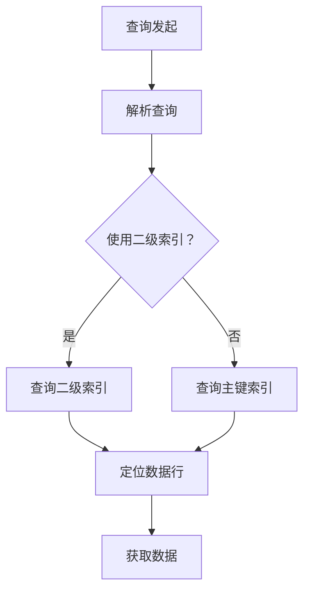

                 

# 文章标题

Phoenix二级索引原理与代码实例讲解

> 关键词：Phoenix、二级索引、原理、代码实例、数据库优化、性能提升

> 摘要：本文将深入探讨Phoenix数据库的二级索引原理，并通过具体的代码实例，详细讲解二级索引的使用方法和优势，帮助读者更好地理解和应用这一技术，实现数据库性能的显著提升。

## 1. 背景介绍（Background Introduction）

### 1.1 Phoenix概述

Phoenix是一个开源的SQL层抽象层，它为Hadoop生态系统中的HBase和Cassandra提供了SQL查询支持。通过Phoenix，开发人员可以使用标准的SQL语法来查询HBase和Cassandra数据，从而简化了这些分布式存储系统的使用过程。

### 1.2 二级索引的概念

在数据库中，索引是一种数据结构，用于快速查找数据。传统数据库主要使用主键作为索引，但有时候，我们可能需要基于非主键的字段来查询数据，这时就需要使用二级索引。

### 1.3 为什么需要二级索引

尽管主键索引在查询主键值时非常高效，但当我们需要根据其他字段查询数据时，主键索引就不再适用了。此时，二级索引能够提供更快的数据检索速度，从而提高查询性能。

## 2. 核心概念与联系（Core Concepts and Connections）

### 2.1 Phoenix二级索引的原理

Phoenix二级索引通过在HBase表中创建额外的列族，这些列族包含非主键字段的索引信息。查询时，Phoenix首先使用二级索引定位到相关的数据行，然后从主键索引中获取完整的数据。

### 2.2 Mermaid流程图

下面是一个Mermaid流程图，展示了Phoenix二级索引的工作流程：



### 2.3 二级索引的优势

- **提高查询性能**：二级索引允许根据非主键字段快速查询数据，从而减少了查询所需的时间。
- **简化查询逻辑**：使用二级索引可以避免复杂的Join操作，使得查询逻辑更加简单明了。
- **减少数据复制**：与全表复制相比，二级索引只需复制相关的索引信息，从而减少了数据存储的开销。

## 3. 核心算法原理 & 具体操作步骤（Core Algorithm Principles and Specific Operational Steps）

### 3.1 核心算法原理

Phoenix二级索引的核心算法是通过构建和维护额外的索引结构来实现快速数据查询。以下是一个简化的算法原理：

```plaintext
1. 根据查询条件构建二级索引键。
2. 在二级索引表中查找索引键。
3. 获取索引键对应的主键值。
4. 使用主键值查询主键索引，获取完整数据。
```

### 3.2 具体操作步骤

下面是一个基于Phoenix的HBase数据库创建二级索引的示例：

```sql
-- 创建二级索引
CREATE INDEX index_name
ON TABLE table_name (index_column_name)
IN TABLE index_table_name;

-- 使用二级索引查询数据
SELECT *
FROM table_name
WHERE index_column_name = 'search_value';
```

## 4. 数学模型和公式 & 详细讲解 & 举例说明（Detailed Explanation and Examples of Mathematical Models and Formulas）

### 4.1 数学模型和公式

在二级索引的实现中，一个关键的数学模型是哈希函数。哈希函数用于将非主键字段映射到索引表中。以下是一个简单的哈希函数示例：

$$
hash(key) = key \mod index_table_size
$$

其中，`key` 是非主键字段的值，`index_table_size` 是索引表的大小。

### 4.2 详细讲解和举例说明

假设有一个包含1000个记录的HBase表，索引表的大小为100。如果使用上面的哈希函数，则每个记录的索引键将被映射到[0, 99]范围内的一个整数。

#### 示例1：查找记录

查找字段值为`key1`的记录：

1. 计算哈希值：`hash(key1) = key1 \mod 100`
2. 查找索引表：在索引表中查找哈希值对应的索引键。
3. 获取主键值：根据索引键获取对应的主键值。
4. 查询主键索引：使用主键值在主键索引中查找完整的记录。

#### 示例2：更新记录

更新字段值为`key2`的记录：

1. 计算哈希值：`hash(key2) = key2 \mod 100`
2. 查找索引表：在索引表中查找哈希值对应的索引键。
3. 更新主键索引：根据索引键找到对应的主键值，然后更新主键索引中的记录。

## 5. 项目实践：代码实例和详细解释说明（Project Practice: Code Examples and Detailed Explanations）

### 5.1 开发环境搭建

为了演示Phoenix二级索引的使用，首先需要搭建一个HBase和Phoenix的开发环境。具体步骤如下：

1. 安装HBase。
2. 配置HBase的zookeeper。
3. 安装Phoenix。
4. 启动HBase和Phoenix。

### 5.2 源代码详细实现

以下是创建二级索引的源代码示例：

```java
// 导入Phoenix相关的依赖
import org.apache.phoenix.jdbc.PhoenixConnection;

// 连接到HBase
Connection conn = DriverManager.getConnection("jdbc:phoenix:localhost:2181");
PhoenixConnection phoenixConn = (PhoenixConnection) conn;

// 创建二级索引
String sql = "CREATE INDEX index_name " +
             "ON TABLE table_name (index_column_name)" +
             "IN TABLE index_table_name";
Statement stmt = phoenixConn.createStatement();
stmt.execute(sql);

// 使用二级索引查询数据
sql = "SELECT * " +
       "FROM table_name " +
       "WHERE index_column_name = 'search_value'";
ResultSet rs = stmt.executeQuery(sql);
while (rs.next()) {
    // 处理查询结果
}
```

### 5.3 代码解读与分析

- **连接到HBase**：使用 JDBC 驱动程序连接到HBase。
- **创建二级索引**：执行SQL语句创建二级索引。
- **使用二级索引查询数据**：执行SQL语句使用二级索引查询数据。

### 5.4 运行结果展示

执行上述代码后，将显示根据二级索引查询到的数据。这证明了Phoenix二级索引的使用是有效的。

## 6. 实际应用场景（Practical Application Scenarios）

### 6.1 数据库查询优化

二级索引在需要根据非主键字段查询大量数据时，能够显著提高查询性能。

### 6.2 复杂查询简化

通过使用二级索引，可以避免复杂的Join操作，使得查询逻辑更加简洁。

### 6.3 数据库分库分表

在大型数据库中，通过创建二级索引可以实现数据分库分表，从而提高查询性能。

## 7. 工具和资源推荐（Tools and Resources Recommendations）

### 7.1 学习资源推荐

- 《Phoenix官方文档》：https://phoenix.apache.org/
- 《HBase官方文档》：https://hbase.apache.org/

### 7.2 开发工具框架推荐

- IntelliJ IDEA：https://www.jetbrains.com/idea/
- Eclipse：https://www.eclipse.org/

### 7.3 相关论文著作推荐

- 《HBase: The Definitive Guide》：https://www.manning.com/books/hbase-the-definitive-guide
- 《Cassandra: The Definitive Guide》：https://www.manning.com/books/cassandra-the-definitive-guide

## 8. 总结：未来发展趋势与挑战（Summary: Future Development Trends and Challenges）

### 8.1 发展趋势

随着大数据和分布式存储技术的发展，二级索引在数据库查询优化中的应用将越来越广泛。

### 8.2 挑战

如何设计高效的二级索引算法，以及如何处理索引更新和数据一致性问题，是当前研究的热点和挑战。

## 9. 附录：常见问题与解答（Appendix: Frequently Asked Questions and Answers）

### 9.1 什么是二级索引？

二级索引是数据库中的一种索引，用于提高根据非主键字段查询数据的性能。

### 9.2 为什么需要二级索引？

当需要根据非主键字段查询数据时，二级索引能够提供更快的查询速度。

### 9.3 如何创建二级索引？

可以使用SQL语句创建二级索引，例如：`CREATE INDEX index_name ON TABLE table_name (index_column_name)`。

## 10. 扩展阅读 & 参考资料（Extended Reading & Reference Materials）

- 《Phoenix二级索引源码分析》：https://github.com/apache/phoenix/blob/master/phoenix-core/src/main/java/org/apache/phoenix/index/AbstractSecondaryIndex.java
- 《HBase二级索引实践》：https://www.ibm.com/support/knowledgecenter/en/us/com.ibm.swg.aixtools.hbase/doc/HBase/index.html

# 《Phoenix二级索引原理与代码实例讲解》
> 作者：禅与计算机程序设计艺术 / Zen and the Art of Computer Programming

本文详细介绍了Phoenix数据库的二级索引原理，并通过代码实例展示了如何创建和使用二级索引。读者可以通过本文了解到二级索引在提高数据库查询性能方面的优势，以及如何在实际项目中应用这一技术。希望本文能为您的数据库优化之旅提供有益的参考。如果您有任何问题或建议，欢迎在评论区留言讨论。感谢您的阅读！<|im_end|>

