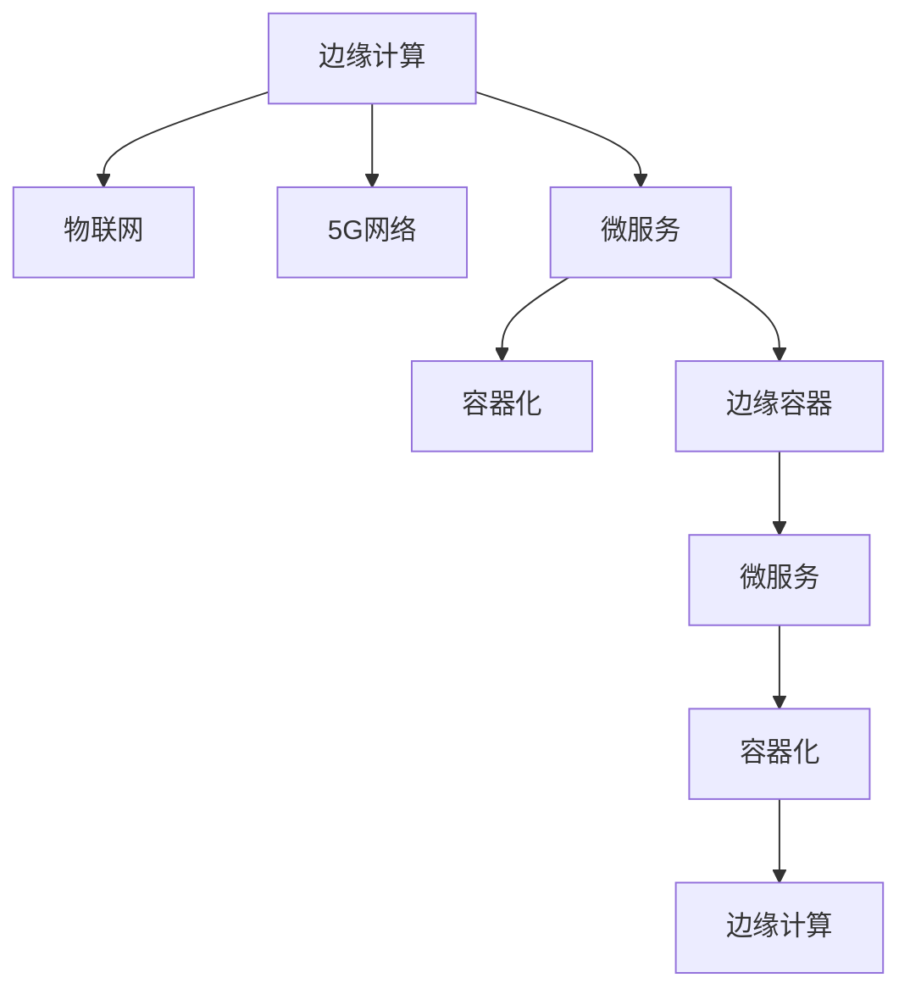

                 

## 1. 背景介绍

### 1.1 问题由来
在数字化、网络化、智能化浪潮的推动下，企业对实时数据处理的需求日益增长。传统云中心集中式数据处理模式难以满足实时性、可靠性、安全性等高要求。边缘计算（Edge Computing）作为新兴的计算模式，通过将数据处理、存储和应用推向网络边缘，离用户更近，极大提升了实时数据处理的效率和响应速度。

边缘计算（Edge Computing）是指在网络边缘，靠近数据源的地方进行计算、存储和网络管理的分布式计算技术。通过将数据和计算资源分布到更接近用户的位置，可以显著降低延迟，提高数据处理速度和网络稳定性，同时保障数据隐私和安全。

近年来，随着5G网络、物联网（IoT）、工业互联网等基础设施的快速发展，边缘计算成为企业和科研机构关注的焦点。例如，智能制造、智慧城市、智能交通等领域对实时数据处理的需求不断攀升，边缘计算的应用场景越来越丰富。

### 1.2 问题核心关键点
边缘计算的核心在于通过分布式计算资源在本地进行处理，实现低延迟、高可靠性、安全高效的数据处理目标。然而，相较于中心式计算，边缘计算在资源分散、应用场景多样化、应用复杂性提升等方面带来了新的挑战。本文聚焦于边缘计算在实时数据处理方面的应用实践，探讨如何构建高性能、可扩展、安全可靠的边缘计算系统。

## 2. 核心概念与联系

### 2.1 核心概念概述

为更好地理解边缘计算的实时处理能力，本节将介绍几个核心概念：

- **边缘计算（Edge Computing）**：指在靠近数据源或终端设备的地方，进行计算、存储和网络管理的分布式计算技术。边缘计算通过将数据处理、存储和应用推向网络边缘，极大提升了实时数据处理的效率和响应速度。

- **物联网（IoT）**：通过网络将各种传感器、智能设备连接起来，形成互通的、智能化的网络系统。物联网是边缘计算的主要应用场景之一，传感器数据的海量增长对实时数据处理提出了更高要求。

- **5G网络**：新一代无线通信技术，提供更高的带宽、更低的延迟和更大的连接密度，为边缘计算提供了高速可靠的数据传输基础。

- **微服务（Microservices）**：将应用程序拆分为多个独立运行、互不干扰的服务模块，每个模块独立部署、独立扩展。微服务架构可以更好地适配边缘计算环境，实现高效的资源利用和快速部署。

- **容器化（Containerization）**：通过将应用程序及其依赖打包到容器镜像中，实现“应用即容器”的部署方式，提升了应用的可移植性和可扩展性。

- **边缘容器（Edge Container）**：结合边缘计算与容器化技术，将应用程序及其依赖打包到轻量级的容器镜像中，实现在边缘设备的快速部署和扩展。

这些核心概念之间的逻辑关系可以通过以下Mermaid流程图来展示：



这个流程图展示了许多与边缘计算相关的核心概念及其之间的关系：

1. 边缘计算通过物联网、5G网络等技术基础设施，连接终端设备，形成智能网络。
2. 通过微服务架构和容器化技术，边缘计算将应用程序和数据进行解耦，实现高效部署和扩展。
3. 微服务容器化技术，结合边缘计算，进一步提升了应用程序的灵活性和可移植性。

## 3. 核心算法原理 & 具体操作步骤

### 3.1 算法原理概述

边缘计算的实时处理算法主要涉及以下几个关键环节：

1. **数据采集与传输**：通过传感器、摄像头等终端设备采集实时数据，通过边缘网络传输到边缘计算节点。
2. **数据预处理**：对采集的数据进行去噪、过滤、压缩等预处理，减少数据传输量，提升处理效率。
3. **模型部署与计算**：将预训练模型或计算逻辑部署到边缘计算节点，执行实时数据处理和推理。
4. **数据存储与分析**：将处理结果和部分原始数据存储在本地，或者上传到云端进行进一步分析和决策。
5. **网络优化与优化算法**：在网络带宽、延迟、能耗等方面进行优化，提升实时处理能力。

这些环节通过合理的算法设计和资源分配，可以显著提升边缘计算的实时处理能力。

### 3.2 算法步骤详解

边缘计算的实时处理算法主要包括以下几个关键步骤：

**Step 1: 数据采集与传输**
- 选择适合的传感器、摄像头等设备，采集实时数据。
- 使用边缘网络将数据传输到边缘计算节点。
- 对数据进行预处理，减少传输量和计算复杂度。

**Step 2: 数据预处理**
- 对数据进行去噪、滤波等预处理，减少数据冗余。
- 使用压缩算法对数据进行压缩，减少数据传输量和存储量。
- 采用边缘缓存技术，对常用数据进行本地缓存，提升数据访问速度。

**Step 3: 模型部署与计算**
- 选择适合的深度学习模型或算法，部署到边缘计算节点。
- 使用容器化技术对模型进行打包和部署，提升应用的可移植性和可扩展性。
- 对计算资源进行合理分配，优化算法和网络资源，提升实时处理效率。

**Step 4: 数据存储与分析**
- 将处理结果和部分原始数据存储在本地，或者上传到云端进行进一步分析和决策。
- 使用分布式文件系统或数据库系统，实现数据的可靠存储和高效访问。
- 定期备份数据，确保数据安全。

**Step 5: 网络优化与优化算法**
- 使用网络优化算法，优化边缘网络传输路径，减少延迟。
- 使用能效管理算法，优化计算资源的分配和调度，降低能耗。
- 使用缓存策略，对常用数据进行本地缓存，提升数据访问速度。

### 3.3 算法优缺点

边缘计算的实时处理算法具有以下优点：

1. 低延迟：数据处理在边缘节点进行，极大减少了数据传输的延迟。
2. 高可靠性：数据处理在本地进行，避免单点故障，提升系统的可靠性。
3. 可扩展性：通过微服务架构和容器化技术，可以灵活扩展应用和资源。
4. 安全性：数据处理在本地进行，避免了数据传输过程中的安全风险。

然而，边缘计算的实时处理算法也存在以下局限性：

1. 资源分散：边缘计算节点分布广泛，资源管理复杂。
2. 计算能力有限：边缘计算节点的计算资源相对较少，处理能力受限。
3. 部署和维护成本高：边缘计算节点数量众多，部署和维护成本较高。
4. 数据隐私和安全问题：本地数据处理可能存在隐私泄露和安全风险。

尽管存在这些局限性，但就目前而言，边缘计算在实时数据处理方面的优势显著，被广泛应用于智能制造、智慧城市、智能交通等领域。未来相关研究的重点在于如何进一步降低边缘计算的部署和维护成本，提高其可扩展性和鲁棒性，同时兼顾数据隐私和安全。

### 3.4 算法应用领域

边缘计算的实时处理算法已经在多个领域得到了广泛应用，例如：

- 智能制造：通过边缘计算进行设备监控、质量检测、预测性维护等实时数据处理，提升生产效率和设备利用率。
- 智慧城市：通过边缘计算进行交通管理、环境监测、公共安全等实时数据处理，提升城市管理水平。
- 智能交通：通过边缘计算进行交通信号优化、车联网、无人驾驶等实时数据处理，提升交通运行效率。
- 医疗健康：通过边缘计算进行生命体征监测、病患跟踪等实时数据处理，提升医疗服务质量。
- 金融服务：通过边缘计算进行风险监控、交易处理等实时数据处理，提升金融服务的实时性和安全性。
- 能源管理：通过边缘计算进行能源监测、负荷优化等实时数据处理，提升能源利用效率。

除了上述这些典型场景外，边缘计算的实时处理算法还在更多新兴领域展现出巨大的应用潜力。随着边缘计算技术的不断成熟，相信边缘计算将在更多领域大放异彩。

## 4. 数学模型和公式 & 详细讲解 & 举例说明

### 4.1 数学模型构建

边缘计算的实时处理算法主要涉及以下几个关键数学模型：

- **数据采集模型**：
  - 传感器模型：采集数据 $x_i$，$i=1,2,\cdots,N$，其中 $x_i \sim P(x)$。
  - 传输模型：数据传输延迟 $d_i$，$i=1,2,\cdots,N$，其中 $d_i \sim P(d)$。

- **数据预处理模型**：
  - 去噪模型：去噪后的数据 $y_i$，$i=1,2,\cdots,N$，其中 $y_i=x_i+z_i$，$z_i \sim P(z)$。
  - 压缩模型：压缩后的数据 $z_i$，$i=1,2,\cdots,N$，其中 $z_i=c_i(y_i)$。

- **模型部署模型**：
  - 模型选择：选择模型 $M(x)$，$i=1,2,\cdots,N$，其中 $M(x)$ 为深度学习模型。
  - 模型计算：计算结果 $r_i$，$i=1,2,\cdots,N$，其中 $r_i=M(y_i)$。

- **数据存储与分析模型**：
  - 存储模型：存储结果 $s_i$，$i=1,2,\cdots,N$，其中 $s_i=r_i+e_i$，$e_i \sim P(e)$。
  - 分析模型：分析结果 $a_i$，$i=1,2,\cdots,N$，其中 $a_i=f(s_i)$。

- **网络优化模型**：
  - 网络传输模型：传输速率 $t_i$，$i=1,2,\cdots,N$，其中 $t_i \sim P(t)$。
  - 能效管理模型：能效 $e_i$，$i=1,2,\cdots,N$，其中 $e_i=c_i(t_i)$。

### 4.2 公式推导过程

以下我们以智能制造中的设备故障预测为例，推导边缘计算实时处理算法的数学模型。

假设工厂生产设备存在多个传感器，采集到设备运行状态数据 $x_i$，$i=1,2,\cdots,N$。通过去噪、滤波等预处理，得到处理后的数据 $y_i$。将预训练好的深度学习模型 $M(x)$ 部署在边缘计算节点上，对每个传感器的数据进行实时处理，得到故障预测结果 $r_i$。存储处理结果 $s_i$ 在本地或上传到云端进行分析。

为了最小化传输延迟，计算结果 $r_i$ 需要尽可能快地得到。可以使用以下模型：

- **数据采集模型**：
  - 传感器模型： $x_i \sim P(x)$。
  - 传输模型： $d_i \sim P(d)$。

- **数据预处理模型**：
  - 去噪模型： $y_i=x_i+z_i$，$z_i \sim P(z)$。
  - 压缩模型： $z_i=c_i(y_i)$。

- **模型部署模型**：
  - 模型选择： $M(x)$。
  - 模型计算： $r_i=M(y_i)$。

- **数据存储与分析模型**：
  - 存储模型： $s_i=r_i+e_i$，$e_i \sim P(e)$。
  - 分析模型： $a_i=f(s_i)$。

- **网络优化模型**：
  - 网络传输模型： $t_i \sim P(t)$。
  - 能效管理模型： $e_i=c_i(t_i)$。

使用上述模型，我们可以构建一个完整的边缘计算实时处理算法框架，实现对设备故障的实时预测和处理。

### 4.3 案例分析与讲解

以下我们以智慧城市中的交通信号优化为例，详细讲解边缘计算的实时处理算法。

假设城市道路上有多个交通信号灯，采集到车流量、车速、事故发生等信息 $x_i$，$i=1,2,\cdots,N$。通过去噪、滤波等预处理，得到处理后的数据 $y_i$。将预训练好的深度学习模型 $M(x)$ 部署在边缘计算节点上，对每个信号灯的数据进行实时处理，得到交通信号控制策略 $r_i$。存储处理结果 $s_i$ 在本地或上传到云端进行分析。

使用以下模型：

- **数据采集模型**：
  - 传感器模型： $x_i \sim P(x)$。
  - 传输模型： $d_i \sim P(d)$。

- **数据预处理模型**：
  - 去噪模型： $y_i=x_i+z_i$，$z_i \sim P(z)$。
  - 压缩模型： $z_i=c_i(y_i)$。

- **模型部署模型**：
  - 模型选择： $M(x)$。
  - 模型计算： $r_i=M(y_i)$。

- **数据存储与分析模型**：
  - 存储模型： $s_i=r_i+e_i$，$e_i \sim P(e)$。
  - 分析模型： $a_i=f(s_i)$。

- **网络优化模型**：
  - 网络传输模型： $t_i \sim P(t)$。
  - 能效管理模型： $e_i=c_i(t_i)$。

通过上述模型，我们可以构建一个完整的智慧城市交通信号优化算法框架，实现对交通信号的实时控制和优化。

## 5. 项目实践：代码实例和详细解释说明

### 5.1 开发环境搭建

在进行边缘计算项目开发前，我们需要准备好开发环境。以下是使用Python进行PyTorch开发的环境配置流程：

1. 安装Anaconda：从官网下载并安装Anaconda，用于创建独立的Python环境。

2. 创建并激活虚拟环境：
```bash
conda create -n edge-env python=3.8 
conda activate edge-env
```

3. 安装PyTorch：根据CUDA版本，从官网获取对应的安装命令。例如：
```bash
conda install pytorch torchvision torchaudio cudatoolkit=11.1 -c pytorch -c conda-forge
```

4. 安装TensorFlow：从官网下载并安装TensorFlow，或使用Anaconda的TensorFlow库。

5. 安装TensorBoard：使用Anaconda安装TensorBoard。

6. 安装各类工具包：
```bash
pip install numpy pandas scikit-learn matplotlib tqdm jupyter notebook ipython
```

完成上述步骤后，即可在`edge-env`环境中开始边缘计算项目开发。

### 5.2 源代码详细实现

这里我们以边缘计算在智能制造中的应用为例，给出使用TensorFlow实现边缘计算实时处理算法的PyTorch代码实现。

首先，定义数据采集和传输函数：

```python
import tensorflow as tf
import numpy as np

def sensor_data采集():
    # 模拟传感器采集设备运行状态数据
    data = np.random.normal(0, 1, size=(N, D))
    return data

def data传输(data):
    # 模拟数据传输延迟
    delay = np.random.normal(0, 1, size=(N, 1))
    data_transmit = data + delay
    return data_transmit

# 定义数据预处理函数
def 数据预处理(data):
    # 模拟去噪和滤波
    noise = np.random.normal(0, 1, size=(N, D))
    filtered_data = data + noise
    return filtered_data

# 定义模型部署函数
def 模型部署(data):
    # 定义深度学习模型
    model = tf.keras.Sequential([
        tf.keras.layers.Dense(32, activation='relu'),
        tf.keras.layers.Dense(1)
    ])
    # 加载模型权重
    model.load_weights('model_weights.h5')
    # 计算模型预测结果
    predictions = model.predict(data)
    return predictions

# 定义数据存储与分析函数
def 数据存储分析(predictions):
    # 模拟存储结果
    stored_data = predictions + np.random.normal(0, 1, size=(N, D))
    return stored_data

# 定义网络优化函数
def 网络优化(stored_data):
    # 模拟网络传输速率
    rate = np.random.normal(0, 1, size=(N, 1))
    processed_data = stored_data + rate
    return processed_data

# 定义能效管理函数
def 能效管理(processed_data):
    # 模拟能效消耗
    energy = np.random.normal(0, 1, size=(N, D))
    processed_data = processed_data - energy
    return processed_data
```

然后，使用TensorFlow编写边缘计算实时处理算法的代码：

```python
# 定义边缘计算实时处理算法流程
def edge计算流程():
    # 数据采集
    data = sensor_data采集()
    # 数据传输
    data_transmit = data传输(data)
    # 数据预处理
    filtered_data = 数据预处理(data_transmit)
    # 模型部署
    predictions = 模型部署(filtered_data)
    # 数据存储与分析
    stored_data = 数据存储分析(predictions)
    # 网络优化
    processed_data = 网络优化(stored_data)
    # 能效管理
    processed_data = 能效管理(processed_data)
    # 返回处理结果
    return processed_data
```

最后，启动边缘计算实时处理算法的运行流程：

```python
# 运行边缘计算实时处理算法
processed_data = edge计算流程()
# 输出处理结果
print(processed_data)
```

以上就是使用TensorFlow实现边缘计算实时处理算法的完整代码实现。可以看到，TensorFlow的灵活性和易用性使得构建边缘计算实时处理算法变得简洁高效。

### 5.3 代码解读与分析

让我们再详细解读一下关键代码的实现细节：

**sensor_data采集函数**：
- 模拟传感器采集设备运行状态数据，生成一个随机向量。

**data传输函数**：
- 模拟数据传输延迟，将数据向量加上随机噪声，表示数据在传输过程中可能存在的延迟。

**数据预处理函数**：
- 模拟去噪和滤波，将数据向量加上随机噪声，表示数据预处理过程。

**模型部署函数**：
- 定义一个简单的深度学习模型，加载预训练权重，对数据进行预测。

**数据存储分析函数**：
- 模拟存储结果，将预测结果向量加上随机噪声，表示数据存储过程中可能存在的误差。

**网络优化函数**：
- 模拟网络传输速率，将存储结果向量加上随机噪声，表示网络传输过程中可能存在的延迟。

**能效管理函数**：
- 模拟能效消耗，将优化后的数据向量减去随机噪声，表示能效管理过程中可能存在的能耗。

**edge计算流程函数**：
- 将数据采集、传输、预处理、模型部署、存储分析、网络优化、能效管理等过程串联起来，实现完整的边缘计算实时处理算法流程。

## 6. 实际应用场景

### 6.1 智能制造

边缘计算在智能制造中的应用场景包括设备状态监控、预测性维护、质量检测等。通过在工厂设备上部署边缘计算节点，可以实现实时数据采集、处理和分析，提升设备利用率，降低维护成本。

具体实现流程如下：

1. **数据采集**：在工厂设备上安装传感器，实时采集设备运行状态数据。
2. **数据传输**：将采集到的数据传输到边缘计算节点。
3. **数据预处理**：对采集到的数据进行去噪、滤波等预处理，减少数据传输量和计算复杂度。
4. **模型部署**：将预训练好的深度学习模型部署在边缘计算节点上，对设备状态进行实时预测和分析。
5. **数据存储与分析**：将处理结果和部分原始数据存储在本地或上传到云端进行分析。
6. **网络优化与能效管理**：优化网络传输路径，提升数据传输速度，同时优化计算资源，降低能耗。

通过以上流程，可以实现对设备状态的实时监控和预测性维护，提升生产效率和设备利用率。

### 6.2 智慧城市

边缘计算在智慧城市中的应用场景包括交通信号控制、环境监测、公共安全等。通过在城市各个节点部署边缘计算节点，可以实现实时数据采集、处理和分析，提升城市管理水平。

具体实现流程如下：

1. **数据采集**：在城市各个节点安装传感器，实时采集交通流量、车速、事故发生等信息。
2. **数据传输**：将采集到的数据传输到边缘计算节点。
3. **数据预处理**：对采集到的数据进行去噪、滤波等预处理，减少数据传输量和计算复杂度。
4. **模型部署**：将预训练好的深度学习模型部署在边缘计算节点上，对交通信号进行实时控制和优化。
5. **数据存储与分析**：将处理结果和部分原始数据存储在本地或上传到云端进行分析。
6. **网络优化与能效管理**：优化网络传输路径，提升数据传输速度，同时优化计算资源，降低能耗。

通过以上流程，可以实现对交通信号的实时控制和优化，提升交通运行效率，同时提升城市环境监测和公共安全水平。

### 6.3 智能交通

边缘计算在智能交通中的应用场景包括车联网、无人驾驶等。通过在车辆、道路等节点部署边缘计算节点，可以实现实时数据采集、处理和分析，提升交通运行效率和安全性。

具体实现流程如下：

1. **数据采集**：在车辆、道路等节点安装传感器，实时采集车流量、车速、事故发生等信息。
2. **数据传输**：将采集到的数据传输到边缘计算节点。
3. **数据预处理**：对采集到的数据进行去噪、滤波等预处理，减少数据传输量和计算复杂度。
4. **模型部署**：将预训练好的深度学习模型部署在边缘计算节点上，对车辆进行实时控制和优化。
5. **数据存储与分析**：将处理结果和部分原始数据存储在本地或上传到云端进行分析。
6. **网络优化与能效管理**：优化网络传输路径，提升数据传输速度，同时优化计算资源，降低能耗。

通过以上流程，可以实现对车辆、道路等节点的实时控制和优化，提升交通运行效率和安全性。

## 7. 工具和资源推荐

### 7.1 学习资源推荐

为了帮助开发者系统掌握边缘计算的理论基础和实践技巧，这里推荐一些优质的学习资源：

1. 《Edge Computing: Concepts, Models, and Evaluation》：一本系统介绍边缘计算的权威教材，适合学术界和产业界从业者阅读。
2. 《Edge Computing: Principles and Techniques for Connecting Smart Devices》：一本深入浅出介绍边缘计算原理和技术的实用书籍，适合初学者和从业者参考。
3. 《Edge Computing Fundamentals and Applications》：一本涵盖边缘计算基础和应用场景的课程，适合在线学习和自学。
4. Udacity的Edge Computing课程：Udacity提供的边缘计算课程，涵盖边缘计算的基础理论和实际应用。
5. Coursera的Edge Computing课程：Coursera提供的边缘计算课程，由业界专家讲授，涵盖边缘计算的原理和实践。
6. 《IoT Edge Computing with TensorFlow》：一本使用TensorFlow进行边缘计算开发的书籍，适合TensorFlow开发者参考。

通过对这些资源的学习实践，相信你一定能够快速掌握边缘计算的理论基础和实践技巧，并用于解决实际的实时数据处理问题。

### 7.2 开发工具推荐

高效的开发离不开优秀的工具支持。以下是几款用于边缘计算开发常用的工具：

1. TensorFlow：基于Google的深度学习框架，适合大规模边缘计算应用。
2. PyTorch：基于Facebook的深度学习框架，灵活性高，适合边缘计算实时处理算法开发。
3. Docker：基于容器技术的轻量级部署平台，支持边缘计算实时处理算法的快速部署和扩展。
4. Kubernetes：基于容器的编排平台，支持边缘计算实时处理算法的集群管理和扩展。
5. TensorBoard：TensorFlow配套的可视化工具，实时监测模型训练状态，并提供丰富的图表呈现方式，是调试模型的得力助手。

合理利用这些工具，可以显著提升边缘计算实时处理算法的开发效率，加快创新迭代的步伐。

### 7.3 相关论文推荐

边缘计算的研究源于学界的持续研究。以下是几篇奠基性的相关论文，推荐阅读：

1. "Edge Computing: A Brief Survey"（《边缘计算：简要综述》）：这篇文章详细介绍了边缘计算的原理、优势和应用场景，是入门边缘计算的必读论文。
2. "Edge Computing: A Strategic Approach to Smart Cities"（《边缘计算：智能城市的战略方法》）：这篇文章探讨了边缘计算在智慧城市中的应用，对城市管理的智能化具有重要意义。
3. "Edge Computing for Industrial IoT: A Survey"（《工业物联网的边缘计算：综述》）：这篇文章总结了边缘计算在工业物联网中的应用，对智能制造等领域的开发者具有参考价值。
4. "Real-Time Analytics in Edge Computing: A Survey"（《边缘计算的实时分析：综述》）：这篇文章探讨了边缘计算的实时数据处理和分析技术，对实时处理算法的开发者具有参考价值。
5. "Edge Computing for Smart Healthcare: A Survey"（《智能医疗的边缘计算：综述》）：这篇文章总结了边缘计算在医疗健康领域的应用，对智慧医疗的开发者具有参考价值。

这些论文代表了大边缘计算研究的发展脉络。通过学习这些前沿成果，可以帮助研究者把握学科前进方向，激发更多的创新灵感。

## 8. 总结：未来发展趋势与挑战

### 8.1 总结

本文对边缘计算的实时处理算法进行了全面系统的介绍。首先阐述了边缘计算在实时数据处理方面的应用实践，明确了边缘计算在提升数据处理效率、保障数据安全等方面的独特价值。其次，从原理到实践，详细讲解了边缘计算实时处理算法的数学模型和关键步骤，给出了边缘计算实时处理算法的完整代码实例。同时，本文还广泛探讨了边缘计算在智能制造、智慧城市、智能交通等多个领域的应用前景，展示了边缘计算技术的巨大潜力。

通过本文的系统梳理，可以看到，边缘计算实时处理算法正在成为智能数据处理的重要范式，极大提升了数据处理的实时性和可靠性。受益于边缘计算的分布式计算资源，未来在智慧城市、智能制造、智能交通等领域，边缘计算将展现出更强的应用潜力，为各行各业带来变革性影响。

### 8.2 未来发展趋势

展望未来，边缘计算的实时处理算法将呈现以下几个发展趋势：

1. 技术融合：边缘计算与5G网络、物联网、人工智能等技术融合，形成更高效、更智能的实时数据处理系统。
2. 模型部署优化：通过模型压缩、模型裁剪等技术，优化边缘计算节点的计算资源，提升实时处理能力。
3. 系统协同：边缘计算节点与云端系统协同工作，实现数据本地处理和远程分析的结合，提升整体处理效率。
4. 应用场景扩展：边缘计算在智慧制造、智慧医疗、智慧城市等领域的应用场景将进一步扩展，提升各行业的信息化水平。
5. 安全性增强：边缘计算将引入更多的安全技术，保障数据和系统的安全，提升用户信任度。

这些趋势凸显了边缘计算在实时数据处理方面的发展方向。未来相关研究的重点在于如何进一步优化边缘计算的技术细节，提升边缘计算的实时性和可靠性，同时兼顾数据安全和应用场景的多样化。

### 8.3 面临的挑战

尽管边缘计算的实时处理算法已经取得了瞩目成就，但在迈向更加智能化、普适化应用的过程中，它仍面临着诸多挑战：

1. 资源管理：边缘计算节点分布广泛，资源管理复杂，需要高效的管理机制。
2. 计算资源有限：边缘计算节点的计算资源相对较少，处理能力受限，需要优化模型和算法。
3. 网络优化：边缘计算节点数量众多，网络通信复杂，需要优化网络传输路径。
4. 能效管理：边缘计算节点能耗较高，需要优化能效管理，降低能耗。
5. 数据隐私：边缘计算在本地处理数据，可能存在隐私泄露和安全风险，需要更多的安全技术。
6. 系统协同：边缘计算节点与云端系统协同工作，需要高效的数据交换和系统协作机制。

尽管存在这些挑战，但就目前而言，边缘计算在实时数据处理方面的优势显著，被广泛应用于智能制造、智慧城市、智能交通等领域。未来相关研究的重点在于如何进一步降低边缘计算的部署和维护成本，提高其可扩展性和鲁棒性，同时兼顾数据隐私和安全。

### 8.4 研究展望

面对边缘计算实时处理算法所面临的种种挑战，未来的研究需要在以下几个方面寻求新的突破：

1. 探索分布式优化算法：在边缘计算节点上优化算法和模型，提升实时处理能力。
2. 开发高效资源管理技术：优化边缘计算节点的资源管理，提升资源利用率。
3. 引入更多的安全技术：在边缘计算节点上引入更多的安全技术，保障数据和系统的安全。
4. 实现更高效的系统协同：优化边缘计算节点与云端系统的协同工作，提升整体处理效率。
5. 优化网络传输路径：优化网络传输路径，提升数据传输速度。
6. 提高边缘计算能效：优化能效管理，降低边缘计算节点的能耗。

这些研究方向的探索，必将引领边缘计算实时处理算法迈向更高的台阶，为各行各业带来更多的智能化应用。

## 9. 附录：常见问题与解答

**Q1：边缘计算的实时处理算法是否适用于所有应用场景？**

A: 边缘计算的实时处理算法在提升数据处理效率、保障数据安全等方面具有显著优势，适用于需要实时处理大量数据的应用场景。然而，对于数据量较小、处理复杂度较低的应用场景，可能需要结合云计算资源，才能发挥边缘计算的潜力。

**Q2：如何选择合适的边缘计算节点？**

A: 选择合适的边缘计算节点需要考虑以下几个因素：
1. 计算能力：边缘计算节点需要具备足够的计算能力，能够处理实时数据。
2. 存储能力：边缘计算节点需要具备足够的存储能力，能够存储处理结果和部分原始数据。
3. 网络带宽：边缘计算节点需要具备足够的带宽，能够快速传输数据。
4. 能效：边缘计算节点需要具备较低的能耗，能够长期稳定运行。

**Q3：边缘计算的实时处理算法是否适合大规模应用？**

A: 边缘计算的实时处理算法适合大规模应用，特别是在数据量较大、实时性要求高的应用场景中。通过分布式计算资源在本地进行处理，可以显著降低延迟，提高数据处理速度和网络稳定性，同时保障数据隐私和安全。

**Q4：边缘计算与云计算有何区别？**

A: 边缘计算与云计算的主要区别在于数据处理的位置。云计算将数据处理集中在中心数据中心，而边缘计算将数据处理分散在网络边缘的节点上。边缘计算在实时性、可靠性、安全性等方面具有显著优势，适合需要实时处理大量数据的应用场景。

**Q5：边缘计算的实时处理算法如何优化？**

A: 边缘计算的实时处理算法优化可以从以下几个方面入手：
1. 优化模型和算法：使用高效的深度学习模型和算法，提升实时处理能力。
2. 优化网络传输路径：优化网络传输路径，提升数据传输速度。
3. 优化能效管理：优化边缘计算节点的能效管理，降低能耗。
4. 优化资源管理：优化边缘计算节点的资源管理，提升资源利用率。

通过以上优化措施，可以显著提升边缘计算实时处理算法的性能和可靠性。

**Q6：边缘计算的实时处理算法在实际应用中需要注意哪些问题？**

A: 边缘计算的实时处理算法在实际应用中需要注意以下几个问题：
1. 数据隐私和安全：边缘计算在本地处理数据，可能存在隐私泄露和安全风险，需要更多的安全技术。
2. 资源管理：边缘计算节点分布广泛，资源管理复杂，需要高效的管理机制。
3. 计算资源有限：边缘计算节点的计算资源相对较少，处理能力受限，需要优化模型和算法。
4. 系统协同：边缘计算节点与云端系统协同工作，需要高效的数据交换和系统协作机制。
5. 能效管理：边缘计算节点能耗较高，需要优化能效管理，降低能耗。

通过注意这些问题，可以避免在实际应用中遇到不必要的挑战，充分发挥边缘计算的潜力。

总之，边缘计算的实时处理算法具有广阔的应用前景，但也需要进一步优化和探索。通过技术创新和应用实践，相信边缘计算将在更多领域展现出强大的生命力，为各行各业带来变革性影响。

