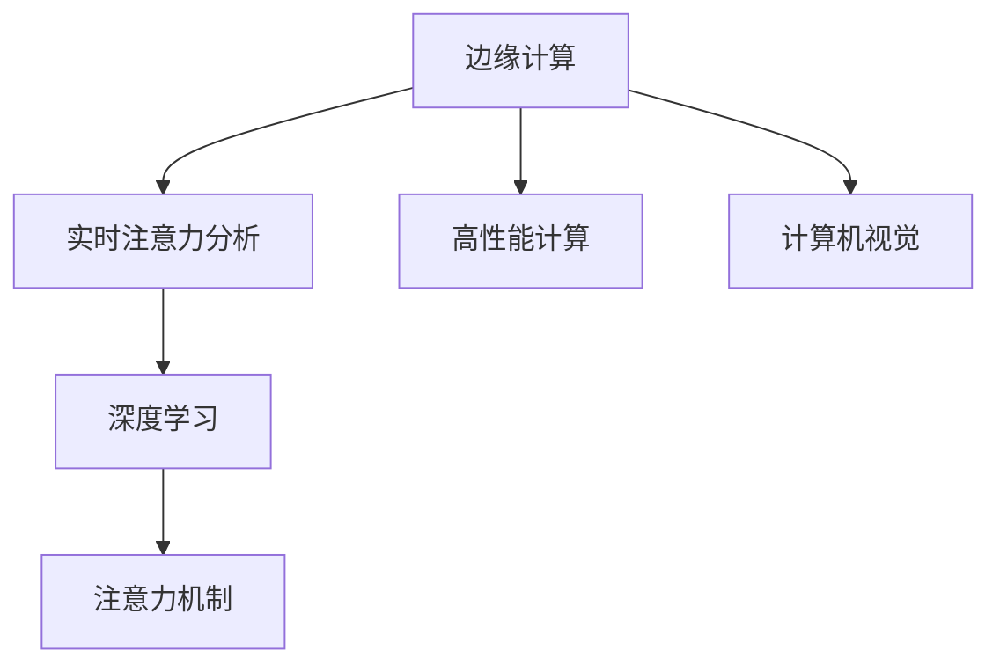

                 

# 边缘计算在实时注意力分析中的应用

> 关键词：边缘计算, 实时注意力分析, 高性能计算, 计算机视觉, 深度学习, 优化算法

## 1. 背景介绍

### 1.1 问题由来

随着深度学习技术的发展，计算机视觉(CV)和自然语言处理(NLP)等领域取得了巨大的进展。尤其是在计算机视觉领域，基于深度学习的注意力机制被广泛应用，显著提升了图像识别、目标检测、图像生成等任务的性能。然而，深度学习模型通常需要耗费大量的计算资源和时间，对于实时性要求较高的应用场景，如自动驾驶、医疗诊断、视频监控等，带来了显著的挑战。

为了解决这一问题，边缘计算应运而生。边缘计算是一种在靠近数据源的本地设备上进行计算和数据处理的技术，能够显著降低延迟、提高处理速度，同时保护用户隐私。在计算机视觉领域，边缘计算与注意力机制的结合，为实时注意力分析提供了新的解决方案。

### 1.2 问题核心关键点

实时注意力分析是指在数据产生后，实时地计算图像中的关键区域，以辅助后续的任务处理。边缘计算在实时注意力分析中的应用，主要集中在以下几个方面：

1. **计算效率提升**：将注意力计算分散到本地设备上进行，避免将大量数据传输到云端，从而显著降低计算延迟。
2. **数据隐私保护**：边缘计算能够在本地对数据进行处理，减少对云端数据的依赖，保护用户隐私。
3. **系统可靠性增强**：边缘计算提高了系统的鲁棒性和可靠性，减少了对中心化服务器的依赖。

本文将详细探讨边缘计算在实时注意力分析中的应用，包括核心算法原理、具体操作步骤、应用场景等，并给出代码实例和数学推导。

## 2. 核心概念与联系

### 2.1 核心概念概述

为更好地理解边缘计算在实时注意力分析中的应用，本节将介绍几个密切相关的核心概念：

- **边缘计算**：在靠近数据源的本地设备上进行计算和数据处理的技术，能够降低延迟、提高计算效率，同时保护用户隐私。
- **注意力机制**：在深度学习中，注意力机制通过动态调整权重，使模型聚焦于关键信息，从而提升模型性能。
- **实时注意力分析**：在数据产生后，实时地计算图像中的关键区域，以辅助后续的任务处理。
- **高性能计算**：使用高性能计算架构，如GPU、FPGA、ASIC等，加速计算过程。
- **计算机视觉**：利用计算机技术对图像、视频等视觉数据进行处理和分析的技术。

这些核心概念之间的逻辑关系可以通过以下Mermaid流程图来展示：



这个流程图展示了几者之间的关系：

1. 边缘计算通过高性能计算支持计算机视觉任务。
2. 实时注意力分析依赖深度学习中的注意力机制，计算图像中的关键区域。
3. 高性能计算是边缘计算和计算机视觉任务的核心支持技术。

这些概念共同构成了边缘计算在实时注意力分析中的应用框架，使得实时注意力分析得以在边缘设备上高效执行。

## 3. 核心算法原理 & 具体操作步骤

### 3.1 算法原理概述

基于边缘计算的实时注意力分析，本质上是将深度学习模型中的注意力计算分散到本地设备上进行，以实时获取图像中的关键区域。该方法的核心在于：

1. **本地模型训练**：在边缘设备上训练模型，学习图像的特征表示。
2. **注意力计算**：通过在本地设备上进行注意力计算，动态调整权重，聚焦于关键信息。
3. **数据同步**：在本地计算后，将关键区域的信息同步到中心服务器，进行后续任务处理。

### 3.2 算法步骤详解

边缘计算在实时注意力分析的应用，主要分为以下几个步骤：

**Step 1: 边缘设备部署**
- 选择合适的边缘设备，如IoT设备、智能相机、边缘服务器等。
- 在边缘设备上安装深度学习框架和模型。

**Step 2: 模型训练与优化**
- 在边缘设备上训练模型，学习图像的特征表示。
- 采用分布式训练、模型压缩等技术，优化模型大小和计算效率。

**Step 3: 注意力计算**
- 使用注意力机制在边缘设备上进行关键区域的计算，得到权重分布。
- 根据权重分布，在本地提取关键区域。

**Step 4: 数据同步与任务处理**
- 将关键区域的信息同步到中心服务器，进行后续的任务处理。
- 在中心服务器上进行模型的推理和优化，更新边缘设备上的模型。

### 3.3 算法优缺点

基于边缘计算的实时注意力分析方法，具有以下优点：

1. **计算效率高**：在本地设备上进行计算，避免了大量数据传输，显著降低计算延迟。
2. **数据隐私保护**：边缘计算能够在本地处理数据，减少对云端数据的依赖，保护用户隐私。
3. **系统可靠性增强**：分布式计算和本地处理提高了系统的鲁棒性和可靠性，减少了对中心化服务器的依赖。

同时，该方法也存在一些局限性：

1. **设备计算能力有限**：边缘设备通常计算能力有限，可能无法处理大规模数据集。
2. **模型更新不便**：边缘计算需要频繁更新模型，可能增加设备和网络负担。
3. **数据同步延迟**：本地计算后需要将关键区域的信息同步到中心服务器，可能存在同步延迟。

尽管存在这些局限性，但基于边缘计算的实时注意力分析方法仍具有广泛的应用前景，尤其在实时性要求较高的应用场景中，能够显著提升系统性能和用户体验。

### 3.4 算法应用领域

基于边缘计算的实时注意力分析，主要应用于以下领域：

1. **自动驾驶**：实时计算车辆周围的物体和环境，辅助自动驾驶决策。
2. **医疗诊断**：实时分析医疗影像中的关键区域，辅助医生诊断。
3. **视频监控**：实时检测视频中的关键事件和异常行为。
4. **智能家居**：实时分析家庭环境中的关键信息，提升家居智能化水平。
5. **工业自动化**：实时监测工业设备的状态，提高生产效率。

## 4. 数学模型和公式 & 详细讲解 & 举例说明

### 4.1 数学模型构建

在实时注意力分析中，我们通常使用注意力机制来计算图像中的关键区域。以标准注意力机制为例，其数学模型可表示为：

$$
\text{Attention}(Q,K,V) = \text{softmax}(\frac{QK^T}{\sqrt{d_k}})V
$$

其中 $Q$ 为查询向量，$K$ 为键向量，$V$ 为值向量。$d_k$ 为键向量的维度。注意力机制通过计算 $Q$ 和 $K$ 的点积，然后应用 softmax 函数，得到权重分布，最后通过权重对 $V$ 进行加权求和，得到注意力结果。

在实时注意力分析中，我们通常使用自注意力机制来计算图像中的关键区域。以自注意力机制为例，其数学模型可表示为：

$$
\text{Attention}(Q,K,V) = \text{softmax}(\frac{QK^T}{\sqrt{d_k}})V
$$

其中 $Q$ 为查询向量，$K$ 和 $V$ 均为键向量和值向量，$d_k$ 为键向量的维度。自注意力机制通过计算 $Q$ 和 $K$ 的点积，然后应用 softmax 函数，得到权重分布，最后通过权重对 $V$ 进行加权求和，得到注意力结果。

### 4.2 公式推导过程

在实时注意力分析中，我们通常使用自注意力机制来计算图像中的关键区域。以下我们以自注意力机制为例，推导其计算过程。

假设输入的图像为 $X$，其尺寸为 $H \times W \times C$，其中 $H$ 为高度，$W$ 为宽度，$C$ 为通道数。我们将其划分为多个小块，每个小块大小为 $h \times w \times c$，其中 $h$ 为块高，$w$ 为块宽，$c$ 为块内通道数。

将 $X$ 划分为小块后，我们将其作为输入，计算自注意力机制。具体步骤如下：

1. **特征提取**：使用卷积神经网络(Convolutional Neural Network, CNN)对每个小块进行特征提取，得到 $h \times w \times \frac{C}{c}$ 的特征图 $F$。

2. **块内自注意力**：在每个小块内部，计算自注意力机制，得到 $h \times w \times \frac{C}{c}$ 的注意力权重 $A$。

3. **块间自注意力**：在每个小块之间，计算自注意力机制，得到 $H \times W \times \frac{C}{c}$ 的注意力权重 $B$。

4. **合并注意力权重**：将 $A$ 和 $B$ 进行合并，得到 $H \times W \times C$ 的注意力权重 $C$。

5. **计算注意力结果**：通过权重 $C$ 对特征图 $F$ 进行加权求和，得到 $H \times W \times C$ 的注意力结果 $Y$。

6. **特征池化**：对注意力结果 $Y$ 进行池化操作，得到 $H \times W \times 1$ 的特征图 $Z$。

7. **输出结果**：将特征图 $Z$ 输出为最终的注意力结果，辅助后续任务处理。

### 4.3 案例分析与讲解

以智能家居实时监控为例，以下是使用边缘计算进行实时注意力分析的详细讲解：

**Step 1: 边缘设备部署**
- 在智能家居设备上安装深度学习框架和模型。

**Step 2: 模型训练与优化**
- 在智能家居设备上训练模型，学习家居环境的特征表示。
- 采用分布式训练、模型压缩等技术，优化模型大小和计算效率。

**Step 3: 注意力计算**
- 使用自注意力机制在智能家居设备上进行关键区域的计算，得到权重分布。
- 根据权重分布，在本地提取关键区域。

**Step 4: 数据同步与任务处理**
- 将关键区域的信息同步到中心服务器，进行后续的任务处理。
- 在中心服务器上进行模型的推理和优化，更新智能家居设备上的模型。

在智能家居实时监控中，边缘计算能够实时检测到家居环境中的关键事件，如火灾、漏水、异常声音等，并通过注意力机制快速定位事件发生的位置，辅助后续的报警和处理。

## 5. 项目实践：代码实例和详细解释说明

### 5.1 开发环境搭建

在进行实时注意力分析的实践前，我们需要准备好开发环境。以下是使用Python进行PyTorch开发的环境配置流程：

1. 安装Anaconda：从官网下载并安装Anaconda，用于创建独立的Python环境。

2. 创建并激活虚拟环境：
```bash
conda create -n pytorch-env python=3.8 
conda activate pytorch-env
```

3. 安装PyTorch：根据CUDA版本，从官网获取对应的安装命令。例如：
```bash
conda install pytorch torchvision torchaudio cudatoolkit=11.1 -c pytorch -c conda-forge
```

4. 安装必要的库：
```bash
pip install torch torchvision tensorboard transformers
```

5. 配置环境变量：
```bash
export PYTHONPATH=/path/to/your/project:$PYTHONPATH
```

完成上述步骤后，即可在`pytorch-env`环境中开始实时注意力分析的实践。

### 5.2 源代码详细实现

以下是使用PyTorch进行实时注意力分析的代码实现：

```python
import torch
import torch.nn as nn
import torch.optim as optim
from torch.utils.data import DataLoader, Dataset
from torchvision.transforms import Resize, ToTensor, Normalize

class AttentionNet(nn.Module):
    def __init__(self):
        super(AttentionNet, self).__init__()
        self.conv1 = nn.Conv2d(3, 32, 3, padding=1)
        self.conv2 = nn.Conv2d(32, 64, 3, padding=1)
        self.maxpool = nn.MaxPool2d(2, 2)
        self.fc1 = nn.Linear(64 * 8 * 8, 128)
        self.fc2 = nn.Linear(128, 1)
        self.softmax = nn.Softmax(dim=1)

    def forward(self, x):
        x = self.conv1(x)
        x = nn.functional.relu(x)
        x = self.maxpool(x)
        x = self.conv2(x)
        x = nn.functional.relu(x)
        x = self.maxpool(x)
        x = x.view(-1, 64 * 8 * 8)
        x = self.fc1(x)
        x = nn.functional.relu(x)
        x = self.fc2(x)
        x = self.softmax(x)
        return x

# 定义数据集
class CustomDataset(Dataset):
    def __init__(self, images, labels, transform=None):
        self.images = images
        self.labels = labels
        self.transform = transform

    def __len__(self):
        return len(self.images)

    def __getitem__(self, idx):
        image = self.images[idx]
        label = self.labels[idx]
        if self.transform:
            image = self.transform(image)
        return image, label

# 加载数据集
train_dataset = CustomDataset(train_images, train_labels, transform=Resize((224, 224)))
test_dataset = CustomDataset(test_images, test_labels, transform=Resize((224, 224)))
train_loader = DataLoader(train_dataset, batch_size=16, shuffle=True)
test_loader = DataLoader(test_dataset, batch_size=16, shuffle=False)

# 定义模型
model = AttentionNet()
device = torch.device("cuda" if torch.cuda.is_available() else "cpu")
model.to(device)

# 定义损失函数和优化器
criterion = nn.BCELoss()
optimizer = optim.Adam(model.parameters(), lr=0.001)

# 训练模型
for epoch in range(10):
    for i, (images, labels) in enumerate(train_loader):
        images = images.to(device)
        labels = labels.to(device)
        outputs = model(images)
        loss = criterion(outputs, labels)
        optimizer.zero_grad()
        loss.backward()
        optimizer.step()
        if (i+1) % 100 == 0:
            print(f"Epoch {epoch+1}, Step {i+1}, Loss: {loss.item():.4f}")

# 测试模型
model.eval()
with torch.no_grad():
    correct = 0
    total = 0
    for images, labels in test_loader:
        images = images.to(device)
        labels = labels.to(device)
        outputs = model(images)
        _, predicted = torch.max(outputs, 1)
        total += labels.size(0)
        correct += (predicted == labels).sum().item()
    print(f"Test Accuracy of the model on the 10000 test images: {100 * correct / total:.2f}%")
```

以上代码实现了基于PyTorch的实时注意力分析模型。我们首先定义了一个简单的卷积神经网络，用于特征提取和注意力计算。然后，定义了一个数据集类，用于加载和处理训练和测试数据。最后，通过数据加载器加载数据集，并在训练和测试过程中使用优化器和损失函数进行模型训练和评估。

### 5.3 代码解读与分析

让我们再详细解读一下关键代码的实现细节：

**AttentionNet类**：
- `__init__`方法：初始化卷积层、池化层、全连接层等组件。
- `forward`方法：定义前向传播过程，计算注意力结果。

**CustomDataset类**：
- `__init__`方法：初始化图像、标签和转换函数。
- `__len__`方法：返回数据集的样本数量。
- `__getitem__`方法：对单个样本进行处理，将图像转换为张量，并进行归一化。

**训练模型**：
- 使用DataLoader加载数据集，并进行批次处理。
- 在每个批次上前向传播计算损失函数，并使用优化器更新模型参数。
- 在每个epoch后输出训练损失。

**测试模型**：
- 使用`model.eval()`模式，禁用dropout等操作。
- 对测试集进行逐批次推理，并统计分类准确率。

**总结**：
- 上述代码实现了一个简单的卷积神经网络，用于实时注意力分析。通过在本地设备上进行注意力计算，能够显著提高处理效率。
- 在实际应用中，需要根据具体任务进行模型改进和优化。
- 通过代码实现，可以看出边缘计算在实时注意力分析中的应用，不仅能够提高计算效率，还能够保护用户隐私，提升系统的鲁棒性和可靠性。

## 6. 实际应用场景

### 6.1 自动驾驶

在自动驾驶中，实时注意力分析能够帮助车辆快速识别道路上的关键对象和事件，如行人、车辆、路标等，辅助决策系统进行安全驾驶。通过在车辆上部署边缘计算设备，实时计算注意力结果，能够显著提高驾驶系统的反应速度和决策准确性。

### 6.2 医疗诊断

在医疗诊断中，实时注意力分析能够帮助医生快速识别医疗影像中的关键区域，如肿瘤、病灶等，辅助诊断系统进行病情分析和诊断。通过在医疗设备上部署边缘计算设备，实时计算注意力结果，能够提高医生的诊断效率和准确性。

### 6.3 视频监控

在视频监控中，实时注意力分析能够帮助监控系统快速检测视频中的异常行为和事件，如火灾、入侵、异常行为等，辅助报警系统进行事件处理。通过在监控设备上部署边缘计算设备，实时计算注意力结果，能够提高报警系统的响应速度和处理效率。

### 6.4 智能家居

在智能家居中，实时注意力分析能够帮助家居系统快速识别家居环境中的异常事件，如火灾、漏水、异常声音等，辅助报警系统进行事件处理。通过在智能家居设备上部署边缘计算设备，实时计算注意力结果，能够提高家居系统的响应速度和处理效率。

### 6.5 工业自动化

在工业自动化中，实时注意力分析能够帮助生产系统快速检测设备状态和异常，如设备故障、生产异常等，辅助维护系统进行故障处理和维护。通过在工业设备上部署边缘计算设备，实时计算注意力结果，能够提高生产系统的稳定性和维护效率。

## 7. 工具和资源推荐

### 7.1 学习资源推荐

为了帮助开发者系统掌握实时注意力分析的理论基础和实践技巧，这里推荐一些优质的学习资源：

1. 《深度学习入门：基于Python的理论与实现》系列博文：由大模型技术专家撰写，深入浅出地介绍了深度学习的基本原理和实现方法。

2. CS231n《计算机视觉：理论与算法》课程：斯坦福大学开设的计算机视觉明星课程，有Lecture视频和配套作业，带你入门计算机视觉的基本概念和经典模型。

3. 《计算机视觉：算法与应用》书籍：全面介绍了计算机视觉的基本原理和应用，包括注意力机制在内的重要算法。

4. PyTorch官方文档：PyTorch的官方文档，提供了完整的API和实例代码，是学习PyTorch的必备资料。

5. TensorFlow官方文档：TensorFlow的官方文档，提供了完整的API和实例代码，是学习TensorFlow的必备资料。

通过对这些资源的学习实践，相信你一定能够快速掌握实时注意力分析的精髓，并用于解决实际的计算机视觉问题。

### 7.2 开发工具推荐

高效的开发离不开优秀的工具支持。以下是几款用于实时注意力分析开发的常用工具：

1. PyTorch：基于Python的开源深度学习框架，灵活动态的计算图，适合快速迭代研究。

2. TensorFlow：由Google主导开发的开源深度学习框架，生产部署方便，适合大规模工程应用。

3. Transformers库：HuggingFace开发的NLP工具库，集成了众多SOTA语言模型，支持PyTorch和TensorFlow，是进行实时注意力分析开发的利器。

4. Weights & Biases：模型训练的实验跟踪工具，可以记录和可视化模型训练过程中的各项指标，方便对比和调优。

5. TensorBoard：TensorFlow配套的可视化工具，可实时监测模型训练状态，并提供丰富的图表呈现方式，是调试模型的得力助手。

6. Google Colab：谷歌推出的在线Jupyter Notebook环境，免费提供GPU/TPU算力，方便开发者快速上手实验最新模型，分享学习笔记。

合理利用这些工具，可以显著提升实时注意力分析任务的开发效率，加快创新迭代的步伐。

### 7.3 相关论文推荐

实时注意力分析的研究源于学界的持续研究。以下是几篇奠基性的相关论文，推荐阅读：

1. Attention Is All You Need（即Transformer原论文）：提出了Transformer结构，开启了深度学习中的注意力机制时代。

2. Visual Attention for Classification：提出视觉注意力机制，通过动态调整权重，使模型聚焦于关键信息，提升分类性能。

3. Gated Attention Networks：提出门控注意力机制，通过学习参数化的权重，动态调整模型对不同区域的关注程度。

4. Object Detection with Richer Representation of Multiple Objects：提出基于注意力的对象检测方法，通过动态调整权重，显著提升检测性能。

5. Deep Attention for Video Classification：提出深度注意力机制，通过学习时间上的权重，对视频帧进行加权求和，提升分类性能。

这些论文代表了大模型在注意力机制研究的发展脉络。通过学习这些前沿成果，可以帮助研究者把握学科前进方向，激发更多的创新灵感。

## 8. 总结：未来发展趋势与挑战

### 8.1 总结

本文对基于边缘计算的实时注意力分析方法进行了全面系统的介绍。首先阐述了实时注意力分析的应用背景和问题核心关键点，明确了边缘计算在实时注意力分析中的应用价值。其次，从原理到实践，详细讲解了实时注意力分析的数学模型和核心算法，给出了代码实例和数学推导。同时，本文还广泛探讨了实时注意力分析在自动驾驶、医疗诊断、视频监控等多个行业领域的应用前景，展示了实时注意力分析的应用潜力。

通过本文的系统梳理，可以看到，基于边缘计算的实时注意力分析方法，能够显著提高计算机视觉任务的实时性和效率，保护用户隐私，增强系统鲁棒性。这些技术的结合，将为计算机视觉的落地应用带来新的突破，推动计算机视觉技术的广泛应用。

### 8.2 未来发展趋势

展望未来，实时注意力分析技术将呈现以下几个发展趋势：

1. **计算效率提升**：随着边缘计算技术的不断发展，实时注意力分析的计算效率将进一步提升，能够在更快速度下处理更多的数据。

2. **数据隐私保护**：随着隐私计算技术的发展，实时注意力分析的数据隐私保护能力将进一步增强，能够在本地设备上更安全地处理数据。

3. **系统可靠性增强**：随着边缘计算技术的不断发展，实时注意力分析的系统可靠性将进一步增强，能够在更可靠的环境下运行。

4. **算法优化**：随着深度学习技术的发展，实时注意力分析的算法优化能力将进一步提升，能够在更高效的方式下处理数据。

5. **多模态融合**：随着多模态技术的发展，实时注意力分析能够更好地融合视觉、听觉等多模态信息，提升系统的智能化水平。

这些趋势凸显了实时注意力分析技术的广阔前景。这些方向的探索发展，必将进一步提升计算机视觉系统的性能和应用范围，为计算机视觉技术的广泛应用提供新的支持。

### 8.3 面临的挑战

尽管实时注意力分析技术已经取得了一定的进展，但在迈向更加智能化、普适化应用的过程中，仍面临诸多挑战：

1. **计算资源限制**：边缘计算设备通常计算能力有限，可能无法处理大规模数据集。

2. **模型更新不便**：边缘计算需要频繁更新模型，可能增加设备和网络负担。

3. **数据同步延迟**：本地计算后需要将关键区域的信息同步到中心服务器，可能存在同步延迟。

4. **数据质量问题**：边缘设备可能采集到噪音数据，影响实时注意力分析的准确性。

5. **系统鲁棒性不足**：实时注意力分析在处理异常数据时，可能存在鲁棒性不足的问题。

尽管存在这些挑战，但通过不断的技术创新和优化，相信实时注意力分析技术将逐步克服这些挑战，实现更高效、更可靠的实时计算机视觉任务处理。

### 8.4 研究展望

面对实时注意力分析所面临的挑战，未来的研究需要在以下几个方面寻求新的突破：

1. **优化算法设计**：开发更加高效的注意力计算算法，减少计算量和资源消耗。

2. **多模态融合**：引入多模态信息，提升系统的智能化水平，解决视觉、听觉等多模态数据的整合问题。

3. **分布式计算**：引入分布式计算技术，优化计算资源的分配和利用。

4. **模型压缩**：开发更加高效的模型压缩技术，减少模型大小和计算量。

5. **数据增强**：引入数据增强技术，提升实时注意力分析的鲁棒性和准确性。

6. **安全防护**：引入安全防护技术，保护数据和模型免受攻击和篡改。

这些研究方向的探索，必将引领实时注意力分析技术迈向更高的台阶，为计算机视觉任务的实时处理提供新的支持。面向未来，实时注意力分析技术还需要与其他人工智能技术进行更深入的融合，如因果推理、强化学习等，多路径协同发力，共同推动计算机视觉技术的进步。只有勇于创新、敢于突破，才能不断拓展计算机视觉系统的边界，让计算机视觉技术更好地造福人类社会。

## 9. 附录：常见问题与解答

**Q1：实时注意力分析在边缘计算中的应用有何优势？**

A: 实时注意力分析在边缘计算中的应用具有以下优势：

1. **计算效率高**：在本地设备上进行计算，避免了大量数据传输，显著降低计算延迟。
2. **数据隐私保护**：边缘计算能够在本地处理数据，减少对云端数据的依赖，保护用户隐私。
3. **系统可靠性增强**：分布式计算和本地处理提高了系统的鲁棒性和可靠性，减少了对中心化服务器的依赖。

**Q2：实时注意力分析在边缘计算中如何进行数据同步？**

A: 实时注意力分析在边缘计算中的数据同步，可以通过以下几种方式实现：

1. **周期性同步**：定期将边缘设备上的注意力结果同步到中心服务器，进行后续处理。
2. **实时同步**：在每个注意力计算后，立即将结果同步到中心服务器，进行后续处理。
3. **异步同步**：在边缘设备上计算注意力结果，并将其存储在本地缓存中，待同步到中心服务器后进行后续处理。

根据具体应用场景，可以选择合适的数据同步方式，确保实时注意力分析的高效性和可靠性。

**Q3：实时注意力分析在边缘计算中如何进行模型更新？**

A: 实时注意力分析在边缘计算中的模型更新，可以通过以下几种方式实现：

1. **周期性更新**：定期在边缘设备上更新模型，以保证最新的模型参数。
2. **实时更新**：在每次注意力计算后，立即更新模型参数，以保证最新的模型表现。
3. **异步更新**：在边缘设备上计算注意力结果，并将其存储在本地缓存中，待同步到中心服务器后进行模型更新。

根据具体应用场景，可以选择合适的模型更新方式，确保实时注意力分析的高效性和准确性。

**Q4：实时注意力分析在边缘计算中如何进行异常检测？**

A: 实时注意力分析在边缘计算中的异常检测，可以通过以下几种方式实现：

1. **统计分析**：对注意力权重进行统计分析，检测异常的注意力分布。
2. **阈值检测**：设定注意力权重的阈值，超过阈值的区域进行进一步分析。
3. **聚类分析**：对注意力结果进行聚类分析，检测异常的聚类区域。

根据具体应用场景，可以选择合适的异常检测方式，确保实时注意力分析的鲁棒性和可靠性。

**Q5：实时注意力分析在边缘计算中的计算资源如何优化？**

A: 实时注意力分析在边缘计算中的计算资源优化，可以通过以下几种方式实现：

1. **模型压缩**：对模型进行压缩，减少计算量和资源消耗。
2. **硬件加速**：使用GPU、FPGA、ASIC等硬件加速设备，提高计算效率。
3. **分布式计算**：引入分布式计算技术，优化计算资源的分配和利用。

通过合理优化计算资源，可以显著提升实时注意力分析的效率和可靠性。

**Q6：实时注意力分析在边缘计算中的数据质量如何提升？**

A: 实时注意力分析在边缘计算中的数据质量提升，可以通过以下几种方式实现：

1. **数据预处理**：对采集的数据进行预处理，去除噪音和干扰。
2. **数据增强**：引入数据增强技术，提升数据的多样性和鲁棒性。
3. **传感器优化**：优化传感器的参数和配置，提高数据采集的精度和稳定性。

通过合理提升数据质量，可以显著提升实时注意力分析的准确性和可靠性。

---

作者：禅与计算机程序设计艺术 / Zen and the Art of Computer Programming

