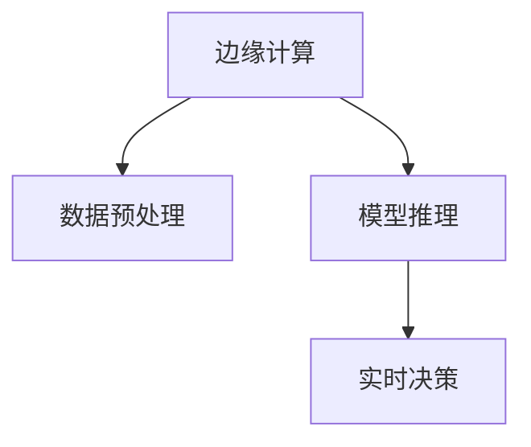

                 

# 边缘计算在实时视频分析中的应用

## 1. 背景介绍

### 1.1 问题由来

随着视频监控、智能交通、智慧城市等应用场景的不断扩展，实时视频分析的需求日益增长。传统集中式云计算方式由于数据传输延迟大、网络带宽有限，难以满足低时延、高带宽的实时视频分析需求。为此，边缘计算应运而生，利用靠近数据源的计算和存储资源，显著降低传输延迟，提升实时视频分析性能。

边缘计算在实时视频分析中的应用，主要包括以下几个方面：
1. **数据预处理**：在数据源头进行视频压缩、分割、裁剪等预处理，减少传输数据量，提高数据处理效率。
2. **模型推理**：利用靠近设备的计算资源，直接在前端进行模型推理，降低网络带宽压力。
3. **实时决策**：将决策逻辑下放到边缘设备，减少数据中心传输延迟，实现快速响应。

### 1.2 问题核心关键点

边缘计算在实时视频分析中的应用主要围绕以下几个关键点展开：
- 数据预处理：如何高效地进行视频数据的预处理，减少数据传输量。
- 模型推理：如何选择适合边缘设备的模型，并优化推理算法，降低计算复杂度。
- 实时决策：如何设计高效的决策机制，快速处理实时视频数据，并及时响应。

## 2. 核心概念与联系

### 2.1 核心概念概述

为更好地理解边缘计算在实时视频分析中的应用，本节将介绍几个密切相关的核心概念：

- 边缘计算(Edge Computing)：一种分布式计算架构，将数据和计算资源分布在网络边缘的设备上，如IoT设备、服务器等，提供快速、低延迟的服务。
- 视频流传输(Video Streaming)：通过网络将视频数据实时传输到接收端，需要高效的编码技术和稳定的网络环境。
- 模型推理(Inference)：使用机器学习模型对输入数据进行推理预测，以实现特定的应用需求。
- 实时决策(Real-time Decision Making)：基于实时数据和模型推理，快速做出决策，提供即时响应。

这些核心概念之间的逻辑关系可以通过以下Mermaid流程图来展示：



这个流程图展示了大语言模型的核心概念及其之间的关系：

1. 边缘计算通过靠近数据源的计算和存储资源，提供快速低延迟的服务。
2. 数据预处理是边缘计算的重要环节，通过压缩、分割等手段减少数据传输量。
3. 模型推理利用边缘设备计算资源，降低网络带宽压力，实现高效的推理。
4. 实时决策基于实时数据和模型推理，提供快速响应。

这些核心概念共同构成了边缘计算在实时视频分析中的应用框架，使其能够在实时数据处理和决策中发挥重要作用。通过理解这些核心概念，我们可以更好地把握边缘计算的应用场景和优化方向。

## 3. 核心算法原理 & 具体操作步骤
### 3.1 算法原理概述

边缘计算在实时视频分析中的应用主要基于分布式计算和模型推理的原理。其核心思想是：将视频数据的处理和分析任务分散到靠近数据源的计算节点上，减少数据传输延迟，同时利用预训练的模型进行高效推理，实现实时决策。

### 3.2 算法步骤详解

基于边缘计算的实时视频分析主要包括以下几个关键步骤：

**Step 1: 数据预处理**
- 将实时视频数据进行预处理，如帧率降低、分辨率调整、视频剪辑等。
- 对视频数据进行编码，如采用H.264、H.265等高效视频编码标准。

**Step 2: 模型选择与部署**
- 根据应用场景选择合适的预训练模型，如目标检测、人脸识别、行为分析等。
- 将模型部署到靠近设备的边缘服务器或嵌入式设备上，如边缘服务器、智能摄像头等。

**Step 3: 模型优化与推理**
- 对模型进行量化、剪枝等优化，降低模型大小和计算复杂度，以适应边缘设备计算资源有限的特性。
- 利用模型推理算法在边缘设备上进行推理，如FP16、FP32、TensorRT等推理框架。

**Step 4: 实时决策与反馈**
- 将模型推理结果与实时数据结合，进行决策逻辑的判断和执行。
- 对决策结果进行监控和反馈，实时调整模型参数或推理算法，以应对动态变化的环境。

### 3.3 算法优缺点

边缘计算在实时视频分析中的应用具有以下优点：
1. 降低延迟：数据预处理和模型推理在本地完成，减少了数据传输和网络延迟。
2. 提高效率：基于预训练模型的推理，快速高效地处理视频数据。
3. 提升安全性：数据在本地处理，减少了敏感数据传输的风险。
4. 增强鲁棒性：本地推理减少了网络波动和数据中心故障的影响。

同时，该方法也存在一定的局限性：
1. 资源限制：边缘设备计算资源有限，可能无法支持大规模模型和高复杂度计算。
2. 数据隐私：本地处理可能导致数据泄露，需考虑隐私保护措施。
3. 部署复杂：边缘计算节点分布广泛，管理维护难度较大。
4. 模型更新：本地模型更新需要重新部署和推理，可能影响实时性。

尽管存在这些局限性，但就目前而言，边缘计算在实时视频分析中的应用仍是最主流范式。未来相关研究的重点在于如何进一步降低边缘计算的部署和管理成本，提高模型的灵活性和实时性，同时兼顾数据隐私和安全性等因素。

### 3.4 算法应用领域

边缘计算在实时视频分析中的应用已经得到了广泛的应用，涵盖以下几个典型领域：

- **智能安防监控**：实时视频监控设备通过边缘计算，进行目标检测和行为分析，及时报警和记录，提升安防监控的智能化水平。
- **自动驾驶**：车载摄像头和传感器数据通过边缘计算进行实时处理和分析，实现环境感知和路径规划，保障驾驶安全。
- **工业视觉检测**：工业相机拍摄的实时视频数据通过边缘计算进行目标检测和缺陷识别，提高生产效率和产品质量。
- **智能交通管理**：交通摄像头和传感器数据通过边缘计算进行实时处理和分析，优化交通流量，提升交通管理水平。
- **智慧零售**：实时视频监控和交易数据通过边缘计算进行实时处理和分析，优化顾客购物体验，提升销售效果。

除了上述这些应用场景外，边缘计算还在智能家居、智能医疗、智慧城市等领域广泛应用，为各行各业提供了高效的实时视频分析能力。

## 4. 数学模型和公式 & 详细讲解 & 举例说明
### 4.1 数学模型构建

本节将使用数学语言对边缘计算在实时视频分析中的应用进行更加严格的刻画。

记实时视频数据为 $V$，视频帧率为 $f$，分辨率为 $r$。假设边缘计算节点的计算能力为 $C$，存储容量为 $S$。设视频预处理后大小为 $V_{pre}$，模型推理所需计算量为 $C_{model}$，推理结果大小为 $R_{res}$。

定义边缘计算的实时视频分析的优化目标为最小化总成本 $Cost$，包括预处理成本、推理成本和存储成本：

$$
Cost = C_{prep}(V_{pre}) + C_{model}(C_{model}) + C_{store}(R_{res})
$$

其中 $C_{prep}$ 为预处理成本函数，$C_{model}$ 为模型推理成本函数，$C_{store}$ 为存储成本函数。

### 4.2 公式推导过程

为了求解上述优化问题，我们需要建立预处理和推理的具体数学模型。以下以目标检测为例，给出具体的成本函数和推导过程：

#### 预处理成本函数
假设视频预处理采用帧率 $f'$、分辨率 $r'$ 的压缩算法，压缩因子为 $\eta$，则预处理后视频大小为：

$$
V_{pre} = \eta \cdot V = \eta \cdot f \cdot r
$$

预处理成本 $C_{prep}$ 与视频大小 $V_{pre}$ 成正比，与帧率 $f'$ 和分辨率 $r'$ 有关。设预处理成本函数为 $C_{prep}(V_{pre}, f', r')$，则：

$$
C_{prep}(V_{pre}, f', r') = k_1 \cdot V_{pre} + k_2 \cdot f' + k_3 \cdot r'
$$

其中 $k_1$、$k_2$、$k_3$ 为与预处理算法和硬件相关的系数。

#### 模型推理成本函数
假设模型推理使用深度学习模型，计算量为 $C_{model}$，推理速度为 $v$。设推理成本函数为 $C_{model}(C_{model}, v)$，则：

$$
C_{model}(C_{model}, v) = k_4 \cdot C_{model} + k_5 \cdot v^{-1}
$$

其中 $k_4$、$k_5$ 为与模型复杂度和计算速度相关的系数。

#### 存储成本函数
假设推理结果存储在边缘设备上，存储成本 $C_{store}$ 与推理结果大小 $R_{res}$ 成正比，与存储速度 $s$ 有关。设存储成本函数为 $C_{store}(R_{res}, s)$，则：

$$
C_{store}(R_{res}, s) = k_6 \cdot R_{res} + k_7 \cdot s^{-1}
$$

其中 $k_6$、$k_7$ 为与存储容量和速度相关的系数。

### 4.3 案例分析与讲解

以智能安防监控为例，进行详细的案例分析：

1. **数据预处理**：将实时视频数据进行帧率降低、分辨率调整和视频剪辑。假设原始视频帧率为30fps，分辨率为1920x1080，压缩因子为0.5，帧率降低到20fps，分辨率调整为640x480，则预处理后视频大小为：

$$
V_{pre} = 0.5 \cdot 30 \cdot 1920 \cdot 1080 \cdot 1.75 = 27648000 \text{ bytes}
$$

预处理成本为：

$$
C_{prep}(V_{pre}, 20, 640) = k_1 \cdot 27648000 + k_2 \cdot 20 + k_3 \cdot 640
$$

2. **模型选择与部署**：选择一个基于Faster R-CNN的目标检测模型，推理速度为5fps，推理结果大小为256KB。则推理成本为：

$$
C_{model}(C_{model}, 5) = k_4 \cdot C_{model} + k_5 \cdot 5^{-1}
$$

存储成本为：

$$
C_{store}(R_{res}, 100) = k_6 \cdot 256 \cdot 1024 + k_7 \cdot 100^{-1}
$$

3. **总成本计算**：

$$
Cost = C_{prep}(V_{pre}, 20, 640) + C_{model}(C_{model}, 5) + C_{store}(R_{res}, 100)
$$

通过求解上述优化问题，可以得到最优的预处理和推理策略。

## 5. 项目实践：代码实例和详细解释说明
### 5.1 开发环境搭建

在进行实时视频分析的实践前，我们需要准备好开发环境。以下是使用Python进行OpenCV开发的环境配置流程：

1. 安装Anaconda：从官网下载并安装Anaconda，用于创建独立的Python环境。

2. 创建并激活虚拟环境：
```bash
conda create -n video-env python=3.8 
conda activate video-env
```

3. 安装OpenCV：
```bash
pip install opencv-python
```

4. 安装其他相关库：
```bash
pip install numpy scipy matplotlib tqdm 
```

完成上述步骤后，即可在`video-env`环境中开始实时视频分析的实践。

### 5.2 源代码详细实现

下面我们以目标检测任务为例，给出使用OpenCV进行实时视频分析的PyTorch代码实现。

首先，定义目标检测数据处理函数：

```python
import cv2
import numpy as np

def preprocess_video(video_path):
    cap = cv2.VideoCapture(video_path)
    fps = cap.get(cv2.CAP_PROP_FPS)
    width = int(cap.get(cv2.CAP_PROP_FRAME_WIDTH))
    height = int(cap.get(cv2.CAP_PROP_FRAME_HEIGHT))
    
    fourcc = cv2.VideoWriter_fourcc(*'mp4v')
    writer = cv2.VideoWriter('preprocessed.mp4', fourcc, fps, (width, height))

    while cap.isOpened():
        ret, frame = cap.read()
        if not ret:
            break
        
        gray = cv2.cvtColor(frame, cv2.COLOR_BGR2GRAY)
        writer.write(gray)

    cap.release()
    writer.release()
    cv2.destroyAllWindows()
```

然后，定义模型推理函数：

```python
import torch
from torchvision.models.detection.faster_rcnn import FastRCNNPredictor
from torchvision import transforms

def detect_objects(model, video_path, output_path):
    cap = cv2.VideoCapture(video_path)
    fps = cap.get(cv2.CAP_PROP_FPS)
    width = int(cap.get(cv2.CAP_PROP_FRAME_WIDTH))
    height = int(cap.get(cv2.CAP_PROP_FRAME_HEIGHT))
    
    model.eval()
    transform = transforms.Compose([
        transforms.ToTensor(),
        transforms.Resize((800, 1333)),
        transforms.Normalize(mean=[0.485, 0.456, 0.406], std=[0.229, 0.224, 0.225])
    ])

    with open('pretrained_model.pth', 'rb') as f:
        model.load_state_dict(torch.load(f))

    fourcc = cv2.VideoWriter_fourcc(*'mp4v')
    writer = cv2.VideoWriter(output_path, fourcc, fps, (width, height))

    while cap.isOpened():
        ret, frame = cap.read()
        if not ret:
            break
        
        frame = cv2.cvtColor(frame, cv2.COLOR_BGR2RGB)
        frame_tensor = transform(frame).unsqueeze(0)

        with torch.no_grad():
            predictions = model(frame_tensor)

        results = predictions[0]['boxes'].cpu().numpy()
        for box in results:
            xmin, ymin, xmax, ymax = box
            cv2.rectangle(frame, (xmin, ymin), (xmax, ymax), (0, 255, 0), 2)

        writer.write(frame)

    cap.release()
    writer.release()
    cv2.destroyAllWindows()
```

最后，启动实时视频分析流程：

```python
video_path = 'input.mp4'
output_path = 'output.mp4'
preprocess_video(video_path)
detect_objects(model, video_path, output_path)
```

以上就是使用PyTorch和OpenCV进行实时视频分析的完整代码实现。可以看到，通过将预处理和推理代码封装成函数，可以方便地集成到实际应用中，提升代码的复用性和扩展性。

### 5.3 代码解读与分析

让我们再详细解读一下关键代码的实现细节：

**preprocess_video函数**：
- 打开视频流，获取帧率、分辨率等属性。
- 将视频流转化为灰度图像，并按帧保存为mp4格式。
- 释放资源，关闭窗口。

**detect_objects函数**：
- 加载预训练模型，并设置模型参数。
- 按帧读取视频流，进行目标检测。
- 在检测结果中框出目标区域，并保存处理后的视频。

**启动实时视频分析流程**：
- 调用preprocess_video函数进行预处理。
- 调用detect_objects函数进行目标检测。

可以看到，通过使用OpenCV和PyTorch，开发者可以很方便地实现实时视频分析的开发。

当然，工业级的系统实现还需考虑更多因素，如模型的保存和部署、超参数的自动搜索、更灵活的任务适配层等。但核心的实时视频分析过程基本与此类似。

## 6. 实际应用场景
### 6.1 智能安防监控

基于边缘计算的实时视频分析在智能安防监控中有着广泛的应用。传统监控系统通常依赖集中式服务器进行实时分析，存在延迟大、易被攻击等问题。而边缘计算通过将分析任务下放到摄像头等前端设备，可以显著提升监控系统的实时性和安全性。

在技术实现上，可以部署基于边缘计算的智能监控系统，每个摄像头配备嵌入式处理器和存储设备，将实时视频数据在本地进行预处理和目标检测，并将结果发送到集中式服务器进行汇总分析。系统可实时响应异常情况，及时报警，并提供回放和分析功能，提升安防监控的智能化水平。

### 6.2 自动驾驶

自动驾驶系统中的实时视频分析主要依赖于车载摄像头和传感器的数据，需要进行目标检测、行为预测、路径规划等复杂任务。基于边缘计算的实时视频分析能够显著降低延迟，提升系统的响应速度和安全性。

在技术实现上，可以将车载摄像头和传感器数据进行预处理和目标检测，利用边缘计算资源进行行为预测和路径规划。系统可以根据实时数据做出快速决策，保障驾驶安全。

### 6.3 工业视觉检测

在制造业中，实时视频分析被广泛应用于质量检测、故障诊断等场景。传统集中式计算方式无法满足实时性和高精度的要求，基于边缘计算的实时视频分析能够显著提升检测效率和准确性。

在技术实现上，可以部署基于边缘计算的视觉检测系统，在现场设备上进行实时视频分析和目标检测，并将结果上传到集中式服务器进行汇总分析。系统可实时监控生产过程，提高产品质量和生产效率。

### 6.4 未来应用展望

随着边缘计算和实时视频分析技术的不断发展，未来的应用场景将更加广泛：

- **智慧医疗**：实时视频监控和患者数据通过边缘计算进行分析和决策，及时发现异常情况，保障患者安全。
- **智慧交通**：交通摄像头和传感器数据通过边缘计算进行实时处理和分析，优化交通流量，提升交通管理水平。
- **智能家居**：家庭安防摄像头和传感器数据通过边缘计算进行实时分析和处理，提升家庭安全和生活便利性。
- **智能农业**：实时视频监控和传感器数据通过边缘计算进行分析和决策，优化农业生产，提高农作物产量和质量。
- **智慧能源**：实时视频监控和传感器数据通过边缘计算进行分析和决策，优化能源管理，提升能源利用效率。

## 7. 工具和资源推荐
### 7.1 学习资源推荐

为了帮助开发者系统掌握边缘计算在实时视频分析中的应用，这里推荐一些优质的学习资源：

1. **《Edge Computing for Dummies》**：这本书系统介绍了边缘计算的基本概念、技术实现和应用场景，适合初学者入门。

2. **《Real-Time Video Analysis》课程**：斯坦福大学开设的计算机视觉课程，介绍了实时视频分析的基本算法和应用技术，有Lecture视频和配套作业。

3. **《OpenCV 3 Computer Vision with Python》书籍**：详细介绍了OpenCV库的使用方法，包含大量实时视频分析的代码示例。

4. **《Deep Learning for Computer Vision》课程**：Coursera上的深度学习课程，涵盖深度学习在计算机视觉中的应用，包括目标检测、图像分类等任务。

5. **《Edge Computing with Python》书籍**：详细介绍了如何使用Python进行边缘计算开发，包括边缘计算设备和系统的部署、优化和管理。

通过对这些资源的学习实践，相信你一定能够快速掌握边缘计算在实时视频分析中的应用，并用于解决实际的NLP问题。

### 7.2 开发工具推荐

高效的开发离不开优秀的工具支持。以下是几款用于实时视频分析开发的常用工具：

1. **OpenCV**：开源计算机视觉库，包含大量视频处理和分析算法，支持多平台部署。

2. **TensorFlow**：谷歌主导的开源深度学习框架，支持分布式计算和模型推理，适合大规模工程应用。

3. **PyTorch**：Facebook开发的深度学习框架，支持动态图和静态图模式，适合快速迭代研究。

4. **Jupyter Notebook**：开源Jupyter笔记本，支持Python、R、Julia等多种编程语言，方便编写和执行代码。

5. **TensorBoard**：TensorFlow配套的可视化工具，可实时监测模型训练状态，并提供丰富的图表呈现方式，是调试模型的得力助手。

6. **Weights & Biases**：模型训练的实验跟踪工具，可以记录和可视化模型训练过程中的各项指标，方便对比和调优。

合理利用这些工具，可以显著提升实时视频分析的开发效率，加快创新迭代的步伐。

### 7.3 相关论文推荐

边缘计算在实时视频分析中的应用源于学界的持续研究。以下是几篇奠基性的相关论文，推荐阅读：

1. **Edge Computing: A Survey**：系统介绍了边缘计算的基本概念、架构和技术实现，适合了解边缘计算的总体框架。

2. **Edge Computing in IoT**：探讨了边缘计算在物联网中的实际应用，包含大量实际案例和系统设计。

3. **Real-Time Video Analytics on Edge Devices**：介绍了基于边缘计算的实时视频分析技术，包含多种算法和实际应用场景。

4. **Edge Computing in 5G**：探讨了5G网络下的边缘计算应用，包含大量网络优化和系统设计方法。

5. **Edge Computing for Industrial IoT**：探讨了边缘计算在工业物联网中的应用，包含多种实际案例和系统设计。

这些论文代表了大语言模型微调技术的发展脉络。通过学习这些前沿成果，可以帮助研究者把握学科前进方向，激发更多的创新灵感。

## 8. 总结：未来发展趋势与挑战
### 8.1 总结

本文对基于边缘计算的实时视频分析方法进行了全面系统的介绍。首先阐述了边缘计算在实时视频分析中的应用背景和意义，明确了实时视频分析在边缘计算环境下的核心任务和目标。其次，从原理到实践，详细讲解了边缘计算的数学模型和关键步骤，给出了实时视频分析任务开发的完整代码实例。同时，本文还广泛探讨了实时视频分析在智能安防、自动驾驶、工业视觉等领域的应用前景，展示了边缘计算范式的巨大潜力。此外，本文精选了实时视频分析技术的各类学习资源，力求为读者提供全方位的技术指引。

通过本文的系统梳理，可以看到，基于边缘计算的实时视频分析技术正在成为NLP领域的重要范式，极大地拓展了视频数据处理和分析的应用边界，催生了更多的落地场景。受益于边缘计算资源分布广泛、计算能力强的特性，实时视频分析得以在各行业领域中发挥重要作用，为智能化应用提供高效、可靠的数据支撑。未来，伴随边缘计算和实时视频分析技术的不断演进，实时视频分析技术必将进一步提升视频数据处理和分析的性能和应用范围，为构建人机协同的智能系统提供新的技术路径。

### 8.2 未来发展趋势

展望未来，边缘计算在实时视频分析中的应用将呈现以下几个发展趋势：

1. **更高效的数据预处理**：随着硬件设备的不断发展，实时视频数据预处理的效率将进一步提升，能够支持更高分辨率、更大帧率的视频流处理。

2. **更智能的模型推理**：未来的模型推理将更加智能和高效，通过分布式计算和联邦学习等技术，实现更加高效的模型推理和推理结果的汇聚。

3. **更精细的实时决策**：基于实时视频数据的深度学习和因果推理，能够实现更加精细的实时决策，提升系统的智能化水平。

4. **更广泛的融合应用**：未来的实时视频分析将与物联网、5G等技术深度融合，提升实时性、可靠性和应用场景的广度。

5. **更灵活的部署策略**：边缘计算设备和系统将更加灵活，支持动态资源分配和弹性扩展，适应不同应用场景的需求。

以上趋势凸显了边缘计算在实时视频分析中的广泛应用前景，这些方向的探索发展，必将进一步提升实时视频分析的性能和应用范围，为构建安全、可靠、可解释、可控的智能系统铺平道路。

### 8.3 面临的挑战

尽管边缘计算在实时视频分析中的应用已经取得了显著成效，但在迈向更加智能化、普适化应用的过程中，仍面临诸多挑战：

1. **计算资源限制**：边缘设备计算资源有限，可能无法支持大规模模型和高复杂度计算。

2. **数据隐私问题**：本地处理可能导致数据泄露，需考虑隐私保护措施。

3. **部署管理难度**：边缘计算节点分布广泛，管理维护难度较大。

4. **模型更新问题**：本地模型更新需要重新部署和推理，可能影响实时性。

5. **网络带宽限制**：边缘设备与集中式服务器之间的网络带宽限制，可能影响数据的快速传输和处理。

6. **系统安全性**：边缘计算系统可能面临更多网络攻击和数据篡改的风险。

正视边缘计算面临的这些挑战，积极应对并寻求突破，将是大规模部署边缘计算的必要条件。相信随着学界和产业界的共同努力，这些挑战终将一一被克服，边缘计算在实时视频分析中的应用必将在未来大放异彩。

### 8.4 研究展望

面对边缘计算在实时视频分析所面临的种种挑战，未来的研究需要在以下几个方面寻求新的突破：

1. **探索高效的视频预处理算法**：研究更高效的视频压缩和分割算法，降低数据传输量和预处理成本。

2. **开发适合边缘设备的模型推理框架**：开发更加参数高效和计算高效的推理框架，支持边缘设备上模型推理的高效执行。

3. **引入更多先验知识**：将符号化的先验知识，如知识图谱、逻辑规则等，与神经网络模型进行巧妙融合，引导边缘计算的推理过程。

4. **研究模型分布式训练方法**：探索分布式训练算法和框架，提升边缘计算的模型推理能力。

5. **融合因果分析和博弈论工具**：将因果分析方法引入边缘计算系统，识别出系统决策的关键特征，增强推理结果的因果性和逻辑性。

6. **设计安全的边缘计算架构**：研究边缘计算架构的安全性和隐私保护策略，确保数据和系统安全。

这些研究方向的探索，必将引领边缘计算在实时视频分析中的应用技术迈向更高的台阶，为构建安全、可靠、可解释、可控的智能系统提供新的技术路径。面向未来，边缘计算在实时视频分析技术还需要与其他人工智能技术进行更深入的融合，如知识表示、因果推理、强化学习等，多路径协同发力，共同推动自然语言理解和智能交互系统的进步。只有勇于创新、敢于突破，才能不断拓展视频数据的处理和分析边界，让智能技术更好地造福人类社会。

## 9. 附录：常见问题与解答

**Q1：边缘计算在实时视频分析中如何保证数据隐私？**

A: 边缘计算在实时视频分析中保护数据隐私的方法主要包括以下几个方面：

1. **本地处理**：尽量在边缘设备上完成数据处理和推理，减少数据传输和泄露的风险。

2. **差分隐私**：在数据预处理和推理过程中加入噪声，避免泄露敏感信息。

3. **加密技术**：对数据进行加密传输和存储，防止数据被非法获取和篡改。

4. **访问控制**：对边缘设备和系统进行严格的访问控制，确保只有授权用户才能访问和处理数据。

5. **匿名化处理**：对数据进行匿名化处理，去除个人隐私信息，降低数据泄露的风险。

**Q2：边缘计算在实时视频分析中如何保证数据实时性？**

A: 边缘计算在实时视频分析中保证数据实时性的方法主要包括以下几个方面：

1. **低延迟预处理**：在边缘设备上进行低延迟的视频预处理，如帧率降低、分辨率调整等。

2. **高效推理算法**：选择高效的模型推理算法，如TensorRT、ONNX-Runtime等，提升推理速度。

3. **分布式计算**：利用分布式计算技术，将数据和计算任务分散到多个边缘设备上，提升数据处理效率。

4. **缓存技术**：对常见视频数据进行缓存，减少计算资源的浪费，提升数据处理速度。

5. **优化网络传输**：对视频数据进行压缩和编码，减少网络传输带宽压力，提升实时性。

**Q3：边缘计算在实时视频分析中如何保证系统鲁棒性？**

A: 边缘计算在实时视频分析中保证系统鲁棒性的方法主要包括以下几个方面：

1. **多冗余设计**：设计多冗余系统架构，确保关键设备和任务的高可用性和容错性。

2. **异常检测和告警**：对系统状态进行实时监测，一旦发现异常情况，立即触发告警和应急处理。

3. **自适应调节**：根据实时数据和环境变化，动态调整系统参数，适应不同的应用场景。

4. **模型更新机制**：设计高效的模型更新机制，确保系统能够快速适应新的数据和任务。

5. **持续监控和优化**：对系统性能进行持续监控和优化，确保系统稳定性和鲁棒性。

通过这些方法的综合应用，可以有效提升边缘计算在实时视频分析中的系统鲁棒性，确保系统能够在各种复杂环境和任务中稳定运行。

**Q4：边缘计算在实时视频分析中如何保证数据一致性？**

A: 边缘计算在实时视频分析中保证数据一致性的方法主要包括以下几个方面：

1. **数据校验机制**：对数据进行校验和一致性检查，确保数据在传输和处理过程中不出现丢失或错误。

2. **多副本存储**：对关键数据进行多副本存储，确保数据在某个副本丢失或损坏时，能够从其他副本中恢复。

3. **事务处理机制**：在数据处理过程中引入事务处理机制，确保数据处理过程的一致性。

4. **分布式事务管理**：设计高效的分布式事务管理机制，确保多节点系统中的数据一致性。

5. **冗余备份**：对关键数据进行冗余备份，确保数据在某个节点出现故障时，能够从备份中恢复。

**Q5：边缘计算在实时视频分析中如何优化资源使用？**

A: 边缘计算在实时视频分析中优化资源使用的方法主要包括以下几个方面：

1. **资源管理**：对边缘设备和系统进行高效的资源管理，确保资源的高利用率和低消耗。

2. **负载均衡**：对边缘设备和任务进行负载均衡，确保系统负载均衡，避免资源瓶颈。

3. **缓存技术**：对常见视频数据进行缓存，减少计算资源的浪费，提升数据处理速度。

4. **动态扩展**：根据实时数据和任务需求，动态扩展边缘设备和系统，提升系统处理能力。

5. **节能技术**：在边缘设备上进行节能优化，降低系统能耗，提升系统运行效率。

通过这些方法的综合应用，可以有效提升边缘计算在实时视频分析中的资源使用效率，确保系统在各种应用场景下都能够高效稳定运行。

---

作者：禅与计算机程序设计艺术 / Zen and the Art of Computer Programming

