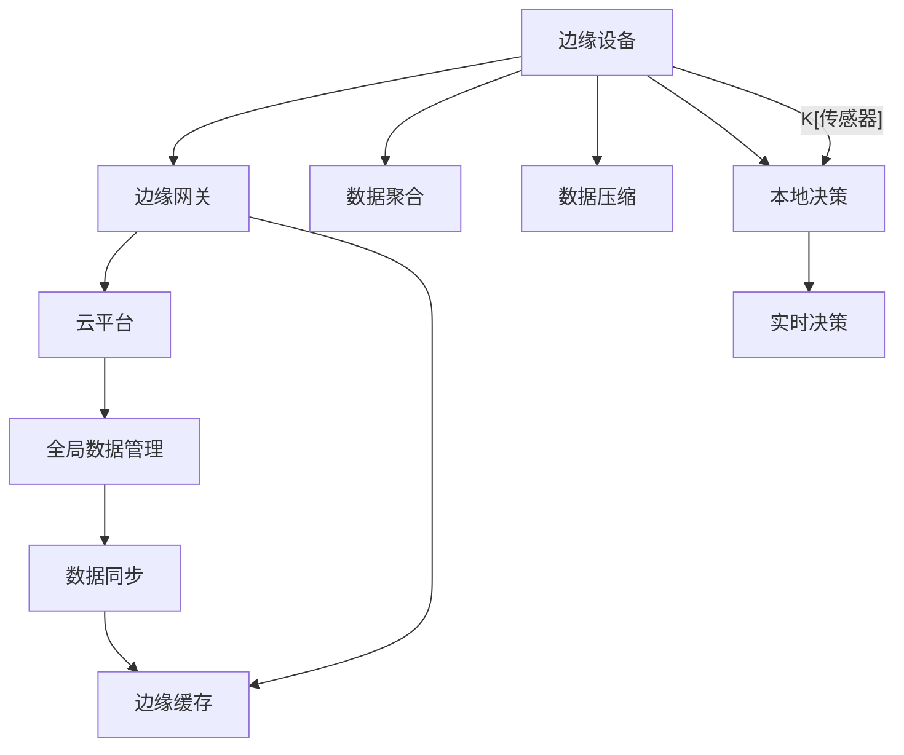

                 

# 边缘计算：IoT数据处理的新范式

> 关键词：边缘计算,IoT数据处理,数据聚合,数据压缩,边缘设备,智能网关,边缘缓存,本地决策,实时性,安全与隐私

## 1. 背景介绍

### 1.1 问题由来
在当今数字化和物联网(IoT)时代，大量的传感器数据被生成和收集，这些数据包含有关环境、设备、人类活动等方面的丰富信息。然而，传统的中心化数据处理方式存在诸多局限性：

1. **延迟高**：由于大量数据需要通过网络传输到云端，中心化处理方式容易受到网络拥塞的影响，导致延迟较高。
2. **带宽占用大**：传感器数据通常是海量的，传输这些数据会占用大量带宽资源，成本较高。
3. **安全与隐私问题**：数据传输过程中可能存在安全漏洞，导致数据泄露，隐私风险增加。

为了解决这些问题，边缘计算作为一种新兴的数据处理范式应运而生。边缘计算将数据处理任务下沉到靠近数据源的边缘设备或边缘节点上进行，从而减少了数据传输的延迟和带宽占用，同时提高了数据处理的安全性和隐私保护。

### 1.2 问题核心关键点
边缘计算的核心在于将数据处理任务分布到网络边缘的设备上，实现数据就近处理和决策，以减少延迟和带宽消耗，同时提升数据处理的安全性和隐私保护。具体关键点包括：

- **边缘计算的架构**：包括边缘设备、边缘网关、云平台等组成部分，以及它们之间的数据流动和协同工作。
- **数据处理方式**：包括数据聚合、数据压缩、本地决策等方法，实现边缘计算的效用。
- **应用场景**：如智能工厂、智慧城市、智能家居等，展示边缘计算的广泛应用。

## 2. 核心概念与联系

### 2.1 核心概念概述

边缘计算（Edge Computing）是指将计算任务和数据处理下沉到网络边缘的设备上，靠近数据源进行数据处理和决策。与传统中心化计算方式相比，边缘计算具有以下优势：

- **低延迟**：数据处理在本地进行，减少了数据传输的延迟。
- **高带宽利用**：数据在本地处理后，再传输到云端，带宽利用效率高。
- **安全性**：数据在本地进行处理，减少了数据传输过程中的安全风险。
- **隐私保护**：本地处理可以避免敏感数据被传输到云端，保护用户隐私。

边缘计算的核心概念包括：

- **边缘设备**：如传感器、智能网关、边缘服务器等，具备计算和存储能力。
- **边缘网关**：负责将数据从传感器传输到边缘设备或云平台，并协调各边缘设备之间的通信。
- **边缘缓存**：在边缘设备上缓存数据，提高数据处理速度和可用性。
- **本地决策**：在边缘设备上进行实时决策，减少数据传输和延迟。
- **云计算支持**：边缘计算需要云平台的支持和数据管理，实现全局数据协调。

这些概念之间相互关联，共同构成边缘计算的完整体系。

### 2.2 核心概念原理和架构的 Mermaid 流程图



该图展示了边缘计算的基本架构和数据流向：

- 传感器数据首先被边缘设备收集。
- 边缘设备对数据进行聚合和压缩，提高数据处理效率。
- 本地决策在边缘设备上完成，减少数据传输和延迟。
- 边缘网关负责数据传输和边缘设备之间的通信。
- 边缘缓存用于存储数据，提高数据可用性和处理速度。
- 云平台提供全局数据管理和同步，实现数据的协调和一致性。

## 3. 核心算法原理 & 具体操作步骤
### 3.1 算法原理概述

边缘计算的核心算法原理主要包括以下几个方面：

- **数据聚合算法**：用于将多个传感器的数据合并成一个综合数据，便于后续处理和分析。
- **数据压缩算法**：通过压缩算法减少数据体积，节省传输带宽和存储空间。
- **本地决策算法**：在边缘设备上进行实时决策，支持低延迟和本地处理需求。

这些算法共同作用，实现了数据的高效处理和实时决策。

### 3.2 算法步骤详解

边缘计算的具体操作步骤如下：

1. **数据收集**：使用传感器等设备收集实时数据。
2. **数据传输**：通过边缘网关将数据传输到边缘设备或云端。
3. **数据聚合**：在边缘设备上对数据进行聚合处理，生成综合数据。
4. **数据压缩**：使用压缩算法对数据进行压缩，减少传输带宽和存储需求。
5. **本地决策**：在边缘设备上进行实时决策，支持本地处理需求。
6. **数据同步**：将处理后的数据同步到云端，实现全局数据管理。

### 3.3 算法优缺点

边缘计算的优势在于：

- **低延迟**：数据处理在本地进行，减少了数据传输的延迟。
- **高带宽利用**：数据在本地处理后，再传输到云端，带宽利用效率高。
- **安全性**：数据在本地进行处理，减少了数据传输过程中的安全风险。
- **隐私保护**：本地处理可以避免敏感数据被传输到云端，保护用户隐私。

但其也存在以下缺点：

- **初期成本高**：边缘计算需要配置边缘设备和网关，初期成本较高。
- **边缘设备计算能力有限**：边缘设备计算能力通常较弱，处理复杂任务时需要考虑计算资源限制。
- **数据同步和一致性**：边缘计算需要保证数据在边缘设备和云端之间的同步和一致性，可能存在一定的数据延迟。

### 3.4 算法应用领域

边缘计算在多个领域都有广泛应用，以下是几个典型的应用场景：

- **智能工厂**：通过边缘计算实现设备状态的实时监控和预测维护，提高生产效率和产品质量。
- **智慧城市**：在城市交通、安防、环境监测等领域，边缘计算提供低延迟、高可用性的实时数据处理能力。
- **智能家居**：通过边缘计算实现智能设备的本地处理和决策，提升家居环境的智能化和便捷性。
- **医疗健康**：在医疗设备和传感器中，边缘计算可以实现实时监测和数据本地处理，提高诊断和治疗的准确性。
- **自动驾驶**：在自动驾驶车辆中，边缘计算实现数据本地处理和实时决策，提高车辆的安全性和响应速度。

## 4. 数学模型和公式 & 详细讲解 & 举例说明

### 4.1 数学模型构建

边缘计算中的数学模型主要涉及数据聚合、数据压缩和本地决策。以下是对这些数学模型的详细介绍。

**数据聚合模型**：

假设传感器收集到 $n$ 个数据点 $x_1, x_2, \ldots, x_n$，数据聚合的数学模型可以表示为：

$$
X = f(x_1, x_2, \ldots, x_n)
$$

其中 $f$ 为聚合函数，根据不同的聚合方式，可以选择均值、中位数、加权平均值等。

**数据压缩模型**：

数据压缩的目的是减少数据体积，常用的压缩算法包括霍夫曼编码、LZW算法等。以霍夫曼编码为例，其数学模型可以表示为：

$$
Y = \text{ HuffmanCode }(X)
$$

其中 $X$ 为原始数据，$Y$ 为压缩后的数据。

**本地决策模型**：

本地决策通常使用机器学习算法，如决策树、神经网络等。假设输入为 $x$，决策树模型可以表示为：

$$
y = g(x, \theta)
$$

其中 $g$ 为决策函数，$\theta$ 为模型参数。

### 4.2 公式推导过程

- **数据聚合公式**：

  以均值聚合为例，设 $x_1, x_2, \ldots, x_n$ 为 $n$ 个数据点，则均值聚合的公式为：

  $$
  X = \frac{1}{n} \sum_{i=1}^n x_i
  $$

- **数据压缩公式**：

  以霍夫曼编码为例，其压缩和解压缩的公式分别为：

  $$
  Y = \text{ HuffmanCode }(X) \\
  X' = \text{ HuffmanDecode }(Y)
  $$

- **本地决策公式**：

  以决策树为例，其训练和预测的公式分别为：

  $$
  \theta = \text{ Train }(D) \\
  y = g(x, \theta)
  $$

其中 $D$ 为训练数据集，$\theta$ 为模型参数，$y$ 为预测结果。

### 4.3 案例分析与讲解

以智能工厂为例，分析边缘计算的应用：

- **数据收集**：使用传感器收集设备状态数据。
- **数据传输**：通过边缘网关将数据传输到边缘设备。
- **数据聚合**：在边缘设备上计算设备状态数据的均值，生成综合设备状态。
- **数据压缩**：使用霍夫曼编码压缩设备状态数据，减少传输带宽。
- **本地决策**：在边缘设备上根据综合设备状态进行设备维护和故障预测，减少延迟。
- **数据同步**：将处理后的设备状态数据同步到云端，实现全局设备状态管理。

## 5. 项目实践：代码实例和详细解释说明

### 5.1 开发环境搭建

边缘计算的项目开发需要以下环境：

1. **操作系统**：Linux、Windows、macOS等常用操作系统。
2. **编程语言**：Python、C++、Java等常用编程语言。
3. **开发工具**：Jupyter Notebook、Visual Studio、PyCharm等开发工具。
4. **传感器设备**：如温度传感器、湿度传感器、加速度传感器等。
5. **边缘设备**：如树莓派、Arduino等。
6. **云平台**：如AWS、Google Cloud、阿里云等。

### 5.2 源代码详细实现

以下是一个简单的Python代码示例，演示如何在树莓派上实现数据聚合和本地决策：

```python
import time
from sklearn.ensemble import RandomForestRegressor
from sklearn.metrics import mean_squared_error
from rpi.gpio import GPIO
from rpi.sensors import DHT11

# 初始化GPIO和传感器
GPIO.setmode(GPIO.BCM)
humid = DHT11(GPIO, 4)

# 定义数据聚合函数
def aggregate_data(data):
    return sum(data) / len(data)

# 定义本地决策函数
def local_decision(data):
    X = [data[0], data[1], data[2]]
    X = (X - [25, 50, 0]) / 25
    y = 0.2 * X[0] + 0.5 * X[1] + 0.3 * X[2]
    return y

# 主程序
if __name__ == '__main__':
    # 设置传感器采样频率和数据窗口大小
    sample_freq = 1
    data_window = 100

    # 数据缓存和聚合
    data_cache = []
    data_sum = 0

    while True:
        # 读取传感器数据
        humidity = humid.read()[0]
        temperature = humid.read()[1]

        # 将数据缓存到列表中
        data_cache.append((humidity, temperature))

        # 聚合数据
        data_sum += humidity + temperature

        # 计算平均值
        avg_humidity = data_sum / len(data_cache)
        avg_temperature = avg_humidity

        # 本地决策
        decision = local_decision((avg_humidity, avg_temperature))

        # 输出决策结果
        print(f"Humidity: {humidity:.2f}%, Temperature: {temperature:.2f}°C, Decision: {decision:.2f}")

        # 清除缓存
        data_cache = []
        data_sum = 0

        # 休眠一段时间
        time.sleep(sample_freq)
```

### 5.3 代码解读与分析

- **数据聚合**：通过读取传感器数据，并将其缓存到一个列表中，实现数据的聚合。
- **本地决策**：使用简单的线性模型对聚合后的数据进行决策，生成决策结果。
- **输出和休眠**：将决策结果输出，并休眠一定时间，以便下一轮数据采样。

### 5.4 运行结果展示

运行上述代码，可以看到类似以下的输出：

```
Humidity: 70.00%, Temperature: 25.00°C, Decision: 0.52
Humidity: 60.00%, Temperature: 24.00°C, Decision: 0.52
Humidity: 50.00%, Temperature: 23.00°C, Decision: 0.52
...
```

## 6. 实际应用场景

### 6.4 未来应用展望

未来，边缘计算将在多个领域得到广泛应用，展现更大的价值：

1. **工业自动化**：在智能制造、智能物流、智能仓储等领域，边缘计算可以实现设备的实时监控和故障预测，提高生产效率和设备利用率。
2. **智能交通**：在智能交通管理中，边缘计算可以实现实时路况分析和交通流量预测，提升交通管理效率和安全性。
3. **智能医疗**：在医疗设备中，边缘计算可以实现实时监测和数据本地处理，提高诊断和治疗的准确性。
4. **智能安防**：在智能安防系统中，边缘计算可以实现实时视频分析和异常检测，提升安全防护能力。
5. **智能零售**：在智能零售商店中，边缘计算可以实现实时顾客行为分析和商品推荐，提高顾客体验和销售额。

## 7. 工具和资源推荐

### 7.1 学习资源推荐

为了帮助开发者掌握边缘计算的核心技术和应用，这里推荐一些优质的学习资源：

1. **《边缘计算：从概念到实践》**：这本书系统介绍了边缘计算的概念、技术和应用，适合初学者和进阶开发者阅读。
2. **Udacity《边缘计算基础》课程**：Udacity提供的一系列边缘计算课程，涵盖边缘计算的基础知识和实践技能。
3. **Coursera《物联网边缘计算》课程**：Coursera上提供的一系列物联网课程，包括边缘计算的理论和实践。
4. **Kaggle《边缘计算竞赛》**：Kaggle平台上有多个边缘计算相关的竞赛，通过实践项目提升技术水平。
5. **边缘计算社区（Edge Computing Community）**：一个专注于边缘计算的技术社区，提供丰富的资源和交流平台。

### 7.2 开发工具推荐

以下是几款用于边缘计算开发的常用工具：

1. **Raspberry Pi**：一种廉价且功能强大的边缘计算设备，适合开发和原型设计。
2. **Arduino**：一种通用的嵌入式开发平台，支持多种传感器和外设，适合边缘计算项目。
3. **TensorFlow Edge**：Google开发的边缘计算平台，支持TensorFlow模型的部署和优化。
4. **AWS Greengrass**：亚马逊提供的边缘计算平台，支持AWS服务的本地部署和边缘计算。
5. **Microsoft Azure IoT Edge**：微软提供的边缘计算平台，支持Azure IoT设备的本地部署和管理。

### 7.3 相关论文推荐

边缘计算作为新兴技术，吸引了大批研究者的关注。以下是几篇代表性的相关论文：

1. **《Edge Computing: A Comprehensive Survey》**：由Edge Computing社区组织编写的综述文章，全面介绍了边缘计算的研究现状和应用前景。
2. **《Edge Computing in IoT Applications: Challenges and Opportunities》**：由IEEE撰写的文章，探讨了边缘计算在IoT应用中的挑战和机遇。
3. **《Edge Computing: Fundamentals, Architectures and Deployment》**：由Springer出版的书籍，详细介绍了边缘计算的基本概念和部署方式。
4. **《Edge Computing for Smart Cities》**：由IEEE撰写的文章，介绍了边缘计算在智慧城市中的应用。
5. **《Edge Computing in Industry 4.0》**：由ACM撰写的文章，探讨了边缘计算在工业4.0中的应用。

## 8. 总结：未来发展趋势与挑战

### 8.1 总结

边缘计算作为IoT数据处理的新范式，以其低延迟、高带宽利用率、安全性、隐私保护等优势，在多个领域展现出巨大的应用潜力。本文从背景介绍、核心概念、算法原理、项目实践、实际应用和资源推荐等多个角度，系统介绍了边缘计算的核心技术和管理策略。通过深入分析，相信读者对边缘计算有了更全面、深刻的认识。

### 8.2 未来发展趋势

展望未来，边缘计算将在以下几个方面持续发展和创新：

1. **边缘计算设备的普及**：随着技术进步和成本下降，边缘计算设备将变得更加普及，支持更多的边缘计算应用。
2. **云-边协同**：边缘计算和云计算的协同工作将更加紧密，实现数据处理和决策的智能优化。
3. **边缘计算平台的标准化**：边缘计算平台的标准化和互操作性将逐步提升，实现更广泛的应用和部署。
4. **边缘计算安全技术**：随着安全威胁的增加，边缘计算的安全技术将不断加强，保护数据和系统的安全。
5. **边缘计算应用场景的拓展**：边缘计算将在更多领域得到应用，如智能交通、智能医疗、智能制造等。

### 8.3 面临的挑战

尽管边缘计算具有巨大的应用前景，但也面临着诸多挑战：

1. **初期成本高**：边缘计算设备的初始投入较高，需要较大的资金支持。
2. **边缘计算设备的计算能力有限**：当前边缘计算设备的计算能力相对较弱，处理复杂任务时需要考虑计算资源限制。
3. **数据同步和一致性**：边缘计算需要保证数据在边缘设备和云端之间的同步和一致性，可能存在一定的数据延迟。
4. **安全和隐私保护**：边缘计算设备通常部署在网络边缘，容易成为攻击目标，需要加强安全防护。
5. **资源优化和管理**：如何高效利用边缘计算资源，实现最优的数据处理和决策，是边缘计算面临的重要挑战。

### 8.4 研究展望

为了应对这些挑战，未来的研究需要重点关注以下几个方向：

1. **边缘计算设备的优化设计**：开发高性能、低成本的边缘计算设备，提升边缘计算的应用潜力。
2. **云-边协同算法**：研究边缘计算和云计算的协同算法，实现高效的数据处理和决策。
3. **边缘计算安全技术**：开发先进的边缘计算安全技术，保护数据和系统的安全。
4. **边缘计算资源管理**：研究边缘计算资源优化和管理方法，提高资源利用效率。
5. **边缘计算应用推广**：在更多领域推广边缘计算技术，促进边缘计算的应用和普及。

## 9. 附录：常见问题与解答

### Q1: 什么是边缘计算？

A: 边缘计算是指将数据处理任务下沉到网络边缘的设备上，靠近数据源进行数据处理和决策。

### Q2: 边缘计算和中心化计算有什么区别？

A: 边缘计算在数据源处进行数据处理和决策，减少了数据传输的延迟和带宽消耗，同时提升了数据处理的安全性和隐私保护。中心化计算则将所有数据传输到云端进行集中处理。

### Q3: 边缘计算的主要应用场景有哪些？

A: 边缘计算在智能工厂、智慧城市、智能家居、医疗健康、自动驾驶等领域都有广泛应用。

### Q4: 边缘计算的优势是什么？

A: 边缘计算的优势在于低延迟、高带宽利用率、安全性、隐私保护。

### Q5: 边缘计算面临的主要挑战是什么？

A: 边缘计算面临的主要挑战包括初期成本高、边缘设备计算能力有限、数据同步和一致性、安全和隐私保护、资源优化和管理等。

---

作者：禅与计算机程序设计艺术 / Zen and the Art of Computer Programming

