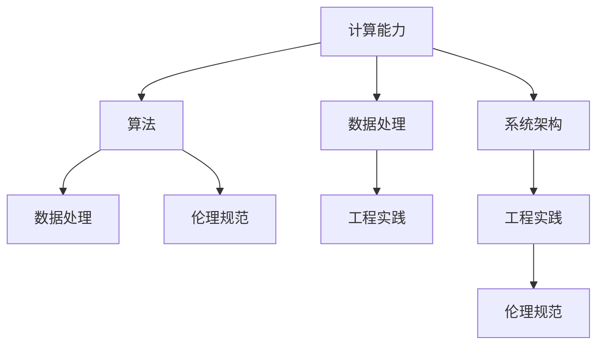

                 

# 迎接未来挑战：人类计算时代的技能需求

## 1. 背景介绍

随着人工智能技术的飞速发展，尤其是计算能力的不断突破，人类社会正迎来一场前所未有的技术变革。这一变革不仅深刻改变了各个行业的工作模式和生产力，也对人类自身的技能需求提出了新的挑战。如何应对这些挑战，提升人类的计算能力，成为每一个计算工作者需要深入思考的问题。

### 1.1 问题的由来

计算能力作为驱动社会进步的关键因素，其演进史可以追溯到古希腊时代。随着计算机的发明和互联网的普及，计算能力开始大规模融入人们的生活和工作中，极大地提升了效率和生产力。然而，随着计算规模的不断扩大，对计算工作者的技能要求也越来越高。如何在算法、数据、工程等方面具备前沿技术，如何在计算平台和系统上进行高效管理，如何在数据驱动的决策中保持理性，这些都需要计算工作者不断学习和提升。

### 1.2 问题核心关键点

为了有效提升计算能力，首先需要掌握以下几个关键点：

1. **数据处理**：理解数据的来源、特征、分布，能够进行数据清洗、特征工程、数据预处理等工作。
2. **算法选择**：根据具体问题和数据特性，选择合适的算法模型，进行模型训练和优化。
3. **系统架构**：了解计算系统的架构和设计，能够进行分布式计算、高性能计算、云计算等技术应用。
4. **工程实践**：掌握软件工程、系统设计、测试优化等实践技能，确保计算项目的可靠性和可维护性。
5. **伦理规范**：关注计算技术对社会的影响，理解伦理和隐私问题，确保计算行为符合法律法规和道德标准。

### 1.3 问题研究意义

掌握这些关键点，对于提高计算能力、推动技术进步、维护社会公平具有重要意义：

1. **提高效率**：通过数据驱动的决策，优化流程和资源配置，大幅提升工作效率和质量。
2. **创新驱动**：新技术和新方法的出现，往往源于对现有计算能力的深度挖掘和创新应用。
3. **社会影响**：计算技术的广泛应用，促进了社会各个方面的进步，如教育、医疗、交通等领域。
4. **伦理约束**：计算工作者需要对计算行为负责，确保技术应用符合社会伦理和法律法规。

## 2. 核心概念与联系

### 2.1 核心概念概述

为了更好地理解人类计算能力的提升，首先需要掌握以下几个核心概念：

- **计算能力**：指人类处理数据和执行任务的能力。
- **算法**：为解决特定问题而设计的计算过程，包括数据的处理、分析和优化等。
- **数据处理**：对原始数据进行清洗、分析和预处理，以提取有价值的信息。
- **系统架构**：计算系统的设计和部署，包括分布式计算、云计算、边缘计算等。
- **工程实践**：软件开发、系统设计、测试优化等实践技能。
- **伦理规范**：计算行为应遵守的社会伦理和法律法规。

这些概念之间的逻辑关系可以通过以下Mermaid流程图来展示：



这个流程图展示了计算能力提升的关键环节及其联系：

1. 计算能力是通过数据处理、算法设计、系统架构和工程实践共同提升的。
2. 算法和数据处理是提升计算能力的核心。
3. 系统架构和工程实践是提升计算能力的基础。
4. 伦理规范是提升计算能力的重要保障。

这些概念共同构成了人类计算能力提升的框架，帮助计算工作者理解并掌握计算能力的提升路径。

## 3. 核心算法原理 & 具体操作步骤

### 3.1 算法原理概述

计算能力提升的关键在于算法的选择和应用。算法的原理、步骤、优缺点和应用领域是计算工作者必须掌握的核心内容。

算法的基本原理是通过一定的计算过程，将输入数据转换为输出结果，并尽可能地优化这一过程。其步骤包括：

1. 数据预处理：清洗、归一化、特征工程等。
2. 模型选择：根据问题特性，选择合适的算法模型。
3. 模型训练：使用训练数据集对模型进行训练，优化模型参数。
4. 模型评估：使用测试数据集对模型进行评估，选择最优模型。
5. 模型应用：将训练好的模型应用于实际问题，进行预测、推理、优化等。

算法的优缺点和应用领域如下：

- **优点**：精度高、可解释性强、适用范围广等。
- **缺点**：计算复杂度高、数据需求大、模型难以优化等。
- **应用领域**：自然语言处理、图像处理、推荐系统、金融分析等。

### 3.2 算法步骤详解

以机器学习算法为例，详细讲解其具体操作步骤：

**Step 1: 数据预处理**
- 收集数据，清洗数据，去除噪声和异常值。
- 数据归一化、标准化处理，保证数据的格式一致。
- 特征提取和选择，提取对问题有用的特征。

**Step 2: 模型选择**
- 根据问题的类型和数据特性，选择合适的算法模型。
- 常用的算法包括决策树、随机森林、神经网络等。

**Step 3: 模型训练**
- 使用训练数据集对模型进行训练，优化模型参数。
- 常用的优化算法包括梯度下降、Adam等。
- 调整超参数，如学习率、批大小等，提升模型效果。

**Step 4: 模型评估**
- 使用测试数据集对模型进行评估，计算准确率、召回率、F1值等指标。
- 模型调优，进一步提升模型性能。

**Step 5: 模型应用**
- 将训练好的模型应用于实际问题，进行预测、推理、优化等。
- 监控模型性能，定期进行模型更新和优化。

### 3.3 算法优缺点

算法的选择和应用在计算能力提升中至关重要，其优缺点和应用领域如下：

- **优点**：
  - 精度高：算法能够准确处理数据和解决问题。
  - 可解释性强：算法的原理和步骤清晰，易于理解和解释。
  - 适用范围广：算法适用于各种类型的问题，如分类、回归、聚类等。
  
- **缺点**：
  - 计算复杂度高：复杂的算法需要大量的计算资源和时间。
  - 数据需求大：算法需要大量的标注数据进行训练。
  - 模型难以优化：一些算法难以通过优化方法提升性能。

### 3.4 算法应用领域

算法在各个领域中的应用非常广泛，以下是几个典型案例：

- **金融分析**：使用机器学习算法进行风险评估、信用评分、股票预测等。
- **自然语言处理**：使用深度学习算法进行文本分类、情感分析、机器翻译等。
- **医疗诊断**：使用决策树、随机森林等算法进行疾病预测、影像分析等。
- **推荐系统**：使用协同过滤、矩阵分解等算法进行用户行为预测、商品推荐等。

## 4. 数学模型和公式 & 详细讲解 & 举例说明

### 4.1 数学模型构建

在计算能力提升的过程中，数学模型是不可或缺的工具。这里以线性回归为例，介绍其数学模型构建和应用。

线性回归的数学模型可以表示为：

$$
y = \beta_0 + \beta_1x_1 + \beta_2x_2 + \cdots + \beta_nx_n + \epsilon
$$

其中，$y$ 为预测值，$\beta_0$ 为截距，$\beta_1, \beta_2, \cdots, \beta_n$ 为回归系数，$x_1, x_2, \cdots, x_n$ 为自变量，$\epsilon$ 为误差项。

### 4.2 公式推导过程

线性回归的推导过程如下：

1. 假设数据集 $D = \{(x_1,y_1), (x_2,y_2), \cdots, (x_n,y_n)\}$。
2. 构建假设函数 $h(x) = \beta_0 + \beta_1x_1 + \beta_2x_2 + \cdots + \beta_nx_n$。
3. 定义损失函数 $J(\beta) = \frac{1}{2}\sum_{i=1}^n (y_i - h(x_i))^2$。
4. 对 $\beta$ 求导，得到梯度 $\nabla J(\beta) = \sum_{i=1}^n (y_i - h(x_i))x_i$。
5. 使用梯度下降等优化算法，最小化损失函数 $J(\beta)$。
6. 得到最优参数 $\hat{\beta} = (X^TX)^{-1}X^Ty$，其中 $X$ 为数据矩阵，$y$ 为标签向量。

### 4.3 案例分析与讲解

以线性回归应用于房价预测为例，详细讲解其应用过程：

**数据预处理**：收集房价数据，进行清洗和归一化。

**模型选择**：选择线性回归模型。

**模型训练**：使用训练数据集 $D = \{(x_1,y_1), (x_2,y_2), \cdots, (x_n,y_n)\}$ 对模型进行训练。

**模型评估**：使用测试数据集对模型进行评估，计算预测值和真实值的误差。

**模型应用**：将训练好的模型应用于新的房价数据，进行预测。

## 5. 项目实践：代码实例和详细解释说明

### 5.1 开发环境搭建

在进行计算能力提升的实践时，首先需要搭建好开发环境。以下是使用Python进行计算能力提升的开发环境配置流程：

1. 安装Python：从官网下载并安装Python，建议选择3.9或以上版本。
2. 安装Pandas：用于数据处理和分析。
3. 安装Scikit-learn：用于机器学习模型训练。
4. 安装TensorFlow或PyTorch：用于深度学习模型构建和训练。
5. 安装Jupyter Notebook：用于交互式编程和数据可视化。

完成上述步骤后，即可在本地环境进行计算能力提升的实践。

### 5.2 源代码详细实现

以下是一个使用线性回归模型进行房价预测的Python代码实现：

```python
import pandas as pd
from sklearn.linear_model import LinearRegression

# 读取数据
data = pd.read_csv('house_prices.csv')

# 数据预处理
X = data[['area', 'bedrooms', 'bathrooms', 'location']]
y = data['price']

# 模型训练
model = LinearRegression()
model.fit(X, y)

# 模型评估
test_data = pd.read_csv('test_house_prices.csv')
test_X = test_data[['area', 'bedrooms', 'bathrooms', 'location']]
test_y = test_data['price']
test_predictions = model.predict(test_X)

# 模型应用
print(test_predictions)
```

### 5.3 代码解读与分析

让我们再详细解读一下关键代码的实现细节：

**数据读取和预处理**：
- 使用Pandas读取数据集，并进行数据清洗和特征提取。

**模型训练**：
- 使用Scikit-learn的LinearRegression模型，对数据集进行训练，得到最优参数。

**模型评估**：
- 使用测试数据集进行模型评估，计算预测值和真实值的误差。

**模型应用**：
- 使用训练好的模型对新的数据进行预测。

## 6. 实际应用场景

### 6.1 智能城市管理

智能城市管理是计算能力提升的重要应用场景之一。通过计算技术，可以实现城市交通、能源、环境等方面的智能化管理，提升城市运行效率和居民生活质量。

在交通管理方面，可以使用机器学习算法对交通流量进行预测和优化，调整信号灯和交通设施，减少拥堵和事故。

在能源管理方面，可以使用数据分析和优化算法，对城市能源供应和需求进行动态调整，提高能源利用效率，减少浪费。

在环境管理方面，可以使用深度学习算法进行空气质量监测和预测，及时采取措施改善环境质量。

### 6.2 医疗健康管理

医疗健康管理也是计算能力提升的重要应用场景之一。通过计算技术，可以实现精准医疗、疾病预测、影像分析等方面的智能化管理，提升医疗服务质量和效率。

在精准医疗方面，可以使用机器学习算法对患者的基因数据进行分析，预测疾病风险和推荐个性化治疗方案。

在疾病预测方面，可以使用时间序列分析和异常检测算法，预测疾病爆发和流行趋势，及时采取防控措施。

在影像分析方面，可以使用深度学习算法进行医学影像的自动标注和分析，提高医生的诊断准确性和效率。

### 6.3 金融风险管理

金融风险管理是计算能力提升的重要应用场景之一。通过计算技术，可以实现风险评估、信用评分、股票预测等方面的智能化管理，降低金融风险，提高金融服务效率。

在风险评估方面，可以使用机器学习算法对客户的信用数据进行分析，预测其信用风险和还款能力。

在信用评分方面，可以使用时间序列分析和金融模型算法，对客户的财务数据进行分析，计算信用评分和风险等级。

在股票预测方面，可以使用深度学习算法进行市场分析和预测，制定合理的投资策略。

### 6.4 未来应用展望

随着计算能力的不断提升，未来计算能力的应用将更加广泛和深入。以下是几个未来应用展望：

1. **自动驾驶**：通过计算技术实现无人驾驶汽车，提高交通安全和出行效率。
2. **智能制造**：通过计算技术实现智能生产和管理，提高生产效率和产品质量。
3. **智慧农业**：通过计算技术实现农业智能化管理，提高农作物产量和资源利用效率。
4. **智慧零售**：通过计算技术实现零售智能化管理，提高销售额和客户满意度。

## 7. 工具和资源推荐

### 7.1 学习资源推荐

为了帮助计算工作者提升计算能力，推荐一些优质的学习资源：

1. Coursera的机器学习课程：由斯坦福大学的Andrew Ng教授主讲，全面介绍机器学习的基本原理和应用。
2. Kaggle竞赛平台：提供大量数据集和竞赛任务，锻炼数据处理和模型训练能力。
3. GitHub开源项目：参与和贡献开源项目，学习他人的代码实现和优化。
4. DeepLearning.AI的深度学习课程：由吴恩达教授主讲，全面介绍深度学习的基本原理和应用。
5. Udacity的数据科学课程：由谷歌和亚马逊等公司的专家主讲，涵盖数据处理、机器学习、深度学习等方面的内容。

通过对这些资源的学习实践，相信你一定能够快速提升计算能力，掌握前沿技术，解决实际问题。

### 7.2 开发工具推荐

高效的计算能力提升离不开优秀的工具支持。以下是几款常用的开发工具：

1. Jupyter Notebook：支持Python、R等语言，提供交互式编程环境，方便数据处理和模型训练。
2. TensorFlow：由Google开发的深度学习框架，支持分布式计算和动态图构建。
3. PyTorch：由Facebook开发的深度学习框架，支持动态图构建和自动微分。
4. Pandas：用于数据处理和分析，支持多种数据格式和操作。
5. Scikit-learn：用于机器学习模型的构建和训练，支持多种算法和优化方法。

合理利用这些工具，可以显著提升计算能力提升的开发效率，加快技术创新和应用迭代的步伐。

### 7.3 相关论文推荐

计算能力提升的研究源于学界的持续探索。以下是几篇奠基性的相关论文，推荐阅读：

1. "机器学习：原理、算法与应用"：周志华著作，全面介绍机器学习的基本原理和算法。
2. "深度学习：理论与实践"：Ian Goodfellow等著作，全面介绍深度学习的基本原理和应用。
3. "TensorFlow官方文档"：Google开发的深度学习框架的官方文档，提供丰富的算法和应用案例。
4. "深度学习：模型与算法"：Geoffrey Hinton著作，全面介绍深度学习模型的构建和算法。
5. "Python数据科学手册"：Jake VanderPlas著作，全面介绍Python在数据科学中的应用。

这些论文代表了大计算能力提升技术的发展脉络。通过学习这些前沿成果，可以帮助计算工作者掌握计算能力的提升技巧，激发更多的创新灵感。

## 8. 总结：未来发展趋势与挑战

### 8.1 总结

本文对计算能力提升的方法进行了全面系统的介绍。首先阐述了计算能力提升的研究背景和意义，明确了计算能力提升的关键环节和步骤。其次，从原理到实践，详细讲解了计算能力提升的数学模型和操作步骤，给出了计算能力提升的完整代码实例。同时，本文还广泛探讨了计算能力提升在各个行业领域的应用前景，展示了计算能力提升的广阔前景。此外，本文精选了计算能力提升的各类学习资源，力求为计算工作者提供全方位的技术指引。

通过本文的系统梳理，可以看到，计算能力提升的技术和工具在不断进步，计算工作者的技能需求也在不断提升。掌握这些技术和工具，对于提高计算能力、推动技术进步、维护社会公平具有重要意义。

### 8.2 未来发展趋势

展望未来，计算能力提升的技术和工具将呈现以下几个发展趋势：

1. **自动化和智能化**：未来计算能力提升将更加自动化和智能化，减少人工干预，提高效率和准确性。
2. **数据驱动**：计算能力提升将更加依赖数据驱动，利用大数据和深度学习算法，提升模型效果和决策水平。
3. **多模态融合**：计算能力提升将结合多模态数据，如文本、图像、语音等，实现全面、精确的信息处理。
4. **实时化**：计算能力提升将更加实时化，利用流式计算和实时分析技术，实现动态决策和快速响应。
5. **分布式计算**：计算能力提升将更加分布式化，利用云计算和大数据平台，实现大规模、高并发的计算任务。

这些趋势凸显了计算能力提升的广阔前景，预示着未来计算工作者的重要使命。

### 8.3 面临的挑战

尽管计算能力提升的技术和工具在不断进步，但在迈向更加智能化、普适化应用的过程中，仍然面临诸多挑战：

1. **数据获取和标注**：计算能力提升需要大量的高质量数据，数据获取和标注成本高，数据质量难以保证。
2. **算法复杂性**：复杂的算法模型需要大量的计算资源和时间，难以在实际应用中快速实现。
3. **系统架构设计**：分布式计算和大数据平台的架构设计复杂，需要综合考虑性能、可扩展性、可靠性等因素。
4. **工程实现难度**：计算能力提升的工程实现难度大，需要跨学科的知识和技能。
5. **伦理和隐私问题**：计算技术的应用涉及隐私和伦理问题，需要严格遵守法律法规和道德标准。

这些挑战需要计算工作者不断学习和创新，积极应对并寻求突破，才能确保计算能力提升的顺利进行。

### 8.4 研究展望

面对计算能力提升所面临的挑战，未来的研究需要在以下几个方面寻求新的突破：

1. **数据获取和标注技术**：研究高效的数据获取和标注方法，利用自动化和半自动化技术，降低成本和提高质量。
2. **算法优化**：研究更加高效和鲁棒的算法模型，优化模型结构和训练过程，提高计算效率。
3. **分布式计算平台**：研究高效、可扩展的分布式计算平台，利用云计算和大数据技术，实现大规模计算任务。
4. **工程实现方法**：研究跨学科的工程实现方法，整合计算、工程、伦理等方面的知识和技能，提升工程质量。
5. **伦理和隐私保护**：研究计算技术的伦理和隐私保护方法，确保技术应用符合法律法规和道德标准。

这些研究方向将引领计算能力提升技术向更高的台阶，为构建更加智能、高效、安全的计算系统铺平道路。

## 9. 附录：常见问题与解答

**Q1：计算能力提升需要哪些关键技术？**

A: 计算能力提升需要掌握以下关键技术：

1. **数据处理**：理解数据的来源、特征、分布，能够进行数据清洗、特征工程、数据预处理等工作。
2. **算法选择**：根据具体问题和数据特性，选择合适的算法模型，进行模型训练和优化。
3. **系统架构**：了解计算系统的架构和设计，能够进行分布式计算、云计算、云计算等技术应用。
4. **工程实践**：掌握软件工程、系统设计、测试优化等实践技能，确保计算项目的可靠性和可维护性。
5. **伦理规范**：关注计算技术对社会的影响，理解伦理和隐私问题，确保计算行为符合法律法规和道德标准。

**Q2：计算能力提升如何降低数据需求？**

A: 计算能力提升可以通过以下方法降低数据需求：

1. **数据增强**：利用数据增强技术，如回译、近义替换等，扩充训练集。
2. **迁移学习**：利用预训练模型和迁移学习技术，减少对标注数据的依赖。
3. **无监督学习**：利用无监督学习技术，从数据中自动学习规律，减少对标注数据的依赖。
4. **半监督学习**：利用半监督学习技术，结合少量标注数据和大量未标注数据，提升模型效果。
5. **自监督学习**：利用自监督学习技术，从无标签数据中学习特征，减少对标注数据的依赖。

**Q3：计算能力提升如何提高算法效率？**

A: 计算能力提升可以通过以下方法提高算法效率：

1. **算法优化**：研究更加高效和鲁棒的算法模型，优化模型结构和训练过程，提高计算效率。
2. **分布式计算**：利用分布式计算技术，提高计算效率和并行性。
3. **硬件优化**：利用硬件加速技术，如GPU、TPU等，提高计算速度。
4. **模型压缩**：利用模型压缩技术，减少模型参数和计算量，提高计算效率。
5. **算法并行化**：利用算法并行化技术，提高计算效率和并行性。

**Q4：计算能力提升如何保障数据隐私和伦理安全？**

A: 计算能力提升可以通过以下方法保障数据隐私和伦理安全：

1. **数据脱敏**：对敏感数据进行脱敏处理，保护用户隐私。
2. **加密技术**：利用加密技术，保护数据在传输和存储过程中的安全。
3. **差分隐私**：利用差分隐私技术，保护个体隐私，同时保证数据统计特性。
4. **匿名化技术**：利用匿名化技术，保护个体隐私，同时保证数据统计特性。
5. **伦理审查**：建立伦理审查机制，确保计算技术应用符合法律法规和道德标准。

通过这些措施，可以确保计算能力提升在数据隐私和伦理安全方面的可靠性和合规性。

**Q5：计算能力提升如何确保系统稳定性和可靠性？**

A: 计算能力提升可以通过以下方法确保系统稳定性和可靠性：

1. **监控告警**：实时采集系统指标，设置异常告警阈值，确保系统稳定运行。
2. **负载均衡**：利用负载均衡技术，合理分配计算资源，提高系统性能和稳定性。
3. **故障恢复**：建立故障恢复机制，及时应对系统故障，确保数据安全和业务连续性。
4. **冗余设计**：利用冗余设计技术，提高系统的可靠性和容错性。
5. **自动化运维**：利用自动化运维技术，减少人工干预，提高系统稳定性和可靠性。

这些措施可以确保计算能力提升在实际应用中的稳定性和可靠性。

---

作者：禅与计算机程序设计艺术 / Zen and the Art of Computer Programming

