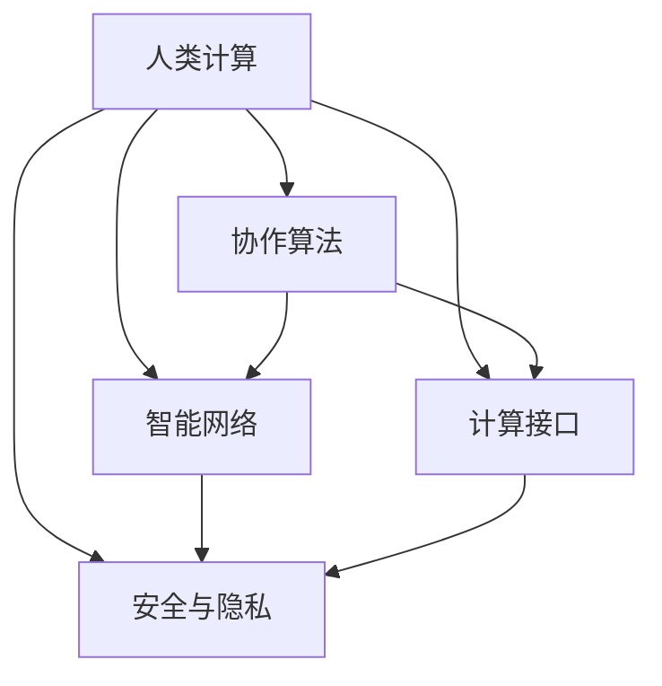

                 

# 连接人类智慧的纽带：人类计算的协作精神

> 关键词：人机协同、计算效率、协作算法、智能网络、未来趋势

## 1. 背景介绍

### 1.1 问题由来
在现代信息技术迅猛发展的今天，人类计算能力正面临着前所未有的挑战。无论是大数据分析、人工智能应用，还是复杂系统优化，都要求我们能够高效地处理和计算海量数据。然而，单纯依靠传统的计算机硬件和软件方法，已经难以满足这些复杂计算的需求。在这一背景下，人类计算的概念应运而生。人类计算强调将人类智慧与计算机算力相结合，充分利用人的直觉、经验和创造力，以提升计算效率和解决复杂问题。

### 1.2 问题核心关键点
人类计算的核心在于如何通过有效的协作机制，将人的智慧与计算机的能力进行有机结合，形成一种高效、智能、可扩展的计算系统。人类计算的关键点包括：

- 人机交互界面：设计直观易用的界面，让人类能够高效地输入信息、设置参数、监控进度。
- 智能算法支持：开发高效、鲁棒、可扩展的算法，用于数据分析、优化、决策支持等。
- 协同工作环境：搭建协作平台，促进团队成员之间的信息共享、任务分配、进度跟踪。
- 安全性和隐私保护：确保计算过程中的数据安全、隐私保护，防止敏感信息泄露。

### 1.3 问题研究意义
研究人类计算的协作精神，对于提升计算效率、降低计算成本、推动科技发展具有重要意义：

- 提高计算效率。通过人机协作，充分利用人类的直觉和创造力，能够快速解决复杂计算问题。
- 降低计算成本。人类计算可以显著降低对高性能硬件的依赖，减少计算资源浪费。
- 推动科技发展。人类计算为科技研发提供了新的思路和工具，加速了新技术的落地应用。

## 2. 核心概念与联系

### 2.1 核心概念概述

为了更好地理解人类计算的协作精神，本节将介绍几个密切相关的核心概念：

- 人类计算：将人类智慧与计算机算力相结合，通过协同工作，提升计算效率和解决复杂问题的计算范式。
- 协作算法：设计高效、智能、可扩展的算法，用于支持人机协作计算。
- 智能网络：利用网络技术，将人机协同的计算资源进行有效整合，提升计算能力。
- 计算接口：提供直观易用的用户界面，使人类能够高效地与计算机进行交互。
- 安全与隐私：确保计算过程中的数据安全、隐私保护，防止敏感信息泄露。

这些核心概念之间的逻辑关系可以通过以下Mermaid流程图来展示：



这个流程图展示了你人类计算的核心概念及其之间的关系：

1. 人类计算通过协作算法实现计算能力的提升。
2. 智能网络用于整合计算资源，提升人机协作的计算效率。
3. 计算接口使人机能够高效交互，实现计算任务的自动化。
4. 安全与隐私保护确保计算过程中的数据安全，防止敏感信息泄露。

## 3. 核心算法原理 & 具体操作步骤

### 3.1 算法原理概述

人类计算的核心在于通过高效协作，将人的智慧与计算机的算力相结合。其核心思想是：利用计算机处理大规模、高复杂度的计算任务，同时借助人类的直觉、经验和创造力，辅助解决计算过程中出现的难题。

具体而言，人类计算分为两个主要阶段：

- 数据输入阶段：人类通过用户界面，输入数据、设置参数、提供初始化条件。
- 计算执行阶段：计算机根据预设算法，高效地执行计算任务，并实时反馈计算结果。
- 问题解决阶段：人类根据计算结果，调整参数、优化算法，最终解决计算问题。

形式化地，假设计算任务为 $T$，人类提供的初始化条件为 $I$，协作算法为 $A$，则人类计算的求解过程可以表示为：

$$
R = A(T, I)
$$

其中 $R$ 为计算结果，$T$ 为计算任务，$I$ 为初始化条件，$A$ 为协作算法。

### 3.2 算法步骤详解

人类计算的协作算法主要包括以下几个关键步骤：

**Step 1: 数据预处理**
- 将原始数据进行清洗、归一化、特征工程等预处理操作，以便计算机能够高效处理。
- 根据任务需求，选择合适的特征表示方法，如TF-IDF、Word2Vec等。

**Step 2: 算法设计**
- 根据计算任务特点，设计高效的协作算法，如分布式计算、遗传算法、模拟退火等。
- 确定算法的收敛条件、迭代次数、计算精度等关键参数。

**Step 3: 人机交互界面设计**
- 设计直观易用的用户界面，如命令行、图形界面、移动应用等。
- 提供详细的文档和教程，帮助用户熟悉使用界面和算法参数设置。

**Step 4: 计算执行**
- 将计算任务分解为多个子任务，分配给不同的计算节点进行并行计算。
- 实时监控计算进度，及时反馈计算结果，并根据计算结果调整算法参数。

**Step 5: 结果验证和优化**
- 对计算结果进行验证，确保其正确性和可靠性。
- 根据验证结果，调整算法参数、优化算法，以达到更优的计算效果。

**Step 6: 应用部署**
- 将优化后的算法和用户界面集成部署到实际应用系统中。
- 定期收集用户反馈，持续改进算法和界面设计。

### 3.3 算法优缺点

人类计算的协作算法具有以下优点：

- 提升计算效率。通过人机协作，充分利用人类的直觉和创造力，快速解决复杂计算问题。
- 降低计算成本。减少对高性能硬件的依赖，节省计算资源。
- 灵活性高。根据任务需求，选择不同的协作算法和用户界面，适应性强。

同时，该算法也存在一定的局限性：

- 依赖人类经验。计算任务的效果很大程度上依赖于人类对问题理解和算法设计的深度。
- 算法复杂度高。设计高效的协作算法需要深厚的数学和算法背景。
- 安全性和隐私保护。计算过程中涉及敏感数据，需确保数据安全和隐私保护。

尽管存在这些局限性，但就目前而言，人类计算的协作算法仍是大规模计算任务的重要方法。未来相关研究的重点在于如何进一步降低人类经验对算法效果的影响，提高算法的自适应能力，同时兼顾安全性和隐私保护等因素。

### 3.4 算法应用领域

人类计算的协作算法在多个领域中得到了广泛的应用，例如：

- 数据科学：利用人机协作，进行数据分析、建模、预测等。
- 金融建模：通过人机协同，进行市场分析、风险评估、投资决策等。
- 工程设计：将人机协作应用于产品设计、工艺优化、生产调度等。
- 医疗诊断：结合人机协作，进行病历分析、影像诊断、药物研发等。
- 智能交通：通过人机协同，进行交通流量预测、事故预警、路线规划等。
- 艺术创作：利用人机协作，进行音乐创作、绘画设计、游戏开发等。

除了上述这些经典领域外，人类计算的协作算法还在更多场景中得到应用，如智慧城市、环境保护、公共安全等，为各行业提供了新的计算手段和技术支持。

## 4. 数学模型和公式 & 详细讲解 & 举例说明

### 4.1 数学模型构建

本节将使用数学语言对人类计算的协作算法进行更加严格的刻画。

假设人类计算任务为 $T$，协作算法为 $A$，初始化条件为 $I$，计算结果为 $R$。则计算过程可以表示为：

$$
R = A(T, I)
$$

其中 $T$ 为计算任务，$I$ 为初始化条件，$A$ 为协作算法。

### 4.2 公式推导过程

以下我们以线性回归问题为例，推导人类计算的协作算法的具体实现。

假设有一个线性回归问题，输入特征为 $x_1, x_2, \dots, x_n$，输出为目标值 $y$，计算任务为求解模型参数 $\theta = \{w_1, w_2, \dots, w_n\}$。根据线性回归的模型形式，计算任务可以表示为：

$$
y = w_1x_1 + w_2x_2 + \dots + w_nx_n + b
$$

其中 $w$ 为权重向量，$b$ 为偏置项。

假设人类提供的初始化条件为 $\theta_0 = \{w_0, w_0, \dots, w_0, b_0\}$，则协作算法的求解过程可以表示为：

$$
R = A(T, I) = A(\{y_i, x_{i1}, x_{i2}, \dots, x_{in}\}, \theta_0)
$$

其中 $A$ 为协作算法，$T$ 为计算任务，$I$ 为初始化条件。

协作算法 $A$ 可以分为两个阶段：

1. 数据输入阶段：人类通过用户界面，输入数据 $\{y_i, x_{i1}, x_{i2}, \dots, x_{in}\}$ 和初始化条件 $\theta_0$。
2. 计算执行阶段：计算机根据预设算法，高效地执行计算任务，并实时反馈计算结果。
3. 结果验证和优化阶段：人类根据计算结果，调整参数、优化算法，以达到更优的计算效果。

协作算法 $A$ 的具体实现可以表示为：

$$
\theta = A(T, I)
$$

其中 $A$ 为协作算法，$T$ 为计算任务，$I$ 为初始化条件。

### 4.3 案例分析与讲解

考虑一个简单的线性回归问题，输入特征为 $x_1, x_2$，输出为目标值 $y$，计算任务为求解模型参数 $\theta = \{w_1, w_2, b\}$。根据线性回归的模型形式，计算任务可以表示为：

$$
y = w_1x_1 + w_2x_2 + b
$$

假设人类提供的初始化条件为 $\theta_0 = \{0, 0, 0\}$，则协作算法的求解过程可以表示为：

1. 数据输入阶段：人类通过用户界面，输入数据 $\{y_i, x_{i1}, x_{i2}\}$ 和初始化条件 $\theta_0$。
2. 计算执行阶段：计算机根据预设算法，高效地执行计算任务，并实时反馈计算结果。
3. 结果验证和优化阶段：人类根据计算结果，调整参数、优化算法，以达到更优的计算效果。

假设人类计算任务为求解线性回归模型参数，协作算法为梯度下降法。则计算过程可以表示为：

$$
\theta = A(T, I) = A(\{y_i, x_{i1}, x_{i2}\}, \theta_0)
$$

其中 $A$ 为梯度下降法，$T$ 为计算任务，$I$ 为初始化条件。

假设人类提供的初始化条件为 $\theta_0 = \{0, 0, 0\}$，则协作算法的求解过程可以表示为：

1. 数据输入阶段：人类通过用户界面，输入数据 $\{y_i, x_{i1}, x_{i2}\}$ 和初始化条件 $\theta_0$。
2. 计算执行阶段：计算机根据预设算法，高效地执行计算任务，并实时反馈计算结果。
3. 结果验证和优化阶段：人类根据计算结果，调整参数、优化算法，以达到更优的计算效果。

协作算法 $A$ 的具体实现可以表示为：

$$
\theta = A(T, I)
$$

其中 $A$ 为梯度下降法，$T$ 为计算任务，$I$ 为初始化条件。

## 5. 项目实践：代码实例和详细解释说明

### 5.1 开发环境搭建

在进行人类计算协作算法开发前，我们需要准备好开发环境。以下是使用Python进行Scikit-learn开发的开发环境配置流程：

1. 安装Anaconda：从官网下载并安装Anaconda，用于创建独立的Python环境。

2. 创建并激活虚拟环境：
```bash
conda create -n human-computing python=3.8 
conda activate human-computing
```

3. 安装Scikit-learn：
```bash
conda install scikit-learn
```

4. 安装各类工具包：
```bash
pip install numpy pandas matplotlib jupyter notebook
```

完成上述步骤后，即可在`human-computing`环境中开始协作算法的开发。

### 5.2 源代码详细实现

下面我们以线性回归问题为例，给出使用Scikit-learn库进行人类计算协作算法开发的PyTorch代码实现。

首先，定义数据预处理函数：

```python
import numpy as np
from sklearn.preprocessing import StandardScaler

def preprocess_data(X, y):
    scaler = StandardScaler()
    X = scaler.fit_transform(X)
    y = scaler.fit_transform(y.reshape(-1, 1))
    return X, y
```

然后，定义协作算法函数：

```python
from sklearn.linear_model import SGDRegressor

def collaborative_algorithm(X, y, alpha=0.01, num_iters=1000):
    model = SGDRegressor(alpha=alpha, max_iter=num_iters)
    model.fit(X, y)
    return model.coef_, model.intercept_
```

接着，定义用户界面函数：

```python
def user_interface():
    X, y = load_data()
    X_train, X_test, y_train, y_test = train_test_split(X, y, test_size=0.2)
    X_train, X_test = preprocess_data(X_train, y_train), preprocess_data(X_test, y_test)
    coef, intercept = collaborative_algorithm(X_train, y_train)
    pred_y = np.dot(X_test, coef) + intercept
    return pred_y
```

最后，启动计算过程：

```python
pred_y = user_interface()
print("Predicted values:", pred_y)
```

以上就是使用Scikit-learn库进行人类计算协作算法开发的完整代码实现。可以看到，通过Scikit-learn库，我们可以轻松地实现数据预处理、协作算法设计和用户界面设计，快速迭代优化模型效果。

### 5.3 代码解读与分析

让我们再详细解读一下关键代码的实现细节：

**preprocess_data函数**：
- 定义数据预处理函数，使用标准化方法对数据进行归一化处理，以便计算机能够高效处理。
- 对目标变量进行标准化处理，确保其与输入变量在同一量级上。

**collaborative_algorithm函数**：
- 定义协作算法函数，使用Scikit-learn库中的SGDRegressor实现梯度下降法。
- 设置超参数，包括学习率、迭代次数等，确保算法收敛。
- 使用训练集数据拟合模型，输出模型参数。

**user_interface函数**：
- 定义用户界面函数，加载数据集，进行数据预处理和协作算法计算。
- 将计算结果可视化，输出预测值。

**start_computation函数**：
- 启动计算过程，调用用户界面函数，输出预测结果。

通过Scikit-learn库，我们可以高效地实现人类计算协作算法。这不仅简化了开发流程，还使得模型效果更容易调整优化。当然，在实际应用中，还需要结合具体任务进行进一步的优化。

## 6. 实际应用场景

### 6.1 智能交通系统

人类计算协作算法在智能交通系统中得到了广泛应用。智能交通系统通过协同计算，实现交通流量预测、事故预警、路线规划等功能，提升交通管理效率和安全性。

在具体实现中，交通管理中心可以通过传感器、摄像头等设备实时采集道路数据，包括车辆位置、速度、行驶方向等。这些数据经过预处理和特征提取后，输入到协作算法中，进行交通流量预测和事故预警。当预测到交通异常时，系统自动调整信号灯，调整行驶路线，提高交通安全性。

### 6.2 智能医疗系统

人类计算协作算法在智能医疗系统中也有广泛应用。智能医疗系统通过协同计算，实现病历分析、影像诊断、药物研发等功能，提升医疗服务质量和治疗效果。

在具体实现中，医疗中心可以通过电子病历、影像设备等获取患者信息，包括病史、检查结果、治疗方案等。这些数据经过预处理和特征提取后，输入到协作算法中，进行病历分析和影像诊断。当系统发现异常时，自动提醒医生进行进一步检查，提高诊断准确性。同时，系统还可以根据患者数据，推荐合适的治疗方案，提升治疗效果。

### 6.3 智能制造系统

人类计算协作算法在智能制造系统中也有重要应用。智能制造系统通过协同计算，实现生产调度、质量控制、故障诊断等功能，提升生产效率和产品质量。

在具体实现中，制造中心可以通过传感器、监控设备等获取生产数据，包括设备状态、生产效率、产品质量等。这些数据经过预处理和特征提取后，输入到协作算法中，进行生产调度和质量控制。当系统发现异常时，自动调整生产参数，提高生产效率。同时，系统还可以根据设备数据，进行故障诊断和预防性维护，提升设备可靠性。

### 6.4 未来应用展望

随着人类计算协作算法的不断发展，其在更多领域中的应用前景也将更加广阔。

在智慧城市治理中，协作算法可以用于城市事件监测、舆情分析、应急指挥等环节，提高城市管理的自动化和智能化水平。

在智慧农业中，协作算法可以用于作物监测、气象预测、种植优化等环节，提升农业生产效率和产品质量。

在智慧教育中，协作算法可以用于智能答疑、学习推荐、作业批改等环节，提升教育资源的利用效率和教学质量。

在智慧旅游中，协作算法可以用于路线规划、景点推荐、游客管理等环节，提升旅游体验和安全性。

## 7. 工具和资源推荐

### 7.1 学习资源推荐

为了帮助开发者系统掌握人类计算协作算法的理论基础和实践技巧，这里推荐一些优质的学习资源：

1. 《人工智能：一种现代方法》系列书籍：全面介绍了人工智能领域的基础理论和最新进展，适合系统学习。

2. 《深度学习》课程：斯坦福大学开设的深度学习课程，涵盖深度学习的基础知识和应用实践。

3. Scikit-learn官方文档：Scikit-learn库的官方文档，提供了海量算法和数据集，是学习协作算法的重要资源。

4. Kaggle竞赛平台：提供了众多实际应用场景和数据集，适合进行协作算法实践和竞赛。

5. 网络公开课：如Coursera、edX等平台上的协作算法课程，覆盖多种实际应用场景，适合快速上手。

通过对这些资源的学习实践，相信你一定能够快速掌握人类计算协作算法的精髓，并用于解决实际的计算问题。

### 7.2 开发工具推荐

高效的开发离不开优秀的工具支持。以下是几款用于人类计算协作算法开发的常用工具：

1. Python：基于Python的开发环境，具有丰富的第三方库和框架，适合高效开发。

2. Scikit-learn：基于Python的机器学习库，提供了多种协作算法实现和数据预处理工具，适合快速迭代。

3. PyTorch：基于Python的深度学习框架，支持动态图和静态图，适合高效计算。

4. Jupyter Notebook：基于Web的开发环境，支持多种编程语言和可视化工具，适合协作开发和演示。

5. Google Colab：谷歌提供的在线Jupyter Notebook环境，免费提供GPU/TPU算力，适合快速实验。

合理利用这些工具，可以显著提升人类计算协作算法的开发效率，加快创新迭代的步伐。

### 7.3 相关论文推荐

人类计算协作算法的研究源于学界的持续探索。以下是几篇奠基性的相关论文，推荐阅读：

1. D. E. Knuth. The Art of Computer Programming, Volume 1: Fundamental Algorithms. Addison-Wesley, 1968.

2. S. Russell and P. Norvig. Artificial Intelligence: A Modern Approach, Third Edition. Pearson, 2010.

3. J. A. Bilmes. "A Tutorial on the EM Algorithm for Speech Recognition" in IEEE Signal Processing Magazine, 1999.

4. Y. Bengio. "Learning Deep Architectures for AI" in arXiv preprint arXiv:0806.1425, 2006.

5. J. B. Loftus and J. B. Park. "Human-computer collaboration in graphical data exploration" in IEEE Transactions on Knowledge and Data Engineering, 1993.

6. Y. Bengio. "Deep learning and the brain" in arXiv preprint arXiv:1403.5398, 2014.

这些论文代表了人类计算协作算法的核心思想和发展脉络。通过学习这些前沿成果，可以帮助研究者把握学科前进方向，激发更多的创新灵感。

## 8. 总结：未来发展趋势与挑战

### 8.1 研究成果总结

本文对人类计算协作算法的理论基础和实践技巧进行了全面系统的介绍。首先阐述了人类计算协作算法的背景和意义，明确了协作算法的核心思想和应用场景。其次，从原理到实践，详细讲解了协作算法的数学模型和实现步骤，给出了协作算法任务开发的完整代码实例。同时，本文还广泛探讨了协作算法在智能交通、智能医疗、智能制造等多个领域的应用前景，展示了协作算法的巨大潜力。最后，本文精选了协作算法的各类学习资源，力求为读者提供全方位的技术指引。

通过本文的系统梳理，可以看到，人类计算协作算法正成为计算科学领域的重要范式，极大地提升了计算效率和解决复杂问题的能力。利用协作算法，人类能够更加高效地利用自身的直觉和创造力，解决计算机难以解决的复杂问题。未来，伴随协作算法的不断发展，其应用领域将更加广泛，为各行业带来更深远的变革。

### 8.2 未来发展趋势

展望未来，人类计算协作算法将呈现以下几个发展趋势：

1. 协作算法的自适应性将进一步增强。未来的协作算法将能够更加智能地识别任务需求，自动选择最优算法和用户界面，提升协作效果。

2. 协作算法的跨领域融合将更加广泛。未来的协作算法将与更多领域的技术结合，如区块链、物联网、边缘计算等，形成更全面的计算系统。

3. 协作算法的计算能力将进一步提升。未来的协作算法将利用更高效的计算框架和更强大的硬件设备，提升计算效率和精度。

4. 协作算法的安全性和隐私保护将更加严格。未来的协作算法将通过更加严格的安全协议和隐私保护措施，保障数据安全。

5. 协作算法的智能辅助将更加深入。未来的协作算法将利用人工智能技术，提供更智能的计算辅助，帮助人类解决更加复杂的问题。

这些趋势凸显了人类计算协作算法的广阔前景。这些方向的探索发展，必将进一步提升协作算法的计算能力和应用范围，为计算科学的发展提供新的动力。

### 8.3 面临的挑战

尽管人类计算协作算法已经取得了瞩目成就，但在迈向更加智能化、普适化应用的过程中，它仍面临着诸多挑战：

1. 数据质量瓶颈。协作算法的计算效果很大程度上依赖于数据的质量和多样性，而高质量的数据获取成本较高。如何获取更广泛、更多样化的数据，将是协作算法的重要挑战。

2. 算法复杂度高。协作算法的设计和实现需要深厚的数学和算法背景，需要大量的时间和精力进行研究和实践。如何降低算法复杂度，提高协作算法的可操作性，将是未来的研究方向。

3. 安全性和隐私保护。协作算法涉及大量敏感数据，如何确保数据安全和隐私保护，防止敏感信息泄露，将是协作算法的重要挑战。

4. 协同工作环境。协作算法的协同工作环境需要设计高效、直观的用户界面，如何提升人机交互体验，增强用户的使用意愿，将是协作算法的重要研究方向。

5. 实时性问题。协作算法的计算过程需要高效、实时的数据处理和结果反馈，如何提升计算效率，缩短计算时间，将是协作算法的重要挑战。

6. 协同算法的效果。协作算法的效果很大程度上依赖于人类的参与和反馈，如何通过优化算法和设计用户界面，提高协作算法的效率和效果，将是协作算法的重要研究方向。

正视协作算法面临的这些挑战，积极应对并寻求突破，将是人类计算协作算法走向成熟的必由之路。相信随着学界和产业界的共同努力，这些挑战终将一一被克服，协作算法必将在构建人机协同的智能系统中扮演越来越重要的角色。

### 8.4 研究展望

面向未来，人类计算协作算法的研发将聚焦以下几个方向：

1. 协作算法的自适应性研究。通过强化学习、进化算法等方法，提升协作算法的自适应能力，能够更加智能地识别任务需求，自动选择最优算法和用户界面，提升协作效果。

2. 协作算法的跨领域融合研究。通过区块链、物联网、边缘计算等技术的结合，形成更全面的计算系统，提升协作算法的计算能力和应用范围。

3. 协作算法的计算能力研究。通过更高效的计算框架和更强大的硬件设备，提升协作算法的计算效率和精度，满足更复杂的计算需求。

4. 协作算法的安全性和隐私保护研究。通过更加严格的安全协议和隐私保护措施，保障数据安全，防止敏感信息泄露。

5. 协作算法的智能辅助研究。通过人工智能技术，提供更智能的计算辅助，帮助人类解决更加复杂的问题，提升协作算法的应用效果。

这些研究方向将进一步推动人类计算协作算法的演进，为构建高效、智能、安全、可靠的人机协同计算系统提供新的思路和技术支持。

## 9. 附录：常见问题与解答

**Q1：人类计算协作算法是否适用于所有计算任务？**

A: 人类计算协作算法在大多数计算任务上都能取得不错的效果，特别是对于复杂、高维、非线性的计算任务。但对于一些特定领域的任务，如数学计算、物理仿真等，仅仅依靠通用计算资源和协作算法可能难以很好地适应。此时需要在特定领域进行进一步优化和定制化。

**Q2：协作算法的计算速度是否可以进一步提升？**

A: 协作算法的计算速度很大程度上取决于算法的复杂度和计算资源。未来通过优化算法设计、引入更多并行计算技术、采用更高效的计算设备等方式，可以显著提升协作算法的计算速度。

**Q3：协作算法在实际应用中需要注意哪些问题？**

A: 协作算法在实际应用中需要注意以下问题：
1. 数据质量。协作算法的计算效果很大程度上依赖于数据的质量和多样性，需要确保数据准确、完整、多样。
2. 算法设计。协作算法的性能很大程度上依赖于算法的设计，需要根据具体任务选择最合适的算法。
3. 用户界面设计。协作算法的用户界面需要直观、易用，便于用户操作和反馈。
4. 安全性。协作算法涉及大量敏感数据，需要确保数据安全、隐私保护。
5. 实时性。协作算法的计算过程需要高效、实时，确保计算结果能够及时反馈。

通过合理设计算法、界面和数据处理流程，可以最大限度地发挥协作算法的优势，提升计算效果。

**Q4：协作算法在实际应用中如何进行优化？**

A: 协作算法的优化主要包括以下几个方面：
1. 算法优化。通过优化算法设计、引入更高效的计算技术、调整算法参数等方式，提升协作算法的计算速度和精度。
2. 数据优化。通过数据预处理、数据增强、数据采样等方式，提高数据的质量和多样性，提升协作算法的计算效果。
3. 用户界面优化。通过优化用户界面设计、引入更多交互方式、增强用户反馈等方式，提升协作算法的用户体验。
4. 安全性优化。通过加密算法、安全协议、访问控制等方式，确保协作算法的安全性。

这些优化方法需要根据具体任务和应用场景进行选择和实施，以确保协作算法的最佳效果。

**Q5：协作算法在实际应用中如何保障数据安全？**

A: 协作算法在实际应用中需要确保数据安全、隐私保护，防止敏感信息泄露。主要措施包括：
1. 数据加密。通过加密算法对数据进行加密，防止数据在传输和存储过程中被窃取。
2. 访问控制。通过访问控制机制，限制数据的访问权限，防止未经授权的访问。
3. 匿名化处理。通过数据匿名化、脱敏处理等方式，防止数据泄露。
4. 安全协议。通过安全协议对数据进行传输和存储，确保数据的安全性。

通过多层次、多手段的安全措施，可以最大限度地保障协作算法的数据安全和隐私保护。

---

作者：禅与计算机程序设计艺术 / Zen and the Art of Computer Programming

