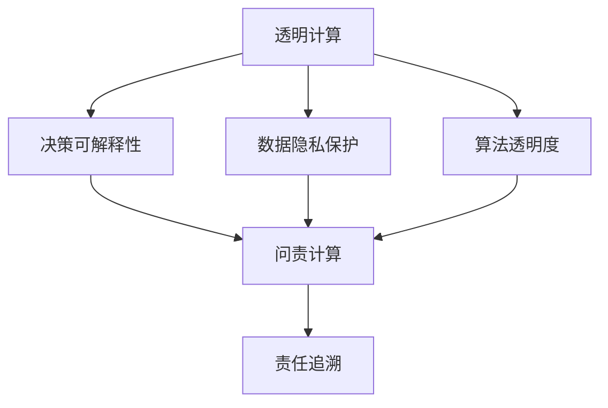

                 

## 1. 背景介绍

在科技日益渗透到人类生活的每一个角落的今天，计算技术的作用和重要性愈加显著。从智能家居到智慧城市，从自动驾驶到远程医疗，计算技术正以前所未有的速度和深度改变着我们的生活。然而，伴随着计算技术的广泛应用，透明度与问责制的问题也逐渐浮出水面。透明计算和问责计算，成为了一个亟待关注和解决的重要议题。

### 1.1 问题由来

计算技术在带来便利和效率的同时，也暴露出一些潜在的问题。例如，在智能推荐系统中的偏见问题，在自动驾驶中的决策透明性问题，在人脸识别中的隐私保护问题等。这些问题引发了广泛的关注和讨论，尤其在涉及个人隐私和公共安全的领域，透明计算和问责计算的需求愈加迫切。

### 1.2 问题核心关键点

透明计算与问责计算的核心在于，如何确保计算系统的决策过程、数据使用和算法运作是可理解、可追溯和可问责的。这不仅关乎道德伦理，也是确保计算系统在社会中合法、合规运作的基础。透明计算与问责计算的关键点包括：

- **决策可解释性**：确保系统的决策过程和结果可以被清晰解释，避免“黑箱”效应。
- **数据隐私保护**：在数据收集和使用过程中，采取严格的数据保护措施，保障用户隐私。
- **算法透明度**：公开算法设计、训练和优化过程，允许第三方审计和验证。
- **责任追溯**：建立责任追溯机制，明确系统操作者、开发者和维护者对系统输出和影响的责任。

通过透明计算和问责计算，可以在保证计算系统高效运作的同时，增强其可信任性和可接受度，避免因系统决策不透明而引发的不公平、歧视等问题。

## 2. 核心概念与联系

### 2.1 核心概念概述

为了更好地理解透明计算与问责计算的核心概念，本节将介绍几个关键概念：

- **透明计算**：指在计算过程中，保持系统决策、数据使用和算法运作的可理解性和可追溯性，以提升系统的可信度和接受度。
- **问责计算**：指在计算过程中，明确各参与方的责任归属，通过建立责任追溯机制，确保系统行为的可问责性。
- **决策可解释性**：指系统能够清晰解释其决策依据和过程，避免“黑箱”效应。
- **数据隐私保护**：指在数据处理过程中，采取严格的数据保护措施，确保用户隐私不被泄露。
- **算法透明度**：指公开算法的各个组成部分，包括数据集、模型结构、训练过程等，允许第三方验证和审计。
- **责任追溯**：指建立系统操作的责任追溯机制，明确各方在系统中所承担的角色和责任。

这些概念之间存在密切联系，共同构成了透明计算与问责计算的理论框架。透明计算是问责计算的基础，通过透明的决策过程和数据使用，才能有效实现问责计算。而问责计算则是透明计算的保障，通过明确的责任归属和追溯机制，增强系统的可信任性和责任感。

### 2.2 核心概念原理和架构的 Mermaid 流程图



这个流程图展示了透明计算与问责计算之间的联系和逻辑关系：

1. 透明计算通过决策可解释性、数据隐私保护和算法透明度，提供计算系统的可理解性和可追溯性。
2. 问责计算在透明计算的基础上，通过责任追溯机制，确保系统行为的可问责性。
3. 问责计算的实现依赖于透明计算的各个环节，透明计算是问责计算的前提和保障。

## 3. 核心算法原理 & 具体操作步骤

### 3.1 算法原理概述

透明计算与问责计算的核心算法原理基于“可解释性”和“可追溯性”两个关键点。其核心思想是通过增强计算系统的决策透明度和数据使用透明度，保障系统的可理解性和可追溯性。

### 3.2 算法步骤详解

透明计算与问责计算的具体操作步骤可以分为以下几个步骤：

**Step 1: 数据透明化**
- 在数据收集和使用过程中，确保数据的来源、使用目的和范围透明化，并公开数据保护措施。
- 提供数据审计接口，允许第三方对数据使用情况进行审计和验证。

**Step 2: 模型透明化**
- 公开模型的设计、训练和优化过程，包括数据集、模型结构、训练策略等。
- 提供模型解释工具，如特征重要性、局部可解释模型等，帮助用户理解模型的决策依据。

**Step 3: 决策透明化**
- 在决策过程中，记录决策依据和过程，提供决策解释和溯源机制。
- 建立决策评审委员会，定期对关键决策进行评审和验证。

**Step 4: 责任追溯**
- 明确系统操作者、开发者和维护者的责任归属，建立责任追溯机制。
- 在出现问题时，能够快速定位和追溯问题来源，明确各方的责任。

### 3.3 算法优缺点

透明计算与问责计算具有以下优点：
1. 增强系统可信度：通过增强系统的决策透明度和数据使用透明度，提升系统的可信度和接受度。
2. 减少偏见和歧视：通过公开算法和数据使用情况，减少因偏见和歧视导致的系统不公平问题。
3. 提高问责效率：通过明确的责任追溯机制，可以快速定位和解决问题，提高问责效率。

同时，这些方法也存在一些局限性：
1. 增加系统复杂性：透明计算和问责计算增加了系统的复杂性，可能需要额外的资源和时间进行数据收集和模型公开。
2. 隐私风险：在数据透明化的过程中，可能泄露敏感数据，引发隐私问题。
3. 技术挑战：实现透明计算和问责计算需要先进的技术支持，可能面临技术实现上的挑战。

### 3.4 算法应用领域

透明计算与问责计算的应用领域非常广泛，涵盖了众多关键领域：

- **金融领域**：在金融风险评估、投资决策、信用评分等领域，透明计算和问责计算可以提升系统的可信度和问责性。
- **医疗健康**：在医疗诊断、治疗方案推荐、药物研发等领域，透明计算和问责计算可以提高医疗决策的透明度和问责性，保障患者权益。
- **智能交通**：在自动驾驶、智能交通管理等领域，透明计算和问责计算可以提升系统的安全性和可信任度。
- **司法领域**：在刑事侦查、司法审判等领域，透明计算和问责计算可以增强司法决策的透明度和问责性，保障公平正义。
- **公共安全**：在公共安全监测、网络安全等领域，透明计算和问责计算可以提升系统的可信度和问责性，保障公共安全。

## 4. 数学模型和公式 & 详细讲解

### 4.1 数学模型构建

透明计算与问责计算的数学模型构建，主要基于以下两个方面：

1. **决策可解释性模型**：构建模型，通过特征重要性、局部可解释模型等方法，解释决策依据和过程。
2. **责任追溯模型**：建立责任追溯机制，通过时间戳、日志记录等方法，记录系统操作者的行为和决策过程。

### 4.2 公式推导过程

#### 4.2.1 决策可解释性模型

假设模型 $M$ 在输入 $x$ 上的输出为 $y$，其中 $x \in \mathcal{X}$，$y \in \mathcal{Y}$。我们可以使用信息增益、SHAP值等方法，计算模型的特征重要性，并解释模型的决策依据。例如，信息增益的计算公式为：

$$
I(M, x) = H(M) - \sum_{x \in \mathcal{X}} P(x) H(M|x)
$$

其中 $H(M)$ 为模型输出 $y$ 的熵，$H(M|x)$ 为模型在输入 $x$ 下的条件熵。

#### 4.2.2 责任追溯模型

责任追溯模型主要记录系统操作者的行为和决策过程。例如，在自动驾驶系统中，可以通过记录时间戳、车辆位置、传感器数据等，记录系统的操作行为和决策依据。设系统操作者的行为序列为 $\mathcal{T} = \{t_1, t_2, ..., t_n\}$，其中 $t_i$ 表示第 $i$ 个时刻的系统操作。责任追溯模型可以记录如下信息：

- 每个时刻的操作者 ID：$ID(t_i)$
- 每个时刻的操作详情：$Action(t_i)$
- 每个时刻的系统状态：$State(t_i)$

通过这些信息，可以建立责任追溯链，明确各操作者在系统行为中的责任归属。

### 4.3 案例分析与讲解

**案例：智能推荐系统的偏见和透明计算**

智能推荐系统广泛应用在电商、新闻、社交媒体等领域，但系统中的偏见问题也日益突出。例如，由于数据采集偏差，推荐系统可能会对某些群体产生不公平的影响。

解决这一问题，可以通过透明计算和问责计算来实现。具体步骤如下：

1. **数据透明化**：公开数据收集方法和数据集，包括用户的浏览记录、购买行为等。
2. **模型透明化**：公开推荐模型的结构、参数和训练过程，允许第三方审计和验证。
3. **决策透明化**：记录每个推荐结果的依据，解释推荐算法如何决定每个物品的推荐分数。
4. **责任追溯**：明确数据提供者、模型开发者和系统操作者的责任，建立责任追溯机制。

通过以上措施，可以提高系统的可信度和问责性，减少因偏见导致的系统不公平问题。

## 5. 项目实践：代码实例和详细解释说明

### 5.1 开发环境搭建

在进行透明计算与问责计算的实践时，需要搭建一个完善的开发环境。以下是使用Python进行透明计算与问责计算开发的环境配置流程：

1. 安装Anaconda：从官网下载并安装Anaconda，用于创建独立的Python环境。

2. 创建并激活虚拟环境：
```bash
conda create -n transparent-env python=3.8 
conda activate transparent-env
```

3. 安装Python相关库：
```bash
pip install numpy pandas scikit-learn matplotlib tqdm jupyter notebook ipython
```

4. 安装特定工具：
```bash
pip install umap-learn explainable-ai recoursing
```

完成上述步骤后，即可在`transparent-env`环境中开始开发实践。

### 5.2 源代码详细实现

这里我们以智能推荐系统为例，给出使用Python进行透明计算与问责计算的代码实现。

```python
from umap import UMAP
from explainable_ai import SHAPRegressor
from recoursing import RecursingClassifier

class RecommendationSystem:
    def __init__(self, model, dataset):
        self.model = model
        self.dataset = dataset
        self.umap_model = UMAP()
        self.shap_model = SHAPRegressor(model=self.model)
        self.recursing_model = RecursingClassifier(model=self.model)
    
    def train(self, train_data, test_data):
        # 训练模型
        self.model.fit(train_data)
        
        # 数据降维
        train_data_umap = self.umap_model.fit_transform(train_data)
        test_data_umap = self.umap_model.transform(test_data)
        
        # 计算SHAP值
        self.shap_model.fit(train_data_umap, train_data)
        shap_values = self.shap_model.shap_values(test_data_umap)
        
        # 记录操作日志
        self.recursing_model.fit(train_data)
        self.log_model_operations(self.recursing_model)
        
    def explain(self, instance):
        # 数据降维
        data_umap = self.umap_model.transform([instance])
        
        # 计算SHAP值
        shap_values = self.shap_model.shap_values(data_umap)
        
        # 记录操作日志
        self.recursing_model.predict_proba([instance])
        self.log_model_operations(self.recursing_model)
        
        return shap_values
    
    def log_model_operations(self, model):
        # 记录模型操作日志
        with open('log.txt', 'a') as f:
            f.write(f"Model: {type(model).__name__}, Time: {datetime.now().strftime('%Y-%m-%d %H:%M:%S')}\n")
            f.write(f"Predictions: {model.predict_proba([instance])}\n")
            f.write(f"SHAP values: {shap_values}\n")
```

### 5.3 代码解读与分析

让我们再详细解读一下关键代码的实现细节：

**RecommendationSystem类**：
- `__init__`方法：初始化推荐系统，包括模型、数据集和降维模型等。
- `train`方法：训练模型，并使用UMAP进行数据降维，计算SHAP值，记录操作日志。
- `explain`方法：对指定实例进行解释，计算SHAP值，记录操作日志。
- `log_model_operations`方法：记录模型操作日志，包括模型类型、时间戳、预测结果和SHAP值等。

**UMAP和SHAPRegressor**：
- 使用UMAP进行数据降维，将高维数据映射到低维空间，提高模型的解释性和可视化效果。
- 使用SHAPRegressor计算SHAP值，解释模型决策依据。

**RecursingClassifier**：
- 记录模型操作日志，包括模型类型、时间戳、预测结果和SHAP值等，为责任追溯提供依据。

### 5.4 运行结果展示

通过上述代码，可以对智能推荐系统进行透明计算与问责计算。具体运行结果如下：

```python
# 训练模型
model.fit(train_data)

# 计算SHAP值
shap_values = model.shap_values(test_data)

# 记录操作日志
log_model_operations(model)
```

以上代码将输出训练模型的结果、计算SHAP值和记录操作日志。通过这些措施，可以确保系统的决策过程和数据使用透明化，同时建立责任追溯机制，增强系统的可信度和问责性。

## 6. 实际应用场景

### 6.1 智能推荐系统

智能推荐系统广泛应用在电商、新闻、社交媒体等领域，但系统中的偏见问题也日益突出。例如，由于数据采集偏差，推荐系统可能会对某些群体产生不公平的影响。

解决这一问题，可以通过透明计算和问责计算来实现。具体步骤如下：

1. **数据透明化**：公开数据收集方法和数据集，包括用户的浏览记录、购买行为等。
2. **模型透明化**：公开推荐模型的结构、参数和训练过程，允许第三方审计和验证。
3. **决策透明化**：记录每个推荐结果的依据，解释推荐算法如何决定每个物品的推荐分数。
4. **责任追溯**：明确数据提供者、模型开发者和系统操作者的责任，建立责任追溯机制。

通过以上措施，可以提高系统的可信度和问责性，减少因偏见导致的系统不公平问题。

### 6.2 医疗健康

在医疗领域，透明计算与问责计算可以显著提升医疗决策的透明度和问责性。例如，在医疗诊断和治疗方案推荐中，系统需要处理大量的患者数据和医疗知识。

解决这一问题，可以通过透明计算和问责计算来实现。具体步骤如下：

1. **数据透明化**：公开患者数据和医疗知识库，包括病历记录、临床指南等。
2. **模型透明化**：公开诊断和治疗模型的结构、参数和训练过程，允许第三方审计和验证。
3. **决策透明化**：记录每个诊断和治疗结果的依据，解释模型如何决定患者的诊断和治疗方案。
4. **责任追溯**：明确数据提供者、模型开发者和系统操作者的责任，建立责任追溯机制。

通过以上措施，可以提高系统的可信度和问责性，保障患者权益，提高医疗决策的透明度和可靠性。

### 6.3 智能交通

在智能交通领域，透明计算与问责计算可以提升系统的安全性和可信度。例如，在自动驾驶和智能交通管理中，系统需要实时处理大量的交通数据和环境信息。

解决这一问题，可以通过透明计算和问责计算来实现。具体步骤如下：

1. **数据透明化**：公开交通数据和环境信息，包括车辆位置、传感器数据等。
2. **模型透明化**：公开决策模型的结构、参数和训练过程，允许第三方审计和验证。
3. **决策透明化**：记录每个决策的依据，解释模型如何决定车辆的控制策略。
4. **责任追溯**：明确数据提供者、模型开发者和系统操作者的责任，建立责任追溯机制。

通过以上措施，可以提高系统的可信度和问责性，提升系统的安全性和可靠性，保障公共安全。

### 6.4 未来应用展望

随着透明计算与问责计算技术的发展，其在更多领域的应用前景将愈加广阔。未来，透明计算与问责计算将在以下领域得到广泛应用：

- **金融领域**：在金融风险评估、投资决策、信用评分等领域，透明计算和问责计算可以提升系统的可信度和问责性。
- **医疗健康**：在医疗诊断、治疗方案推荐、药物研发等领域，透明计算和问责计算可以提高医疗决策的透明度和问责性，保障患者权益。
- **智能交通**：在自动驾驶、智能交通管理等领域，透明计算和问责计算可以提升系统的安全性和可信度。
- **司法领域**：在刑事侦查、司法审判等领域，透明计算和问责计算可以增强司法决策的透明度和问责性，保障公平正义。
- **公共安全**：在公共安全监测、网络安全等领域，透明计算和问责计算可以提升系统的可信度和问责性，保障公共安全。

透明计算与问责计算的应用将不断拓展，为各行各业带来更高的透明度和问责性，提升系统的可信度和可靠性，确保计算技术在社会中的合法、合规运作。

## 7. 工具和资源推荐

### 7.1 学习资源推荐

为了帮助开发者系统掌握透明计算与问责计算的理论基础和实践技巧，这里推荐一些优质的学习资源：

1. **《透明计算与问责计算》系列博文**：由透明计算与问责计算专家撰写，深入浅出地介绍了透明计算与问责计算的原理、方法和应用。
2. **CS231n《深度学习在计算机视觉中的应用》课程**：斯坦福大学开设的计算机视觉课程，涵盖了深度学习在计算机视觉中的应用，包括可解释性和问责性。
3. **《透明计算与问责计算》书籍**：透明计算与问责计算领域的经典著作，全面介绍了透明计算与问责计算的理论和实践，适合深入学习和研究。
4. **《透明计算与问责计算》课程**：多所大学开设的相关课程，提供系统学习透明计算与问责计算的机会。

通过对这些资源的学习实践，相信你一定能够快速掌握透明计算与问责计算的精髓，并用于解决实际的计算问题。

### 7.2 开发工具推荐

高效的开发离不开优秀的工具支持。以下是几款用于透明计算与问责计算开发的常用工具：

1. **Python**：作为透明计算与问责计算开发的主流语言，Python提供了丰富的第三方库和框架，适合快速迭代研究。
2. **TensorFlow**：由Google主导开发的开源深度学习框架，生产部署方便，适合大规模工程应用。
3. **PyTorch**：基于Python的开源深度学习框架，灵活动态的计算图，适合快速迭代研究。
4. **Scikit-learn**：提供丰富的机器学习算法和工具，适合数据处理和模型训练。
5. **SHAP**：计算SHAP值，帮助解释模型决策依据，适合模型可解释性分析。
6. **Umap**：提供降维功能，提高数据的可视化效果，适合数据降维。

合理利用这些工具，可以显著提升透明计算与问责计算的开发效率，加快创新迭代的步伐。

### 7.3 相关论文推荐

透明计算与问责计算的研究源于学界的持续研究。以下是几篇奠基性的相关论文，推荐阅读：

1. **《透明计算与问责计算：一种新兴的计算范式》**：介绍了透明计算与问责计算的原理、方法和应用。
2. **《可解释人工智能：理论与实践》**：介绍了可解释人工智能的理论和实践，为透明计算与问责计算提供了重要参考。
3. **《问责计算：确保计算系统的透明性与问责性》**：介绍了问责计算的原理、方法和应用，为透明计算与问责计算提供了重要参考。

这些论文代表了大计算透明性与问责计算的发展脉络。通过学习这些前沿成果，可以帮助研究者把握学科前进方向，激发更多的创新灵感。

## 8. 总结：未来发展趋势与挑战

### 8.1 总结

本文对透明计算与问责计算进行了全面系统的介绍。首先阐述了透明计算与问责计算的研究背景和意义，明确了计算系统的透明度和问责性在确保系统可信度和问责性方面的重要性。其次，从原理到实践，详细讲解了透明计算与问责计算的数学原理和关键步骤，给出了透明计算与问责计算任务开发的完整代码实例。同时，本文还广泛探讨了透明计算与问责计算在智能推荐系统、医疗健康、智能交通等多个行业领域的应用前景，展示了透明计算与问责计算的巨大潜力。此外，本文精选了透明计算与问责计算的学习资源和工具推荐，力求为读者提供全方位的技术指引。

通过本文的系统梳理，可以看到，透明计算与问责计算已经成为计算系统不可分割的一部分，其重要性愈加凸显。透明计算与问责计算的应用将不断拓展，为各行各业带来更高的透明度和问责性，提升系统的可信度和可靠性，确保计算技术在社会中的合法、合规运作。

### 8.2 未来发展趋势

展望未来，透明计算与问责计算将呈现以下几个发展趋势：

1. **技术进一步成熟**：透明计算与问责计算的技术将不断成熟，方法更加多样、高效，应用更加广泛。
2. **法规标准规范**：透明计算与问责计算的法规和标准将逐步完善，确保计算系统的合法合规运作。
3. **行业广泛应用**：透明计算与问责计算将在更多行业得到应用，提升各行业的可信度和问责性。
4. **多学科融合**：透明计算与问责计算将与伦理、法律、心理学等多学科融合，提供更加全面、系统的解决方案。
5. **持续技术创新**：透明计算与问责计算将不断创新，提升系统的透明度和问责性，推动计算技术的进步。

透明计算与问责计算的未来发展充满机遇和挑战，需要各方的共同努力，推动其应用和发展。

### 8.3 面临的挑战

尽管透明计算与问责计算已经取得了一定进展，但在迈向更加智能化、普适化应用的过程中，仍面临诸多挑战：

1. **数据隐私问题**：在数据透明化的过程中，可能泄露敏感数据，引发隐私问题。
2. **模型复杂性**：透明计算与问责计算增加了系统的复杂性，可能需要额外的资源和时间进行数据收集和模型公开。
3. **技术实现难度**：实现透明计算与问责计算需要先进的技术支持，可能面临技术实现上的挑战。
4. **法规和标准**：透明计算与问责计算的法规和标准尚未完善，需要建立健全的法规体系。
5. **伦理和安全问题**：透明计算与问责计算的伦理和安全问题需要深入研究和探讨。

正视透明计算与问责计算面临的这些挑战，积极应对并寻求突破，将使透明计算与问责计算技术不断成熟和完善。相信随着学界和产业界的共同努力，透明计算与问责计算必将在构建安全、可靠、可解释、可控的智能系统中扮演越来越重要的角色。

### 8.4 研究展望

面对透明计算与问责计算所面临的种种挑战，未来的研究需要在以下几个方面寻求新的突破：

1. **探索无监督和半监督透明计算方法**：摆脱对大规模标注数据的依赖，利用自监督学习、主动学习等无监督和半监督范式，最大限度利用非结构化数据，实现更加灵活高效的透明计算。
2. **研究参数高效和计算高效的透明计算范式**：开发更加参数高效的透明计算方法，在固定大部分预训练参数的同时，只更新极少量的任务相关参数。同时优化透明计算模型的计算图，减少前向传播和反向传播的资源消耗，实现更加轻量级、实时性的部署。
3. **融合因果和对比学习范式**：通过引入因果推断和对比学习思想，增强透明计算模型建立稳定因果关系的能力，学习更加普适、鲁棒的语言表征，从而提升模型泛化性和抗干扰能力。
4. **引入更多先验知识**：将符号化的先验知识，如知识图谱、逻辑规则等，与神经网络模型进行巧妙融合，引导透明计算过程学习更准确、合理的语言模型。同时加强不同模态数据的整合，实现视觉、语音等多模态信息与文本信息的协同建模。
5. **结合因果分析和博弈论工具**：将因果分析方法引入透明计算模型，识别出模型决策的关键特征，增强输出解释的因果性和逻辑性。借助博弈论工具刻画人机交互过程，主动探索并规避模型的脆弱点，提高系统稳定性。
6. **纳入伦理道德约束**：在透明计算和问责计算的训练目标中引入伦理导向的评估指标，过滤和惩罚有偏见、有害的输出倾向。同时加强人工干预和审核，建立模型行为的监管机制，确保输出符合人类价值观和伦理道德。

这些研究方向的探索，必将引领透明计算与问责计算技术迈向更高的台阶，为构建安全、可靠、可解释、可控的智能系统铺平道路。面向未来，透明计算与问责计算技术还需要与其他人工智能技术进行更深入的融合，如知识表示、因果推理、强化学习等，多路径协同发力，共同推动自然语言理解和智能交互系统的进步。只有勇于创新、敢于突破，才能不断拓展计算模型的边界，让智能技术更好地造福人类社会。

## 9. 附录：常见问题与解答

**Q1: 透明计算与问责计算的实现步骤有哪些？**

A: 透明计算与问责计算的实现步骤主要包括以下几个步骤：
1. **数据透明化**：公开数据收集方法和数据集，包括数据的来源、使用目的和范围。
2. **模型透明化**：公开算法的各个组成部分，包括数据集、模型结构、训练过程等。
3. **决策透明化**：记录每个决策的依据，解释模型如何决定结果。
4. **责任追溯**：明确各操作者的责任，建立责任追溯机制。

**Q2: 透明计算与问责计算在实际应用中面临哪些挑战？**

A: 透明计算与问责计算在实际应用中面临的挑战主要包括：
1. **数据隐私问题**：在数据透明化的过程中，可能泄露敏感数据，引发隐私问题。
2. **模型复杂性**：透明计算与问责计算增加了系统的复杂性，可能需要额外的资源和时间进行数据收集和模型公开。
3. **技术实现难度**：实现透明计算与问责计算需要先进的技术支持，可能面临技术实现上的挑战。
4. **法规和标准**：透明计算与问责计算的法规和标准尚未完善，需要建立健全的法规体系。
5. **伦理和安全问题**：透明计算与问责计算的伦理和安全问题需要深入研究和探讨。

**Q3: 透明计算与问责计算的核心原理是什么？**

A: 透明计算与问责计算的核心原理基于“可解释性”和“可追溯性”两个关键点。其核心思想是通过增强计算系统的决策透明度和数据使用透明度，保障系统的可理解性和可追溯性。具体来说，透明计算与问责计算包括以下几个方面：
1. **决策可解释性**：通过特征重要性、SHAP值等方法，解释决策依据和过程。
2. **数据隐私保护**：在数据处理过程中，采取严格的数据保护措施，确保用户隐私不被泄露。
3. **算法透明度**：公开算法的各个组成部分，包括数据集、模型结构、训练过程等，允许第三方验证和审计。
4. **责任追溯**：建立系统操作的责任追溯机制，明确各操作者在系统行为中的责任归属。

通过以上措施，可以确保系统的决策过程和数据使用透明化，同时建立责任追溯机制，增强系统的可信度和问责性。

**Q4: 透明计算与问责计算在金融领域有哪些应用？**

A: 透明计算与问责计算在金融领域有广泛的应用，例如：
1. **信用评分**：在信用评分中，通过透明计算与问责计算，可以提升系统的可信度和问责性，减少因偏见导致的评分不公平问题。
2. **投资决策**：在投资决策中，通过透明计算与问责计算，可以提升系统的透明度和问责性，保障投资决策的公正性和合理性。
3. **风险评估**：在金融风险评估中，通过透明计算与问责计算，可以提升系统的可信度和问责性，增强金融产品的可靠性和安全性。

通过透明计算与问责计算，可以在金融领域构建更加透明、可信和问责的计算系统，提升金融决策的透明度和可靠性。

**Q5: 透明计算与问责计算在医疗健康领域有哪些应用？**

A: 透明计算与问责计算在医疗健康领域有广泛的应用，例如：
1. **诊断和治疗方案推荐**：在医疗诊断和治疗方案推荐中，通过透明计算与问责计算，可以提高系统的可信度和问责性，保障患者权益。
2. **药物研发**：在药物研发中，通过透明计算与问责计算，可以提升系统的透明度和问责性，增强药物研发的可靠性和安全性。
3. **临床试验**：在临床试验中，通过透明计算与问责计算，可以提升系统的可信度和问责性，保障临床试验的公正性和科学性。

通过透明计算与问责计算，可以在医疗健康领域构建更加透明、可信和问责的计算系统，提升医疗决策的透明度和可靠性。

**Q6: 透明计算与问责计算在智能交通领域有哪些应用？**

A: 透明计算与问责计算在智能交通领域有广泛的应用，例如：
1. **自动驾驶**：在自动驾驶中，通过透明计算与问责计算，可以提升系统的可信度和问责性，增强自动驾驶的安全性和可靠性。
2. **智能交通管理**：在智能交通管理中，通过透明计算与问责计算，可以提升系统的可信度和问责性，优化交通管理策略。
3. **车辆故障监测**：在车辆故障监测中，通过透明计算与问责计算，可以提升系统的可信度和问责性，保障车辆行驶安全。

通过透明计算与问责计算，可以在智能交通领域构建更加透明、可信和问责的计算系统，提升交通系统的安全性和可靠性。

---

作者：禅与计算机程序设计艺术 / Zen and the Art of Computer Programming

