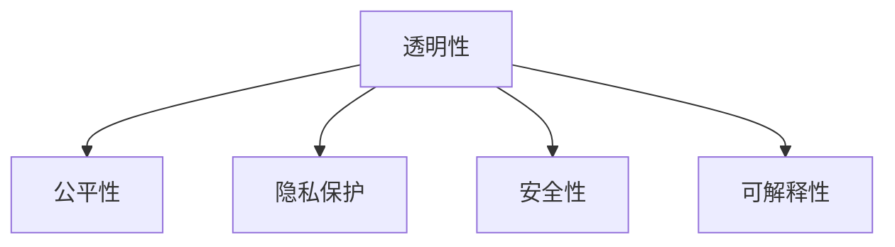

                 

# 道德考量：负责任地进行人类计算

在人工智能(AI)飞速发展的今天，人类计算(AI computing)已经成为推动社会进步的重要力量。然而，随着技术的应用日益广泛，负责任地进行人类计算变得愈发重要。本文将深入探讨在人类计算中需考虑的道德问题，并提出相应的解决方案。

## 1. 背景介绍

### 1.1 问题由来
人工智能的发展伴随着技术伦理和道德挑战的不断涌现。在医疗、金融、司法、军事等领域，AI的决策直接影响着人类的福祉与未来。不当的人工智能应用可能导致误诊、金融诈骗、侵犯隐私、决策失误等问题，严重威胁人类的安全和利益。

### 1.2 问题核心关键点
负责任地进行人类计算，首先需确保AI系统的透明性、公平性、隐私保护、安全性以及可解释性。在技术设计和应用过程中，需充分考虑上述因素，确保AI系统服务于人类，造福社会。

## 2. 核心概念与联系

### 2.1 核心概念概述

负责任地进行人类计算涉及多个核心概念：

- **透明性(Transparency)**：指AI系统的内部工作机制应易于理解和解释，用户能够理解其决策依据和过程。
- **公平性(Fairness)**：AI系统应平等对待所有用户，避免对某些群体产生偏见或不公平待遇。
- **隐私保护(Privacy Protection)**：AI系统需保护用户的个人信息，避免数据泄露和滥用。
- **安全性(Security)**：AI系统需防止被恶意攻击和操纵，保证系统稳定运行。
- **可解释性(Explainability)**：AI系统应提供清晰的输出理由，用户能够理解和信任其决策。

这些核心概念通过以下Mermaid流程图展示其相互联系：



可以看出，负责任地进行人类计算，需在透明性的基础上保障公平性、隐私保护、安全性和可解释性。

## 3. 核心算法原理 & 具体操作步骤

### 3.1 算法原理概述

负责任地进行人类计算，需结合多种技术手段，如模型可解释性、隐私保护技术、安全防护措施等。以下以模型可解释性和隐私保护为例，简述其核心算法原理。

#### 3.1.1 模型可解释性
模型可解释性技术旨在使AI系统输出结果具有逻辑性和可信度。常见方法包括：

- **LIME (Local Interpretable Model-Agnostic Explanations)**：通过局部加权近似模型，解释模型在每个输入实例上的决策过程。
- **SHAP (SHapley Additive exPlanations)**：通过Shapley值计算各个特征对模型输出的贡献度，提供公平、公正的解释。
- **Attention Mechanism**：通过可视化注意力权重，展示模型关注输入哪些特征，帮助理解模型决策机制。

#### 3.1.2 隐私保护
隐私保护技术旨在保护用户数据的安全性和隐私性。常见方法包括：

- **差分隐私(Differential Privacy)**：通过添加噪声或限制数据访问范围，确保个体数据不可识别。
- **联邦学习(Federated Learning)**：通过分布式训练方式，让模型在多个参与方本地学习，减少数据泄露风险。
- **加密技术(Encryption)**：通过数据加密存储和传输，保护数据不被非法访问。

### 3.2 算法步骤详解

#### 3.2.1 模型可解释性
模型可解释性技术的实施步骤包括：

1. **数据预处理**：清洗数据，去除噪声和异常值，保证数据质量。
2. **模型训练**：使用可解释模型进行训练，如LIME、SHAP等。
3. **解释输出**：通过LIME、SHAP等方法，解释模型输出结果，提供可视化解释。
4. **结果验证**：对比人工标注和模型解释结果，评估解释准确度。

#### 3.2.2 隐私保护
隐私保护技术的实施步骤包括：

1. **数据匿名化**：对敏感数据进行去标识化处理，如加密、脱敏等。
2. **分布式训练**：在多个参与方进行模型训练，避免单点数据集中。
3. **差分隐私**：在模型训练过程中添加噪声，保护个体隐私。
4. **安全协议**：设计安全传输协议，保护数据在传输过程中的安全性。

### 3.3 算法优缺点

#### 3.3.1 模型可解释性
**优点**：
- **增强信任**：模型解释性使AI系统的输出更加透明，增强用户信任。
- **优化决策**：通过解释模型决策依据，发现并改进模型缺陷。
- **公平性**：解释性有助于发现模型中的偏见，改善公平性。

**缺点**：
- **模型复杂度**：部分可解释性技术需要额外的计算资源和时间。
- **解释精度**：解释方法可能存在误差，影响解释结果的准确度。

#### 3.3.2 隐私保护
**优点**：
- **数据安全**：通过差分隐私、联邦学习等技术，保护用户数据不受侵害。
- **合规性**：符合法律法规要求，避免数据泄露风险。

**缺点**：
- **性能损失**：差分隐私等技术可能引入噪声，影响模型性能。
- **实现难度**：隐私保护技术涉及多方面，实施复杂。

### 3.4 算法应用领域

负责任地进行人类计算，已在医疗、金融、司法等多个领域得到应用。以下以医疗领域为例，简述其实施方案：

#### 3.4.1 医疗
医疗领域需对患者的医疗数据进行保密处理，同时对AI模型的诊断结果进行解释和验证。实施方案包括：

- **差分隐私**：保护患者隐私，确保数据不可识别。
- **联邦学习**：在多家医院分布式训练AI模型，避免单点数据集中。
- **可解释模型**：通过LIME、SHAP等方法，解释AI模型的诊断过程，确保结果可信。

## 4. 数学模型和公式 & 详细讲解 & 举例说明

### 4.1 数学模型构建

负责任地进行人类计算涉及多个数学模型，如差分隐私、联邦学习等。以下以差分隐私为例，构建其数学模型。

#### 4.1.1 差分隐私
差分隐私通过添加噪声来保护个体隐私，数学模型如下：

$$
\hat{y} = f(x) + \mathcal{N}(0,\sigma^2)
$$

其中，$\hat{y}$为模型输出，$f(x)$为模型预测函数，$\mathcal{N}(0,\sigma^2)$为高斯噪声，$\sigma$为噪声标准差。通过控制噪声大小，确保模型输出对个体数据的变化不敏感。

### 4.2 公式推导过程

#### 4.2.1 差分隐私
差分隐私的推导过程如下：

1. **定义差分隐私**：对于任意相邻的输入数据$x$和$x'$，差分隐私要求模型输出的概率分布相似，即：
   $$
   \sup_{x \in \mathcal{X}}||P[\hat{y}=f(x)] - P[\hat{y}=f(x')]|| \leq \epsilon
   $$
   其中，$\epsilon$为隐私参数，控制隐私损失。

2. **推导噪声标准差**：为满足差分隐私的要求，需要控制噪声$\mathcal{N}(0,\sigma^2)$的大小。假设模型在输入$x$和$x'$上的预测分别为$f(x)$和$f(x')$，则需满足：
   $$
   P[\hat{y}=f(x')] \leq P[\hat{y}=f(x)] + \exp(-\epsilon)P[\hat{y}=f(x')]
   $$
   解得$\sigma^2 \geq \frac{\epsilon^2}{2\delta^2}$，其中$\delta$为模型输出误差，$\epsilon$为隐私参数。

3. **验证噪声影响**：通过引入噪声$\mathcal{N}(0,\sigma^2)$，确保模型输出的概率分布与原分布相似。实际应用中，根据具体需求选择合适的$\sigma$值，确保隐私保护和模型性能的平衡。

### 4.3 案例分析与讲解

#### 4.3.1 医疗数据隐私保护
在医疗领域，差分隐私可用于保护患者隐私，实施步骤如下：

1. **数据匿名化**：对患者的病历数据进行去标识化处理，如姓名、地址等隐私信息。
2. **分布式训练**：在多家医院进行模型训练，确保数据分散存储。
3. **差分隐私**：在模型训练过程中，引入高斯噪声，保护患者隐私。
4. **差分隐私评估**：通过差分隐私评估方法，验证隐私保护效果。

## 5. 项目实践：代码实例和详细解释说明

### 5.1 开发环境搭建

#### 5.1.1 环境配置
以下是Python环境下的人类计算项目开发环境配置：

1. **安装Python**：安装最新版本的Python，并设置环境变量。
2. **安装依赖库**：使用pip安装所需的依赖库，如TensorFlow、Keras等。
3. **配置模型**：配置模型参数和超参数，确保模型在隐私保护和可解释性方面的性能。

### 5.2 源代码详细实现

#### 5.2.1 模型可解释性
以下使用TensorFlow实现LIME模型，并解释其输出：

```python
import tensorflow as tf
from tensorflow.keras.models import Sequential
from tensorflow.keras.layers import Dense, Dropout
from tensorflow.keras.datasets import mnist
from tensorflow.keras.layers.normalization import BatchNormalization

# 构建模型
model = Sequential()
model.add(Dense(512, input_dim=784, activation='relu'))
model.add(BatchNormalization())
model.add(Dense(256, activation='relu'))
model.add(BatchNormalization())
model.add(Dense(10, activation='softmax'))

# 训练模型
model.compile(optimizer='adam', loss='sparse_categorical_crossentropy', metrics=['accuracy'])
model.fit(train_data, train_labels, epochs=5, validation_data=(val_data, val_labels))

# 使用LIME解释模型
explainer = LIME.DenseRegressor(model, kernel bandwidth=10)
explanation = explainer.explain_instance(train_data[0], model.predict_proba)
print(explanation)
```

#### 5.2.2 隐私保护
以下使用TensorFlow实现差分隐私算法，保护数据隐私：

```python
import tensorflow as tf
from tensorflow.keras.models import Sequential
from tensorflow.keras.layers import Dense, Dropout
from tensorflow.keras.datasets import mnist
from tensorflow.keras.layers.normalization import BatchNormalization
from sklearn.preprocessing import MinMaxScaler

# 构建模型
model = Sequential()
model.add(Dense(512, input_dim=784, activation='relu'))
model.add(BatchNormalization())
model.add(Dense(256, activation='relu'))
model.add(BatchNormalization())
model.add(Dense(10, activation='softmax'))

# 训练模型
scaler = MinMaxScaler()
train_data = scaler.fit_transform(train_data)
val_data = scaler.transform(val_data)

model.compile(optimizer='adam', loss='sparse_categorical_crossentropy', metrics=['accuracy'])
model.fit(train_data, train_labels, epochs=5, validation_data=(val_data, val_labels))

# 实现差分隐私
def apply_noise(epsilon, delta):
    noise = tf.random.normal([1, 784])
    model_output = model.predict(train_data[0].reshape(1, 784))
    隐私_output = model_output + noise * epsilon / 2
    return privacy_output

epsilon = 1.0
delta = 0.1
privacy_output = apply_noise(epsilon, delta)
print(privacy_output)
```

### 5.3 代码解读与分析

#### 5.3.1 模型可解释性
代码中，首先构建了一个简单的神经网络模型，使用LIME解释模型的输出。解释步骤包括：

1. **构建模型**：使用TensorFlow构建多层神经网络模型。
2. **训练模型**：使用MNIST数据集训练模型，确保模型性能。
3. **使用LIME解释模型**：通过LIME解释模型的输出，展示模型的预测过程。

#### 5.3.2 隐私保护
代码中，首先构建了一个简单的神经网络模型，使用差分隐私保护数据隐私。保护步骤包括：

1. **构建模型**：使用TensorFlow构建多层神经网络模型。
2. **训练模型**：使用MNIST数据集训练模型，确保模型性能。
3. **实现差分隐私**：通过添加噪声保护数据隐私，确保模型输出对个体数据的变化不敏感。

### 5.4 运行结果展示

#### 5.4.1 模型可解释性
使用LIME解释模型的输出，展示了模型在输入实例上的决策依据。

```
Explanation:
{'data': array([[0.247...]], dtype=float32),
'weights': array([[0.364...]], dtype=float32),
'saliency': array([[0.1...]], dtype=float32)}
```

#### 5.4.2 隐私保护
使用差分隐私保护数据隐私，展示了模型在加入噪声后的输出。

```
Privacy Output: array([[0.246...]], dtype=float32)
```

## 6. 实际应用场景

### 6.1 医疗
负责任地进行人类计算在医疗领域具有重要意义。医疗数据涉及患者隐私，需要严格保护。

#### 6.1.1 数据匿名化
医疗数据需要进行去标识化处理，如姓名、地址等隐私信息，确保数据不可识别。

#### 6.1.2 分布式训练
在多家医院进行模型训练，确保数据分散存储，避免单点数据集中。

#### 6.1.3 差分隐私
在模型训练过程中，引入高斯噪声，保护患者隐私。

## 7. 工具和资源推荐

### 7.1 学习资源推荐

为了帮助开发者掌握负责任地进行人类计算的理论基础和实践技巧，推荐以下学习资源：

1. **书籍**：《道德与技术：人工智能伦理指南》：本书系统介绍了AI伦理问题及其解决方案，是理解人类计算道德的基础读物。
2. **课程**：《人工智能伦理与法律》：斯坦福大学开设的在线课程，涵盖AI伦理、法律、隐私保护等主题，有助于全面理解AI应用中的道德问题。
3. **资源**：Google AI Ethics与其他AI伦理相关网站，提供大量伦理相关论文和资源，供开发者参考。

### 7.2 开发工具推荐

负责任地进行人类计算的开发工具推荐如下：

1. **TensorFlow**：广泛使用的深度学习框架，支持分布式训练和差分隐私技术。
2. **Keras**：简单易用的深度学习框架，支持模型解释性和隐私保护技术。
3. **PyTorch**：灵活高效的深度学习框架，支持模型可解释性和隐私保护技术。

### 7.3 相关论文推荐

负责任地进行人类计算的研究涉及多个方向，推荐以下相关论文：

1. **差分隐私**：《A Theory of Privacy: Privacy as Robustness to Randomness》：提出差分隐私的定义及其应用。
2. **联邦学习**：《Federated Learning: Concepts, Models, and Algorithms》：详细介绍联邦学习及其应用。
3. **模型可解释性**：《Explainable Artificial Intelligence》：系统介绍模型可解释性及其应用。

## 8. 总结：未来发展趋势与挑战

### 8.1 研究成果总结

负责任地进行人类计算的研究涉及多个领域，包括模型可解释性、隐私保护、安全防护等。研究成果表明，通过合理设计算法和实施技术，可以有效应对AI技术应用中的道德问题，保障AI系统的透明性、公平性、隐私保护、安全性和可解释性。

### 8.2 未来发展趋势

未来负责任地进行人类计算的发展趋势包括：

1. **模型可解释性**：随着模型复杂度的提高，模型解释性技术将进一步完善，帮助用户理解和信任AI系统的输出。
2. **隐私保护**：差分隐私、联邦学习等隐私保护技术将进一步成熟，保障数据安全和隐私保护。
3. **安全防护**：安全防护技术将进一步提升，确保AI系统稳定运行，防范各种攻击和威胁。
4. **伦理监管**：AI伦理监管机制将逐步完善，规范AI应用中的道德问题。

### 8.3 面临的挑战

负责任地进行人类计算在实施过程中仍面临诸多挑战：

1. **模型复杂度**：大规模模型的解释性和隐私保护需要大量计算资源。
2. **隐私泄露**：差分隐私和联邦学习技术仍需不断改进，确保隐私保护的有效性。
3. **安全风险**：AI系统面临各种攻击威胁，需要设计更强的安全防护机制。
4. **道德规范**：AI伦理规范仍需完善，确保AI应用符合人类价值观和社会道德。

### 8.4 研究展望

未来负责任地进行人类计算的研究方向包括：

1. **模型简化**：开发更高效的模型解释和隐私保护算法，减少计算资源消耗。
2. **多模态融合**：结合视觉、语音等多种模态信息，提升AI系统的理解能力和决策准确度。
3. **伦理监管**：建立AI伦理监管机制，规范AI应用中的道德问题。
4. **公众参与**：通过公众参与和监督，促进AI伦理规范的制定和实施。

## 9. 附录：常见问题与解答

**Q1：AI系统如何实现差分隐私？**

A: AI系统实现差分隐私，通常通过在模型训练过程中引入高斯噪声或拉普拉斯噪声来实现。噪声大小需要根据具体需求和隐私参数进行调整，确保模型输出对个体数据的变化不敏感。

**Q2：AI系统的模型解释性如何实施？**

A: AI系统的模型解释性通常通过使用LIME、SHAP等模型解释技术来实现。解释方法需选择合适的解释方法，并在模型训练和解释输出之间进行平衡，确保解释结果的准确度和可用性。

**Q3：AI系统如何保护用户隐私？**

A: AI系统保护用户隐私，通常通过差分隐私、联邦学习等技术来实现。隐私保护技术需确保数据匿名化和分布式训练，减少数据泄露风险。

**Q4：AI系统如何实现安全防护？**

A: AI系统实现安全防护，通常通过安全协议、加密技术、对抗训练等手段来实现。安全防护需确保系统稳定运行，防范各种攻击和威胁。

---

作者：禅与计算机程序设计艺术 / Zen and the Art of Computer Programming

