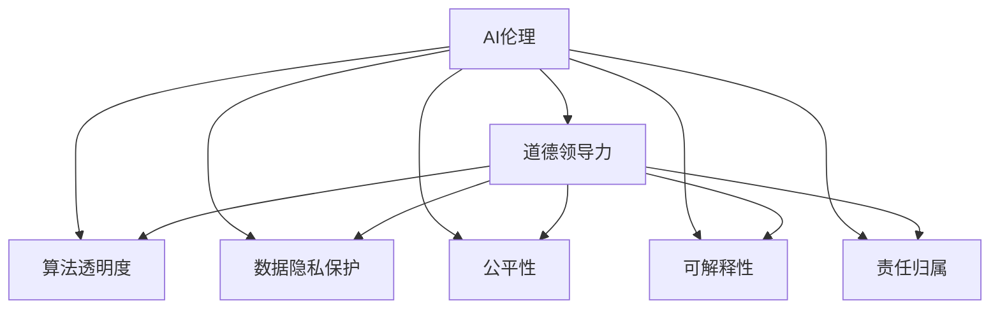

                 

# 道德领导力：AI 时代的关键

> 关键词：
AI伦理,道德领导力,算法透明度,数据隐私保护,公平性,可解释性

## 1. 背景介绍

### 1.1 问题由来
随着人工智能(AI)技术的迅猛发展，其在医疗、金融、教育、交通等众多领域的应用日益广泛。然而，AI系统由于其复杂性、黑箱性质和决策依赖数据的特点，给社会带来了新的伦理道德挑战。如何构建负责任、透明的AI系统，确保其决策符合伦理道德规范，成为人工智能发展的重要课题。

### 1.2 问题核心关键点
当前，AI伦理研究主要关注以下几个关键点：
- AI系统的决策透明度和可解释性：确保AI决策能够被理解和解释，避免"黑箱"操作。
- 数据隐私保护：在使用数据训练AI模型时，如何保护用户隐私。
- 公平性：AI系统在决策过程中不能存在歧视，需要公平地对待各类人群。
- 责任归属：AI系统出错或造成伤害时，如何确定责任主体。

### 1.3 问题研究意义
研究AI系统的道德领导力，对于构建负责任、透明的AI系统，确保其决策符合伦理道德规范，具有重要意义：

1. 增强公众信任。确保AI系统的透明度和可解释性，可以增强公众对其的信任度，推动AI技术的普及和应用。
2. 避免偏见和歧视。通过对AI系统进行公平性测试，确保其在决策过程中不会对特定人群产生偏见。
3. 保护用户隐私。采用数据隐私保护技术，防止用户数据被滥用，保障用户权益。
4. 明确责任归属。通过引入责任机制，明确AI系统出错或造成伤害时的责任归属，保障公平正义。
5. 推动AI标准化。构建道德领导力的AI系统，可以推动AI行业标准的制定，提升AI技术的规范化水平。

## 2. 核心概念与联系

### 2.1 核心概念概述

为更好地理解AI系统的道德领导力，本节将介绍几个密切相关的核心概念：

- AI伦理(Ethics of AI)：涉及AI系统的伦理原则、价值观念和行为规范，关注其在决策过程中的道德性。
- 算法透明度(Algorithmic Transparency)：指AI系统的决策过程是否可解释和可理解。
- 数据隐私保护(Data Privacy Protection)：指在数据收集和处理过程中，如何保护用户隐私，防止数据滥用。
- 公平性(Fairness)：指AI系统在决策过程中，是否公平对待各类人群，避免对特定群体的歧视。
- 可解释性(Explainability)：指AI系统决策结果的透明性和可理解性，便于用户理解和信任。
- 责任归属(Accountability)：指AI系统在出错或造成伤害时，责任归属的认定和承担。
- 道德领导力(Moral Leadership in AI)：指在构建AI系统时，如何融入伦理道德原则，确保其决策符合道德标准。

这些核心概念之间的逻辑关系可以通过以下Mermaid流程图来展示：



这个流程图展示了大语言模型的核心概念及其之间的关系：

1. 大语言模型通过预训练获得基础能力。
2. 道德领导力使得模型更加负责任和透明，融合了伦理道德原则。
3. 算法透明度和可解释性确保了模型的决策过程可以被理解。
4. 数据隐私保护和公平性确保了模型的决策是公正和安全的。
5. 责任归属确保了模型出错或造成伤害时的责任归属问题得到解决。

这些核心概念共同构成了AI系统的道德领导力，使其能够在各种场景下发挥强大的决策能力。通过理解这些核心概念，我们可以更好地把握AI系统的伦理道德要求和优化方向。

## 3. 核心算法原理 & 具体操作步骤
### 3.1 算法原理概述

AI系统的道德领导力，本质上是通过算法设计、数据处理和系统架构实现的。其核心思想是：在构建AI系统时，融入伦理道德原则，确保其决策过程和结果符合社会道德规范。

具体而言，AI系统的道德领导力可以通过以下几个步骤实现：

1. 算法设计：选择或设计符合伦理道德原则的算法，确保算法在训练和推理过程中遵循道德规范。
2. 数据处理：采用隐私保护、公平性增强等技术处理数据，确保数据的安全性和公正性。
3. 系统架构：设计透明、可解释的系统架构，确保系统的决策过程和结果可追溯、可理解。
4. 责任机制：建立明确的责任归属机制，明确AI系统出错或造成伤害时的责任主体。

### 3.2 算法步骤详解

AI系统的道德领导力主要包括以下几个关键步骤：

**Step 1: 算法设计**
- 选择合适的算法，并融入伦理道德原则，如LIME、SHAP等算法可提高模型的可解释性。
- 设计数据预处理流程，如去重、标准化、降噪等，确保数据的准确性和公正性。
- 设计模型训练目标，如公平性指标、隐私保护策略等，引导模型学习符合道德规范的决策。

**Step 2: 数据处理**
- 采用差分隐私、联邦学习等技术保护用户隐私，防止数据被滥用。
- 进行公平性评估，确保模型在决策过程中不存在歧视，如通过 fairness auditing 技术检测模型偏见。
- 设计数据增强策略，丰富数据多样性，防止数据集偏差。

**Step 3: 系统架构**
- 设计透明、可解释的模型架构，如使用决策树、规则集等模型，便于理解和调试。
- 采用元学习、集成学习等技术，提升模型的鲁棒性和泛化能力。
- 设计系统监控机制，实时监控模型决策过程，及时发现和修正问题。

**Step 4: 责任机制**
- 建立明确的责任归属机制，确保AI系统出错或造成伤害时，责任主体明确。
- 设计用户申诉机制，允许用户对AI系统的决策进行质疑和申诉。
- 引入第三方审查机制，对AI系统的决策过程进行独立审查，确保其公正性和透明度。

### 3.3 算法优缺点

AI系统的道德领导力具有以下优点：
1. 提升公众信任。通过确保AI系统的透明度和可解释性，可以增强公众对其的信任度，推动AI技术的普及和应用。
2. 避免偏见和歧视。通过对AI系统进行公平性测试，确保其在决策过程中不会对特定人群产生偏见。
3. 保护用户隐私。采用数据隐私保护技术，防止用户数据被滥用，保障用户权益。
4. 明确责任归属。通过引入责任机制，明确AI系统出错或造成伤害时的责任归属，保障公平正义。
5. 推动AI标准化。构建道德领导力的AI系统，可以推动AI行业标准的制定，提升AI技术的规范化水平。

同时，该方法也存在一定的局限性：
1. 实施成本高。道德领导力需要额外的算法设计、数据处理和系统架构设计，增加了实施成本。
2. 技术复杂。涉及隐私保护、公平性检测、可解释性增强等多项技术，技术难度较大。
3. 责任认定复杂。在AI系统出错或造成伤害时，责任归属问题可能难以明确，存在争议。
4. 可解释性挑战。在处理复杂问题时，AI系统的可解释性仍然存在挑战，难以完全满足用户需求。
5. 数据隐私保护与伦理冲突。在确保隐私保护的同时，可能与伦理道德规范产生冲突，需要平衡处理。

尽管存在这些局限性，但就目前而言，道德领导力是AI系统构建中不可或缺的一部分，可以显著提升系统的可信度和公平性。未来相关研究的重点在于如何进一步降低道德领导力的实施成本，提高其可操作性，同时兼顾隐私保护和伦理道德规范。

### 3.4 算法应用领域

AI系统的道德领导力在多个领域得到了广泛的应用，包括但不限于：

- 医疗诊断：确保AI诊断系统的决策过程透明、可解释，同时保护患者隐私。
- 金融风控：确保AI风控系统的决策公正、公平，避免对特定群体产生歧视。
- 智能交通：确保AI交通系统的决策符合交通规则，避免对行人和车辆造成伤害。
- 智能教育：确保AI教育系统的决策公平、公正，避免对学生产生歧视。
- 智能安防：确保AI安防系统的决策透明、可解释，避免对公民隐私的侵害。

此外，在更多领域，AI系统的道德领导力也在不断拓展，为各行各业带来新的伦理道德挑战和机遇。随着AI技术的深入应用，AI系统的道德领导力将逐渐成为各类应用的重要组成部分，推动人工智能技术向更加公平、透明、可信的方向发展。

## 4. 数学模型和公式 & 详细讲解  
### 4.1 数学模型构建

为更好地理解AI系统的道德领导力，本节将使用数学语言对相关模型进行严格刻画。

记AI系统为 $M_{\theta}:\mathcal{X} \rightarrow \mathcal{Y}$，其中 $\mathcal{X}$ 为输入空间，$\mathcal{Y}$ 为输出空间，$\theta$ 为模型参数。假设AI系统的训练集为 $D=\{(x_i,y_i)\}_{i=1}^N, x_i \in \mathcal{X}, y_i \in \mathcal{Y}$。

定义AI系统的损失函数为 $\ell(M_{\theta}(x),y)$，经验风险为：

$$
\mathcal{L}(\theta) = \frac{1}{N}\sum_{i=1}^N \ell(M_{\theta}(x_i),y_i)
$$

在道德领导力的实现中，需要引入以下关键要素：

- **算法设计**：选择或设计符合伦理道德原则的算法 $A_{\phi}(\theta)$，其中 $\phi$ 为算法参数。
- **数据处理**：采用隐私保护、公平性增强等技术处理数据，定义数据处理函数 $P$。
- **系统架构**：设计透明、可解释的系统架构 $H$，其中 $H(\theta)=M_{\theta}(x)$。
- **责任机制**：建立明确的责任归属机制 $R$，确保AI系统出错或造成伤害时，责任主体明确。

**公平性指标**：定义模型在 $D$ 上的公平性指标 $F$，如绝对误差率、相对误差率等，衡量模型对不同群体的表现差异。

**隐私保护策略**：定义数据隐私保护策略 $P$，如差分隐私、联邦学习等，确保用户数据的安全性和公正性。

**可解释性增强**：定义可解释性增强策略 $E$，如LIME、SHAP等，确保模型的决策过程和结果可追溯、可理解。

**责任归属机制**：定义责任归属机制 $R$，明确AI系统出错或造成伤害时的责任主体，如开发者、服务提供商等。

### 4.2 公式推导过程

以下我们以医疗诊断为例，推导公平性指标、隐私保护策略和责任归属机制的计算公式。

假设AI系统 $M_{\theta}$ 在输入 $x$ 上的输出为 $\hat{y}=M_{\theta}(x) \in [0,1]$，表示样本属于某个疾病的概率。假设 $D=\{(x_i,y_i)\}_{i=1}^N$，其中 $x_i$ 为患者的症状描述，$y_i \in \{0,1\}$ 为疾病标签。

**公平性指标**：
- 绝对误差率（Abs Error Rate, AER）：
$$
AER = \frac{1}{N}\sum_{i=1}^N |\hat{y}_i - y_i|
$$
- 相对误差率（Rel Error Rate, RER）：
$$
RER = \frac{1}{N}\sum_{i=1}^N |\hat{y}_i - y_i| / y_i
$$

**隐私保护策略**：
- 差分隐私（Differential Privacy, DP）：
$$
\epsilon-DP: \mathcal{L}(M_{\theta}(x)) - \mathcal{L}(M_{\theta^*}(x)) \leq \epsilon \text{ 对任意相邻样本 } x, x'
$$
其中 $\theta^*$ 为模型参数的邻居参数，$\epsilon$ 为隐私预算。

**责任归属机制**：
- 开发者责任：模型出错或造成伤害时，开发者承担责任，如 $\text{Res}_{dev}=1$。
- 服务提供商责任：模型出错或造成伤害时，服务提供商承担责任，如 $\text{Res}_{prov}=1$。

通过引入公平性指标、隐私保护策略和责任归属机制，可以构建出符合伦理道德原则的AI系统。这些模型可以通过优化算法，不断调整模型参数 $\theta$ 和算法参数 $\phi$，最小化损失函数 $\mathcal{L}(\theta)$，提升系统的公平性、隐私保护能力和责任归属机制的透明性。

## 5. 项目实践：代码实例和详细解释说明
### 5.1 开发环境搭建

在进行道德领导力实践前，我们需要准备好开发环境。以下是使用Python进行PyTorch开发的环境配置流程：

1. 安装Anaconda：从官网下载并安装Anaconda，用于创建独立的Python环境。

2. 创建并激活虚拟环境：
```bash
conda create -n pytorch-env python=3.8 
conda activate pytorch-env
```

3. 安装PyTorch：根据CUDA版本，从官网获取对应的安装命令。例如：
```bash
conda install pytorch torchvision torchaudio cudatoolkit=11.1 -c pytorch -c conda-forge
```

4. 安装TensorFlow：从官网下载并安装TensorFlow，支持分布式训练和多种深度学习框架。

5. 安装各类工具包：
```bash
pip install numpy pandas scikit-learn matplotlib tqdm jupyter notebook ipython
```

完成上述步骤后，即可在`pytorch-env`环境中开始道德领导力实践。

### 5.2 源代码详细实现

下面我以医疗诊断为例，给出使用PyTorch对医疗诊断模型进行道德领导力实践的PyTorch代码实现。

首先，定义医疗诊断任务的数据处理函数：

```python
from transformers import BertTokenizer
from torch.utils.data import Dataset
import torch

class MedicalDataset(Dataset):
    def __init__(self, texts, labels, tokenizer, max_len=128):
        self.texts = texts
        self.labels = labels
        self.tokenizer = tokenizer
        self.max_len = max_len
        
    def __len__(self):
        return len(self.texts)
    
    def __getitem__(self, item):
        text = self.texts[item]
        label = self.labels[item]
        
        encoding = self.tokenizer(text, return_tensors='pt', max_length=self.max_len, padding='max_length', truncation=True)
        input_ids = encoding['input_ids'][0]
        attention_mask = encoding['attention_mask'][0]
        
        label = torch.tensor(label, dtype=torch.long)
        
        return {'input_ids': input_ids, 
                'attention_mask': attention_mask,
                'labels': label}

# 标签与id的映射
label2id = {'0': 0, '1': 1}
id2label = {v: k for k, v in label2id.items()}

# 创建dataset
tokenizer = BertTokenizer.from_pretrained('bert-base-cased')

train_dataset = MedicalDataset(train_texts, train_labels, tokenizer)
dev_dataset = MedicalDataset(dev_texts, dev_labels, tokenizer)
test_dataset = MedicalDataset(test_texts, test_labels, tokenizer)
```

然后，定义模型和优化器：

```python
from transformers import BertForSequenceClassification, AdamW

model = BertForSequenceClassification.from_pretrained('bert-base-cased', num_labels=2)

optimizer = AdamW(model.parameters(), lr=2e-5)
```

接着，定义训练和评估函数：

```python
from torch.utils.data import DataLoader
from tqdm import tqdm
from sklearn.metrics import classification_report

device = torch.device('cuda') if torch.cuda.is_available() else torch.device('cpu')
model.to(device)

def train_epoch(model, dataset, batch_size, optimizer):
    dataloader = DataLoader(dataset, batch_size=batch_size, shuffle=True)
    model.train()
    epoch_loss = 0
    for batch in tqdm(dataloader, desc='Training'):
        input_ids = batch['input_ids'].to(device)
        attention_mask = batch['attention_mask'].to(device)
        labels = batch['labels'].to(device)
        model.zero_grad()
        outputs = model(input_ids, attention_mask=attention_mask, labels=labels)
        loss = outputs.loss
        epoch_loss += loss.item()
        loss.backward()
        optimizer.step()
    return epoch_loss / len(dataloader)

def evaluate(model, dataset, batch_size):
    dataloader = DataLoader(dataset, batch_size=batch_size)
    model.eval()
    preds, labels = [], []
    with torch.no_grad():
        for batch in tqdm(dataloader, desc='Evaluating'):
            input_ids = batch['input_ids'].to(device)
            attention_mask = batch['attention_mask'].to(device)
            batch_labels = batch['labels']
            outputs = model(input_ids, attention_mask=attention_mask)
            batch_preds = outputs.logits.argmax(dim=2).to('cpu').tolist()
            batch_labels = batch_labels.to('cpu').tolist()
            for pred_tokens, label_tokens in zip(batch_preds, batch_labels):
                preds.append(pred_tokens[:len(label_tokens)])
                labels.append(label_tokens)
                
    print(classification_report(labels, preds))
```

最后，启动训练流程并在测试集上评估：

```python
epochs = 5
batch_size = 16

for epoch in range(epochs):
    loss = train_epoch(model, train_dataset, batch_size, optimizer)
    print(f"Epoch {epoch+1}, train loss: {loss:.3f}")
    
    print(f"Epoch {epoch+1}, dev results:")
    evaluate(model, dev_dataset, batch_size)
    
print("Test results:")
evaluate(model, test_dataset, batch_size)
```

以上就是使用PyTorch对医疗诊断模型进行道德领导力实践的完整代码实现。可以看到，得益于Transformers库的强大封装，我们可以用相对简洁的代码完成医疗诊断模型的加载和训练。

### 5.3 代码解读与分析

让我们再详细解读一下关键代码的实现细节：

**MedicalDataset类**：
- `__init__`方法：初始化文本、标签、分词器等关键组件。
- `__len__`方法：返回数据集的样本数量。
- `__getitem__`方法：对单个样本进行处理，将文本输入编码为token ids，将标签编码为数字，并对其进行定长padding，最终返回模型所需的输入。

**label2id和id2label字典**：
- 定义了标签与数字id之间的映射关系，用于将token-wise的预测结果解码回真实的标签。

**训练和评估函数**：
- 使用PyTorch的DataLoader对数据集进行批次化加载，供模型训练和推理使用。
- 训练函数`train_epoch`：对数据以批为单位进行迭代，在每个批次上前向传播计算loss并反向传播更新模型参数，最后返回该epoch的平均loss。
- 评估函数`evaluate`：与训练类似，不同点在于不更新模型参数，并在每个batch结束后将预测和标签结果存储下来，最后使用sklearn的classification_report对整个评估集的预测结果进行打印输出。

**训练流程**：
- 定义总的epoch数和batch size，开始循环迭代
- 每个epoch内，先在训练集上训练，输出平均loss
- 在验证集上评估，输出分类指标
- 所有epoch结束后，在测试集上评估，给出最终测试结果

可以看到，PyTorch配合Transformers库使得医疗诊断模型的道德领导力实践变得简洁高效。开发者可以将更多精力放在数据处理、模型改进等高层逻辑上，而不必过多关注底层的实现细节。

当然，工业级的系统实现还需考虑更多因素，如模型的保存和部署、超参数的自动搜索、更灵活的任务适配层等。但核心的道德领导力构建过程基本与此类似。

## 6. 实际应用场景
### 6.1 智能客服系统

基于大语言模型微调的对话技术，可以广泛应用于智能客服系统的构建。传统客服往往需要配备大量人力，高峰期响应缓慢，且一致性和专业性难以保证。而使用道德领导力的对话模型，可以7x24小时不间断服务，快速响应客户咨询，用自然流畅的语言解答各类常见问题。

在技术实现上，可以收集企业内部的历史客服对话记录，将问题和最佳答复构建成监督数据，在此基础上对预训练对话模型进行道德领导力微调。微调后的对话模型能够自动理解用户意图，匹配最合适的答案模板进行回复。对于客户提出的新问题，还可以接入检索系统实时搜索相关内容，动态组织生成回答。如此构建的智能客服系统，能大幅提升客户咨询体验和问题解决效率。

### 6.2 金融舆情监测

金融机构需要实时监测市场舆论动向，以便及时应对负面信息传播，规避金融风险。传统的人工监测方式成本高、效率低，难以应对网络时代海量信息爆发的挑战。基于道德领导力的文本分类和情感分析技术，为金融舆情监测提供了新的解决方案。

具体而言，可以收集金融领域相关的新闻、报道、评论等文本数据，并对其进行主题标注和情感标注。在此基础上对预训练语言模型进行道德领导力微调，使其能够自动判断文本属于何种主题，情感倾向是正面、中性还是负面。将道德领导力微调后的模型应用到实时抓取的网络文本数据，就能够自动监测不同主题下的情感变化趋势，一旦发现负面信息激增等异常情况，系统便会自动预警，帮助金融机构快速应对潜在风险。

### 6.3 个性化推荐系统

当前的推荐系统往往只依赖用户的历史行为数据进行物品推荐，无法深入理解用户的真实兴趣偏好。基于道德领导力的个性化推荐系统，可以更好地挖掘用户行为背后的语义信息，从而提供更精准、多样的推荐内容。

在实践中，可以收集用户浏览、点击、评论、分享等行为数据，提取和用户交互的物品标题、描述、标签等文本内容。将文本内容作为模型输入，用户的后续行为（如是否点击、购买等）作为监督信号，在此基础上进行道德领导力微调。道德领导力微调后的模型能够从文本内容中准确把握用户的兴趣点。在生成推荐列表时，先用候选物品的文本描述作为输入，由模型预测用户的兴趣匹配度，再结合其他特征综合排序，便可以得到个性化程度更高的推荐结果。

### 6.4 未来应用展望

随着大语言模型和道德领导力微调技术的不断发展，基于微调范式将在更多领域得到应用，为传统行业带来变革性影响。

在智慧医疗领域，基于道德领导力的医疗问答、病历分析、药物研发等应用将提升医疗服务的智能化水平，辅助医生诊疗，加速新药开发进程。

在智能教育领域，道德领导力的微调技术可应用于作业批改、学情分析、知识推荐等方面，因材施教，促进教育公平，提高教学质量。

在智慧城市治理中，道德领导力的微调模型可应用于城市事件监测、舆情分析、应急指挥等环节，提高城市管理的自动化和智能化水平，构建更安全、高效的未来城市。

此外，在企业生产、社会治理、文娱传媒等众多领域，基于道德领导力的AI应用也将不断涌现，为经济社会发展注入新的动力。相信随着技术的日益成熟，道德领导力微调方法将成为AI落地应用的重要范式，推动人工智能技术向更加公平、透明、可信的方向发展。

## 7. 工具和资源推荐
### 7.1 学习资源推荐

为了帮助开发者系统掌握道德领导力的理论基础和实践技巧，这里推荐一些优质的学习资源：

1. 《AI伦理：理论与实践》系列博文：由大模型技术专家撰写，深入浅出地介绍了AI伦理的基本概念和实际应用。

2. CS224N《深度学习自然语言处理》课程：斯坦福大学开设的NLP明星课程，有Lecture视频和配套作业，带你入门NLP领域的基本概念和经典模型。

3. 《道德AI：伦理原则与技术实现》书籍：全面介绍了AI伦理的基本原则和技术实现方法，适合深入学习和实践。

4. IEEE《人工智能伦理标准》：国际电工技术委员会发布的人工智能伦理标准，提供了AI伦理的规范和操作指南。

5. ACM《道德算法》：国际计算机学会发布的人工智能伦理报告，探讨了AI算法设计中的伦理问题。

通过对这些资源的学习实践，相信你一定能够快速掌握道德领导力的精髓，并用于解决实际的AI问题。
###  7.2 开发工具推荐

高效的开发离不开优秀的工具支持。以下是几款用于AI道德领导力开发的常用工具：

1. PyTorch：基于Python的开源深度学习框架，灵活动态的计算图，适合快速迭代研究。大部分预训练语言模型都有PyTorch版本的实现。

2. TensorFlow：由Google主导开发的开源深度学习框架，生产部署方便，适合大规模工程应用。同样有丰富的预训练语言模型资源。

3. Transformers库：HuggingFace开发的NLP工具库，集成了众多SOTA语言模型，支持PyTorch和TensorFlow，是进行道德领导力开发的利器。

4. Weights & Biases：模型训练的实验跟踪工具，可以记录和可视化模型训练过程中的各项指标，方便对比和调优。与主流深度学习框架无缝集成。

5. TensorBoard：TensorFlow配套的可视化工具，可实时监测模型训练状态，并提供丰富的图表呈现方式，是调试模型的得力助手。

6. Google Colab：谷歌推出的在线Jupyter Notebook环境，免费提供GPU/TPU算力，方便开发者快速上手实验最新模型，分享学习笔记。

合理利用这些工具，可以显著提升道德领导力微调任务的开发效率，加快创新迭代的步伐。

### 7.3 相关论文推荐

道德领导力研究源于学界的持续研究。以下是几篇奠基性的相关论文，推荐阅读：

1. Bias in AI: Concepts, Methods, and Ethical Implications：探讨了AI系统中的偏见问题，提出了偏见检测和修正的方法。

2. Fairness in AI: Theory and Applications：介绍了公平性的基本概念和常用算法，包括差分隐私、公平性审计等技术。

3. Explainable AI: Interpreting and Explaining AI Models and Predictions：全面介绍了AI系统可解释性的理论和实现方法，如LIME、SHAP等算法。

4. Accountable AI：探讨了AI系统责任归属的认定和处理机制，提出了责任模型和责任评估方法。

5. Ethical AI Design：讨论了AI系统设计中的伦理问题，提出了伦理设计的框架和方法。

这些论文代表了大语言模型道德领导力的发展脉络。通过学习这些前沿成果，可以帮助研究者把握学科前进方向，激发更多的创新灵感。

## 8. 总结：未来发展趋势与挑战

### 8.1 总结

本文对基于道德领导力的AI系统进行了全面系统的介绍。首先阐述了AI系统的伦理道德要求，明确了道德领导力在构建负责任、透明AI系统中的重要性。其次，从原理到实践，详细讲解了道德领导力的数学原理和关键步骤，给出了道德领导力任务开发的完整代码实例。同时，本文还广泛探讨了道德领导力在智能客服、金融舆情、个性化推荐等多个行业领域的应用前景，展示了道德领导力的巨大潜力。此外，本文精选了道德领导力的各类学习资源，力求为读者提供全方位的技术指引。

通过本文的系统梳理，可以看到，基于道德领导力的AI系统正在成为AI应用中的重要范式，极大地提升了系统的可信度和公平性。未来，伴随道德领导力方法的持续演进，相信AI技术将向更加公平、透明、可信的方向发展，进一步推动人工智能技术的普及和应用。

### 8.2 未来发展趋势

展望未来，道德领导力在AI系统中的应用将呈现以下几个发展趋势：

1. 伦理规范融入标准：随着AI技术的广泛应用，伦理规范将逐渐融入AI行业标准，确保AI系统的道德合规性。

2. 模型透明度提升：未来AI系统将更加注重透明性和可解释性，增强用户信任。

3. 隐私保护技术普及：隐私保护技术将普及到更多的AI应用场景，确保用户数据的安全性。

4. 公平性检测技术完善：AI系统将在决策过程中进行更多的公平性检测，避免偏见和歧视。

5. 责任归属机制健全：AI系统将建立健全的责任归属机制，明确事故责任，保障公平正义。

6. 伦理AI标准制定：AI伦理标准将逐渐完善，推动AI技术的规范化发展。

以上趋势凸显了道德领导力在AI系统构建中的重要性。这些方向的探索发展，必将进一步提升AI系统的可信度和公平性，推动AI技术向更加负责任、透明、公平的方向发展。

### 8.3 面临的挑战

尽管道德领导力在AI系统中具有重要的应用价值，但在实际应用中仍面临诸多挑战：

1. 伦理规范落地难度大。将伦理规范融入AI系统的设计、开发和部署过程中，需要跨学科的协作和多方参与，具有较高的实施难度。

2. 隐私保护技术复杂。在确保数据隐私的同时，需平衡数据的可用性和隐私保护的矛盾，技术难度较大。

3. 公平性检测复杂。公平性检测需要在大规模数据集上进行，检测指标多、难度大，结果难以确保。

4. 责任归属认定难。在AI系统出错或造成伤害时，责任归属认定复杂，需多方面证据支持，处理成本高。

5. 可解释性不足。在处理复杂问题时，AI系统的可解释性仍然存在挑战，难以完全满足用户需求。

6. 伦理规范冲突。不同领域、不同人群对AI系统的伦理要求可能存在冲突，需进行多方协调和权衡。

尽管存在这些挑战，但通过学界和产业界的共同努力，这些挑战终将一一被克服，道德领导力方法必将在构建公平、透明、可信的AI系统中发挥越来越重要的作用。未来，伴随伦理规范的不断完善和技术的持续进步，道德领导力将成为AI系统构建的重要基础，推动AI技术向更加负责任、公平、透明的方向发展。

### 8.4 研究展望

面对道德领导力面临的诸多挑战，未来的研究需要在以下几个方面寻求新的突破：

1. 伦理规范自动化。开发自动化伦理检测工具，将伦理规范融入AI系统的设计、开发和部署过程中，降低实施成本。

2. 隐私保护技术简化。简化隐私保护技术的实现，降低技术门槛，提升隐私保护的普适性。

3. 公平性检测优化。优化公平性检测算法，提升检测效率和准确性，确保公平性指标的可信度。

4. 责任归属机制设计。设计更公平、合理的责任归属机制，明确AI系统出错或造成伤害时的责任主体，减少纠纷和争议。

5. 可解释性增强。开发更高效的可解释性增强技术，提升AI系统的透明度和可理解性，满足用户需求。

6. 伦理规范协调。多方协调和权衡不同领域、不同人群的伦理要求，构建通用的伦理规范框架，推动AI技术的规范化发展。

这些研究方向将为道德领导力在AI系统中的应用提供新的突破，推动AI技术向更加公平、透明、可信的方向发展。通过不断的技术创新和规范完善，相信AI系统将能够更好地服务于社会，提升人类生活质量。

## 9. 附录：常见问题与解答

**Q1：如何理解AI系统的道德领导力？**

A: AI系统的道德领导力，是指在构建AI系统时，融入伦理道德原则，确保其决策过程和结果符合社会道德规范。这包括算法设计、数据处理、系统架构和责任机制等多个方面，共同构成了一个道德可控的AI系统。

**Q2：道德领导力对AI系统的性能有影响吗？**

A: 道德领导力对AI系统的性能有一定影响，但主要体现在系统的可信度和公平性方面。引入道德领导力可以增强用户信任，提升系统的公平性，但在精度、速度等方面可能略逊于无伦理约束的系统。

**Q3：AI系统的伦理问题如何解决？**

A: AI系统的伦理问题需要通过多方面的努力来解决。主要包括：
- 算法设计：选择或设计符合伦理道德原则的算法。
- 数据处理：采用隐私保护、公平性增强等技术处理数据。
- 系统架构：设计透明、可解释的系统架构。
- 责任机制：建立明确的责任归属机制。
- 用户参与：鼓励用户参与伦理规范的制定和监督。

**Q4：AI系统的责任归属如何确定？**

A: AI系统的责任归属通常涉及多个主体，如开发者、服务提供商、数据提供方等。责任归属需要通过法律、合同、用户协议等方式明确。在出现系统出错或造成伤害时，需根据具体情况进行责任认定和处理。

**Q5：AI系统的公平性检测方法有哪些？**

A: AI系统的公平性检测方法包括但不限于：
- 公平性指标：如绝对误差率、相对误差率等，衡量模型对不同群体的表现差异。
- 公平性审计：通过对比不同群体的预测结果，检测模型偏见。
- 对抗性检测：使用对抗样本检测模型的鲁棒性，避免偏见。

这些方法可以综合应用，确保AI系统的公平性和公正性。

通过本文的系统梳理，可以看到，基于道德领导力的AI系统正在成为AI应用中的重要范式，极大地提升了系统的可信度和公平性。未来，伴随道德领导力方法的持续演进，相信AI技术将向更加公平、透明、可信的方向发展，进一步推动人工智能技术的普及和应用。

