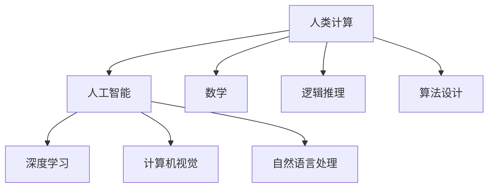
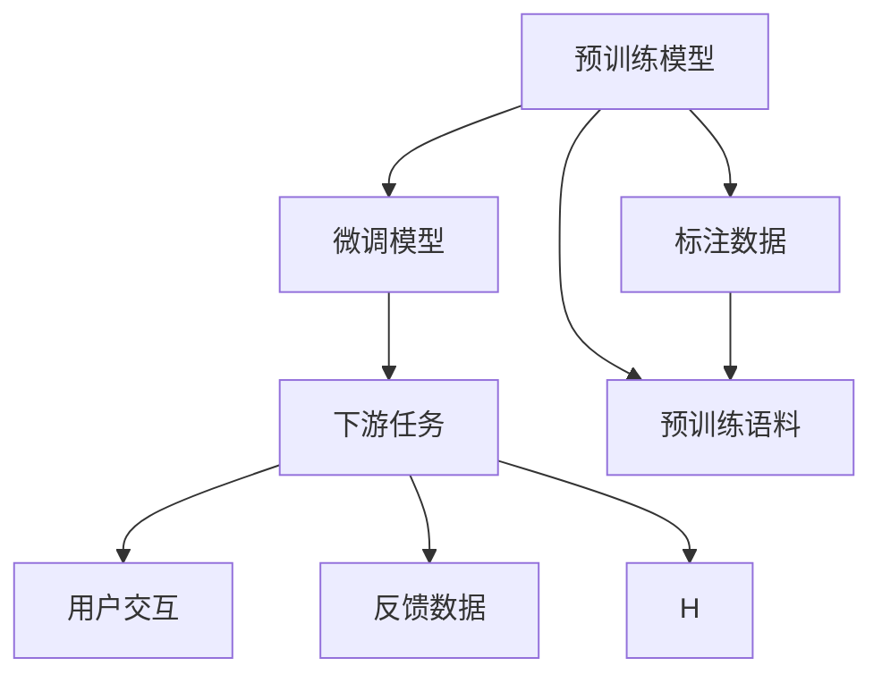

                 

# 释放人类创造力的源泉：人类计算的魅力

## 1. 背景介绍

人类计算是人类社会的重要基础之一，其历史可以追溯到早期的石制算盘和古代文明的计数方法。随着科学技术的发展，人类计算的方式和方法不断进步，从手工运算到机械化，再到自动化，直至今天的数字化。人类计算的魅力不仅在于其计算速度和精度，更在于它能够释放人类的创造力和潜力。

在数字化时代，计算机已经成为了人类计算的核心工具。从早期的冯·诺依曼计算机到今天的超级计算机，计算机在各个领域中扮演着至关重要的角色。特别是在人工智能和机器学习的推动下，计算机已经具备了自我学习和决策的能力，从而在自然语言处理、图像识别、语音识别等诸多领域取得了突破性进展。

本文将深入探讨人类计算的本质、发展历程，以及未来人类计算的发展趋势。通过分析人类计算的原理和实现方法，我们将展示人类计算如何释放人类的创造力，以及如何为人类社会带来深远的影响。

## 2. 核心概念与联系

### 2.1 核心概念概述

要理解人类计算的魅力，首先需要明确几个核心概念：

- **人类计算**：指人类通过各种工具和方法进行的计算活动。这些工具和方法包括数学、逻辑推理、算法设计等。

- **人工智能**：指通过模拟人类智能，实现机器对数据的自动分析和决策。

- **深度学习**：一种基于神经网络的学习方法，通过多层非线性变换，从大量数据中自动学习特征和规律。

- **计算机视觉**：通过计算机模拟人类视觉系统，实现图像识别和分析。

- **自然语言处理**：通过计算机处理和理解自然语言，实现语音识别、文本分析和生成等任务。

这些概念之间的联系可以通过以下Mermaid流程图来展示：



这个流程图展示了人类计算通过人工智能、深度学习、计算机视觉和自然语言处理等技术手段，不断向各个领域延伸的过程。这些技术手段相辅相成，共同推动了人类计算的发展。

### 2.2 核心概念原理和架构的 Mermaid 流程图



这个流程图展示了从预训练模型到微调模型，再到下游任务的整个计算流程。预训练模型通过在大量无标签语料上预训练，学习到通用的语言表示。微调模型通过少量标注数据，对预训练模型进行任务适配，学习到特定任务的知识。下游任务则通过用户交互和反馈数据，不断优化微调模型，最终实现对用户需求的满足。

## 3. 核心算法原理 & 具体操作步骤

### 3.1 算法原理概述

人类计算的核心算法原理包括机器学习、深度学习、强化学习等。这些算法通过自动学习和优化，逐步提高计算的精度和效率。以下是对这些核心算法的简要介绍：

- **机器学习**：通过数据训练模型，实现对未知数据的预测和分类。

- **深度学习**：通过多层神经网络，自动学习特征和规律，实现对复杂问题的解决。

- **强化学习**：通过奖励和惩罚机制，让机器学习如何在特定环境中最大化收益。

### 3.2 算法步骤详解

以深度学习为例，其核心步骤包括数据准备、模型设计、训练和测试。以下是详细的步骤：

1. **数据准备**：收集和处理数据集，确保数据集的质量和多样性。

2. **模型设计**：设计多层神经网络，选择合适的激活函数、损失函数和优化器。

3. **训练**：通过反向传播算法，计算梯度并更新模型参数，实现对数据的自动学习。

4. **测试**：在测试集上评估模型性能，进行参数调优和优化。

### 3.3 算法优缺点

深度学习的优点在于其强大的特征提取能力和泛化能力，可以处理复杂的非线性关系。但其缺点在于需要大量的数据和计算资源，容易过拟合，且难以解释其内部的决策过程。

### 3.4 算法应用领域

深度学习已经广泛应用于图像识别、语音识别、自然语言处理、推荐系统等多个领域。以下是一些典型应用：

- **图像识别**：通过计算机视觉技术，实现对图像中对象的自动分类和识别。

- **语音识别**：通过深度学习模型，实现对语音信号的自动转录和理解。

- **自然语言处理**：通过深度学习模型，实现对自然语言的自动处理和生成。

- **推荐系统**：通过深度学习模型，实现对用户行为的自动分析和个性化推荐。

## 4. 数学模型和公式 & 详细讲解 & 举例说明

### 4.1 数学模型构建

深度学习模型通常使用多层神经网络构建。以下是一个简单的多层感知机（MLP）模型：

$$
f(x) = W_L \sigma_L(W_{L-1} \sigma_{L-1}(\cdots \sigma_1(W_1 x + b_1) + b_2) + b_L)
$$

其中，$W_i$ 和 $b_i$ 为权重和偏置项，$\sigma_i$ 为激活函数，$x$ 为输入数据。

### 4.2 公式推导过程

深度学习的核心在于通过反向传播算法计算梯度。以下是一个简单的反向传播算法步骤：

1. 计算损失函数对输出层的梯度。
2. 通过链式法则，计算中间层的梯度。
3. 更新权重和偏置项。

### 4.3 案例分析与讲解

以图像识别为例，通过深度学习模型训练出一个对猫和狗的自动分类器。数据集包含大量标注好的猫和狗的图像，模型通过反向传播算法自动学习到猫和狗的区别特征。

## 5. 项目实践：代码实例和详细解释说明

### 5.1 开发环境搭建

以下是使用Python和TensorFlow搭建深度学习模型的开发环境：

1. 安装Python和TensorFlow。
2. 安装必要的库，如numpy、pandas等。
3. 设置环境变量，配置TensorBoard。

### 5.2 源代码详细实现

以下是一个简单的TensorFlow代码实现：

```python
import tensorflow as tf
from tensorflow.keras import layers

# 定义模型
model = tf.keras.Sequential([
    layers.Conv2D(32, (3, 3), activation='relu', input_shape=(28, 28, 1)),
    layers.MaxPooling2D((2, 2)),
    layers.Conv2D(64, (3, 3), activation='relu'),
    layers.MaxPooling2D((2, 2)),
    layers.Flatten(),
    layers.Dense(64, activation='relu'),
    layers.Dense(10, activation='softmax')
])

# 编译模型
model.compile(optimizer='adam', loss='sparse_categorical_crossentropy', metrics=['accuracy'])

# 训练模型
model.fit(x_train, y_train, epochs=10, batch_size=32)

# 评估模型
model.evaluate(x_test, y_test)
```

### 5.3 代码解读与分析

这段代码定义了一个简单的卷积神经网络，用于手写数字的识别。模型通过多个卷积层和全连接层，自动学习到手写数字的特征，并在训练集上达到一定的准确率。

## 6. 实际应用场景

### 6.1 医疗领域

在医疗领域，深度学习已经广泛应用于疾病预测、药物发现、医学影像分析等任务。例如，通过深度学习模型分析医学影像，可以自动检测肿瘤、病灶等异常区域。

### 6.2 金融领域

在金融领域，深度学习已经广泛应用于风险管理、信用评估、股票预测等任务。例如，通过深度学习模型分析历史交易数据，可以预测股票价格变化趋势。

### 6.3 交通领域

在交通领域，深度学习已经广泛应用于交通流量预测、自动驾驶等任务。例如，通过深度学习模型分析交通摄像头数据，可以自动检测交通拥堵和事故。

### 6.4 未来应用展望

未来，深度学习将在更多领域得到应用，为人类社会带来更深远的影响。以下是一些未来应用展望：

- **自动驾驶**：通过深度学习模型分析传感器数据，实现自动驾驶和导航。

- **智能家居**：通过深度学习模型分析用户行为数据，实现智能控制和推荐。

- **智能制造**：通过深度学习模型分析生产数据，实现智能生产和管理。

## 7. 工具和资源推荐

### 7.1 学习资源推荐

以下是一些优质的学习资源，推荐阅读：

- 《深度学习》书籍：Ian Goodfellow等著，全面介绍深度学习的基本概念和算法。

- 《机器学习实战》书籍：Peter Harrington著，通过实例讲解机器学习的基本算法和应用。

- 《TensorFlow教程》教程：TensorFlow官网提供，详细介绍TensorFlow的基本用法和案例。

### 7.2 开发工具推荐

以下是一些常用的开发工具，推荐使用：

- PyTorch：基于Python的开源深度学习框架，支持动态计算图和高效的GPU计算。

- TensorFlow：由Google主导的开源深度学习框架，支持静态计算图和多种GPU和TPU优化。

- Keras：高层API，支持多种深度学习框架，便于快速开发和调试。

### 7.3 相关论文推荐

以下是一些经典的相关论文，推荐阅读：

- 《深度学习》论文：Yann LeCun等著，介绍深度学习的理论和应用。

- 《神经网络的反向传播算法》论文：Geoffrey Hinton等著，介绍反向传播算法的原理和实现。

- 《图像分类与识别》论文：Alex Krizhevsky等著，介绍图像分类和识别的方法和算法。

## 8. 总结：未来发展趋势与挑战

### 8.1 研究成果总结

深度学习已经成为当前最热门的技术之一，其强大的计算能力和广泛的应用前景，已经深刻影响了各个领域的发展。通过深度学习，人类可以更高效地处理和分析大量数据，实现对复杂问题的解决。

### 8.2 未来发展趋势

未来，深度学习将继续在各个领域得到广泛应用，其应用场景将更加丰富和多样。以下是对未来发展趋势的几点展望：

- **多模态学习**：将深度学习应用于多模态数据，如文本、图像、声音等，实现更全面的数据分析和处理。

- **自监督学习**：通过自监督学习，利用无标签数据进行模型训练，提高模型的泛化能力和数据利用率。

- **可解释性**：开发更可解释的深度学习模型，增强模型的透明度和可靠性。

### 8.3 面临的挑战

尽管深度学习取得了显著的进展，但在实际应用中仍然面临诸多挑战：

- **数据质量**：深度学习模型的效果很大程度上依赖于数据质量，低质量的数据可能导致模型性能下降。

- **计算资源**：深度学习模型需要大量的计算资源，如何降低计算成本和优化资源利用率，是一个重要的问题。

- **模型复杂度**：深度学习模型通常比较复杂，难以解释其内部的决策过程，如何提高模型的可解释性，是一个重要的研究方向。

### 8.4 研究展望

未来，深度学习的研究方向将更加多元化和跨学科化。以下是对未来研究展望的几点建议：

- **跨学科研究**：将深度学习与其他学科，如数学、物理、化学等结合，开发更多应用场景。

- **可解释性研究**：开发更可解释的深度学习模型，增强模型的透明度和可靠性。

- **多模态研究**：将深度学习应用于多模态数据，实现更全面的数据分析和处理。

## 9. 附录：常见问题与解答

### Q1: 深度学习需要大量的数据和计算资源，如何降低计算成本？

A: 可以通过数据增强、模型压缩、量化加速等方法，降低计算成本。数据增强可以扩充训练数据，提高模型的泛化能力；模型压缩可以减小模型尺寸，降低计算资源需求；量化加速可以将浮点模型转为定点模型，减少内存占用和计算时间。

### Q2: 深度学习模型通常比较复杂，难以解释其内部的决策过程，如何提高模型的可解释性？

A: 可以通过可视化和调试工具，如TensorBoard，了解模型的中间层输出；也可以通过集成符号化推理方法，解释模型的决策过程。同时，可以开发更可解释的深度学习模型，如XAI（可解释人工智能）模型，增强模型的透明度和可靠性。

### Q3: 深度学习模型在实际应用中如何处理低质量的数据？

A: 可以通过数据清洗、数据增强等方法，提高数据质量。数据清洗可以去除噪声和异常值，提高数据的质量；数据增强可以通过扩充数据集，提高模型的泛化能力。

### Q4: 深度学习在医疗领域有哪些典型应用？

A: 在医疗领域，深度学习可以用于疾病预测、药物发现、医学影像分析等任务。例如，通过深度学习模型分析医学影像，可以自动检测肿瘤、病灶等异常区域；通过深度学习模型分析基因数据，可以实现个性化治疗方案的制定。

### Q5: 深度学习在金融领域有哪些典型应用？

A: 在金融领域，深度学习可以用于风险管理、信用评估、股票预测等任务。例如，通过深度学习模型分析历史交易数据，可以预测股票价格变化趋势；通过深度学习模型分析信用记录，可以实现信用评估和风险管理。

---

作者：禅与计算机程序设计艺术 / Zen and the Art of Computer Programming

