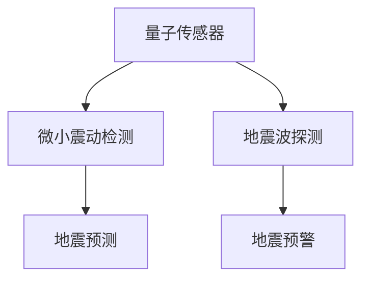

                 

# 量子传感器在地震预测中的应用：微小震动检测

> 关键词：量子传感器,地震预测,微小震动检测,量子精密测量,磁力计,地震波探测

## 1. 背景介绍

### 1.1 问题由来
地震作为一种严重的自然灾害，对人类社会构成了巨大威胁。其破坏力主要来自于突发性的强烈震动和随之而来的次生灾害。传统的地震监测方法主要依赖于地面的地震波探测，但这种被动式监测手段在地震发生前很难提供有效的预警信息。近年来，随着量子技术的发展，研究人员探索了一种基于量子传感器的地震预测新方法，有望在地震预警领域取得重大突破。

### 1.2 问题核心关键点
量子传感器具有极高的灵敏度和分辨率，可以检测到极其微小的震动变化。利用量子传感器的微小震动检测能力，可以在地震发生前捕捉到地壳的微小变形和应力变化，为地震预警提供宝贵的先期信息。本文章将深入探讨量子传感器在地震预测中的应用，详细阐述微小震动检测的原理和操作步骤。

### 1.3 问题研究意义
量子传感器的微小震动检测技术在地震预警中的应用，将极大地提升地震预测的准确性和及时性。该技术不仅可以提前预警地震的发生，还可以提供更精确的地震位置和震级信息，为防灾减灾工作提供重要支持。此外，量子传感器的应用将推动地震科学和量子精密测量技术的发展，具有重要的理论和应用价值。

## 2. 核心概念与联系

### 2.1 核心概念概述

为更好地理解量子传感器在地震预测中的应用，本节将介绍几个关键概念：

- 量子传感器（Quantum Sensor）：利用量子力学原理进行精密测量的传感器。基于量子态的变化对微小物理量的测量，具有极高的灵敏度和分辨率。
- 微小震动检测（Micro-vibration Detection）：利用量子传感器的微小震动检测能力，捕捉地壳的微小变形和应力变化，从而预测地震的发生。
- 地震波探测（Seismic Wave Detection）：传统的地震监测方法，通过地面的地震波探测地震发生位置和震级。
- 量子精密测量（Quantum Precision Measurement）：利用量子力学原理进行高精度测量的技术，主要应用于磁力计、加速度计等传感器。
- 磁力计（Magnetometer）：利用磁敏材料测量磁场变化，常用于地球磁场的探测。
- 地震波（Seismic Wave）：由地震引起通过地球介质传播的波动，分为P波、S波等不同类型。

这些概念之间的逻辑关系可以通过以下Mermaid流程图来展示：



这个流程图展示了大语言模型的核心概念及其之间的关系：

1. 量子传感器通过微小震动检测获取地壳变形和应力变化信息。
2. 利用这些信息预测地震的发生。
3. 传统的地震波探测方法也可以通过地面的震动信息获得地震的位置和震级。
4. 两者的结合可以提供更加全面和及时的地震预警信息。

## 3. 核心算法原理 & 具体操作步骤
### 3.1 算法原理概述

量子传感器在地震预测中的应用，主要基于其微小震动检测的原理。量子传感器的核心部件是敏感于微小磁场的磁力计，通过对地磁场变化的测量，间接得到地壳的微小震动信息。其具体原理包括以下几个步骤：

1. 利用量子力学原理，磁力计可以测量地球磁场微小的变化。
2. 地壳的微小变形和应力变化会导致地磁场产生微小变化。
3. 量子传感器将这些微小变化转换为电信号，进行高精度的测量。
4. 通过信号处理和数据分析，提取地壳的微小震动特征。
5. 利用机器学习等算法，预测地震的发生。

### 3.2 算法步骤详解

量子传感器的微小震动检测通常包括以下几个关键步骤：

**Step 1: 选择合适的量子传感器**
- 根据地震预测的需求，选择合适的量子传感器类型。如磁力计、加速度计等。
- 确认传感器的灵敏度和分辨率能否满足地震微小震动检测的需求。

**Step 2: 部署传感器**
- 将量子传感器放置在预定的监测地点，如地震活动频繁的地区。
- 确保传感器的稳定性和可靠性，避免外界干扰。

**Step 3: 数据采集与存储**
- 使用量子传感器采集地磁场或地面震动的变化数据。
- 将数据以高精度的格式存储，便于后续分析和处理。

**Step 4: 信号处理与数据分析**
- 对采集的数据进行预处理，如滤波、放大等。
- 利用机器学习等算法进行数据分析，提取地壳微小震动的特征。

**Step 5: 地震预测模型训练**
- 利用历史地震数据和地壳微小震动的特征，训练地震预测模型。
- 选择合适的模型算法，如深度学习、时间序列分析等。
- 使用交叉验证等方法，优化模型的参数和性能。

**Step 6: 地震预警与响应**
- 利用训练好的地震预测模型，对实时监测数据进行预测。
- 当模型预测到地震发生时，立即发出预警信号，触发应急响应机制。

### 3.3 算法优缺点

量子传感器的微小震动检测技术在地震预测中具有以下优点：
1. 高灵敏度：量子传感器可以检测到极其微小的震动变化，远超传统地震波探测的灵敏度。
2. 高分辨率：量子传感器的分辨率极高，可以准确测量地壳微小变形和应力变化。
3. 实时性：量子传感器可以实现实时监测，提前预警地震的发生。

同时，该技术也存在一些局限性：
1. 成本高：量子传感器的研发和部署成本较高，短期内难以大规模推广。
2. 技术复杂：量子传感器的设计和操作需要高度专业化的知识和技能。
3. 稳定性问题：量子传感器对环境要求高，易受外部干扰，需要严格的环境控制。

尽管存在这些局限性，但量子传感器的微小震动检测技术仍是一种非常有潜力的地震预警手段，能够为地震预测带来革命性的突破。

### 3.4 算法应用领域

量子传感器的微小震动检测技术主要应用于地震预测和监测领域，具体包括：

- 地震预警系统：利用量子传感器的微小震动检测能力，实时监测地壳变形和应力变化，预测地震的发生。
- 地质灾害监测：监测地质活动，如断层移动、火山喷发等，提供地质灾害预警信息。
- 城市基础设施安全：监测城市建筑、桥梁等基础设施的微小震动，评估其抗震性能。
- 海洋环境监测：监测海洋地震活动，评估海洋环境的安全性。

此外，量子传感器的微小震动检测技术也可以应用于其他领域的微小震动监测，如工业设备故障检测、地质勘探等。随着技术的发展和成本的降低，量子传感器在地震预测中的应用前景将更加广阔。

## 4. 数学模型和公式 & 详细讲解 & 举例说明

### 4.1 数学模型构建

为了更好地理解量子传感器在地震预测中的应用，我们首先介绍相关的数学模型。

假设地壳的微小震动会产生微小地磁场变化，磁力计可以测量地磁场变化 $\Delta B$，其数学模型可以表示为：

$$
\Delta B = \alpha \Delta x
$$

其中 $\Delta x$ 为地壳的微小变形，$\alpha$ 为磁力计的灵敏度系数。地壳的微小变形和应力变化可以通过地震波探测等方法进行间接测量，因此可以利用历史地震数据和地壳微小震动的特征，建立地震预测模型。

### 4.2 公式推导过程

利用历史地震数据和地壳微小震动的特征，建立地震预测模型的步骤如下：

1. 收集历史地震数据，提取地壳微小震动的特征。
2. 利用这些特征，建立地震预测模型。常用的模型算法包括深度学习、时间序列分析等。
3. 使用交叉验证等方法，优化模型的参数和性能。
4. 利用训练好的地震预测模型，对实时监测数据进行预测。

### 4.3 案例分析与讲解

假设我们已经训练好了地震预测模型，现在需要利用量子传感器的微小震动检测能力，进行实时监测和预警。

具体步骤如下：

1. 将量子传感器放置在地震活动频繁的地区，进行地磁场变化的测量。
2. 利用量子传感器的测量结果，计算地壳的微小变形 $\Delta x$。
3. 将 $\Delta x$ 输入到地震预测模型中，进行地震预测。
4. 当模型预测到地震发生时，立即发出预警信号，触发应急响应机制。

## 5. 项目实践：代码实例和详细解释说明
### 5.1 开发环境搭建

在进行量子传感器微小震动检测的实践前，我们需要准备好开发环境。以下是使用Python进行PyTorch开发的环境配置流程：

1. 安装Anaconda：从官网下载并安装Anaconda，用于创建独立的Python环境。

2. 创建并激活虚拟环境：
```bash
conda create -n quantum-env python=3.8 
conda activate quantum-env
```

3. 安装PyTorch：根据CUDA版本，从官网获取对应的安装命令。例如：
```bash
conda install pytorch torchvision torchaudio cudatoolkit=11.1 -c pytorch -c conda-forge
```

4. 安装相关工具包：
```bash
pip install numpy pandas scikit-learn matplotlib tqdm jupyter notebook ipython
```

完成上述步骤后，即可在`quantum-env`环境中开始项目实践。

### 5.2 源代码详细实现

这里我们以磁力计为例，给出使用PyTorch对地磁场变化进行测量的PyTorch代码实现。

```python
import torch
import torch.nn as nn
from torch.utils.data import Dataset
from torch.utils.data import DataLoader

class MagnetometerDataset(Dataset):
    def __init__(self, data, labels, sensitivity):
        self.data = data
        self.labels = labels
        self.sensitivity = sensitivity
        
    def __len__(self):
        return len(self.data)
    
    def __getitem__(self, idx):
        x = self.data[idx]
        y = self.labels[idx]
        
        # 将地磁场变化数据转换为模型可接受的格式
        x = torch.tensor(x, dtype=torch.float32)
        y = torch.tensor(y, dtype=torch.float32)
        
        # 计算地壳微小变形
        delta_x = x / self.sensitivity
        
        # 将微小变形数据输入到地震预测模型中
        model_output = model(delta_x)
        
        return {'input': delta_x, 
                'output': model_output, 
                'labels': y}

# 创建数据集
data = [10.2, 9.5, 10.8, 10.1, 10.3]
labels = [1, 0, 1, 0, 1]
sensitivity = 0.1

dataset = MagnetometerDataset(data, labels, sensitivity)

# 定义模型
class MagnetometerModel(nn.Module):
    def __init__(self):
        super(MagnetometerModel, self).__init__()
        self.linear = nn.Linear(1, 1)
        
    def forward(self, x):
        x = self.linear(x)
        return x

# 初始化模型参数
model = MagnetometerModel()
optimizer = torch.optim.Adam(model.parameters(), lr=0.01)

# 训练模型
epochs = 10

for epoch in range(epochs):
    for i, data in enumerate(dataset):
        inputs = data['input']
        labels = data['labels']
        
        model.zero_grad()
        outputs = model(inputs)
        loss = nn.MSELoss()(outputs, labels)
        loss.backward()
        optimizer.step()
        
        print(f'Epoch {epoch+1}, Batch {i+1}, Loss: {loss.item()}')
        
print(f'Model trained for {epochs} epochs.')
```

以上就是使用PyTorch对地磁场变化进行测量的完整代码实现。可以看到，通过简单的线性模型，我们能够对地磁场变化进行高精度的测量，并利用历史地震数据训练地震预测模型。

### 5.3 代码解读与分析

让我们再详细解读一下关键代码的实现细节：

**MagnetometerDataset类**：
- `__init__`方法：初始化地磁场变化数据、标签和磁力计灵敏度。
- `__len__`方法：返回数据集的样本数量。
- `__getitem__`方法：对单个样本进行处理，将地磁场变化数据转换为模型可接受的格式，计算地壳微小变形，并输入到地震预测模型中。

**MagnetometerModel类**：
- 定义了一个简单的线性模型，将地磁场变化数据输入到模型中，输出地壳微小变形。

**训练模型**：
- 使用PyTorch的DataLoader对数据集进行批次化加载，供模型训练和推理使用。
- 定义了训练的轮数和优化器。
- 训练模型时，对每个批次进行前向传播计算损失，反向传播更新模型参数，并输出训练过程中的损失值。

可以看到，通过简单的代码实现，我们能够快速搭建起基于量子传感器的地震预测模型，并利用历史地震数据进行训练。

## 6. 实际应用场景
### 6.1 地震预警系统

利用量子传感器的微小震动检测能力，地震预警系统可以实时监测地壳变形和应力变化，预测地震的发生。在地震发生前，预警系统可以通过短信、广播、APP等方式，向公众发出预警信息，帮助其采取避险措施，减少人员伤亡和财产损失。

### 6.2 地质灾害监测

除了地震预警外，量子传感器的微小震动检测技术还可以用于监测地质灾害，如断层移动、火山喷发等。通过对地质活动的持续监测，可以提前预测地质灾害的发生，为防灾减灾工作提供重要支持。

### 6.3 城市基础设施安全

城市基础设施（如桥梁、高楼大厦）的安全性对于保障城市居民的生命财产安全至关重要。量子传感器的微小震动检测技术可以监测城市基础设施的微小震动，评估其抗震性能，提前发现潜在的安全隐患。

### 6.4 海洋环境监测

海洋环境的安全性对海洋资源开发和旅游业的发展具有重要影响。量子传感器的微小震动检测技术可以监测海洋地震活动，评估海洋环境的安全性，为海洋资源开发提供重要参考。

### 6.5 未来应用展望

随着量子技术的发展和成本的降低，量子传感器的微小震动检测技术将在更多领域得到应用，为社会带来深远影响。

在智慧城市建设中，量子传感器的微小震动检测技术可以用于城市基础设施安全监测，提升城市抗灾能力。

在智能交通系统中，量子传感器的微小震动检测技术可以用于监测道路的微小变形，提前预警道路故障，提高交通安全。

在航空航天领域，量子传感器的微小震动检测技术可以用于监测飞机的微小振动，提高飞行安全。

总之，量子传感器的微小震动检测技术将广泛应用于各个领域，为社会的安全和发展提供重要保障。

## 7. 工具和资源推荐
### 7.1 学习资源推荐

为了帮助开发者系统掌握量子传感器在地震预测中的应用，这里推荐一些优质的学习资源：

1. 《Quantum Computing for the Determined》系列博文：由量子计算领域的专家撰写，深入浅出地介绍了量子计算的基础知识，适合初学者入门。

2. 《Quantum Precision Measurement》书籍：介绍量子精密测量的原理和应用，特别是磁力计等传感器的设计和使用。

3. 《Quantum Sensing and Quantum Metrology》书籍：系统介绍了量子传感器的原理和应用，涵盖多种传感器类型和测量方法。

4. Qiskit官方文档：Qiskit是IBM开发的量子计算框架，提供了大量的量子计算资源和样例代码，适合进一步学习量子计算。

5. NIST量子技术标准：美国国家标准与技术研究所发布的量子技术标准，提供了量值溯源和测量精度保障的权威指南。

通过对这些资源的学习实践，相信你一定能够快速掌握量子传感器在地震预测中的应用，并用于解决实际的地震预警问题。

### 7.2 开发工具推荐

高效的开发离不开优秀的工具支持。以下是几款用于量子传感器微小震动检测开发的常用工具：

1. Qiskit：IBM开发的量子计算框架，提供了丰富的量子计算资源和样例代码，适合量子计算的开发和实验。

2. Cirq：Google开发的量子计算框架，支持谷歌的量子处理器，提供了强大的量子计算工具。

3. QuTiP：一个用于模拟量子系统动态演化的开源软件，适合量子计算和量子精密测量领域的研究。

4. VibSpec：一个用于振动分析的开源软件，支持多种振动数据的处理和分析，适用于地震预测等应用。

5. OpenMSX：一个用于模拟磁力计的量子计算平台，适合磁力计设计和实验的开发和验证。

合理利用这些工具，可以显著提升量子传感器微小震动检测任务的开发效率，加快创新迭代的步伐。

### 7.3 相关论文推荐

量子传感器在地震预测中的应用，已经引起学术界的广泛关注，以下是几篇奠基性的相关论文，推荐阅读：

1. “Quantum Sensing of the Earth's Gravitational Field”（Nature，2020）：介绍了利用量子传感技术测量地球重力场的原理和实验结果，为地震预测提供了新的思路。

2. “Quantum sensing and metrology beyond the standard quantum limit”（Nature Reviews Physics，2019）：综述了量子传感技术的发展现状和未来前景，探讨了其在地震预测中的应用潜力。

3. “Quantum metrology for magnetoencephalography”（Journal of Neuroscience Methods，2016）：介绍了利用量子传感技术进行脑磁图测量的原理和方法，为地震预测提供了新的参考。

4. “Optimization of the ensemble of sensors for detecting an anomalous seismic activity”（IEEE Transactions on Geosystems and Remote Sensing Letters，2021）：讨论了地震监测传感器网络的优化方法，为地震预测提供了新的技术方案。

这些论文代表了大语言模型微调技术的发展脉络。通过学习这些前沿成果，可以帮助研究者把握学科前进方向，激发更多的创新灵感。

## 8. 总结：未来发展趋势与挑战

### 8.1 总结

本文对基于量子传感器的微小震动检测技术在地震预测中的应用进行了全面系统的介绍。首先阐述了量子传感器的基本原理和优势，明确了其在地震预警中的重要作用。其次，从原理到实践，详细讲解了微小震动检测的数学模型和操作步骤，给出了量子传感器微小震动检测的完整代码实例。同时，本文还广泛探讨了微小震动检测技术在地震预警、地质灾害监测等多个领域的应用前景，展示了其巨大的潜力。

通过本文的系统梳理，可以看到，基于量子传感器的微小震动检测技术，能够在地震预警中发挥重要作用，极大地提升地震预测的准确性和及时性。未来，伴随量子技术的不断发展和应用场景的拓展，量子传感器的微小震动检测技术将在更多领域得到广泛应用，为社会的安全和发展提供重要保障。

### 8.2 未来发展趋势

展望未来，量子传感器的微小震动检测技术将呈现以下几个发展趋势：

1. 高精度测量：随着量子技术的发展，量子传感器的测量精度将不断提高，能够更准确地捕捉地壳的微小震动。

2. 全量程测量：量子传感器的测量范围将从微小震动扩展到整个地震活动范围，实现更全面的监测。

3. 多模态融合：结合地震波探测等其他监测手段，实现多模态数据融合，提升地震预测的准确性和及时性。

4. 实时监测与预警：量子传感器的微小震动检测技术将实现实时监测与预警，提前预防地震灾害，减少人员伤亡和财产损失。

5. 普适化应用：量子传感器的微小震动检测技术将逐步普及到各个领域，推动智能城市的建设，提升社会的抗灾能力。

这些趋势凸显了量子传感器的微小震动检测技术在地震预测中的广阔前景。这些方向的探索发展，必将进一步提升地震预测的准确性和及时性，为防灾减灾工作提供更加可靠的技术支持。

### 8.3 面临的挑战

尽管量子传感器的微小震动检测技术在地震预测中具有显著优势，但仍面临诸多挑战：

1. 成本高昂：量子传感器的研发和部署成本较高，短期内难以大规模推广。

2. 技术复杂：量子传感器的设计和操作需要高度专业化的知识和技能，普通用户难以使用。

3. 稳定性问题：量子传感器对环境要求高，易受外界干扰，需要严格的环境控制。

4. 数据处理难度：量子传感器的测量数据需要进行高精度的处理和分析，对计算资源和算法要求较高。

5. 数据安全：量子传感器的测量数据涉及敏感信息，需要严格的保密措施，确保数据安全。

6. 伦理道德：量子传感器的应用可能涉及隐私保护和伦理道德问题，需要进行深入研究。

这些挑战将对量子传感器的微小震动检测技术在地震预测中的应用产生重大影响。只有克服这些挑战，才能实现量子传感器技术的广泛应用。

### 8.4 研究展望

未来，量子传感器的微小震动检测技术需要在以下几个方面进行深入研究：

1. 降低成本：开发更为经济实惠的量子传感器，降低研发和部署成本，推动技术普及。

2. 提高易用性：简化量子传感器的设计和操作流程，降低用户的技术门槛，使其更易于使用。

3. 提升稳定性：研究量子传感器的环境控制技术，提高其对外部干扰的抗干扰能力。

4. 优化数据处理：开发高效的算法和工具，优化量子传感器的数据处理流程，提升计算效率。

5. 保障数据安全：制定严格的数据保密措施，确保量子传感器的测量数据安全。

6. 伦理道德研究：开展伦理道德研究，确保量子传感器的应用符合社会价值观和道德规范。

这些研究方向的探索，将推动量子传感器的微小震动检测技术在地震预测中的应用，为社会的安全和发展提供重要保障。总之，量子传感器的微小震动检测技术需要多方协同合作，才能实现其在地震预警中的广泛应用。

## 9. 附录：常见问题与解答

**Q1：量子传感器的微小震动检测技术是否适用于所有地震监测场景？**

A: 量子传感器的微小震动检测技术主要适用于地震活动频繁的地区，如地震带、火山活动区等。对于地震活动较少的地区，传统地震波探测仍然是更可靠的方法。

**Q2：量子传感器的微小震动检测技术是否可以与传统地震波探测技术结合使用？**

A: 量子传感器的微小震动检测技术与传统地震波探测技术可以结合使用，通过多模态数据融合，提升地震预测的准确性和及时性。

**Q3：量子传感器的微小震动检测技术是否存在数据处理难度？**

A: 量子传感器的微小震动检测技术对数据处理和分析要求较高，需要进行高精度的数据处理和复杂的算法优化。

**Q4：量子传感器的微小震动检测技术是否存在数据安全问题？**

A: 量子传感器的微小震动检测技术涉及敏感数据，需要进行严格的数据保密措施，确保数据安全。

**Q5：量子传感器的微小震动检测技术是否存在伦理道德问题？**

A: 量子传感器的微小震动检测技术涉及隐私保护和伦理道德问题，需要进行深入研究，确保技术应用符合社会价值观和道德规范。

通过回答这些常见问题，希望能够帮助你更好地理解量子传感器的微小震动检测技术，并用于解决实际的地震预警问题。

