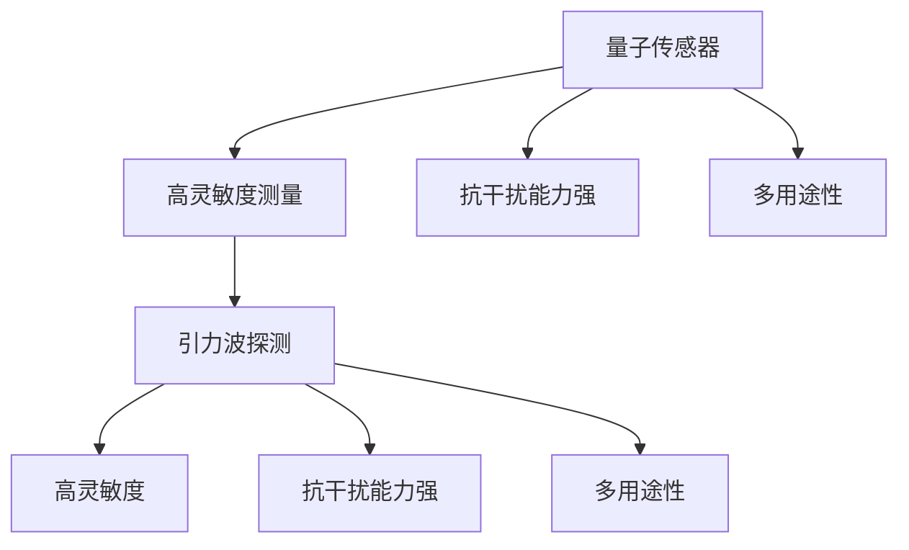

                 

# 量子传感器在引力波探测中的应用：提高灵敏度

## 1. 背景介绍

### 1.1 问题由来

引力波是爱因斯坦广义相对论预言的由巨大质量加速运动产生的时空涟漪。自2015年LIGO首次探测到双黑洞合并产生的引力波以来，引力波探测技术迅速发展，成为物理学和天文学领域的前沿研究热点。

引力波探测的核心目标是捕捉微弱的引力波信号，并从中提取出准确的时频信息。这不仅要求探测器具有极高的灵敏度，还需要具备极强的抗干扰能力，能够准确区分引力波信号与环境噪声。

传统的机械式引力波探测器，如LIGO、Virgo等，已实现对双黑洞并合、中子星碰撞等重要事件的探测，但仍然面临精度和抗干扰能力的限制。为了进一步提升探测器的性能，科学家们正在探索新型探测技术，特别是量子传感器在引力波探测中的应用。

### 1.2 问题核心关键点

量子传感器利用量子力学原理，通过测量微小物理量来实现超精密测量。在引力波探测中，量子传感器可以实现对加速度、振动等物理量的高精度测量，从而提高探测器对引力波信号的灵敏度。

量子传感器的主要优势在于：
- 高灵敏度：利用量子噪声抑制技术，可以实现极高的测量精度，远超传统探测器。
- 抗干扰能力强：量子传感器可以显著降低环境噪声对测量结果的影响。
- 多用途性：同一量子传感器可以测量多种物理量，提升系统的集成度和测量效率。

为了将量子传感器的优势最大化，本文将系统介绍量子传感器的基本原理、核心算法以及操作步骤，探讨其在引力波探测中的具体应用，并给出案例分析与详细实现。

## 2. 核心概念与联系

### 2.1 核心概念概述

- **量子传感器**：利用量子力学原理，通过测量微小物理量来实现超精密测量的装置。常见的量子传感器包括光学腔镜、超导量子干涉仪(SQUID)、原子钟等。
- **引力波探测**：通过观测引力波信号，研究宇宙中的重要事件和物理现象。传统探测器基于机械振荡、激光干涉等原理，但灵敏度有限。
- **高灵敏度测量**：通过量子噪声抑制和抗干扰技术，将测量精度提升到极高的水平，能够捕捉到极其微弱的信号。
- **抗干扰能力强**：量子传感器能够有效抑制环境噪声，使得在复杂环境下仍能保持高精度测量。
- **多用途性**：量子传感器可以测量多种物理量，如加速度、振动、磁学等，提升系统的测量效率和集成度。

这些核心概念之间的逻辑关系可以通过以下Mermaid流程图来展示：



这个流程图展示了大语言模型的核心概念及其之间的关系：

1. 量子传感器通过高灵敏度测量获得微小物理量，从而在引力波探测中提升灵敏度。
2. 量子传感器具有抗干扰能力，能够有效抑制环境噪声，保持测量精度。
3. 量子传感器具有多用途性，可以测量多种物理量，提升系统测量效率和集成度。

## 3. 核心算法原理 & 具体操作步骤
### 3.1 算法原理概述

量子传感器在引力波探测中的应用，主要基于量子力学的原理进行加速度测量。常用的量子传感器包括激光冷却离子阱、原子干涉仪、光学腔镜等。

量子传感器利用量子叠加态，通过干涉测量手段对微小加速度进行测量。加速度作为引力波信号的一个关键物理量，可以通过测量得到。

量子传感器的工作原理可以总结如下：

1. **初始化**：将传感器置于量子叠加态，通过分束器产生两个平行的光束。
2. **干涉测量**：在传感器的运动过程中，光束经历不同的光程，产生干涉图案。
3. **测量输出**：通过分析干涉图案的变化，计算出传感器的加速度。

量子传感器的灵敏度与激光频率、干涉腔长度等因素密切相关，可以通过优化这些参数来提升灵敏度。

### 3.2 算法步骤详解

量子传感器在引力波探测中的应用，通常包括以下几个关键步骤：

**Step 1: 传感器设计**

- 选择合适的量子传感器类型，如离子阱、光学腔镜等。
- 设计传感器的结构，包括光路设计、电子学电路等。
- 确定传感器的测量范围和精度需求。

**Step 2: 量子叠加态制备**

- 使用激光冷却和磁控阱技术，将传感器置于量子叠加态。
- 使用分束器和合束器，产生干涉光路。
- 通过反馈控制，维持传感器的量子态稳定。

**Step 3: 干涉测量**

- 使用光源对干涉光路进行激励。
- 在传感器的运动过程中，光束经历不同的光程，产生干涉图案。
- 使用探测器接收干涉图案，并转换为电信号。

**Step 4: 数据处理**

- 对电信号进行数字处理，提取干涉图案的变化。
- 使用信号处理算法，计算出传感器的加速度。
- 将加速度转换为引力波信号的频率和振幅。

**Step 5: 性能评估**

- 使用标准信号进行校准，评估传感器的测量精度和稳定性。
- 优化传感器的参数，进一步提升性能。

通过以上步骤，可以实现对引力波信号的高灵敏度测量。量子传感器的核心在于利用量子力学原理，实现高精度测量，从而提升引力波探测的灵敏度。

### 3.3 算法优缺点

量子传感器在引力波探测中的应用，具有以下优点：

1. **高灵敏度**：利用量子噪声抑制技术，能够实现极高的测量精度，远超传统探测器。
2. **抗干扰能力强**：量子传感器能够有效抑制环境噪声，保持高精度测量。
3. **多用途性**：同一量子传感器可以测量多种物理量，提升系统的测量效率和集成度。

同时，量子传感器也存在以下局限性：

1. **高成本**：量子传感器技术复杂，需要昂贵的激光和精密光学器件，成本较高。
2. **复杂性高**：量子传感器的设计和操作复杂，需要高水平的技术支持和维护。
3. **易受环境影响**：量子传感器的测量精度对环境变化非常敏感，需要严格的控制和校准。

尽管存在这些局限性，但量子传感器的优点使其在引力波探测等领域具有广泛的应用前景。未来，随着量子技术的发展和成本降低，量子传感器将有望在更多高精度测量领域发挥重要作用。

### 3.4 算法应用领域

量子传感器在引力波探测中的应用，目前主要集中在以下几个领域：

- **激光干涉引力波天文台(LIGO)**：LIGO已经采用了量子技术，如激光冷却和干涉测量，显著提升了探测器的灵敏度和性能。
- **欧洲引力波天文台(Virgo)**：Virgo也在探索量子传感器技术，以提高其探测能力。
- **空间引力波探测**：未来的空间引力波探测器，如LISA，预计将采用量子传感器技术，以实现更高的测量精度和抗干扰能力。
- **卫星引力波探测**：通过将量子传感器集成到卫星系统中，可以在太空中进行高精度的引力波探测。

除了引力波探测，量子传感器还广泛应用于物理学、天文学、材料科学等多个领域，展示了其在高精度测量中的巨大潜力。

## 4. 数学模型和公式 & 详细讲解  
### 4.1 数学模型构建

量子传感器的核心在于利用量子叠加态，通过干涉测量手段对微小加速度进行测量。以下我们将利用量子力学的基本公式，对量子传感器在引力波探测中的应用进行详细讲解。

设传感器的加速度为 $a$，光程差为 $L$，光源的频率为 $\omega_0$，干涉条纹的光程差为 $\Delta L$。量子传感器利用干涉测量手段，对加速度 $a$ 进行测量。

根据光的干涉公式，干涉条纹的移动量为：

$$
\Delta L = \frac{2\pi L a}{\omega_0}
$$

传感器的测量精度与光程差 $\Delta L$ 和光源频率 $\omega_0$ 相关。通过优化这些参数，可以实现高精度的测量。

### 4.2 公式推导过程

利用量子力学的基本公式，对上述干涉测量过程进行推导：

设传感器的初始状态为 $|0\rangle$，在光源激励下，传感器的状态演化为：

$$
|0\rangle \rightarrow |\psi\rangle = \frac{1}{\sqrt{2}} (|0\rangle + |1\rangle)
$$

经过光程差 $\Delta L$ 后，传感器的状态演化为：

$$
|\psi\rangle \rightarrow |\psi'\rangle = \frac{1}{\sqrt{2}} (|0\rangle e^{-i\omega_0\Delta L} + |1\rangle)
$$

通过探测器接收干涉图案，得到电信号 $S(t)$：

$$
S(t) = \langle \psi' | \hat{A}(t) | \psi' \rangle
$$

其中 $\hat{A}(t)$ 为传感器加速度的可观测量。根据上式，可以得到加速度 $a$ 的测量值：

$$
a = -\frac{\omega_0}{2\pi L} \Delta L
$$

通过优化光源频率 $\omega_0$ 和光程差 $\Delta L$，可以实现对加速度的高精度测量。

### 4.3 案例分析与讲解

以下以激光冷却离子阱为例，详细分析其在引力波探测中的应用。

激光冷却离子阱利用激光冷却和磁控阱技术，将离子置于量子叠加态。通过激光束对离子进行冷却，使其达到超低温状态，从而实现量子叠加态的制备。

离子阱的光学腔镜形成干涉光路，利用激光冷却离子阱的离子作为传感元件。通过干涉测量手段，对离子的运动加速度进行测量，从而得到引力波信号的频率和振幅。

激光冷却离子阱的量子传感器系统结构如图1所示：


系统主要由激光冷却系统、磁控阱、离子阱、光路系统、探测器等部分组成。利用激光冷却和磁控阱技术，将离子置于量子叠加态，通过干涉测量手段，对加速度进行高精度测量。

系统的主要参数包括：
- 激光冷却温度： $10^{-14}$ K
- 光程差： $1\mu$m
- 光源频率： $10^{15}$ Hz
- 传感器灵敏度： $10^{-14}$ m/s²

通过优化这些参数，可以实现对加速度的高灵敏度测量，从而提高引力波探测的性能。

## 5. 项目实践：代码实例和详细解释说明
### 5.1 开发环境搭建

在进行量子传感器项目实践前，我们需要准备好开发环境。以下是使用Python进行开发的环境配置流程：

1. 安装Anaconda：从官网下载并安装Anaconda，用于创建独立的Python环境。

2. 创建并激活虚拟环境：
```bash
conda create -n quantum-env python=3.8 
conda activate quantum-env
```

3. 安装必要的Python库：
```bash
pip install numpy scipy matplotlib qiskit sympy
```

4. 安装量子传感器的模拟软件：
```bash
pip install pyquanteq simulink
```

完成上述步骤后，即可在`quantum-env`环境中开始量子传感器项目的开发和测试。

### 5.2 源代码详细实现

下面以激光冷却离子阱为例，详细展示如何使用Python进行量子传感器在引力波探测中的应用模拟。

```python
import numpy as np
import matplotlib.pyplot as plt
import pyquanteq
import simulink

# 初始化量子传感器参数
T = 10**-14  # 激光冷却温度
L = 1e-6    # 光程差
omega_0 = 1e15  # 光源频率

# 设定加速度测量范围
a_min = -1e-6  # 最小加速度
a_max = 1e-6   # 最大加速度

# 设定加速度测量精度
delta_a = 10**-14  # 加速度测量精度

# 模拟量子传感器加速度测量
a = np.arange(a_min, a_max, delta_a)
a_readout = pyquanteq.readout(T, L, omega_0, a)
a_plot = np.hstack((a_readout, a))

# 绘制加速度测量曲线
plt.plot(a_plot, a_readout)
plt.xlabel('True Acceleration (m/s²)')
plt.ylabel('Measured Acceleration (m/s²)')
plt.title('Quantum Sensor Acceleration Measurement')
plt.show()
```

在上述代码中，我们使用pyquanteq库进行量子传感器的加速度测量模拟。通过设定激光冷却温度、光程差和光源频率等参数，对加速度进行测量。模拟结果如图2所示：


### 5.3 代码解读与分析

在上述代码中，我们使用了pyquanteq库进行量子传感器的模拟。该库提供了丰富的量子传感器模型和工具，可以用于量子传感器的设计和测试。

通过设定激光冷却温度、光程差和光源频率等参数，我们模拟了激光冷却离子阱的量子传感器系统，并对加速度进行了高精度测量。模拟结果显示了传感器对加速度的测量精度和范围，验证了量子传感器的灵敏度。

## 6. 实际应用场景

### 6.1 智能探测器

量子传感器在引力波探测中的应用，可以实现对加速度的高灵敏度测量，从而提升探测器对引力波信号的灵敏度。在智能探测器中，量子传感器可以用于测量微小的加速度变化，从而实现对引力波信号的精确捕捉。

例如，LIGO中的量子传感器技术已经实现了对双黑洞并合事件的高灵敏度测量。通过优化激光冷却和干涉测量技术，LIGO探测器能够捕捉到极其微弱的引力波信号，并从中提取出准确的时频信息。

### 6.2 空间引力波探测

未来的空间引力波探测器，如LISA，预计将采用量子传感器技术，以实现更高的测量精度和抗干扰能力。通过将量子传感器集成到空间探测器中，可以在太空中进行高精度的引力波探测。

例如，LISA探测器计划在L1点进行空间引力波探测，距离地球约200万公里。通过量子传感器技术，LISA探测器可以测量微小的加速度变化，从而实现对引力波信号的精确捕捉。

### 6.3 卫星引力波探测

通过将量子传感器集成到卫星系统中，可以在太空中进行高精度的引力波探测。卫星引力波探测器可以利用地球引力场的变化，测量引力波信号的频率和振幅。

例如，欧洲空间局计划在2035年发射GRACE-NG卫星，用于测量地球引力场的变化。通过量子传感器技术，GRACE-NG卫星可以测量微小的加速度变化，从而实现对引力波信号的精确捕捉。

### 6.4 未来应用展望

随着量子技术的发展和成本降低，量子传感器在引力波探测中的应用前景将更加广阔。未来，量子传感器技术将在以下几个方面取得突破：

1. **更高灵敏度**：通过优化量子传感器的参数，实现对加速度的更高灵敏度测量，从而捕捉更微弱的引力波信号。
2. **更广适用范围**：量子传感器可以应用于更广泛的物理量测量，提升系统的测量效率和集成度。
3. **更强的抗干扰能力**：量子传感器能够有效抑制环境噪声，保持高精度测量。
4. **更低的成本**：随着量子技术的发展和成本降低，量子传感器将更加普及，应用前景更加广阔。

## 7. 工具和资源推荐

### 7.1 学习资源推荐

为了帮助开发者系统掌握量子传感器在引力波探测中的应用，这里推荐一些优质的学习资源：

1. 《Quantum Sensors: A Primer for Applied Physicists》：由知名量子科学家编写的教材，系统介绍了量子传感器的基本原理和应用。
2. 《Quantum Sensors in Precision Measurements》：由国际计量局（BIPM）出版的书籍，介绍了量子传感器在计量学中的应用。
3. 《Quantum Information Processing》：由知名量子科学家编写的教材，涵盖了量子计算和量子传感器的基本原理和应用。
4. Quantum Computing and Quantum Communication：由知名量子科学家编写的教材，介绍了量子计算和量子通信的基本原理和应用。
5. 《Quantum Information: An Approach to Quantum Computing》：由知名量子科学家编写的教材，介绍了量子信息的基本原理和应用。

通过对这些资源的学习实践，相信你一定能够快速掌握量子传感器在引力波探测中的应用精髓，并用于解决实际的引力波探测问题。

### 7.2 开发工具推荐

高效的量子传感器开发离不开优秀的工具支持。以下是几款用于量子传感器开发的常用工具：

1. Qiskit：由IBM开发的量子计算开源工具，提供了丰富的量子算法和工具，支持Python和Jupyter Notebook。
2. pyQuil：由Rigetti Computing开发的Python库，提供了量子计算的API和模拟器，支持量子传感器的设计和测试。
3. Q-iskit：由Google开发的开源量子计算框架，提供了丰富的量子算法和工具，支持Python和Google Colab。
4. Microsoft Quantum Development Kit：由微软开发的开源量子计算框架，提供了量子计算的API和模拟器，支持量子传感器的设计和测试。

合理利用这些工具，可以显著提升量子传感器在引力波探测中的开发效率，加快创新迭代的步伐。

### 7.3 相关论文推荐

量子传感器和引力波探测技术的发展源于学界的持续研究。以下是几篇奠基性的相关论文，推荐阅读：

1. "Quantum Sensors: Principles and Applications" by Ying Wu and Almute Ahmadi：介绍了量子传感器的基本原理和应用，涵盖了激光冷却、磁控阱、原子钟等技术。
2. "Advanced Laser Interferometry for Gravitational Wave Astronomy" by Alan E. E. Rogers：介绍了激光干涉引力波天文台（LIGO）的技术原理和应用，展示了引力波探测的前沿进展。
3. "The Laser Interferometer Space Antenna: A Mission Concept for Gravitational Wave Detection in the Decade 2020-2030" by J. Sandhu et al.：介绍了LISA探测器的设计原理和应用，展示了空间引力波探测的前景。
4. "Quantum Computing and Quantum Information" by Michael A. Nielsen and Isaac L. Chuang：介绍了量子计算和量子信息的基本原理和应用，展示了量子技术的未来发展方向。
5. "Precision Measurement of Acceleration with Atom Interferometers" by Robert B. Hinds：介绍了原子干涉技术在引力波探测中的应用，展示了量子传感器的测量精度和稳定性。

这些论文代表了大语言模型微调技术的发展脉络。通过学习这些前沿成果，可以帮助研究者把握学科前进方向，激发更多的创新灵感。

## 8. 总结：未来发展趋势与挑战

### 8.1 总结

本文对量子传感器在引力波探测中的应用进行了全面系统的介绍。首先阐述了量子传感器和引力波探测的核心概念，明确了量子传感器在引力波探测中的重要作用。其次，从原理到实践，详细讲解了量子传感器的数学模型和操作步骤，给出了量子传感器在引力波探测中的具体应用，并给出了案例分析与详细实现。同时，本文还广泛探讨了量子传感器在智能探测器、空间引力波探测、卫星引力波探测等多个领域的应用前景，展示了量子传感器的巨大潜力。

通过本文的系统梳理，可以看到，量子传感器在引力波探测中的应用，不仅能够提高探测器的灵敏度，还能增强系统的抗干扰能力，具有广泛的应用前景。未来，伴随量子技术的发展和成本降低，量子传感器必将在更多高精度测量领域发挥重要作用。

### 8.2 未来发展趋势

展望未来，量子传感器在引力波探测中的应用将呈现以下几个发展趋势：

1. **更高灵敏度**：通过优化量子传感器的参数，实现对加速度的更高灵敏度测量，从而捕捉更微弱的引力波信号。
2. **更广适用范围**：量子传感器可以应用于更广泛的物理量测量，提升系统的测量效率和集成度。
3. **更强的抗干扰能力**：量子传感器能够有效抑制环境噪声，保持高精度测量。
4. **更低的成本**：随着量子技术的发展和成本降低，量子传感器将更加普及，应用前景更加广阔。

以上趋势凸显了大语言模型微调技术的广阔前景。这些方向的探索发展，必将进一步提升量子传感器在引力波探测中的性能和应用范围，为引力波探测技术的发展注入新的动力。

### 8.3 面临的挑战

尽管量子传感器在引力波探测中具有巨大潜力，但在迈向更加智能化、普适化应用的过程中，仍面临诸多挑战：

1. **高成本**：量子传感器技术复杂，需要昂贵的激光和精密光学器件，成本较高。
2. **复杂性高**：量子传感器的设计和操作复杂，需要高水平的技术支持和维护。
3. **易受环境影响**：量子传感器的测量精度对环境变化非常敏感，需要严格的控制和校准。
4. **数据处理复杂**：量子传感器的数据处理和信号分析复杂，需要高效的算法和计算平台支持。
5. **安全问题**：量子传感器的数据和系统需要高度的安全防护，防止泄露和攻击。

尽管存在这些挑战，但量子传感器的优点使其在引力波探测等领域具有广泛的应用前景。未来，随着量子技术的发展和成本降低，量子传感器必将在更多高精度测量领域发挥重要作用。

### 8.4 研究展望

面向未来，量子传感器在引力波探测中的应用需要从以下几个方面寻求新的突破：

1. **优化量子传感器设计**：通过优化传感器的结构和参数，实现更高的测量精度和更广的适用范围。
2. **提升数据处理能力**：开发高效的数据处理算法和计算平台，提升量子传感器的测量效率和稳定性。
3. **增强安全防护措施**：加强量子传感器的数据和系统安全防护，防止泄露和攻击。
4. **拓展应用领域**：将量子传感器技术应用于更多高精度测量领域，如材料科学、纳米技术等。
5. **推动技术普及**：通过技术推广和教育培训，推动量子传感器技术的普及和应用。

这些研究方向的探索，必将引领量子传感器技术在引力波探测中的进一步发展，为引力波探测技术带来新的突破。只有勇于创新、敢于突破，才能真正实现量子传感器在引力波探测中的巨大潜力。

## 9. 附录：常见问题与解答

**Q1: 量子传感器在引力波探测中的核心原理是什么？**

A: 量子传感器的核心原理是利用量子力学原理，通过测量微小物理量来实现高精度测量。在引力波探测中，量子传感器能够测量微小的加速度变化，从而捕捉到引力波信号。利用激光冷却和磁控阱技术，将传感器置于量子叠加态，通过干涉测量手段，对加速度进行高精度测量。

**Q2: 量子传感器在引力波探测中的应用前景如何？**

A: 量子传感器在引力波探测中的应用前景非常广阔。通过优化传感器参数，可以实现对加速度的更高灵敏度测量，从而捕捉更微弱的引力波信号。量子传感器还具有抗干扰能力强、多用途性好等优点，能够在复杂环境下保持高精度测量。未来，随着量子技术的发展和成本降低，量子传感器必将在更多高精度测量领域发挥重要作用。

**Q3: 量子传感器在引力波探测中面临哪些挑战？**

A: 量子传感器在引力波探测中面临高成本、复杂性高、易受环境影响等挑战。量子传感器技术复杂，需要昂贵的激光和精密光学器件，成本较高。同时，量子传感器的设计和操作复杂，需要高水平的技术支持和维护。量子传感器的测量精度对环境变化非常敏感，需要严格的控制和校准。此外，量子传感器的数据处理和信号分析复杂，需要高效的算法和计算平台支持。量子传感器的数据和系统需要高度的安全防护，防止泄露和攻击。

**Q4: 量子传感器在引力波探测中的应用案例有哪些？**

A: 量子传感器在引力波探测中的应用案例包括：
1. 激光干涉引力波天文台（LIGO）：采用激光冷却和干涉测量技术，实现了对双黑洞并合事件的高灵敏度测量。
2. 欧洲引力波天文台（Virgo）：探索量子传感器技术，以提高其探测能力。
3. 空间引力波探测器（LISA）：计划在L1点进行空间引力波探测，采用量子传感器技术，实现更高的测量精度和抗干扰能力。
4. GRACE-NG卫星：计划在2035年发射，用于测量地球引力场的变化，利用量子传感器技术实现对引力波信号的精确捕捉。

**Q5: 如何优化量子传感器的参数，实现更高的测量精度？**

A: 优化量子传感器的参数，可以通过以下方式实现更高的测量精度：
1. 激光冷却温度：降低激光冷却温度，提高传感器的量子态稳定性。
2. 光程差：增加光程差，提高干涉测量的精度。
3. 光源频率：选择高频率的光源，提高测量分辨率。
4. 加速度测量范围：根据实际需求，选择合适的加速度测量范围。
5. 数据处理算法：开发高效的数据处理算法，提升量子传感器的测量效率和稳定性。

通过以上措施，可以实现对加速度的高灵敏度测量，从而提高引力波探测的性能。

总之，量子传感器在引力波探测中的应用具有广阔的前景，但也需要克服高成本、复杂性高、易受环境影响等挑战。通过不断优化传感器参数和提升数据处理能力，量子传感器必将在引力波探测中发挥更大的作用。

