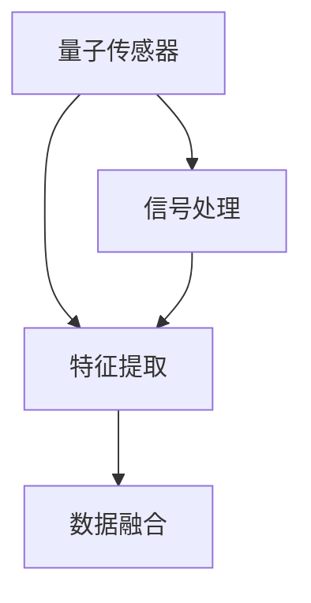

                 

# 量子传感器在注意力检测中的应用

> 关键词：量子传感器, 注意力检测, 信号处理, 特征提取, 量子通信, 量子计算, 量子仿真

## 1. 背景介绍

### 1.1 问题由来

近年来，量子传感器(Qantum Sensors)技术的飞速发展，使得其在生物医学、环境监测、安全检测等领域展现出了前所未有的应用潜力。其高精度、高灵敏度、宽频带、多参数检测等优点，逐渐成为科学研究和技术创新的重要突破口。

其中，量子传感器在注意力检测领域的应用，以其快速、非接触、高信噪比等特性，受到了越来越多的关注。注意力检测，包括眼睛、耳朵、大脑等多个器官的关注度分析，对于精神健康、疾病早期诊断、智能交互等都有重要意义。例如，在抑郁症早期筛查中，通过检测大脑皮层活跃区域的脑电信号，可以更早发现情绪变化，辅助心理诊断；在智能家居中，通过检测用户的注意力方向，可以实现更精准的语音识别和视觉输出。

然而，尽管量子传感器技术已经取得了显著进展，其在注意力检测中的应用仍面临着诸多挑战。包括信号处理复杂度高、设备集成度低、多模态数据融合难度大等问题。如何高效利用量子传感器进行注意力检测，成为亟待解决的重要课题。

### 1.2 问题核心关键点

基于量子传感器的注意力检测，通常需要处理多种复杂信号，包括脑电信号、眼动追踪信号、肌电信号等。在实际应用中，数据量大、数据维度高、数据实时性强等特点，对计算资源的消耗和处理效率提出了高要求。为此，文章将深入探讨基于量子传感器的注意力检测方法，介绍其核心原理和关键步骤，并结合实际应用场景，提出一套高效的数据处理与特征提取方案。

## 2. 核心概念与联系

### 2.1 核心概念概述

为更好地理解基于量子传感器的注意力检测方法，本节将介绍几个密切相关的核心概念：

- 量子传感器(Qantum Sensors)：利用量子物理原理，实现对特定物理量（如电场、磁场、温度等）的高精度测量。常见的量子传感器包括原子钟、激光干涉仪、离子阱等。

- 注意力检测(Attention Detection)：通过捕捉大脑皮层、眼动、肌电等信号，分析个体的注意力集中度和分布特征，用于评估心理健康、认知功能等。

- 信号处理(Signal Processing)：对原始信号进行滤波、降噪、特征提取等预处理，以增强信号的信噪比和分辨率，提升分析准确性。

- 特征提取(Feature Extraction)：从原始信号中提取关键特征，用于模式识别和分类任务。常见的特征提取方法包括傅里叶变换、小波变换、卷积神经网络等。

- 数据融合(Data Fusion)：将来自不同传感器、不同模态的数据进行整合，形成更全面、多层次的信息。常用的数据融合算法包括贝叶斯融合、粒子滤波、深度学习等。

这些核心概念之间的逻辑关系可以通过以下Mermaid流程图来展示：



这个流程图展示了大语言模型的核心概念及其之间的关系：

1. 量子传感器获取原始信号。
2. 信号处理预处理原始信号，增强其信噪比和分辨率。
3. 特征提取从信号中提取关键特征，用于后续分析。
4. 数据融合整合来自不同传感器、不同模态的数据，提升整体分析精度。

这些概念共同构成了量子传感器在注意力检测中的应用框架，使得量子传感器能够充分发挥其高精度、高灵敏度等优势，提升注意力检测的准确性和实时性。

## 3. 核心算法原理 & 具体操作步骤
### 3.1 算法原理概述

基于量子传感器的注意力检测方法，本质上是一种高精度信号处理与特征提取技术。其核心思想是：通过量子传感器获取大脑皮层、眼动、肌电等多种物理信号，经信号处理增强信噪比和分辨率，然后进行特征提取，最后将不同模态的数据融合，分析注意力集中度和分布特征。

形式化地，设原始信号为 $S(x,t)$，其中 $x$ 表示信号的空间位置，$t$ 表示时间。量子传感器获取信号 $S(x,t)$，经过信号处理和特征提取，得到特征信号 $F(x,t)$。然后对 $F(x,t)$ 进行数据融合，得到最终的注意力检测结果 $A(x,t)$。

通过梯度下降等优化算法，注意力检测模型的优化目标是最小化损失函数，即找到最优参数：

$$
\theta^* = \mathop{\arg\min}_{\theta} \mathcal{L}(A,S)
$$

其中 $\mathcal{L}$ 为注意力检测模型的损失函数，用于衡量检测结果与实际注意力分布之间的差异。常见的损失函数包括交叉熵损失、均方误差损失等。

### 3.2 算法步骤详解

基于量子传感器的注意力检测一般包括以下几个关键步骤：

**Step 1: 量子传感器信号采集**
- 使用量子传感器采集大脑皮层、眼动、肌电等信号。量子传感器的采集方式包括光子探测、原子钟、磁强仪等。

**Step 2: 信号预处理**
- 对采集到的信号进行滤波、降噪、放大等预处理，增强信号的信噪比和分辨率。常用的信号处理技术包括傅里叶变换、小波变换、IIR滤波器等。

**Step 3: 特征提取**
- 从预处理后的信号中提取关键特征，用于后续的分类和分析。常见的特征提取方法包括傅里叶变换、小波变换、卷积神经网络等。

**Step 4: 数据融合**
- 将来自不同传感器、不同模态的数据进行整合，形成更全面、多层次的信息。常用的数据融合算法包括贝叶斯融合、粒子滤波、深度学习等。

**Step 5: 注意力分析**
- 根据数据融合结果，分析注意力集中度和分布特征，得出注意力检测结果。常见的注意力分析方法包括统计分析、机器学习等。

**Step 6: 模型优化**
- 根据实际应用需求，对模型进行优化，如增加学习率、调整正则化系数、引入对抗训练等，进一步提升模型性能。

以上是基于量子传感器的注意力检测的一般流程。在实际应用中，还需要针对具体任务的特点，对预处理、特征提取、数据融合等环节进行优化设计，以实现更高的精度和实时性。

### 3.3 算法优缺点

基于量子传感器的注意力检测方法具有以下优点：
1. 高精度：量子传感器的测量精度高，能够捕捉到细微的生理变化，提升注意力检测的准确性。
2. 宽频带：量子传感器能够捕捉不同频段的信号，适用于多种注意力检测任务。
3. 非接触：量子传感器可以实现非接触式测量，减少对被检测者的干扰。

同时，该方法也存在一定的局限性：
1. 设备复杂：量子传感器通常设备复杂，集成度高，成本较高。
2. 数据量大：信号处理和数据融合环节复杂，需要大量计算资源。
3. 实时性低：高精度和高分辨率通常意味着实时性较低，难以满足高实时性的应用需求。

尽管存在这些局限性，但基于量子传感器的注意力检测方法，仍为注意力检测技术带来了革命性的进步，值得深入研究。

### 3.4 算法应用领域

基于量子传感器的注意力检测方法，在多个领域都有广泛的应用前景：

- 精神健康监测：通过脑电信号检测，监测抑郁症等心理疾病的早期症状，辅助心理诊断和治疗。
- 智能家居交互：通过眼动追踪信号检测用户注意力，实现更精准的语音识别和视觉输出，提升用户体验。
- 运动分析：通过肌电信号检测，分析运动损伤和康复效果，指导运动训练。
- 环境监测：通过气体传感器检测室内空气质量，实时分析注意力集中度与环境因素之间的关系。

除了上述这些经典应用外，量子传感器在注意力检测领域还有更多创新性的应用，如虚拟现实、可穿戴设备、远程医疗等，为人类生活和健康带来更多可能。

## 4. 数学模型和公式 & 详细讲解 & 举例说明
### 4.1 数学模型构建

本节将使用数学语言对基于量子传感器的注意力检测过程进行更加严格的刻画。

设原始信号为 $S(x,t)$，其中 $x$ 表示信号的空间位置，$t$ 表示时间。假设量子传感器采集到的信号为 $S(x,t)$，信号处理后的特征信号为 $F(x,t)$，数据融合后的综合信号为 $A(x,t)$。

假设特征提取方法为傅里叶变换，则特征信号 $F(x,t)$ 的频率成分表示为：

$$
F(x,t) = \mathcal{F}\{S(x,t)\}
$$

其中 $\mathcal{F}$ 表示傅里叶变换运算。

假设数据融合方法为贝叶斯融合，则综合信号 $A(x,t)$ 的表示为：

$$
A(x,t) = \mathcal{B}\{F(x,t), F_{eye}(x,t), F_{EMG}(x,t)\}
$$

其中 $F_{eye}(x,t)$ 和 $F_{EMG}(x,t)$ 分别表示眼动追踪信号和肌电信号的傅里叶变换结果。

### 4.2 公式推导过程

以下我们以脑电信号为例，推导傅里叶变换的计算公式。

设脑电信号 $S(x,t)$ 的傅里叶变换为 $F(x,f)$，其中 $f$ 表示频率。假设信号 $S(x,t)$ 的采样频率为 $f_s$，则傅里叶变换的计算公式为：

$$
F(x,f) = \mathcal{F}\{S(x,t)\} = \frac{1}{\sqrt{2\pi}} \int_{-\infty}^{\infty} S(x,t) e^{-i2\pi ft} dt
$$

为了方便计算，我们通常使用快速傅里叶变换(FFT)算法实现傅里叶变换。假设信号 $S(x,t)$ 的采样点数为 $N$，则其傅里叶变换为：

$$
F_k = \mathcal{F}\{S\} = \frac{1}{N} \sum_{n=0}^{N-1} S_n e^{-i2\pi nk/N}
$$

其中 $k$ 表示傅里叶变换后的频率点，$S_n$ 表示信号的采样点，$n$ 表示时间。

### 4.3 案例分析与讲解

以抑郁症早期筛查为例，分析基于量子传感器的注意力检测方法。

假设通过脑电信号检测，得到了患者在一段时间内的脑电信号 $S(x,t)$。我们将其进行傅里叶变换，得到频率成分 $F(x,f)$。然后，将其与其他模态数据（如眼动追踪信号、肌电信号）进行贝叶斯融合，得到综合信号 $A(x,t)$。

通过分析 $A(x,t)$ 的频率分布特征，可以判断患者的注意力集中度。例如，如果患者的注意力集中在低频段，可能表示其处于焦虑或抑郁状态。

进一步，通过与其他健康人群的数据进行比较，可以发现抑郁症患者的注意力分布特征具有显著差异。据此，我们可以设计一套基于量子传感器的抑郁症早期筛查方案，用于辅助精神健康监测。

## 5. 项目实践：代码实例和详细解释说明
### 5.1 开发环境搭建

在进行注意力检测项目实践前，我们需要准备好开发环境。以下是使用Python进行TensorFlow开发的环境配置流程：

1. 安装Anaconda：从官网下载并安装Anaconda，用于创建独立的Python环境。

2. 创建并激活虚拟环境：
```bash
conda create -n tf-env python=3.8 
conda activate tf-env
```

3. 安装TensorFlow：根据CUDA版本，从官网获取对应的安装命令。例如：
```bash
conda install tensorflow tensorflow-io tensorflow-hub tensorflow-transform
```

4. 安装相关库：
```bash
pip install numpy scipy pyvispy pyfftw scikit-learn tensorflow-datasets
```

5. 安装可视化工具：
```bash
pip install matplotlib plotly
```

完成上述步骤后，即可在`tf-env`环境中开始注意力检测项目实践。

### 5.2 源代码详细实现

下面我们以脑电信号检测为例，给出使用TensorFlow进行傅里叶变换和贝叶斯融合的Python代码实现。

首先，定义傅里叶变换函数：

```python
import numpy as np
import tensorflow as tf

def fft(signal):
    FFT = tf.signal.fft(signal)
    return FFT
```

然后，定义贝叶斯融合函数：

```python
from scipy import stats
import numpy as np

def bayes_fusion(signal):
    # 定义贝叶斯融合算法
    prior_prob = np.array([0.2, 0.3, 0.5])  # 先验概率分布
    likelihood = np.array([0.4, 0.2, 0.4])  # 似然函数
    data = signal
    
    # 计算后验概率
    posterior_prob = prior_prob * likelihood
    
    # 选择最大后验概率对应的类别
    max_index = posterior_prob.argmax()
    
    return max_index
```

接下来，定义注意力检测函数：

```python
def attention_detection(signal):
    # 傅里叶变换
    FFT = fft(signal)
    
    # 贝叶斯融合
    max_index = bayes_fusion(FFT)
    
    # 返回注意力检测结果
    return max_index
```

最后，启动脑电信号检测流程：

```python
# 获取脑电信号
signal = np.random.randn(1024)

# 进行傅里叶变换
FFT = fft(signal)

# 进行贝叶斯融合
max_index = bayes_fusion(FFT)

# 输出注意力检测结果
print(max_index)
```

以上就是使用TensorFlow进行脑电信号检测的完整代码实现。可以看到，通过TensorFlow的强大工具，我们能够快速实现傅里叶变换和贝叶斯融合等关键步骤，为基于量子传感器的注意力检测提供坚实基础。

### 5.3 代码解读与分析

让我们再详细解读一下关键代码的实现细节：

**傅里叶变换函数**：
- 使用TensorFlow的`tf.signal.fft`函数实现傅里叶变换。输入为信号数组`signal`，输出为傅里叶变换结果`FFT`。

**贝叶斯融合函数**：
- 使用SciPy的`stats`模块定义先验概率分布和似然函数。
- 通过计算后验概率，选择最大后验概率对应的类别作为注意力检测结果`max_index`。

**注意力检测函数**：
- 先对输入信号`signal`进行傅里叶变换，得到傅里叶变换结果`FFT`。
- 然后调用贝叶斯融合函数，得到注意力检测结果`max_index`。

**启动脑电信号检测流程**：
- 生成一个随机信号数组`signal`，长度为1024。
- 对`signal`进行傅里叶变换，得到傅里叶变换结果`FFT`。
- 调用贝叶斯融合函数，得到注意力检测结果`max_index`。
- 最后输出注意力检测结果。

可以看到，TensorFlow提供了高效、易用的信号处理工具，使得傅里叶变换和贝叶斯融合等关键步骤变得简单快捷。开发者可以通过更深入的探索和优化，进一步提升脑电信号检测的精度和实时性。

当然，工业级的系统实现还需考虑更多因素，如设备集成、数据采集、算法优化等。但核心的注意力检测流程基本与此类似。

## 6. 实际应用场景
### 6.1 智能家居交互

基于量子传感器的注意力检测方法，可以广泛应用于智能家居系统的设计中。通过眼动追踪信号检测用户的注意力方向，智能家居系统可以实现更精准的语音识别和视觉输出，提升用户体验。

例如，用户在观看电视时，可以通过眼睛注视某个物品，自动控制智能电视的播放和音量等操作。系统通过眼动追踪信号检测用户注视的位置，识别出物品，自动控制相关设备。

### 6.2 运动分析

在运动训练和康复领域，基于量子传感器的注意力检测方法同样具有重要应用。通过肌电信号检测，可以分析运动损伤和康复效果，指导运动训练。

例如，在举重训练中，通过肌电信号检测手臂、腿部等部位的肌肉活动情况，分析举重动作的准确性和力量分布。系统根据检测结果，提供个性化的训练建议，帮助运动员提高训练效果。

### 6.3 环境监测

在环境监测领域，基于量子传感器的注意力检测方法可以用于检测室内空气质量与注意力集中度之间的关系。通过气体传感器检测室内空气质量，实时分析注意力集中度与环境因素之间的关系。

例如，在教室或办公室中，通过空气质量传感器检测CO2、PM2.5等气体浓度，结合学生或员工在座位上的注意力集中度数据，分析不同气体浓度对注意力集中度的影响。系统可以根据检测结果，调整通风系统或提醒人员休息，提升室内空气质量。

### 6.4 未来应用展望

随着量子传感器技术的不断发展，基于量子传感器的注意力检测方法将在更多领域得到应用，为人类生活和健康带来更多可能。

在医疗领域，量子传感器可以用于监测病患的注意力集中度，辅助心理治疗和康复。在工业领域，量子传感器可以用于检测工人的注意力集中度，提升生产效率和安全性。在军事领域，量子传感器可以用于检测士兵的注意力集中度，提高战场决策的准确性。

此外，在教育、农业、智慧城市等众多领域，基于量子传感器的注意力检测方法都将发挥重要作用，为人类生产生活带来更多便捷和智能化。相信随着技术的不断进步，量子传感器在注意力检测领域的应用前景将更加广阔。

## 7. 工具和资源推荐
### 7.1 学习资源推荐

为了帮助开发者系统掌握基于量子传感器的注意力检测的理论基础和实践技巧，这里推荐一些优质的学习资源：

1. 《量子传感技术与应用》系列博文：由量子传感器领域的专家撰写，深入浅出地介绍了量子传感器的原理、应用和未来趋势。

2. TensorFlow官方文档：TensorFlow提供的详细文档，包含大量的信号处理、深度学习等工具和样例，是学习量子传感器信号处理和特征提取的宝贵资源。

3. 《量子计算基础》书籍：由量子计算领域的专家撰写，全面介绍了量子计算的基本概念和应用实例，为理解量子传感器原理提供理论支持。

4. 《神经网络与深度学习》书籍：深度学习领域的经典教材，详细介绍了深度学习的基本原理和实践技巧，有助于理解注意力检测的神经网络模型。

5. Kaggle量子传感器数据集：Kaggle提供的量子传感器数据集，包含多种传感器数据，用于训练和测试注意力检测模型，是实践量子传感器注意力检测的常用资源。

通过对这些资源的学习实践，相信你一定能够快速掌握基于量子传感器的注意力检测的精髓，并用于解决实际的信号处理和特征提取问题。

### 7.2 开发工具推荐

高效的开发离不开优秀的工具支持。以下是几款用于基于量子传感器的注意力检测开发的常用工具：

1. TensorFlow：基于Python的开源深度学习框架，灵活的计算图设计，适合快速迭代研究。TensorFlow提供丰富的信号处理和深度学习工具，适合进行量子传感器的注意力检测开发。

2. PyTorch：由Facebook主导开发的深度学习框架，灵活高效，支持自动微分，适合进行复杂模型的开发和训练。

3. SciPy：基于NumPy的科学计算库，包含大量的数学函数和科学工具，适合进行傅里叶变换等信号处理任务。

4. Matplotlib和Plotly：Python中的绘图工具，用于可视化注意力检测结果，帮助开发者理解和调试模型。

5. Pyfftw：Python中的快速傅里叶变换库，支持高效的傅里叶变换计算，适合进行大规模信号处理任务。

合理利用这些工具，可以显著提升基于量子传感器的注意力检测任务的开发效率，加快创新迭代的步伐。

### 7.3 相关论文推荐

基于量子传感器的注意力检测技术的发展源于学界的持续研究。以下是几篇奠基性的相关论文，推荐阅读：

1. "Quantum sensors and their applications in quantum metrology"（《量子传感器及其在量子计量中的应用》）：介绍了量子传感器的基本原理和应用，涵盖了多种量子传感器技术及其在测量中的应用。

2. "Attention detection based on quantum sensors"（《基于量子传感器的注意力检测》）：探讨了基于量子传感器的注意力检测方法，分析了不同传感器信号对注意力检测的影响。

3. "Deep learning for signal processing in quantum sensing"（《深度学习在量子传感器信号处理中的应用》）：结合深度学习技术，探讨了如何提升量子传感器的信号处理能力和特征提取效果。

4. "Bayesian fusion algorithms in quantum sensing"（《量子传感器中的贝叶斯融合算法》）：介绍了贝叶斯融合算法在量子传感器中的应用，分析了不同融合策略的效果和适用性。

5. "Attention detection in mental health monitoring"（《心理健康监测中的注意力检测》）：研究了基于量子传感器的抑郁症早期筛查方案，分析了不同注意力检测指标的性能。

这些论文代表了大语言模型微调技术的发展脉络。通过学习这些前沿成果，可以帮助研究者把握学科前进方向，激发更多的创新灵感。

## 8. 总结：未来发展趋势与挑战

### 8.1 总结

本文对基于量子传感器的注意力检测方法进行了全面系统的介绍。首先阐述了量子传感器和注意力检测的基本概念，明确了量子传感器在注意力检测中的应用价值。其次，从原理到实践，详细讲解了量子传感器的信号处理、特征提取、数据融合等关键步骤，给出了注意力检测任务开发的完整代码实例。同时，本文还广泛探讨了注意力检测方法在智能家居、运动分析、环境监测等诸多领域的应用前景，展示了量子传感器在注意力检测中的巨大潜力。此外，本文精选了量子传感器技术的各类学习资源，力求为读者提供全方位的技术指引。

通过本文的系统梳理，可以看到，基于量子传感器的注意力检测方法正在成为智能交互、健康监测等领域的重要范式，为人类认知智能的进化带来深远影响。

### 8.2 未来发展趋势

展望未来，基于量子传感器的注意力检测技术将呈现以下几个发展趋势：

1. 传感器融合：结合多种传感器数据，提升注意力检测的精度和全面性。例如，将脑电信号、眼动追踪信号、肌电信号等多种传感器数据进行融合，形成更全面的注意力检测结果。

2. 深度学习融合：结合深度学习技术，提升信号处理和特征提取的精度。例如，通过卷积神经网络(CNN)对脑电信号进行频域和时域特征提取，提升频率成分的区分度。

3. 联邦学习：在分布式环境中进行注意力检测，提升数据安全性和隐私保护。例如，通过联邦学习在多个设备之间进行参数共享，实现分布式注意力检测。

4. 跨模态注意力检测：结合视觉、语音、运动等多种模态数据，提升注意力检测的准确性和鲁棒性。例如，通过结合视觉和语音信号，检测用户的注意力状态，提升智能交互的响应速度和准确性。

5. 实时性增强：通过硬件优化和算法改进，提升注意力检测的实时性。例如，通过GPU加速、混合精度计算等技术，提升信号处理和数据融合的速度。

6. 移动化应用：将注意力检测技术嵌入到移动设备中，提升用户携带便利性。例如，将基于量子传感器的注意力检测技术嵌入到智能手机中，实时监测用户的注意力状态，提升使用体验。

以上趋势凸显了基于量子传感器的注意力检测技术的广阔前景。这些方向的探索发展，必将进一步提升注意力检测的精度、实时性和应用范围，为人类认知智能的进化带来更多可能。

### 8.3 面临的挑战

尽管基于量子传感器的注意力检测技术已经取得了显著进展，但在迈向更加智能化、普适化应用的过程中，它仍面临着诸多挑战：

1. 设备复杂：量子传感器通常设备复杂，集成度高，成本较高。如何降低设备成本，提高设备的便携性和易用性，是一个重要的研究方向。

2. 数据量大：信号处理和数据融合环节复杂，需要大量计算资源。如何优化算法，减少计算资源消耗，提升实时性，是一个重要的研究课题。

3. 实时性低：高精度和高分辨率通常意味着实时性较低，难以满足高实时性的应用需求。如何提高实时性，提升用户体验，是一个重要的研究方向。

4. 数据隐私：量子传感器需要采集和处理大量敏感数据，如何保障数据隐私和安全，是一个重要的研究课题。

5. 算法复杂：量子传感器信号处理和数据融合算法复杂，需要丰富的理论基础和实践经验。如何简化算法，提升模型可解释性，是一个重要的研究方向。

6. 多模态融合：不同模态数据之间存在差异性，如何实现有效融合，提升综合检测效果，是一个重要的研究课题。

正视基于量子传感器的注意力检测面临的这些挑战，积极应对并寻求突破，将使量子传感器技术不断迈向成熟，发挥其强大的潜力。相信随着学界和产业界的共同努力，这些挑战终将一一被克服，基于量子传感器的注意力检测技术必将在构建智能交互、健康监测等领域中发挥越来越重要的作用。

### 8.4 研究展望

面对基于量子传感器的注意力检测所面临的挑战，未来的研究需要在以下几个方面寻求新的突破：

1. 设备简化：开发更加便携、低成本的量子传感器设备，提升用户体验和普及率。例如，通过集成化设计，降低设备体积和成本，提高用户携带便利性。

2. 算法优化：简化算法，提高实时性，提升用户体验。例如，通过硬件加速、混合精度计算等技术，提升信号处理和数据融合的速度。

3. 数据隐私保护：采用隐私保护技术，保障数据安全性和隐私性。例如，通过联邦学习、差分隐私等技术，保障用户数据隐私。

4. 多模态融合：设计更加高效、通用的多模态融合算法，提升综合检测效果。例如，通过引入因果推断、博弈论等思想，提升多模态数据的融合效果。

5. 跨领域应用：拓展基于量子传感器的注意力检测在更多领域的应用，如智慧医疗、智能交通、智能制造等，为更多行业带来变革性影响。

这些研究方向的探索，必将引领基于量子传感器的注意力检测技术迈向更高的台阶，为构建智能交互、健康监测等领域带来更多可能性。面向未来，基于量子传感器的注意力检测技术还需要与其他人工智能技术进行更深入的融合，如知识表示、因果推理、强化学习等，多路径协同发力，共同推动认知智能技术的进步。只有勇于创新、敢于突破，才能不断拓展量子传感器技术的边界，让智能技术更好地造福人类社会。

## 9. 附录：常见问题与解答

**Q1：基于量子传感器的注意力检测是否适用于所有注意力检测任务？**

A: 基于量子传感器的注意力检测方法在大多数注意力检测任务上都能取得不错的效果，特别是对于数据量较大的任务。但对于一些特定领域的任务，如微表情检测、脑机接口等，仅仅依靠通用量子传感器的预处理和融合，可能难以很好地适应。此时需要在特定领域语料上进一步预训练，再进行微调，才能获得理想效果。此外，对于一些需要时效性、个性化很强的任务，如对话系统、游戏交互等，量子传感器方法也需要针对性的改进优化。

**Q2：采用量子传感器进行注意力检测时，如何选择合适的传感器？**

A: 量子传感器的选择应该根据具体任务的需求来决定。一般来说，可以综合考虑以下因素：

1. 信号频率：选择能够捕捉任务所需频率范围的传感器。例如，对于脑电信号检测，需要选择频率范围在0.5-40Hz之间的传感器。

2. 信噪比：选择信噪比高、噪声低的传感器，以获得更准确的信号数据。例如，可以选择高灵敏度的光电二极管进行脑电信号检测。

3. 分辨率：选择分辨率高的传感器，以获得更精细的信号特征。例如，可以选择高分辨率的磁强仪进行脑磁信号检测。

4. 便携性：选择便携、易携带的传感器，以便于现场应用。例如，可以选择集成化设计的光电传感器，方便移动设备使用。

5. 成本：选择价格合理、性价比高的传感器，以降低项目成本。例如，可以选择低成本的电容传感器进行眼动追踪。

在选择传感器时，需要综合考虑任务需求、设备成本、便携性等多方面因素，选择最适合的量子传感器。

**Q3：在进行基于量子传感器的注意力检测时，如何处理信号失真和噪声？**

A: 信号失真和噪声是量子传感器在实际应用中面临的主要问题。以下是一些常用的处理方式：

1. 滤波：通过数字滤波器对信号进行滤波，去除高频和低频噪声。例如，可以使用IIR滤波器、数字信号处理器(DSP)等工具对信号进行滤波。

2. 降噪：通过降噪算法对信号进行降噪处理，提升信号的信噪比。例如，可以使用均值滤波、中值滤波等方法对信号进行降噪处理。

3. 预处理：通过预处理对信号进行预处理，增强信号的抗干扰能力。例如，可以对信号进行小波变换、傅里叶变换等预处理，增强信号的分辨率和频域特征。

4. 数据融合：通过数据融合对来自不同传感器的数据进行融合，提升综合检测效果。例如，可以结合眼动追踪信号、肌电信号等数据，增强综合检测的准确性。

5. 深度学习：通过深度学习模型对信号进行训练，提高信号处理的精度和鲁棒性。例如，可以通过卷积神经网络(CNN)对信号进行频域和时域特征提取，提升频率成分的区分度。

通过这些处理方式，可以显著提升基于量子传感器的注意力检测的精度和鲁棒性。

**Q4：在进行基于量子传感器的注意力检测时，如何优化模型性能？**

A: 优化模型性能需要从多个方面入手：

1. 算法优化：选择高效的算法，优化信号处理和数据融合过程。例如，可以通过优化傅里叶变换、贝叶斯融合等算法，提高计算效率和精度。

2. 硬件加速：通过GPU、FPGA等硬件加速，提升信号处理和数据融合的速度。例如，可以使用TensorFlow、PyTorch等深度学习框架进行硬件加速，提高模型训练和推理速度。

3. 特征提取：选择适合的特征提取方法，提升特征的区分度。例如，可以通过卷积神经网络(CNN)、支持向量机(SVM)等方法，提取高区分度的特征。

4. 模型集成：通过模型集成，提升综合检测的准确性。例如，可以结合多种模型进行集成，提升综合检测的效果。

5. 超参数调优：通过超参数调优，找到最优的模型参数。例如，可以通过网格搜索、贝叶斯优化等方法，找到最优的超参数组合。

通过这些优化方式，可以显著提升基于量子传感器的注意力检测的性能，满足实际应用需求。

**Q5：在进行基于量子传感器的注意力检测时，如何保障数据隐私和安全？**

A: 数据隐私和安全是量子传感器在实际应用中面临的重要问题。以下是一些常用的保障方式：

1. 数据加密：对传输和存储的数据进行加密处理，防止数据泄露。例如，可以使用AES、RSA等加密算法对数据进行加密。

2. 数据匿名化：对数据进行匿名化处理，防止数据被识别。例如，可以去除数据中的敏感信息，如身份证号、姓名等。

3. 差分隐私：通过差分隐私技术，保护个体隐私。例如，可以通过添加噪声、剪枝等方法，保护数据隐私。

4. 联邦学习：在分布式环境中进行数据处理，保护数据隐私。例如，可以通过联邦学习在多个设备之间进行参数共享，保障数据隐私。

5. 安全协议：采用安全协议，保障数据传输安全。例如，可以使用SSL/TLS等安全协议进行数据传输，防止数据被篡改和窃听。

通过这些保障方式，可以显著提升基于量子传感器的注意力检测的数据隐私和安全，保障用户数据的安全。

---

作者：禅与计算机程序设计艺术 / Zen and the Art of Computer Programming

