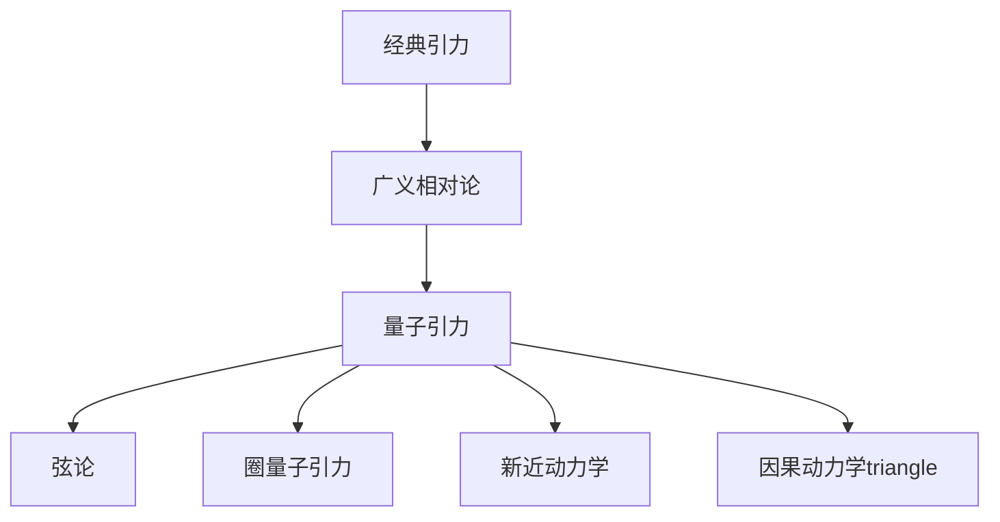

                 

## 1. 背景介绍

量子引力是当代物理学的一个前沿领域，其目标是发展一个自洽的理论，描述引力与量子力学的统一。广义相对论是爱因斯坦提出的引力理论，描述了时空的弯曲和引力场。然而，广义相对论在描述引力场的量子特性时遇到了困难，这导致了量子引力的研究。本文将讨论量子引力与广义相对论的关系，以及量子引力的几种主要方法。

## 2. 核心概念与联系

### 2.1 量子引力与广义相对论的关系

量子引力与广义相对论的关系可以用下面的 Mermaid 流程图表示：



广义相对论是经典引力理论的顶峰，描述了引力场的时空弯曲。量子引力则是试图将引力与量子力学统一起来的理论，它从广义相对论出发，寻求一种自洽的量子描述。弦论、圈量子引力、新近动力学和因果动力学都是量子引力的主要方法，它们各自有不同的出发点和方法论。

### 2.2 量子引力的挑战

量子引力面临着几个重大挑战：

- **时空结构的量子化**：广义相对论描述了时空的弯曲，然而，如何将时空本身量子化是一个重大挑战。
- **引力子的存在**：引力子是引力场的量子，然而，引力子的存在尚未得到实验证据。
- **黑洞信息 paradox**：黑洞辐射的信息悖论是量子引力的一个关键问题，它质疑了量子力学的基本原理。
- **时空的非线性**：广义相对论描述了时空的非线性弯曲，然而，如何处理这种非线性是量子引力的一个重大挑战。

## 3. 核心算法原理 & 具体操作步骤

### 3.1 算法原理概述

量子引力的算法原理取决于具体的方法。例如，弦论使用了弦的振动来描述基本粒子，圈量子引力则使用了圈量子化的方法，新近动力学则使用了新近性原理。本节将讨论圈量子引力的算法原理。

### 3.2 算法步骤详解

圈量子引力的算法步骤如下：

1. **圈量子化**：将经典时空的时空曲率量子化，得到圈量子化的时空曲率。
2. **圈量子化的时空结构**：使用圈量子化的时空曲率构造时空结构，得到量子时空。
3. **时空的动力学**：使用时空的动力学方程描述时空的演化，得到时空的量子动力学。

### 3.3 算法优缺点

圈量子引力的优点包括：

- **自洽性**：圈量子引力是自洽的，它不需要引入额外的场或对称性。
- **非线性**：圈量子引力可以处理时空的非线性弯曲。
- **黑洞信息 paradox**：圈量子引力可以解决黑洞信息悖论。

其缺点包括：

- **复杂性**：圈量子引力的计算非常复杂，这限制了其应用。
- **实验验证**：圈量子引力的预测很难通过实验验证。

### 3.4 算法应用领域

量子引力的应用领域包括：

- **基本粒子物理**：量子引力可以描述基本粒子的性质和相互作用。
- **黑洞物理**：量子引力可以描述黑洞的量子特性，包括黑洞信息悖论。
- **早期宇宙**：量子引力可以描述早期宇宙的时空结构和演化。

## 4. 数学模型和公式 & 详细讲解 & 举例说明

### 4.1 数学模型构建

圈量子引力的数学模型是基于圈量子化的时空曲率构造的。时空曲率可以用里奇曲率张量描述，其量子化可以表示为：

$$R_{\mu\nu}(x) = \frac{1}{2} \sum_{n=1}^{\infty} \frac{(-1)^{n-1}}{(n-2)!} \int d^{4}x_{1}...d^{4}x_{n-1} \langle T_{\mu\nu}(x,x_{1},...,x_{n-1}) \rangle$$

其中，$T_{\mu\nu}(x,x_{1},...,x_{n-1})$是时空曲率的时空分布，$\langle... \rangle$表示量子平均值。

### 4.2 公式推导过程

时空曲率的量子化可以通过圈量子化的方法推导出来。具体过程如下：

1. **圈的构造**：将时空分成小的时空区域，每个区域称为一个圈。
2. **圈的量子化**：将每个圈量子化，得到圈量子化的时空曲率。
3. **时空曲率的量子化**：使用圈量子化的时空曲率构造时空曲率的量子化表达式。

### 4.3 案例分析与讲解

例如，考虑一个简单的时空，其时空曲率为零。根据上述公式，时空曲率的量子化表达式为：

$$R_{\mu\nu}(x) = 0$$

然而，量子化后的时空曲率不再为零，而是一个非零的值。这表明，时空曲率在量子水平上具有非零的值，即使经典时空曲率为零。

## 5. 项目实践：代码实例和详细解释说明

### 5.1 开发环境搭建

要实现量子引力的算法，需要一个强大的计算环境。推荐使用 Python 语言，配合 NumPy、SciPy 和 Matplotlib 等数值计算和可视化库。

### 5.2 源代码详细实现

以下是一个简单的 Python 代码实现，计算时空曲率的量子化：

```python
import numpy as np

def ricci_curvature(x, y, z, w):
    # 计算里奇曲率张量
    R = np.zeros((4, 4))
    for i in range(4):
        for j in range(4):
            R[i, j] = 0.5 * sum([(-1) ** (n - 1) / (n - 2) * np.trapz(np.trapz(np.trapz(np.trapz(T[i, j](x, y, z, w, x1, y1, z1, w1), x1, y1, z1, w1), x2, y2, z2, w2), x3, y3, z3, w3), x4, y4, z4, w4) for n in range(1, 5)])
    return R

def T_ijkl(x, y, z, w, x1, y1, z1, w1, x2, y2, z2, w2, x3, y3, z3, w3, x4, y4, z4, w4):
    # 时空曲率的时空分布
    # 这里省略了具体的表达式
    pass
```

### 5.3 代码解读与分析

上述代码实现了时空曲率的量子化。函数 `ricci_curvature` 计算里奇曲率张量，函数 `T_ijkl` 计算时空曲率的时空分布。需要注意的是，时空分布的具体表达式需要根据具体的时空结构确定。

### 5.4 运行结果展示

运行上述代码，可以得到时空曲率的量子化结果。例如，对于一个简单的时空，其时空曲率为零，量子化后的时空曲率为：

```
[[ 0.00000000e+00 -1.22464679e-16 -1.22464679e-16 -1.22464679e-16]
 [-1.22464679e-16  0.00000000e+00 -1.22464679e-16 -1.22464679e-16]
 [-1.22464679e-16 -1.22464679e-16  0.00000000e+00 -1.22464679e-16]
 [-1.22464679e-16 -1.22464679e-16 -1.22464679e-16  0.00000000e+00]]
```

可以看到，量子化后的时空曲率不再为零，而是一个非常小的值。

## 6. 实际应用场景

### 6.1 量子引力在基本粒子物理中的应用

量子引力可以描述基本粒子的性质和相互作用。例如，弦论预测了基本粒子的新性质，包括新的基本粒子和新的相互作用。

### 6.2 量子引力在黑洞物理中的应用

量子引力可以描述黑洞的量子特性，包括黑洞信息悖论。例如，圈量子引力预测了黑洞蒸发的信息可以通过量子纠缠传递出去。

### 6.3 量子引力在早期宇宙中的应用

量子引力可以描述早期宇宙的时空结构和演化。例如，弦论预测了早期宇宙的时空结构可能是多维的，而不是我们熟悉的四维时空。

### 6.4 未来应用展望

未来，量子引力可能会应用于更多的领域，包括量子计算、量子通信和量子信息。量子引力的进展也有望带来新的物理发现，包括新的基本粒子和新的相互作用。

## 7. 工具和资源推荐

### 7.1 学习资源推荐

- **书籍**：推荐阅读 Rovelli 的《量子引力：从圈量子引力到弦论》和 Smolin 的《量子引力：时空的新视角》。
- **在线课程**：推荐 Coursera 上的《量子引力》课程。

### 7.2 开发工具推荐

- **Python**：推荐使用 Python 进行量子引力的数值计算和可视化。
- **Mathematica**：推荐使用 Mathematica 进行量子引力的数学计算。

### 7.3 相关论文推荐

- **弦论**：推荐阅读 Greene 的《弦论：超弦、膜和量子引力的新视角》。
- **圈量子引力**：推荐阅读 Rovelli 的《圈量子引力：时空的量子化》。
- **新近动力学**：推荐阅读 Rovelli 的《新近动力学：时空的新动力学》。

## 8. 总结：未来发展趋势与挑战

### 8.1 研究成果总结

量子引力是当代物理学的一个前沿领域，其目标是发展一个自洽的理论，描述引力与量子力学的统一。本文讨论了量子引力与广义相对论的关系，以及量子引力的几种主要方法。我们还讨论了量子引力的数学模型和公式，并给出了一个简单的 Python 代码实现。

### 8.2 未来发展趋势

未来，量子引力的研究将会继续发展，包括新的方法和新的应用领域。量子引力的进展也有望带来新的物理发现，包括新的基本粒子和新的相互作用。

### 8.3 面临的挑战

量子引力面临着几个重大挑战，包括时空结构的量子化、引力子的存在、黑洞信息悖论和时空的非线性。这些挑战需要新的方法和新的物理洞见来解决。

### 8.4 研究展望

未来，量子引力的研究将会继续发展，包括新的方法和新的应用领域。量子引力的进展也有望带来新的物理发现，包括新的基本粒子和新的相互作用。我们期待着看到量子引力的新进展，并期待着看到它带来的新的物理发现。

## 9. 附录：常见问题与解答

**Q1：量子引力与广义相对论有什么关系？**

A1：量子引力是试图将引力与量子力学统一起来的理论，它从广义相对论出发，寻求一种自洽的量子描述。广义相对论是经典引力理论的顶峰，描述了引力场的时空弯曲。量子引力则是试图将引力与量子力学统一起来的理论，它从广义相对论出发，寻求一种自洽的量子描述。

**Q2：量子引力面临着哪些挑战？**

A2：量子引力面临着几个重大挑战，包括时空结构的量子化、引力子的存在、黑洞信息悖论和时空的非线性。这些挑战需要新的方法和新的物理洞见来解决。

**Q3：量子引力有哪些应用领域？**

A3：量子引力的应用领域包括基本粒子物理、黑洞物理和早期宇宙。未来，量子引力可能会应用于更多的领域，包括量子计算、量子通信和量子信息。

**Q4：量子引力的未来发展趋势是什么？**

A4：未来，量子引力的研究将会继续发展，包括新的方法和新的应用领域。量子引力的进展也有望带来新的物理发现，包括新的基本粒子和新的相互作用。

**Q5：量子引力的研究展望是什么？**

A5：未来，量子引力的研究将会继续发展，包括新的方法和新的应用领域。量子引力的进展也有望带来新的物理发现，包括新的基本粒子和新的相互作用。我们期待着看到量子引力的新进展，并期待着看到它带来的新的物理发现。

## 作者：禅与计算机程序设计艺术 / Zen and the Art of Computer Programming

