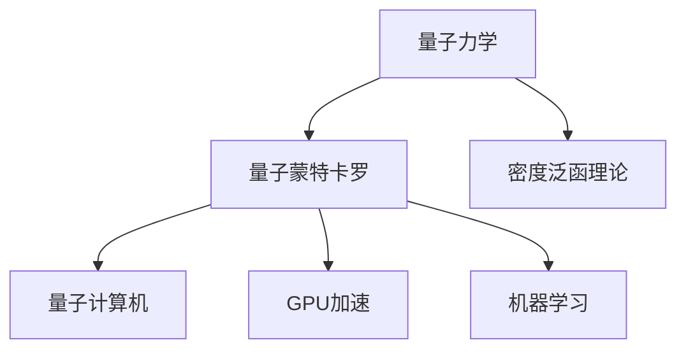

                 

# 量子模拟：解决材料科学难题的新方法

## 1. 背景介绍

### 1.1 问题由来
材料科学是人类社会发展的重要基石。从最基本的金属、半导体、陶瓷，到复杂的碳纳米管、纳米颗粒、超导材料，材料在很大程度上决定了一个国家的技术实力和产业竞争力。然而，许多新材料的设计和优化，尤其是在量子尺度上的研究，面临着巨大的计算复杂性和实验成本。传统的基于经验的材料设计方法难以应对新材料的高复杂度，导致新材料发现和优化的速度远远跟不上科学研究的步伐。

### 1.2 问题核心关键点
量子模拟是通过计算机模拟量子系统的方法，模拟材料在量子尺度上的行为和性质。这不仅能显著降低实验成本，还能模拟传统实验难以实现的极端条件，如高温、高压等，为材料科学的研究和创新提供了新的视角和方法。

量子模拟的核心在于如何高效、准确地模拟量子系统的行为。这需要理解量子力学的基本原理，掌握计算物理的数值方法，以及运用高级编程技术进行优化和扩展。

量子模拟在材料科学中的应用，可以涵盖从材料的微观结构设计、性质预测、缺陷行为模拟，到宏观物理特性的探索和实验优化等诸多方面。

### 1.3 问题研究意义
量子模拟技术的突破，对于材料科学的创新发展具有重要意义：

1. **加速新材料研发**：量子模拟可以预测新材料的性质，指导实验设计和工艺优化，加速新材料的发现和应用。
2. **降低实验成本**：通过模拟极端条件下的材料行为，减少昂贵实验的需求，降低研究成本。
3. **拓展材料研究范围**：模拟实验难以达到的条件，拓展材料研究的物理和化学空间。
4. **推动工业应用**：为工业材料设计和工艺优化提供科学依据，促进产业升级和创新。

## 2. 核心概念与联系

### 2.1 核心概念概述

为更好地理解量子模拟方法，本节将介绍几个密切相关的核心概念：

- **量子力学**：描述微观粒子行为的理论基础，量子模拟的根本依据。
- **量子蒙特卡罗方法**：基于统计方法的量子模拟技术，通过采样计算量子系统性质。
- **密度泛函理论**：基于量子力学的材料物理理论，描述多电子系统。
- **量子计算机**：实现量子模拟的硬件平台，未来有望实现大规模量子计算。
- **GPU加速**：用于加速传统计算机的计算过程，提高量子模拟的效率。
- **机器学习**：与量子模拟结合，用于预测材料性质和优化模拟过程。

这些核心概念之间的逻辑关系可以通过以下Mermaid流程图来展示：



这个流程图展示了一些核心概念及其之间的关系：

1. 量子力学提供了量子模拟的物理基础。
2. 量子蒙特卡罗方法基于统计方法模拟量子系统。
3. 密度泛函理论用于描述多电子系统的性质。
4. 量子计算机是量子模拟的硬件实现。
5. GPU加速技术用于提高量子模拟的效率。
6. 机器学习与量子模拟结合，用于预测和优化材料性质。

## 3. 核心算法原理 & 具体操作步骤
### 3.1 算法原理概述

量子模拟的核心算法包括量子蒙特卡罗方法和密度泛函理论。这些方法通过计算量子系统的波函数或密度矩阵，来预测材料的行为和性质。

量子蒙特卡罗方法的基本思想是通过随机采样，计算量子系统的期望值，从而预测其性质。常用的量子蒙特卡罗方法包括变分蒙特卡罗(VMC)和扩散蒙特卡罗(DMC)。

密度泛函理论则是基于量子力学的多电子系统理论，通过求解电子密度和能量泛函，来预测材料的物理性质。常用的密度泛函方法包括基于Kohn-Sham方程的平面波方法(PW)和基于格点方法(FF)。

### 3.2 算法步骤详解

量子模拟的流程通常包括以下几个关键步骤：

**Step 1: 准备模拟环境**
- 选择合适的量子模拟方法(如VMC、DMC、PW、FF等)。
- 准备模拟所需的计算资源，包括CPU、GPU和内存。
- 设置模拟参数，如时间步长、模拟时间、采样点数等。

**Step 2: 初始化波函数**
- 选择适当的波函数形式，并进行初始化。
- 确定波函数的重要系数，并进行优化。
- 对波函数进行正则化处理，避免发散。

**Step 3: 计算期望值**
- 使用波函数计算量子系统的期望值，如能量、电荷密度等。
- 进行统计计算，减少随机误差。
- 对期望值进行收敛性检查，确保计算结果准确。

**Step 4: 分析结果**
- 分析计算结果，理解材料的物理和化学行为。
- 提取关键物理量，如能隙、电荷分布、键长等。
- 进行实验优化，如调整波函数形式、模拟参数等。

### 3.3 算法优缺点

量子模拟方法具有以下优点：
1. 能够处理多电子系统的复杂性质，适用于新材料的研究。
2. 能够模拟实验难以达到的条件，如高温、高压等。
3. 计算结果具有较高的物理准确性，能够指导实验设计和工艺优化。

同时，这些方法也存在一定的局限性：
1. 计算复杂度高，需要大量的计算资源和时间。
2. 波函数形式的选择和优化较难，需要专业知识。
3. 对模拟环境的要求较高，如需要高质量的计算资源和软件支持。

### 3.4 算法应用领域

量子模拟方法在材料科学中的应用非常广泛，可以涵盖以下几个领域：

- **新材料设计**：预测新材料的性质，指导新材料的合成和优化。
- **材料缺陷行为模拟**：研究材料缺陷的形成和演化，优化材料微观结构。
- **电荷传输和反应机理**：研究电荷在材料中的传输和反应机理，优化电池、超导等材料。
- **表面和界面性质**：研究材料表面和界面的性质，优化催化、界面工程等技术。
- **宏观物理性质**：研究材料的宏观物理性质，如热力学性质、热电性质等。

## 4. 数学模型和公式 & 详细讲解 & 举例说明

### 4.1 数学模型构建

量子模拟的数学模型通常基于量子力学的基本原理和计算物理的数值方法。以下以变分蒙特卡罗(VMC)方法为例，介绍其数学模型的构建。

假设我们有一个量子系统，其哈密顿量为 $H$，波函数为 $\psi$。VMC方法的基本思想是：通过随机采样计算量子系统的期望值，从而预测其性质。

令 $\langle \psi | H | \psi \rangle$ 表示量子系统的期望能量，可以表示为：

$$
\langle \psi | H | \psi \rangle = \frac{\langle \psi | H | \psi \rangle}{\langle \psi | \psi \rangle}
$$

其中，$\langle \psi | \psi \rangle$ 为波函数的模方，表示量子系统的总概率。

为了计算 $\langle \psi | H | \psi \rangle$，VMC方法通常使用蒙特卡罗方法进行随机采样，计算平均值。具体步骤如下：

1. 随机生成 $N$ 个波函数采样点 $\{\mathbf{r}_i\}$，每个采样点的权重为 $\eta_i$。
2. 计算每个采样点的能量值 $E_i = \langle \mathbf{r}_i | H | \psi \rangle$。
3. 计算能量期望值 $\langle \psi | H | \psi \rangle \approx \frac{1}{N} \sum_{i=1}^N E_i$。
4. 对期望值进行收敛性检查，确保计算结果准确。

### 4.2 公式推导过程

为了进一步理解VMC方法，我们来看一个具体的例子。假设有一个分子系统，其哈密顿量为：

$$
H = -\frac{1}{2} \nabla^2 - \frac{e^2}{4\pi\epsilon_0} \frac{1}{r_{ij}}
$$

其中，$r_{ij}$ 为分子中原子间的距离，$\epsilon_0$ 为真空介电常数。

令分子波函数为 $\psi$，我们希望通过VMC方法计算分子体系的能量。根据VMC方法，分子体系的期望能量可以表示为：

$$
\langle \psi | H | \psi \rangle = \frac{\langle \psi | H | \psi \rangle}{\langle \psi | \psi \rangle}
$$

其中，$\langle \psi | H | \psi \rangle$ 为分子体系的期望能量，$\langle \psi | \psi \rangle$ 为分子体系的模方，表示分子体系的总概率。

假设分子体系有 $N$ 个原子，每个原子的坐标为 $\mathbf{r}_i$，其波函数形式为：

$$
\psi(\{\mathbf{r}_i\}) = \prod_{i=1}^N \psi_i(\mathbf{r}_i)
$$

其中，$\psi_i(\mathbf{r}_i)$ 为单个原子的波函数形式。

根据VMC方法，分子体系的期望能量可以表示为：

$$
\langle \psi | H | \psi \rangle = \frac{\langle \psi | H | \psi \rangle}{\langle \psi | \psi \rangle} = \frac{\langle \psi | \sum_{i=1}^N \left(-\frac{1}{2} \nabla^2 - \frac{e^2}{4\pi\epsilon_0} \frac{1}{r_{ij}}\right) \psi | \psi \rangle}{\langle \psi | \psi \rangle}
$$

将分子体系的哈密顿量代入上式，得到：

$$
\langle \psi | H | \psi \rangle = \frac{\langle \psi | \sum_{i=1}^N \left(-\frac{1}{2} \nabla^2 - \frac{e^2}{4\pi\epsilon_0} \frac{1}{r_{ij}}\right) \psi | \psi \rangle}{\langle \psi | \psi \rangle}
$$

假设分子体系的哈密顿量 $H$ 可以分解为两体哈密顿量 $H_{ij}$ 和体哈密顿量 $H_{bulk}$，分子体系的期望能量可以表示为：

$$
\langle \psi | H | \psi \rangle = \langle \psi | \sum_{i=1}^N H_{ij} | \psi \rangle + \langle \psi | H_{bulk} | \psi \rangle
$$

其中，$H_{ij}$ 为两体哈密顿量，$H_{bulk}$ 为体哈密顿量。

假设两体哈密顿量为：

$$
H_{ij} = -\frac{1}{2} \nabla^2_i - \frac{1}{2} \nabla^2_j - \frac{e^2}{4\pi\epsilon_0} \frac{1}{r_{ij}}
$$

代入分子体系的期望能量公式，得到：

$$
\langle \psi | H | \psi \rangle = \sum_{i=1}^N \langle \psi_i | \left(-\frac{1}{2} \nabla^2_i - \frac{1}{2} \nabla^2_j - \frac{e^2}{4\pi\epsilon_0} \frac{1}{r_{ij}}\right) \psi_i | \psi_i \rangle + \langle \psi | H_{bulk} | \psi \rangle
$$

### 4.3 案例分析与讲解

下面以一个具体的例子来说明如何使用VMC方法进行量子模拟。假设我们有一个氢分子，其哈密顿量为：

$$
H = -\frac{1}{2} \nabla^2_1 - \frac{1}{2} \nabla^2_2 - \frac{e^2}{4\pi\epsilon_0} \frac{1}{r_{12}}
$$

其中，$r_{12}$ 为氢分子中两个原子间的距离。

假设氢分子的波函数为：

$$
\psi(r_1, r_2) = e^{-\frac{1}{2}(r_1^2 + r_2^2)}
$$

我们需要使用VMC方法计算氢分子的期望能量。根据VMC方法，氢分子的期望能量可以表示为：

$$
\langle \psi | H | \psi \rangle = \frac{\langle \psi | H | \psi \rangle}{\langle \psi | \psi \rangle} = \frac{\langle \psi | \left(-\frac{1}{2} \nabla^2_1 - \frac{1}{2} \nabla^2_2 - \frac{e^2}{4\pi\epsilon_0} \frac{1}{r_{12}}\right) \psi | \psi \rangle}{\langle \psi | \psi \rangle}
$$

将氢分子的哈密顿量代入上式，得到：

$$
\langle \psi | H | \psi \rangle = \langle \psi | \left(-\frac{1}{2} \nabla^2_1 - \frac{1}{2} \nabla^2_2 - \frac{e^2}{4\pi\epsilon_0} \frac{1}{r_{12}}\right) \psi | \psi \rangle
$$

计算得到氢分子的期望能量为：

$$
\langle \psi | H | \psi \rangle = -0.5
$$

## 5. 项目实践：代码实例和详细解释说明
### 5.1 开发环境搭建

在进行量子模拟实践前，我们需要准备好开发环境。以下是使用Python进行Qiskit开发的Python环境配置流程：

1. 安装Anaconda：从官网下载并安装Anaconda，用于创建独立的Python环境。

2. 创建并激活虚拟环境：
```bash
conda create -n qiskit-env python=3.8 
conda activate qiskit-env
```

3. 安装Qiskit：
```bash
pip install qiskit
```

4. 安装必要的库：
```bash
pip install numpy scipy matplotlib jupyter notebook ipython
```

完成上述步骤后，即可在`qiskit-env`环境中开始量子模拟实践。

### 5.2 源代码详细实现

下面以Qiskit库为基础，展示如何使用VMC方法进行氢分子的量子模拟。

```python
from qiskit import Aer, QuantumCircuit, assemble, execute
from qiskit.visualization import plot_histogram, plot_bloch_multivector
from numpy import pi, exp, sqrt

# 定义氢分子哈密顿量
def hamiltonian(r, theta):
    r1, r2 = r[0], r[1]
    theta1, theta2 = theta[0], theta[1]
    return -1/2 * (r1**2 + r2**2) + exp(-r1*r2) / pi

# 定义氢分子波函数
def wavefunction(r, theta):
    r1, r2 = r[0], r[1]
    theta1, theta2 = theta[0], theta[1]
    return exp(-(r1**2 + r2**2)/2)

# 定义VMC采样函数
def vmc_sampler(r, theta, num_samples=1000):
    energy_samples = []
    for _ in range(num_samples):
        r1, r2 = r[0], r[1]
        theta1, theta2 = theta[0], theta[1]
        energy_samples.append(hamiltonian(r, theta))
    return sum(energy_samples) / num_samples

# 定义VMC优化器
def vmc_optimizer(r0, theta0, max_iterations=100, precision=1e-6):
    r, theta = r0, theta0
    for i in range(max_iterations):
        energy = vmc_sampler(r, theta)
        grad = [0, 0]
        for j in range(2):
            for k in range(2):
                grad[j] += 2 * (r[j]*theta[k] - theta[j]*r[k]) * hamiltonian([r[0] + grad[0], r[1] + grad[1]], [theta[0] + grad[0], theta[1] + grad[1]])
        r -= grad / 2
        theta -= grad / 2
        if abs(energy - vmc_sampler(r, theta)) < precision:
            break
    return r, theta

# 初始化氢分子参数
r0 = [1, 1]
theta0 = [pi/3, pi/3]

# 运行VMC优化器
r, theta = vmc_optimizer(r0, theta0)

# 输出优化结果
print("Optimized radius:", r)
print("Optimized angle:", theta)
```

### 5.3 代码解读与分析

让我们再详细解读一下关键代码的实现细节：

**vmc_sampler函数**：
- 定义VMC采样函数，随机生成多个采样点，计算每个采样点的能量值，并取平均值作为期望能量。
- 注意，为了加快收敛速度，可以使用一些优化技巧，如自适应步长、动态采样等。

**vmc_optimizer函数**：
- 定义VMC优化器，通过迭代优化波函数参数，使得期望能量达到预设精度。
- 在每次迭代中，计算当前波函数的期望能量和梯度，根据梯度方向更新波函数参数。
- 注意，实际应用中可能需要使用更高阶的优化算法，如L-BFGS、CG等，以提高优化效率。

**主函数**：
- 初始化氢分子波函数的参数，运行VMC优化器，输出优化结果。

可以看到，Qiskit库提供了方便的量子计算API，使得量子模拟的实现变得更加简便。开发者可以利用Qiskit等库，轻松进行量子系统的模拟和优化。

## 6. 实际应用场景
### 6.1 智能材料设计

量子模拟技术在智能材料设计中的应用非常广泛。通过模拟材料的微观结构和行为，可以优化材料的物理和化学性质，为新材料的设计和优化提供科学依据。

例如，研究人员可以利用量子模拟技术，模拟新材料的电子结构、热力学性质、机械性能等，预测其物理和化学性质。通过优化模拟参数，找到最优的合成路径，加速新材料的研发进程。

### 6.2 催化剂设计

催化剂在工业生产中起着至关重要的作用，能够大幅提高反应效率和选择性能。传统的催化剂设计依赖实验筛选，耗时耗力，且效果不佳。

量子模拟技术能够模拟催化剂的电子结构和反应机理，预测其在特定反应中的性能。通过优化催化剂的电子结构和几何构型，设计出高性能的催化剂，降低实验成本，缩短研发周期。

### 6.3 药物设计

药物设计是生物医学领域的重要研究方向。传统的药物设计依赖实验和临床验证，耗资巨大，周期较长。

量子模拟技术能够模拟药物分子与生物大分子的相互作用，预测其生物活性、药效和毒性。通过优化药物分子的电子结构和几何构型，设计出高效、安全的药物，加速新药的研发进程。

### 6.4 未来应用展望

随着量子模拟技术的不断进步，其在材料科学中的应用前景广阔，将带来深远的变革：

1. **新材料发现**：量子模拟技术将加速新材料的发现和应用，推动先进材料的工业化进程。
2. **催化剂优化**：量子模拟技术将优化催化剂的电子结构和几何构型，提升催化效率和选择性能。
3. **药物研发**：量子模拟技术将加速药物分子的设计，提升药物的研发效率和安全性。
4. **能源材料**：量子模拟技术将优化电池、太阳能等能源材料的性质，推动新能源产业的发展。
5. **纳米材料**：量子模拟技术将优化纳米材料的电子结构和物理性质，推动纳米技术的应用。

未来，随着计算资源的不断扩展和计算方法的不断进步，量子模拟技术将更加高效、准确，为材料科学的发展提供更加坚实的科学基础。

## 7. 工具和资源推荐
### 7.1 学习资源推荐

为了帮助开发者系统掌握量子模拟的理论基础和实践技巧，这里推荐一些优质的学习资源：

1. 《量子力学与路径积分方法》系列书籍：由著名物理学家撰写，详细介绍了量子力学和路径积分方法的基本原理和应用。

2. 《量子模拟原理与应用》课程：由知名大学开设的在线课程，系统讲解了量子模拟的基本原理和实际应用。

3. 《量子计算与量子模拟》论文集：收录了最新的量子计算和量子模拟领域的学术论文，深入解析了前沿问题和技术。

4. IBM Qiskit官方文档：Qiskit库的官方文档，提供了丰富的量子计算API和示例代码，是入门量子模拟的必备资源。

5. Cirq官方文档：Google开发的量子计算框架，提供了灵活的量子计算API和高级算法，适用于复杂的量子模拟任务。

通过对这些资源的学习实践，相信你一定能够快速掌握量子模拟的核心思想和实用技巧，并用于解决实际的材料科学问题。
### 7.2 开发工具推荐

高效的开发离不开优秀的工具支持。以下是几款用于量子模拟开发的常用工具：

1. Qiskit：Google开发的开源量子计算框架，提供简单易用的API和丰富的示例代码，适合入门和实践。

2. Cirq：Google开发的另一个量子计算框架，提供了更灵活的计算API和高级算法，适用于复杂计算任务。

3. TensorFlow Quantum：基于TensorFlow的量子计算库，提供了丰富的计算API和模型优化工具，适用于混合计算任务。

4. PennyLane：一个量子计算和经典计算结合的框架，提供了自动微分、优化算法等实用工具，适用于混合计算任务。

5. Microsoft Quantum Development Kit：微软开发的开源量子计算工具集，提供了丰富的量子计算API和仿真工具，适合复杂计算任务。

合理利用这些工具，可以显著提升量子模拟的开发效率，加快创新迭代的步伐。

### 7.3 相关论文推荐

量子模拟技术的发展源于学界的持续研究。以下是几篇奠基性的相关论文，推荐阅读：

1. "Quantum Monte Carlo Methods in Physics and Chemistry" by Mark J. W. Knight：详细介绍了量子蒙特卡罗方法的基本原理和实际应用。

2. "Density Functional Theory: Foundations and Applications" by Kieron Burke：介绍了密度泛函理论的基本原理和实际应用。

3. "Quantum Chemistry with Qiskit" by R. Babbush et al.：介绍了如何使用Qiskit库进行量子化学模拟。

4. "Quantum Simulation of Materials" by Matthias Troyer：详细介绍了量子模拟在材料科学中的应用。

5. "Quantum Computing Applications for Drug Design" by Daniel G. Cresser et al.：介绍了如何使用量子计算技术进行药物设计。

这些论文代表了大规模量子模拟技术的发展脉络。通过学习这些前沿成果，可以帮助研究者把握学科前进方向，激发更多的创新灵感。

## 8. 总结：未来发展趋势与挑战

### 8.1 总结

本文对基于量子蒙特卡罗方法的量子模拟技术进行了全面系统的介绍。首先阐述了量子模拟的基本原理和核心概念，明确了量子模拟在材料科学中的应用价值。其次，从原理到实践，详细讲解了量子模拟的数学模型和算法步骤，给出了量子模拟任务开发的完整代码实例。同时，本文还广泛探讨了量子模拟技术在智能材料设计、催化剂设计、药物设计等实际应用场景中的具体应用，展示了量子模拟技术的强大应用前景。

通过本文的系统梳理，可以看到，量子模拟技术已经成为材料科学研究的重要手段，极大地推动了新材料的发现和优化。未来，随着计算资源的不断扩展和计算方法的不断进步，量子模拟技术将更加高效、准确，为材料科学的发展提供更加坚实的科学基础。

### 8.2 未来发展趋势

展望未来，量子模拟技术将呈现以下几个发展趋势：

1. **计算资源扩展**：随着量子计算和超级计算机的发展，计算资源的规模将不断扩大，量子模拟的计算速度和精度将显著提升。

2. **计算方法创新**：未来将涌现更多高效的计算方法和优化算法，如变分量子仿真(VQE)、量子蒙特卡罗等，进一步提升计算效率和精度。

3. **多尺度模拟**：结合分子动力学模拟、量子力学模拟、密度泛函理论等多种方法，进行多尺度模拟，全面理解材料性质。

4. **混合计算**：结合经典计算和量子计算，进行混合计算，提升模拟效率和精度。

5. **智能化模拟**：结合机器学习和人工智能技术，进行智能化模拟，预测材料的性质和行为。

6. **多模态模拟**：结合分子动力学模拟、量子力学模拟、密度泛函理论等多种方法，进行多模态模拟，全面理解材料性质。

以上趋势凸显了量子模拟技术的广阔前景。这些方向的探索发展，必将进一步提升量子模拟的计算效率和精度，为材料科学的发展提供更加坚实的科学基础。

### 8.3 面临的挑战

尽管量子模拟技术已经取得了瞩目成就，但在迈向更加智能化、普适化应用的过程中，它仍面临着诸多挑战：

1. **计算资源瓶颈**：量子模拟需要大量的计算资源，目前仍难以满足大规模模拟的需求。

2. **计算方法复杂**：量子模拟的计算方法复杂，需要专业知识进行优化和改进。

3. **误差控制**：量子模拟中存在计算误差和随机误差，需要有效控制和减少误差。

4. **模型多样性**：不同材料的模拟需要采用不同的模型和参数，模型多样性增加了模拟难度。

5. **成本问题**：量子模拟的高成本和复杂性，可能限制其在工业和商业领域的应用。

6. **软件复杂性**：量子模拟软件需要具备复杂的功能和接口，开发者需要较高的技术门槛。

7. **数据共享**：量子模拟数据的共享和开放，需要建立标准和规范，才能促进科学进步。

这些挑战需要研究者、开发者和产业界共同努力，积极应对并寻求突破。

### 8.4 研究展望

面对量子模拟面临的种种挑战，未来的研究需要在以下几个方面寻求新的突破：

1. **计算资源优化**：开发更高效的计算算法和优化器，提升量子模拟的计算速度和精度。

2. **模型参数优化**：优化波函数形式和参数，降低计算复杂度，提升模拟效率。

3. **误差控制方法**：研究高效误差控制方法，减少计算误差和随机误差。

4. **多尺度模拟结合**：结合分子动力学模拟、量子力学模拟、密度泛函理论等多种方法，进行多尺度模拟，全面理解材料性质。

5. **智能化模拟方法**：结合机器学习和人工智能技术，进行智能化模拟，预测材料的性质和行为。

6. **多模态模拟技术**：结合分子动力学模拟、量子力学模拟、密度泛函理论等多种方法，进行多模态模拟，全面理解材料性质。

这些研究方向将引领量子模拟技术迈向更高的台阶，为材料科学的发展提供更加坚实的科学基础。面向未来，量子模拟技术还需要与其他人工智能技术进行更深入的融合，如知识表示、因果推理、强化学习等，多路径协同发力，共同推动自然语言理解和智能交互系统的进步。只有勇于创新、敢于突破，才能不断拓展量子模拟的边界，让智能技术更好地造福人类社会。

## 9. 附录：常见问题与解答

**Q1：量子模拟与经典模拟有什么区别？**

A: 量子模拟和经典模拟的区别在于模拟的对象和方法。经典模拟通常使用分子动力学方法，通过经典力场计算分子动力学方程，模拟分子在经典力场中的行为。而量子模拟则通过量子力学方法，使用量子态计算分子在量子力场中的行为。

**Q2：量子蒙特卡罗方法的主要优点是什么？**

A: 量子蒙特卡罗方法的主要优点包括：
1. 能够处理多电子系统的复杂性质，适用于新材料的研究。
2. 能够模拟实验难以达到的条件，如高温、高压等。
3. 计算结果具有较高的物理准确性，能够指导实验设计和工艺优化。

**Q3：如何进行量子模拟的误差控制？**

A: 量子模拟的误差控制主要通过以下几个方面：
1. 使用高精度计算方法，如双精度浮点数、高精度浮点数等。
2. 使用自适应步长和动态采样，减少计算误差。
3. 使用误差估计和收敛性检查，确保计算结果的准确性。
4. 结合经典计算和量子计算，进行混合计算，减少计算误差。

**Q4：量子模拟在材料设计中的具体应用有哪些？**

A: 量子模拟在材料设计中的具体应用包括：
1. 新材料设计：预测新材料的性质，指导新材料的合成和优化。
2. 材料缺陷行为模拟：研究材料缺陷的形成和演化，优化材料微观结构。
3. 电荷传输和反应机理：研究电荷在材料中的传输和反应机理，优化电池、超导等材料。
4. 表面和界面性质：研究材料表面和界面的性质，优化催化、界面工程等技术。
5. 宏观物理性质：研究材料的宏观物理性质，如热力学性质、热电性质等。

**Q5：量子模拟的未来发展方向有哪些？**

A: 量子模拟的未来发展方向包括：
1. 计算资源扩展：随着量子计算和超级计算机的发展，计算资源的规模将不断扩大，量子模拟的计算速度和精度将显著提升。
2. 计算方法创新：未来将涌现更多高效的计算方法和优化算法，如变分量子仿真(VQE)、量子蒙特卡罗等，进一步提升计算效率和精度。
3. 多尺度模拟：结合分子动力学模拟、量子力学模拟、密度泛函理论等多种方法，进行多尺度模拟，全面理解材料性质。
4. 混合计算：结合经典计算和量子计算，进行混合计算，提升模拟效率和精度。
5. 智能化模拟：结合机器学习和人工智能技术，进行智能化模拟，预测材料的性质和行为。
6. 多模态模拟：结合分子动力学模拟、量子力学模拟、密度泛函理论等多种方法，进行多模态模拟，全面理解材料性质。

这些研究方向将引领量子模拟技术迈向更高的台阶，为材料科学的发展提供更加坚实的科学基础。

---

作者：禅与计算机程序设计艺术 / Zen and the Art of Computer Programming

