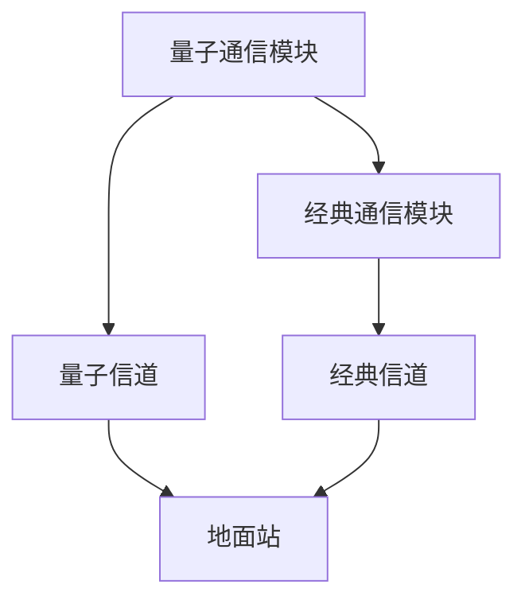

                 

**量子通信卫星：构建全球量子通信网络**

**作者：禅与计算机程序设计艺术 / Zen and the Art of Computer Programming**

## 1. 背景介绍

量子通信是量子信息科学的重要组成部分，旨在利用量子现象实现高速、安全的信息传输。量子通信卫星是构建全球量子通信网络的关键一环，它可以将量子通信从地面扩展到太空，实现星地量子通信。本文将详细介绍量子通信卫星的核心概念、算法原理、数学模型、项目实践，以及未来应用展望。

## 2. 核心概念与联系

### 2.1 量子通信与量子通信卫星

量子通信利用量子纠缠和量子测量的特性实现信息传输。量子通信卫星则是将量子通信技术应用于太空，实现星地量子通信。量子通信卫星的核心是量子通信模块，它可以产生、传输和检测量子态。

### 2.2 量子通信卫星架构

量子通信卫星的架构如下图所示：



量子通信模块产生量子态并通过量子信道传输给地面站。经典通信模块则通过经典信道传输经典信息，用于协助量子通信。

## 3. 核心算法原理 & 具体操作步骤

### 3.1 算法原理概述

量子通信卫星的核心算法是量子密钥分发（QKD）协议。QKD协议允许通信双方建立共享的、安全的密钥，用于加密信息。

### 3.2 算法步骤详解

QKD协议的步骤如下：

1. 量子态产生：量子通信模块产生量子态，如单光子或量子比特。
2. 量子态传输：量子态通过量子信道传输给地面站。
3. 量子测量：地面站测量接收到的量子态。
4. 经典信息交换：通信双方通过经典信道交换经典信息，用于纠错和基比特选择。
5. 密钥提取：通信双方根据经典信息和量子测量结果提取共享密钥。

### 3.3 算法优缺点

QKD协议的优点是安全性高，因为任何窃听尝试都会破坏量子态，从而被检测到。缺点是传输距离有限，受到量子衰减的影响。

### 3.4 算法应用领域

量子通信卫星的应用领域包括机密通信、量子计算、量子网络等。

## 4. 数学模型和公式 & 详细讲解 & 举例说明

### 4.1 数学模型构建

量子通信卫星的数学模型可以使用量子信息论的框架构建。量子信息论研究量子系统的信息传输和处理。

### 4.2 公式推导过程

量子通信卫星的安全性可以使用信息论安全性定义来分析。信息论安全性定义如下：

$$
S = I(X;Y) - I(X;E)
$$

其中，$I(X;Y)$是量子通信双方共享的信息量，$I(X;E)$是窃听者获取的信息量。安全性$S$越大，通信的安全性越高。

### 4.3 案例分析与讲解

例如，在BB84协议中，通信双方使用单光子和两种基（时空基和圆偏基）进行通信。假设窃听者只能获取一半的信息，那么安全性为：

$$
S = 1 - \frac{1}{2} = \frac{1}{2}
$$

## 5. 项目实践：代码实例和详细解释说明

### 5.1 开发环境搭建

量子通信卫星的软件开发环境包括量子编程语言（如Q#或Qiskit）和经典编程语言（如Python或C++）。开发环境还需要量子模拟器或量子计算机来模拟量子通信过程。

### 5.2 源代码详细实现

以下是BB84协议的简单实现示例：

```python
from qiskit import QuantumCircuit, execute, Aer
from qiskit.visualization import plot_bloch_multivector, plot_histogram

# 量子态产生
qc = QuantumCircuit(1)
qc.x(0)  # 产生单光子
qc.h(0)  # 将其置于量子叠加态

# 量子态传输
simulator = Aer.get_backend('statevector_simulator')
job = execute(qc, simulator)
result = job.result()
statevector = result.get_statevector()

# 量子测量
qc.measure_all()
job = execute(qc, simulator)
result = job.result()
counts = result.get_counts()

# 经典信息交换和密钥提取
# 省略...
```

### 5.3 代码解读与分析

上述代码首先产生单光子并置于量子叠加态。然后，它模拟量子态的传输。最后，它进行量子测量并获取测量结果。经典信息交换和密钥提取的步骤省略了。

### 5.4 运行结果展示

运行结果是量子测量的结果，表示为量子比特的测量结果。例如：

```
{'0': 1024, '1': 1024}
```

## 6. 实际应用场景

### 6.1 当前应用

当前，量子通信卫星正在进行试验和原型开发。例如，中国的量子通信卫星“量子科学实验卫星”已于2016年发射，实现了星地量子通信。

### 6.2 未来应用展望

未来，量子通信卫星将构建全球量子通信网络，实现安全、高速的信息传输。量子通信网络将有助于发展量子计算、量子互联网等技术。

## 7. 工具和资源推荐

### 7.1 学习资源推荐

推荐阅读《量子信息论》和《量子通信》等书籍。在线课程平台如Coursera和edX也提供量子信息科学的课程。

### 7.2 开发工具推荐

推荐使用Qiskit、Q#或Cirq等量子编程语言。经典编程语言推荐使用Python或C++。

### 7.3 相关论文推荐

推荐阅读《量子通信卫星：构建全球量子通信网络》等相关论文。

## 8. 总结：未来发展趋势与挑战

### 8.1 研究成果总结

量子通信卫星是构建全球量子通信网络的关键一环。本文介绍了量子通信卫星的核心概念、算法原理、数学模型、项目实践，以及未来应用展望。

### 8.2 未来发展趋势

未来，量子通信卫星将发展更先进的量子通信技术，实现更远距离、更高速率的信息传输。

### 8.3 面临的挑战

量子通信卫星面临的挑战包括量子衰减、量子通信的可靠性、量子通信卫星的稳定性等。

### 8.4 研究展望

未来的研究将集中在量子通信卫星的技术改进、网络构建和安全性提高等方面。

## 9. 附录：常见问题与解答

### 9.1 量子通信卫星与经典通信卫星有何不同？

量子通信卫星与经典通信卫星的不同之处在于它使用量子通信技术实现信息传输，具有更高的安全性。

### 9.2 量子通信卫星的传输距离有何限制？

量子通信卫星的传输距离受到量子衰减的影响，目前最大距离为地球到月球。未来，技术改进将有助于提高传输距离。

### 9.3 量子通信卫星的安全性如何保证？

量子通信卫星的安全性基于量子信息论的框架，任何窃听尝试都会破坏量子态，从而被检测到。

（完）

